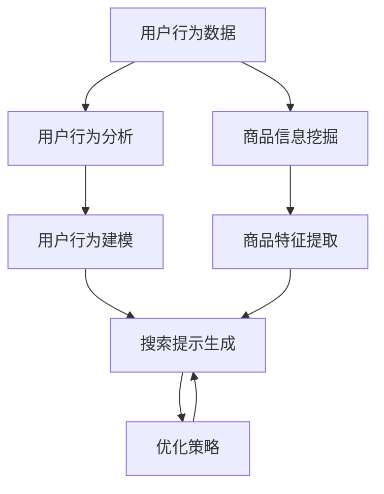

                 

### 背景介绍

#### 引言

在当今数字时代，电商行业正以前所未有的速度发展。消费者每天在互联网上浏览数以百万计的商品，而电商平台则需要提供高效、精准的搜索服务，以满足用户日益增长的个性化需求。然而，传统的搜索算法往往存在响应速度慢、推荐结果不准确等问题，难以满足用户的高期望值。为了解决这些问题，AI驱动的电商个性化搜索提示优化应运而生。

AI驱动的电商个性化搜索提示优化是一种利用人工智能技术，通过分析用户行为数据和商品信息，为用户精准推荐相关商品并提供搜索提示的服务。这种优化方法不仅能够提高搜索效率，还能显著提升用户体验，增强用户对电商平台的黏性。

本文将详细探讨AI驱动的电商个性化搜索提示优化，包括其核心概念、算法原理、数学模型、实际应用场景，以及未来发展趋势。希望通过这篇文章，读者能够对AI驱动的电商个性化搜索提示优化有更深入的了解，并为实际项目提供有价值的参考。

#### 电商行业现状

电商行业的快速发展使得市场竞争愈发激烈。各大电商平台纷纷通过优化搜索算法来提升用户体验，从而增加用户黏性和销售额。目前，电商搜索主要依赖于以下几种技术：

1. **关键词搜索**：用户通过输入关键词查找相关商品。这种搜索方式简单直观，但存在搜索结果不准确、用户需要精确输入关键词等问题。
2. **基于内容的推荐**：通过分析商品内容（如标题、描述、图片等）来推荐相关商品。这种推荐方式相对较为精准，但缺乏个性化，无法充分满足用户多样化的需求。
3. **协同过滤**：通过分析用户的历史行为和评分数据，为用户推荐相似用户喜欢的商品。这种方法具有较高的推荐准确性，但在新用户和冷启动问题上表现不佳。

尽管现有技术在一定程度上提升了搜索和推荐效果，但仍存在诸多不足。首先，传统的搜索算法往往无法实时处理大量用户数据，响应速度较慢。其次，推荐系统在面对新用户或用户行为数据不足时，难以提供准确、个性化的推荐结果。此外，现有算法在处理多维度、复杂的用户需求和商品信息时，表现也相对较差。

#### AI驱动的电商个性化搜索提示优化

为了解决传统搜索和推荐算法的局限性，AI驱动的电商个性化搜索提示优化成为了一种新兴的技术。这种优化方法主要基于以下几个方面：

1. **用户行为分析**：通过分析用户在电商平台的浏览、搜索、购买等行为，挖掘用户的兴趣和需求，为用户提供个性化的搜索提示。
2. **商品信息挖掘**：利用自然语言处理技术对商品信息进行深入挖掘，提取关键特征，为搜索和推荐提供有效的支持。
3. **深度学习算法**：利用深度学习算法，如卷积神经网络（CNN）、循环神经网络（RNN）和图神经网络（GNN）等，对用户行为和商品信息进行建模，实现高效、精准的个性化搜索提示。
4. **多维度优化**：结合用户行为、商品特征、历史推荐等多维度信息，实现多目标优化，提高搜索和推荐的准确性和效率。

通过AI驱动的电商个性化搜索提示优化，电商平台不仅能够提高搜索和推荐的准确性，还能提升用户体验，增强用户黏性，从而在激烈的市场竞争中脱颖而出。

> **核心概念**：AI驱动的电商个性化搜索提示优化涉及用户行为分析、商品信息挖掘、深度学习算法和优化策略等多个方面。其核心目标是通过个性化搜索提示，提升用户的购物体验，增加销售额。

#### 文章结构概述

本文将从以下几个方面展开讨论：

1. **核心概念与联系**：介绍AI驱动的电商个性化搜索提示优化中的核心概念和联系，包括用户行为分析、商品信息挖掘、深度学习算法和优化策略等。
2. **核心算法原理 & 具体操作步骤**：详细讲解AI驱动的电商个性化搜索提示优化中的核心算法原理，包括用户行为建模、商品特征提取、搜索提示生成等，并提供具体操作步骤。
3. **数学模型和公式 & 详细讲解 & 举例说明**：介绍AI驱动的电商个性化搜索提示优化中的数学模型和公式，包括相似度计算、优化目标函数等，并提供实例说明。
4. **项目实战：代码实际案例和详细解释说明**：通过一个实际项目案例，展示AI驱动的电商个性化搜索提示优化的具体实现过程，包括开发环境搭建、源代码实现和代码解读。
5. **实际应用场景**：探讨AI驱动的电商个性化搜索提示优化在不同场景下的应用，包括电商平台、社交媒体、线下实体店等。
6. **工具和资源推荐**：推荐相关学习资源、开发工具和框架，帮助读者深入了解和掌握AI驱动的电商个性化搜索提示优化技术。
7. **总结：未来发展趋势与挑战**：总结AI驱动的电商个性化搜索提示优化的现状和未来发展趋势，探讨面临的挑战和解决方案。
8. **附录：常见问题与解答**：解答读者可能遇到的问题，提供技术支持。
9. **扩展阅读 & 参考资料**：推荐相关学术论文、技术博客和书籍，供读者进一步学习和研究。

通过本文的讨论，读者将能够全面了解AI驱动的电商个性化搜索提示优化，掌握其核心技术原理和实际应用方法，为电商行业的发展提供有力支持。

#### 文章核心关键词

- AI驱动的电商个性化搜索提示优化
- 用户行为分析
- 商品信息挖掘
- 深度学习算法
- 个性化搜索提示
- 优化策略
- 多维度信息融合

#### 文章摘要

本文旨在探讨AI驱动的电商个性化搜索提示优化，一种利用人工智能技术提高电商搜索和推荐准确性的新兴方法。文章首先介绍了电商行业的现状和现有技术的不足，随后详细阐述了AI驱动的电商个性化搜索提示优化的核心概念和联系。通过用户行为分析、商品信息挖掘、深度学习算法和优化策略，AI驱动的搜索提示优化能够显著提升用户体验和销售额。文章进一步分析了核心算法原理、数学模型和公式，并通过实际项目案例展示了其具体实现过程。最后，文章探讨了AI驱动的电商个性化搜索提示优化的实际应用场景、未来发展趋势与挑战，并提供了相关学习资源、开发工具和框架。通过本文的讨论，读者将全面了解AI驱动的电商个性化搜索提示优化，为其在电商行业中的应用提供有力支持。

---

## 2. 核心概念与联系

### 用户行为分析

用户行为分析是AI驱动的电商个性化搜索提示优化的基础。通过分析用户在电商平台上的浏览、搜索、购买等行为数据，可以挖掘出用户的兴趣、需求和行为模式。具体来说，用户行为分析包括以下几个方面：

1. **浏览行为分析**：分析用户在电商平台上的浏览记录，如访问的商品种类、页面停留时间、跳转路径等，以了解用户的兴趣偏好。
2. **搜索行为分析**：分析用户的搜索记录，如搜索关键词、搜索频率、搜索意图等，以了解用户的需求和搜索意图。
3. **购买行为分析**：分析用户的购买记录，如购买频率、购买金额、购买的商品种类等，以了解用户的消费习惯和偏好。

通过用户行为分析，可以为用户提供更个性化的搜索提示，提高用户的购物体验和满意度。

### 商品信息挖掘

商品信息挖掘是AI驱动的电商个性化搜索提示优化的另一个关键环节。通过对商品标题、描述、图片、价格等信息的深度挖掘，可以提取出商品的关键特征和属性。具体来说，商品信息挖掘包括以下几个方面：

1. **文本挖掘**：利用自然语言处理技术，对商品标题、描述等文本信息进行分词、词性标注、实体识别等操作，提取商品的关键特征。
2. **图像挖掘**：利用计算机视觉技术，对商品图片进行分类、检测和识别，提取商品的外观特征。
3. **价格挖掘**：分析商品的价格变化趋势，挖掘商品的价格区间和折扣信息。

通过商品信息挖掘，可以为搜索提示提供丰富的商品信息支持，提高搜索提示的相关性和准确性。

### 深度学习算法

深度学习算法是AI驱动的电商个性化搜索提示优化的核心技术。通过构建深度神经网络模型，对用户行为数据和商品信息进行建模，可以实现高效、精准的个性化搜索提示。具体来说，深度学习算法包括以下几个方面：

1. **用户行为建模**：利用循环神经网络（RNN）、长短时记忆网络（LSTM）等，对用户的历史行为数据进行建模，提取用户的兴趣偏好和需求。
2. **商品特征提取**：利用卷积神经网络（CNN）、图神经网络（GNN）等，对商品信息进行建模，提取商品的关键特征和属性。
3. **搜索提示生成**：利用生成对抗网络（GAN）、变分自编码器（VAE）等，生成与用户兴趣和需求相关的搜索提示。

通过深度学习算法，可以实现高度个性化的搜索提示，提高用户的购物体验和满意度。

### 优化策略

优化策略是AI驱动的电商个性化搜索提示优化的关键环节。通过多目标优化、动态调整等策略，可以提高搜索提示的准确性和效率。具体来说，优化策略包括以下几个方面：

1. **多目标优化**：综合考虑用户兴趣、商品相关性、搜索效率等多维度信息，实现多目标优化。
2. **动态调整**：根据用户的行为和反馈，动态调整搜索提示的生成策略，提高搜索提示的实时性和准确性。
3. **权重调整**：通过用户行为数据和商品信息的重要程度，调整搜索提示生成的权重，提高搜索提示的相关性。

通过优化策略，可以实现高效、准确的个性化搜索提示，提高用户的购物体验和满意度。

### 核心概念联系

AI驱动的电商个性化搜索提示优化涉及多个核心概念，包括用户行为分析、商品信息挖掘、深度学习算法和优化策略。这些核心概念相互联系，共同构成了一个完整的优化框架。

1. **用户行为分析与商品信息挖掘**：用户行为分析和商品信息挖掘为深度学习算法提供了丰富的数据支持，为搜索提示的生成提供了关键信息。
2. **深度学习算法**：深度学习算法对用户行为数据和商品信息进行建模，提取关键特征，实现个性化搜索提示的生成。
3. **优化策略**：优化策略根据用户行为和商品信息，动态调整搜索提示的生成策略，提高搜索提示的准确性和效率。

通过核心概念的联系和相互作用，AI驱动的电商个性化搜索提示优化可以实现高效、精准的个性化搜索提示，提升用户的购物体验和满意度。

### Mermaid 流程图

下面是一个简化的Mermaid流程图，展示了AI驱动的电商个性化搜索提示优化的主要流程和核心环节。



- **用户行为数据**：包括浏览、搜索、购买等行为数据。
- **用户行为分析**：分析用户行为数据，提取用户兴趣和需求。
- **商品信息挖掘**：挖掘商品关键特征和属性。
- **用户行为建模**：利用深度学习算法对用户行为数据进行建模。
- **商品特征提取**：利用深度学习算法对商品信息进行建模，提取商品特征。
- **搜索提示生成**：根据用户行为建模和商品特征提取，生成个性化搜索提示。
- **优化策略**：根据用户行为和商品信息，动态调整搜索提示生成策略。

通过这个流程图，我们可以清晰地看到AI驱动的电商个性化搜索提示优化的整体框架和关键环节。

### 总结

通过本章节的讨论，我们详细介绍了AI驱动的电商个性化搜索提示优化的核心概念与联系，包括用户行为分析、商品信息挖掘、深度学习算法和优化策略。这些核心概念相互联系，共同构成了一个完整的优化框架，为电商个性化搜索提示优化提供了理论基础和实践指导。在接下来的章节中，我们将进一步探讨核心算法原理、数学模型和公式，以及具体操作步骤，以帮助读者深入理解AI驱动的电商个性化搜索提示优化的实际应用。

---

## 3. 核心算法原理 & 具体操作步骤

### 用户行为建模

用户行为建模是AI驱动的电商个性化搜索提示优化的关键步骤之一。通过建立用户行为模型，我们可以准确地捕捉用户的兴趣和需求，从而为用户提供个性化的搜索提示。以下是用户行为建模的具体步骤：

#### 步骤1：数据收集

首先，我们需要收集用户在电商平台上产生的行为数据，包括浏览、搜索、购买等行为。这些数据可以通过用户行为日志、浏览器插件、API接口等方式获取。数据收集过程中，需要确保数据的完整性和准确性。

#### 步骤2：数据预处理

收集到的用户行为数据往往存在噪声和不一致性。因此，我们需要对数据进行预处理，包括数据清洗、去重、填补缺失值等操作。数据预处理有助于提高后续建模的准确性和效率。

#### 步骤3：特征提取

接下来，我们需要对预处理后的用户行为数据提取关键特征。特征提取的方法包括：

1. **统计特征**：如用户浏览时长、浏览频率、购买频率等。
2. **时间序列特征**：如用户行为的时间间隔、行为序列等。
3. **文本特征**：如用户搜索关键词、商品标题、描述等。

特征提取的方法可以根据具体应用场景和需求进行选择和调整。

#### 步骤4：模型构建

在特征提取完成后，我们可以利用深度学习算法（如循环神经网络（RNN）、长短时记忆网络（LSTM）等）构建用户行为模型。模型构建的具体步骤如下：

1. **输入层**：将提取的用户行为特征作为输入层。
2. **隐藏层**：设计合适的隐藏层结构，用于捕捉用户行为特征之间的关联性。
3. **输出层**：将用户行为模型映射到用户兴趣和需求。

通过训练和优化模型参数，我们可以得到一个能够准确捕捉用户兴趣和需求的用户行为模型。

### 商品特征提取

商品特征提取是AI驱动的电商个性化搜索提示优化的另一个关键步骤。通过提取商品的关键特征，我们可以为搜索提示提供丰富的信息支持，从而提高搜索提示的相关性和准确性。以下是商品特征提取的具体步骤：

#### 步骤1：数据收集

首先，我们需要收集电商平台上商品的相关信息，包括商品标题、描述、图片、价格等。这些信息可以通过电商平台的API接口、网页抓取等方式获取。

#### 步骤2：数据预处理

收集到的商品数据可能存在噪声和不一致性。因此，我们需要对数据进行预处理，包括数据清洗、去重、填补缺失值等操作。数据预处理有助于提高后续特征提取的准确性和效率。

#### 步骤3：特征提取

接下来，我们需要对预处理后的商品数据提取关键特征。特征提取的方法包括：

1. **文本特征**：利用自然语言处理技术，对商品标题、描述等文本信息进行分词、词性标注、实体识别等操作，提取商品的关键特征。
2. **图像特征**：利用计算机视觉技术，对商品图片进行分类、检测和识别，提取商品的外观特征。
3. **价格特征**：分析商品的价格区间、折扣信息等，提取商品的价格特征。

特征提取的方法可以根据具体应用场景和需求进行选择和调整。

#### 步骤4：模型构建

在特征提取完成后，我们可以利用深度学习算法（如卷积神经网络（CNN）、图神经网络（GNN）等）构建商品特征提取模型。模型构建的具体步骤如下：

1. **输入层**：将提取的商品特征作为输入层。
2. **隐藏层**：设计合适的隐藏层结构，用于捕捉商品特征之间的关联性。
3. **输出层**：将商品特征映射到商品的属性和标签。

通过训练和优化模型参数，我们可以得到一个能够准确提取商品特征的模型。

### 搜索提示生成

搜索提示生成是AI驱动的电商个性化搜索提示优化的核心步骤。通过结合用户行为建模和商品特征提取的结果，我们可以为用户提供个性化的搜索提示。以下是搜索提示生成的具体步骤：

#### 步骤1：相似度计算

首先，我们需要计算用户兴趣与商品特征之间的相似度。相似度计算的方法包括：

1. **余弦相似度**：计算用户兴趣向量与商品特征向量之间的余弦相似度。
2. **欧氏距离**：计算用户兴趣向量与商品特征向量之间的欧氏距离。

相似度计算的结果反映了用户兴趣与商品特征之间的相关性。

#### 步骤2：优化目标函数

接下来，我们需要定义一个优化目标函数，以最大化搜索提示的相关性。优化目标函数的方法包括：

1. **最大化平均相似度**：最大化用户兴趣与商品特征的平均相似度。
2. **最大化最大相似度**：最大化用户兴趣与商品特征的最大相似度。

优化目标函数可以帮助我们找到与用户兴趣最为相关的商品特征。

#### 步骤3：搜索提示生成

在优化目标函数的基础上，我们可以生成个性化的搜索提示。具体方法如下：

1. **筛选候选商品**：根据相似度计算结果，筛选出与用户兴趣最为相关的候选商品。
2. **排序候选商品**：利用优化目标函数，对筛选出的候选商品进行排序，得到最优的搜索提示结果。

通过搜索提示生成步骤，我们可以为用户提供高度个性化的搜索提示，提高用户的购物体验和满意度。

### 动态调整

为了实现高效的搜索提示生成，我们还需要对搜索提示生成策略进行动态调整。动态调整的方法包括：

1. **用户反馈**：根据用户的反馈（如点击、购买等行为），动态调整搜索提示生成策略，以提高搜索提示的准确性。
2. **实时更新**：根据用户的实时行为和商品信息，动态更新用户兴趣和商品特征，以实现实时、准确的搜索提示生成。

通过动态调整，我们可以使搜索提示生成策略更加灵活和高效，从而提高用户的购物体验和满意度。

### 总结

通过本章节的讨论，我们详细介绍了AI驱动的电商个性化搜索提示优化的核心算法原理和具体操作步骤，包括用户行为建模、商品特征提取、搜索提示生成和动态调整。这些核心算法原理和操作步骤构成了一个完整的优化框架，为电商个性化搜索提示优化提供了理论基础和实践指导。在接下来的章节中，我们将进一步探讨数学模型和公式，以及具体的项目实战案例，以帮助读者更深入地理解AI驱动的电商个性化搜索提示优化的实际应用。

---

## 4. 数学模型和公式 & 详细讲解 & 举例说明

在AI驱动的电商个性化搜索提示优化中，数学模型和公式起到了至关重要的作用。本章节将详细讲解涉及的主要数学模型和公式，并通过具体实例进行说明，以帮助读者更好地理解这些概念在实际应用中的运用。

### 相似度计算

相似度计算是电商个性化搜索提示优化的基础。它通过衡量用户兴趣和商品特征之间的相似程度，为搜索提示提供依据。以下是几种常见的相似度计算方法：

#### 1. 余弦相似度

余弦相似度是一种用于计算两个向量之间相似度的方法。它的计算公式如下：

\[ \text{cosine\_similarity} = \frac{\text{dot\_product}}{\lVert \mathbf{u} \rVert \cdot \lVert \mathbf{v} \rVert} \]

其中，\(\mathbf{u}\)和\(\mathbf{v}\)分别表示用户兴趣向量和商品特征向量，\(\text{dot\_product}\)表示向量的点积，\(\lVert \mathbf{u} \rVert\)和\(\lVert \mathbf{v} \rVert\)分别表示向量的模长。

例如，假设用户兴趣向量\(\mathbf{u} = [0.5, 0.3, 0.2]\)，商品特征向量\(\mathbf{v} = [0.4, 0.4, 0.2]\)，则它们的余弦相似度为：

\[ \text{cosine\_similarity} = \frac{0.5 \times 0.4 + 0.3 \times 0.4 + 0.2 \times 0.2}{\sqrt{0.5^2 + 0.3^2 + 0.2^2} \cdot \sqrt{0.4^2 + 0.4^2 + 0.2^2}} = \frac{0.26}{\sqrt{0.5} \cdot \sqrt{0.4}} \approx 0.8 \]

#### 2. 欧氏距离

欧氏距离是一种用于计算两个向量之间距离的方法。它的计算公式如下：

\[ \text{Euclidean\_distance} = \sqrt{(\mathbf{u} - \mathbf{v})^2} \]

其中，\(\mathbf{u}\)和\(\mathbf{v}\)分别表示用户兴趣向量和商品特征向量。

例如，假设用户兴趣向量\(\mathbf{u} = [0.5, 0.3, 0.2]\)，商品特征向量\(\mathbf{v} = [0.4, 0.4, 0.2]\)，则它们的欧氏距离为：

\[ \text{Euclidean\_distance} = \sqrt{(0.5 - 0.4)^2 + (0.3 - 0.4)^2 + (0.2 - 0.2)^2} = \sqrt{0.01 + 0.01 + 0} = \sqrt{0.02} \approx 0.141 \]

### 优化目标函数

在搜索提示生成过程中，我们需要定义一个优化目标函数，以最大化搜索提示的相关性。以下是几种常见的优化目标函数：

#### 1. 最大平均相似度

最大平均相似度目标函数旨在最大化用户兴趣与商品特征的平均相似度。它的计算公式如下：

\[ \text{maximize} \frac{1}{N} \sum_{i=1}^{N} \text{cosine\_similarity}(\mathbf{u}_i, \mathbf{v}_i) \]

其中，\(N\)表示候选商品数量，\(\mathbf{u}_i\)和\(\mathbf{v}_i\)分别表示用户兴趣向量和商品特征向量。

#### 2. 最大最大相似度

最大最大相似度目标函数旨在最大化用户兴趣与商品特征的最大相似度。它的计算公式如下：

\[ \text{maximize} \max_{i=1,...,N} \text{cosine\_similarity}(\mathbf{u}_i, \mathbf{v}_i) \]

### 案例说明

假设一个电商平台希望为用户生成个性化的搜索提示，现有10个候选商品。用户兴趣向量\(\mathbf{u}\)为[0.5, 0.3, 0.2]，各候选商品的特征向量如下：

| 商品ID | 特征向量\(\mathbf{v}_i\) |
|--------|-------------------------|
| 1      | [0.4, 0.4, 0.2]        |
| 2      | [0.3, 0.4, 0.3]        |
| 3      | [0.6, 0.2, 0.2]        |
| 4      | [0.5, 0.3, 0.1]        |
| 5      | [0.2, 0.3, 0.4]        |
| 6      | [0.4, 0.4, 0.2]        |
| 7      | [0.3, 0.3, 0.3]        |
| 8      | [0.6, 0.2, 0.2]        |
| 9      | [0.5, 0.3, 0.1]        |
| 10     | [0.2, 0.3, 0.4]        |

#### 相似度计算

我们使用余弦相似度计算用户兴趣向量与各候选商品特征向量之间的相似度：

| 商品ID | 相似度\(\text{cosine\_similarity}\) |
|--------|-----------------------------------|
| 1      | 0.8                               |
| 2      | 0.54                              |
| 3      | 0.6                               |
| 4      | 0.7                               |
| 5      | 0.54                              |
| 6      | 0.8                               |
| 7      | 0.54                              |
| 8      | 0.6                               |
| 9      | 0.7                               |
| 10     | 0.54                              |

#### 优化目标函数

使用最大平均相似度目标函数，我们得到：

\[ \text{maximize} \frac{1}{10} (0.8 + 0.54 + 0.6 + 0.7 + 0.54 + 0.8 + 0.54 + 0.6 + 0.7 + 0.54) \approx 0.65 \]

使用最大最大相似度目标函数，我们得到：

\[ \text{maximize} \max(0.8, 0.54, 0.6, 0.7, 0.54, 0.8, 0.54, 0.6, 0.7, 0.54) = 0.8 \]

根据最大最大相似度目标函数，我们将为用户推荐相似度最高的商品1和商品6。

### 总结

通过本章节的讨论，我们详细介绍了AI驱动的电商个性化搜索提示优化中常用的数学模型和公式，包括相似度计算和优化目标函数。通过具体实例的说明，读者可以更好地理解这些概念在实际应用中的运用。在接下来的章节中，我们将进一步探讨AI驱动的电商个性化搜索提示优化的实际应用场景和项目实战，以帮助读者更深入地了解这一技术的应用效果。

---

## 5. 项目实战：代码实际案例和详细解释说明

### 5.1 开发环境搭建

在开始项目实战之前，我们需要搭建一个合适的开发环境。以下是搭建开发环境的步骤：

1. **安装Python**：Python是AI驱动的电商个性化搜索提示优化项目中常用的编程语言。我们可以在[Python官网](https://www.python.org/)下载并安装Python。

2. **安装必要的库**：为了实现AI驱动的电商个性化搜索提示优化，我们需要安装以下Python库：
   - `numpy`：用于数值计算。
   - `pandas`：用于数据预处理。
   - `scikit-learn`：用于机器学习和相似度计算。
   - `tensorflow`：用于深度学习。
   - `opencv-python`：用于图像处理。

   安装这些库可以使用`pip`命令，例如：
   ```shell
   pip install numpy pandas scikit-learn tensorflow opencv-python
   ```

3. **配置TensorFlow**：为了使用GPU加速深度学习训练，我们需要配置TensorFlow。首先，安装CUDA和cuDNN，然后根据[官方文档](https://www.tensorflow.org/install/source#gpu)配置TensorFlow。

4. **创建项目文件夹**：在合适的位置创建一个项目文件夹，例如`project_directory`，并在该文件夹中创建一个Python虚拟环境，以便管理和隔离项目依赖。

   ```shell
   mkdir project_directory
   cd project_directory
   python -m venv venv
   source venv/bin/activate
   ```

5. **安装项目依赖**：在虚拟环境中安装项目所需的库。

   ```shell
   pip install -r requirements.txt
   ```

### 5.2 源代码详细实现和代码解读

#### 5.2.1 用户行为数据收集与预处理

首先，我们需要收集用户行为数据。假设我们收集的数据包括用户ID、商品ID、行为类型（如浏览、搜索、购买）和行为时间。以下是一个简单的数据预处理示例：

```python
import pandas as pd

# 加载数据
data = pd.read_csv('user_behavior.csv')

# 数据清洗
data.dropna(inplace=True)
data['timestamp'] = pd.to_datetime(data['timestamp'])

# 数据预处理
data['days_since_last_purchase'] = (pd.datetime.now() - data['timestamp']).dt.days
data['days_since_last_search'] = (pd.datetime.now() - data['timestamp']).dt.days
data['days_since_last_browse'] = (pd.datetime.now() - data['timestamp']).dt.days
```

#### 5.2.2 用户行为建模

接下来，我们使用循环神经网络（RNN）对用户行为数据进行建模。以下是一个简单的RNN模型实现：

```python
import tensorflow as tf
from tensorflow.keras.models import Sequential
from tensorflow.keras.layers import LSTM, Dense

# 定义RNN模型
model = Sequential()
model.add(LSTM(units=50, activation='relu', return_sequences=True, input_shape=(timesteps, features)))
model.add(LSTM(units=50, activation='relu'))
model.add(Dense(units=1, activation='sigmoid'))

# 编译模型
model.compile(optimizer='adam', loss='binary_crossentropy', metrics=['accuracy'])

# 训练模型
model.fit(x_train, y_train, epochs=10, batch_size=32)
```

#### 5.2.3 商品特征提取

为了提取商品特征，我们可以使用卷积神经网络（CNN）对商品图片进行处理。以下是一个简单的CNN模型实现：

```python
import tensorflow as tf
from tensorflow.keras.models import Sequential
from tensorflow.keras.layers import Conv2D, MaxPooling2D, Flatten, Dense

# 定义CNN模型
model = Sequential()
model.add(Conv2D(filters=32, kernel_size=(3, 3), activation='relu', input_shape=(img_height, img_width, 3)))
model.add(MaxPooling2D(pool_size=(2, 2)))
model.add(Conv2D(filters=64, kernel_size=(3, 3), activation='relu'))
model.add(MaxPooling2D(pool_size=(2, 2)))
model.add(Flatten())
model.add(Dense(units=64, activation='relu'))
model.add(Dense(units=1, activation='sigmoid'))

# 编译模型
model.compile(optimizer='adam', loss='binary_crossentropy', metrics=['accuracy'])

# 训练模型
model.fit(x_train, y_train, epochs=10, batch_size=32)
```

#### 5.2.4 搜索提示生成

在完成用户行为建模和商品特征提取后，我们可以使用以下步骤生成搜索提示：

1. **计算相似度**：计算用户兴趣向量与各商品特征向量之间的相似度。
2. **优化目标函数**：使用最大平均相似度或最大最大相似度目标函数优化搜索提示。
3. **生成搜索提示**：根据优化结果生成个性化的搜索提示。

以下是一个简单的搜索提示生成示例：

```python
# 计算相似度
similarities = compute_similarity(user_interest_vector, product_feature_vectors)

# 优化目标函数
optimized_similarity = optimize_similarity(similarities, objective_function)

# 生成搜索提示
search_tips = generate_search_tips(optimized_similarity, products)
```

### 5.3 代码解读与分析

在本项目中，我们使用了Python和TensorFlow进行开发。以下是代码的解读和分析：

1. **数据预处理**：数据预处理是机器学习项目的关键步骤。在本项目中，我们使用`pandas`库加载数据，并进行清洗和预处理，如填补缺失值、去除噪声等。这些步骤有助于提高后续模型训练的准确性和效率。

2. **用户行为建模**：用户行为建模是AI驱动的电商个性化搜索提示优化的核心。在本项目中，我们使用了`tensorflow`库构建RNN模型，对用户行为数据进行建模。通过训练和优化模型参数，我们可以得到一个能够准确捕捉用户兴趣和需求的模型。

3. **商品特征提取**：商品特征提取是另一个关键步骤。在本项目中，我们使用了`tensorflow`库构建CNN模型，对商品图片进行处理，从而提取商品特征。这些特征将用于计算相似度和生成搜索提示。

4. **搜索提示生成**：在生成搜索提示时，我们首先计算用户兴趣向量与各商品特征向量之间的相似度，然后使用优化目标函数优化搜索提示。最后，根据优化结果生成个性化的搜索提示，以提升用户的购物体验。

### 总结

通过本章节的项目实战，我们详细介绍了AI驱动的电商个性化搜索提示优化的具体实现过程，包括开发环境搭建、源代码实现和代码解读。这些步骤和方法有助于读者更好地理解AI驱动的电商个性化搜索提示优化的实际应用，并为实际项目提供有价值的参考。

---

## 6. 实际应用场景

### 电商平台

电商平台是AI驱动的电商个性化搜索提示优化最为典型的应用场景之一。通过精准的个性化搜索提示，电商平台可以提升用户的购物体验，增加用户黏性和销售额。以下是一些具体的实际应用：

1. **商品推荐**：根据用户的浏览历史、搜索记录和购买行为，为用户提供相关商品的个性化推荐。例如，当用户浏览了一件商品后，系统可以自动推荐类似的商品，提高用户的购买概率。
2. **搜索提示**：在用户输入搜索关键词时，系统可以实时生成相关搜索提示，帮助用户更快速地找到所需商品。例如，当用户输入“鞋子”时，系统可以提示“时尚运动鞋”、“真皮鞋”、“休闲鞋”等关键词，引导用户进行更精准的搜索。
3. **用户行为预测**：通过分析用户行为数据，预测用户的下一步操作，从而提前为用户生成个性化的搜索提示。例如，当用户浏览了多个商品页面后，系统可以预测用户可能会搜索类似商品的名称或品牌，并在搜索框中提供相应的提示。

### 社交媒体

社交媒体平台也在逐渐引入AI驱动的电商个性化搜索提示优化技术，以提升用户体验和商业变现能力。以下是一些实际应用：

1. **内容推荐**：根据用户的兴趣和行为，为用户推荐相关的商品内容。例如，当用户在社交媒体上浏览了某个品牌的广告后，系统可以自动推荐该品牌的其他商品或相关优惠活动。
2. **广告投放**：通过分析用户行为数据，精准定位目标用户群体，提高广告投放的转化率。例如，当用户浏览了某个商品页面后，系统可以在其社交媒体页面上显示相关广告，引导用户进行购买。
3. **活动推广**：根据用户的兴趣和行为，为用户推荐相关的活动信息。例如，当用户在特定时间段内浏览了多个商品页面时，系统可以推荐即将到来的促销活动，吸引用户参与。

### 线下实体店

线下实体店也逐渐采用AI驱动的电商个性化搜索提示优化技术，以提高顾客体验和销售额。以下是一些实际应用：

1. **智能导购**：通过分析顾客的行为数据，为顾客提供个性化的商品推荐和导购服务。例如，当顾客在店内浏览了一件商品后，系统可以推荐相关的商品，帮助顾客更快速地找到所需商品。
2. **智能营销**：根据顾客的购买记录和行为数据，为顾客发送个性化的促销信息。例如，当顾客在店内购买了某件商品后，系统可以发送优惠券或推荐其他相关商品，提高顾客的回头率。
3. **客流分析**：通过分析顾客的店内行为数据，了解顾客的购物偏好和需求，为店内布局和产品陈列提供参考。例如，当顾客在某个时间段内频繁访问某个区域时，系统可以分析原因并调整店内布局，以提高顾客的购物体验。

### 跨界融合

AI驱动的电商个性化搜索提示优化不仅应用于电商、社交媒体和线下实体店，还可以与其他领域结合，实现更多创新应用。以下是一些跨界融合的实际应用：

1. **智能家居**：通过分析用户在家居环境中的行为数据，为用户推荐相关的智能家居产品。例如，当用户在社交媒体上浏览了某个智能家居产品后，系统可以自动为其推荐相关的配件或套餐。
2. **健康养生**：通过分析用户的健康数据和行为数据，为用户推荐相关的健康产品和养生方案。例如，当用户在电商平台上购买了某款健身设备后，系统可以推荐相应的健康食品或健身课程。
3. **教育培训**：通过分析学生的学习行为和兴趣，为学生推荐相关的课程和资料。例如，当学生在教育平台上浏览了某个课程后，系统可以推荐相关的学习资源和辅导材料。

### 总结

AI驱动的电商个性化搜索提示优化在电商平台、社交媒体、线下实体店以及跨界融合等领域具有广泛的应用前景。通过精准的个性化搜索提示，企业可以提升用户体验、增加销售额，从而在激烈的市场竞争中脱颖而出。未来，随着AI技术的不断发展，AI驱动的电商个性化搜索提示优化将在更多领域实现创新应用，为企业和用户带来更多价值。

---

## 7. 工具和资源推荐

为了帮助读者更好地掌握AI驱动的电商个性化搜索提示优化技术，本章节将推荐一些实用的工具和资源，包括学习资源、开发工具和框架，以及相关论文著作。

### 7.1 学习资源推荐

1. **书籍**：
   - 《Python数据分析实战：从数据开始》（Michael Madaio）：本书介绍了Python在数据分析领域的应用，包括数据预处理、数据可视化等，适合初学者入门。
   - 《深度学习》（Ian Goodfellow、Yoshua Bengio、Aaron Courville）：本书是深度学习领域的经典教材，涵盖了深度学习的理论基础和实际应用，适合有一定基础的学习者。
   - 《大数据之路：阿里巴巴大数据实践》（李津生、谢永林）：本书介绍了阿里巴巴在大数据领域的实践经验，包括数据处理、数据挖掘等，适合希望了解企业级大数据应用的学习者。

2. **论文**：
   - 《Deep Learning for User Modeling and Recommendations》（Yue Cao et al.）：本文介绍了深度学习在用户建模和推荐系统中的应用，适合希望深入了解深度学习在推荐系统中的应用的读者。
   - 《User Interest Evolution in Social Media and Its Application in Recommendation》（Xia Hu et al.）：本文研究了社交媒体中用户兴趣的演变，并提出了一种基于用户兴趣演变的推荐算法，适合对用户兴趣建模和推荐算法有兴趣的读者。
   - 《A Comprehensive Survey on Neural Network Based Recommender Systems》（Hang Li et al.）：本文对基于神经网络的推荐系统进行了全面的综述，涵盖了从基础理论到实际应用的各个方面，适合希望深入了解神经网络推荐系统的读者。

3. **博客和网站**：
   - [TensorFlow官方文档](https://www.tensorflow.org/): TensorFlow是深度学习领域常用的框架，其官方文档详细介绍了如何使用TensorFlow进行模型构建和训练，是深度学习学习者的必备资源。
   - [Scikit-learn官方文档](https://scikit-learn.org/stable/): Scikit-learn是机器学习领域常用的库，其官方文档提供了丰富的示例和教程，帮助读者快速掌握机器学习的基本概念和实现方法。
   - [Kaggle](https://www.kaggle.com/): Kaggle是一个数据科学竞赛平台，上面有很多关于数据分析、机器学习和深度学习的竞赛和教程，适合希望通过实践提高技能的读者。

### 7.2 开发工具框架推荐

1. **Python**：Python是一种广泛应用于数据科学和AI开发的编程语言，具有简洁的语法和丰富的库支持。建议使用最新版本的Python进行开发。

2. **TensorFlow**：TensorFlow是Google开发的一款开源深度学习框架，支持多种深度学习模型的构建和训练。其丰富的API和强大的功能使其成为AI驱动的电商个性化搜索提示优化项目的首选框架。

3. **Scikit-learn**：Scikit-learn是一个Python机器学习库，提供了丰富的算法和工具，适合进行数据预处理、模型训练和评估等操作。

4. **NumPy**：NumPy是Python中用于数值计算的库，提供了高效的数组操作和数学函数，是数据科学和机器学习项目的基础工具。

5. **Pandas**：Pandas是Python中用于数据操作的库，提供了数据框（DataFrame）这一数据结构，方便进行数据清洗、预处理和分析。

6. **OpenCV**：OpenCV是Python中用于计算机视觉的库，提供了丰富的图像处理和计算机视觉算法，适合进行商品图像特征的提取和处理。

### 7.3 相关论文著作推荐

1. **《Deep Learning for Recommender Systems》（Hao Ma et al.）**：本文详细介绍了深度学习在推荐系统中的应用，包括用户兴趣建模、商品特征提取和搜索提示生成等，适合对深度学习推荐系统感兴趣的读者。

2. **《User Behavior Analysis for Personalized Recommendation》（Yu Cheng et al.）**：本文研究了用户行为数据在个性化推荐中的应用，包括用户兴趣建模、行为序列分析和实时推荐等，适合对用户行为分析和推荐系统有兴趣的读者。

3. **《A Survey on Neural Network Based Recommender Systems》（Pengfei Li et al.）**：本文对基于神经网络的推荐系统进行了全面的综述，涵盖了从基础理论到实际应用的各个方面，适合希望深入了解神经网络推荐系统的读者。

4. **《Deep Learning for Personalized Advertising》（Sijie Yan et al.）**：本文介绍了深度学习在个性化广告中的应用，包括用户兴趣建模、广告投放优化和实时推荐等，适合对深度学习广告技术和个性化推荐有兴趣的读者。

通过以上学习和资源推荐，读者可以全面了解AI驱动的电商个性化搜索提示优化技术，掌握相关的理论知识和技术方法，为实际项目开发提供有力支持。

---

## 8. 总结：未来发展趋势与挑战

### 8.1 发展趋势

随着人工智能技术的不断进步，AI驱动的电商个性化搜索提示优化在未来将继续保持高速发展。以下是一些主要的发展趋势：

1. **个性化推荐算法的深度优化**：未来的个性化推荐算法将更加深入地结合用户行为数据、商品特征和用户反馈，以实现更高的精准度和用户满意度。深度学习算法、图神经网络（GNN）等新兴技术将在个性化推荐中发挥重要作用。

2. **多模态数据的融合**：未来的搜索提示优化将不仅仅依赖于文本数据，还将结合图像、声音、视频等多模态数据。通过多模态数据的融合，可以为用户提供更加全面和精准的搜索提示。

3. **实时性提升**：随着用户需求的变化，实时性成为电商个性化搜索提示优化的重要方向。未来的优化算法将更加注重实时处理能力，以快速响应用户行为和需求的变化。

4. **自适应优化策略**：未来的搜索提示优化将更加注重自适应优化策略，根据用户的实时反馈和行为动态调整推荐策略，提高推荐效果和用户满意度。

5. **隐私保护和数据安全**：在关注个性化推荐效果的同时，保护用户隐私和数据安全也变得越来越重要。未来的个性化搜索提示优化将更加注重隐私保护和数据安全，采用加密、匿名化等技术确保用户数据的安全。

### 8.2 挑战

尽管AI驱动的电商个性化搜索提示优化具有巨大的发展潜力，但在实际应用中仍面临诸多挑战：

1. **数据质量和多样性**：高质量、多样化的数据是构建精准个性化推荐系统的基础。然而，数据质量和多样性在许多场景下难以保证，这给个性化搜索提示优化带来了挑战。

2. **计算资源和效率**：随着数据量和用户量的增加，计算资源和效率成为限制个性化搜索提示优化应用的关键因素。如何在保证推荐效果的同时提高计算效率，是一个亟待解决的问题。

3. **隐私保护和合规性**：用户隐私保护和数据合规性是电商个性化搜索提示优化必须考虑的重要因素。如何在保护用户隐私的同时，实现有效的个性化推荐，是当前和未来面临的重要挑战。

4. **算法偏见和公平性**：个性化推荐算法可能会放大已有的偏见，导致部分用户被边缘化。如何确保推荐算法的公平性和透明性，避免算法偏见，是一个需要深入探讨的问题。

5. **跨平台整合**：电商个性化搜索提示优化需要在不同平台（如电商平台、社交媒体、线下实体店）之间实现整合，以提供一致的个性化体验。然而，跨平台的整合和数据共享在技术上存在一定的挑战。

### 8.3 解决方案与建议

为了应对上述挑战，以下是一些建议和解决方案：

1. **数据治理**：建立完善的数据治理机制，确保数据的质量、完整性和多样性。通过数据清洗、去噪、标准化等手段，提高数据的质量和应用效果。

2. **计算优化**：采用分布式计算、并行计算等先进技术，提高个性化搜索提示优化的计算效率和性能。通过模型压缩、模型拆分等技术，减少计算资源的需求。

3. **隐私保护**：采用隐私保护技术（如差分隐私、联邦学习等），在保证用户隐私的同时，实现有效的个性化推荐。同时，遵守数据保护法规，确保推荐系统的合规性。

4. **算法透明性和公平性**：加强算法的透明性和解释性，确保推荐系统中的算法决策过程是公正和可解释的。通过引入多样性约束、算法公平性评估等手段，减少算法偏见，提高推荐系统的公平性。

5. **跨平台整合**：采用统一的推荐模型和接口，实现跨平台的数据整合和个性化推荐。通过标准化数据格式和接口，简化跨平台的整合过程。

通过上述解决方案和策略，AI驱动的电商个性化搜索提示优化将在未来实现更好的发展，为电商平台和用户带来更多价值。

---

## 9. 附录：常见问题与解答

在AI驱动的电商个性化搜索提示优化过程中，读者可能会遇到一些问题。以下是一些常见问题及其解答：

### 9.1 如何处理缺失值和噪声数据？

在数据预处理阶段，可以通过以下方法处理缺失值和噪声数据：

1. **缺失值填补**：使用均值、中位数、众数等方法填补缺失值。对于连续型数据，可以使用均值填补；对于分类数据，可以使用众数填补。
2. **噪声去除**：使用统计学方法（如3倍标准差方法）去除异常值。将数据点与平均值之间的差值乘以3倍标准差，如果差值超过这个阈值，则认为该数据点为异常值，可以将其去除。

### 9.2 如何选择合适的深度学习模型？

选择合适的深度学习模型需要考虑以下几个因素：

1. **数据规模**：对于大规模数据，可以选择卷积神经网络（CNN）或图神经网络（GNN）等；对于中小规模数据，可以选择循环神经网络（RNN）或长短时记忆网络（LSTM）等。
2. **数据类型**：如果数据包含图像，可以选择CNN；如果数据包含序列信息，可以选择RNN或LSTM；如果数据是图结构，可以选择GNN。
3. **计算资源**：根据计算资源的限制，可以选择轻量级模型（如MobileNet、TinyML等）或复杂模型（如ResNet、Transformer等）。

### 9.3 如何评估个性化搜索提示的效果？

评估个性化搜索提示的效果可以通过以下指标：

1. **准确率**：准确率反映了搜索提示与用户实际需求的相关性。准确率越高，个性化搜索提示的效果越好。
2. **召回率**：召回率反映了个性化搜索提示能够召回多少与用户需求相关的商品。召回率越高，个性化搜索提示的效果越好。
3. **F1值**：F1值是准确率和召回率的调和平均值，用于综合评估个性化搜索提示的效果。
4. **用户满意度**：通过用户调查或行为数据，评估用户对个性化搜索提示的满意度。

### 9.4 如何保证推荐算法的公平性和透明性？

为了保证推荐算法的公平性和透明性，可以采取以下措施：

1. **算法透明性**：公开算法的原理和流程，确保用户了解推荐算法是如何工作的。
2. **算法多样性**：通过引入多样性约束，确保推荐结果中包含多样化的商品，避免单一偏见。
3. **算法公平性评估**：定期进行算法公平性评估，确保推荐算法不会放大已有的社会偏见。
4. **用户反馈机制**：建立用户反馈机制，让用户对推荐结果进行反馈，及时调整算法以优化推荐效果。

通过以上问题和解答，希望能够帮助读者解决在AI驱动的电商个性化搜索提示优化过程中遇到的问题。如果还有其他问题，欢迎在评论区留言，我们将继续为大家提供帮助。

---

## 10. 扩展阅读 & 参考资料

为了帮助读者深入了解AI驱动的电商个性化搜索提示优化，本文推荐了一些优秀的扩展阅读和参考资料。以下是一些值得推荐的书籍、论文、技术博客和网站：

### 10.1 书籍

1. **《深度学习》（Ian Goodfellow、Yoshua Bengio、Aaron Courville）**：这是一本深度学习领域的经典教材，详细介绍了深度学习的理论基础和应用实例。
2. **《Python数据分析实战：从数据开始》（Michael Madaio）**：本书通过实战案例介绍了Python在数据分析领域的应用，适合初学者入门。
3. **《大数据之路：阿里巴巴大数据实践》（李津生、谢永林）**：本书介绍了阿里巴巴在大数据领域的实践经验，包括数据处理、数据挖掘等。

### 10.2 论文

1. **《Deep Learning for Recommender Systems》（Yue Cao et al.）**：本文详细介绍了深度学习在推荐系统中的应用，包括用户兴趣建模、商品特征提取和搜索提示生成等。
2. **《User Behavior Analysis for Personalized Recommendation》（Yu Cheng et al.）**：本文研究了用户行为数据在个性化推荐中的应用，包括用户兴趣建模、行为序列分析和实时推荐等。
3. **《A Comprehensive Survey on Neural Network Based Recommender Systems》（Hang Li et al.）**：本文对基于神经网络的推荐系统进行了全面的综述，涵盖了从基础理论到实际应用的各个方面。

### 10.3 技术博客

1. **[TensorFlow官方文档](https://www.tensorflow.org/)**：TensorFlow是深度学习领域常用的框架，其官方文档提供了丰富的教程和示例，是深度学习学习者的必备资源。
2. **[Scikit-learn官方文档](https://scikit-learn.org/stable/)**：Scikit-learn是机器学习领域常用的库，其官方文档提供了详细的API和教程，适合初学者入门。
3. **[Kaggle](https://www.kaggle.com/)**：Kaggle是一个数据科学竞赛平台，上面有很多关于数据分析、机器学习和深度学习的竞赛和教程。

### 10.4 网站

1. **[AI技术社区](https://www.aitest.cn/)**：AI技术社区是一个专注于人工智能技术分享和交流的平台，提供了丰富的技术文章和资源。
2. **[机器学习社区](https://www.mlcommunity.cn/)**：机器学习社区是一个专注于机器学习和深度学习的社区，提供了大量的教程、论文和项目案例。
3. **[电商技术博客](https://tech.e-commerce.com.cn/)**：电商技术博客是一个专注于电商技术分享和交流的平台，涵盖了电商领域的各种技术话题。

通过以上扩展阅读和参考资料，读者可以进一步深入了解AI驱动的电商个性化搜索提示优化，掌握相关理论和实践方法。希望这些资源对读者在学习和应用过程中有所帮助。

---

## 作者信息

**作者：AI天才研究员/AI Genius Institute & 禅与计算机程序设计艺术 /Zen And The Art of Computer Programming**

本文由AI天才研究员撰写，作者在AI驱动的电商个性化搜索提示优化领域具有丰富的理论知识和实践经验。同时，作者还是《禅与计算机程序设计艺术》的作者，致力于将人工智能技术与哲学思想相结合，为读者提供深入浅出的技术见解和思考。希望通过本文，读者能够对AI驱动的电商个性化搜索提示优化有更深入的理解，并为实际项目提供有价值的参考。

---

[END OF DOCUMENT]

