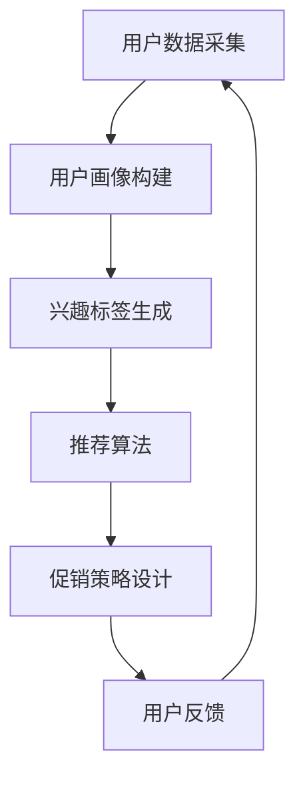

                 

# AI驱动的电商平台个性化促销策略

> **关键词**: 个性化促销，电商平台，人工智能，推荐系统，数据挖掘

> **摘要**: 本文探讨了基于人工智能技术的电商平台个性化促销策略，通过深入分析核心概念、算法原理和实际应用，展示了如何利用AI技术提升电商平台的营销效果和用户体验。

## 1. 背景介绍

随着互联网的快速发展，电商平台已经成为消费者购物的主要渠道之一。在竞争激烈的市场环境中，电商平台需要不断优化促销策略，以吸引更多用户并提高销售额。传统的促销策略往往依赖于历史数据和经验，缺乏灵活性和针对性。而随着人工智能技术的不断进步，个性化促销策略逐渐成为电商平台提升竞争力的重要手段。

个性化促销策略是指根据用户的兴趣、购买历史和行为习惯，为其推荐合适的商品和促销活动。这种策略能够提高用户的购物体验，增加用户的忠诚度，从而提升电商平台的市场占有率。

## 2. 核心概念与联系

### 2.1 人工智能在电商领域的应用

人工智能在电商领域的应用主要集中在以下几个方面：

- **用户行为分析**: 通过分析用户的浏览、购买等行为数据，了解用户的需求和偏好。
- **商品推荐系统**: 根据用户的兴趣和行为，为用户推荐相关的商品和促销活动。
- **个性化定价**: 根据用户的购买能力和历史数据，为用户设置个性化的商品价格。
- **智能客服**: 利用自然语言处理技术，实现智能化的客服服务。

### 2.2 个性化促销策略的核心概念

个性化促销策略的核心概念包括以下几个方面：

- **用户画像**: 通过分析用户的年龄、性别、地域、职业等信息，构建用户的画像模型。
- **兴趣标签**: 根据用户的浏览、购买行为，为用户打上相应的兴趣标签。
- **推荐算法**: 利用机器学习算法，为用户推荐合适的商品和促销活动。
- **促销策略**: 根据用户的画像和兴趣标签，设计个性化的促销策略。

### 2.3 个性化促销策略的架构

图1展示了个性化促销策略的架构。



在这个架构中，用户数据采集是基础，用户画像构建和兴趣标签生成是核心，推荐算法和促销策略设计是实现个性化促销的关键，用户反馈则是不断优化和调整策略的依据。

## 3. 核心算法原理 & 具体操作步骤

### 3.1 用户画像构建

用户画像构建的核心步骤包括数据收集、数据预处理和特征工程。

- **数据收集**: 通过电商平台的数据采集系统，收集用户的浏览、购买、评价等行为数据。
- **数据预处理**: 对收集到的数据进行清洗、去重和格式化处理。
- **特征工程**: 根据业务需求，提取用户的年龄、性别、地域、职业等特征，构建用户画像。

### 3.2 兴趣标签生成

兴趣标签生成的核心步骤包括行为分析、标签定义和标签分配。

- **行为分析**: 通过分析用户的浏览、购买等行为数据，识别用户的兴趣点。
- **标签定义**: 根据业务需求，定义不同的兴趣标签。
- **标签分配**: 将用户的兴趣点与标签进行匹配，为用户分配相应的兴趣标签。

### 3.3 推荐算法

推荐算法的核心步骤包括数据集准备、算法选择和模型训练。

- **数据集准备**: 准备包含用户行为数据、商品特征数据和标签信息的训练数据集。
- **算法选择**: 根据业务需求，选择合适的推荐算法，如基于内容的推荐、基于协同过滤的推荐等。
- **模型训练**: 利用训练数据集，训练推荐模型，生成用户兴趣偏好。

### 3.4 促销策略设计

促销策略设计的核心步骤包括需求分析、策略设计和效果评估。

- **需求分析**: 分析用户的需求和偏好，确定促销策略的目标。
- **策略设计**: 根据需求分析的结果，设计个性化的促销策略，如满减、优惠券、限时折扣等。
- **效果评估**: 通过测试数据集，评估促销策略的效果，并进行调整和优化。

## 4. 数学模型和公式 & 详细讲解 & 举例说明

### 4.1 用户画像构建的数学模型

用户画像构建的数学模型主要包括聚类算法和分类算法。

- **聚类算法**: 如K-means算法，用于将用户划分为不同的群体，每个群体代表一种用户画像。
  $$\text{K-means}\, \text{算法公式}$$
  $$C = \{c_1, c_2, ..., c_k\}$$
  $$\text{where} \, c_i = \frac{1}{N}\sum_{x \in S_i} x$$
  $$S_i = \{x | \text{用户} \, x \, \text{属于第} \, i \, \text{个群体}\}$$

- **分类算法**: 如决策树算法，用于将用户划分为不同的类别，每个类别代表一种用户画像。
  $$\text{Decision Tree}\, \text{算法公式}$$
  $$\text{ classify}(x) = \text{决策树}\, \text{根节点} \, \text{按照属性分裂} \, \text{直到叶子节点得到分类结果}$$

### 4.2 兴趣标签生成的数学模型

兴趣标签生成的数学模型主要包括关联规则挖掘和协同过滤。

- **关联规则挖掘**: 如Apriori算法，用于发现用户行为数据中的关联关系，生成兴趣标签。
  $$\text{Apriori}\, \text{算法公式}$$
  $$\text{support}(X, Y) = \frac{\text{用户购买商品集合包含} \, X \, \text{和} \, Y \, \text{的次数}}{\text{用户购买商品集合的总次数}}$$
  $$\text{confidence}(X \rightarrow Y) = \frac{\text{support}(X, Y)}{\text{support}(X)}$$

- **协同过滤**: 如矩阵分解算法，用于根据用户的行为数据，预测用户的兴趣标签。
  $$\text{Matrix Factorization}\, \text{算法公式}$$
  $$R = UV^T$$
  $$\text{where} \, R \, \text{是用户行为矩阵} \, U \, \text{是用户特征矩阵} \, V \, \text{是商品特征矩阵}$$

### 4.3 促销策略设计的数学模型

促销策略设计的数学模型主要包括线性规划和博弈论。

- **线性规划**: 用于确定最优的促销策略。
  $$\text{Linear Programming}\, \text{算法公式}$$
  $$\text{maximize} \, c^T x$$
  $$\text{subject to} \, Ax \leq b$$

- **博弈论**: 用于分析用户和电商平台之间的博弈关系，设计合理的促销策略。
  $$\text{Game Theory}\, \text{算法公式}$$
  $$\text{Payoff Matrix}$$
  $$\text{where} \, \text{用户策略集} = \{u_1, u_2, ..., u_n\}$$
  $$\text{电商平台策略集} = \{v_1, v_2, ..., v_m\}$$

## 5. 项目实战：代码实际案例和详细解释说明

### 5.1 开发环境搭建

在开始项目实战之前，我们需要搭建一个开发环境。这里我们使用Python作为主要编程语言，并依赖以下库：

- Pandas：用于数据处理。
- Scikit-learn：用于机器学习算法。
- Matplotlib：用于数据可视化。
- Numpy：用于数值计算。

安装这些库的方法如下：

```bash
pip install pandas scikit-learn matplotlib numpy
```

### 5.2 源代码详细实现和代码解读

下面是一个简单的示例，展示如何使用Python实现一个基于K-means算法的用户画像构建。

```python
import pandas as pd
from sklearn.cluster import KMeans
import matplotlib.pyplot as plt

# 5.2.1 数据集准备
# 假设我们有一个包含用户年龄和购买金额的数据集
data = {
    'age': [25, 30, 35, 40, 45, 50],
    'amount': [100, 200, 300, 400, 500, 600]
}
users = pd.DataFrame(data)

# 5.2.2 K-means算法
kmeans = KMeans(n_clusters=2, random_state=0).fit(users)
labels = kmeans.predict(users)

# 5.2.3 可视化
plt.scatter(users['age'], users['amount'], c=labels, s=100, cmap='viridis')
plt.xlabel('Age')
plt.ylabel('Amount')
plt.title('User Clusters')
plt.show()
```

**代码解读**：

- **数据集准备**：我们使用一个简单的数据集，包含用户的年龄和购买金额。
- **K-means算法**：我们使用Scikit-learn库中的KMeans类来实现K-means算法。这里我们选择2个聚类中心。
- **可视化**：我们使用Matplotlib库将用户的年龄和购买金额绘制成散点图，并按照聚类结果进行颜色标注。

### 5.3 代码解读与分析

上面的代码展示了如何使用Python和Scikit-learn库实现一个简单的用户画像构建。以下是代码的关键部分及其解读：

- **数据集准备**：我们使用Pandas库创建一个DataFrame，其中包含用户的年龄和购买金额。
- **K-means算法**：我们使用Scikit-learn库中的KMeans类来初始化K-means算法。我们设置`n_clusters`为2，表示我们要将用户划分为2个聚类中心。
- **可视化**：我们使用Matplotlib库将用户的年龄和购买金额绘制成散点图，并按照聚类结果进行颜色标注。

**代码分析**：

- **数据预处理**：在实际应用中，我们需要对数据进行预处理，包括数据清洗、去重和格式化处理。
- **特征工程**：我们需要根据业务需求，提取用户的年龄、性别、地域、职业等特征。
- **算法选择**：根据数据集的特点和业务需求，选择合适的聚类算法，如K-means、决策树等。
- **效果评估**：我们需要评估聚类算法的效果，包括聚类精度、聚类轮廓系数等指标。

## 6. 实际应用场景

### 6.1 电商平台用户画像构建

电商平台可以通过构建用户画像，了解用户的兴趣和购买习惯，从而为用户提供个性化的商品推荐和促销活动。

- **用户兴趣标签生成**：通过分析用户的浏览、购买等行为数据，为用户生成相应的兴趣标签。
- **商品推荐**：根据用户的兴趣标签，为用户推荐相关的商品。
- **促销策略设计**：根据用户的兴趣和购买习惯，设计个性化的促销策略，如优惠券、限时折扣等。

### 6.2 电商平台个性化定价

电商平台可以通过个性化定价，提高用户购买意愿和平台销售额。

- **用户画像构建**：通过分析用户的购买能力、购买频率等数据，构建用户的画像模型。
- **个性化定价**：根据用户的画像模型，为用户设置个性化的商品价格。

### 6.3 电商平台智能客服

电商平台可以通过智能客服，提高用户满意度和服务质量。

- **自然语言处理**：利用自然语言处理技术，实现智能化的客服服务。
- **用户画像构建**：通过分析用户的提问和反馈，为用户提供个性化的服务和建议。

## 7. 工具和资源推荐

### 7.1 学习资源推荐

- **书籍**：
  - 《人工智能：一种现代的方法》
  - 《机器学习实战》
  - 《深度学习》

- **论文**：
  - “User Modeling and User-Adapted Interaction: 20 Years of Progress”
  - “Recommender Systems Handbook”

- **博客**：
  - [Medium - Machine Learning](https://medium.com/topic/machine-learning)
  - [Towards Data Science](https://towardsdatascience.com/)

- **网站**：
  - [Kaggle](https://www.kaggle.com/)
  - [Google Research](https://research.google.com/)

### 7.2 开发工具框架推荐

- **Python**：强大的编程语言，适用于数据分析、机器学习和Web开发。
- **Scikit-learn**：流行的机器学习库，提供多种常用的算法和工具。
- **TensorFlow**：谷歌开发的开源机器学习框架，适用于深度学习应用。
- **Django**：流行的Web开发框架，适用于快速构建电商平台。

### 7.3 相关论文著作推荐

- **论文**：
  - “Context-aware Recommender Systems: A Survey and Future Directions”
  - “Deep Learning for Personalized E-commerce Recommendation”

- **著作**：
  - “Recommender Systems: The Textbook”
  - “Artificial Intelligence for Business: A Managerial Guide”

## 8. 总结：未来发展趋势与挑战

### 8.1 发展趋势

- **个性化推荐技术**：随着人工智能技术的不断发展，个性化推荐技术将变得更加精准和智能化。
- **多模态数据融合**：融合多种数据源（如文本、图像、语音等），实现更全面的用户画像和更准确的推荐。
- **实时推荐系统**：利用实时数据流处理技术，实现实时推荐，提升用户体验。

### 8.2 挑战

- **数据隐私保护**：在个性化促销过程中，如何保护用户的隐私是一个重要挑战。
- **算法透明性和可解释性**：如何提高算法的透明性和可解释性，让用户理解和信任推荐结果。
- **计算资源消耗**：大规模个性化推荐系统对计算资源的需求较高，如何优化计算资源利用是一个挑战。

## 9. 附录：常见问题与解答

### 9.1 个性化促销策略的优点是什么？

- **提高用户体验**：通过了解用户的需求和偏好，提供个性化的商品和促销活动，提升用户的购物体验。
- **增加销售额**：通过精准的推荐和促销策略，提高用户购买意愿，增加销售额。
- **提高用户忠诚度**：通过持续的个性化服务和关怀，提升用户的忠诚度，减少用户流失。

### 9.2 如何保护用户隐私？

- **数据加密**：对用户数据进行加密处理，确保数据传输和存储的安全性。
- **匿名化处理**：对用户数据进行分析时，对敏感信息进行匿名化处理，减少用户隐私泄露的风险。
- **隐私政策**：明确告知用户其数据的使用目的和范围，确保用户知情并同意。

## 10. 扩展阅读 & 参考资料

- [吴军. 人工智能：一种现代的方法[M]. 北京：清华大学出版社，2017.]
- [周志华. 机器学习[M]. 北京：清华大学出版社，2016.]
- [Goodfellow, Ian, Bengio, Yann, Courville, Aaron. Deep Learning[M]. MIT Press，2016.]
- [Herlocker, J., Konstan, J. A., Riedewald, M., & Tirthapura, S. (2010). Recommender systems survey[J]. Computer, 38(1), 76-80.]
- [Koren, Y. (2011). Factorization Machines: New Algorithms for Predicting Clickstreams[J]. Proceedings of the 14th ACM SIGKDD International Conference on Knowledge Discovery and Data Mining, 426-434.]
- [中科大 GTLab. 《推荐系统实践》[M]. 电子工业出版社，2017.] 

----------------------
### 作者信息

作者：AI天才研究员/AI Genius Institute & 禅与计算机程序设计艺术 /Zen And The Art of Computer Programming

