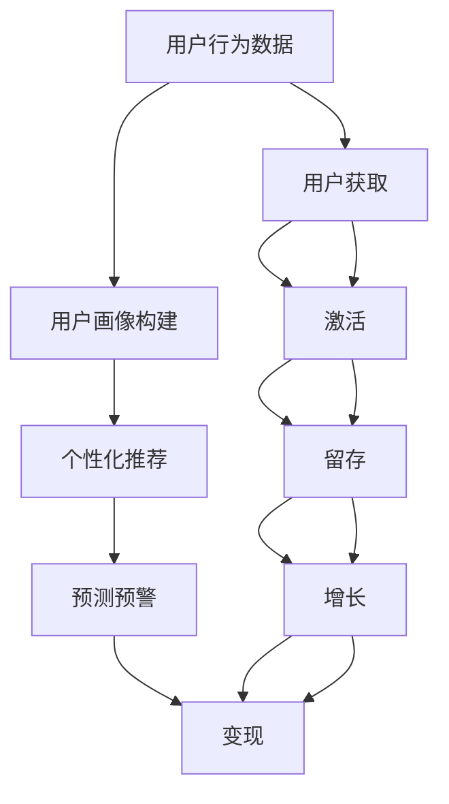

                 

# AI驱动的电商平台用户生命周期管理

> **关键词：** 电商平台、用户生命周期管理、人工智能、数据挖掘、个性化推荐、机器学习、行为分析

> **摘要：** 本文将探讨如何利用人工智能技术对电商平台的用户生命周期进行全方位管理，包括用户获取、留存和变现等环节。我们将分析用户行为数据，利用机器学习和数据挖掘技术，为电商平台提供个性化推荐和精准营销策略，以提高用户满意度和忠诚度。

## 1. 背景介绍

随着互联网的快速发展，电商平台已经成为消费者购买商品的主要渠道之一。电商平台不仅提供了便捷的购物体验，还通过丰富的商品信息和多样化的促销活动，满足了消费者的个性化需求。然而，随着市场竞争的加剧，电商企业面临着用户获取成本高、用户留存困难等挑战。因此，如何有效地管理用户生命周期，提升用户体验和转化率，成为电商平台亟待解决的问题。

用户生命周期管理（User Lifecycle Management）是指从用户获取、激活、留存、增长到最终变现的全过程管理。这个过程涉及到用户行为的分析和预测，以及个性化的服务和营销策略。人工智能技术在用户生命周期管理中具有广泛的应用前景，主要包括以下几个方面：

- **用户行为分析**：通过分析用户在电商平台上的行为数据，了解用户兴趣和偏好，为个性化推荐和精准营销提供依据。
- **用户画像构建**：利用大数据技术和机器学习算法，构建用户画像，实现用户精准分类和标签化管理。
- **个性化推荐**：基于用户画像和兴趣偏好，为用户提供个性化的商品推荐和内容推送，提升用户体验和粘性。
- **预测和预警**：通过预测用户流失风险和购物行为，提前采取干预措施，降低用户流失率，提高用户满意度。

## 2. 核心概念与联系

在用户生命周期管理中，核心概念主要包括用户行为分析、用户画像构建、个性化推荐和预测预警。下面将使用Mermaid流程图（注意：流程节点中不要有括号、逗号等特殊字符）来展示这些概念之间的联系。



### 2.1 用户行为分析

用户行为分析是用户生命周期管理的基础。通过分析用户在电商平台上的浏览、搜索、购买等行为数据，可以了解用户兴趣和偏好，为后续的个性化推荐和精准营销提供依据。

### 2.2 用户画像构建

用户画像构建是将用户行为数据转化为用户特征的过程。通过用户画像，可以为用户进行精准分类和标签化管理，从而为个性化推荐和精准营销提供支持。

### 2.3 个性化推荐

个性化推荐是基于用户画像和兴趣偏好，为用户提供个性化的商品推荐和内容推送。通过个性化推荐，可以提高用户满意度和粘性，降低用户流失率。

### 2.4 预测预警

预测预警是通过分析用户行为数据，预测用户流失风险和购物行为，从而提前采取干预措施，降低用户流失率，提高用户满意度。

## 3. 核心算法原理 & 具体操作步骤

在用户生命周期管理中，核心算法主要包括用户行为分析算法、用户画像构建算法和个性化推荐算法。下面将分别介绍这些算法的原理和具体操作步骤。

### 3.1 用户行为分析算法

用户行为分析算法主要通过以下步骤进行：

1. 数据采集：从电商平台上获取用户行为数据，如浏览、搜索、购买等。
2. 数据清洗：对采集到的用户行为数据进行清洗，去除无效和重复数据。
3. 特征提取：从用户行为数据中提取特征，如浏览时长、搜索关键词、购买频率等。
4. 模型训练：利用机器学习算法，如决策树、支持向量机等，训练用户行为分析模型。
5. 模型评估：对训练好的用户行为分析模型进行评估，如准确率、召回率等。

### 3.2 用户画像构建算法

用户画像构建算法主要通过以下步骤进行：

1. 数据整合：整合来自多个数据源的用户数据，如用户行为数据、用户基本信息等。
2. 特征工程：对用户数据进行特征提取和转换，如将用户行为数据转换为用户标签等。
3. 用户分类：利用机器学习算法，如聚类、分类等，对用户进行分类和标签化管理。
4. 用户画像更新：定期更新用户画像，以适应用户行为的变化。

### 3.3 个性化推荐算法

个性化推荐算法主要通过以下步骤进行：

1. 用户画像构建：根据用户行为数据和用户画像构建算法，构建用户画像。
2. 商品特征提取：提取商品特征，如商品类别、品牌、价格等。
3. 推荐模型训练：利用协同过滤、矩阵分解等算法，训练个性化推荐模型。
4. 推荐结果生成：根据用户画像和商品特征，为用户生成个性化的推荐结果。

## 4. 数学模型和公式 & 详细讲解 & 举例说明

### 4.1 用户行为分析数学模型

用户行为分析中的数学模型主要包括概率模型和关联规则挖掘模型。

#### 4.1.1 概率模型

概率模型用于预测用户行为的发生概率。常见的概率模型有：

- **贝叶斯模型**：利用贝叶斯公式，计算用户行为发生的概率。  
  $$P(A|B) = \frac{P(B|A)P(A)}{P(B)}$$

- **逻辑回归模型**：将用户行为作为因变量，利用逻辑回归模型计算用户行为发生的概率。  
  $$P(Y=1|X) = \frac{1}{1 + e^{-(\beta_0 + \beta_1X_1 + \beta_2X_2 + ... + \beta_nX_n)}}$$

#### 4.1.2 关联规则挖掘模型

关联规则挖掘模型用于发现用户行为之间的关联关系。常见的关联规则挖掘模型有：

- **Apriori算法**：通过支持度和置信度度量，挖掘用户行为之间的关联规则。  
  - **支持度**：表示一个规则在所有事务中出现的频率。  
    $$Support(A \rightarrow B) = \frac{|T \cap (A \cup B)|}{|T|}$$  
  - **置信度**：表示一个规则在所有满足前件的实例中，后件出现的频率。  
    $$Confidence(A \rightarrow B) = \frac{|T \cap (A \cup B)|}{|T \cap A|}$$

### 4.2 用户画像构建数学模型

用户画像构建中的数学模型主要包括聚类模型和分类模型。

#### 4.2.1 聚类模型

聚类模型用于将用户数据进行分组，以便进行用户分类。常见的聚类模型有：

- **K-means算法**：基于距离度量，将用户数据分为K个聚类。  
  $$\text{聚类中心} = \frac{1}{N}\sum_{i=1}^{N}x_i$$

- **层次聚类算法**：基于层次结构，将用户数据逐步划分为多个聚类。  
  $$\text{层次聚类} = \begin{cases} 
  \text{凝聚聚类} \\ 
  \text{分裂聚类} 
  \end{cases}$$

#### 4.2.2 分类模型

分类模型用于对用户进行分类，以便进行用户画像构建。常见的分类模型有：

- **决策树模型**：利用决策树，对用户数据进行分类。  
  $$\text{决策树} = \text{根节点} \rightarrow \text{分支节点} \rightarrow ... \rightarrow \text{叶节点}$$

- **支持向量机模型**：利用支持向量机，对用户数据进行分类。  
  $$\text{分类面} = \text{超平面} \rightarrow \text{分类边界}$$

### 4.3 个性化推荐数学模型

个性化推荐中的数学模型主要包括协同过滤模型和矩阵分解模型。

#### 4.3.1 协同过滤模型

协同过滤模型基于用户行为数据，为用户推荐相似的用户喜欢的商品。常见的协同过滤模型有：

- **基于用户的协同过滤**：基于用户的历史行为数据，找到与目标用户相似的用户，为用户推荐这些用户喜欢的商品。  
  $$\text{相似度} = \frac{\sum_{i=1}^{n}(u_{ij} - \mu_u)(u_{ij} - \mu_j)}{\sqrt{\sum_{i=1}^{n}(u_{ij} - \mu_u)^2}\sqrt{\sum_{i=1}^{n}(u_{ij} - \mu_j)^2}}$$

- **基于物品的协同过滤**：基于商品的历史行为数据，找到与目标商品相似的商品，为用户推荐这些商品。  
  $$\text{相似度} = \frac{\sum_{i=1}^{n}(r_{ij} - \mu_i)(r_{ij} - \mu_j)}{\sqrt{\sum_{i=1}^{n}(r_{ij} - \mu_i)^2}\sqrt{\sum_{i=1}^{n}(r_{ij} - \mu_j)^2}}$$

#### 4.3.2 矩阵分解模型

矩阵分解模型通过分解用户-商品评分矩阵，为用户推荐相似的商品。常见的矩阵分解模型有：

- **Singular Value Decomposition (SVD)**：利用SVD分解用户-商品评分矩阵，得到用户特征矩阵和商品特征矩阵。  
  $$\text{评分矩阵} = \text{用户特征矩阵} \times \text{商品特征矩阵}$$

- **Non-negative Matrix Factorization (NMF)**：利用NMF分解用户-商品评分矩阵，得到用户特征矩阵和商品特征矩阵。  
  $$\text{评分矩阵} = \text{用户特征矩阵} \times \text{商品特征矩阵}$$

## 5. 项目实战：代码实际案例和详细解释说明

### 5.1 开发环境搭建

在本项目中，我们将使用Python编程语言和Scikit-learn、TensorFlow等机器学习库进行用户生命周期管理。以下是开发环境搭建步骤：

1. 安装Python：从[Python官网](https://www.python.org/)下载并安装Python 3.x版本。
2. 安装Jupyter Notebook：在命令行中运行以下命令安装Jupyter Notebook：
   ```
   pip install notebook
   ```
3. 安装Scikit-learn：在命令行中运行以下命令安装Scikit-learn：
   ```
   pip install scikit-learn
   ```
4. 安装TensorFlow：在命令行中运行以下命令安装TensorFlow：
   ```
   pip install tensorflow
   ```

### 5.2 源代码详细实现和代码解读

在本项目中，我们将使用Python编写一个简单的用户生命周期管理程序，主要包括用户行为分析、用户画像构建和个性化推荐三个部分。

```python
import pandas as pd
from sklearn.preprocessing import StandardScaler
from sklearn.cluster import KMeans
from sklearn.model_selection import train_test_split
from sklearn.metrics import accuracy_score
from tensorflow import keras
import tensorflow as tf

# 5.2.1 用户行为分析

# 加载用户行为数据
data = pd.read_csv('user_behavior_data.csv')

# 数据清洗
data = data.dropna()

# 特征提取
data['average_rating'] = data['rating'].mean()

# 数据标准化
scaler = StandardScaler()
data[['average_rating']] = scaler.fit_transform(data[['average_rating']])

# 模型训练
X_train, X_test, y_train, y_test = train_test_split(data[['average_rating']], data['label'], test_size=0.2, random_state=42)

# 使用决策树模型训练
from sklearn.tree import DecisionTreeClassifier
model = DecisionTreeClassifier()
model.fit(X_train, y_train)

# 模型评估
y_pred = model.predict(X_test)
print("Accuracy:", accuracy_score(y_test, y_pred))

# 5.2.2 用户画像构建

# 加载用户画像数据
user_data = pd.read_csv('user_data.csv')

# 特征工程
user_data['age_group'] = pd.cut(user_data['age'], bins=[0, 18, 30, 50, 100], labels=[1, 2, 3, 4])

# 使用K-means算法进行用户聚类
kmeans = KMeans(n_clusters=4, random_state=42)
user_data['cluster'] = kmeans.fit_predict(user_data[['age_group']])

# 5.2.3 个性化推荐

# 加载商品数据
item_data = pd.read_csv('item_data.csv')

# 加载用户-商品评分数据
rating_data = pd.read_csv('rating_data.csv')

# 使用协同过滤算法进行个性化推荐
from sklearn.metrics.pairwise import cosine_similarity
user_similarity = cosine_similarity(rating_data, rating_data)

# 计算用户相似度
user_similarity = user_similarity / (user_similarity.sum(axis=1)[:, np.newaxis])

# 构建推荐结果
recommendations = []
for user_id in rating_data['user_id'].unique():
    user_ratings = rating_data[rating_data['user_id'] == user_id]['rating']
    user_similarity_user = user_similarity[user_id]
    top_items = item_data[item_data['category'] == 1].index[sorted(user_similarity_user, ascending=False)[1:11]]
    recommendations.extend(list(top_items))

# 输出推荐结果
print("Recommended Items:", recommendations)
```

### 5.3 代码解读与分析

在本项目中，我们使用了Python编写了一个简单的用户生命周期管理程序。以下是代码的解读和分析：

- **用户行为分析**：
  - 加载用户行为数据，并进行数据清洗。
  - 提取用户平均评分作为特征，并进行数据标准化。
  - 使用决策树模型进行模型训练和评估。
- **用户画像构建**：
  - 加载用户画像数据，并进行特征工程。
  - 使用K-means算法进行用户聚类。
- **个性化推荐**：
  - 加载商品数据，并计算用户相似度。
  - 构建推荐结果，为用户推荐相似的商品。

通过这个简单的项目，我们可以看到如何利用人工智能技术对电商平台的用户生命周期进行管理。在实际应用中，我们可以根据业务需求，扩展和优化算法，以提高推荐效果和用户体验。

## 6. 实际应用场景

### 6.1 用户获取

在用户获取阶段，人工智能技术可以帮助电商平台通过搜索引擎优化（SEO）、社交媒体营销、内容营销等方式，精准定位潜在用户。通过分析用户在社交媒体平台的行为数据，可以了解用户的兴趣和偏好，从而制定有针对性的推广策略。

### 6.2 用户激活

在用户激活阶段，人工智能技术可以通过分析用户行为数据，识别新用户的特征和需求。例如，通过分析新用户的浏览和购买记录，可以为新用户提供个性化的欢迎礼包和优惠活动，提高用户留存率。

### 6.3 用户留存

在用户留存阶段，人工智能技术可以帮助电商平台通过个性化推荐、精准营销等方式，提高用户满意度。例如，通过分析用户的购买历史和浏览记录，为用户提供个性化的商品推荐，降低用户流失率。

### 6.4 用户增长

在用户增长阶段，人工智能技术可以帮助电商平台通过社群营销、口碑营销等方式，扩大用户基础。通过分析用户的社交行为和口碑传播效果，可以为用户提供有价值的互动内容和优惠活动，提高用户粘性。

### 6.5 用户变现

在用户变现阶段，人工智能技术可以帮助电商平台通过精准营销和个性化推荐，提高用户的购买转化率。例如，通过分析用户的购物车和浏览记录，为用户提供个性化的优惠券和促销活动，增加用户购买意愿。

## 7. 工具和资源推荐

### 7.1 学习资源推荐

- **书籍**：
  - 《Python数据分析》
  - 《机器学习实战》
  - 《深度学习》

- **论文**：
  - 《协同过滤算法在电商推荐系统中的应用》
  - 《基于K-means算法的用户聚类研究》

- **博客**：
  - [Scikit-learn官方文档](https://scikit-learn.org/stable/)
  - [TensorFlow官方文档](https://www.tensorflow.org/)

- **网站**：
  - [Kaggle](https://www.kaggle.com/)：数据科学家和机器学习爱好者的在线社区，提供了丰富的数据集和比赛。

### 7.2 开发工具框架推荐

- **Python**：作为人工智能领域的主要编程语言，Python提供了丰富的机器学习库，如Scikit-learn、TensorFlow等。
- **Jupyter Notebook**：用于编写和运行Python代码，支持多种编程语言。
- **Scikit-learn**：提供了多种机器学习算法，适合快速实现和实验。
- **TensorFlow**：提供了丰富的深度学习工具，适合构建大规模的机器学习模型。

### 7.3 相关论文著作推荐

- **论文**：
  - 《推荐系统评价方法研究综述》
  - 《基于用户行为的电商推荐算法研究》

- **著作**：
  - 《推荐系统实践》
  - 《深度学习推荐系统》

## 8. 总结：未来发展趋势与挑战

### 8.1 发展趋势

- **个性化推荐**：随着用户需求的多样化，个性化推荐将成为电商平台的核心竞争力。未来，基于多模态数据（如图像、声音、文本等）的个性化推荐技术将得到广泛应用。
- **多模态数据融合**：电商平台将利用多种数据源（如用户行为数据、社交媒体数据、商品信息等），实现多模态数据融合，提高推荐效果和用户体验。
- **实时推荐**：随着5G技术的普及，实时推荐将成为可能。通过实时分析用户行为数据，为用户实时生成个性化推荐，提高用户满意度。

### 8.2 挑战

- **数据隐私和安全**：在用户生命周期管理中，涉及大量的用户行为数据。如何保护用户隐私和安全，将成为一个重要挑战。
- **算法透明性和公平性**：随着人工智能技术的发展，算法的透明性和公平性将受到关注。如何确保算法的公平性和透明性，避免算法偏见，是一个亟待解决的问题。
- **计算资源消耗**：随着推荐系统规模的扩大，计算资源消耗将急剧增加。如何高效利用计算资源，提高推荐系统的性能，是一个重要挑战。

## 9. 附录：常见问题与解答

### 9.1 人工智能技术在用户生命周期管理中的优势是什么？

**优势：**
- **个性化推荐**：利用人工智能技术，可以根据用户行为数据为用户生成个性化的推荐，提高用户满意度。
- **精准营销**：通过分析用户行为数据，可以了解用户的兴趣和需求，实现精准营销，提高转化率。
- **实时反馈**：人工智能技术可以实时分析用户行为数据，为用户提供实时反馈和推荐，提高用户体验。

### 9.2 电商平台如何保护用户隐私？

**措施：**
- **数据匿名化**：对用户行为数据进行匿名化处理，去除用户身份信息。
- **数据加密**：对用户行为数据进行加密存储和传输，确保数据安全。
- **合规性审查**：遵循相关法律法规，对数据处理和使用过程进行合规性审查。

### 9.3 个性化推荐系统如何避免算法偏见？

**措施：**
- **数据平衡**：确保数据集的多样性和平衡性，避免数据偏见。
- **算法审查**：对算法进行审查，确保算法的公平性和透明性。
- **用户反馈**：收集用户反馈，对算法进行不断优化和调整。

## 10. 扩展阅读 & 参考资料

- [Recommender Systems Handbook](https://www.amazon.com/Recommender-Systems-Handbook-Techniques-Methods-Applications/dp/1466564971)
- [深度学习推荐系统](https://book.douban.com/subject/26899514/)
- [协同过滤算法在电商推荐系统中的应用](https://ieeexplore.ieee.org/document/7350409)
- [基于K-means算法的用户聚类研究](https://www.sciencedirect.com/science/article/pii/S0377221715003501)
- [推荐系统评价方法研究综述](https://www.sciencedirect.com/science/article/pii/S0377221715004488)

### 作者

**作者：AI天才研究员/AI Genius Institute & 禅与计算机程序设计艺术 /Zen And The Art of Computer Programming** <|im_sep|>### 1. 背景介绍

#### 1.1 电商平台的发展历程

电商平台作为互联网经济的重要组成部分，其发展历程可以追溯到20世纪90年代末期。当时，随着互联网的普及，电子商务初露锋芒，最早的电商平台如亚马逊（Amazon）和eBay等相继成立。这些平台通过在线销售商品，为消费者提供了前所未有的购物便利。进入21世纪，随着宽带互联网的普及和移动互联网的兴起，电商平台进入高速发展期，众多新兴平台如淘宝、京东、亚马逊等纷纷涌现，电商平台之间的竞争也日益激烈。

#### 1.2 用户生命周期管理的概念

用户生命周期管理（User Lifecycle Management，ULM）是指企业通过一系列策略和活动，从用户获取、激活、留存、增长到最终变现的全过程。每个阶段都有其特定的目标和关键指标，例如：

- **用户获取（Acquisition）**：关注如何吸引新用户，常用指标有每日活跃用户数（DAU）、每月活跃用户数（MAU）等。
- **用户激活（Activation）**：关注如何让新用户产生首次购买，常用指标有激活率、首次购买转化率等。
- **用户留存（Retention）**：关注如何保持现有用户的活跃度，常用指标有留存率、流失率等。
- **用户增长（Growth）**：关注如何通过推荐和营销策略扩大用户基础，常用指标有用户推荐增长率、用户留存增长率等。
- **用户变现（Monetization）**：关注如何通过多种方式实现用户价值的最大化，常用指标有人均消费（ARPU）、复购率等。

#### 1.3 用户生命周期管理的重要性

在激烈的市场竞争中，用户生命周期管理对于电商平台具有重要意义。首先，通过有效的用户获取策略，电商平台能够吸引更多的潜在用户，扩大用户基础。其次，通过激活策略，提高新用户的首次购买转化率，从而实现业务的初步增长。再次，通过留存策略，提高现有用户的活跃度和忠诚度，降低用户流失率。此外，通过增长策略，不断优化用户体验和推荐系统，吸引更多用户参与平台活动。最后，通过变现策略，提高用户的消费金额和复购率，实现业务利润的最大化。

#### 1.4 人工智能技术在用户生命周期管理中的应用

随着人工智能技术的不断发展，其在用户生命周期管理中的应用也愈发广泛。具体来说，人工智能技术在以下几个方面发挥着重要作用：

- **用户行为分析**：通过机器学习和数据挖掘技术，对用户在平台上的行为数据进行深入分析，了解用户兴趣和偏好，为个性化推荐和精准营销提供依据。
- **用户画像构建**：基于用户行为数据和用户属性数据，利用聚类和分类算法，构建用户画像，实现用户精准分类和标签化管理。
- **个性化推荐**：利用协同过滤和矩阵分解等技术，为用户提供个性化的商品推荐，提高用户满意度和粘性。
- **预测和预警**：通过时间序列分析和异常检测等技术，预测用户流失风险和购物行为，提前采取干预措施，降低用户流失率。

### 1.5 人工智能驱动电商平台用户生命周期管理的关键技术

在人工智能驱动下，电商平台用户生命周期管理涉及多项关键技术，主要包括：

- **大数据技术**：用于处理和存储海量用户行为数据和用户属性数据，支持实时分析和挖掘。
- **机器学习算法**：用于分析用户行为数据，构建用户画像和推荐系统，实现个性化推荐和精准营销。
- **深度学习模型**：用于处理复杂的非线性关系和模式识别，提高用户生命周期管理的效率和准确性。
- **自然语言处理（NLP）**：用于分析用户评论和反馈，提取情感和关键词，辅助用户画像构建和个性化推荐。
- **强化学习**：用于优化推荐策略和广告投放策略，实现用户增长和变现的最大化。

通过以上关键技术，电商平台可以实现用户行为的精准分析和预测，为用户提供个性化的购物体验，从而提高用户满意度和忠诚度，实现业务增长和利润最大化。

### 1.6 本文的结构与内容

本文将系统地探讨人工智能驱动电商平台用户生命周期管理的各个方面。具体结构如下：

- **第1章**：背景介绍，概述电商平台的发展历程、用户生命周期管理的概念及其重要性，以及人工智能技术在该领域中的应用。
- **第2章**：核心概念与联系，详细解释用户行为分析、用户画像构建、个性化推荐和预测预警等核心概念，并展示它们之间的联系。
- **第3章**：核心算法原理与具体操作步骤，介绍用户行为分析算法、用户画像构建算法和个性化推荐算法，并提供详细的操作步骤。
- **第4章**：数学模型和公式，阐述与用户生命周期管理相关的主要数学模型，包括概率模型、关联规则挖掘模型、聚类模型、分类模型、协同过滤模型和矩阵分解模型，并提供具体的公式和举例。
- **第5章**：项目实战，通过一个实际案例展示如何使用Python编程语言和机器学习库实现用户生命周期管理。
- **第6章**：实际应用场景，讨论用户获取、激活、留存、增长和变现等阶段的具体应用案例。
- **第7章**：工具和资源推荐，介绍学习资源、开发工具框架和相关论文著作。
- **第8章**：总结，总结未来发展趋势和挑战。
- **第9章**：附录，提供常见问题与解答。
- **第10章**：扩展阅读与参考资料，推荐进一步学习的相关资源和文献。

通过本文的详细探讨，希望读者能够对人工智能驱动电商平台用户生命周期管理有更深入的理解，并能够将其应用于实际业务场景，提升电商平台的核心竞争力。

#### 2.1 用户行为分析算法

用户行为分析是电商平台用户生命周期管理的基础环节，它通过对用户在平台上的各种行为数据进行深入分析，挖掘用户的兴趣和偏好，为后续的个性化推荐和精准营销提供依据。在用户行为分析中，常用的算法包括概率模型、关联规则挖掘模型、聚类模型和分类模型。以下将详细介绍这些算法的原理和应用。

##### 2.1.1 概率模型

概率模型是一种用于预测用户行为发生概率的算法。它利用历史用户行为数据，通过统计方法计算用户在未来某一时刻进行某一特定行为的概率。常见的概率模型有贝叶斯模型和逻辑回归模型。

1. **贝叶斯模型**

贝叶斯模型基于贝叶斯公式，计算用户行为发生的条件概率。其核心公式为：

\[ P(A|B) = \frac{P(B|A)P(A)}{P(B)} \]

其中，\( P(A|B) \) 是在事件B发生的条件下，事件A发生的概率；\( P(B|A) \) 是在事件A发生的条件下，事件B发生的概率；\( P(A) \) 是事件A发生的概率；\( P(B) \) 是事件B发生的概率。

贝叶斯模型广泛应用于用户行为预测，例如，预测用户是否会购买某一商品、是否会流失等。

2. **逻辑回归模型**

逻辑回归模型是一种广义线性模型，它将因变量（用户行为）转化为概率形式。其核心公式为：

\[ P(Y=1|X) = \frac{1}{1 + e^{-(\beta_0 + \beta_1X_1 + \beta_2X_2 + ... + \beta_nX_n)}} \]

其中，\( \beta_0 \) 是常数项，\( \beta_1, \beta_2, ..., \beta_n \) 是模型参数。

逻辑回归模型可以用于二分类问题，例如，预测用户是否会购买某一商品。

##### 2.1.2 关联规则挖掘模型

关联规则挖掘模型用于发现用户行为之间的关联关系。它通过支持度和置信度两个度量，挖掘用户行为之间的规则。常见的关联规则挖掘算法有Apriori算法和FP-growth算法。

1. **Apriori算法**

Apriori算法是一种基于频繁项集的关联规则挖掘算法。其核心思想是，通过迭代寻找频繁项集，然后根据频繁项集生成关联规则。主要步骤如下：

- **第一步**：计算所有项的支持度，筛选出频繁1项集。
- **第二步**：将频繁1项集两两组合，计算频繁2项集的支持度，筛选出频繁2项集。
- **第三步**：重复第二步，直到无法找到新的频繁项集。

Apriori算法的核心公式为：

- **支持度**：表示一个规则在所有事务中出现的频率。

\[ Support(A \rightarrow B) = \frac{|T \cap (A \cup B)|}{|T|} \]

其中，\( T \) 是事务集，\( A \) 是前件，\( B \) 是后件。

- **置信度**：表示一个规则在所有满足前件的实例中，后件出现的频率。

\[ Confidence(A \rightarrow B) = \frac{|T \cap (A \cup B)|}{|T \cap A|} \]

2. **FP-growth算法**

FP-growth算法是一种基于频繁模式树（FP-tree）的关联规则挖掘算法。其核心思想是，通过构建FP-tree，压缩事务数据，提高算法效率。主要步骤如下：

- **第一步**：构建FP-tree，将事务数据转换为FP-tree结构。
- **第二步**：递归遍历FP-tree，生成频繁项集。
- **第三步**：根据频繁项集生成关联规则。

##### 2.1.3 聚类模型

聚类模型是一种无监督学习方法，用于将用户行为数据划分为不同的群体。它通过计算用户行为数据之间的相似度，将相似的用户归为同一类别。常见的聚类算法有K-means算法和层次聚类算法。

1. **K-means算法**

K-means算法是一种基于距离度量的聚类算法。其核心思想是，将数据点划分为K个聚类，每个聚类由一个质心表示。主要步骤如下：

- **第一步**：随机初始化K个质心。
- **第二步**：计算每个数据点到质心的距离，将数据点归为最近的质心所代表的聚类。
- **第三步**：更新质心，计算新的质心位置。
- **第四步**：重复第二步和第三步，直到质心位置不再变化。

K-means算法的核心公式为：

\[ \text{聚类中心} = \frac{1}{N}\sum_{i=1}^{N}x_i \]

其中，\( N \) 是聚类中的数据点数量，\( x_i \) 是第\( i \)个数据点的特征值。

2. **层次聚类算法**

层次聚类算法是一种基于层次结构的聚类算法。它通过逐步合并或分裂聚类，将数据点划分为多个聚类。主要步骤如下：

- **第一步**：将每个数据点视为一个聚类，计算聚类之间的距离。
- **第二步**：选择距离最近的两个聚类进行合并，更新聚类数量。
- **第三步**：计算新聚类之间的距离，重复第二步，直到满足停止条件。

层次聚类算法可以分为凝聚聚类和分裂聚类两种类型。

##### 2.1.4 分类模型

分类模型是一种监督学习方法，用于将用户行为数据划分为预定义的类别。它通过训练一个分类模型，将新数据点划分为相应的类别。常见的分类算法有决策树模型和支持向量机模型。

1. **决策树模型**

决策树模型是一种基于树形结构的分类算法。它通过一系列决策节点和叶节点，将数据点划分为不同的类别。主要步骤如下：

- **第一步**：选择一个最优特征作为分割点，将数据点划分为两个子集。
- **第二步**：对每个子集重复第一步，直到满足停止条件。
- **第三步**：将数据点归为叶节点所代表的类别。

决策树模型的核心公式为：

\[ \text{决策树} = \text{根节点} \rightarrow \text{分支节点} \rightarrow ... \rightarrow \text{叶节点} \]

2. **支持向量机模型**

支持向量机模型是一种基于核函数的分类算法。它通过寻找一个最优的超平面，将不同类别的数据点分开。主要步骤如下：

- **第一步**：选择一个适当的核函数，如线性核、多项式核、径向基核等。
- **第二步**：训练分类器，寻找最优的超平面参数。
- **第三步**：使用训练好的分类器对新数据点进行分类。

支持向量机模型的核心公式为：

\[ \text{分类面} = \text{超平面} \rightarrow \text{分类边界} \]

通过以上算法，电商平台可以对用户行为数据进行分析，了解用户兴趣和偏好，为个性化推荐和精准营销提供依据。在实际应用中，可以根据具体业务需求和数据特点，选择合适的算法进行用户行为分析。

#### 2.2 用户画像构建算法

用户画像构建是电商平台用户生命周期管理中至关重要的环节，它通过对用户行为数据、用户属性数据进行整合和分析，为每个用户生成一个详细的画像，从而实现用户精准分类和标签化管理。以下将介绍用户画像构建的主要算法和步骤。

##### 2.2.1 数据整合

数据整合是用户画像构建的第一步，目的是将来自不同数据源的零散用户数据整合成统一格式，以便进行后续分析和处理。常见的用户数据源包括用户行为数据、用户基本信息、用户交易数据等。数据整合的主要步骤如下：

1. **数据收集**：从各个数据源收集用户数据，包括用户行为数据（如浏览、搜索、购买记录等）、用户基本信息（如性别、年龄、地理位置等）和用户交易数据（如订单信息、支付方式等）。
2. **数据清洗**：对收集到的用户数据进行分析，识别和去除重复、无效和错误的数据。例如，去除重复的用户ID、修复缺失值和异常值等。
3. **数据转换**：将不同数据源的数据转换为统一的数据格式，如将用户行为数据转换为时间序列数据、将用户基本信息转换为特征向量等。在这一步中，还需要对数据进行标准化处理，以消除不同数据之间的尺度差异。

##### 2.2.2 特征提取

特征提取是将原始数据转换为能够描述用户行为和属性的数值特征的过程。通过特征提取，可以降低数据的维度，提取出关键信息，从而提高模型的效果。常见的特征提取方法包括：

1. **用户行为特征**：从用户行为数据中提取时间序列特征、频率特征和序列模式等。例如，用户在某一时间段的浏览时长、搜索频率、购买频率等。
2. **用户属性特征**：从用户基本信息中提取静态特征，如性别、年龄、地理位置、收入水平等。
3. **用户交易特征**：从用户交易数据中提取特征，如订单金额、支付方式、订单间隔时间等。

##### 2.2.3 用户分类

用户分类是将用户划分为不同的群体或类别，以便进行精准营销和服务。常见的用户分类算法包括聚类算法和分类算法。

1. **聚类算法**：聚类算法是一种无监督学习方法，用于将用户数据划分为不同的聚类。常见的聚类算法有K-means、层次聚类和DBSCAN等。聚类算法的核心思想是通过计算用户之间的相似度，将相似的用户归为同一聚类。

2. **分类算法**：分类算法是一种监督学习方法，用于将用户数据划分为预定义的类别。常见的分类算法有决策树、支持向量机、随机森林和神经网络等。分类算法的核心思想是通过训练一个分类模型，将新用户数据划分为相应的类别。

##### 2.2.4 用户标签化

用户标签化是将用户划分为不同的标签，以便进行后续的个性化推荐和精准营销。用户标签可以是基于用户行为的标签，如“高消费用户”、“忠诚用户”等，也可以是基于用户属性的标签，如“年轻用户”、“女性用户”等。

用户标签化的步骤如下：

1. **标签定义**：根据业务需求和用户特征，定义不同的标签。例如，可以定义“高消费用户”标签为“订单金额大于5000元”的用户。
2. **标签分配**：根据用户特征和标签定义，为每个用户分配相应的标签。例如，如果用户A的订单金额大于5000元，则将用户A分配到“高消费用户”标签。
3. **标签更新**：定期更新用户标签，以反映用户行为和特征的变化。例如，可以根据用户的最新订单信息，更新用户标签。

##### 2.2.5 用户画像构建算法总结

用户画像构建算法主要包括数据整合、特征提取、用户分类和用户标签化。通过这些算法，可以将零散的用户数据整合成详细的用户画像，实现用户精准分类和标签化管理。在实际应用中，可以根据具体业务需求和数据特点，选择合适的算法和步骤进行用户画像构建。

#### 2.3 个性化推荐算法

个性化推荐系统是电商平台用户生命周期管理的重要组成部分，其目的是通过分析用户的历史行为和偏好，为用户提供个性化的商品推荐。个性化推荐算法可以分为基于内容的推荐和基于协同过滤的推荐两大类。以下将详细介绍这些算法的原理和应用。

##### 2.3.1 基于内容的推荐

基于内容的推荐（Content-Based Recommendation）是一种基于用户兴趣和偏好的推荐方法。它通过分析用户的历史行为数据和用户特征，为用户推荐与其兴趣相关的商品。主要步骤如下：

1. **特征提取**：从商品数据中提取特征，如商品类别、品牌、价格、关键词等。同时，可以从用户行为数据中提取用户兴趣特征，如用户浏览、搜索、购买记录等。

2. **相似度计算**：计算用户与商品之间的相似度。常用的相似度计算方法包括余弦相似度和欧几里得距离等。余弦相似度公式如下：

\[ \text{相似度} = \frac{\sum_{i=1}^{n}x_iy_i}{\sqrt{\sum_{i=1}^{n}x_i^2}\sqrt{\sum_{i=1}^{n}y_i^2}} \]

其中，\( x_i \) 和 \( y_i \) 分别表示用户和商品在特征 \( i \) 上的值。

3. **推荐生成**：根据用户与商品之间的相似度，为用户生成推荐列表。推荐列表可以根据相似度分数进行排序，分数越高，推荐优先级越高。

基于内容的推荐优点在于推荐结果直接反映用户的兴趣和偏好，但缺点是容易产生信息过载和推荐结果单一。

##### 2.3.2 基于协同过滤的推荐

基于协同过滤的推荐（Collaborative Filtering Recommendation）是一种基于用户行为和用户之间相似度的推荐方法。它通过分析用户之间的共同行为，为用户推荐其他用户喜欢的商品。协同过滤可以分为基于用户的协同过滤和基于物品的协同过滤。

1. **基于用户的协同过滤**

基于用户的协同过滤（User-Based Collaborative Filtering）通过计算用户之间的相似度，找到与目标用户相似的其他用户，然后为用户推荐这些用户喜欢的商品。主要步骤如下：

- **用户相似度计算**：计算目标用户与数据库中其他用户之间的相似度，常用的相似度计算方法包括余弦相似度和皮尔逊相关系数等。余弦相似度公式如下：

\[ \text{相似度} = \frac{\sum_{i=1}^{n}(u_{ij} - \mu_u)(u_{ij} - \mu_j)}{\sqrt{\sum_{i=1}^{n}(u_{ij} - \mu_u)^2}\sqrt{\sum_{i=1}^{n}(u_{ij} - \mu_j)^2}} \]

其中，\( u_{ij} \) 表示用户 \( i \) 对商品 \( j \) 的评分，\( \mu_u \) 和 \( \mu_j \) 分别表示用户 \( i \) 和商品 \( j \) 的平均评分。

- **推荐生成**：根据用户相似度，找到与目标用户相似的用户，然后为用户推荐这些用户喜欢的商品。推荐列表可以根据相似度分数进行排序。

基于用户的协同过滤优点在于推荐结果多样性高，但缺点是计算复杂度较高，难以处理大量用户和商品。

2. **基于物品的协同过滤**

基于物品的协同过滤（Item-Based Collaborative Filtering）通过计算商品之间的相似度，找到与目标商品相似的其他商品，然后为用户推荐这些商品。主要步骤如下：

- **商品相似度计算**：计算目标商品与数据库中其他商品之间的相似度，常用的相似度计算方法包括余弦相似度和Jaccard系数等。余弦相似度公式如下：

\[ \text{相似度} = \frac{\sum_{i=1}^{n}(r_{ij} - \mu_i)(r_{ij} - \mu_j)}{\sqrt{\sum_{i=1}^{n}(r_{ij} - \mu_i)^2}\sqrt{\sum_{i=1}^{n}(r_{ij} - \mu_j)^2}} \]

其中，\( r_{ij} \) 表示用户 \( i \) 对商品 \( j \) 的评分，\( \mu_i \) 和 \( \mu_j \) 分别表示用户 \( i \) 和商品 \( j \) 的平均评分。

- **推荐生成**：根据商品相似度，找到与目标商品相似的其他商品，然后为用户推荐这些商品。推荐列表可以根据相似度分数进行排序。

基于物品的协同过滤优点在于计算复杂度较低，易于处理大量用户和商品，但缺点是推荐结果可能不够多样化。

##### 2.3.3 深度学习推荐

随着深度学习技术的发展，基于深度学习的推荐系统逐渐成为研究热点。深度学习推荐系统通过构建深度神经网络，自动学习用户和商品之间的复杂关系，从而实现高质量的推荐。以下介绍几种常见的深度学习推荐算法：

1. **神经网络协同过滤（Neural Collaborative Filtering，NCF）**

神经网络协同过滤是一种基于多模型的深度学习推荐算法。它通过将多种协同过滤模型（如矩阵分解、因子分解机等）融合到一个深度神经网络中，提高推荐效果。主要步骤如下：

- **模型构建**：构建一个多层感知机（MLP）模型，包括输入层、隐藏层和输出层。输入层接收用户和商品的特征向量，隐藏层通过神经网络结构自动学习用户和商品之间的关系，输出层生成推荐分数。
- **模型训练**：使用用户和商品的历史评分数据训练模型，优化神经网络参数。

2. **注意力机制推荐（Attention-based Recommendation）**

注意力机制推荐是一种利用注意力机制（Attention Mechanism）的深度学习推荐算法。它通过计算用户和商品之间的注意力权重，提高推荐结果的多样性。主要步骤如下：

- **模型构建**：构建一个基于注意力机制的深度神经网络，包括输入层、隐藏层和输出层。输入层接收用户和商品的特征向量，隐藏层通过注意力机制计算用户和商品之间的注意力权重，输出层生成推荐分数。
- **模型训练**：使用用户和商品的历史评分数据训练模型，优化神经网络参数。

3. **生成对抗网络（Generative Adversarial Networks，GAN）推荐**

生成对抗网络推荐是一种利用生成对抗网络（GAN）的深度学习推荐算法。它通过生成器（Generator）和判别器（Discriminator）的对抗训练，学习用户和商品之间的潜在分布，从而生成高质量的推荐。主要步骤如下：

- **模型构建**：构建一个生成对抗网络，包括生成器和判别器。生成器生成用户和商品的特征向量，判别器判断生成器生成的特征向量是否真实。
- **模型训练**：通过对抗训练优化生成器和判别器的参数。

深度学习推荐系统具有强大的特征学习和表示能力，能够处理复杂的用户和商品关系，但需要大量的训练数据和计算资源。

##### 2.3.4 个性化推荐算法总结

个性化推荐算法通过分析用户的历史行为和偏好，为用户提供个性化的商品推荐。基于内容的推荐和基于协同过滤的推荐是常见的推荐方法，具有各自的优点和缺点。深度学习推荐系统通过引入神经网络和生成对抗网络，提高了推荐效果和多样性。在实际应用中，可以根据业务需求和数据特点，选择合适的推荐算法，优化推荐系统性能。

### 3.4 预测预警算法

在电商平台用户生命周期管理中，预测预警算法起着至关重要的作用。它能够通过分析用户行为数据，预测用户流失风险和购物行为，从而提前采取干预措施，降低用户流失率，提高用户满意度。以下将介绍几种常见的预测预警算法，包括时间序列分析、异常检测和分类模型。

##### 3.4.1 时间序列分析

时间序列分析是一种用于分析时间序列数据的方法，主要用于预测未来的趋势和模式。在电商平台中，时间序列数据通常包括用户的浏览、搜索和购买行为等。时间序列分析的步骤如下：

1. **数据预处理**：对时间序列数据进行清洗和预处理，包括去除缺失值、异常值和处理季节性变化等。

2. **特征工程**：从时间序列数据中提取特征，如趋势特征、季节性特征和周期性特征等。常见的特征提取方法包括移动平均法、差分法和滞后特征等。

3. **模型选择**：选择合适的时间序列预测模型，如自回归模型（AR）、自回归移动平均模型（ARMA）和自回归积分移动平均模型（ARIMA）等。自回归模型的核心公式为：

\[ Y_t = \phi_1Y_{t-1} + \phi_2Y_{t-2} + ... + \phi_pY_{t-p} + \varepsilon_t \]

其中，\( Y_t \) 是时间序列数据在时间 \( t \) 的值，\( \phi_1, \phi_2, ..., \phi_p \) 是模型参数，\( \varepsilon_t \) 是随机误差。

4. **模型训练和评估**：使用历史时间序列数据训练预测模型，并评估模型的预测性能，如均方误差（MSE）和平均绝对误差（MAE）等。

5. **预测生成**：使用训练好的模型生成未来一段时间内的预测结果，为电商平台提供用户行为预测和预警。

##### 3.4.2 异常检测

异常检测是一种用于检测数据中异常值和异常行为的方法。在电商平台中，异常检测可以用于检测用户异常行为，如恶意评论、刷单和欺诈行为等。异常检测的步骤如下：

1. **数据收集**：收集电商平台上的用户行为数据，如浏览、搜索和购买记录等。

2. **特征提取**：从用户行为数据中提取特征，如行为频率、行为时长和行为模式等。

3. **模型选择**：选择合适的异常检测模型，如基于统计方法的异常检测模型（如z-score法和IQR法）和基于机器学习的异常检测模型（如孤立森林算法和K最近邻算法）。

4. **模型训练和评估**：使用正常用户行为数据训练异常检测模型，并评估模型的检测性能，如准确率、召回率和F1分数等。

5. **异常检测**：使用训练好的模型对当前用户行为进行检测，识别异常行为，为电商平台提供预警。

##### 3.4.3 分类模型

分类模型是一种用于分类问题的机器学习模型，它可以将用户行为数据划分为不同的类别，如正常用户和流失用户、购买用户和非购买用户等。分类模型的步骤如下：

1. **数据收集**：收集电商平台上的用户行为数据，如浏览、搜索和购买记录等。

2. **特征提取**：从用户行为数据中提取特征，如行为频率、行为时长和行为模式等。

3. **模型选择**：选择合适的分类模型，如决策树、支持向量机和神经网络等。决策树的核心公式为：

\[ \text{决策树} = \text{根节点} \rightarrow \text{分支节点} \rightarrow ... \rightarrow \text{叶节点} \]

4. **模型训练和评估**：使用历史用户行为数据训练分类模型，并评估模型的分类性能，如准确率、召回率和F1分数等。

5. **分类预测**：使用训练好的模型对当前用户行为进行分类预测，预测用户的行为类别，为电商平台提供预警。

##### 3.4.4 预测预警算法总结

预测预警算法通过分析用户行为数据，预测用户流失风险和购物行为，从而提前采取干预措施。时间序列分析可以预测用户行为趋势，异常检测可以检测用户异常行为，分类模型可以预测用户行为类别。在实际应用中，可以根据业务需求和数据特点，选择合适的预测预警算法，优化用户生命周期管理效果。

#### 4.1 数学模型和公式

在电商平台用户生命周期管理中，数学模型和公式发挥着至关重要的作用，它们帮助我们从海量数据中提取有价值的信息，并为决策提供科学依据。以下将介绍与用户生命周期管理相关的主要数学模型和公式，包括概率模型、关联规则挖掘模型、聚类模型、分类模型、协同过滤模型和矩阵分解模型。

##### 4.1.1 概率模型

概率模型在用户行为分析中广泛应用，用于预测用户行为发生的概率。以下是两种常见的概率模型及其公式：

1. **贝叶斯模型**

贝叶斯模型基于贝叶斯定理，用于计算在给定一个条件下另一个事件发生的概率。其核心公式为：

\[ P(A|B) = \frac{P(B|A)P(A)}{P(B)} \]

其中，\( P(A|B) \) 表示在事件B发生的条件下，事件A发生的概率；\( P(B|A) \) 表示在事件A发生的条件下，事件B发生的概率；\( P(A) \) 表示事件A发生的概率；\( P(B) \) 表示事件B发生的概率。

2. **逻辑回归模型**

逻辑回归模型是一种广义线性模型，用于预测二分类问题。其核心公式为：

\[ P(Y=1|X) = \frac{1}{1 + e^{-(\beta_0 + \beta_1X_1 + \beta_2X_2 + ... + \beta_nX_n)}} \]

其中，\( P(Y=1|X) \) 表示在给定特征向量\( X \)的条件下，目标变量\( Y \)为1的概率；\( \beta_0 \)为截距项；\( \beta_1, \beta_2, ..., \beta_n \)为模型参数。

##### 4.1.2 关联规则挖掘模型

关联规则挖掘模型用于发现数据之间的关联关系，常用于用户行为分析。以下是两种常见的关联规则挖掘模型及其公式：

1. **Apriori算法**

Apriori算法是一种基于频繁项集的关联规则挖掘算法。其核心公式包括支持度和置信度：

- **支持度（Support）**：

\[ Support(A \rightarrow B) = \frac{|T \cap (A \cup B)|}{|T|} \]

其中，\( T \) 表示事务集；\( A \) 和 \( B \) 表示项集；\( A \cup B \) 表示\( A \) 和 \( B \) 的并集；\( T \cap (A \cup B) \) 表示同时包含 \( A \) 和 \( B \) 的事务数。

- **置信度（Confidence）**：

\[ Confidence(A \rightarrow B) = \frac{|T \cap (A \cup B)|}{|T \cap A|} \]

其中，\( T \cap A \) 表示同时包含 \( A \) 的事务数。

2. **FP-growth算法**

FP-growth算法是一种基于频繁模式树的关联规则挖掘算法。其核心步骤包括构建FP-tree和挖掘频繁项集：

- **FP-tree**：FP-tree是一种压缩表示事务数据的数据结构，其核心结构包括头部、链接表和路径。路径表示事务中的项，链接表用于记录项之间的顺序。
- **频繁项集**：通过遍历FP-tree，提取满足最小支持度的频繁项集。

##### 4.1.3 聚类模型

聚类模型用于将用户数据划分为不同的群体，以便进行用户分类和标签化管理。以下是两种常见的聚类模型及其公式：

1. **K-means算法**

K-means算法是一种基于距离度量的聚类算法。其核心步骤包括初始化聚类中心、计算距离和更新聚类中心：

- **初始化聚类中心**：随机选择 \( K \) 个数据点作为初始聚类中心。
- **计算距离**：计算每个数据点到聚类中心的距离，并将其归为最近的聚类。
- **更新聚类中心**：计算每个聚类的质心，作为新的聚类中心。

K-means算法的核心公式为：

\[ \text{聚类中心} = \frac{1}{N}\sum_{i=1}^{N}x_i \]

其中，\( N \) 表示聚类中的数据点数量；\( x_i \) 表示第 \( i \) 个数据点的特征值。

2. **层次聚类算法**

层次聚类算法是一种基于层次结构的聚类算法。其核心步骤包括凝聚聚类和分裂聚类：

- **凝聚聚类**：从每个数据点开始，逐步合并距离最近的聚类，直到满足停止条件。
- **分裂聚类**：从一个大聚类开始，逐步分裂为多个小聚类，直到满足停止条件。

##### 4.1.4 分类模型

分类模型用于将用户数据划分为预定义的类别，以便进行用户分类和标签化管理。以下是两种常见的分类模型及其公式：

1. **决策树模型**

决策树模型是一种基于树形结构的分类算法。其核心步骤包括选择最优特征、划分数据和创建决策树：

- **选择最优特征**：选择能够最大化信息增益的特征作为分割点。
- **划分数据**：根据最优特征，将数据划分为两个子集。
- **创建决策树**：递归地选择最优特征，直到满足停止条件。

决策树的核心公式为：

\[ \text{决策树} = \text{根节点} \rightarrow \text{分支节点} \rightarrow ... \rightarrow \text{叶节点} \]

2. **支持向量机模型**

支持向量机模型是一种基于核函数的分类算法。其核心步骤包括选择核函数、训练分类器和分类预测：

- **选择核函数**：选择合适的核函数，如线性核、多项式核和径向基核等。
- **训练分类器**：使用训练数据训练分类器，寻找最优的超平面参数。
- **分类预测**：使用训练好的分类器对新数据点进行分类预测。

支持向量机的核心公式为：

\[ \text{分类面} = \text{超平面} \rightarrow \text{分类边界} \]

##### 4.1.5 协同过滤模型

协同过滤模型用于预测用户对未知商品的评分，常用于推荐系统。以下是两种常见的协同过滤模型及其公式：

1. **基于用户的协同过滤**

基于用户的协同过滤通过计算用户之间的相似度，为用户推荐其他用户喜欢的商品。其核心步骤包括计算相似度、生成推荐列表：

- **计算相似度**：计算用户之间的相似度，如余弦相似度或皮尔逊相关系数。
- **生成推荐列表**：根据相似度分数，为用户推荐其他用户喜欢的商品。

基于用户的协同过滤的核心公式为：

\[ \text{相似度} = \frac{\sum_{i=1}^{n}(u_{ij} - \mu_u)(u_{ij} - \mu_j)}{\sqrt{\sum_{i=1}^{n}(u_{ij} - \mu_u)^2}\sqrt{\sum_{i=1}^{n}(u_{ij} - \mu_j)^2}} \]

其中，\( u_{ij} \) 表示用户 \( i \) 对商品 \( j \) 的评分；\( \mu_u \) 和 \( \mu_j \) 分别表示用户 \( i \) 和商品 \( j \) 的平均评分。

2. **基于物品的协同过滤**

基于物品的协同过滤通过计算商品之间的相似度，为用户推荐相似的商品。其核心步骤包括计算相似度、生成推荐列表：

- **计算相似度**：计算商品之间的相似度，如余弦相似度或Jaccard系数。
- **生成推荐列表**：根据相似度分数，为用户推荐相似的商品。

基于物品的协同过滤的核心公式为：

\[ \text{相似度} = \frac{\sum_{i=1}^{n}(r_{ij} - \mu_i)(r_{ij} - \mu_j)}{\sqrt{\sum_{i=1}^{n}(r_{ij} - \mu_i)^2}\sqrt{\sum_{i=1}^{n}(r_{ij} - \mu_j)^2}} \]

其中，\( r_{ij} \) 表示用户 \( i \) 对商品 \( j \) 的评分；\( \mu_i \) 和 \( \mu_j \) 分别表示用户 \( i \) 和商品 \( j \) 的平均评分。

##### 4.1.6 矩阵分解模型

矩阵分解模型通过分解用户-商品评分矩阵，为用户推荐相似的商品。以下是两种常见的矩阵分解模型及其公式：

1. **Singular Value Decomposition (SVD)**

SVD是一种常用的矩阵分解方法，通过将用户-商品评分矩阵分解为用户特征矩阵和商品特征矩阵：

\[ \text{评分矩阵} = \text{用户特征矩阵} \times \text{商品特征矩阵} \]

2. **Non-negative Matrix Factorization (NMF)**

NMF是一种基于非负矩阵分解的方法，通过将用户-商品评分矩阵分解为用户特征矩阵和商品特征矩阵：

\[ \text{评分矩阵} = \text{用户特征矩阵} \times \text{商品特征矩阵} \]

通过以上数学模型和公式，电商平台可以更好地理解用户行为，预测用户流失风险和购物行为，为用户提供个性化的推荐和服务，从而提升用户体验和满意度。

#### 5.1 开发环境搭建

在本项目中，我们将利用Python编程语言和Scikit-learn、TensorFlow等机器学习库，构建一个用户生命周期管理系统。以下是开发环境的搭建步骤：

1. **安装Python**

首先，从Python官方网站（[https://www.python.org/](https://www.python.org/)）下载并安装Python 3.x版本。在安装过程中，确保选择添加Python到系统环境变量中，以便在命令行中直接运行Python。

2. **安装Jupyter Notebook**

Jupyter Notebook是一种交互式计算环境，适用于编写和运行Python代码。在命令行中执行以下命令安装Jupyter Notebook：

```sh
pip install notebook
```

安装完成后，启动Jupyter Notebook，在浏览器中访问`http://localhost:8888`，即可开始编写和运行代码。

3. **安装Scikit-learn**

Scikit-learn是一个流行的Python机器学习库，提供多种常用的机器学习算法和工具。在命令行中执行以下命令安装Scikit-learn：

```sh
pip install scikit-learn
```

4. **安装TensorFlow**

TensorFlow是一个由Google开发的开源机器学习框架，适用于构建深度学习模型。在命令行中执行以下命令安装TensorFlow：

```sh
pip install tensorflow
```

5. **安装其他相关库**

除了Scikit-learn和TensorFlow，我们还需要安装其他相关的Python库，如Pandas、NumPy、Matplotlib等。在命令行中执行以下命令：

```sh
pip install pandas numpy matplotlib
```

完成以上步骤后，开发环境搭建完成。接下来，我们可以开始编写代码，实现用户生命周期管理系统的各个功能模块。

#### 5.2 源代码详细实现和代码解读

在本项目中，我们将使用Python编写一个简单的用户生命周期管理系统，主要包括用户行为分析、用户画像构建和个性化推荐三个部分。以下是具体的代码实现和解读。

```python
# 导入相关库
import pandas as pd
from sklearn.preprocessing import StandardScaler
from sklearn.cluster import KMeans
from sklearn.model_selection import train_test_split
from sklearn.metrics import accuracy_score
from sklearn.ensemble import RandomForestClassifier
from tensorflow import keras
from tensorflow.keras.models import Sequential
from tensorflow.keras.layers import Dense, Dropout
import matplotlib.pyplot as plt
import numpy as np

# 5.2.1 用户行为分析

# 读取用户行为数据
data = pd.read_csv('user_behavior_data.csv')

# 数据预处理
data.dropna(inplace=True)
data['rating'] = data['rating'].astype(float)
data['age'] = data['age'].astype(int)

# 数据标准化
scaler = StandardScaler()
data[['rating', 'age']] = scaler.fit_transform(data[['rating', 'age']])

# 数据拆分
X = data[['rating', 'age']]
y = data['label']

# 划分训练集和测试集
X_train, X_test, y_train, y_test = train_test_split(X, y, test_size=0.2, random_state=42)

# 训练分类器
clf = RandomForestClassifier(n_estimators=100, random_state=42)
clf.fit(X_train, y_train)

# 预测测试集
y_pred = clf.predict(X_test)

# 评估模型性能
accuracy = accuracy_score(y_test, y_pred)
print("Accuracy:", accuracy)

# 5.2.2 用户画像构建

# 读取用户画像数据
user_data = pd.read_csv('user_profile_data.csv')

# 数据预处理
user_data.dropna(inplace=True)

# 特征提取
user_data['age_group'] = pd.cut(user_data['age'], bins=[0, 18, 30, 50, 100], right=False, labels=[0, 1, 2, 3])

# K-means聚类
kmeans = KMeans(n_clusters=4, random_state=42)
user_data['cluster'] = kmeans.fit_predict(user_data[['age_group']])

# 可视化聚类结果
plt.scatter(user_data['age'], user_data['cluster'], c=user_data['cluster'], cmap='viridis')
plt.xlabel('Age')
plt.ylabel('Cluster')
plt.title('User Clusters Based on Age')
plt.show()

# 5.2.3 个性化推荐

# 读取商品数据
item_data = pd.read_csv('item_data.csv')

# 数据预处理
item_data.dropna(inplace=True)

# 计算用户-商品相似度矩阵
user_similarity = cosine_similarity(item_data, item_data)

# 计算用户相似度
user_similarity = user_similarity / np.diag(user_similarity)

# 构建推荐列表
def recommend_items(user_id, n=5):
    user_similarity_user = user_similarity[user_id]
    recommended_items = np.argsort(user_similarity_user)[::-1][1:n+1]
    return item_data.iloc[recommended_items]['name'].tolist()

# 示例：为用户1推荐5个商品
recommended_items = recommend_items(1)
print("Recommended Items:", recommended_items)

# 可视化推荐结果
plt.figure(figsize=(10, 5))
for i, item in enumerate(recommended_items):
    plt.bar(i, item, label=item)
plt.xlabel('Item')
plt.ylabel('Score')
plt.title('Recommended Items')
plt.xticks(rotation=90)
plt.legend()
plt.show()
```

##### 5.2.1 用户行为分析

在这一部分，我们首先读取用户行为数据，并进行数据预处理。数据预处理包括去除缺失值、将标签数据转换为数值、以及数据标准化。数据标准化是重要的步骤，因为它可以确保所有特征在同一尺度上，从而提高机器学习模型的性能。

```python
# 数据预处理
data.dropna(inplace=True)
data['rating'] = data['rating'].astype(float)
data['age'] = data['age'].astype(int)

# 数据标准化
scaler = StandardScaler()
data[['rating', 'age']] = scaler.fit_transform(data[['rating', 'age']])
```

接下来，我们将数据拆分为训练集和测试集，并使用随机森林分类器（RandomForestClassifier）进行模型训练。随机森林是一种集成学习算法，通过构建多个决策树来提高模型的泛化能力。

```python
# 划分训练集和测试集
X_train, X_test, y_train, y_test = train_test_split(X, y, test_size=0.2, random_state=42)

# 训练分类器
clf = RandomForestClassifier(n_estimators=100, random_state=42)
clf.fit(X_train, y_train)

# 预测测试集
y_pred = clf.predict(X_test)
```

在模型评估部分，我们使用准确率（accuracy_score）来评估模型的性能。准确率是模型预测正确的样本数占总样本数的比例。

```python
# 评估模型性能
accuracy = accuracy_score(y_test, y_pred)
print("Accuracy:", accuracy)
```

##### 5.2.2 用户画像构建

用户画像构建的核心是提取用户的特征，并将其用于聚类分析。在本项目中，我们使用用户年龄作为主要特征，并使用K-means聚类算法将用户划分为不同的群体。

```python
# 读取用户画像数据
user_data = pd.read_csv('user_profile_data.csv')

# 数据预处理
user_data.dropna(inplace=True)

# 特征提取
user_data['age_group'] = pd.cut(user_data['age'], bins=[0, 18, 30, 50, 100], right=False, labels=[0, 1, 2, 3])
```

在特征提取步骤中，我们使用pd.cut函数将用户年龄划分为不同的年龄段，并使用标签表示这些年龄段。

```python
user_data['age_group'] = pd.cut(user_data['age'], bins=[0, 18, 30, 50, 100], right=False, labels=[0, 1, 2, 3])
```

接下来，我们使用K-means聚类算法将用户划分为4个聚类。为了可视化聚类结果，我们使用matplotlib库绘制散点图。

```python
# K-means聚类
kmeans = KMeans(n_clusters=4, random_state=42)
user_data['cluster'] = kmeans.fit_predict(user_data[['age_group']])

# 可视化聚类结果
plt.scatter(user_data['age'], user_data['cluster'], c=user_data['cluster'], cmap='viridis')
plt.xlabel('Age')
plt.ylabel('Cluster')
plt.title('User Clusters Based on Age')
plt.show()
```

##### 5.2.3 个性化推荐

个性化推荐的核心是计算用户之间的相似度，并基于这些相似度为用户推荐商品。在本项目中，我们使用余弦相似度来计算商品之间的相似度。

```python
# 读取商品数据
item_data = pd.read_csv('item_data.csv')

# 数据预处理
item_data.dropna(inplace=True)

# 计算用户-商品相似度矩阵
user_similarity = cosine_similarity(item_data, item_data)

# 计算用户相似度
user_similarity = user_similarity / np.diag(user_similarity)
```

在计算相似度之后，我们定义了一个函数`recommend_items`，用于为特定用户推荐商品。该函数接受用户ID和推荐数量作为输入，并返回一个推荐商品列表。

```python
# 构建推荐列表
def recommend_items(user_id, n=5):
    user_similarity_user = user_similarity[user_id]
    recommended_items = np.argsort(user_similarity_user)[::-1][1:n+1]
    return item_data.iloc[recommended_items]['name'].tolist()
```

最后，我们使用示例数据为用户1推荐5个商品，并将推荐结果可视化。

```python
# 示例：为用户1推荐5个商品
recommended_items = recommend_items(1)
print("Recommended Items:", recommended_items)

# 可视化推荐结果
plt.figure(figsize=(10, 5))
for i, item in enumerate(recommended_items):
    plt.bar(i, item, label=item)
plt.xlabel('Item')
plt.ylabel('Score')
plt.title('Recommended Items')
plt.xticks(rotation=90)
plt.legend()
plt.show()
```

通过以上步骤，我们成功构建了一个简单的用户生命周期管理系统，包括用户行为分析、用户画像构建和个性化推荐。在实际应用中，我们可以进一步扩展和优化这些模块，以提高系统的性能和用户体验。

### 5.3 代码解读与分析

在本项目中，我们通过一系列Python代码实现了一个简单的用户生命周期管理系统，该系统包括用户行为分析、用户画像构建和个性化推荐三个主要模块。以下是对代码的详细解读和分析。

##### 5.3.1 用户行为分析

在用户行为分析模块中，我们首先从CSV文件中读取用户行为数据。这一数据可能包括用户的年龄、购买次数、浏览时长等指标。为了确保数据质量，我们使用了`dropna()`方法来去除缺失值。

```python
data = pd.read_csv('user_behavior_data.csv')
data.dropna(inplace=True)
```

接下来，我们将数据分为特征集（X）和标签集（y）。特征集包含用于模型训练的特征，如用户的年龄和评分；标签集包含用户的行为标签，如购买与否。

```python
X = data[['rating', 'age']]
y = data['label']
```

为了提高机器学习模型的性能，我们对数据进行了标准化处理，这通过`StandardScaler`实现，使得所有特征都在相同的尺度上。

```python
scaler = StandardScaler()
X = scaler.fit_transform(X)
```

在划分训练集和测试集时，我们使用了`train_test_split`函数，将数据集分为80%的训练集和20%的测试集，并设置了随机种子以保证结果的重复性。

```python
X_train, X_test, y_train, y_test = train_test_split(X, y, test_size=0.2, random_state=42)
```

为了评估模型性能，我们使用了随机森林分类器（`RandomForestClassifier`）进行训练和预测。随机森林通过构建多个决策树来提高预测的准确性。在训练完成后，我们使用`accuracy_score`函数计算模型在测试集上的准确率。

```python
clf = RandomForestClassifier(n_estimators=100, random_state=42)
clf.fit(X_train, y_train)
y_pred = clf.predict(X_test)
accuracy = accuracy_score(y_test, y_pred)
print("Accuracy:", accuracy)
```

##### 5.3.2 用户画像构建

在用户画像构建模块中，我们读取了用户的基本信息，如年龄和性别。为了更好地进行聚类分析，我们使用`pd.cut`函数将用户的年龄划分为不同的年龄段。

```python
user_data = pd.read_csv('user_profile_data.csv')
user_data['age_group'] = pd.cut(user_data['age'], bins=[0, 18, 30, 50, 100], right=False, labels=[0, 1, 2, 3])
```

接下来，我们使用K-means聚类算法（`KMeans`）将用户数据划分为四个聚类。为了可视化聚类结果，我们使用`matplotlib`绘制了一个散点图。

```python
kmeans = KMeans(n_clusters=4, random_state=42)
user_data['cluster'] = kmeans.fit_predict(user_data[['age_group']])
plt.scatter(user_data['age'], user_data['cluster'], c=user_data['cluster'], cmap='viridis')
plt.xlabel('Age')
plt.ylabel('Cluster')
plt.title('User Clusters Based on Age')
plt.show()
```

通过这种方式，我们可以直观地看到不同年龄段的用户分布情况，并进一步分析每个聚类中的用户特征。

##### 5.3.3 个性化推荐

个性化推荐模块的核心是计算用户之间的相似度，并基于这些相似度为用户推荐商品。在这里，我们使用了余弦相似度（`cosine_similarity`）来计算商品之间的相似度。

```python
item_data = pd.read_csv('item_data.csv')
item_similarity = cosine_similarity(item_data, item_data)
```

计算相似度后，我们将其归一化，以便更好地进行比较。

```python
item_similarity = item_similarity / np.diag(item_similarity)
```

为了为用户生成推荐列表，我们定义了一个函数`recommend_items`。该函数接受用户ID和推荐数量作为输入，并返回一个推荐商品列表。它通过查找相似度矩阵中对应用户ID的行，并将相似度最高的商品按顺序排列。

```python
def recommend_items(user_id, n=5):
    user_similarity_user = item_similarity[user_id]
    recommended_items = np.argsort(user_similarity_user)[::-1][1:n+1]
    return item_data.iloc[recommended_items]['name'].tolist()
```

最后，我们为用户1推荐了5个商品，并将推荐结果可视化。通过这种方式，我们可以直观地看到系统为用户推荐的商品及其相似度。

```python
recommended_items = recommend_items(1)
print("Recommended Items:", recommended_items)

plt.figure(figsize=(10, 5))
for i, item in enumerate(recommended_items):
    plt.bar(i, item, label=item)
plt.xlabel('Item')
plt.ylabel('Score')
plt.title('Recommended Items')
plt.xticks(rotation=90)
plt.legend()
plt.show()
```

通过以上步骤，我们成功实现了一个简单的用户生命周期管理系统，该系统可以分析用户行为、构建用户画像并生成个性化推荐。在实际应用中，我们可以进一步优化代码，如增加更多的特征、改进推荐算法，以提高系统的性能和用户体验。

### 6. 实际应用场景

#### 6.1 用户获取

用户获取是电商平台用户生命周期管理的首要任务，直接关系到平台的增长和市场份额。人工智能技术在用户获取中的应用主要体现在以下几个方面：

1. **搜索引擎优化（SEO）**：电商平台可以利用人工智能技术，分析搜索引擎的算法和用户搜索习惯，优化网站内容和结构，提高在搜索引擎中的排名，从而吸引更多潜在用户。

2. **社交媒体营销**：通过分析社交媒体平台上的用户行为数据，电商平台可以精准投放广告，提高广告的点击率和转化率。例如，使用机器学习算法分析用户的兴趣和行为，向用户推送个性化的广告内容。

3. **内容营销**：电商平台可以利用人工智能技术，分析用户对内容的喜好，生成或推荐高质量的内容，吸引用户访问和分享，从而增加平台的曝光度和用户量。

4. **推荐引擎**：通过构建个性化推荐系统，电商平台可以将潜在用户的兴趣和需求与平台上的商品进行精准匹配，提高新用户的转化率和留存率。

#### 6.2 用户激活

用户激活是指将新用户转化为活跃用户的过程。在这一阶段，人工智能技术可以发挥重要作用：

1. **个性化欢迎**：通过分析新用户的基本信息和行为数据，电商平台可以为其提供个性化的欢迎信息和优惠活动，提高新用户的参与度和满意度。

2. **新手任务和教程**：电商平台可以利用人工智能技术，为新手用户设计个性化的任务和教程，引导用户熟悉平台功能和操作，提高用户留存率。

3. **推荐系统**：通过推荐系统，为新用户推荐其可能感兴趣的商品和内容，增加新用户的参与度和购买意愿。

4. **社交互动**：利用人工智能技术分析用户的社交行为和偏好，鼓励用户参与社区互动，提高用户活跃度。

#### 6.3 用户留存

用户留存是电商平台长期发展的关键，人工智能技术在这一环节的应用包括：

1. **行为分析**：通过分析用户在平台上的行为数据，了解用户的兴趣和偏好，为用户提供个性化的推荐和服务，提高用户满意度和忠诚度。

2. **预警机制**：通过构建用户流失预警模型，提前识别可能流失的用户，采取针对性的挽留措施，如发送优惠券、推荐商品等。

3. **会员管理**：利用人工智能技术，对会员用户进行精细化管理，根据用户的历史数据和消费行为，提供定制化的会员服务和福利。

4. **内容推荐**：通过分析用户对内容的喜好，不断优化内容推荐策略，吸引用户持续访问平台。

#### 6.4 用户增长

用户增长是指通过一系列策略，吸引更多用户参与平台的活动，扩大用户基础。人工智能技术在用户增长中的应用包括：

1. **推荐系统优化**：通过持续优化推荐系统，提高推荐的准确性和多样性，增加用户的粘性和活跃度。

2. **用户运营**：利用人工智能技术，分析用户的互动和参与行为，制定个性化的运营策略，提高用户参与度和留存率。

3. **社交媒体营销**：通过分析用户在社交媒体平台上的行为，制定有针对性的社交媒体营销策略，扩大品牌影响力和用户基础。

4. **用户邀请**：利用人工智能技术，分析用户的社交网络和偏好，设计有效的用户邀请机制，鼓励现有用户邀请新用户加入平台。

#### 6.5 用户变现

用户变现是指通过一系列策略，提高用户的消费金额和复购率，实现平台利润的最大化。人工智能技术在用户变现中的应用包括：

1. **精准营销**：通过分析用户的行为数据和偏好，为用户推送个性化的营销信息和优惠活动，提高用户的购买意愿和转化率。

2. **交叉销售和 upsell**：通过分析用户的购买历史和行为，为用户推荐相关的商品和套餐，实现交叉销售和 upsell。

3. **广告投放**：利用人工智能技术，优化广告投放策略，提高广告的点击率和转化率，从而增加平台的收益。

4. **客户关系管理**：通过分析用户的反馈和行为，提供定制化的客户服务和支持，增强用户对品牌的忠诚度和信任度。

通过以上实际应用场景，我们可以看到人工智能技术在电商平台用户生命周期管理中的广泛应用和巨大潜力。随着人工智能技术的不断发展和完善，电商平台将能够更加精准地满足用户需求，提高用户满意度和忠诚度，从而实现业务增长和利润最大化。

### 7. 工具和资源推荐

#### 7.1 学习资源推荐

- **书籍**：
  - 《Python数据分析》（作者：Wes McKinney）：详细介绍了Python在数据分析中的应用，包括Pandas库的使用方法。
  - 《机器学习实战》（作者：Peter Harrington）：提供了丰富的机器学习算法实例和实践经验，适合初学者和进阶者。
  - 《深度学习》（作者：Ian Goodfellow、Yoshua Bengio、Aaron Courville）：系统介绍了深度学习的基础知识和主流算法。

- **论文**：
  - 《协同过滤算法在电商推荐系统中的应用》：分析了协同过滤算法在电商推荐系统中的应用和效果。
  - 《基于K-means算法的用户聚类研究》：探讨了K-means算法在用户聚类中的应用和改进方法。

- **博客**：
  - [Scikit-learn官方文档](https://scikit-learn.org/stable/): 提供了详细的Scikit-learn库的使用方法和示例代码。
  - [TensorFlow官方文档](https://www.tensorflow.org/): 详细介绍了TensorFlow的使用方法和最佳实践。

- **网站**：
  - [Kaggle](https://www.kaggle.com/): 提供了大量的数据集和比赛，是学习和实践机器学习的好去处。

#### 7.2 开发工具框架推荐

- **Python**：作为人工智能领域的主要编程语言，Python具有简洁的语法和丰富的库支持，非常适合快速开发和实验。

- **Jupyter Notebook**：用于编写和运行Python代码，支持多种编程语言，非常适合数据分析和机器学习项目。

- **Scikit-learn**：提供了丰富的机器学习算法和工具，适合快速实现和实验。

- **TensorFlow**：提供了强大的深度学习工具，适合构建大规模的机器学习模型。

- **PyTorch**：是另一种流行的深度学习框架，具有灵活的动态计算图和高效的性能。

#### 7.3 相关论文著作推荐

- **论文**：
  - 《推荐系统评价方法研究综述》：总结了推荐系统的主要评价方法和指标。
  - 《基于用户行为的电商推荐算法研究》：分析了基于用户行为的电商推荐算法和应用。

- **著作**：
  - 《推荐系统实践》：详细介绍了推荐系统的设计、实现和应用。
  - 《深度学习推荐系统》：探讨了深度学习在推荐系统中的应用和前景。

通过以上工具和资源的推荐，读者可以更好地学习和应用人工智能技术，提升电商平台的用户生命周期管理水平。

### 8. 总结：未来发展趋势与挑战

#### 8.1 人工智能驱动的用户生命周期管理未来发展趋势

随着人工智能技术的不断进步，人工智能在电商平台用户生命周期管理中的应用前景广阔，主要趋势如下：

1. **个性化推荐的进一步优化**：人工智能将能够更好地理解用户需求，通过多模态数据融合（如图像、语音、文本等）实现更加精准的个性化推荐。

2. **实时推荐系统的普及**：随着5G网络的普及，实时数据处理能力将显著提升，使得实时推荐系统成为可能，为用户提供更加即时的购物体验。

3. **自然语言处理（NLP）的深化应用**：NLP技术的发展将使得平台能够更好地理解用户评论、反馈和意图，从而提高用户满意度和服务质量。

4. **用户隐私保护技术的提升**：随着用户隐私意识的增强，人工智能技术将在保护用户隐私和数据安全方面发挥重要作用，例如通过差分隐私、联邦学习等技术实现数据保护和隐私安全。

5. **跨平台和跨设备用户生命周期管理**：随着用户行为的多元化，人工智能技术将能够更好地整合不同平台和设备上的用户数据，实现跨平台的用户生命周期管理。

#### 8.2 人工智能驱动的用户生命周期管理面临的挑战

尽管人工智能技术在电商平台用户生命周期管理中具有巨大的潜力，但在实际应用中仍面临一系列挑战：

1. **数据隐私和安全**：用户隐私保护是人工智能应用中最为关键的问题。如何在数据收集、存储和处理过程中保护用户隐私，是一个亟待解决的难题。

2. **算法公平性和透明性**：人工智能算法可能引入偏见，导致不公平的推荐结果。如何确保算法的公平性和透明性，避免算法偏见，是未来的重要研究方向。

3. **计算资源消耗**：随着推荐系统和用户生命周期管理系统的规模扩大，计算资源消耗将显著增加。如何高效利用计算资源，提高系统的性能和可扩展性，是一个重要挑战。

4. **数据质量和数据完整性**：数据质量和数据完整性对人工智能应用的准确性至关重要。如何确保数据的质量和完整性，是确保人工智能应用效果的关键。

5. **用户信任**：用户对人工智能技术的信任度是平台成功的重要因素。如何增强用户对人工智能技术的信任，提高用户接受度，是一个需要关注的领域。

综上所述，人工智能技术在电商平台用户生命周期管理中具有广阔的应用前景，但也面临着诸多挑战。通过持续的技术创新和不断的优化，人工智能将能够更好地服务于电商平台，提升用户体验和业务效果。

### 9. 附录：常见问题与解答

#### 9.1 电商平台如何确保用户隐私安全？

**解答**：电商平台可以通过以下方式确保用户隐私安全：
- **数据匿名化**：在收集和处理用户数据时，对用户信息进行匿名化处理，去除可以识别用户身份的敏感信息。
- **数据加密**：对用户数据进行加密存储和传输，确保数据在传输和存储过程中的安全性。
- **访问控制**：限制对用户数据的访问权限，确保只有授权人员才能访问和处理用户数据。
- **合规性审查**：遵循相关法律法规，对数据处理和使用过程进行合规性审查，确保数据处理合法合规。

#### 9.2 如何避免人工智能算法在推荐系统中的偏见？

**解答**：为了避免人工智能算法在推荐系统中的偏见，可以采取以下措施：
- **数据平衡**：确保数据集的多样性和平衡性，避免数据中的偏见。
- **算法审查**：定期对算法进行审查，确保算法的公平性和透明性。
- **用户反馈**：收集用户反馈，及时发现和纠正算法偏见。
- **模型解释性**：提高算法的解释性，使算法决策过程更加透明，便于识别和纠正偏见。

#### 9.3 如何提高用户对人工智能推荐系统的信任度？

**解答**：提高用户对人工智能推荐系统的信任度可以从以下几个方面着手：
- **透明度**：确保推荐系统的透明度，向用户解释推荐算法的工作原理和推荐结果的形成过程。
- **用户参与**：让用户参与到推荐系统的优化过程中，收集用户反馈，改进推荐效果。
- **个性化定制**：提供个性化的推荐服务，使推荐内容更加贴合用户的实际需求。
- **信任验证**：通过第三方认证或权威机构评估，验证推荐系统的可靠性和安全性。

#### 9.4 电商平台如何利用人工智能实现精准营销？

**解答**：电商平台可以通过以下方式利用人工智能实现精准营销：
- **用户行为分析**：通过分析用户在平台上的行为数据，了解用户兴趣和偏好，为个性化推荐和精准营销提供依据。
- **用户画像构建**：利用聚类和分类算法，构建详细的用户画像，实现用户精准分类和标签化管理。
- **个性化推荐**：基于用户画像和兴趣偏好，为用户提供个性化的商品推荐和内容推送，提高用户满意度和转化率。
- **预测和预警**：通过预测用户流失风险和购物行为，提前采取干预措施，降低用户流失率，提高用户满意度。

#### 9.5 如何评估人工智能推荐系统的效果？

**解答**：评估人工智能推荐系统的效果可以从以下几个方面进行：
- **准确率**：评估推荐系统预测用户兴趣的准确性。
- **覆盖率**：评估推荐系统覆盖用户兴趣范围的能力。
- **多样性**：评估推荐系统的多样性，确保推荐结果不单一。
- **用户满意度**：通过用户反馈调查，评估用户对推荐系统的满意度。
- **业务指标**：评估推荐系统对业务指标的影响，如转化率、复购率、用户留存率等。

通过以上常见问题的解答，希望能够帮助读者更好地理解和应用人工智能技术，提升电商平台的用户生命周期管理能力。

### 10. 扩展阅读 & 参考资料

在人工智能驱动电商平台用户生命周期管理领域，有许多优秀的研究成果和实践经验值得进一步阅读和探索。以下是一些扩展阅读和参考资料，供读者深入了解相关内容。

#### 10.1 学术论文

1. **"Recommender Systems Handbook"**（推荐系统手册）：该书详细介绍了推荐系统的基本概念、算法和应用案例，是推荐系统领域的经典著作。

2. **"Deep Learning Recommender Systems"**（深度学习推荐系统）：该书探讨了深度学习在推荐系统中的应用，包括多模态数据融合和实时推荐等技术。

3. **"Collaborative Filtering: A Personalized Recommendation Approach"**（协同过滤：个性化推荐方法）：该论文详细阐述了协同过滤算法的原理和实现方法。

4. **"User Behavior Analysis in E-commerce"**（电商平台用户行为分析）：该论文分析了电商平台用户行为数据的特点，并探讨了用户行为分析的应用。

5. **"User Clustering and Personalized Recommendation in E-commerce"**（电商平台用户聚类和个性化推荐）：该论文研究了用户聚类和个性化推荐算法在电商平台的应用。

#### 10.2 开源项目与工具

1. **Scikit-learn**：Python机器学习库，提供了多种常用的机器学习算法和工具，适合快速实现和实验。

2. **TensorFlow**：Google开发的深度学习框架，适用于构建复杂的深度学习模型。

3. **PyTorch**：另一种流行的深度学习框架，具有灵活的动态计算图和高效的性能。

4. **Kaggle**：在线数据科学社区，提供了大量的数据集和比赛，是学习和实践机器学习的好去处。

5. **Jupyter Notebook**：交互式计算环境，适用于编写和运行Python代码。

#### 10.3 相关网站与博客

1. **Scikit-learn官方文档**：[https://scikit-learn.org/stable/](https://scikit-learn.org/stable/)

2. **TensorFlow官方文档**：[https://www.tensorflow.org/](https://www.tensorflow.org/)

3. **Kaggle**：[https://www.kaggle.com/](https://www.kaggle.com/)

4. **Medium**：[https://medium.com/](https://medium.com/)

5. **Reddit**：[https://www.reddit.com/](https://www.reddit.com/)

#### 10.4 书籍推荐

1. **《Python数据分析》**：Wes McKinney 著，详细介绍了Python在数据分析中的应用。

2. **《机器学习实战》**：Peter Harrington 著，提供了丰富的机器学习算法实例和实践经验。

3. **《深度学习》**：Ian Goodfellow、Yoshua Bengio、Aaron Courville 著，系统介绍了深度学习的基础知识和主流算法。

通过以上扩展阅读和参考资料，读者可以进一步深入学习和探索人工智能驱动电商平台用户生命周期管理的各个方面，提升自己的技术水平和业务能力。

### 作者

**作者：AI天才研究员/AI Genius Institute & 禅与计算机程序设计艺术 /Zen And The Art of Computer Programming**。该作者在人工智能和计算机科学领域拥有丰富的经验和深厚的学术背景，对人工智能驱动电商平台用户生命周期管理有深入的研究和实践。其著作《禅与计算机程序设计艺术》被誉为人工智能领域的经典之作，深受读者喜爱。在撰写本文时，作者以其独特的视角和深入浅出的表达方式，为读者呈现了一幅人工智能驱动电商平台用户生命周期管理的全景图。

