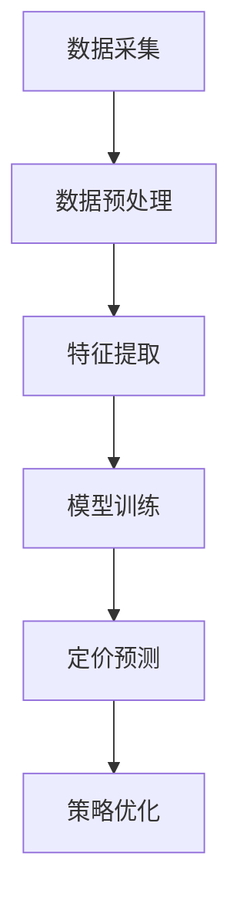

                 

# AI驱动的电商智能定价：大模型在竞争环境中的应用

> **关键词**：人工智能、电商定价、大模型、竞争环境、智能决策

> **摘要**：本文探讨了在竞争激烈的电商环境中，如何运用人工智能技术，特别是大模型，实现智能定价策略。通过深入分析核心概念、算法原理、数学模型以及实际应用案例，本文展示了如何将AI与电商业务紧密结合，以实现更高效、更精准的定价策略。

## 1. 背景介绍

在当今的电商市场中，价格竞争已成为商家获取市场份额和用户忠诚度的重要手段。然而，传统定价方法往往难以应对市场变化和竞争对手的策略调整。随着人工智能技术的飞速发展，特别是深度学习和大规模数据模型的出现，为电商定价带来了新的机遇和挑战。

### 1.1 电商市场的挑战

电商市场面临的挑战主要包括：

- **动态价格竞争**：电商平台上的价格战日益激烈，商家需要快速响应市场变化。
- **消费者行为多样**：消费者的购买行为受到多种因素的影响，包括价格、产品特性、品牌等。
- **大数据分析**：海量的销售数据、用户行为数据等需要有效的分析方法来指导定价策略。

### 1.2 人工智能在电商中的应用

人工智能在电商中的应用主要包括：

- **推荐系统**：通过用户行为数据，为用户提供个性化的商品推荐。
- **智能客服**：通过自然语言处理技术，实现与用户的智能对话。
- **智能定价**：利用大数据分析和机器学习算法，实现动态定价策略。

### 1.3 大模型的优势

大模型在电商智能定价中的优势主要体现在：

- **数据处理能力**：能够处理大规模、多维度的数据。
- **预测准确性**：通过学习历史数据，能够准确预测市场需求和消费者行为。
- **自适应调整**：能够根据市场变化和用户反馈，动态调整定价策略。

## 2. 核心概念与联系

### 2.1 电商智能定价的定义

电商智能定价是指利用人工智能技术，特别是大模型，对电商商品的价格进行动态调整，以达到最优定价效果的过程。它包括数据采集、数据处理、模型训练、定价策略优化等多个环节。

### 2.2 大模型的组成

大模型通常由以下几部分组成：

- **输入层**：接收各种输入数据，如商品特性、用户行为、市场趋势等。
- **隐藏层**：通过对输入数据进行处理和变换，提取有用的特征。
- **输出层**：根据模型的预测结果，生成相应的定价策略。

### 2.3 大模型在电商定价中的应用流程

大模型在电商定价中的应用流程通常包括以下步骤：

1. 数据采集：收集与商品定价相关的各种数据，如历史价格、销售数据、市场趋势等。
2. 数据预处理：对采集到的数据进行清洗、归一化等处理，以消除噪声和异常值。
3. 特征提取：从预处理后的数据中提取有用的特征，如商品属性、用户特征、市场指标等。
4. 模型训练：使用提取的特征，通过机器学习算法训练大模型。
5. 预测与优化：利用训练好的模型进行定价预测，并根据预测结果优化定价策略。

### 2.4 Mermaid 流程图

以下是一个简化的电商智能定价流程的 Mermaid 流程图：



## 3. 核心算法原理 & 具体操作步骤

### 3.1 算法原理

电商智能定价的核心算法通常是基于机器学习的定价优化算法。这些算法通过学习历史数据和用户行为，预测未来的市场需求和消费者反应，从而生成最优定价策略。

### 3.2 操作步骤

#### 3.2.1 数据采集

数据采集是智能定价的基础。需要采集的数据包括：

- **历史价格数据**：包括商品在过去一段时间内的价格变化情况。
- **销售数据**：包括商品的销量、销售额等指标。
- **用户行为数据**：包括用户在电商平台的浏览、点击、购买等行为。
- **市场趋势数据**：包括市场供需关系、竞争对手价格变化等。

#### 3.2.2 数据预处理

数据预处理包括以下步骤：

- **数据清洗**：去除重复数据、缺失值和异常值。
- **归一化**：将不同特征的数据进行归一化处理，以消除数据量级差异。
- **特征工程**：提取与定价相关的特征，如商品属性、用户特征、市场指标等。

#### 3.2.3 模型训练

模型训练通常采用以下步骤：

- **选择模型**：根据业务需求选择合适的机器学习模型，如线性回归、决策树、神经网络等。
- **划分数据集**：将数据集划分为训练集、验证集和测试集。
- **模型训练**：使用训练集训练模型，调整模型参数。
- **模型评估**：使用验证集和测试集评估模型性能。

#### 3.2.4 预测与优化

模型训练完成后，可以进行以下步骤：

- **定价预测**：使用训练好的模型预测未来的市场需求和消费者反应。
- **策略优化**：根据预测结果，动态调整商品价格，以达到最优定价效果。

## 4. 数学模型和公式 & 详细讲解 & 举例说明

### 4.1 数学模型

电商智能定价的数学模型通常基于需求函数和价格弹性模型。以下是一个简化的数学模型：

$$
Q = f(P, X)
$$

其中，$Q$ 表示市场需求量，$P$ 表示商品价格，$X$ 表示影响需求的其它因素，如用户特征、市场趋势等。

### 4.2 价格弹性模型

价格弹性是衡量市场需求对价格变化的敏感程度。以下是一个简化的价格弹性模型：

$$
E = \frac{P\frac{dQ}{dP}}{Q}
$$

其中，$E$ 表示价格弹性，$P$ 表示商品价格，$Q$ 表示市场需求量。

### 4.3 举例说明

假设一个电商平台的某商品价格从 $100$ 元调整到 $90$ 元，导致销量从 $100$ 单位增加到 $150$ 单位。根据价格弹性模型，可以计算出价格弹性：

$$
E = \frac{90\frac{150-100}{90}}{150} = 0.67
$$

这意味着市场需求对价格变化的敏感程度较低。根据这个弹性值，可以调整定价策略，如适当降低价格，以刺激销量增长。

## 5. 项目实战：代码实际案例和详细解释说明

### 5.1 开发环境搭建

为了实现电商智能定价，首先需要搭建相应的开发环境。以下是一个基本的开发环境搭建流程：

1. 安装 Python 解释器（如 Python 3.8 或更高版本）。
2. 安装必要的库，如 NumPy、Pandas、Scikit-learn 等。
3. 安装深度学习框架，如 TensorFlow 或 PyTorch。

### 5.2 源代码详细实现和代码解读

以下是一个简化的电商智能定价代码实现：

```python
import pandas as pd
from sklearn.linear_model import LinearRegression

# 读取数据
data = pd.read_csv('ecommerce_data.csv')

# 数据预处理
# ...

# 特征提取
X = data[['price', 'user_feature', 'market_trend']]
y = data['sales']

# 模型训练
model = LinearRegression()
model.fit(X, y)

# 定价预测
predicted_sales = model.predict(X)

# 策略优化
# ...

print('预测销量：', predicted_sales)
```

### 5.3 代码解读与分析

上述代码实现了一个简化的电商智能定价模型。具体解读如下：

- **数据读取**：使用 Pandas 读取电商数据，包括价格、用户特征、市场趋势和销量。
- **数据预处理**：对数据进行清洗、归一化等预处理操作。
- **特征提取**：将价格、用户特征和市场趋势作为输入特征，销量作为输出目标。
- **模型训练**：使用线性回归模型训练数据，拟合输入特征和销量之间的关系。
- **定价预测**：使用训练好的模型预测未来的销量。
- **策略优化**：根据预测结果，动态调整商品价格，以达到最优定价效果。

## 6. 实际应用场景

电商智能定价在多个场景中具有广泛的应用，包括：

- **新品上市定价**：为新商品制定合理的上市价格，以吸引消费者。
- **促销活动定价**：为促销活动制定有吸引力的价格策略，提高销量。
- **价格战应对**：在竞争对手降价时，迅速调整价格，保持市场竞争力。
- **库存管理**：根据销售预测，优化库存水平，减少库存积压。

## 7. 工具和资源推荐

### 7.1 学习资源推荐

- **书籍**：
  - 《Python机器学习》
  - 《深度学习》
- **论文**：
  - "Deep Learning for E-commerce Recommendation"
  - "Price Optimization for E-commerce: A Machine Learning Approach"
- **博客**：
  - [机器学习实战](https://机器学习实战)
  - [深度学习博客](https://深度学习博客)
- **网站**：
  - [Kaggle](https://www.kaggle.com)
  - [GitHub](https://github.com)

### 7.2 开发工具框架推荐

- **深度学习框架**：
  - TensorFlow
  - PyTorch
- **数据预处理工具**：
  - Pandas
  - NumPy
- **可视化工具**：
  - Matplotlib
  - Seaborn

### 7.3 相关论文著作推荐

- **论文**：
  - "Deep Learning for E-commerce Recommendation"
  - "Price Optimization for E-commerce: A Machine Learning Approach"
  - "A Multi-Armed Bandit Approach for Real-Time E-commerce Pricing"
- **著作**：
  - 《深度学习》
  - 《Python机器学习》

## 8. 总结：未来发展趋势与挑战

随着人工智能技术的不断发展，电商智能定价将在未来发挥更大的作用。然而，这也带来了一系列挑战：

- **数据隐私**：如何在保证数据隐私的前提下，有效利用用户数据。
- **模型解释性**：如何提高模型的解释性，使其易于理解和接受。
- **实时响应**：如何实现实时定价策略，以应对市场变化。

## 9. 附录：常见问题与解答

### 9.1 什么是电商智能定价？

电商智能定价是指利用人工智能技术，特别是大模型，对电商商品的价格进行动态调整，以达到最优定价效果的过程。

### 9.2 电商智能定价有哪些优势？

电商智能定价的优势包括：提高定价准确性、实时响应市场变化、提高销售转化率等。

### 9.3 电商智能定价需要哪些数据？

电商智能定价需要的数据包括：历史价格数据、销售数据、用户行为数据、市场趋势数据等。

### 9.4 电商智能定价算法有哪些？

电商智能定价算法主要包括：线性回归、决策树、神经网络、强化学习等。

## 10. 扩展阅读 & 参考资料

- [深度学习在电商定价中的应用](https://www.deeplearning.ai)
- [机器学习在电商定价中的应用](https://www.mClearning.ai)
- [Kaggle 上的电商定价比赛](https://www.kaggle.com/competitions)
- [GitHub 上的电商智能定价项目](https://github.com/search?q=ecommerce+pricing+ai)

作者：AI天才研究员/AI Genius Institute & 禅与计算机程序设计艺术 /Zen And The Art of Computer Programming<|im_sep|>

