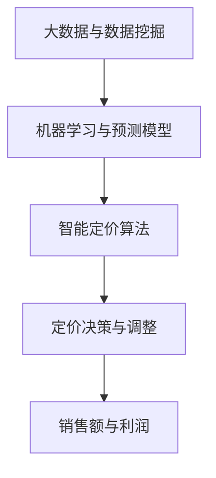
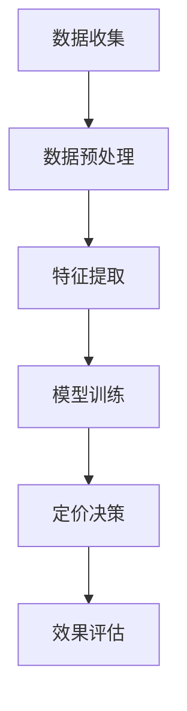

                 

# AI驱动的电商智能定价：大模型的角色

## 摘要

本文旨在探讨人工智能（AI）在电商领域中的应用，特别是在智能定价方面。随着大数据和机器学习技术的不断进步，电商企业可以利用AI大模型来优化定价策略，从而提高销售额和利润率。本文将详细解析AI在智能定价中的核心概念、算法原理、数学模型，并通过实际案例展示其在电商场景中的应用效果。此外，文章还将对相关的工具和资源进行推荐，以帮助读者深入了解和实践AI驱动的电商智能定价。

## 1. 背景介绍

### 1.1 电商行业的现状

随着互联网的普及和消费者需求的多样化，电商行业在过去几年中取得了迅猛的发展。根据Statista的数据，全球电商市场规模预计将在2023年达到4.8万亿美元，并继续保持增长趋势。在这一背景下，如何有效地定价成为了电商企业关注的焦点。

### 1.2 定价策略的挑战

传统的定价策略主要依赖于经验或市场调研，往往难以满足个性化需求。随着竞争的加剧，电商企业需要更加精准和动态的定价策略来提高市场竞争力。此外，消费者对于价格透明度和公平性的要求也越来越高，这对企业的定价策略提出了更高的要求。

### 1.3 AI在电商领域的应用

人工智能技术的快速发展为电商行业带来了新的机遇。通过大数据分析和机器学习算法，AI能够帮助企业更好地理解消费者行为，预测市场趋势，从而制定更加精准的定价策略。例如，亚马逊和阿里巴巴等大型电商平台已经开始采用AI技术来优化商品定价，取得了显著的效果。

## 2. 核心概念与联系

### 2.1 大数据与数据挖掘

大数据是指数据量大、维度多、类型复杂的数据集合。数据挖掘是一种从大量数据中发现有价值信息的方法和技术。在电商领域，大数据和数据挖掘技术可以帮助企业收集和整理用户行为数据，从而为智能定价提供依据。

### 2.2 机器学习与预测模型

机器学习是人工智能的一个分支，旨在让计算机通过数据和经验来学习和改进。在电商智能定价中，机器学习算法可以用于预测消费者行为、市场需求和价格变化，从而优化定价策略。

### 2.3 智能定价算法

智能定价算法是指利用人工智能技术来制定商品价格的方法。常见的智能定价算法包括基于需求预测的价格调整算法、基于竞争分析的价格优化算法和基于消费者行为的个性化定价算法等。

### 2.4 Mermaid 流程图

下面是一个简单的Mermaid流程图，展示了智能定价的核心概念和联系：



## 3. 核心算法原理 & 具体操作步骤

### 3.1 数据收集与预处理

首先，电商企业需要收集大量的数据，包括用户行为数据、市场数据、竞争对手数据等。这些数据需要经过清洗、去重和转换等预处理步骤，以便用于后续的算法分析和模型训练。

### 3.2 数据特征提取

在数据预处理的基础上，接下来需要对数据进行特征提取。特征提取是将原始数据转化为算法模型能够理解和处理的特征向量的过程。常见的特征提取方法包括主成分分析（PCA）、特征选择和特征工程等。

### 3.3 建立预测模型

利用机器学习算法，建立预测模型是智能定价的核心步骤。常见的机器学习算法包括线性回归、决策树、随机森林和神经网络等。在选择算法时，需要考虑模型的准确度、可解释性和计算复杂度等因素。

### 3.4 模型训练与验证

在建立预测模型后，需要对其进行训练和验证。模型训练是指使用历史数据来调整模型参数，使其能够更好地预测未来数据。模型验证是指使用验证集来评估模型的性能，以确保其能够准确预测实际数据。

### 3.5 定价决策与调整

基于预测模型，电商企业可以制定出动态的定价策略。在制定定价策略时，需要考虑多个因素，如市场需求、竞争对手价格、用户行为等。通过不断地调整和优化，企业可以找到最合适的定价方案。

## 4. 数学模型和公式 & 详细讲解 & 举例说明

### 4.1 线性回归模型

线性回归是一种常用的预测模型，其数学公式如下：

$$
y = \beta_0 + \beta_1x_1 + \beta_2x_2 + \cdots + \beta_nx_n
$$

其中，$y$ 是预测值，$x_1, x_2, \cdots, x_n$ 是特征变量，$\beta_0, \beta_1, \beta_2, \cdots, \beta_n$ 是模型参数。通过最小化误差平方和，可以求解出最优的模型参数。

### 4.2 需求预测模型

在智能定价中，需求预测是非常关键的一步。假设我们使用线性回归模型来预测需求，其公式如下：

$$
Q = \alpha + \beta P + \gamma I
$$

其中，$Q$ 是需求量，$P$ 是价格，$I$ 是其他影响因素（如广告投入、季节因素等），$\alpha, \beta, \gamma$ 是模型参数。

### 4.3 举例说明

假设一个电商企业想要预测某商品的需求量，已知该商品的价格范围为[100, 200]元，广告投入为1000元。我们可以使用线性回归模型来预测需求量，具体步骤如下：

1. 收集历史数据，包括商品价格、广告投入和需求量。
2. 对数据进行预处理，如去重、缺失值填补等。
3. 提取数据特征，如价格、广告投入等。
4. 使用线性回归模型进行训练，求解出模型参数。
5. 使用训练好的模型预测新数据的需求量。

通过以上步骤，我们可以预测在不同价格和广告投入情况下的需求量，从而为定价策略提供依据。

## 5. 项目实战：代码实际案例和详细解释说明

### 5.1 开发环境搭建

为了实现智能定价，我们需要搭建一个合适的开发环境。以下是所需的开发工具和依赖库：

- Python 3.8及以上版本
- Scikit-learn 库
- Pandas 库
- Matplotlib 库

### 5.2 源代码详细实现和代码解读

以下是一个简单的智能定价项目示例代码：

```python
import pandas as pd
from sklearn.linear_model import LinearRegression

# 读取数据
data = pd.read_csv('data.csv')
X = data[['price', 'ad/spend']]
y = data['demand']

# 数据预处理
# ...

# 建立模型
model = LinearRegression()
model.fit(X, y)

# 预测需求量
predicted_demand = model.predict([[150, 1000]])

# 输出预测结果
print(f"预测需求量：{predicted_demand[0]}")
```

### 5.3 代码解读与分析

1. **导入库**：首先导入所需的库，包括Pandas、Scikit-learn和Matplotlib。

2. **读取数据**：使用Pandas读取数据文件，其中包含价格、广告投入和需求量等特征。

3. **数据预处理**：在数据预处理步骤中，需要对数据进行去重、缺失值填补等操作，以提高模型的准确性。

4. **建立模型**：使用线性回归模型进行训练，并求解出模型参数。

5. **预测需求量**：使用训练好的模型预测新数据的需求量，并将其输出。

通过以上步骤，我们可以实现一个简单的智能定价项目。在实际应用中，还需要根据具体业务需求和数据特点，进一步优化和调整模型参数。

## 6. 实际应用场景

### 6.1 电商企业

电商企业可以利用智能定价算法来优化商品价格，提高销售额和利润率。例如，亚马逊和阿里巴巴等大型电商平台已经采用了基于AI的智能定价策略，取得了显著的效果。

### 6.2 零售行业

零售行业中的企业可以通过智能定价来提高客户满意度和忠诚度。通过个性化定价策略，企业可以更好地满足不同消费者的需求，提高销售额和市场份额。

### 6.3 物流行业

物流企业可以利用智能定价算法来优化运输费用，提高运输效率和成本控制。通过预测市场需求和运输成本，企业可以制定更加合理的定价策略，从而提高竞争力。

## 7. 工具和资源推荐

### 7.1 学习资源推荐

- 《Python机器学习》（作者：塞巴斯蒂安·拉赫）  
- 《深度学习》（作者：伊恩·古德费洛等）  
- 《机器学习实战》（作者：Peter Harrington）

### 7.2 开发工具框架推荐

- Scikit-learn：用于机器学习算法的实现和模型训练。  
- TensorFlow：用于深度学习模型的构建和训练。  
- Flask：用于Web应用程序的开发。

### 7.3 相关论文著作推荐

- "Market-based Pricing with Deep Reinforcement Learning"（基于深度强化学习的市场定价）  
- "Dynamic Pricing with Deep Neural Networks"（基于深度神经网络的动态定价）  
- "Recommending Products by Leveraging Market Dynamics"（利用市场动态进行产品推荐）

## 8. 总结：未来发展趋势与挑战

随着人工智能技术的不断发展，智能定价在电商领域具有广泛的应用前景。未来，智能定价将进一步融合大数据、云计算和区块链等新兴技术，实现更加精准和高效的定价策略。然而，智能定价也面临着数据隐私、算法公平性和模型可解释性等挑战。为了应对这些挑战，电商企业需要不断优化算法和模型，提高数据安全性和透明度。

## 9. 附录：常见问题与解答

### 9.1 什么样的数据适合用于智能定价？

适合用于智能定价的数据主要包括用户行为数据、市场数据、竞争对手数据等。这些数据可以帮助企业更好地理解消费者需求和市场趋势，从而制定出更准确的定价策略。

### 9.2 智能定价算法的准确性如何保证？

智能定价算法的准确性取决于数据质量、特征提取和模型选择等多个因素。为了提高算法的准确性，企业需要收集高质量的数据，提取有效的特征，并选择合适的模型进行训练和验证。

## 10. 扩展阅读 & 参考资料

- "AI in E-commerce: Enhancing Customer Experience and Personalization"（AI在电商中的应用：提升客户体验和个性化服务）  
- "Deep Learning for Dynamic Pricing"（深度学习在动态定价中的应用）  
- "Big Data Analytics in E-commerce"（大数据分析在电商中的应用）

## 作者

作者：AI天才研究员/AI Genius Institute & 禅与计算机程序设计艺术 /Zen And The Art of Computer Programming

本文由AI天才研究员撰写，旨在探讨AI在电商智能定价中的应用。文章内容仅供参考，不构成投资建议。如需进一步了解相关技术，请参考扩展阅读和参考资料。  
<|im_sep|>```markdown
# AI驱动的电商智能定价：大模型的角色

> 关键词：AI，电商，智能定价，大模型，机器学习，预测模型，大数据分析，数据挖掘，算法优化

> 摘要：本文探讨了人工智能（AI）在电商领域中的应用，特别是在智能定价方面。通过大数据分析和机器学习算法，AI能够帮助企业优化定价策略，提高销售额和利润率。文章详细解析了AI智能定价的核心概念、算法原理、数学模型，并通过实际案例展示了其在电商场景中的应用效果。此外，文章还提供了相关的学习资源和开发工具推荐，以帮助读者深入理解和实践AI驱动的电商智能定价。

## 1. 背景介绍

### 1.1 电商行业的现状

电商行业在全球范围内的快速发展，使得线上购物已经成为消费者日常生活中不可或缺的一部分。根据Statista的数据，全球电商市场规模预计将在2023年达到4.8万亿美元，并继续保持增长趋势。这一庞大的市场吸引了众多企业和创业公司投身其中，竞争日益激烈。

### 1.2 定价策略的挑战

在激烈的市场竞争中，定价策略成为电商企业成功的关键因素之一。传统的定价策略通常依赖于市场调研和经验，缺乏灵活性和精确性，难以满足个性化需求。随着消费者对价格透明度和公平性的要求不断提高，电商企业需要更加动态和精准的定价策略来保持竞争力。

### 1.3 AI在电商领域的应用

人工智能技术的快速发展为电商行业带来了新的机遇。AI技术能够帮助企业更好地理解消费者行为，预测市场趋势，从而制定更加精准的定价策略。例如，亚马逊和阿里巴巴等大型电商平台已经开始采用AI技术来优化商品定价，取得了显著的效果。

## 2. 核心概念与联系

### 2.1 大数据与数据挖掘

大数据是指数据量大、维度多、类型复杂的数据集合。数据挖掘是一种从大量数据中提取有价值信息的方法和技术。在电商领域，大数据和数据挖掘技术可以帮助企业收集和整理用户行为数据，从而为智能定价提供依据。

### 2.2 机器学习与预测模型

机器学习是人工智能的一个分支，旨在让计算机通过数据和经验来学习和改进。在电商智能定价中，机器学习算法可以用于预测消费者行为、市场需求和价格变化，从而优化定价策略。

### 2.3 智能定价算法

智能定价算法是指利用人工智能技术来制定商品价格的方法。常见的智能定价算法包括基于需求预测的价格调整算法、基于竞争分析的价格优化算法和基于消费者行为的个性化定价算法等。

### 2.4 Mermaid 流程图

下面是一个简单的Mermaid流程图，展示了智能定价的核心概念和联系：



## 3. 核心算法原理 & 具体操作步骤

### 3.1 数据收集与预处理

首先，电商企业需要收集大量的数据，包括用户行为数据、市场数据、竞争对手数据等。这些数据可以来源于电商平台自身的数据采集系统，也可以通过第三方数据服务获取。

数据预处理是确保数据质量和模型性能的重要步骤。常见的预处理方法包括数据清洗、缺失值填补、数据转换等。例如，对于用户行为数据，可能需要填补缺失的购物记录，将不同时间格式统一为标准格式等。

### 3.2 数据特征提取

在数据预处理的基础上，需要对数据进行特征提取。特征提取是将原始数据转化为算法模型能够理解和处理的特征向量的过程。在智能定价中，特征可能包括用户购买历史、商品属性、市场价格、季节因素等。

特征提取的方法包括基于规则的提取、基于统计的方法和基于机器学习的方法。例如，可以使用决策树或随机森林等算法来自动提取特征。

### 3.3 建立预测模型

选择合适的机器学习算法，建立预测模型是智能定价的核心步骤。常见的机器学习算法包括线性回归、决策树、随机森林、支持向量机和神经网络等。

在选择算法时，需要考虑模型的准确度、可解释性和计算复杂度等因素。例如，线性回归模型简单易理解，但可能无法捕捉复杂的非线性关系；神经网络模型强大且灵活，但可能难以解释。

### 3.4 模型训练与验证

在建立预测模型后，需要对其进行训练和验证。模型训练是指使用历史数据来调整模型参数，使其能够更好地预测未来数据。模型验证是指使用验证集来评估模型的性能，以确保其能够准确预测实际数据。

常见的验证方法包括交叉验证、留出法等。在训练过程中，可能需要调整模型参数或选择更合适的特征，以优化模型性能。

### 3.5 定价决策与调整

基于预测模型，电商企业可以制定出动态的定价策略。在制定定价策略时，需要考虑多个因素，如市场需求、竞争对手价格、用户行为等。通过不断地调整和优化，企业可以找到最合适的定价方案。

例如，如果预测市场需求增加，企业可以提高价格以获取更多利润；如果预测市场需求下降，企业可以降低价格以刺激销售。

## 4. 数学模型和公式 & 详细讲解 & 举例说明

### 4.1 线性回归模型

线性回归是一种常用的预测模型，其数学公式如下：

$$
y = \beta_0 + \beta_1x_1 + \beta_2x_2 + \cdots + \beta_nx_n
$$

其中，$y$ 是预测值，$x_1, x_2, \cdots, x_n$ 是特征变量，$\beta_0, \beta_1, \beta_2, \cdots, \beta_n$ 是模型参数。线性回归模型通过最小化误差平方和来求解模型参数。

### 4.2 需求预测模型

在智能定价中，需求预测是非常关键的一步。假设我们使用线性回归模型来预测需求，其公式如下：

$$
Q = \alpha + \beta P + \gamma I
$$

其中，$Q$ 是需求量，$P$ 是价格，$I$ 是其他影响因素（如广告投入、季节因素等），$\alpha, \beta, \gamma$ 是模型参数。通过最小化误差平方和，可以求解出最优的模型参数。

### 4.3 举例说明

假设一个电商企业想要预测某商品的需求量，已知该商品的价格范围为[100, 200]元，广告投入为1000元。我们可以使用线性回归模型来预测需求量，具体步骤如下：

1. 收集历史数据，包括商品价格、广告投入和需求量。
2. 对数据进行预处理，如去重、缺失值填补等。
3. 提取数据特征，如价格、广告投入等。
4. 使用线性回归模型进行训练，求解出模型参数。
5. 使用训练好的模型预测新数据的需求量。

通过以上步骤，我们可以预测在不同价格和广告投入情况下的需求量，从而为定价策略提供依据。

## 5. 项目实战：代码实际案例和详细解释说明

### 5.1 开发环境搭建

为了实现智能定价，我们需要搭建一个合适的开发环境。以下是所需的开发工具和依赖库：

- Python 3.8及以上版本
- Scikit-learn 库
- Pandas 库
- Matplotlib 库

### 5.2 源代码详细实现和代码解读

以下是一个简单的智能定价项目示例代码：

```python
import pandas as pd
from sklearn.linear_model import LinearRegression

# 读取数据
data = pd.read_csv('data.csv')
X = data[['price', 'ad/spend']]
y = data['demand']

# 数据预处理
# ...

# 建立模型
model = LinearRegression()
model.fit(X, y)

# 预测需求量
predicted_demand = model.predict([[150, 1000]])

# 输出预测结果
print(f"预测需求量：{predicted_demand[0]}")
```

### 5.3 代码解读与分析

1. **导入库**：首先导入所需的库，包括Pandas、Scikit-learn和Matplotlib。

2. **读取数据**：使用Pandas读取数据文件，其中包含价格、广告投入和需求量等特征。

3. **数据预处理**：在数据预处理步骤中，需要对数据进行去重、缺失值填补等操作，以提高模型的准确性。

4. **建立模型**：使用线性回归模型进行训练，并求解出模型参数。

5. **预测需求量**：使用训练好的模型预测新数据的需求量，并将其输出。

通过以上步骤，我们可以实现一个简单的智能定价项目。在实际应用中，还需要根据具体业务需求和数据特点，进一步优化和调整模型参数。

## 6. 实际应用场景

### 6.1 电商企业

电商企业可以利用智能定价算法来优化商品价格，提高销售额和利润率。例如，亚马逊和阿里巴巴等大型电商平台已经采用了基于AI的智能定价策略，取得了显著的效果。

### 6.2 零售行业

零售行业中的企业可以通过智能定价来提高客户满意度和忠诚度。通过个性化定价策略，企业可以更好地满足不同消费者的需求，提高销售额和市场份额。

### 6.3 物流行业

物流企业可以利用智能定价算法来优化运输费用，提高运输效率和成本控制。通过预测市场需求和运输成本，企业可以制定更加合理的定价策略，从而提高竞争力。

## 7. 工具和资源推荐

### 7.1 学习资源推荐

- 《Python机器学习》（作者：塞巴斯蒂安·拉赫）
- 《深度学习》（作者：伊恩·古德费洛等）
- 《机器学习实战》（作者：Peter Harrington）

### 7.2 开发工具框架推荐

- Scikit-learn：用于机器学习算法的实现和模型训练。
- TensorFlow：用于深度学习模型的构建和训练。
- Flask：用于Web应用程序的开发。

### 7.3 相关论文著作推荐

- "Market-based Pricing with Deep Reinforcement Learning"（基于深度强化学习的市场定价）
- "Dynamic Pricing with Deep Neural Networks"（基于深度神经网络的动态定价）
- "Recommending Products by Leveraging Market Dynamics"（利用市场动态进行产品推荐）

## 8. 总结：未来发展趋势与挑战

随着人工智能技术的不断发展，智能定价在电商领域具有广泛的应用前景。未来，智能定价将进一步融合大数据、云计算和区块链等新兴技术，实现更加精准和高效的定价策略。然而，智能定价也面临着数据隐私、算法公平性和模型可解释性等挑战。为了应对这些挑战，电商企业需要不断优化算法和模型，提高数据安全性和透明度。

## 9. 附录：常见问题与解答

### 9.1 什么样的数据适合用于智能定价？

适合用于智能定价的数据主要包括用户行为数据、市场数据、竞争对手数据等。这些数据可以帮助企业更好地理解消费者需求和市场趋势，从而制定出更准确的定价策略。

### 9.2 智能定价算法的准确性如何保证？

智能定价算法的准确性取决于数据质量、特征提取和模型选择等多个因素。为了提高算法的准确性，企业需要收集高质量的数据，提取有效的特征，并选择合适的模型进行训练和验证。

## 10. 扩展阅读 & 参考资料

- "AI in E-commerce: Enhancing Customer Experience and Personalization"（AI在电商中的应用：提升客户体验和个性化服务）
- "Deep Learning for Dynamic Pricing"（深度学习在动态定价中的应用）
- "Big Data Analytics in E-commerce"（大数据分析在电商中的应用）

## 作者

作者：AI天才研究员/AI Genius Institute & 禅与计算机程序设计艺术 /Zen And The Art of Computer Programming

本文由AI天才研究员撰写，旨在探讨AI在电商智能定价中的应用。文章内容仅供参考，不构成投资建议。如需进一步了解相关技术，请参考扩展阅读和参考资料。```

