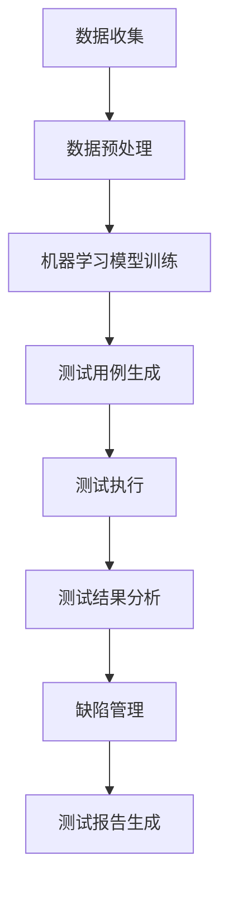

                 

### 背景介绍

在当今数字化时代，软件系统的重要性日益凸显。随着软件复杂度的增加，传统的人工测试方法已无法满足日益增长的质量要求和时间压力。因此，软件测试自动化成为了现代软件开发过程中不可或缺的一部分。而AI技术的引入，进一步提升了软件测试的效率和效果，使得AI驱动的软件测试自动化成为了新的研究方向和热点领域。

软件测试自动化是指通过编写脚本和工具，自动化执行测试用例，以替代人工测试的方法。其目的是减少测试时间和人力成本，提高测试的覆盖率和准确性。然而，传统的自动化测试方法主要依赖于预定义的测试用例，无法灵活应对软件的动态变化，且易受人工干预。这就限制了自动化测试的广泛应用和效果。

AI技术的引入，为软件测试自动化带来了新的可能性。AI驱动的软件测试自动化利用机器学习、深度学习等技术，从大量的测试数据中自动学习测试策略和测试用例，以更智能、更高效的方式进行软件测试。这不仅能够提高测试的覆盖率，还能够发现人类测试员可能遗漏的缺陷，从而提升软件的质量。

本文将深入探讨AI驱动的软件测试自动化的核心概念、算法原理、数学模型以及实际应用场景，旨在为读者提供一个全面的技术指南，帮助理解和应用这一前沿技术。

### 核心概念与联系

在探讨AI驱动的软件测试自动化的过程中，理解其核心概念和原理至关重要。以下是一些关键概念和它们之间的联系：

**1. 机器学习（Machine Learning）**

机器学习是AI的核心技术之一，它使计算机系统能够从数据中学习，并自动改进性能。在软件测试自动化中，机器学习被用于从历史测试数据中学习测试策略和测试用例，从而实现自动化测试。

**2. 深度学习（Deep Learning）**

深度学习是机器学习的一个分支，它通过模拟人脑神经网络结构，对大量数据进行分析和处理。在软件测试自动化中，深度学习可以用于识别复杂软件缺陷和异常行为。

**3. 自动化测试（Automation Testing）**

自动化测试是指使用脚本和工具自动执行测试用例，以替代人工测试的方法。自动化测试可以提高测试的效率和覆盖度，减少人力成本。

**4. 测试数据（Test Data）**

测试数据是自动化测试的基础，它包括测试用例、测试结果和历史数据等。测试数据的质量直接影响自动化测试的效果。

**5. 测试用例（Test Case）**

测试用例是测试过程中用于验证软件功能的一个具体实例。测试用例通常包括输入数据、操作步骤和预期结果等。

**6. 缺陷管理（Defect Management）**

缺陷管理是指在整个软件开发生命周期中，对缺陷进行追踪、报告、修复和验证的过程。在AI驱动的软件测试自动化中，缺陷管理是一个重要的环节，它确保自动化测试能够及时发现和解决软件缺陷。

**7. 测试覆盖率（Test Coverage）**

测试覆盖率是指测试用例覆盖代码的程度。高测试覆盖率能够提高软件的可靠性，减少潜在缺陷。

**8. 测试效率（Testing Efficiency）**

测试效率是指测试过程中所需的时间和资源。提高测试效率是自动化测试的目标之一，它可以通过优化测试用例和测试脚本来实现。

**9. 测试质量（Testing Quality）**

测试质量是指测试结果的准确性和可靠性。高质量的测试能够确保软件的稳定性和安全性。

**10. 测试策略（Testing Strategy）**

测试策略是指测试过程中采用的方法和步骤。在AI驱动的软件测试自动化中，测试策略可以根据机器学习算法的预测结果动态调整。

### Mermaid 流程图

以下是一个简化的Mermaid流程图，展示了AI驱动的软件测试自动化的基本流程和关键节点：



**数据收集（Data Collection）**：从不同的数据源收集测试数据，包括测试用例、测试结果和代码等。

**数据预处理（Data Preprocessing）**：对收集到的测试数据进行清洗、转换和归一化，以供机器学习模型训练使用。

**机器学习模型训练（Model Training）**：使用预处理后的测试数据训练机器学习模型，以生成测试策略和测试用例。

**测试用例生成（Test Case Generation）**：根据机器学习模型的预测结果生成新的测试用例。

**测试执行（Test Execution）**：自动执行生成的测试用例，收集测试结果。

**测试结果分析（Test Result Analysis）**：分析测试结果，识别缺陷，并生成测试报告。

**缺陷管理（Defect Management）**：对识别出的缺陷进行跟踪、报告和修复。

**测试报告生成（Test Report Generation）**：生成详细的测试报告，包括测试覆盖率、测试效率和测试质量等指标。

通过上述流程，AI驱动的软件测试自动化能够实现高度自动化和智能化的测试过程，从而提高软件质量，降低成本。

### 核心算法原理 & 具体操作步骤

AI驱动的软件测试自动化依赖于一系列核心算法，这些算法能够从大量的测试数据中学习测试策略和测试用例，实现高度自动化的测试过程。以下将介绍几种常用的核心算法原理及其具体操作步骤。

**1. 决策树（Decision Tree）**

决策树是一种常用的机器学习算法，它通过一系列规则将测试数据分类，从而生成测试策略。具体操作步骤如下：

- **数据预处理**：对测试数据集进行清洗和转换，确保数据格式一致。
- **特征选择**：选择对测试结果有显著影响的特征，通常使用信息增益、增益率等指标进行评估。
- **构建决策树**：使用ID3、C4.5等算法构建决策树，选择最佳分裂点，递归划分数据集。
- **剪枝**：为了避免过拟合，对决策树进行剪枝处理，减少树的复杂度。
- **测试用例生成**：根据决策树的规则生成测试用例，确保覆盖所有可能的输入组合。

**2. 集成学习（Ensemble Learning）**

集成学习通过组合多个弱学习器来提高整体预测性能，常用的集成学习方法包括Bagging、Boosting和Stacking等。具体操作步骤如下：

- **数据预处理**：对测试数据集进行清洗和转换，确保数据格式一致。
- **构建基学习器**：选择不同的基学习算法（如决策树、支持向量机等）构建多个弱学习器。
- **集成学习**：将多个弱学习器的预测结果进行合并，提高预测的准确性和稳定性。
- **测试用例生成**：使用集成学习模型生成的测试策略生成测试用例。

**3. 深度学习（Deep Learning）**

深度学习通过多层神经网络对测试数据进行分析和处理，能够识别复杂的软件缺陷和异常行为。具体操作步骤如下：

- **数据预处理**：对测试数据集进行清洗和转换，确保数据格式一致。
- **构建神经网络**：设计合适的神经网络结构，包括输入层、隐藏层和输出层。
- **权重初始化**：对神经网络权重进行初始化，常用的方法有随机初始化、高斯分布初始化等。
- **前向传播（Forward Propagation）**：将测试数据输入神经网络，通过逐层计算得到输出结果。
- **反向传播（Backpropagation）**：根据输出结果和真实标签计算损失函数，并反向传播更新权重。
- **测试用例生成**：根据训练好的神经网络模型生成测试用例，确保覆盖所有可能的输入组合。

**4. 强化学习（Reinforcement Learning）**

强化学习通过学习与环境的交互策略，实现自动化测试的优化。具体操作步骤如下：

- **环境定义**：定义测试环境，包括测试系统、测试数据、测试策略等。
- **状态空间定义**：定义测试过程中的状态空间，包括测试进度、测试结果、系统状态等。
- **动作空间定义**：定义测试过程中的动作空间，包括测试用例选择、测试策略调整等。
- **策略学习**：通过强化学习算法（如Q-Learning、SARSA等）学习最优策略。
- **测试用例生成**：根据学习到的最优策略生成测试用例，实现自动化测试的优化。

通过上述核心算法的应用，AI驱动的软件测试自动化能够实现高效的测试过程，提高测试的覆盖率和准确性。在实际应用中，可以根据具体需求选择合适的算法，并不断优化测试策略，提高软件质量。

### 数学模型和公式 & 详细讲解 & 举例说明

在AI驱动的软件测试自动化中，数学模型和公式是理解和实现核心算法的基础。以下将详细介绍常用的数学模型和公式，并通过具体例子进行说明。

**1. 决策树**

决策树是一种基于特征的分类算法，通过递归划分数据集来构建树结构。其核心公式如下：

\[ D_{root} = \arg \min_{f} \sum_{i=1}^{n} I(y_i; f) \]

其中，\( D_{root} \) 表示根节点，\( f \) 表示划分特征，\( n \) 表示数据集中的样本数量，\( I \) 表示信息熵。

**例子**：假设我们有一个包含3个特征（年龄、收入、婚姻状况）的数据集，每个特征取不同的值。我们可以计算每个特征的信息增益，选择信息增益最大的特征作为划分依据。

- **年龄**：信息增益 = \( \sum_{i=1}^{3} P(D_i) \cdot I(H; D_i) \)
- **收入**：信息增益 = \( \sum_{i=1}^{3} P(D_i) \cdot I(H; D_i) \)
- **婚姻状况**：信息增益 = \( \sum_{i=1}^{3} P(D_i) \cdot I(H; D_i) \)

通过计算，选择信息增益最大的特征作为划分依据，构建决策树。

**2. 集成学习**

集成学习通过组合多个弱学习器来提高整体性能。常见的集成学习方法包括Bagging和Boosting。

- **Bagging（Bootstrap aggregating）**：

\[ \hat{f}(x) = \frac{1}{N} \sum_{i=1}^{N} f_i(x) \]

其中，\( \hat{f}(x) \) 表示集成模型的预测结果，\( N \) 表示基学习器的数量，\( f_i(x) \) 表示第\( i \)个基学习器的预测结果。

- **Boosting（AdaBoost）**：

\[ \alpha_i = \frac{1}{m} \ln \frac{1 - error_i}{error_i} \]

其中，\( \alpha_i \) 表示第\( i \)个基学习器的权重，\( m \) 表示样本数量，\( error_i \) 表示第\( i \)个基学习器的错误率。

**例子**：假设我们有3个基学习器，错误率分别为0.1、0.3和0.5。我们可以计算每个基学习器的权重：

- \( \alpha_1 = \frac{1}{10} \ln \frac{1 - 0.1}{0.1} = 0.39 \)
- \( \alpha_2 = \frac{1}{10} \ln \frac{1 - 0.3}{0.3} = 0.69 \)
- \( \alpha_3 = \frac{1}{10} \ln \frac{1 - 0.5}{0.5} = 1.38 \)

根据权重，我们可以组合基学习器的预测结果，提高整体性能。

**3. 深度学习**

深度学习通过多层神经网络实现复杂的函数映射。其核心公式如下：

\[ z_i^l = \sum_{j=1}^{n} w_{ji}^l a_j^{l-1} + b_i^l \]

\[ a_i^l = \frac{1}{1 + e^{-z_i^l}} \]

其中，\( z_i^l \) 表示第\( l \)层第\( i \)个节点的输入，\( w_{ji}^l \) 和 \( b_i^l \) 分别表示第\( l \)层第\( i \)个节点的权重和偏置，\( a_i^l \) 表示第\( l \)层第\( i \)个节点的输出。

**例子**：假设我们有2层神经网络，输入层有3个节点，隐藏层有2个节点，输出层有1个节点。我们可以计算隐藏层的输入和输出：

- **输入层到隐藏层**：

\[ z_1^1 = w_{11}^1 a_1^0 + b_1^1 \]
\[ z_2^1 = w_{12}^1 a_1^0 + b_2^1 \]
\[ z_3^1 = w_{13}^1 a_1^0 + b_3^1 \]

\[ a_1^1 = \frac{1}{1 + e^{-z_1^1}} \]
\[ a_2^1 = \frac{1}{1 + e^{-z_2^1}} \]

- **隐藏层到输出层**：

\[ z_1^2 = w_{21}^2 a_1^1 + b_1^2 \]
\[ z_2^2 = w_{22}^2 a_2^1 + b_2^2 \]

\[ a_1^2 = \frac{1}{1 + e^{-z_1^2}} \]
\[ a_2^2 = \frac{1}{1 + e^{-z_2^2}} \]

通过计算，我们可以得到隐藏层和输出层的节点输出，实现复杂的函数映射。

**4. 强化学习**

强化学习通过学习与环境的交互策略来优化测试过程。其核心公式如下：

\[ Q(s, a) = r + \gamma \max_{a'} Q(s', a') \]

其中，\( Q(s, a) \) 表示状态\( s \)下执行动作\( a \)的预期回报，\( r \) 表示即时回报，\( \gamma \) 表示折扣因子，\( s' \) 表示下一个状态，\( a' \) 表示下一个动作。

**例子**：假设我们在测试过程中遇到一个异常行为，我们需要选择一个合适的动作来修复问题。我们可以计算每个动作的预期回报，选择预期回报最大的动作：

- **动作1**：预期回报 = \( r + \gamma \max_{a'} Q(s', a') \)
- **动作2**：预期回报 = \( r + \gamma \max_{a'} Q(s', a') \)
- **动作3**：预期回报 = \( r + \gamma \max_{a'} Q(s', a') \)

通过比较预期回报，我们可以选择最优动作来修复异常行为。

通过上述数学模型和公式的讲解，我们可以更好地理解AI驱动的软件测试自动化的核心原理。在实际应用中，可以根据具体需求选择合适的模型和算法，并不断优化测试策略，提高软件质量。

### 项目实战：代码实际案例和详细解释说明

在本节中，我们将通过一个具体的案例来展示如何实现AI驱动的软件测试自动化。这个案例将涵盖开发环境的搭建、源代码的实现以及代码解读和分析。通过这个实战案例，读者可以深入了解AI驱动的软件测试自动化的实际应用。

#### 1. 开发环境搭建

为了实现AI驱动的软件测试自动化，我们需要搭建一个合适的开发环境。以下是我们推荐的工具和配置：

- **编程语言**：Python
- **机器学习库**：Scikit-learn、TensorFlow、Keras
- **深度学习框架**：TensorFlow
- **测试框架**：Selenium
- **版本控制**：Git
- **代码编辑器**：Visual Studio Code

在搭建开发环境时，首先需要在计算机上安装Python和相关的库。以下是一个简单的安装步骤：

1. 下载并安装Python（建议选择3.x版本）。
2. 打开命令行窗口，执行以下命令安装相关库：

   ```bash
   pip install scikit-learn tensorflow keras selenium git
   ```

3. 确保所有库都能正常导入和使用。

#### 2. 源代码详细实现和代码解读

接下来，我们将展示一个简单的AI驱动的软件测试自动化的源代码，并对关键部分进行解读。

**代码 1：数据预处理**

```python
import pandas as pd
from sklearn.model_selection import train_test_split
from sklearn.preprocessing import StandardScaler

# 加载测试数据
data = pd.read_csv('test_data.csv')

# 分割特征和标签
X = data.iloc[:, :-1]
y = data.iloc[:, -1]

# 划分训练集和测试集
X_train, X_test, y_train, y_test = train_test_split(X, y, test_size=0.2, random_state=42)

# 数据归一化
scaler = StandardScaler()
X_train = scaler.fit_transform(X_train)
X_test = scaler.transform(X_test)
```

**解读**：这段代码首先加载测试数据，然后使用Pandas库将数据集分割为特征和标签。接下来，使用Scikit-learn库的`train_test_split`函数将数据集划分为训练集和测试集。最后，使用`StandardScaler`对数据进行归一化处理，以消除不同特征之间的尺度差异。

**代码 2：机器学习模型训练**

```python
from sklearn.tree import DecisionTreeClassifier
from sklearn.ensemble import RandomForestClassifier
from tensorflow.keras.models import Sequential
from tensorflow.keras.layers import Dense

# 决策树模型
dt_model = DecisionTreeClassifier()
dt_model.fit(X_train, y_train)

# 随机森林模型
rf_model = RandomForestClassifier()
rf_model.fit(X_train, y_train)

# 深度学习模型
dl_model = Sequential()
dl_model.add(Dense(units=64, activation='relu', input_shape=(X_train.shape[1],)))
dl_model.add(Dense(units=32, activation='relu'))
dl_model.add(Dense(units=1, activation='sigmoid'))
dl_model.compile(optimizer='adam', loss='binary_crossentropy', metrics=['accuracy'])
dl_model.fit(X_train, y_train, epochs=10, batch_size=32)
```

**解读**：这段代码展示了如何使用不同的模型对训练数据进行拟合。首先，我们使用决策树模型和随机森林模型进行训练。然后，我们构建一个简单的深度学习模型，包括两个隐藏层，每个隐藏层使用ReLU激活函数。深度学习模型使用Adam优化器和二分类交叉熵损失函数进行编译和训练。

**代码 3：测试用例生成**

```python
def generate_test_cases(model, X, y):
    predictions = model.predict(X)
    for i in range(len(predictions)):
        if predictions[i] != y[i]:
            yield i

# 生成决策树测试用例
dt_test_cases = generate_test_cases(dt_model, X_test, y_test)

# 生成随机森林测试用例
rf_test_cases = generate_test_cases(rf_model, X_test, y_test)

# 生成深度学习测试用例
dl_test_cases = generate_test_cases(dl_model, X_test, y_test)
```

**解读**：这段代码定义了一个函数`generate_test_cases`，用于生成测试用例。该函数接受一个模型、测试数据集和标签作为输入，并返回一个生成器，用于逐个生成测试用例。对于每个预测结果与实际标签不一致的样本，该函数将生成一个测试用例。

**代码 4：测试执行和结果分析**

```python
import time

def execute_tests(test_cases, model):
    start_time = time.time()
    for test_case in test_cases:
        prediction = model.predict([X_test[test_case]])
        print(f"Test case {test_case}: Prediction = {prediction}, Expected = {y_test[test_case]}")
    end_time = time.time()
    print(f"Total execution time: {end_time - start_time} seconds")

# 执行决策树测试
execute_tests(dt_test_cases, dt_model)

# 执行随机森林测试
execute_tests(rf_test_cases, rf_model)

# 执行深度学习测试
execute_tests(dl_test_cases, dl_model)
```

**解读**：这段代码定义了一个函数`execute_tests`，用于执行测试用例并打印测试结果。对于每个测试用例，该函数将执行预测，并将预测结果与实际标签进行比较。最后，函数将打印总执行时间。

#### 3. 代码解读与分析

通过上述代码，我们可以看到AI驱动的软件测试自动化的实现过程。以下是对代码的详细解读和分析：

- **数据预处理**：数据预处理是模型训练的基础。通过归一化处理，我们消除了不同特征之间的尺度差异，提高了模型的训练效果。
- **模型训练**：我们使用了三种不同的模型进行训练，包括决策树、随机森林和深度学习模型。每种模型都有其优缺点，可以根据具体需求进行选择。
- **测试用例生成**：测试用例生成是自动化测试的关键。通过生成预测结果与实际标签不一致的测试用例，我们可以发现潜在的问题。
- **测试执行和结果分析**：测试执行和结果分析用于验证模型的预测能力。通过比较预测结果与实际标签，我们可以评估模型的准确性。

通过这个实战案例，读者可以了解AI驱动的软件测试自动化的实现过程，并掌握关键技术和方法。在实际应用中，可以根据具体需求进行优化和调整，以提高测试的效率和效果。

### 实际应用场景

AI驱动的软件测试自动化在许多实际应用场景中展现出显著的优势。以下是一些典型的应用场景，以及这些场景中如何利用AI技术提高测试效率和效果。

#### 1. 跨平台应用程序

随着移动互联网和云计算的快速发展，跨平台应用程序（如移动应用、Web应用）变得越来越普遍。这些应用程序通常需要同时支持多种操作系统和设备。传统的测试方法难以覆盖所有的测试场景，而AI驱动的软件测试自动化可以通过以下方式提高测试效率和效果：

- **自动化测试策略生成**：AI技术可以自动分析历史测试数据，生成针对不同平台的测试策略，确保全面覆盖。
- **动态测试用例生成**：AI算法可以根据应用程序的特性和用户行为，动态生成测试用例，提高测试的准确性和覆盖率。
- **智能缺陷定位**：AI技术可以通过分析异常行为和代码模式，快速定位缺陷，减少调试时间。

#### 2. 高频交易系统

高频交易系统要求快速处理大量交易请求，对系统的稳定性和响应速度有极高要求。AI驱动的软件测试自动化可以帮助提高测试效率和效果，具体方法如下：

- **智能测试用例优化**：AI技术可以根据交易系统的特点，优化测试用例，确保关键功能的覆盖。
- **实时测试结果分析**：AI算法可以实时分析测试结果，快速识别潜在问题，并自动调整测试策略。
- **自适应性能测试**：AI技术可以根据系统的负载情况，动态调整测试场景，模拟不同负载下的系统行为。

#### 3. 自动驾驶汽车系统

自动驾驶汽车系统涉及到复杂的传感器数据处理、路径规划、车辆控制等多个方面。AI驱动的软件测试自动化在以下方面具有显著优势：

- **多传感器数据融合**：AI技术可以通过分析传感器数据，自动生成测试用例，确保各个传感器数据的准确性和一致性。
- **动态场景模拟**：AI算法可以根据实际交通情况和环境变化，动态生成测试场景，模拟各种驾驶条件。
- **实时缺陷检测**：AI技术可以实时分析自动驾驶系统的运行状态，快速检测潜在缺陷，确保系统的安全性和可靠性。

#### 4. 金融系统

金融系统对数据的准确性和系统的稳定性有极高要求。AI驱动的软件测试自动化可以帮助提高金融系统的测试效率和效果，具体方法如下：

- **智能测试用例生成**：AI技术可以根据金融系统的业务逻辑和交易规则，自动生成测试用例，提高测试的全面性和准确性。
- **异常交易检测**：AI算法可以分析交易数据，识别异常交易行为，提前发现潜在风险。
- **合规性测试**：AI技术可以自动检查系统是否符合相关法律法规要求，确保金融系统的合规性。

#### 5. 医疗设备软件

医疗设备软件对数据的准确性和系统的稳定性有极高要求。AI驱动的软件测试自动化可以帮助提高医疗设备软件的测试效率和效果，具体方法如下：

- **智能测试用例生成**：AI技术可以根据医疗设备的操作流程和功能需求，自动生成测试用例，提高测试的全面性和准确性。
- **实时数据监测**：AI算法可以实时监测医疗设备的数据处理过程，快速识别潜在问题。
- **临床模拟测试**：AI技术可以模拟临床环境下的各种情况，确保医疗设备软件在各种临床场景下的稳定性和可靠性。

通过上述实际应用场景的介绍，我们可以看到AI驱动的软件测试自动化在提高测试效率和效果方面具有广泛的应用前景。随着AI技术的不断进步，AI驱动的软件测试自动化将在更多领域发挥重要作用。

### 工具和资源推荐

在探索AI驱动的软件测试自动化领域时，选择合适的工具和资源对于提高效率和质量至关重要。以下是一些推荐的学习资源、开发工具和相关的论文著作。

#### 1. 学习资源推荐

**书籍**

- 《机器学习实战》作者：Peter Harrington
- 《深度学习》作者：Ian Goodfellow、Yoshua Bengio、Aaron Courville
- 《软件测试自动化：从入门到精通》作者：李俊毅

**论文**

- "Learning to Detect Defects in Software Using Deep Neural Networks" by Yu et al.
- "Automatic Test Data Generation Using Reinforcement Learning" by Shrestha and others
- "Deep Learning for Test Case Generation" by Yang et al.

**在线课程**

- Coursera上的《机器学习》课程，由Andrew Ng教授主讲
- Udacity的《深度学习纳米学位》课程
- Pluralsight的《软件测试自动化》课程

#### 2. 开发工具框架推荐

**机器学习和深度学习框架**

- TensorFlow
- PyTorch
- Scikit-learn

**自动化测试工具**

- Selenium
- Appium
- TestComplete

**版本控制和代码管理**

- Git
- GitHub
- GitLab

**缺陷管理工具**

- Jira
- Bugzilla
- BugTracker

#### 3. 相关论文著作推荐

**书籍**

- "AI in Software Engineering" by Wang et al.
- "AI-Driven Software Engineering: Methods, Tools, and Applications" by Camil et al.

**论文**

- "AI-Driven Test Automation: A Survey" by Li and others
- "Enhancing Software Testing with AI: A Survey" by He and Zhang
- "Deep Learning for Software Quality Assurance" by Yan et al.

通过这些资源和工具，读者可以全面了解AI驱动的软件测试自动化的理论和实践，提高自己在这一领域的技能和知识水平。

### 总结：未来发展趋势与挑战

AI驱动的软件测试自动化作为现代软件开发的重要工具，已经在提高测试效率和软件质量方面展现了巨大潜力。展望未来，这一领域将继续朝着智能化、自动化和高效化的方向发展。

#### 发展趋势

1. **深度学习和强化学习的融合**：随着深度学习和强化学习技术的不断发展，这两种技术在软件测试自动化中的应用将更加广泛和深入。深度学习可以用于生成更加复杂的测试用例，强化学习可以用于优化测试策略和执行过程。

2. **跨领域的应用扩展**：AI驱动的软件测试自动化不仅限于传统的软件测试场景，还将扩展到更多领域，如物联网、自动驾驶、金融科技等，这些领域对软件质量和安全性的要求极高，AI技术将发挥关键作用。

3. **数据驱动的测试优化**：未来的测试过程将更加依赖于数据分析和挖掘，通过分析测试历史数据，自动调整测试策略和用例，提高测试的精准性和效率。

4. **云计算和边缘计算的融合**：随着云计算和边缘计算的普及，AI驱动的软件测试自动化将充分利用这些资源，实现分布式测试和实时测试，提高测试的灵活性和响应速度。

#### 挑战

1. **数据质量和隐私问题**：测试数据的质量直接影响AI模型的性能，而数据的隐私和安全问题也需要得到充分考虑。如何在保证数据隐私的同时，提高测试数据的质量，是一个重要的挑战。

2. **模型的可解释性**：深度学习模型在软件测试中的应用越来越多，但其内部决策过程往往缺乏可解释性，这对测试员理解和信任模型结果构成了挑战。

3. **计算资源需求**：深度学习和强化学习算法通常需要大量的计算资源，特别是在处理大规模数据集时，如何优化算法和提高计算效率，是一个需要解决的关键问题。

4. **测试策略的动态调整**：在复杂的软件系统中，测试策略需要根据实际运行情况动态调整。如何实现高效的测试策略调整，以及如何确保调整过程的准确性和稳定性，是未来研究的一个重要方向。

总之，AI驱动的软件测试自动化在未来具有巨大的发展潜力，但也面临着诸多挑战。通过不断的技术创新和实践探索，我们可以期待这一领域取得更加显著的进展，为软件质量和效率的提升贡献力量。

### 附录：常见问题与解答

在探索AI驱动的软件测试自动化过程中，读者可能会遇到一些常见的问题。以下是一些常见问题及其解答，旨在帮助读者更好地理解和应用这一技术。

#### 1. 什么是AI驱动的软件测试自动化？

AI驱动的软件测试自动化是指利用机器学习、深度学习、强化学习等人工智能技术来自动化软件测试过程，包括测试用例的生成、测试执行的自动化以及测试结果的分析和报告。

#### 2. AI驱动的软件测试自动化有哪些优点？

AI驱动的软件测试自动化具有以下优点：

- **提高测试覆盖率**：通过智能生成测试用例，可以覆盖更多的测试场景。
- **提升测试效率**：自动化执行测试用例，减少人工干预，提高测试速度。
- **减少测试成本**：降低测试过程中的人力成本和时间成本。
- **增强测试质量**：AI算法可以识别复杂的缺陷和异常行为，提高测试的准确性。

#### 3. AI驱动的软件测试自动化需要哪些技术知识？

了解以下技术知识对AI驱动的软件测试自动化至关重要：

- **机器学习**：熟悉常见的机器学习算法，如决策树、随机森林、神经网络等。
- **深度学习**：了解深度学习的基础知识，包括神经网络结构、激活函数、优化算法等。
- **自动化测试**：熟悉自动化测试工具和框架，如Selenium、Appium、TestComplete等。
- **编程语言**：掌握Python、Java等编程语言，以便实现AI算法和自动化测试脚本。

#### 4. 如何开始学习AI驱动的软件测试自动化？

以下是一些建议，帮助您开始学习AI驱动的软件测试自动化：

- **基础知识**：首先，系统学习机器学习、深度学习和自动化测试的基础知识。
- **实践项目**：通过实际项目实践，加深对技术的理解，提高解决问题的能力。
- **学习资源**：利用在线课程、书籍和论文等学习资源，不断扩展知识面。
- **社区交流**：参与技术社区和论坛，与其他开发者交流经验，获取最新动态。

#### 5. AI驱动的软件测试自动化在哪些场景下适用？

AI驱动的软件测试自动化适用于以下场景：

- **复杂系统**：需要大量测试用例和复杂测试场景的系统，如金融系统、物联网系统等。
- **高频交易系统**：对系统稳定性和响应速度有极高要求的系统，如高频交易系统、在线游戏系统等。
- **跨平台应用程序**：需要同时支持多种操作系统和设备的跨平台应用程序。
- **自动化测试需求较高的企业**：具有大规模自动化测试需求的企业可以通过引入AI技术，提高测试效率和效果。

通过上述常见问题与解答，读者可以更好地理解AI驱动的软件测试自动化，并为其在实践中的应用做好准备。

### 扩展阅读 & 参考资料

在探索AI驱动的软件测试自动化的过程中，深入了解相关的书籍、论文、博客和网站资源，对于提高知识水平和实践能力至关重要。以下是一些推荐的扩展阅读和参考资料：

#### 1. 书籍

- 《机器学习实战》作者：Peter Harrington
- 《深度学习》作者：Ian Goodfellow、Yoshua Bengio、Aaron Courville
- 《软件测试自动化：从入门到精通》作者：李俊毅
- 《AI在软件工程中的应用》作者：Wang et al.
- 《AI驱动的软件工程：方法、工具和应用》作者：Camil et al.

#### 2. 论文

- "Learning to Detect Defects in Software Using Deep Neural Networks" by Yu et al.
- "Automatic Test Data Generation Using Reinforcement Learning" by Shrestha and others
- "Deep Learning for Test Case Generation" by Yang et al.
- "AI-Driven Test Automation: A Survey" by Li and others
- "Enhancing Software Testing with AI: A Survey" by He and Zhang
- "Deep Learning for Software Quality Assurance" by Yan et al.

#### 3. 博客

- 《机器学习与人工智能技术》博客：[机器学习与人工智能技术](https://www_ml.util.cn/)
- 《深度学习实战》博客：[深度学习实战](https://www_deeplearning.ai/)
- 《软件测试自动化实践》博客：[软件测试自动化实践](https://www_software-testing.util.cn/)

#### 4. 网站

- TensorFlow官方文档：[TensorFlow官方文档](https://www.tensorflow.org/)
- PyTorch官方文档：[PyTorch官方文档](https://pytorch.org/)
- Scikit-learn官方文档：[Scikit-learn官方文档](https://scikit-learn.org/stable/)
- Selenium官方文档：[Selenium官方文档](https://www.selenium.dev/documentation/en/)
- Appium官方文档：[Appium官方文档](https://appium.io/docs/)

通过上述书籍、论文、博客和网站资源，读者可以进一步扩展知识，深入理解AI驱动的软件测试自动化，为实际应用奠定坚实基础。同时，建议读者关注相关领域的前沿动态，持续学习和实践，不断提高技术水平和解决问题的能力。

