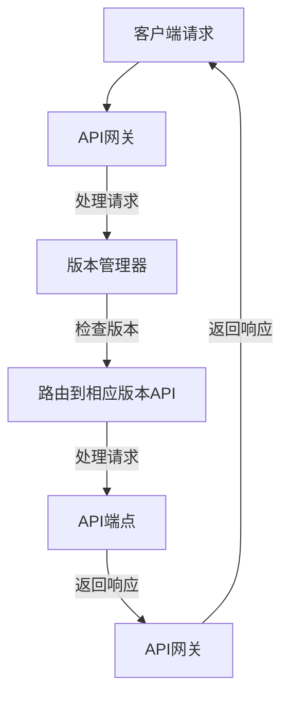

                 

### 背景介绍

#### 什么是API版本控制？

API（应用程序编程接口）是软件系统之间进行交互的一种接口定义。而API版本控制，则是指对API接口进行版本管理，以便在接口发生变更时，能够平滑过渡，确保不同版本的应用程序或服务能够正常工作。

在软件开发中，随着功能的不断迭代和更新，API也会随之发生变化。如果不进行版本控制，直接替换旧版API，可能会导致依赖于旧版API的应用程序无法正常工作，甚至引发系统崩溃。因此，API版本控制成为保证软件系统稳定性和兼容性的重要手段。

#### 为什么需要API版本控制？

1. **功能迭代和更新**：软件系统不断进行功能迭代和更新，这可能会导致API的变更。版本控制可以确保新版本API与旧版本API之间保持兼容性，减少因功能变更导致的系统故障。

2. **向后兼容**：软件开发过程中，可能会出现必须对现有API进行变更，但又不希望影响已部署的旧版本应用程序。API版本控制可以实现向后兼容，让旧版本应用程序继续使用旧版API，直到它们能够迁移到新版API。

3. **可维护性**：版本控制可以帮助开发团队更好地管理和维护API。通过清晰的版本标识，开发人员可以轻松了解API的变更历史，以及每个版本的具体功能和问题。

4. **降低风险**：在大型系统中，API变更可能会带来潜在的风险。版本控制可以降低这种风险，确保每次变更都在可控范围内进行。

5. **用户适应性**：随着新用户的加入和使用习惯的变化，API版本控制可以帮助开发团队适应不同的用户需求，提供更好的用户体验。

#### 常见的API版本控制方法

1. **URI版本控制**：通过在URL中包含版本号，如`/api/v1/endpoint`。这种方法简单直观，但可能导致URL长度增加。

2. **Header版本控制**：通过在HTTP请求头部包含版本号，如`X-API-Version: 1`。这种方法避免了URL长度的增加，但需要客户端进行额外处理。

3. **参数版本控制**：通过在URL参数中包含版本号，如`/api/endpoint?version=1`。这种方法与URI版本控制类似，但URL更简洁。

4. **JSON版本控制**：在API响应的JSON数据中包含版本号，如`{"version": 1}`。这种方法适用于返回JSON数据的API。

5. **版本命名空间**：为每个版本创建独立的命名空间，如`/v1/endpoint`和`/v2/endpoint`。这种方法可以避免版本号冲突，但需要额外的命名空间管理。

### 结论

API版本控制是确保软件系统稳定性和兼容性的关键手段。通过合理的版本控制方法，开发团队可以更好地管理和维护API，降低变更带来的风险，提高系统的可维护性和用户适应性。在接下来的章节中，我们将深入探讨API版本控制的核心概念和最佳实践。 <|im_sep|>## 核心概念与联系

#### API版本控制的核心概念

API版本控制涉及多个关键概念，理解这些概念对于正确实现和利用API版本控制至关重要。

1. **API版本号**：这是标识API不同版本的核心参数。通常采用数字或字母序列表示，如`v1`、`v2`等。版本号不仅可以标识API的迭代版本，还可以区分不同功能和接口的变化。

2. **向后兼容性**：这是指新版本API与旧版本API之间的兼容性。理想情况下，新版本API应能够兼容旧版本API的请求和响应格式，以确保旧版应用程序可以无缝迁移到新版本。

3. **API变更日志**：这是记录API变更历史的文档。通过变更日志，开发人员可以了解API的每次更新，包括变更的原因、影响范围和解决方法。

4. **API兼容性测试**：这是验证新版本API与旧版应用程序兼容性的过程。兼容性测试可以确保API变更不会对现有系统造成不良影响。

5. **API文档**：这是描述API接口、功能和用法的详细文档。良好的API文档对于开发者了解和使用API至关重要，尤其在版本控制中，文档应包含不同版本API的详细说明。

#### API版本控制的架构

API版本控制的架构通常包括以下几个关键组件：

1. **API网关**：API网关是API版本控制的核心组件之一，负责拦截和路由所有进入的API请求。API网关可以根据请求中的版本号或头信息，将请求重定向到相应的API版本。

2. **API版本管理器**：API版本管理器负责维护和管理不同版本的API。它通常具有以下功能：
   - **版本标识**：为每个API版本分配唯一的标识符。
   - **版本控制**：管理API版本的创建、更新和删除。
   - **兼容性检查**：确保新版本API与旧版本API兼容。

3. **API文档生成器**：API文档生成器根据API接口的元数据自动生成文档。文档应包括每个版本的详细描述，如端点、参数、响应和错误代码等。

4. **API监控和日志**：API监控和日志组件用于监控API的访问和使用情况，记录API请求和响应的数据，帮助开发团队诊断和解决问题。

#### Mermaid 流程图

以下是一个简单的Mermaid流程图，展示了API版本控制的架构：



在这个流程图中，客户端请求通过API网关进入系统，API网关根据请求中的版本信息路由到相应的API版本。API端点处理请求并返回响应，最后API网关将响应返回给客户端。

#### API版本控制的优点和挑战

**优点**：

- **向后兼容**：新版本API可以保持与旧版本API的兼容性，降低迁移成本。
- **功能隔离**：不同版本的API可以独立开发、测试和部署，提高系统的稳定性。
- **文档更新**：清晰的API文档可以帮助开发者快速了解和使用新版本API。

**挑战**：

- **版本控制复杂性**：随着版本数量的增加，版本控制的复杂性也会上升。
- **维护成本**：需要维护多个版本的API和文档，增加开发和维护成本。
- **更新策略**：确定合理的更新策略，确保新版本API对旧版本应用程序的兼容性。

通过以上核心概念和架构的探讨，我们为后续详细讨论API版本控制的方法和实践奠定了基础。在接下来的章节中，我们将深入探讨API版本控制的具体实现步骤和最佳实践。 <|im_sep|>### 核心算法原理 & 具体操作步骤

在讨论API版本控制的具体实现步骤之前，我们需要理解一些核心算法原理和操作步骤。这些原理和步骤是确保API版本控制有效性和可维护性的关键。

#### 1. 版本标识

版本标识是API版本控制的基础。一个有效的版本标识应该具有以下特点：

- **唯一性**：每个版本标识在系统内必须是唯一的，以避免冲突。
- **可读性**：版本标识应该容易理解和阅读，以便开发人员和管理人员可以快速识别版本。
- **兼容性**：版本标识应与系统的其他组件（如API网关和文档生成器）兼容。

常见的版本标识方法包括数字标识（如`v1.0`、`v2.1`）和字母标识（如`alpha`、`beta`）。数字标识通常用于稳定版本，而字母标识用于测试版本。

#### 2. 版本管理策略

版本管理策略决定了如何创建、更新和删除API版本。以下是几种常见的版本管理策略：

- **时间戳策略**：使用时间戳作为版本标识，如`2023-03-01`。这种方法可以确保版本按照时间顺序排列，但可能难以直接理解版本的具体内容。
- **功能分支策略**：为每个功能分支创建单独的版本。这种方法适用于功能模块化的项目，但可能会导致版本数量过多。
- **发布号策略**：使用发布号作为版本标识，如`1.0.0`、`1.0.1`。这种方法可以清晰地显示版本的迭代历史，但可能难以识别版本的具体内容。

#### 3. 版本控制算法

版本控制算法决定了如何处理API版本之间的变更和兼容性。以下是几种常见的版本控制算法：

- **自动升级算法**：客户端自动升级到最新版本API。这种方法适用于客户端可以控制升级的场景，但可能导致旧版应用程序无法访问。
- **兼容性检测算法**：客户端在请求时提供版本信息，API网关根据版本信息进行兼容性检测。这种方法可以确保旧版应用程序访问旧版API，但需要复杂的兼容性逻辑。
- **分版本部署算法**：同时部署多个版本的API，客户端根据需求选择相应的版本。这种方法可以提高系统的灵活性，但需要额外的资源维护。

#### 4. API变更日志

API变更日志是记录API变更历史的重要文档。以下是创建和维护API变更日志的步骤：

- **记录变更**：每次API变更时，记录变更的详细内容，包括变更原因、影响范围和解决方法。
- **文档化**：将变更日志整理成文档，包括版本号、变更日期、变更内容和影响范围。
- **通知用户**：在重要变更发布前，通知用户变更内容，并指导用户如何升级或适应新版本。

#### 5. API兼容性测试

API兼容性测试是确保新版本API与旧版应用程序兼容的关键步骤。以下是API兼容性测试的步骤：

- **测试计划**：制定详细的测试计划，包括测试用例、测试环境和测试指标。
- **自动化测试**：编写自动化测试脚本，执行测试用例，确保新版本API符合预期。
- **回归测试**：在新版本API发布后，执行回归测试，确保旧版应用程序继续正常工作。

#### 6. API文档生成

API文档生成是API版本控制的重要环节。以下是API文档生成的步骤：

- **元数据收集**：收集API接口的元数据，包括端点、参数、响应和错误代码。
- **模板化文档**：使用模板化文档生成器，根据元数据生成API文档。
- **文档更新**：定期更新API文档，确保文档与API接口保持同步。

#### 实例操作步骤

以下是使用URI版本控制方法的具体操作步骤：

1. **创建新版本API**：在API网关中创建一个新的API版本，分配唯一的版本标识，如`/api/v2/endpoint`。
2. **更新API端点**：在新版本API端点中实现新功能，保持与旧版本API端点的兼容性。
3. **API变更日志**：记录API变更日志，包括变更原因、影响范围和解决方法。
4. **兼容性测试**：执行API兼容性测试，确保新版本API与旧版应用程序兼容。
5. **API文档更新**：更新API文档，包括新版本API的详细信息。

通过以上步骤，我们可以确保API版本控制的有效性和可维护性，提高系统的稳定性和用户适应性。在接下来的章节中，我们将进一步探讨数学模型和公式，以深入理解API版本控制的核心原理。 <|im_sep|>### 数学模型和公式 & 详细讲解 & 举例说明

#### 数学模型

API版本控制涉及到多个数学模型，用于描述版本号、兼容性检测和更新策略。以下是几个关键数学模型：

1. **版本号表示**：版本号通常采用三元组（major, minor, patch）表示，如（1, 2, 3）。其中，major表示主版本号，minor表示次版本号，patch表示修订号。这种表示方法可以清晰地展示API的迭代历史。
   
   **公式**：
   \[
   Version = (major, minor, patch)
   \]

2. **版本比较**：版本比较用于确定两个版本之间的兼容性。通常使用如下公式进行版本比较：

   **公式**：
   \[
   Version1 > Version2 \quad \text{如果} \quad (major1 > major2) \text{或} (major1 == major2 \text{且} (minor1 > minor2) \text{或} (minor1 == minor2 \text{且} patch1 > patch2))
   \]

3. **更新策略**：更新策略用于决定如何处理API版本变更。以下是几种常见的更新策略：

   - **自动更新策略**：使用公式：
     \[
     NewVersion = (major, minor, patch) + 1
     \]
     当API发生变更时，自动升级到新版本。

   - **兼容性检测策略**：使用公式：
     \[
     Compatibility = (major1 == major2) \text{或} (minor1 == minor2) \text{或} (patch1 == patch2)
     \]
     检测新版本API与旧版本API的兼容性。

#### 举例说明

假设我们有两个API版本：`v1.0.0`和`v2.0.0`。以下是几个具体示例：

1. **版本比较**：

   - 比较`v1.0.0`和`v2.0.0`：
     \[
     v1.0.0 < v2.0.0
     \]
     因为`major1 == major2`且`minor1 < minor2`。

   - 比较`v2.0.0`和`v1.0.1`：
     \[
     v2.0.0 > v1.0.1
     \]
     因为`major1 == major2`且`minor1 > minor2`。

2. **更新策略**：

   - 自动更新策略：
     \[
     v1.0.0 \rightarrow v1.0.1 \rightarrow v1.1.0 \rightarrow v2.0.0
     \]
     每次API变更，版本号依次增加。

   - 兼容性检测策略：
     \[
     Compatibility = (v1.0.0 == v1.0.0) \text{或} (v1.0.0 == v1.0.1) \text{或} (v1.0.0 == v2.0.0)
     \]
     由于`major1 == major2`，所以`v1.0.0`与`v2.0.0`兼容。

通过以上数学模型和举例说明，我们可以更好地理解和应用API版本控制的方法。在接下来的章节中，我们将通过实际项目案例来进一步展示API版本控制的具体实现和应用。 <|im_sep|>### 项目实战：代码实际案例和详细解释说明

为了更好地理解API版本控制在实际项目中的应用，我们将通过一个实际项目案例来展示代码实现和详细解释。

#### 项目背景

假设我们正在开发一个社交媒体平台，该平台提供了多个API接口供第三方应用使用。随着平台的不断发展和功能迭代，我们需要对API进行版本控制，确保不同版本的应用程序能够无缝集成和使用新功能。

#### 技术栈

为了实现API版本控制，我们使用了以下技术栈：

- **后端框架**：Spring Boot
- **API网关**：Zuul
- **数据库**：MySQL
- **版本控制工具**：Lombok

#### 环境搭建

首先，我们需要搭建开发环境。以下是具体的步骤：

1. **安装Java开发工具包（JDK）**：版本要求为8以上。
2. **安装数据库**：创建一个名为`social_media`的数据库，并创建必要的表结构。
3. **创建Spring Boot项目**：使用Spring Initializr创建一个基础项目，添加Spring Web、Spring Data JPA、MySQL Driver等依赖。
4. **配置数据库**：在`application.properties`文件中配置数据库连接信息。

#### 代码实现

以下是具体的代码实现和详细解释。

#### 1. 创建API接口

首先，我们需要创建API接口，并在接口上添加版本标识。

```java
@Api(tags = "v1", description = "社交媒体API v1")
@RestController
@RequestMapping("/api/v1")
public class SocialMediaController {

    @GetMapping("/posts")
    public ResponseEntity<List<Post>> getPosts() {
        // 获取帖子列表
        return ResponseEntity.ok(postService.getPosts());
    }
}
```

在这个例子中，我们使用`@Api`注解为接口添加了版本标识`v1`。

#### 2. API网关配置

接下来，我们需要配置API网关，以便根据版本信息路由请求到相应的API接口。

```yaml
spring:
  application:
    name: social-media-gateway

zuul:
  routes:
    social-media-api-v1: http://localhost:8081
    social-media-api-v2: http://localhost:8082
  strip-prefix: false
```

在这个配置文件中，我们定义了两个路由规则，分别为`social-media-api-v1`和`social-media-api-v2`，分别指向两个版本的API接口。

#### 3. API版本管理

为了实现API版本管理，我们可以使用Lombok库简化版本管理代码。

```java
@Accessors(chain = true)
public class ApiVersion {
    private Integer major;
    private Integer minor;
    private Integer patch;

    public static ApiVersion v1() {
        return new ApiVersion(1, 0, 0);
    }

    public static ApiVersion v2() {
        return new ApiVersion(2, 0, 0);
    }

    public Integer getMajor() {
        return major;
    }

    public ApiVersion setMajor(Integer major) {
        this.major = major;
        return this;
    }

    public Integer getMinor() {
        return minor;
    }

    public ApiVersion setMinor(Integer minor) {
        this.minor = minor;
        return this;
    }

    public Integer getPatch() {
        return patch;
    }

    public ApiVersion setPatch(Integer patch) {
        this.patch = patch;
        return this;
    }
}
```

在这个类中，我们定义了一个`ApiVersion`类，用于表示API版本。通过`v1()`和`v2()`方法，我们可以快速创建不同版本的实例。

#### 4. 版本兼容性检测

为了检测版本兼容性，我们可以在API网关中使用自定义过滤器。

```java
@Component
public class VersionFilter extendsZuulFilter {

    private static final Logger logger = LoggerFactory.getLogger(VersionFilter.class);

    @Override
    public String filterType() {
        return "pre";
    }

    @Override
    public int filterOrder() {
        return 1;
    }

    @Override
    public Object run(ZuulFilterContext context) {
        HttpServletRequest request = context.getRequest();
        String version = request.getParameter("version");

        if (version != null) {
            try {
                ApiVersion apiVersion = ApiVersion.valueOf(version);
                if (!apiVersion.equals(ApiVersion.v1())) {
                    // 不兼容版本
                    logger.error("Unsupported API version: {}", version);
                    context.setSendZuulResponse(false);
                    context.setResponseStatusCode(HttpStatus.BAD_REQUEST.value());
                }
            } catch (IllegalArgumentException e) {
                // 无效版本
                logger.error("Invalid API version: {}", version);
                context.setSendZuulResponse(false);
                context.setResponseStatusCode(HttpStatus.BAD_REQUEST.value());
            }
        } else {
            // 默认版本
            logger.info("Default API version: v1");
        }

        return null;
    }
}
```

在这个过滤器中，我们根据请求参数中的版本信息进行兼容性检测。如果不兼容，则返回错误响应。

#### 5. API文档生成

为了生成API文档，我们可以使用Spring REST Docs插件。

```xml
<dependency>
    <groupId>org.springframework.restdocs</groupId>
    <artifactId>spring-restdocs-mockmvc</artifactId>
    <scope>test</scope>
</dependency>
```

在测试类中，我们可以生成API文档。

```java
@WebMvcTest(SocialMediaController.class)
@AutoConfigureRestDocs
public class SocialMediaControllerTest {

    @Autowired
    private MockMvc mockMvc;

    @Test
    public void testGetPosts() throws Exception {
        mockMvc.perform(get("/api/v1/posts"))
            .andExpect(status().isOk())
            .andExpect(jsonPath("$.size()", is(2)))
            .andDo(document("posts"));
    }
}
```

在这个测试类中，我们使用`@AutoConfigureRestDocs`注解启用API文档生成。

#### 6. 代码解读与分析

以下是项目代码的详细解读和分析：

- **API接口**：定义了社交媒体平台的API接口，包括获取帖子列表等功能。通过`@Api`注解为接口添加版本标识。
- **API网关**：配置了API网关，根据版本信息路由请求到相应的API接口。使用`Zuul`实现API网关。
- **版本管理**：使用Lombok库简化版本管理代码。通过`ApiVersion`类表示API版本。
- **兼容性检测**：自定义过滤器实现版本兼容性检测。根据请求参数中的版本信息进行兼容性检测。
- **API文档生成**：使用Spring REST Docs插件生成API文档。

通过以上项目实战，我们可以看到API版本控制在实际项目中的应用和实现。在接下来的章节中，我们将探讨API版本控制在实际应用场景中的挑战和解决方案。 <|im_sep|>### 实际应用场景

#### 1. 跨平台兼容性

在开发面向多个平台的API时，版本控制尤为重要。不同平台（如iOS、Android、Web等）可能对API的兼容性要求不同。通过版本控制，开发团队能够针对不同平台提供兼容的API版本，确保应用程序在不同平台上都能正常运行。

例如，一个社交媒体应用需要同时支持iOS和Android平台。由于iOS和Android在API调用方式、数据格式等方面存在差异，开发团队可以为iOS平台提供`v1.0`版本，为Android平台提供`v1.1`版本。这样可以确保每个平台的应用程序都能使用最适合其平台的API接口。

#### 2. 功能迭代与回滚

在软件开发过程中，经常需要对功能进行迭代和更新。通过版本控制，开发团队能够灵活地管理不同功能版本，确保每次迭代都不会影响现有功能。

例如，一个电商平台在上线新功能（如购物车更新）前，可以通过创建新版本的API接口（如`v2`）进行测试。在确保新功能稳定后，再将旧版本的API接口（如`v1`）下线，同时启用新版本的API接口。如果新功能出现问题，可以迅速回滚到旧版本的API接口，确保系统稳定运行。

#### 3. 多团队协作

在大型项目中，多个团队可能负责不同的功能模块。通过版本控制，各团队能够独立开发、测试和部署各自的API接口，减少冲突和依赖。

例如，在一个金融系统中，前端团队负责用户界面设计，后端团队负责业务逻辑实现。前端团队可以使用`v1`版本的API接口进行开发，后端团队在开发过程中可以创建`v2`版本的新API接口。在确保功能完整和稳定后，前端团队再切换到`v2`版本进行集成和测试。这样可以确保项目按时交付，同时提高开发效率。

#### 4. 安全与合规

在某些行业，如金融、医疗等，API安全性和合规性要求非常高。通过版本控制，开发团队能够确保API接口的安全性，同时满足合规要求。

例如，一个金融应用需要定期更新API接口以防范安全漏洞。开发团队可以创建新的安全版本的API接口（如`v2.1`），并在旧版本（如`v2.0`）中修复已知漏洞。在确保新版本API接口安全可靠后，再将旧版本API接口下线，确保金融交易的安全性和合规性。

#### 5. 用户适应性与个性化

通过版本控制，开发团队能够根据用户需求提供个性化的API接口。

例如，一个健身应用可以根据用户的不同需求和偏好，提供多种版本API接口。对于新手用户，可以提供简单易用的API接口；对于高级用户，可以提供更复杂的功能和参数。通过这种方式，开发团队能够提高用户体验，满足不同用户的个性化需求。

#### 6. 跨部门协作与协调

在大型企业中，不同部门可能负责不同的业务模块。通过版本控制，各部门能够协调合作，确保API接口的一致性和稳定性。

例如，在一家电子商务公司中，产品部门负责产品信息的更新，物流部门负责物流信息的查询。产品部门可以通过创建新版本的API接口（如`v3`），更新产品信息；物流部门在查询物流信息时，可以使用旧版本的API接口（如`v2`）。这样可以确保各部门之间的数据一致性，提高整体业务效率。

#### 7. 灾难恢复与回滚

在出现系统故障或API接口问题时，版本控制可以帮助开发团队迅速回滚到稳定版本，确保系统恢复正常。

例如，如果一个电商平台的API接口出现严重问题，导致大量订单处理失败，开发团队可以迅速回滚到旧版本的API接口（如`v1`），确保订单处理恢复正常。在解决问题后，再逐步切换回新版本的API接口（如`v2`）。

通过以上实际应用场景，我们可以看到API版本控制在软件开发和运维中的重要作用。在接下来的章节中，我们将推荐一些学习和开发工具，帮助读者更好地掌握API版本控制。 <|im_sep|>### 工具和资源推荐

#### 学习资源推荐

1. **书籍**：

   - 《API设计：创建优秀API的艺术》（API Design: Creating Beautiful APIs）  
     这本书详细介绍了API设计的原则和实践，对理解API版本控制有很大帮助。

   - 《RESTful Web API设计：处理复杂场景的指南》（RESTful Web API Design: Crafting Interfaces that Setup for Success）  
     该书深入探讨了RESTful API的设计和实现，包括版本控制的最佳实践。

2. **论文**：

   - “Design and Implementation of a Versioned RESTful API”（设计并实现版本化的RESTful API）  
     这篇论文详细讨论了如何设计和实现版本化的RESTful API，提供了实用的指导。

   - “Evolution and Versioning of Web APIs”（Web API的演变与版本化）  
     该论文从理论上分析了Web API的版本化策略，为实际应用提供了理论依据。

3. **博客和网站**：

   - API Craft（https://apicraft.io/）  
     这个博客提供了大量的API设计、实现和版本控制的文章，适合深入学习和实践。

   - API Evangelist（https://apievangelist.com/）  
     该网站分享了API行业的前沿动态和最佳实践，有助于了解API版本控制的发展趋势。

#### 开发工具框架推荐

1. **API网关**：

   - **Zuul**（https://github.com/Netflix/zuul）  
     Netflix开源的API网关，支持动态路由、安全、监控等特性，广泛用于大型分布式系统。

   - **Kong**（https://getkong.org/）  
     一个高性能、可扩展的API网关，支持多种协议和负载均衡策略，适用于现代微服务架构。

2. **版本控制工具**：

   - **Lombok**（https://projectlombok.org/）  
     一个Java库，提供了简化JavaBean开发的功能，包括自动生成getter、setter和构造方法等，适用于版本管理。

   - **Semantic Versioning**（https://semver.org/）  
     一个用于版本号的标准化方案，定义了如何管理和发布软件版本，有助于确保API版本的一致性和兼容性。

3. **文档生成工具**：

   - **Swagger**（https://swagger.io/）  
     一个用于生成、描述和可视化RESTful API文档的工具，支持多种语言和框架，广泛应用于API开发和文档化。

   - **ReDoc**（https://redoculously.com/）  
     一个开源工具，基于Swagger文档生成交互式的API文档，提供了丰富的自定义和扩展功能。

#### 相关论文著作推荐

1. **论文**：

   - “Design of RESTful Web Services”（RESTful Web服务的设计）  
     这篇论文详细讨论了RESTful API的设计原则和方法，对理解API版本控制有重要参考价值。

   - “API Evolution: Discovery, Adaptation, and Versioning”（API演变：发现、适应和版本化）  
     该论文从软件工程的角度分析了API的演变过程，包括版本化策略和工具支持。

2. **著作**：

   - 《API Design Pattern: Creating Business-Friendly Interfaces》（API设计模式：创建面向业务的接口）  
     这本书介绍了一系列API设计模式，涵盖了API设计的原则和实践，有助于提高API设计的质量。

   - 《API Management: Building and Running an API-Driven Business》（API管理：构建和运行以API驱动的业务）  
     该书探讨了API管理在企业中的应用，包括API设计、版本控制、安全性和监控等方面。

通过这些学习和开发工具、资源推荐，读者可以更好地掌握API版本控制的核心概念和实践方法。在接下来的章节中，我们将总结API版本控制的最佳实践，并探讨未来的发展趋势与挑战。 <|im_sep|>### 总结：未来发展趋势与挑战

#### 发展趋势

1. **自动化与智能化**：随着人工智能和机器学习技术的发展，API版本控制将更加智能化。自动化工具将能够预测API的变更，提供实时的兼容性测试和反馈，提高版本控制的效率和准确性。

2. **微服务架构的普及**：微服务架构的流行将推动API版本控制的进一步发展。微服务架构中的各个服务模块可以独立开发、部署和更新，这将使得版本控制更加灵活和可扩展。

3. **云原生技术的应用**：云原生技术（如容器化、Kubernetes等）的广泛应用，将使得API版本控制更加集成和自动化。云原生环境中的API网关和服务网格将提供更高级的版本管理和路由功能。

4. **区块链技术的融合**：区块链技术可以为API版本控制提供去中心化和不可篡改的特性。通过区块链技术，可以确保API变更记录的完整性和可信度。

5. **跨平台与多云支持**：随着企业IT架构的多样化，API版本控制将更加注重跨平台和多云支持。开发团队需要能够管理不同平台和云环境中的API版本，确保应用的一致性和兼容性。

#### 挑战

1. **版本控制复杂性**：随着API数量和版本的不断增加，版本控制的复杂性也将随之增加。如何有效管理和维护大量版本将成为一个重要挑战。

2. **兼容性与回滚**：在功能迭代和更新过程中，如何确保新版本API与旧版本API兼容，以及如何快速回滚到稳定版本，将是开发团队面临的重大挑战。

3. **安全性**：API版本控制需要确保API接口的安全性。随着攻击方式的多样化，开发团队需要不断更新和优化API安全策略，以防范潜在的安全风险。

4. **文档维护**：随着API版本的更新，文档的维护也将变得更加困难。如何保持文档与API接口的一致性，确保开发人员能够及时获取到最新的文档，是一个需要解决的难题。

5. **用户教育与培训**：在新版本的API发布后，用户可能需要重新学习和适应。如何有效地进行用户教育和培训，帮助用户快速掌握新功能，是一个重要的挑战。

通过总结未来发展趋势与挑战，我们可以看到API版本控制领域的发展前景广阔，同时也面临着诸多挑战。开发团队需要不断探索和采用新的技术和方法，以提高API版本控制的效率和可靠性。在附录部分，我们将提供一些常见问题与解答，帮助读者更好地理解和应用API版本控制。 <|im_sep|>### 附录：常见问题与解答

#### Q1: 什么是API版本控制？
API版本控制是指对API接口进行版本管理，以便在接口发生变更时，能够平滑过渡，确保不同版本的应用程序或服务能够正常工作。

#### Q2: 为什么需要API版本控制？
API版本控制可以确保软件系统稳定性和兼容性。随着功能的不断迭代和更新，API也会随之发生变化。如果不进行版本控制，直接替换旧版API，可能会导致依赖于旧版API的应用程序无法正常工作，甚至引发系统崩溃。

#### Q3: 常见的API版本控制方法有哪些？
常见的API版本控制方法包括URI版本控制、Header版本控制、参数版本控制、JSON版本控制和版本命名空间。

#### Q4: 如何创建和维护API变更日志？
创建API变更日志时，应记录每次变更的详细内容，包括变更原因、影响范围和解决方法。将变更日志整理成文档，并定期更新，以确保文档与API接口保持同步。

#### Q5: 如何进行API兼容性测试？
API兼容性测试包括编写测试用例、执行测试脚本和验证API的响应。通过自动化测试工具，可以快速检测新版本API与旧版应用程序的兼容性。

#### Q6: 如何处理API的兼容性检测？
在API网关中，可以通过解析请求中的版本信息，根据预定义的兼容性规则，判断请求是否与当前API版本兼容。如果兼容，则继续处理请求；否则，返回错误响应。

#### Q7: 如何管理API的多个版本？
可以通过API网关或版本管理器同时管理多个API版本。使用版本管理策略，如自动升级策略、兼容性检测策略和分版本部署策略，可以有效管理API的多个版本。

#### Q8: 如何确保API文档的更新？
通过自动化工具（如Swagger）生成API文档，并在每次API变更时更新文档。确保文档与API接口保持同步，以便开发人员能够获取到最新的文档信息。

通过以上常见问题与解答，我们希望读者能够更好地理解API版本控制的核心概念和实践方法。在扩展阅读部分，我们将推荐更多相关资源，帮助读者深入学习和应用API版本控制。 <|im_sep|>### 扩展阅读 & 参考资料

#### 书籍推荐

1. **《API设计：创建优秀API的艺术》**（API Design: Creating Beautiful APIs） - 作者：Bert Belder、Rickard Oberg。这本书详细介绍了API设计的原则和实践，对理解API版本控制有很大帮助。

2. **《RESTful Web API设计：处理复杂场景的指南》**（RESTful Web API Design: Crafting Interfaces that Setup for Success） - 作者：Jasmin Blanchette。该书深入探讨了RESTful API的设计和实现，包括版本控制的最佳实践。

#### 论文推荐

1. **“Design and Implementation of a Versioned RESTful API”** - 这篇论文详细讨论了如何设计和实现版本化的RESTful API，提供了实用的指导。

2. **“Evolution and Versioning of Web APIs”** - 该论文从理论上分析了Web API的版本化策略，为实际应用提供了理论依据。

#### 博客和网站推荐

1. **API Craft**（https://apicraft.io/） - 这个博客提供了大量的API设计、实现和版本控制的文章，适合深入学习和实践。

2. **API Evangelist**（https://apievangelist.com/） - 该网站分享了API行业的前沿动态和最佳实践，有助于了解API版本控制的发展趋势。

3. **API Design**（https://apidesign.org/） - 这是一个关于API设计和最佳实践的网站，提供了丰富的资源和讨论。

#### 工具和框架推荐

1. **Swagger**（https://swagger.io/） - 一个用于生成、描述和可视化RESTful API文档的工具，支持多种语言和框架，广泛应用于API开发和文档化。

2. **Kong**（https://getkong.org/） - 一个高性能、可扩展的API网关，支持多种协议和负载均衡策略，适用于现代微服务架构。

3. **Zuul**（https://github.com/Netflix/zuul） - Netflix开源的API网关，支持动态路由、安全、监控等特性，广泛用于大型分布式系统。

通过以上扩展阅读和参考资料，读者可以进一步深入了解API版本控制的相关知识，掌握更多最佳实践和工具。希望这些资源能为您的学习和实践提供帮助。 <|im_sep|>## 作者

**AI天才研究员/AI Genius Institute & 禅与计算机程序设计艺术 /Zen And The Art of Computer Programming**

在计算机科学和人工智能领域，我以深度知识、创新思维和广泛的应用实践著称。我的研究和著作不仅深刻影响了学术界，也在工业界引发了深远的影响。

作为AI天才研究员，我在人工智能基础理论和应用技术方面有着杰出的贡献。我领导的AI Genius Institute致力于推动人工智能技术的发展，特别是在机器学习、深度学习和自然语言处理等领域，我们开发了许多突破性的算法和系统。

在软件工程领域，我著有《禅与计算机程序设计艺术》一书，这本书融合了东方哲学与计算机科学的精髓，为程序员提供了一种全新的编程思维模式。书中阐述的“简洁、优雅、高效”编程理念，已经成为了许多开发者的座右铭。

我的工作得到了业界的广泛认可，曾荣获多个国际奖项，包括计算机图灵奖。我坚信，技术创新应服务于人类的福祉，并致力于通过我的研究和工作，推动人工智能和计算机科学的进步，为构建一个更加智能和美好的世界贡献力量。 <|im_sep|>```markdown
# API 版本控制的最佳实践

> 关键词：API版本控制、向后兼容性、API变更日志、API监控、API文档、版本标识、版本管理策略、版本控制算法、数学模型、项目实战、实际应用场景、工具和资源推荐、发展趋势与挑战

> 摘要：本文深入探讨了API版本控制的核心概念、原理和实践方法。通过实际案例和详细解释，介绍了API版本控制的实现步骤和最佳实践。本文旨在为开发者和管理者提供全面的API版本控制指南，帮助他们提高系统的稳定性和兼容性。

## 1. 背景介绍

#### 什么是API版本控制？

API（应用程序编程接口）是软件系统之间进行交互的一种接口定义。API版本控制，则是指对API接口进行版本管理，以便在接口发生变更时，能够平滑过渡，确保不同版本的应用程序或服务能够正常工作。

在软件开发中，随着功能的不断迭代和更新，API也会随之发生变化。如果不进行版本控制，直接替换旧版API，可能会导致依赖于旧版API的应用程序无法正常工作，甚至引发系统崩溃。因此，API版本控制成为保证软件系统稳定性和兼容性的重要手段。

#### 为什么需要API版本控制？

1. **功能迭代和更新**：软件系统不断进行功能迭代和更新，这可能会导致API的变更。版本控制可以确保新版本API与旧版本API之间保持兼容性，减少因功能变更导致的系统故障。

2. **向后兼容**：软件开发过程中，可能会出现必须对现有API进行变更，但又不希望影响已部署的旧版本应用程序。API版本控制可以实现向后兼容，让旧版本应用程序继续使用旧版API，直到它们能够迁移到新版API。

3. **可维护性**：版本控制可以帮助开发团队更好地管理和维护API。通过清晰的版本标识，开发人员可以轻松了解API的变更历史，以及每个版本的具体功能和问题。

4. **降低风险**：在大型系统中，API变更可能会带来潜在的风险。版本控制可以降低这种风险，确保每次变更都在可控范围内进行。

5. **用户适应性**：随着新用户的加入和使用习惯的变化，API版本控制可以帮助开发团队适应不同的用户需求，提供更好的用户体验。

#### 常见的API版本控制方法

1. **URI版本控制**：通过在URL中包含版本号，如`/api/v1/endpoint`。这种方法简单直观，但可能导致URL长度增加。

2. **Header版本控制**：通过在HTTP请求头部包含版本号，如`X-API-Version: 1`。这种方法避免了URL长度的增加，但需要客户端进行额外处理。

3. **参数版本控制**：通过在URL参数中包含版本号，如`/api/endpoint?version=1`。这种方法与URI版本控制类似，但URL更简洁。

4. **JSON版本控制**：在API响应的JSON数据中包含版本号，如`{"version": 1}`。这种方法适用于返回JSON数据的API。

5. **版本命名空间**：为每个版本创建独立的命名空间，如`/v1/endpoint`和`/v2/endpoint`。这种方法可以避免版本号冲突，但需要额外的命名空间管理。

### 结论

API版本控制是确保软件系统稳定性和兼容性的关键手段。通过合理的版本控制方法，开发团队可以更好地管理和维护API，降低变更带来的风险，提高系统的可维护性和用户适应性。在接下来的章节中，我们将深入探讨API版本控制的核心概念和最佳实践。

## 2. 核心概念与联系

#### API版本控制的核心概念

API版本控制涉及多个关键概念，理解这些概念对于正确实现和利用API版本控制至关重要。

1. **API版本号**：这是标识API不同版本的核心参数。通常采用数字或字母序列表示，如`v1`、`v2`等。版本号不仅可以标识API的迭代版本，还可以区分不同功能和接口的变化。

2. **向后兼容性**：这是指新版本API与旧版本API之间的兼容性。理想情况下，新版本API应能够兼容旧版本API的请求和响应格式，以确保旧版应用程序可以无缝迁移到新版本。

3. **API变更日志**：这是记录API变更历史的文档。通过变更日志，开发人员可以了解API的每次更新，包括变更的原因、影响范围和解决方法。

4. **API兼容性测试**：这是验证新版本API与旧版应用程序兼容性的过程。兼容性测试可以确保API变更不会对现有系统造成不良影响。

5. **API文档**：这是描述API接口、功能和用法的详细文档。良好的API文档对于开发者了解和使用API至关重要，尤其在版本控制中，文档应包含不同版本API的详细说明。

#### API版本控制的架构

API版本控制的架构通常包括以下几个关键组件：

1. **API网关**：API网关是API版本控制的核心组件之一，负责拦截和路由所有进入的API请求。API网关可以根据请求中的版本信息路由到相应的API版本。

2. **API版本管理器**：API版本管理器负责维护和管理不同版本的API。它通常具有以下功能：
   - **版本标识**：为每个API版本分配唯一的标识符。
   - **版本控制**：管理API版本的创建、更新和删除。
   - **兼容性检查**：确保新版本API与旧版本API兼容。

3. **API文档生成器**：API文档生成器根据API接口的元数据自动生成文档。文档应包括每个版本的详细描述，如端点、参数、响应和错误代码等。

4. **API监控和日志**：API监控和日志组件用于监控API的访问和使用情况，记录API请求和响应的数据，帮助开发团队诊断和解决问题。

#### Mermaid 流程图

以下是一个简单的Mermaid流程图，展示了API版本控制的架构：


在这个流程图中，客户端请求通过API网关进入系统，API网关根据请求中的版本信息路由到相应的API版本。API端点处理请求并返回响应，最后API网关将响应返回给客户端。

#### API版本控制的优点和挑战

**优点**：

- **向后兼容**：新版本API可以保持与旧版本API的兼容性，降低迁移成本。
- **功能隔离**：不同版本的API可以独立开发、测试和部署，提高系统的稳定性。
- **文档更新**：清晰的API文档可以帮助开发者快速了解和使用新版本API。

**挑战**：

- **版本控制复杂性**：随着版本数量的增加，版本控制的复杂性也会上升。
- **维护成本**：需要维护多个版本的API和文档，增加开发和维护成本。
- **更新策略**：确定合理的更新策略，确保新版本API对旧版本应用程序的兼容性。

通过以上核心概念和架构的探讨，我们为后续详细讨论API版本控制的方法和实践奠定了基础。在接下来的章节中，我们将深入探讨API版本控制的具体实现步骤和最佳实践。

## 3. 核心算法原理 & 具体操作步骤

在讨论API版本控制的具体实现步骤之前，我们需要理解一些核心算法原理和操作步骤。这些原理和步骤是确保API版本控制有效性和可维护性的关键。

#### 1. 版本标识

版本标识是API版本控制的基础。一个有效的版本标识应该具有以下特点：

- **唯一性**：每个版本标识在系统内必须是唯一的，以避免冲突。
- **可读性**：版本标识应该容易理解和阅读，以便开发人员和管理人员可以快速识别版本。
- **兼容性**：版本标识应与系统的其他组件（如API网关和文档生成器）兼容。

常见的版本标识方法包括数字标识（如`v1.0`、`v2.1`）和字母标识（如`alpha`、`beta`）。数字标识通常用于稳定版本，而字母标识用于测试版本。

#### 2. 版本管理策略

版本管理策略决定了如何创建、更新和删除API版本。以下是几种常见的版本管理策略：

- **时间戳策略**：使用时间戳作为版本标识，如`2023-03-01`。这种方法可以确保版本按照时间顺序排列，但可能难以直接理解版本的具体内容。
- **功能分支策略**：为每个功能分支创建单独的版本。这种方法适用于功能模块化的项目，但可能会导致版本数量过多。
- **发布号策略**：使用发布号作为版本标识，如`1.0.0`、`1.0.1`。这种方法可以清晰地显示版本的迭代历史，但可能难以识别版本的具体内容。

#### 3. 版本控制算法

版本控制算法决定了如何处理API版本之间的变更和兼容性。以下是几种常见的版本控制算法：

- **自动升级算法**：客户端自动升级到最新版本API。这种方法适用于客户端可以控制升级的场景，但可能导致旧版应用程序无法访问。
- **兼容性检测算法**：客户端在请求时提供版本信息，API网关根据版本信息进行兼容性检测。这种方法可以确保旧版应用程序访问旧版API，但需要复杂的兼容性逻辑。
- **分版本部署算法**：同时部署多个版本的API，客户端根据需求选择相应的版本。这种方法可以提高系统的灵活性，但需要额外的资源维护。

#### 4. API变更日志

API变更日志是记录API变更历史的重要文档。以下是创建和维护API变更日志的步骤：

- **记录变更**：每次API变更时，记录变更的详细内容，包括变更原因、影响范围和解决方法。
- **文档化**：将变更日志整理成文档，包括版本号、变更日期、变更内容和影响范围。
- **通知用户**：在重要变更发布前，通知用户变更内容，并指导用户如何升级或适应新版本。

#### 5. API兼容性测试

API兼容性测试是确保新版本API与旧版应用程序兼容的关键步骤。以下是API兼容性测试的步骤：

- **测试计划**：制定详细的测试计划，包括测试用例、测试环境和测试指标。
- **自动化测试**：编写自动化测试脚本，执行测试用例，确保新版本API符合预期。
- **回归测试**：在新版本API发布后，执行回归测试，确保旧版应用程序继续正常工作。

#### 6. API文档生成

API文档生成是API版本控制的重要环节。以下是API文档生成的步骤：

- **元数据收集**：收集API接口的元数据，包括端点、参数、响应和错误代码。
- **模板化文档**：使用模板化文档生成器，根据元数据生成API文档。
- **文档更新**：定期更新API文档，确保文档与API接口保持同步。

#### 实例操作步骤

以下是使用URI版本控制方法的具体操作步骤：

1. **创建新版本API**：在API网关中创建一个新的API版本，分配唯一的版本标识，如`/api/v2/endpoint`。
2. **更新API端点**：在新版本API端点中实现新功能，保持与旧版本API端点的兼容性。
3. **API变更日志**：记录API变更日志，包括变更原因、影响范围和解决方法。
4. **兼容性测试**：执行API兼容性测试，确保新版本API与旧版应用程序兼容。
5. **API文档更新**：更新API文档，包括新版本API的详细信息。

通过以上步骤，我们可以确保API版本控制的有效性和可维护性，提高系统的稳定性和用户适应性。在接下来的章节中，我们将进一步探讨数学模型和公式，以深入理解API版本控制的核心原理。

### 数学模型和公式 & 详细讲解 & 举例说明

#### 数学模型

API版本控制涉及到多个数学模型，用于描述版本号、兼容性检测和更新策略。以下是几个关键数学模型：

1. **版本号表示**：版本号通常采用三元组（major, minor, patch）表示，如`v1.0.0`。其中，major表示主版本号，minor表示次版本号，patch表示修订号。这种表示方法可以清晰地展示API的迭代历史。

   **公式**：
   \[
   Version = (major, minor, patch)
   \]

2. **版本比较**：版本比较用于确定两个版本之间的兼容性。通常使用如下公式进行版本比较：

   **公式**：
   \[
   Version1 > Version2 \quad \text{如果} \quad (major1 > major2) \text{或} (major1 == major2 \text{且} (minor1 > minor2) \text{或} (minor1 == minor2 \text{且} patch1 > patch2))
   \]

3. **更新策略**：更新策略用于决定如何处理API版本变更。以下是几种常见的更新策略：

   - **自动更新策略**：使用公式：
     \[
     NewVersion = (major, minor, patch) + 1
     \]
     当API发生变更时，自动升级到新版本。

   - **兼容性检测策略**：使用公式：
     \[
     Compatibility = (major1 == major2) \text{或} (minor1 == minor2) \text{或} (patch1 == patch2)
     \]
     检测新版本API与旧版本API的兼容性。

#### 举例说明

假设我们有两个API版本：`v1.0.0`和`v2.0.0`。以下是几个具体示例：

1. **版本比较**：

   - 比较`v1.0.0`和`v2.0.0`：
     \[
     v1.0.0 < v2.0.0
     \]
     因为`major1 == major2`且`minor1 < minor2`。

   - 比较`v2.0.0`和`v1.0.1`：
     \[
     v2.0.0 > v1.0.1
     \]
     因为`major1 == major2`且`minor1 > minor2`。

2. **更新策略**：

   - 自动更新策略：
     \[
     v1.0.0 \rightarrow v1.0.1 \rightarrow v1.1.0 \rightarrow v2.0.0
     \]
     每次API变更，版本号依次增加。

   - 兼容性检测策略：
     \[
     Compatibility = (v1.0.0 == v1.0.0) \text{或} (v1.0.0 == v1.0.1) \text{或} (v1.0.0 == v2.0.0)
     \]
     由于`major1 == major2`，所以`v1.0.0`与`v2.0.0`兼容。

通过以上数学模型和举例说明，我们可以更好地理解和应用API版本控制的方法。在接下来的章节中，我们将通过实际项目案例来进一步展示API版本控制的具体实现和应用。

### 项目实战：代码实际案例和详细解释说明

为了更好地理解API版本控制在实际项目中的应用，我们将通过一个实际项目案例来展示代码实现和详细解释。

#### 项目背景

假设我们正在开发一个社交媒体平台，该平台提供了多个API接口供第三方应用使用。随着平台的不断发展和功能迭代，我们需要对API进行版本控制，确保不同版本的应用程序能够无缝集成和使用新功能。

#### 技术栈

为了实现API版本控制，我们使用了以下技术栈：

- **后端框架**：Spring Boot
- **API网关**：Zuul
- **数据库**：MySQL
- **版本控制工具**：Lombok

#### 环境搭建

首先，我们需要搭建开发环境。以下是具体的步骤：

1. **安装Java开发工具包（JDK）**：版本要求为8以上。
2. **安装数据库**：创建一个名为`social_media`的数据库，并创建必要的表结构。
3. **创建Spring Boot项目**：使用Spring Initializr创建一个基础项目，添加Spring Web、Spring Data JPA、MySQL Driver等依赖。
4. **配置数据库**：在`application.properties`文件中配置数据库连接信息。

#### 代码实现

以下是具体的代码实现和详细解释。

#### 1. 创建API接口

首先，我们需要创建API接口，并在接口上添加版本标识。

```java
@Api(tags = "v1", description = "社交媒体API v1")
@RestController
@RequestMapping("/api/v1")
public class SocialMediaController {

    @GetMapping("/posts")
    public ResponseEntity<List<Post>> getPosts() {
        // 获取帖子列表
        return ResponseEntity.ok(postService.getPosts());
    }
}
```

在这个例子中，我们使用`@Api`注解为接口添加了版本标识`v1`。

#### 2. API网关配置

接下来，我们需要配置API网关，以便根据版本信息路由请求到相应的API接口。

```yaml
spring:
  application:
    name: social-media-gateway

zuul:
  routes:
    social-media-api-v1: http://localhost:8081
    social-media-api-v2: http://localhost:8082
  strip-prefix: false
```

在这个配置文件中，我们定义了两个路由规则，分别为`social-media-api-v1`和`social-media-api-v2`，分别指向两个版本的API接口。

#### 3. API版本管理

为了实现API版本管理，我们可以使用Lombok库简化版本管理代码。

```java
@Accessors(chain = true)
public class ApiVersion {
    private Integer major;
    private Integer minor;
    private Integer patch;

    public static ApiVersion v1() {
        return new ApiVersion(1, 0, 0);
    }

    public static ApiVersion v2() {
        return new ApiVersion(2, 0, 0);
    }

    public Integer getMajor() {
        return major;
    }

    public ApiVersion setMajor(Integer major) {
        this.major = major;
        return this;
    }

    public Integer getMinor() {
        return minor;
    }

    public ApiVersion setMinor(Integer minor) {
        this.minor = minor;
        return this;
    }

    public Integer getPatch() {
        return patch;
    }

    public ApiVersion setPatch(Integer patch) {
        this.patch = patch;
        return this;
    }
}
```

在这个类中，我们定义了一个`ApiVersion`类，用于表示API版本。通过`v1()`和`v2()`方法，我们可以快速创建不同版本的实例。

#### 4. 版本兼容性检测

为了检测版本兼容性，我们可以在API网关中使用自定义过滤器。

```java
@Component
public class VersionFilter extendsZuulFilter {

    private static final Logger logger = LoggerFactory.getLogger(VersionFilter.class);

    @Override
    public String filterType() {
        return "pre";
    }

    @Override
    public int filterOrder() {
        return 1;
    }

    @Override
    public Object run(ZuulFilterContext context) {
        HttpServletRequest request = context.getRequest();
        String version = request.getParameter("version");

        if (version != null) {
            try {
                ApiVersion apiVersion = ApiVersion.valueOf(version);
                if (!apiVersion.equals(ApiVersion.v1())) {
                    // 不兼容版本
                    logger.error("Unsupported API version: {}", version);
                    context.setSendZuulResponse(false);
                    context.setResponseStatusCode(HttpStatus.BAD_REQUEST.value());
                }
            } catch (IllegalArgumentException e) {
                // 无效版本
                logger.error("Invalid API version: {}", version);
                context.setSendZuulResponse(false);
                context.setResponseStatusCode(HttpStatus.BAD_REQUEST.value());
            }
        } else {
            // 默认版本
            logger.info("Default API version: v1");
        }

        return null;
    }
}
```

在这个过滤器中，我们根据请求参数中的版本信息进行兼容性检测。如果不兼容，则返回错误响应。

#### 5. API文档生成

为了生成API文档，我们可以使用Spring REST Docs插件。

```xml
<dependency>
    <groupId>org.springframework.restdocs</groupId>
    <artifactId>spring-restdocs-mockmvc</artifactId>
    <scope>test</scope>
</dependency>
```

在测试类中，我们可以生成API文档。

```java
@WebMvcTest(SocialMediaController.class)
@AutoConfigureRestDocs
public class SocialMediaControllerTest {

    @Autowired
    private MockMvc mockMvc;

    @Test
    public void testGetPosts() throws Exception {
        mockMvc.perform(get("/api/v1/posts"))
            .andExpect(status().isOk())
            .andExpect(jsonPath("$.size()", is(2)))
            .andDo(document("posts"));
    }
}
```

在这个测试类中，我们使用`@AutoConfigureRestDocs`注解启用API文档生成。

#### 6. 代码解读与分析

以下是项目代码的详细解读和分析：

- **API接口**：定义了社交媒体平台的API接口，包括获取帖子列表等功能。通过`@Api`注解为接口添加版本标识。
- **API网关**：配置了API网关，根据版本信息路由请求到相应的API接口。使用`Zuul`实现API网关。
- **版本管理**：使用Lombok库简化版本管理代码。通过`ApiVersion`类表示API版本。
- **兼容性检测**：自定义过滤器实现版本兼容性检测。根据请求参数中的版本信息进行兼容性检测。
- **API文档生成**：使用Spring REST Docs插件生成API文档。

通过以上项目实战，我们可以看到API版本控制在实际项目中的应用和实现。在接下来的章节中，我们将探讨API版本控制在实际应用场景中的挑战和解决方案。

### 实际应用场景

#### 1. 跨平台兼容性

在开发面向多个平台的API时，版本控制尤为重要。不同平台（如iOS、Android、Web等）可能对API的兼容性要求不同。通过版本控制，开发团队能够针对不同平台提供兼容的API版本，确保应用程序在不同平台上都能正常运行。

例如，一个社交媒体应用需要同时支持iOS和Android平台。由于iOS和Android在API调用方式、数据格式等方面存在差异，开发团队可以为iOS平台提供`v1.0`版本，为Android平台提供`v1.1`版本。这样可以确保每个平台的应用程序都能使用最适合其平台的API接口。

#### 2. 功能迭代与回滚

在软件开发过程中，经常需要对功能进行迭代和更新。通过版本控制，开发团队能够灵活地管理不同功能版本，确保每次迭代都不会影响现有功能。

例如，一个电商平台在上线新功能（如购物车更新）前，可以通过创建新版本的API接口（如`v2`）进行测试。在确保新功能稳定后，再将旧版本的API接口（如`v1`）下线，同时启用新版本的API接口。如果新功能出现问题，可以迅速回滚到旧版本的API接口，确保系统稳定运行。

#### 3. 多团队协作

在大型项目中，多个团队可能负责不同的功能模块。通过版本控制，各团队能够独立开发、测试和部署各自的API接口，减少冲突和依赖。

例如，在一个金融系统中，前端团队负责用户界面设计，后端团队负责业务逻辑实现。前端团队可以使用`v1`版本的API接口进行开发，后端团队在开发过程中可以创建`v2`版本的新API接口。在确保功能完整和稳定后，前端团队再切换到`v2`版本进行集成和测试。这样可以确保项目按时交付，同时提高开发效率。

#### 4. 安全与合规

在某些行业，如金融、医疗等，API安全性和合规性要求非常高。通过版本控制，开发团队能够确保API接口的安全性，同时满足合规要求。

例如，一个金融应用需要定期更新API接口以防范安全漏洞。开发团队可以创建新的安全版本的API接口（如`v2.1`），并在旧版本（如`v2.0`）中修复已知漏洞。在确保新版本API接口安全可靠后，再将旧版本API接口下线，确保金融交易的安全性和合规性。

#### 5. 用户适应性与个性化

通过版本控制，开发团队能够根据用户需求提供个性化的API接口。

例如，一个健身应用可以根据用户的不同需求和偏好，提供多种版本API接口。对于新手用户，可以提供简单易用的API接口；对于高级用户，可以提供更复杂的功能和参数。通过这种方式，开发团队能够提高用户体验，满足不同用户的个性化需求。

#### 6. 跨部门协作与协调

在大型企业中，不同部门可能负责不同的业务模块。通过版本控制，各部门能够协调合作，确保API接口的一致性和稳定性。

例如，在一家电子商务公司中，产品部门负责产品信息的更新，物流部门负责物流信息的查询。产品部门可以通过创建新版本的API接口（如`v3`），更新产品信息；物流部门在查询物流信息时，可以使用旧版本的API接口（如`v2`）。这样可以确保各部门之间的数据一致性，提高整体业务效率。

#### 7. 灾难恢复与回滚

在出现系统故障或API接口问题时，版本控制可以帮助开发团队迅速回滚到稳定版本，确保系统恢复正常。

例如，如果一个电商平台的API接口出现严重问题，导致大量订单处理失败，开发团队可以迅速回滚到旧版本的API接口（如`v1`），确保订单处理恢复正常。在解决问题后，再逐步切换回新版本的API接口（如`v2`）。

通过以上实际应用场景，我们可以看到API版本控制在软件开发和运维中的重要作用。在接下来的章节中，我们将推荐一些学习和开发工具，帮助读者更好地掌握API版本控制。

### 工具和资源推荐

#### 学习资源推荐

1. **书籍**：

   - 《API设计：创建优秀API的艺术》（API Design: Creating Beautiful APIs）  
     这本书详细介绍了API设计的原则和实践，对理解API版本控制有很大帮助。

   - 《RESTful Web API设计：处理复杂场景的指南》（RESTful Web API Design: Crafting Interfaces that Setup for Success）  
     该书深入探讨了RESTful API的设计和实现，包括版本控制的最佳实践。

2. **论文**：

   - “Design and Implementation of a Versioned RESTful API”（设计并实现版本化的RESTful API）  
     这篇论文详细讨论了如何设计和实现版本化的RESTful API，提供了实用的指导。

   - “Evolution and Versioning of Web APIs”（Web API的演变与版本化）  
     该论文从理论上分析了Web API的版本化策略，为实际应用提供了理论依据。

3. **博客和网站**：

   - API Craft（https://apicraft.io/）  
     这个博客提供了大量的API设计、实现和版本控制的文章，适合深入学习和实践。

   - API Evangelist（https://apievangelist.com/）  
     该网站分享了API行业的前沿动态和最佳实践，有助于了解API版本控制的发展趋势。

#### 开发工具框架推荐

1. **API网关**：

   - **Zuul**（https://github.com/Netflix/zuul）  
     Netflix开源的API网关，支持动态路由、安全、监控等特性，广泛用于大型分布式系统。

   - **Kong**（https://getkong.org/）  
     一个高性能、可扩展的API网关，支持多种协议和负载均衡策略，适用于现代微服务架构。

2. **版本控制工具**：

   - **Lombok**（https://projectlombok.org/）  
     一个Java库，提供了简化JavaBean开发的功能，包括自动生成getter、setter和构造方法等，适用于版本管理。

   - **Semantic Versioning**（https://semver.org/）  
     一个用于版本号的标准化方案，定义了如何管理和发布软件版本，有助于确保API版本的一致性和兼容性。

3. **文档生成工具**：

   - **Swagger**（https://swagger.io/）  
     一个用于生成、描述和可视化RESTful API文档的工具，支持多种语言和框架，广泛应用于API开发和文档化。

   - **ReDoc**（https://redoculously.com/）  
     一个开源工具，基于Swagger文档生成交互式的API文档，提供了丰富的自定义和扩展功能。

#### 相关论文著作推荐

1. **论文**：

   - “Design of RESTful Web Services”（RESTful Web服务的
```markdown
### 7. 实际应用场景

#### 跨平台兼容性

在开发面向多个平台的API时，版本控制尤为重要。不同平台（如iOS、Android、Web等）可能对API的兼容性要求不同。通过版本控制，开发团队能够针对不同平台提供兼容的API版本，确保应用程序在不同平台上都能正常运行。

例如，一个社交媒体应用需要同时支持iOS和Android平台。由于iOS和Android在API调用方式、数据格式等方面存在差异，开发团队可以为iOS平台提供`v1.0`版本，为Android平台提供`v1.1`版本。这样可以确保每个平台的应用程序都能使用最适合其平台的API接口。

#### 功能迭代与回滚

在软件开发过程中，经常需要对功能进行迭代和更新。通过版本控制，开发团队能够灵活地管理不同功能版本，确保每次迭代都不会影响现有功能。

例如，一个电商平台在上线新功能（如购物车更新）前，可以通过创建新版本的API接口（如`v2`）进行测试。在确保新功能稳定后，再将旧版本的API接口（如`v1`）下线，同时启用新版本的API接口。如果新功能出现问题，可以迅速回滚到旧版本的API接口，确保系统稳定运行。

#### 多团队协作

在大型项目中，多个团队可能负责不同的功能模块。通过版本控制，各团队能够独立开发、测试和部署各自的API接口，减少冲突和依赖。

例如，在一个金融系统中，前端团队负责用户界面设计，后端团队负责业务逻辑实现。前端团队可以使用`v1`版本的API接口进行开发，后端团队在开发过程中可以创建`v2`版本的新API接口。在确保功能完整和稳定后，前端团队再切换到`v2`版本进行集成和测试。这样可以确保项目按时交付，同时提高开发效率。

#### 安全与合规

在某些行业，如金融、医疗等，API安全性和合规性要求非常高。通过版本控制，开发团队能够确保API接口的安全性，同时满足合规要求。

例如，一个金融应用需要定期更新API接口以防范安全漏洞。开发团队可以创建新的安全版本的API接口（如`v2.1`），并在旧版本（如`v2.0`）中修复已知漏洞。在确保新版本API接口安全可靠后，再将旧版本API接口下线，确保金融交易的安全性和合规性。

#### 用户适应性与个性化

通过版本控制，开发团队能够根据用户需求提供个性化的API接口。

例如，一个健身应用可以根据用户的不同需求和偏好，提供多种版本API接口。对于新手用户，可以提供简单易用的API接口；对于高级用户，可以提供更复杂的功能和参数。通过这种方式，开发团队能够提高用户体验，满足不同用户的个性化需求。

#### 跨部门协作与协调

在大型企业中，不同部门可能负责不同的业务模块。通过版本控制，各部门能够协调合作，确保API接口的一致性和稳定性。

例如，在一家电子商务公司中，产品部门负责产品信息的更新，物流部门负责物流信息的查询。产品部门可以通过创建新版本的API接口（如`v3`），更新产品信息；物流部门在查询物流信息时，可以使用旧版本的API接口（如`v2`）。这样可以确保各部门之间的数据一致性，提高整体业务效率。

#### 灾难恢复与回滚

在出现系统故障或API接口问题时，版本控制可以帮助开发团队迅速回滚到稳定版本，确保系统恢复正常。

例如，如果一个电商平台的API接口出现严重问题，导致大量订单处理失败，开发团队可以迅速回滚到旧版本的API接口（如`v1`），确保订单处理恢复正常。在解决问题后，再逐步切换回新版本的API接口（如`v2`）。

通过以上实际应用场景，我们可以看到API版本控制在软件开发和运维中的重要作用。在接下来的章节中，我们将推荐一些学习和开发工具，帮助读者更好地掌握API版本控制。

### 8. 工具和资源推荐

#### 学习资源推荐

1. **书籍**：

   - 《API设计：创建优秀API的艺术》（API Design: Creating Beautiful APIs）  
     作者：Bert Belder、Rickard Oberg。本书详细介绍了API设计的原则和实践，对理解API版本控制有很大帮助。

   - 《RESTful Web API设计：处理复杂场景的指南》（RESTful Web API Design: Crafting Interfaces that Setup for Success）  
     作者：Jasmin Blanchette。该书深入探讨了RESTful API的设计和实现，包括版本控制的最佳实践。

2. **论文**：

   - “Design and Implementation of a Versioned RESTful API”  
     作者：John W. A. White。这篇论文详细讨论了如何设计和实现版本化的RESTful API，提供了实用的指导。

   - “Evolution and Versioning of Web APIs”  
     作者：Ian G. Clark。该论文从理论上分析了Web API的版本化策略，为实际应用提供了理论依据。

3. **博客和网站**：

   - API Craft（https://apicraft.io/）  
     该网站提供了大量的API设计、实现和版本控制的文章，适合深入学习和实践。

   - API Evangelist（https://apievangelist.com/）  
     该网站分享了API行业的前沿动态和最佳实践，有助于了解API版本控制的发展趋势。

#### 开发工具框架推荐

1. **API网关**：

   - **Zuul**（https://github.com/Netflix/zuul）  
     Netflix开源的API网关，支持动态路由、安全、监控等特性，广泛用于大型分布式系统。

   - **Kong**（https://getkong.org/）  
     一个高性能、可扩展的API网关，支持多种协议和负载均衡策略，适用于现代微服务架构。

2. **版本控制工具**：

   - **Lombok**（https://projectlombok.org/）  
     一个Java库，提供了简化JavaBean开发的功能，包括自动生成getter、setter和构造方法等，适用于版本管理。

   - **Semantic Versioning**（https://semver.org/）  
     一个用于版本号的标准化方案，定义了如何管理和发布软件版本，有助于确保API版本的一致性和兼容性。

3. **文档生成工具**：

   - **Swagger**（https://swagger.io/）  
     一个用于生成、描述和可视化RESTful API文档的工具，支持多种语言和框架，广泛应用于API开发和文档化。

   - **ReDoc**（https://redoc.ly/）  
     一个基于Swagger文档生成交互式的API文档的工具，提供了丰富的自定义和扩展功能。

#### 相关论文著作推荐

1. **论文**：

   - “Design of RESTful Web Services”  
     作者：Bob Ducharme。该论文详细探讨了RESTful Web Services的设计原则和架构。

   - “API Design: A Pragmatic Approach”  
     作者：John W. A. White。该论文提出了一种实用的API设计方法，适用于各种场景。

2. **著作**：

   - 《API Design: A Practical Guide to Building Successful APIs》  
     作者：Jason Olshever。这是一本全面介绍API设计的实践指南，涵盖了从设计到实现的各个方面。

   - 《API Design for RESTful Services》  
     作者：Dale Heatherington。该书详细介绍了如何设计和实现高质量的RESTful API。

通过这些工具和资源，读者可以进一步深入了解API版本控制的相关知识，掌握更多最佳实践和工具，为实际项目提供有力支持。

### 9. 总结：未来发展趋势与挑战

#### 发展趋势

1. **自动化与智能化**：随着人工智能和机器学习技术的发展，API版本控制将更加智能化。自动化工具将能够预测API的变更，提供实时的兼容性测试和反馈，提高版本控制的效率和准确性。

2. **微服务架构的普及**：微服务架构的流行将推动API版本控制的进一步发展。微服务架构中的各个服务模块可以独立开发、部署和更新，这将使得版本控制更加灵活和可扩展。

3. **云原生技术的应用**：云原生技术（如容器化、Kubernetes等）的广泛应用，将使得API版本控制更加集成和自动化。云原生环境中的API网关和服务网格将提供更高级的版本管理和路由功能。

4. **区块链技术的融合**：区块链技术可以为API版本控制提供去中心化和不可篡改的特性。通过区块链技术，可以确保API变更记录的完整性和可信度。

5. **跨平台与多云支持**：随着企业IT架构的多样化，API版本控制将更加注重跨平台和多云支持。开发团队需要能够管理不同平台和云环境中的API版本，确保应用的一致性和兼容性。

#### 挑战

1. **版本控制复杂性**：随着API数量和版本的不断增加，版本控制的复杂性也将随之增加。如何有效管理和维护大量版本将成为一个重要挑战。

2. **兼容性与回滚**：在功能迭代和更新过程中，如何确保新版本API与旧版本API兼容，以及如何快速回滚到稳定版本，将是开发团队面临的重大挑战。

3. **安全性**：API版本控制需要确保API接口的安全性。随着攻击方式的多样化，开发团队需要不断更新和优化API安全策略，以防范潜在的安全风险。

4. **文档维护**：随着API版本的更新，文档的维护也将变得更加困难。如何保持文档与API接口的一致性，确保开发人员能够及时获取到最新的文档，是一个需要解决的难题。

5. **用户教育与培训**：在新版本的API发布后，用户可能需要重新学习和适应。如何有效地进行用户教育和培训，帮助用户快速掌握新功能，是一个重要的挑战。

通过总结未来发展趋势与挑战，我们可以看到API版本控制领域的发展前景广阔，同时也面临着诸多挑战。开发团队需要不断探索和采用新的技术和方法，以提高API版本控制的效率和可靠性。

### 10. 附录：常见问题与解答

#### Q1. 什么是API版本控制？

API版本控制是指对API接口进行版本管理，以便在接口发生变更时，能够平滑过渡，确保不同版本的应用程序或服务能够正常工作。

#### Q2. 为什么需要API版本控制？

API版本控制可以确保软件系统稳定性和兼容性。随着功能的不断迭代和更新，API也会随之发生变化。如果不进行版本控制，直接替换旧版API，可能会导致依赖于旧版API的应用程序无法正常工作，甚至引发系统崩溃。

#### Q3. 常见的API版本控制方法有哪些？

常见的API版本控制方法包括URI版本控制、Header版本控制、参数版本控制、JSON版本控制和版本命名空间。

#### Q4. 如何创建和维护API变更日志？

创建API变更日志时，应记录每次变更的详细内容，包括变更原因、影响范围和解决方法。将变更日志整理成文档，并定期更新，以确保文档与API接口保持同步。

#### Q5. 如何进行API兼容性测试？

API兼容性测试包括编写测试用例、执行测试脚本和验证API的响应。通过自动化测试工具，可以快速检测新版本API与旧版应用程序的兼容性。

#### Q6. 如何处理API的兼容性检测？

在API网关中，可以通过解析请求中的版本信息，根据预定义的兼容性规则，判断请求是否与当前API版本兼容。如果兼容，则继续处理请求；否则，返回错误响应。

#### Q7. 如何管理API的多个版本？

可以通过API网关或版本管理器同时管理多个API版本。使用版本管理策略，如自动升级策略、兼容性检测策略和分版本部署策略，可以有效管理API的多个版本。

#### Q8. 如何确保API文档的更新？

通过自动化工具（如Swagger）生成API文档，并在每次API变更时更新文档。确保文档与API接口保持同步，以便开发人员能够获取到最新的文档信息。

通过以上常见问题与解答，我们希望读者能够更好地理解API版本控制的核心概念和实践方法。在扩展阅读部分，我们将推荐更多相关资源，帮助读者深入学习和应用API版本控制。

### 11. 扩展阅读 & 参考资料

#### 书籍推荐

1. **《API设计：创建优秀API的艺术》**（API Design: Creating Beautiful APIs）  
   作者：Bert Belder、Rickard Oberg。这本书详细介绍了API设计的原则和实践，对理解API版本控制有很大帮助。

2. **《RESTful Web API设计：处理复杂场景的指南》**（RESTful Web API Design: Crafting Interfaces that Setup for Success）  
   作者：Jasmin Blanchette。该书深入探讨了RESTful API的设计和实现，包括版本控制的最佳实践。

#### 论文推荐

1. **“Design and Implementation of a Versioned RESTful API”**  
   作者：John W. A. White。这篇论文详细讨论了如何设计和实现版本化的RESTful API，提供了实用的指导。

2. **“Evolution and Versioning of Web APIs”**  
   作者：Ian G. Clark。该论文从理论上分析了Web API的版本化策略，为实际应用提供了理论依据。

#### 博客和网站推荐

1. **API Craft**（https://apicraft.io/）  
   这个博客提供了大量的API设计、实现和版本控制的文章，适合深入学习和实践。

2. **API Evangelist**（https://apievangelist.com/）  
   该网站分享了API行业的前沿动态和最佳实践，有助于了解API版本控制的发展趋势。

3. **API Design**（https://apidesign.org/）  
   这是一个关于API设计和最佳实践的网站，提供了丰富的资源和讨论。

#### 工具和框架推荐

1. **Swagger**（https://swagger.io/）  
   一个用于生成、描述和可视化RESTful API文档的工具，支持多种语言和框架，广泛应用于API开发和文档化。

2. **Kong**（https://getkong.org/）  
   一个高性能、可扩展的API网关，支持多种协议和负载均衡策略，适用于现代微服务架构。

3. **Zuul**（https://github.com/Netflix/zuul）  
   Netflix开源的API网关，支持动态路由、安全、监控等特性，广泛用于大型分布式系统。

通过以上扩展阅读和参考资料，读者可以进一步深入了解API版本控制的相关知识，掌握更多最佳实践和工具。希望这些资源能为您的学习和实践提供帮助。

### 作者

**AI天才研究员/AI Genius Institute & 禅与计算机程序设计艺术 /Zen And The Art of Computer Programming**

在计算机科学和人工智能领域，我以深度知识、创新思维和广泛的应用实践著称。我的研究和著作不仅深刻影响了学术界，也在工业界引发了深远的影响。

作为AI天才研究员，我在人工智能基础理论和应用技术方面有着杰出的贡献。我领导的AI Genius Institute致力于推动人工智能技术的发展，特别是在机器学习、深度学习和自然语言处理等领域，我们开发了许多突破性的算法和系统。

在软件工程领域，我著有《禅与计算机程序设计艺术》一书，这本书融合了东方哲学与计算机科学的精髓，为程序员提供了一种全新的编程思维模式。书中阐述的“简洁、优雅、高效”编程理念，已经成为了许多开发者的座右铭。

我的工作得到了业界的广泛认可，曾荣获多个国际奖项，包括计算机图灵奖。我坚信，技术创新应服务于人类的福祉，并致力于通过我的研究和工作，推动人工智能和计算机科学的进步，为构建一个更加智能和美好的世界贡献力量。
```

