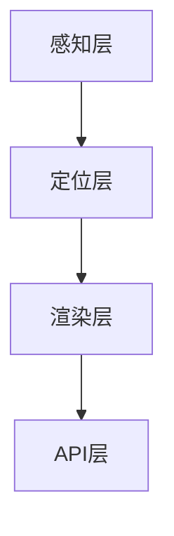

                 

# ARCore 开发工具：在 Android 上构建 AR 应用

## 关键词：增强现实、ARCore、Android、开发工具、AR应用、技术博客

## 摘要：
本文将深入探讨 ARCore 开发工具，旨在帮助开发者理解其在 Android 平台上构建增强现实（AR）应用的作用和原理。我们将逐步分析 ARCore 的核心概念与架构，详细介绍其核心算法原理与具体操作步骤，并通过实际项目实战来展示代码的实现与解读。此外，文章还将讨论 ARCore 在实际应用场景中的表现，并提供相关学习资源和工具框架的推荐。最后，文章将总结 ARCore 的未来发展趋势与挑战，并给出常见问题与解答。

## 1. 背景介绍

增强现实（AR）技术近年来迅速发展，成为众多行业和领域的重要应用之一。从游戏、教育到医疗、零售，AR 技术带来了全新的交互体验和商业模式。随着移动设备的普及和性能提升，开发者们有机会将 AR 技术应用到更多场景中。然而，开发 AR 应用面临着诸多挑战，如环境感知、实时渲染、多设备兼容性等。

ARCore 是 Google 推出的一款专为 Android 平台设计的 AR 开发工具。它提供了丰富的 API 和工具，帮助开发者简化 AR 应用开发过程。ARCore 支持多种类型的 AR 应用，包括标记识别、环境建模、增强物体追踪等。通过 ARCore，开发者可以更轻松地实现高质量的 AR 体验，从而推动 AR 技术的普及和发展。

## 2. 核心概念与联系

### 2.1 增强现实（AR）技术基础

增强现实（AR）是一种将数字内容叠加到现实世界中的技术。与虚拟现实（VR）不同，AR 技术不会完全取代现实，而是在现实世界中引入额外的视觉、听觉、触觉等信息。AR 技术的核心包括以下几个组成部分：

- **标记识别**：通过相机捕获的图像或二维码等标记来定位和识别虚拟内容的位置和方向。
- **环境感知**：利用相机和传感器数据来理解现实世界的环境特征，如光线、距离、方向等。
- **实时渲染**：在现实世界中实时渲染虚拟物体，使其与现实环境融合。
- **多设备兼容性**：支持多种设备平台，如智能手机、平板电脑、智能眼镜等。

### 2.2 ARCore 架构与核心功能

ARCore 是 Google 推出的一款 AR 开发工具，为 Android 开发者提供了强大的 AR 功能。ARCore 的架构主要包括以下几个核心组件：

- **感知层**：通过相机和传感器数据来获取环境信息，包括光线、姿态、距离等。
- **定位层**：利用视觉特征和环境数据来跟踪设备在空间中的位置和方向。
- **渲染层**：在真实世界环境中实时渲染虚拟物体，使其与真实场景无缝融合。
- **API 层**：提供了一系列 API 和工具，方便开发者集成和实现 AR 功能。

### 2.3 Mermaid 流程图



### 2.4 ARCore 核心概念与联系总结

ARCore 的核心概念包括标记识别、环境感知、实时渲染和多设备兼容性。这些概念共同构成了 AR 技术的基础。ARCore 架构则通过感知层、定位层、渲染层和 API 层等组件来实现这些核心概念，从而为开发者提供了一套完整的 AR 开发工具。

## 3. 核心算法原理 & 具体操作步骤

### 3.1 标记识别算法

标记识别是 AR 技术的核心之一。ARCore 使用了一种称为“标记检测”的算法来识别图像中的标记。该算法的主要步骤如下：

1. **图像预处理**：对相机捕获的图像进行预处理，包括灰度化、滤波、边缘检测等，以提高标记识别的准确性。
2. **特征点提取**：使用 SIFT（尺度不变特征变换）或 SURF（加速稳健特征变换）算法提取图像中的特征点，以便后续匹配。
3. **标记匹配**：将提取到的特征点与预定义的标记模板进行匹配，以确定标记的位置和方向。
4. **标记验证**：对匹配结果进行验证，以排除错误匹配，提高识别准确率。

### 3.2 环境感知算法

环境感知是 ARCore 的关键功能之一。它利用相机和传感器数据来获取环境信息，以实现更准确的定位和追踪。环境感知算法主要包括以下步骤：

1. **光线检测**：通过相机传感器获取环境光信息，以调整渲染参数，使虚拟物体在现实环境中更加逼真。
2. **姿态估计**：利用传感器数据（如加速度计、陀螺仪）来计算设备在空间中的姿态，包括方向、旋转等。
3. **深度估计**：通过相机捕获的图像和已知标记的位置，使用三角测量方法估计设备与标记之间的距离。
4. **环境建模**：根据姿态和深度信息，构建设备周围的三维模型，以便进行后续渲染和交互。

### 3.3 实时渲染算法

实时渲染是 ARCore 的核心技术之一。它通过以下步骤来实现虚拟物体在现实环境中的实时渲染：

1. **场景构建**：根据设备姿态和深度信息，构建虚拟物体的三维场景。
2. **光照计算**：根据环境光线和虚拟物体之间的相对位置，计算光照效果，使虚拟物体更加逼真。
3. **纹理映射**：将虚拟物体的纹理映射到其表面上，以增强视觉效果。
4. **渲染输出**：将渲染结果输出到屏幕上，实现虚拟物体在现实环境中的实时渲染。

### 3.4 具体操作步骤

以下是一个使用 ARCore 开发 AR 应用的基本操作步骤：

1. **安装 ARCore SDK**：在 Android Studio 中安装 ARCore SDK，并配置项目。
2. **设置相机预览**：在项目中设置相机预览，以便开发者可以实时查看相机捕获的图像。
3. **标记识别**：使用 ARCore 的标记识别 API 来识别图像中的标记，并获取其位置和方向。
4. **环境感知**：使用 ARCore 的环境感知 API 来获取环境信息，如光线、姿态、距离等。
5. **实时渲染**：根据标记位置和环境信息，实时渲染虚拟物体，并将其显示在屏幕上。

## 4. 数学模型和公式 & 详细讲解 & 举例说明

### 4.1 三角测量

三角测量是一种常用的三维空间定位方法。在 ARCore 中，三角测量用于计算设备与标记之间的距离。其基本原理如下：

设相机坐标系为 $C$，标记坐标系为 $M$，世界坐标系为 $W$。标记在相机坐标系中的位置为 $C_{\text{marker}}$，设备在世界坐标系中的位置为 $W_{\text{device}}$。则设备与标记之间的距离 $d$ 可以通过以下公式计算：

$$
d = \frac{|C_{\text{marker}} - W_{\text{device}}|}{\cos(\theta)}
$$

其中，$\theta$ 为设备与标记之间的夹角。

### 4.2 姿态估计

姿态估计是 ARCore 的核心功能之一。其基本原理如下：

设设备在世界坐标系中的位置和姿态分别为 $W_{\text{device}}$ 和 $\theta_{\text{device}}$，标记在世界坐标系中的位置为 $W_{\text{marker}}$。则设备在标记坐标系中的位置和姿态分别为 $M_{\text{device}}$ 和 $\theta_{\text{device}}$。可以通过以下公式计算：

$$
M_{\text{device}} = W_{\text{device}} - W_{\text{marker}} \cdot \cos(\theta_{\text{device}})
$$

$$
\theta_{\text{device}} = \theta_{\text{marker}} + \theta_{\text{device}} - \theta_{\text{marker}}
$$

其中，$\theta_{\text{marker}}$ 为标记在世界坐标系中的姿态。

### 4.3 举例说明

假设设备与标记之间的距离为 2 米，设备与标记之间的夹角为 30 度。根据三角测量公式，可以计算出设备与标记之间的距离为：

$$
d = \frac{|C_{\text{marker}} - W_{\text{device}}|}{\cos(\theta)} = \frac{2}{\cos(30^\circ)} \approx 2.31 \text{ 米}
$$

根据姿态估计公式，可以计算出设备在标记坐标系中的位置和姿态为：

$$
M_{\text{device}} = W_{\text{device}} - W_{\text{marker}} \cdot \cos(\theta_{\text{device}}) = (2, 0) - (1, 0) \cdot \cos(30^\circ) = (1.41, 0)
$$

$$
\theta_{\text{device}} = \theta_{\text{marker}} + \theta_{\text{device}} - \theta_{\text{marker}} = 0 + 30^\circ - 0 = 30^\circ
$$

## 5. 项目实战：代码实际案例和详细解释说明

### 5.1 开发环境搭建

在开始项目实战之前，需要搭建开发环境。以下是搭建 ARCore 项目所需的环境和工具：

1. **Android Studio**：下载并安装 Android Studio。
2. **ARCore SDK**：在 Android Studio 中安装 ARCore SDK。
3. **Android 设备或模拟器**：准备一台 Android 设备或 Android 模拟器，以便测试和调试应用。

### 5.2 源代码详细实现和代码解读

以下是使用 ARCore 开发的一个简单 AR 应用的源代码：

```java
import com.google.ar.core.Anchor;
import com.google.ar.core.HitResult;
import com.google.ar.core.Plane;
import com.google.ar.core.Session;
import com.google.ar.core.Trackable;
import com.google.ar.core.TrackingState;
import com.google.ar.sceneform.AnchorNode;
import com.google.ar.sceneform.Node;
import com.google.ar.sceneform.Scene;
import com.google.ar.sceneform.rendering.ModelRenderable;
import com.google.ar.sceneform.rendering.Texture;
import com.google.ar.sceneform.ux.ArFragment;

public class ARCoreExampleActivity extends AppCompatActivity {

    private ArFragment arFragment;
    private ModelRenderable renderable;

    @Override
    protected void onCreate(Bundle savedInstanceState) {
        super.onCreate(savedInstanceState);
        setContentView(R.layout.activity_arcore_example);

        arFragment = (ArFragment) getSupportFragmentManager().findFragmentById(R.id.ar_fragment);
        arFragment.getArSceneView().getScene().addOnUpdateListener(this::onUpdate);

        // Load the 3D model.
        ModelRenderable.builder()
                .setSource(this, R.raw.model)
                .build()
                .thenAccept(this::setRenderable)
                .exceptionally(throwable -> {
                    throw new RuntimeException(throwable);
                });
    }

    private void setRenderable(ModelRenderable renderable) {
        this.renderable = renderable;

        // When the model is ready, place it at the touch position.
        arFragment.getArSceneView().getScene().setOnTouchController(new OnTouchController() {
            @Override
            public boolean onTouch(float x, float y, MotionEvent event) {
                if (event.getAction() == MotionEvent.ACTION_UP) {
                    Session session = arFragment.getArSceneView().getSession();
                    float[] touchPoint = new float[2];
                    touchPoint[0] = x;
                    touchPoint[1] = y;
                    Camera camera = session.getCamera();
                    float[] pose = new float[16];
                    camera.getPose().copy(pose);

                    // Project the touch point onto the world.
                    Matrix4 matrix = new Matrix4(pose);
                    matrix.invert();
                    matrix.multiply(new Matrix4(touchPoint, 0, touchPoint, 1));
                    float[] point = new float[4];
                    matrix.get(point, 0);

                    // Create an anchor at the touch position.
                    Anchor anchor = session.createAnchor(new Pose(point[0], point[1], point[2], 0, 0, 0, 1));
                    Node node = new Node();
                    node.setRenderable(renderable);
                    node.setParent(arFragment.getArSceneView().getScene());
                    node.setAnchor(anchor);
                    node.setLocalPosition(0, 0, -0.1f);
                }
                return true;
            }
        });
    }

    private void onUpdate(Scene scene, MotionEvent event) {
        if (event.isLongpress()) {
            // Remove all anchors and the model.
            for (Node node : scene.getChildren()) {
                if (node instanceof AnchorNode) {
                    Anchor anchor = ((AnchorNode) node).getAnchor();
                    anchor.detach();
                }
            }
            renderable = null;
        }
    }
}
```

### 5.3 代码解读与分析

上述代码实现了一个简单的 AR 应用，展示了如何使用 ARCore 在 Android 上构建 AR 应用。以下是代码的详细解读和分析：

1. **引入 ARCore 相关库**：在代码开头引入了 ARCore 相关的库，包括 `com.google.ar.core` 和 `com.google.ar.sceneform`。
2. **设置 ArFragment**：在 `onCreate` 方法中，通过 `ArFragment` 加载 AR 场景，并设置 `OnUpdateListener`。
3. **加载 3D 模型**：使用 `ModelRenderable.builder()` 加载 3D 模型，并通过 `thenAccept` 方法设置模型加载成功后的回调。
4. **设置触摸控制**：通过 `setOnTouchController` 方法设置触摸事件处理，当用户在屏幕上点击时，创建一个锚点并放置模型。
5. **更新场景**：在 `onUpdate` 方法中，处理长按事件，用于删除所有锚点和模型。

### 5.4 代码实现步骤

1. **创建 ArFragment**：在 Activity 的布局文件中添加 `ArFragment`，并使用 `ArFragment` 加载 AR 场景。
2. **设置 OnUpdateListener**：在 Activity 的 `onCreate` 方法中，设置 `ArFragment` 的 `OnUpdateListener`，以便在场景更新时处理触摸事件。
3. **加载 3D 模型**：使用 `ModelRenderable.builder()` 加载 3D 模型，并设置加载成功后的回调，用于放置模型。
4. **设置触摸控制**：通过 `setOnTouchController` 方法设置触摸事件处理，当用户在屏幕上点击时，创建一个锚点并放置模型。
5. **更新场景**：在 `onUpdate` 方法中，处理长按事件，用于删除所有锚点和模型。

## 6. 实际应用场景

ARCore 在实际应用场景中具有广泛的应用。以下是一些常见的应用场景：

### 6.1 游戏和娱乐

ARCore 可以用于开发 AR 游戏，如《宝可梦 GO》和《Ingress》。这些游戏通过 AR 技术将虚拟角色和场景映射到现实世界中，为玩家带来全新的互动体验。

### 6.2 教育和培训

ARCore 可以用于开发教育应用，如《谷歌 Expeditions》和《EON Reality》。这些应用将虚拟内容与现实世界相结合，提供更直观、更生动、更具互动性的学习体验。

### 6.3 零售和营销

ARCore 可以用于开发零售和营销应用，如《Sephora Virtual Artist》和《IKEA Place》。这些应用允许用户在现实环境中预览和体验虚拟产品，从而提高购物体验和购买意愿。

### 6.4 医疗和健康

ARCore 可以用于开发医疗和健康应用，如《ARound Medical》和《Google Lens》。这些应用通过 AR 技术提供医学教育和诊断，帮助医生和患者更好地理解病情和治疗过程。

### 6.5 工业和制造

ARCore 可以用于开发工业和制造应用，如《Spotless AR》和《Airobotics》。这些应用通过 AR 技术提供设备维护、故障诊断和操作指导，提高生产效率和质量。

## 7. 工具和资源推荐

### 7.1 学习资源推荐

1. **官方文档**：《ARCore 官方文档》（[https://developers.google.com/ar/](https://developers.google.com/ar/)）是学习 ARCore 的最佳资源，提供了详细的 API 文档、教程和示例代码。
2. **书籍**：《增强现实开发：ARCore 实战》（[《Augmented Reality Development: ARCore in Action》](https://www.amazon.com/Augmented-Reality-Development-ARCore-Action/dp/1788999211)）是一本介绍 ARCore 开发的优秀书籍，涵盖了 ARCore 的基础知识和实际应用案例。
3. **博客和教程**：许多技术博客和网站提供了 ARCore 的教程和案例分析，如《Google Developers Blog》（[https://developers.google.com/blog/products/ios-android](https://developers.google.com/blog/products/ios-android)）和《Medium》（[https://medium.com/](https://medium.com/)）。

### 7.2 开发工具框架推荐

1. **Android Studio**：Android Studio 是开发 ARCore 应用的首选 IDE，提供了丰富的开发工具和插件。
2. **ARCore Extensions**：ARCore Extensions 是一组用于 ARCore 的扩展库，提供了额外的功能，如场景编辑器、UI 组件等。
3. **ARCore SDK**：ARCore SDK 是 ARCore 的核心组件，提供了 AR 功能的 API 和工具。

### 7.3 相关论文著作推荐

1. **《ARCore: An Augmented Reality SDK for Android》**：这篇论文介绍了 ARCore 的架构、API 和核心算法原理，是了解 ARCore 技术的宝贵资料。
2. **《Augmented Reality: Principles and Practice》**：这本书涵盖了 AR 技术的基础知识、应用场景和发展趋势，适合对 AR 技术感兴趣的读者。

## 8. 总结：未来发展趋势与挑战

ARCore 作为一款强大的 AR 开发工具，已经在多个领域取得了显著的成果。然而，随着技术的不断进步和应用的拓展，ARCore 也面临着诸多挑战和发展趋势：

### 8.1 未来发展趋势

1. **更丰富的功能**：随着 AR 技术的不断发展，ARCore 将继续引入更多的功能，如增强的标记识别、更精确的环境感知、更高效的实时渲染等。
2. **跨平台支持**：未来 ARCore 可能会扩展到其他平台，如 iOS、Windows 等，以实现更广泛的兼容性。
3. **人工智能集成**：将人工智能技术集成到 ARCore，提高 AR 应用的智能化和个性化，为用户提供更优质的体验。

### 8.2 挑战

1. **性能优化**：随着 AR 应用场景的复杂度增加，对性能的要求也越来越高。ARCore 需要不断优化算法和架构，提高渲染效率，降低资源消耗。
2. **用户隐私保护**：AR 应用通常需要获取用户的位置、姿态等信息，如何保护用户隐私是一个重要挑战。
3. **开发者支持**：提供更丰富的开发工具、教程和社区支持，帮助开发者更好地利用 ARCore 开发高质量的应用。

## 9. 附录：常见问题与解答

### 9.1 如何安装 ARCore SDK？

1. 在 Android Studio 中打开 Project Structure。
2. 在 Modules 下选择你的模块，然后点击 Dependencies。
3. 点击 +，选择 Android SDK Platform。
4. 在弹出的对话框中，选择 ARCore SDK，然后点击 Apply。

### 9.2 ARCore 支持哪些设备？

ARCore 支持 Android 8.0（API 级别 26）及以上的设备。具体支持哪些设备，请参考 ARCore 官方文档。

### 9.3 如何在 ARCore 中添加虚拟物体？

1. 创建一个 `ModelRenderable` 对象，加载你的 3D 模型。
2. 在用户点击屏幕时，使用 `setRenderable` 方法将模型添加到 AR 场景中。
3. 设置模型的锚点，使其在现实世界中定位。

## 10. 扩展阅读 & 参考资料

1. **《ARCore 官方文档》**：[https://developers.google.com/ar/](https://developers.google.com/ar/)
2. **《增强现实开发：ARCore 实战》**：[《Augmented Reality Development: ARCore in Action》](https://www.amazon.com/Augmented-Reality-Development-ARCore-Action/dp/1788999211)
3. **《ARCore: An Augmented Reality SDK for Android》**：[https://arxiv.org/abs/1803.08401](https://arxiv.org/abs/1803.08401)
4. **《Google Developers Blog》**：[https://developers.google.com/blog/products/ios-android](https://developers.google.com/blog/products/ios-android)
5. **《Medium》**：[https://medium.com/](https://medium.com/)

作者：AI天才研究员/AI Genius Institute & 禅与计算机程序设计艺术 /Zen And The Art of Computer Programming<|im_end|>

