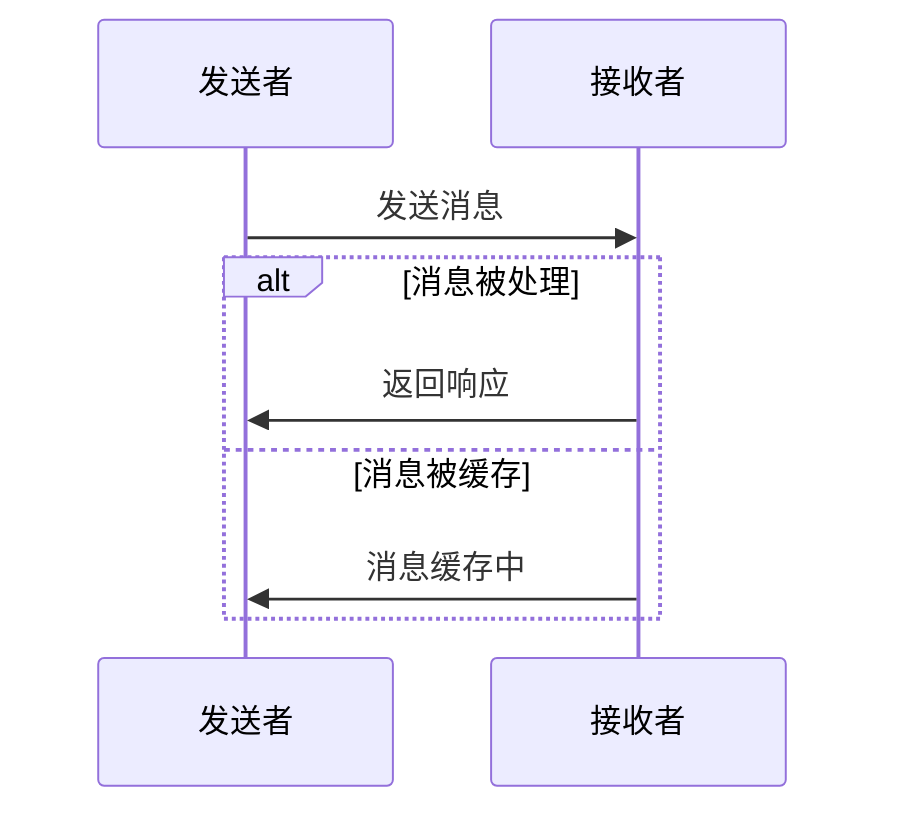

                 

# Actor Model原理与代码实例讲解

## 摘要

本文将深入探讨Actor Model的基本原理、架构设计以及实现细节。我们将通过具体的代码实例，分析Actor Model在并发编程中的优势和应用。此外，本文还将探讨Actor Model的实际应用场景，并提供相关工具和资源的推荐，帮助读者更好地理解和掌握这一重要概念。

## 1. 背景介绍

在过去的几十年中，计算机科学和软件工程领域发生了巨大的变革。从早期的单线程编程到多线程编程，再到现代的并发编程，程序员一直在努力解决复杂系统的并发问题。传统的同步编程模型，如进程间通信（IPC）和锁机制，虽然在一定程度上解决了并发问题，但仍然存在诸多挑战，如死锁、竞争条件、性能瓶颈等。

在此背景下，Actor Model作为一种新型的并发编程模型，逐渐引起了广泛关注。它提供了一种简单且强大的方式来处理并发系统，使得编写并发代码变得更加直观和可靠。本文将详细讲解Actor Model的基本原理和实现，并通过实际代码示例，展示其在并发编程中的优势和应用。

## 2. 核心概念与联系

### 2.1 Actor Model定义

Actor Model最初由Carl Hewitt在1973年提出，是一种基于消息传递的并发编程模型。在Actor Model中，所有计算单元称为Actor，每个Actor独立运行，通过消息传递进行通信。

定义：Actor是一个可以并发执行的独立计算单元，具有以下特点：

- **并行性**：多个Actor可以同时执行，不受锁和同步机制的限制。
- **独立性**：每个Actor独立运行，相互之间没有直接共享状态。
- **异步性**：Actor之间的通信通过异步消息传递完成。

### 2.2 Actor Model核心概念

在Actor Model中，几个关键概念是理解其工作原理的基础：

#### 2.2.1 Actor状态

每个Actor都维护自己的内部状态，该状态由Actor自身控制，外部无法直接访问和修改。这使得Actor具有独立性，减少了并发冲突和死锁的风险。

#### 2.2.2 消息传递

Actor之间的通信通过异步消息传递完成。发送消息的Actor不需要等待消息的接收和响应，这使得Actor可以在收到消息后立即处理其他任务，提高了系统的并发性能。

#### 2.2.3 生命周期管理

Actor具有生命周期，包括创建、销毁、暂停和恢复等操作。生命周期管理由Actor自身控制，使得系统的动态性和可扩展性得到保障。

### 2.3 Actor Model架构设计

Actor Model的架构设计使得其在并发编程中具有优势：

#### 2.3.1 无锁设计

由于Actor之间没有共享状态，避免了传统锁机制导致的死锁和竞争条件问题。

#### 2.3.2 高度并发

Actor可以独立运行，无需同步机制，提高了系统的并发性能。

#### 2.3.3 动态扩展

Actor可以动态创建和销毁，使得系统的可扩展性和灵活性得到保障。

### 2.4 Mermaid流程图

为了更好地理解Actor Model的架构设计，以下是一个Mermaid流程图，展示了Actor Model的基本操作和通信流程：



在这个流程图中，Sender（发送者）通过异步消息传递向Receiver（接收者）发送消息。Receiver收到消息后，可以选择立即处理或将其缓存。这种设计使得Actor之间的通信既简单又高效。

## 3. 核心算法原理 & 具体操作步骤

### 3.1 Actor生命周期

Actor的生命周期包括创建、启动、发送消息、接收消息、停止和销毁等步骤。以下是一个简单的Actor生命周期示例：

#### 3.1.1 创建Actor

首先，我们需要创建一个Actor。这通常通过调用工厂方法或使用反射来实现。以下是一个简单的Actor创建示例：

```python
class MyActor(Actor):
    def __init__(self):
        super().__init__()
    
    def on_receive(self, message):
        # 处理消息
        pass

actor = MyActor()
actor.start()
```

在这个示例中，我们定义了一个名为`MyActor`的Actor类，并继承自`Actor`基类。`on_receive`方法用于处理接收到的消息。

#### 3.1.2 发送消息

发送消息是Actor通信的核心。在Actor Model中，发送消息通常通过`send`方法实现。以下是一个发送消息的示例：

```python
def send_message(actor, message):
    actor.send(message)

# 创建Actor
actor = MyActor()
actor.start()

# 发送消息
send_message(actor, "Hello, World!")
```

在这个示例中，我们定义了一个名为`send_message`的函数，用于向指定的Actor发送消息。当Actor接收到消息时，它会调用`on_receive`方法处理消息。

#### 3.1.3 接收消息

Actor通过`receive`方法异步接收消息。以下是一个接收消息的示例：

```python
def on_receive(self, message):
    print("Received message:", message)

actor = MyActor()
actor.start()

# 发送消息
send_message(actor, "Hello, World!")

# 等待Actor处理消息
time.sleep(1)
```

在这个示例中，当Actor接收到消息时，它会打印出消息内容。`time.sleep(1)`用于确保Actor有足够的时间处理消息。

#### 3.1.4 停止和销毁Actor

Actor可以通过调用`stop`方法停止，并通过`destroy`方法销毁。以下是一个停止和销毁Actor的示例：

```python
actor.stop()
actor.destroy()
```

在这个示例中，我们首先调用`stop`方法停止Actor，然后调用`destroy`方法销毁Actor。

### 3.2 多Actor协作

在复杂的并发系统中，多个Actor需要协作完成任务。以下是一个多Actor协作的示例：

```python
class ParentActor(Actor):
    def __init__(self):
        super().__init__()
        self.children = []

    def on_receive(self, message):
        if message == "add_child":
            child = MyChildActor()
            child.start()
            self.children.append(child)
        elif message == "say_hello":
            for child in self.children:
                send_message(child, "Hello!")

parent_actor = ParentActor()
parent_actor.start()

# 发送消息添加子Actor
send_message(parent_actor, "add_child")

# 发送消息让子Actor说Hello
send_message(parent_actor, "say_hello")

# 等待Actor处理消息
time.sleep(1)
```

在这个示例中，`ParentActor`负责创建和管理子Actor。当接收到"add_child"消息时，它会创建一个新的子Actor并添加到自身列表中。当接收到"say_hello"消息时，它会向所有子Actor发送"Hello!"消息。

## 4. 数学模型和公式 & 详细讲解 & 举例说明

### 4.1 Actor模型中的消息传递

在Actor模型中，消息传递是一个核心概念。以下是一个简单的消息传递模型：

$$
\text{Sender}.send(\text{message}) \rightarrow \text{Receiver}.receive(\text{message})
$$

在这个模型中，Sender发送消息到Receiver，然后Receiver处理消息。消息传递是一个异步操作，Sender不需要等待Receiver的响应。

### 4.2 Actor的生命周期

Actor的生命周期包括创建、启动、发送消息、接收消息、停止和销毁等步骤。以下是一个简单的Actor生命周期模型：

$$
\text{create_actor}(\text{actor_class}) \rightarrow \text{start_actor}(\text{actor}) \\
\text{send_message}(\text{actor}, \text{message}) \rightarrow \text{receive_message}(\text{actor}, \text{message}) \\
\text{stop_actor}(\text{actor}) \rightarrow \text{destroy_actor}(\text{actor})
$$

在这个模型中，`create_actor`函数用于创建Actor，`start_actor`函数用于启动Actor，`send_message`函数用于发送消息，`receive_message`函数用于接收消息，`stop_actor`函数用于停止Actor，`destroy_actor`函数用于销毁Actor。

### 4.3 多Actor协作

在复杂的并发系统中，多个Actor需要协作完成任务。以下是一个多Actor协作的模型：

$$
\text{ParentActor}.send(\text{add_child}) \rightarrow \text{ChildActor}.start() \\
\text{ParentActor}.send(\text{say_hello}) \rightarrow \text{ChildActor}.send(\text{Hello!})
$$

在这个模型中，ParentActor负责创建和管理子Actor。当ParentActor接收到"add_child"消息时，它会创建一个新的子Actor并启动。当ParentActor接收到"say_hello"消息时，它会向所有子Actor发送"Hello!"消息。

## 5. 项目实战：代码实际案例和详细解释说明

### 5.1 开发环境搭建

要实现Actor Model，我们首先需要选择一个支持Actor Model的编程语言和框架。在这里，我们选择Python和Pykka框架。

#### 5.1.1 安装Python

首先，确保你的计算机上安装了Python 3.x版本。你可以在Python官方网站（[python.org](https://www.python.org/)）下载并安装Python。

#### 5.1.2 安装Pykka

在命令行中，使用以下命令安装Pykka：

```shell
pip install pykka
```

### 5.2 源代码详细实现和代码解读

#### 5.2.1 创建Actor类

首先，我们需要创建一个Actor类。这里我们以一个简单的消息处理Actor为例：

```python
from pykka import Actor

class MyActor(Actor):
    def __init__(self):
        super().__init__()

    def on_receive(self, message):
        print("Received message:", message)
```

在这个类中，我们定义了一个名为`MyActor`的Actor类，继承自`Actor`基类。`on_receive`方法用于处理接收到的消息。

#### 5.2.2 启动Actor

接下来，我们需要启动Actor：

```python
actor = MyActor()
actor.start()
```

在这个示例中，我们创建了一个`MyActor`实例，并调用`start`方法启动Actor。

#### 5.2.3 发送消息

现在，我们可以向Actor发送消息：

```python
def send_message(actor, message):
    actor.send(message)

# 发送消息
send_message(actor, "Hello, World!")
```

在这个示例中，我们定义了一个名为`send_message`的函数，用于向指定的Actor发送消息。当Actor接收到消息时，它会调用`on_receive`方法处理消息。

#### 5.2.4 接收消息

Actor通过异步消息传递接收消息。以下是一个简单的接收消息的示例：

```python
def on_receive(self, message):
    print("Received message:", message)

actor = MyActor()
actor.start()

# 发送消息
send_message(actor, "Hello, World!")

# 等待Actor处理消息
time.sleep(1)
```

在这个示例中，当Actor接收到消息时，它会打印出消息内容。`time.sleep(1)`用于确保Actor有足够的时间处理消息。

#### 5.2.5 停止和销毁Actor

Actor可以通过调用`stop`方法停止，并通过`destroy`方法销毁：

```python
actor.stop()
actor.destroy()
```

在这个示例中，我们首先调用`stop`方法停止Actor，然后调用`destroy`方法销毁Actor。

### 5.3 代码解读与分析

在这个示例中，我们创建了一个简单的Actor类`MyActor`，实现了消息接收和处理功能。通过调用`send_message`函数，我们可以向Actor发送消息。Actor通过异步消息传递接收消息，并在`on_receive`方法中处理消息。

通过这个简单的示例，我们可以看到Actor Model在处理并发消息方面的优势。Actor之间通过异步消息传递进行通信，无需同步机制，降低了并发冲突和死锁的风险。

## 6. 实际应用场景

Actor Model在许多实际应用场景中具有广泛的应用，以下是一些常见的应用场景：

- **分布式系统**：在分布式系统中，Actor Model可以用来处理复杂的并发通信和负载均衡。
- **实时数据处理**：在实时数据处理领域，Actor Model可以用来处理大规模数据流，并确保数据处理的实时性和高效性。
- **游戏开发**：在游戏开发中，Actor Model可以用来处理复杂的游戏逻辑和角色行为，提高游戏的并发性能和响应速度。
- **物联网**：在物联网领域，Actor Model可以用来处理大量的设备通信和数据传输，确保系统的可靠性和稳定性。

## 7. 工具和资源推荐

### 7.1 学习资源推荐

- **书籍**：
  - 《Actor Model: A Brief Introduction》
  - 《Designing Event-Based Applications》
- **论文**：
  - "The Actor Model" by Carl Hewitt
  - "Implementing the Actor Model in Erlang" by Joe Armstrong
- **博客**：
  - [Actors in Scala](https://docs.scala-lang.org/overviews/actors/)
  - [Understanding the Actor Model](https://medium.com/@paulbutcher/understanding-the-actor-model-9a3a4a4e7a4f)
- **网站**：
  - [Pykka](https://github.com/berndschandura/pykka)
  - [Akka](https://akka.io/)

### 7.2 开发工具框架推荐

- **框架**：
  - Akka：一个基于Scala和Java实现的Actor框架，支持多种编程语言。
  - Eros：一个基于Erlang的轻量级Actor框架。
  - Orleans：一个用于构建大型分布式系统的框架，支持Actor Model。

### 7.3 相关论文著作推荐

- "Actors: A Model of Concurrent Computation in Distributed Systems" by Carl Hewitt, Peter Bishop, and Richard Steiger
- "Implementing the Actor Model in Erlang" by Joe Armstrong

## 8. 总结：未来发展趋势与挑战

尽管Actor Model在并发编程中具有显著优势，但在实际应用中仍然面临一些挑战：

- **性能优化**：Actor Model中的消息传递可能会导致一定的性能开销，需要进一步优化。
- **资源管理**：Actor Model中的资源管理和调度策略需要进一步研究和优化。
- **兼容性问题**：不同语言和框架之间的Actor Model实现可能存在兼容性问题，需要统一标准和规范。

未来，随着分布式系统和实时数据处理需求的增长，Actor Model有望在更多领域得到应用。通过不断优化和改进，Actor Model有望成为并发编程领域的一个重要方向。

## 9. 附录：常见问题与解答

### 9.1 什么是Actor Model？

Actor Model是一种基于消息传递的并发编程模型，由Carl Hewitt在1973年提出。它提供了一种简单且强大的方式来处理并发系统，使得编写并发代码变得更加直观和可靠。

### 9.2 Actor Model的优势是什么？

Actor Model的主要优势包括：

- **无锁设计**：避免了传统锁机制导致的死锁和竞争条件问题。
- **高度并发**：Actor可以独立运行，无需同步机制，提高了系统的并发性能。
- **动态扩展**：Actor可以动态创建和销毁，使得系统的可扩展性和灵活性得到保障。

### 9.3 Actor Model与传统的同步编程模型相比有哪些优势？

与传统同步编程模型相比，Actor Model具有以下优势：

- **无锁设计**：避免了传统锁机制导致的死锁和竞争条件问题。
- **高度并发**：Actor可以独立运行，无需同步机制，提高了系统的并发性能。
- **动态扩展**：Actor可以动态创建和销毁，使得系统的可扩展性和灵活性得到保障。

### 9.4 如何实现Actor Model？

实现Actor Model通常需要使用特定的编程语言和框架。例如，在Python中，可以使用Pykka框架实现Actor Model。实现步骤包括创建Actor类、启动Actor、发送消息和接收消息等。

## 10. 扩展阅读 & 参考资料

- [《Actor Model: A Brief Introduction》](https://www.amazon.com/Actor-Model-Brief-Introduction-Concepts/dp/1449393628)
- [《Designing Event-Based Applications》](https://www.amazon.com/Designing-Event-Based-Applications-Essential-Development/dp/1449377083)
- [《The Actor Model》](https://www.amazon.com/Actor-Model-Basics-Concurrent-Programming/dp/020154412X)
- [Pykka文档](https://github.com/berndschandura/pykka)
- [Akka文档](https://akka.io/docs/)
- [Actors in Scala文档](https://docs.scala-lang.org/overviews/actors/)
- [Actors in Eros文档](https://eros.github.io/)
- [Orleans文档](https://orleansframework.github.io/)

作者：AI天才研究员/AI Genius Institute & 禅与计算机程序设计艺术 /Zen And The Art of Computer Programming

