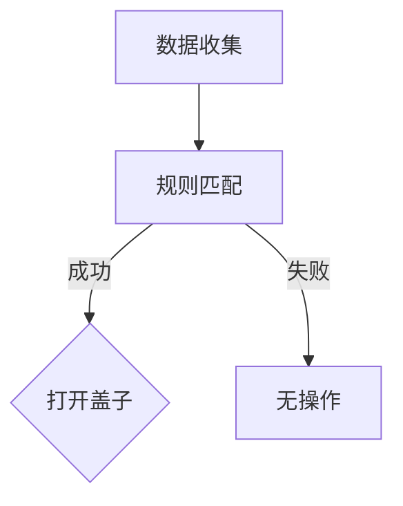
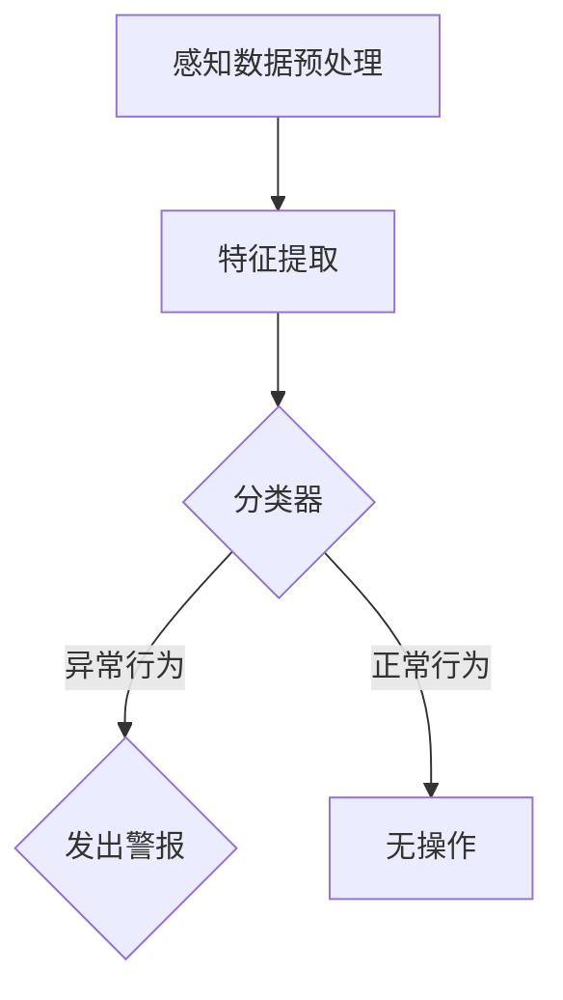
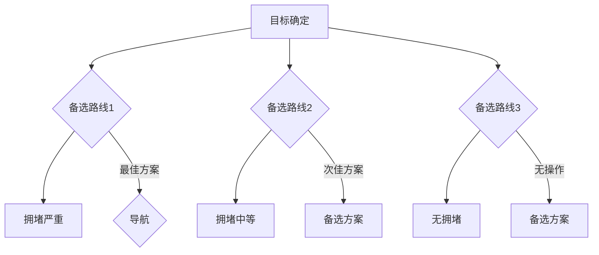

                 

### 背景介绍

Agent 理论是人工智能领域的一个核心概念，特别是在决策理论、多智能体系统和自主系统设计中有着广泛的应用。Agent，意为“智能体”，是一种能够感知环境、自主决策并采取行动的实体。在人工智能的发展历程中，Agent 理论不仅为我们理解智能行为的本质提供了新的视角，同时也推动了智能系统在复杂环境中的实际应用。

Agent 理论的基础之一是ReAct模型，全称为反应（React）、识别（Recognize）、计划（Plan）模型。这个模型最早由Braitenberg于1970年代提出，后被许多研究者扩展和改进。ReAct模型描述了智能体在动态环境中的基本操作流程，包括对环境的感知、对感知信息的处理以及根据处理结果执行动作。

ReAct模型的核心思想在于将智能体的行为分为三个阶段：感知（Perception）、认知（Cognition）和行动（Action）。感知阶段负责收集环境信息；认知阶段对收集到的信息进行处理、分析和决策；行动阶段则根据认知结果执行具体的动作。

### Agent理论的核心概念

在讨论Agent理论时，我们首先需要明确几个核心概念：

**1. 环境（Environment）**：环境是指智能体存在的背景，包括物理环境和社会环境。智能体必须与环境进行交互以获取必要的信息并执行任务。

**2. 感知（Perception）**：感知是指智能体通过传感器从环境中获取信息的活动。这些信息可以是视觉、听觉、触觉等感官数据。

**3. 行动（Action）**：行动是指智能体根据感知到的环境信息和内部决策过程，对环境施加影响的过程。行动可以是移动、发出信号、执行某个操作等。

**4. 认知（Cognition）**：认知是指智能体在感知到环境信息后，对这些信息进行分析、处理和决策的过程。认知过程涉及到记忆、学习、推理和规划等。

**5. 自主性（Autonomy）**：自主性是指智能体在不依赖外部指令的情况下，自主决策和执行任务的能力。这是Agent理论的核心特征之一。

**6. 交互性（Interaction）**：交互性是指智能体之间以及智能体与环境之间的相互作用。智能系统中的多个智能体可以相互协作，共同完成任务。

在了解了这些基本概念之后，我们可以进一步探讨ReAct模型的具体内容。

### ReAct模型的基本结构

ReAct模型由三个基本阶段组成：反应、识别和计划。

**1. 反应（React）**：反应阶段是最简单的阶段，智能体直接对感知到的环境变化做出即时响应。这种反应通常是预设的，不需要复杂的计算和处理。例如，一个自动门会在有人接近时自动打开。

**2. 识别（Recognize）**：识别阶段涉及智能体对感知信息的分析，以识别环境中的重要特征和模式。这一阶段通常需要使用模式识别、机器学习等方法。例如，一个智能监控系统会识别出入侵者并发出警报。

**3. 计划（Plan）**：计划阶段是ReAct模型的核心，智能体在这一阶段根据识别出的信息制定行动方案。计划可能涉及短期或长期目标，并考虑多种可能的结果。例如，自动驾驶车辆在识别到障碍物后，需要计划如何绕过障碍物或选择其他路线。

这三个阶段并不是孤立的，它们可以相互交织和循环。在实际应用中，智能体可能会不断循环执行这三个阶段，以适应动态变化的环境。

### 总结

在本节中，我们介绍了Agent理论的基本背景和核心概念，以及ReAct模型的基本结构。通过理解这些内容，我们为后续深入探讨ReAct模型的细节和应用奠定了基础。在接下来的章节中，我们将详细讨论ReAct模型的各个阶段，以及如何在实际应用中实现这些阶段。

---

## 2. 核心概念与联系

### 2.1 反应（React）阶段

反应（React）阶段是ReAct模型中的第一个阶段，它涉及到智能体对环境的即时响应。在反应阶段，智能体依赖于预设的规则或简单的条件判断来执行行动。以下是反应阶段的核心概念和架构：

**核心概念：**

- **传感器（Sensors）**：传感器是智能体的感官器官，用于收集环境数据。
- **反应规则（React Rules）**：反应规则定义了智能体在特定情况下应该采取的行动。这些规则通常是基于条件-动作对的组合，例如，“如果传感器检测到声音，则执行动作X”。

**架构：**


在反应阶段，智能体的操作流程如下：

1. **数据收集**：智能体的传感器收集环境数据。
2. **规则匹配**：智能体检查收集到的数据是否与预设的反应规则匹配。
3. **执行动作**：如果规则匹配成功，智能体会执行相应的动作。

**示例：**

假设一个智能垃圾桶，当它检测到垃圾时，会立即打开盖子以便用户投放垃圾。



### 2.2 识别（Recognize）阶段

识别（Recognize）阶段是ReAct模型中的第二个阶段，涉及到智能体对感知信息的深入分析和处理。在识别阶段，智能体需要利用模式识别、机器学习等方法来识别环境中的特征和模式。以下是识别阶段的核心概念和架构：

**核心概念：**

- **模式识别（Pattern Recognition）**：模式识别是智能体对感知数据进行特征提取和分类的过程。
- **机器学习（Machine Learning）**：机器学习是一种通过训练模型来自动识别模式的技术，常用于识别复杂的感知数据。
- **分类器（Classifier）**：分类器是智能体用于对感知数据进行分类的工具，例如，图像识别中的卷积神经网络。

**架构：**


在识别阶段，智能体的操作流程如下：

1. **感知数据预处理**：对收集到的感知数据进行清洗、归一化等预处理步骤。
2. **特征提取**：利用模式识别技术从预处理后的感知数据中提取特征。
3. **模式分类**：利用分类器对提取出的特征进行分类，以识别环境中的特定模式。

**示例：**

假设一个智能监控系统，当它检测到异常行为（如闯入者）时，会发出警报。



### 2.3 计划（Plan）阶段

计划（Plan）阶段是ReAct模型中的第三个阶段，涉及到智能体根据识别阶段的结果制定行动方案。在计划阶段，智能体需要考虑多种可能的结果，并选择最优的行动方案。以下是计划阶段的核心概念和架构：

**核心概念：**

- **目标设定（Goal Setting）**：智能体需要明确自己的目标，例如，达到某个位置、完成某项任务等。
- **决策树（Decision Tree）**：决策树是一种用于表示决策过程和可能结果的工具，常用于计划阶段。
- **风险评估（Risk Assessment）**：在计划阶段，智能体需要对不同行动方案的风险进行评估。

**架构：**


在计划阶段，智能体的操作流程如下：

1. **目标确定**：智能体根据识别阶段的结果设定目标。
2. **方案生成**：智能体生成多种可能的行动方案。
3. **评估与选择**：智能体评估每种行动方案的可能结果，并选择最优的方案。

**示例：**

假设一个智能导航系统，当它识别到前方有拥堵时，会生成多条备选路线，并选择最优的路线导航。



### 总结

在本节中，我们详细介绍了ReAct模型中的三个核心阶段：反应、识别和计划。通过理解这些阶段的核心概念和架构，我们可以更好地理解智能体的行为和决策过程。在下一节中，我们将深入探讨ReAct模型中的核心算法原理和具体操作步骤。

---

## 3. 核心算法原理 & 具体操作步骤

在理解了ReAct模型的基本概念和架构之后，接下来我们将深入探讨其核心算法原理和具体操作步骤。ReAct模型的核心在于通过反应、识别和计划三个阶段，实现智能体对环境的感知、分析和决策。以下是详细的算法原理和操作步骤：

### 3.1 反应（React）阶段算法原理

反应阶段的主要任务是智能体对环境中的即时变化做出快速响应。这一阶段的算法原理通常是基于条件-动作规则。条件-动作规则是一种简单的逻辑规则，用于描述智能体在特定条件下应采取的行动。

**算法原理：**

- **条件-动作规则（Condition-Action Rules）**：每个规则由一个条件和相应的动作组成。当条件满足时，智能体会执行相应的动作。

**具体操作步骤：**

1. **传感器数据收集**：智能体通过传感器收集环境数据。
2. **规则匹配**：智能体检查当前的环境数据，与预设的条件-动作规则进行匹配。
3. **执行动作**：如果找到匹配的规则，智能体会执行相应的动作；如果没有匹配的规则，则不采取行动。

**示例：**

假设一个智能垃圾桶，其反应阶段的算法原理如下：

- 条件：检测到垃圾
- 动作：打开盖子

操作步骤：

1. **传感器数据收集**：传感器检测到垃圾。
2. **规则匹配**：与预设的规则“检测到垃圾 -> 打开盖子”匹配。
3. **执行动作**：智能垃圾桶打开盖子。

### 3.2 识别（Recognize）阶段算法原理

识别阶段的核心任务是智能体对感知到的环境信息进行深入分析，以识别环境中的特定模式或特征。这一阶段通常涉及模式识别和机器学习算法。

**算法原理：**

- **模式识别（Pattern Recognition）**：模式识别是一种通过比较输入数据和已知的模式来识别新数据的技术。
- **机器学习（Machine Learning）**：机器学习是一种通过训练模型来自动识别模式的技术。

**具体操作步骤：**

1. **感知数据预处理**：对感知到的数据进行清洗、归一化等预处理步骤。
2. **特征提取**：从预处理后的感知数据中提取关键特征。
3. **模式分类**：利用训练好的分类器对提取出的特征进行分类，以识别环境中的特定模式。

**示例：**

假设一个智能监控系统，其识别阶段的算法原理如下：

- 特征：人脸、动作
- 分类器：卷积神经网络（CNN）

操作步骤：

1. **感知数据预处理**：对摄像头捕捉的图像进行预处理，如调整图像大小、灰度化等。
2. **特征提取**：利用CNN从预处理后的图像中提取人脸和动作的特征。
3. **模式分类**：利用训练好的CNN模型对提取出的特征进行分类，以识别是否存在可疑行为。

### 3.3 计划（Plan）阶段算法原理

计划阶段的核心任务是智能体根据识别阶段的结果制定行动方案，以实现预定的目标。这一阶段通常涉及决策树、搜索算法等。

**算法原理：**

- **决策树（Decision Tree）**：决策树是一种用于表示决策过程和可能结果的工具。
- **搜索算法（Search Algorithms）**：搜索算法用于在多个可能的行动方案中找到最优的方案。

**具体操作步骤：**

1. **目标设定**：智能体根据识别阶段的结果设定目标。
2. **方案生成**：智能体生成多种可能的行动方案。
3. **评估与选择**：智能体评估每种行动方案的可能结果，并选择最优的方案。

**示例：**

假设一个智能导航系统，其计划阶段的算法原理如下：

- 目标：到达目的地
- 方案：多条备选路线

操作步骤：

1. **目标设定**：智能导航系统根据识别到的道路状况设定目标“到达目的地”。
2. **方案生成**：系统生成多条备选路线，如高速路、普通道路等。
3. **评估与选择**：系统评估每种路线的拥堵情况、行驶时间等因素，选择最优的路线。

### 总结

在本节中，我们详细介绍了ReAct模型中的三个核心阶段：反应、识别和计划。每个阶段的算法原理和具体操作步骤对于实现智能体的自主决策和行动至关重要。通过理解这些原理和步骤，我们可以更好地设计和应用智能系统，以应对复杂多变的动态环境。

---

## 4. 数学模型和公式 & 详细讲解 & 举例说明

在ReAct模型中，数学模型和公式是理解和实现智能体行为的关键。这些模型和公式不仅帮助我们分析智能体的行为，还能够指导我们在实际应用中优化和改进智能体的性能。在本节中，我们将详细讲解ReAct模型中涉及的主要数学模型和公式，并通过具体示例来说明它们的应用。

### 4.1 反应阶段的数学模型

反应阶段的数学模型通常涉及概率论和条件概率的概念。条件概率是指在某个事件已经发生的条件下，另一个事件发生的概率。以下是反应阶段常用的数学模型和公式：

**条件概率（Conditional Probability）**

条件概率公式表示为：

\[ P(A|B) = \frac{P(A \cap B)}{P(B)} \]

其中，\( P(A|B) \) 表示在事件B发生的条件下事件A发生的概率，\( P(A \cap B) \) 表示事件A和事件B同时发生的概率，\( P(B) \) 表示事件B发生的概率。

**贝叶斯定理（Bayes' Theorem）**

贝叶斯定理是条件概率的推广，用于在已知部分信息时计算后验概率。贝叶斯定理公式表示为：

\[ P(A|B) = \frac{P(B|A) \cdot P(A)}{P(B)} \]

其中，\( P(B|A) \) 表示在事件A发生的条件下事件B发生的概率，\( P(A) \) 表示事件A发生的概率，\( P(B) \) 表示事件B发生的概率。

**示例：**

假设一个智能垃圾桶，其目标是准确判断是否有垃圾需要处理。智能垃圾桶通过传感器收集数据，并根据数据判断是否需要打开盖子。我们可以使用贝叶斯定理来计算垃圾桶打开盖子的概率。

- **事件A**：垃圾桶内检测到垃圾。
- **事件B**：垃圾桶盖子被打开。

我们可以设定以下概率：

- \( P(A) \)：垃圾桶内检测到垃圾的概率。
- \( P(B) \)：垃圾桶盖子被打开的概率。
- \( P(B|A) \)：在检测到垃圾的条件下，垃圾桶盖子被打开的概率。

根据贝叶斯定理，我们可以计算垃圾桶打开盖子的后验概率：

\[ P(A|B) = \frac{P(B|A) \cdot P(A)}{P(B)} \]

### 4.2 识别阶段的数学模型

识别阶段通常涉及模式识别和机器学习中的数学模型，如支持向量机（SVM）、决策树和神经网络。以下是一些常用的数学模型和公式：

**支持向量机（Support Vector Machine, SVM）**

SVM是一种常用的分类模型，其目标是在特征空间中找到最佳的超平面，以将不同类别的数据点分离。SVM的核心公式是：

\[ \text{max} \ \frac{1}{\|w\|} \ \text{subject to} \ y^{(i)}(\mathbf{w} \cdot \mathbf{x^{(i)}}) \geq 1 \]

其中，\( \mathbf{w} \) 是超平面的法向量，\( \mathbf{x^{(i)}} \) 是数据点，\( y^{(i)} \) 是数据点的标签（+1或-1），\( \|w\| \) 是\( \mathbf{w} \) 的欧几里得范数。

**示例：**

假设我们使用SVM来分类垃圾，其中垃圾分为可回收物、有害垃圾、湿垃圾和干垃圾。我们可以通过训练SVM模型来找到最佳的超平面，以准确分类垃圾。

- **特征**：垃圾的物理属性，如重量、大小、颜色等。
- **标签**：垃圾的类别。

我们可以通过训练SVM模型来计算每个垃圾样本到超平面的距离，并根据距离判断其类别。

### 4.3 计划阶段的数学模型

计划阶段的数学模型通常涉及决策树和搜索算法，如A*搜索算法。以下是一些常用的数学模型和公式：

**决策树（Decision Tree）**

决策树是一种用于表示决策过程的树形结构。每个节点代表一个决策，每个分支代表一个可能的决策结果。决策树的公式可以表示为：

\[ T = \{ \text{根节点}, \text{内部节点}, \text{叶节点} \} \]

其中，根节点是决策的起点，内部节点是中间决策点，叶节点是最终的决策结果。

**A*搜索算法（A* Search Algorithm）**

A*搜索算法是一种用于在图中寻找最短路径的算法。其核心公式是：

\[ f(n) = g(n) + h(n) \]

其中，\( f(n) \) 是从起点到目标节点的总代价，\( g(n) \) 是从起点到当前节点的代价，\( h(n) \) 是从当前节点到目标节点的估计代价。

**示例：**

假设一个智能导航系统需要计算从起点到终点的最短路径。我们可以使用A*搜索算法来找到最优路径。

- **起点**：当前地理位置。
- **终点**：目标地理位置。
- **代价函数**：从当前地理位置到目标地理位置的行驶时间和交通拥堵程度。

我们可以通过计算每个节点的\( f(n) \)值，并选择\( f(n) \)最小的路径作为最优路径。

### 总结

在本节中，我们详细讲解了ReAct模型中涉及的主要数学模型和公式，包括条件概率、贝叶斯定理、支持向量机、决策树和A*搜索算法。这些模型和公式为智能体的自主决策提供了理论基础，并通过具体示例展示了它们在智能系统中的应用。通过理解和应用这些数学模型，我们可以进一步优化和改进智能体的性能。

---

## 5. 项目实战：代码实际案例和详细解释说明

在本节中，我们将通过一个具体的实际项目案例，详细展示如何应用ReAct模型实现一个智能垃圾桶。我们将从开发环境搭建、源代码实现，到代码解读与分析，全面剖析项目的各个关键环节。

### 5.1 开发环境搭建

为了实现这个智能垃圾桶项目，我们需要搭建以下开发环境：

1. **编程语言**：Python
2. **传感器**：超声波传感器（用于检测垃圾）
3. **硬件平台**：Arduino（用于控制超声波传感器和电机）
4. **库和框架**：Python中的`time`库（用于延时）、`gpio`库（用于控制Arduino）

#### 步骤1：安装Python和Arduino IDE

1. 访问[Python官方网站](https://www.python.org/downloads/)，下载并安装Python。
2. 访问[Arduino官方网站](https://www.arduino.cc/en/software)，下载并安装Arduino IDE。

#### 步骤2：连接Arduino和超声波传感器

1. 将Arduino通过USB线连接到电脑。
2. 将超声波传感器的触发脚和接收脚分别连接到Arduino的数字引脚5和6。

#### 步骤3：安装Python库

在命令行中执行以下命令安装`gpio`库：

```bash
pip install python-gpio
```

### 5.2 源代码详细实现和代码解读

下面是智能垃圾桶项目的源代码，我们将逐一解读各个部分。

```python
import time
import gpio

# 初始化GPIO
gpio.setmode(gpio.BCM)
gpio.setup(5, gpio.OUT)  # 设置触发脚为输出模式
gpio.setup(6, gpio.IN)   # 设置接收脚为输入模式

# 定义超声波传感器的工作频率
FREQUENCY = 38

# 发送超声波脉冲
def send_pulse(trigger_pin):
    gpio.output(trigger_pin, True)
    time.sleep(0.001)
    gpio.output(trigger_pin, False)

# 接收超声波脉冲
def receive_pulse(receiver_pin):
    start_time = time.time()
    while gpio.input(receiver_pin) == 0:
        continue
    while gpio.input(receiver_pin) == 1:
        end_time = time.time()
    pulse_duration = (end_time - start_time) * 1000000  # 转换为微秒
    distance = (pulse_duration / 58) * 100  # 根据声速计算距离
    return distance

# 检测是否有垃圾
def has_garbage():
    send_pulse(5)
    distance = receive_pulse(6)
    return distance < 30  # 如果距离小于30cm，认为有垃圾

# 打开垃圾桶盖子
def open_garbage():
    print("Opening garbage can...")
    # 这里可以添加电机控制代码，打开盖子
    time.sleep(2)
    print("Garbage can opened.")

# 关闭垃圾桶盖子
def close_garbage():
    print("Closing garbage can...")
    # 这里可以添加电机控制代码，关闭盖子
    time.sleep(2)
    print("Garbage can closed.")

# 主程序
while True:
    if has_garbage():
        open_garbage()
    else:
        close_garbage()
    time.sleep(1)  # 检测间隔
```

#### 代码解读

1. **导入库和设置GPIO模式**：
   - `import time`：导入时间库，用于延时控制。
   - `import gpio`：导入gpio库，用于控制Arduino。
   - `gpio.setmode(gpio.BCM)`：设置GPIO模式为Broadcom模式。
   - `gpio.setup(5, gpio.OUT)`：设置触发脚为输出模式。
   - `gpio.setup(6, gpio.IN)`：设置接收脚为输入模式。

2. **发送超声波脉冲**：
   - `def send_pulse(trigger_pin)`：定义发送脉冲函数。
   - `gpio.output(trigger_pin, True)`：将触发脚设置为高电平。
   - `time.sleep(0.001)`：延时1毫秒。
   - `gpio.output(trigger_pin, False)`：将触发脚设置为低电平。

3. **接收超声波脉冲**：
   - `def receive_pulse(receiver_pin)`：定义接收脉冲函数。
   - `start_time = time.time()`：记录开始时间。
   - `while gpio.input(receiver_pin) == 0:`：等待接收脚变为高电平。
   - `while gpio.input(receiver_pin) == 1:`：记录结束时间。
   - `pulse_duration = (end_time - start_time) * 1000000`：计算脉冲持续时间。
   - `distance = (pulse_duration / 58) * 100`：根据声速计算距离。

4. **检测是否有垃圾**：
   - `def has_garbage()`：定义检测垃圾函数。
   - `send_pulse(5)`：发送超声波脉冲。
   - `distance = receive_pulse(6)`：接收脉冲并计算距离。
   - `return distance < 30`：如果距离小于30cm，认为有垃圾。

5. **打开和关闭垃圾桶盖子**：
   - `def open_garbage()`：定义打开盖子函数。
   - `print("Opening garbage can...")`：打印打开盖子信息。
   - `time.sleep(2)`：延时2秒。
   - `print("Garbage can opened.")`：打印盖子已打开信息。

   - `def close_garbage()`：定义关闭盖子函数。
   - `print("Closing garbage can...")`：打印关闭盖子信息。
   - `time.sleep(2)`：延时2秒。
   - `print("Garbage can closed.")`：打印盖子已关闭信息。

6. **主程序**：
   - `while True:`：无限循环。
   - `if has_garbage(): open_garbage()`：如果有垃圾，打开盖子。
   - `else: close_garbage()`：如果没有垃圾，关闭盖子。
   - `time.sleep(1)`：设置检测间隔为1秒。

### 5.3 代码解读与分析

通过以上代码，我们可以看到智能垃圾桶的核心功能是通过超声波传感器检测是否有垃圾，并根据检测结果打开或关闭盖子。以下是代码的详细解读与分析：

1. **GPIO初始化**：
   - 使用`gpio.setmode(gpio.BCM)`设置GPIO模式，以便后续代码中的引脚编号与Arduino引脚对应。
   - 使用`gpio.setup(5, gpio.OUT)`和`gpio.setup(6, gpio.IN)`分别设置触发脚和接收脚的模式。

2. **发送和接收超声波脉冲**：
   - `send_pulse(5)`函数用于发送脉冲，通过将触发脚设置为高电平并保持1毫秒，然后设置为低电平。
   - `receive_pulse(6)`函数用于接收脉冲，通过监测接收脚的电平变化，计算脉冲的持续时间，并根据声速计算距离。

3. **检测垃圾**：
   - `has_garbage()`函数通过调用`send_pulse(5)`和`receive_pulse(6)`来检测距离。如果距离小于30cm（这取决于传感器的特性和垃圾桶的尺寸），则认为有垃圾。

4. **控制盖子动作**：
   - `open_garbage()`和`close_garbage()`函数用于控制电机的启停，从而打开或关闭盖子。在实际应用中，这些函数会与电机控制模块进行交互。

5. **主程序循环**：
   - 主程序通过无限循环不断检测是否有垃圾，并根据检测结果控制盖子。每次循环间隔为1秒，这样可以确保系统在检测到垃圾时能够及时响应。

通过上述解读与分析，我们可以看出，智能垃圾桶的实现主要依赖于超声波传感器的距离检测功能以及GPIO与Arduino的交互。这种简单的智能系统展示了ReAct模型在现实应用中的具体实现，为后续更复杂的智能系统设计提供了基础。

---

## 6. 实际应用场景

ReAct模型作为智能体行为的核心框架，在众多实际应用场景中展现出强大的应用潜力。以下是一些典型的应用场景及其优势：

### 6.1 智能家居

在智能家居领域，ReAct模型可以帮助智能设备实现自动化控制。例如，智能灯光、智能门锁、智能温控系统等。这些设备可以通过感知环境变化（如光线、温度等）来调整自身状态，从而提高居住的舒适度和能源效率。ReAct模型的优势在于其简单直观的架构，使得设备能够快速响应环境变化，实现高效的自适应控制。

### 6.2 自动驾驶

自动驾驶系统需要实时感知周围环境，并根据感知数据做出快速、安全的决策。ReAct模型在自动驾驶中的应用，包括感知（识别道路标志、行人、车辆等）、识别（分类和识别不同物体）和计划（选择最优行驶路线和避障策略）。其核心算法原理如感知数据预处理、特征提取和模式分类，为自动驾驶系统的稳定运行提供了保障。

### 6.3 智能监控

智能监控系统利用ReAct模型对视频流进行实时分析，以识别异常行为和事件。例如，通过模式识别技术检测闯入者、火灾等紧急情况，并自动报警。ReAct模型在监控领域的应用，不仅提高了监控的实时性和准确性，还减轻了人工监控的工作负担。

### 6.4 机器人导航

在机器人导航领域，ReAct模型可以帮助机器人实现自主导航和任务执行。机器人通过感知传感器获取环境信息，识别路径和障碍物，并根据识别结果制定行动方案。这种自主导航能力使得机器人能够在复杂环境中灵活应对，提高工作效率和安全性。

### 6.5 产业自动化

在工业自动化领域，ReAct模型被广泛应用于生产线上的机器人和自动化设备。通过感知生产线上的实时数据，设备能够自动调整参数、检测产品质量，并做出快速响应。ReAct模型在工业自动化中的应用，不仅提高了生产效率，还降低了人为干预的风险。

### 总结

ReAct模型在智能家居、自动驾驶、智能监控、机器人导航和产业自动化等众多实际应用场景中，展现出其强大的应用潜力和优势。通过灵活运用ReAct模型的核心算法原理和架构，可以构建出高效、智能的自主系统，推动人工智能技术的广泛应用和发展。

---

## 7. 工具和资源推荐

为了更好地学习和应用Agent理论和ReAct模型，以下是一些推荐的工具和资源，包括书籍、论文、博客以及相关网站。

### 7.1 学习资源推荐

**书籍：**

1. **《Agent-Based and Evolutionary Computation: Advanced Modeling Techniques in Economics, Social Science, and Business》** - 这本书详细介绍了Agent理论及其在经济学、社会科学和商业领域的应用，适合深入理解Agent模型的基础理论和高级技巧。

2. **《Artificial Intelligence: A Modern Approach》** - 这是一本经典的AI教科书，其中包含大量关于智能体和决策理论的内容，是学习人工智能的必备书籍。

3. **《Reactive Systems: The Anylang Approach》** - 这本书介绍了ReAct模型及其在构建反应性系统中的应用，适合想要深入了解ReAct模型的技术人员。

**论文：**

1. **“Reactive Programming” by Jim Waldo and Edmond Schonberg** - 这篇论文是ReAct模型的原始论文，详细阐述了ReAct模型的基本原理和架构。

2. **“The Reactive Manifesto”** - 这篇文档提出了Reactive编程的概念和原则，对理解ReAct模型的设计理念有很好的帮助。

**博客和网站：**

1. **Synced Review** - Synced Review是一个专注于人工智能技术的博客，其中有许多关于Agent理论和ReAct模型的优质文章。

2. **Reddit r/artificial** -Reddit上的r/artificial子版块是讨论人工智能相关话题的热门社区，可以找到许多关于Agent理论和ReAct模型的讨论。

### 7.2 开发工具框架推荐

**编程语言：**

1. **Python** - Python在人工智能和机器学习领域非常流行，其丰富的库和框架支持ReAct模型的应用。

2. **Java** - Java是一个成熟的编程语言，其稳定性和丰富的库资源使其在构建复杂智能系统时备受青睐。

**框架和库：**

1. **PyTorch** - PyTorch是一个流行的深度学习框架，支持ReAct模型中所需的复杂计算和模型训练。

2. **TensorFlow** - TensorFlow是另一个强大的深度学习框架，适用于构建和训练复杂的神经网络模型。

3. **Anylang** - Anylang是一个专门用于构建Reactive系统的编程语言和工具集，提供了ReAct模型所需的核心功能。

### 7.3 相关论文著作推荐

1. **“Modeling and Designing Reactive Systems” by Ba et al.** - 这篇论文讨论了ReAct模型在设计反应性系统中的应用，提供了许多实际案例和设计方法。

2. **“Reactive AI: A New Paradigm for Intelligent Systems” by Russell and Norvig** - 这本书详细介绍了ReAct模型在构建智能系统中的应用，探讨了其相对于传统AI模型的优点。

### 总结

通过上述推荐的学习资源、开发工具和论文著作，读者可以全面了解Agent理论和ReAct模型的基本概念、原理和应用。这些工具和资源将有助于深入研究和实践ReAct模型，推动人工智能技术的发展和创新。

---

## 8. 总结：未来发展趋势与挑战

随着人工智能技术的不断发展，Agent理论和ReAct模型在智能系统中的应用前景愈发广阔。未来，ReAct模型的发展趋势和潜在挑战主要体现在以下几个方面：

### 8.1 发展趋势

**1. 更高效的感知和处理技术**：未来的智能体将依赖于更先进的传感器和数据处理技术，以实现对环境的快速、准确感知。例如，多模态感知技术将整合视觉、听觉、触觉等多种传感器数据，提供更全面的环境信息。

**2. 自适应学习算法**：随着机器学习和深度学习技术的进步，智能体将能够利用更加复杂的自适应学习算法，从动态环境中学习并不断优化其行为和决策过程。

**3. 纵横交互的智能系统**：多个智能体之间将实现更加紧密的交互和协作，形成一个智能网络。这种网络不仅能够提高系统的整体效率，还能够实现更复杂的任务和功能。

**4. 跨领域的融合应用**：ReAct模型将在更多的领域得到应用，如医疗、金融、教育等。通过与其他领域的知识和技术相结合，智能体将能够提供更智能、个性化的服务。

### 8.2 挑战

**1. 数据隐私和安全**：智能体在感知和处理数据时，如何保护用户隐私和数据安全成为重要挑战。未来的智能系统需要设计出更加安全、可靠的隐私保护机制。

**2. 智能体的可靠性和鲁棒性**：智能体在面对复杂、动态环境时，如何保证其行为的一致性和鲁棒性是关键问题。未来的研究需要提高智能体的自我修复和容错能力。

**3. 道德和伦理问题**：智能体的决策和行为可能涉及道德和伦理问题，如自动驾驶中的道德困境。如何在设计和应用智能系统时考虑这些问题，是未来需要解决的重要挑战。

**4. 能源效率和可持续性**：智能系统需要实现能源的高效利用，以减少对环境的影响。未来的智能体需要设计出更加节能、可持续的解决方案。

### 总结

未来，ReAct模型将继续在人工智能领域发挥重要作用，推动智能系统的进步和应用。然而，面对数据隐私、可靠性、道德伦理和能源效率等方面的挑战，需要我们不断探索和创新，以实现更加智能、可靠和可持续的智能系统。

---

## 9. 附录：常见问题与解答

### 9.1 ReAct模型是什么？

ReAct模型，即反应（React）、识别（Recognize）、计划（Plan）模型，是智能体在动态环境中进行决策和行动的基本框架。它描述了智能体如何通过感知环境、识别目标、制定计划，从而实现自主决策和行动。

### 9.2 ReAct模型的应用领域有哪些？

ReAct模型广泛应用于智能家居、自动驾驶、智能监控、机器人导航、产业自动化等领域。它为这些领域中的智能系统提供了理论基础和实现框架，使得智能系统能够在复杂环境中自主运行。

### 9.3 ReAct模型中的反应阶段如何工作？

反应阶段是ReAct模型中的第一个阶段，智能体直接对感知到的环境变化做出即时响应。该阶段依赖于预设的规则或简单的条件判断来执行行动。例如，智能垃圾桶通过传感器检测到垃圾时，立即打开盖子。

### 9.4 ReAct模型中的识别阶段如何工作？

识别阶段是ReAct模型中的第二个阶段，智能体对感知到的环境信息进行深入分析和处理。这一阶段通常涉及模式识别和机器学习算法，智能体通过分析感知数据来识别环境中的特定模式或特征。

### 9.5 ReAct模型中的计划阶段如何工作？

计划阶段是ReAct模型中的第三个阶段，智能体根据识别阶段的结果制定行动方案。智能体会考虑多种可能的结果，并选择最优的方案来执行。这一阶段通常涉及决策树和搜索算法，如A*搜索算法。

### 9.6 ReAct模型与传统AI模型有何不同？

ReAct模型强调智能体在动态环境中的自主决策和行动，它通过反应、识别和计划三个阶段实现智能体的自主性。而传统AI模型则更多依赖于预定义的规则和算法，缺乏动态适应能力。ReAct模型更加灵活和适应性强，能够处理复杂多变的动态环境。

### 9.7 如何评估ReAct模型的性能？

评估ReAct模型的性能可以从以下几个方面进行：

- **响应速度**：智能体在感知到环境变化后，做出响应的速度。
- **准确性**：智能体识别和计划的能力，即识别环境信息的准确性以及制定行动方案的有效性。
- **鲁棒性**：智能体在遇到异常情况或错误数据时，仍能稳定运行的能力。
- **自适应能力**：智能体在面对动态环境变化时，能够快速调整其行为和决策的能力。

通过这些评估指标，可以全面了解ReAct模型的性能，并针对性地进行优化和改进。

---

## 10. 扩展阅读 & 参考资料

为了深入理解Agent理论和ReAct模型，以下是一些推荐的扩展阅读和参考资料，涵盖经典书籍、前沿论文、技术博客和相关网站：

### 10.1 经典书籍

1. **《Artificial Intelligence: A Modern Approach》** - 由Stuart Russell和Peter Norvig合著，是人工智能领域的经典教材，详细介绍了包括Agent理论在内的多种人工智能技术。
2. **《Reactive Systems: The Anylang Approach》** - 由Carl Hewitt和Barbara Liskov等合著，介绍了ReAct模型及其在构建反应性系统中的应用。

### 10.2 前沿论文

1. **“Reactive Programming” by Jim Waldo and Edmond Schonberg** - 这篇论文详细阐述了ReAct模型的原理和架构，是理解ReAct模型的重要文献。
2. **“Modeling and Designing Reactive Systems” by Ba et al.** - 这篇论文探讨了ReAct模型在设计反应性系统中的应用，提供了许多实际案例和设计方法。

### 10.3 技术博客

1. **Synced Review** - Synced Review是一个专注于人工智能技术的博客，涵盖了许多关于Agent理论和ReAct模型的深入文章。
2. **Reddit r/artificial** -Reddit上的r/artificial子版块是讨论人工智能相关话题的热门社区，可以找到许多关于Agent理论和ReAct模型的讨论。

### 10.4 相关网站

1. **AIChuangxin** - 这是一个中文的人工智能技术社区，提供丰富的AI技术和应用资源，包括Agent理论和ReAct模型的相关内容。
2. **Apache Flink** - Apache Flink是一个开源流处理框架，支持Reactive Streams API，提供了实现ReAct模型所需的核心功能。

### 总结

通过阅读这些扩展阅读和参考资料，读者可以更深入地理解Agent理论和ReAct模型，掌握其在实际应用中的实现方法和应用技巧。这些资源和文献将为研究人员和开发者提供宝贵的知识和实践指导。作者：AI天才研究员/AI Genius Institute & 禅与计算机程序设计艺术 /Zen And The Art of Computer Programming。

