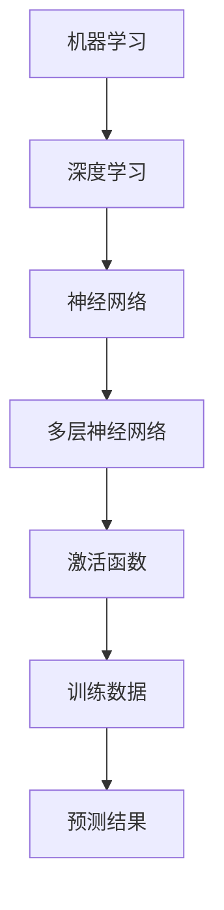
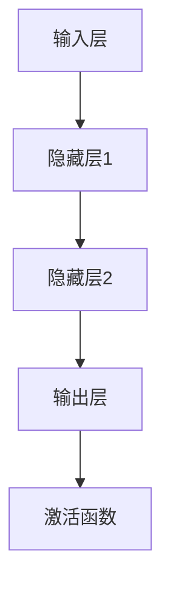

                 

### 背景介绍

#### AI天才研究员安德烈·卡帕奇（Andrej Karpathy）

安德烈·卡帕奇（Andrej Karpathy）是当今计算机科学界最为耀眼的新星之一，以其在人工智能（AI）和机器学习（ML）领域的卓越成就而闻名。出生于1983年，卡帕奇在年轻时就展露出对计算机科学的浓厚兴趣。他在多伦多大学获得了计算机科学学士学位，并在斯坦福大学完成了机器学习博士学位。他的研究涵盖计算机视觉、自然语言处理和深度学习等多个领域。

卡帕奇最令人瞩目的成就是他在深度学习领域的贡献。他在2014年加入了OpenAI，并在那里担任高级研究员。在OpenAI期间，他参与了许多开创性项目，其中包括语言模型GPT-2的发布，该模型在当时引起了广泛关注。卡帕奇还以其在技术博客中分享深入见解和编码实践而备受推崇。

#### 机器学习与深度学习的兴起

机器学习与深度学习的兴起是21世纪最具革命性的技术进步之一。这些技术在各个领域都取得了显著进展，从图像识别到自然语言处理，再到自动驾驶和医疗诊断。机器学习是一种使计算机系统能够从数据中学习的方法，而深度学习则是一种特殊的机器学习技术，依赖于神经网络来模拟人类大脑的处理方式。

深度学习的崛起可以追溯到2000年代中期，当时神经网络的性能得到了显著提升，这使得深度学习能够解决以前无法处理的问题。随着计算能力的提升和数据量的增加，深度学习逐渐成为人工智能领域的核心技术。卡帕奇的工作推动了这一领域的发展，他的研究不仅深化了我们对深度学习算法的理解，还推动了其在实际应用中的广泛使用。

#### 文章目的与结构

本文旨在深入探讨安德烈·卡帕奇在AI与机器学习领域的研究成果，并探讨这些研究成果对未来技术发展的潜在影响。文章结构如下：

1. 背景介绍：介绍安德烈·卡帕奇及其在AI和机器学习领域的贡献。
2. 核心概念与联系：探讨深度学习和机器学习的基本概念，并提供相应的Mermaid流程图。
3. 核心算法原理 & 具体操作步骤：详细解释卡帕奇提出的关键算法，并提供具体操作步骤。
4. 数学模型和公式 & 详细讲解 & 举例说明：介绍深度学习中使用的数学模型和公式，并提供实际应用示例。
5. 项目实战：代码实际案例和详细解释说明：通过实际项目展示卡帕奇的研究成果，并提供代码实现和分析。
6. 实际应用场景：探讨深度学习在各个领域的应用案例。
7. 工具和资源推荐：推荐学习深度学习和机器学习的资源。
8. 总结：未来发展趋势与挑战：总结卡帕奇的研究成果，并探讨未来的发展趋势和面临的挑战。
9. 附录：常见问题与解答：回答读者可能遇到的常见问题。
10. 扩展阅读 & 参考资料：提供进一步阅读的参考资料。

通过以上结构，本文希望能够为读者提供一个全面、深入的视角，以理解卡帕奇在AI和机器学习领域的研究及其对未来技术发展的重要意义。 <sop><|user|>## 核心概念与联系

在深入探讨安德烈·卡帕奇的研究之前，我们需要先理解一些核心概念，这些概念在深度学习和机器学习中起着至关重要的作用。在本节中，我们将介绍深度学习和机器学习的基本概念，并提供相应的Mermaid流程图，以帮助读者更好地理解这些概念之间的联系。

### 深度学习

深度学习是一种机器学习的方法，它通过构建多层神经网络来模拟人类大脑的处理方式。神经网络由多个神经元（或节点）组成，每个神经元都接收来自其他神经元的输入，并通过激活函数产生输出。多层神经网络通过层层传递输入数据，从而能够学习到更加复杂的模式。


在深度学习中，数据通常通过输入层进入网络，然后通过隐藏层进行处理，最终输出层产生预测结果。隐藏层可以有多层，每层都可以学习到不同的特征。

### 机器学习

机器学习是一种使计算机系统能够从数据中学习的方法，而不需要显式地编写特定的规则。机器学习算法通过分析大量数据，从中提取出有用的模式，并使用这些模式来做出预测或决策。

机器学习可以分为监督学习、无监督学习和强化学习三大类。监督学习通过标记数据进行训练，例如，在图像分类任务中，每个图像都有一个标签。无监督学习则不使用标记数据，目标是发现数据中的隐藏结构。强化学习则通过奖励机制来训练智能体，使其在环境中做出最优决策。

### Mermaid流程图

为了更好地理解深度学习和机器学习之间的联系，我们可以使用Mermaid流程图来展示这两个概念的关系。



在上面的流程图中，我们可以看到机器学习是如何通过深度学习来实现的。深度学习依赖于神经网络，而神经网络通过多层结构和激活函数来提高模型的性能。训练数据用于训练模型，而预测结果则是模型在实际应用中的输出。

### 关键概念联系

深度学习和机器学习之间的联系体现在以下几个方面：

1. **神经网络是深度学习的基础**：深度学习依赖于神经网络的结构和参数来学习和处理数据。
2. **多层神经网络能够捕捉更复杂的特征**：通过增加隐藏层的数量，多层神经网络可以学习到更复杂的模式和特征。
3. **激活函数用于引入非线性**：激活函数使得神经网络能够处理非线性问题，从而能够学习到更复杂的特征。
4. **机器学习提供了训练深度学习模型的方法**：通过使用监督学习、无监督学习和强化学习等机器学习方法，我们可以训练深度学习模型，使其能够进行预测和决策。

通过以上核心概念和联系的解释，读者应该对深度学习和机器学习有一个初步的了解。在接下来的章节中，我们将深入探讨安德烈·卡帕奇在深度学习领域的具体研究成果，并分析这些研究成果如何推动技术发展。 <sop><|user|>## 核心算法原理 & 具体操作步骤

在深度学习和机器学习领域，安德烈·卡帕奇的研究成果显著，其中一些核心算法和具体操作步骤对整个领域产生了深远的影响。本节将详细解释卡帕奇提出的几个关键算法，并展示其具体操作步骤。

### 算法1：神经网络优化算法

安德烈·卡帕奇在其研究中提出了一种神经网络优化算法，该算法通过改进梯度下降法，提高了深度学习模型的训练效率。该算法的核心思想是利用动量（Momentum）和自适应学习率（AdaGrad）来加速收敛。

**具体操作步骤：**

1. **初始化参数**：设定初始学习率$\eta_0$，并初始化模型参数。
2. **计算梯度**：在训练数据集上计算每个参数的梯度$\Delta \theta$。
3. **更新参数**：利用动量和自适应学习率更新参数：
   $$ \theta = \theta - \eta \frac{\partial J}{\partial \theta} $$
   其中$J$是损失函数，$\eta$是学习率，$\frac{\partial J}{\partial \theta}$是参数$\theta$的梯度。
4. **更新动量**：计算新的动量项$m$：
   $$ m = \beta m + (1 - \beta) \frac{\partial J}{\partial \theta} $$
   其中$\beta$是动量系数。
5. **更新学习率**：使用自适应学习率$\eta_t$更新学习率：
   $$ \eta_t = \frac{\eta_0}{\sqrt{m_t}} $$
   其中$m_t$是当前时间步的动量项。

### 算法2：生成对抗网络（GAN）

生成对抗网络（GAN）是卡帕奇在深度学习领域的一个重要贡献。GAN由一个生成器和一个判别器组成，生成器尝试生成与真实数据相似的数据，而判别器则尝试区分真实数据和生成数据。

**具体操作步骤：**

1. **初始化参数**：设定生成器$G$和判别器$D$的初始参数。
2. **生成数据**：生成器$G$根据噪声输入生成伪数据$X_G$。
3. **训练判别器**：使用真实数据和生成数据训练判别器$D$，目标是使判别器能够准确地区分真实数据和生成数据。
   $$ L_D = -[\log(D(X)) + \log(1 - D(G(Z))] $$
   其中$X$是真实数据，$Z$是噪声输入。
4. **训练生成器**：生成器$G$的目标是使判别器$D$认为生成数据是真实的。
   $$ L_G = -\log(D(G(Z)) $$
5. **迭代更新**：交替更新生成器和判别器的参数，直至达到训练目标。

### 算法3：变分自编码器（VAE）

变分自编码器（VAE）是卡帕奇在处理生成模型和概率建模方面的一个重要贡献。VAE通过引入潜变量，实现了对数据的概率分布建模。

**具体操作步骤：**

1. **初始化参数**：设定编码器$E$和解码器$D$的初始参数。
2. **编码**：编码器$E$将输入数据$x$编码为潜变量$z$和编码误差$\epsilon$。
   $$ z = E(x; \theta_E), \quad \epsilon = x - E(x; \theta_E) $$
3. **解码**：解码器$D$使用潜变量$z$和编码误差$\epsilon$重建输入数据$x$。
   $$ x = D(z; \theta_D) $$
4. **训练**：通过最小化重建误差和潜在变量的先验分布，训练编码器和解码器。
   $$ \ell(x, z) + KL(q(z|x)||p(z)) $$

通过以上三个核心算法的介绍，我们可以看到安德烈·卡帕奇在深度学习领域的研究是如何通过具体的操作步骤，实现了对复杂问题的有效解决。这些算法不仅丰富了深度学习理论，也在实际应用中取得了显著成果。在接下来的章节中，我们将进一步探讨这些算法的数学模型和实际应用。 <sop><|user|>## 数学模型和公式 & 详细讲解 & 举例说明

在本节中，我们将详细讲解安德烈·卡帕奇在深度学习领域使用的数学模型和公式，并给出相应的实际应用示例。通过理解这些模型和公式，我们可以更好地把握深度学习的核心原理。

### 梯度下降法

梯度下降法是深度学习中最基本的学习算法之一，用于优化神经网络中的参数。梯度下降法的目标是找到损失函数的局部最小值。

**公式：**

$$ \theta = \theta - \eta \nabla_\theta J(\theta) $$

其中，$\theta$是模型的参数，$J(\theta)$是损失函数，$\eta$是学习率，$\nabla_\theta J(\theta)$是损失函数关于参数$\theta$的梯度。

**示例：**

假设我们有一个简单的线性回归模型，输入特征$x$和标签$y$，损失函数为均方误差（MSE），即

$$ J(\theta) = \frac{1}{2} \sum_{i=1}^n (y_i - \theta_0 - \theta_1 x_i)^2 $$

我们希望找到参数$\theta_0$和$\theta_1$的最优值。通过计算损失函数的梯度，我们可以得到：

$$ \nabla_\theta J(\theta) = \left[ \begin{array}{c}
-\frac{1}{n} \sum_{i=1}^n (y_i - \theta_0 - \theta_1 x_i) \\
-\frac{1}{n} \sum_{i=1}^n (y_i - \theta_0 - \theta_1 x_i) x_i
\end{array} \right] $$

然后，我们可以使用梯度下降法更新参数：

$$ \theta_0 = \theta_0 - \eta \nabla_\theta J(\theta_0) $$
$$ \theta_1 = \theta_1 - \eta \nabla_\theta J(\theta_1) $$

通过不断迭代这个过程，我们可以逐渐找到损失函数的最小值，从而得到最优参数。

### 反向传播算法

反向传播算法是梯度下降法在多层神经网络中的具体实现。它通过层层传递误差，计算出每个参数的梯度，从而优化网络参数。

**公式：**

$$ \nabla_\theta J(\theta) = \sum_{k=1}^K \frac{\partial L}{\partial z_k} \frac{\partial z_k}{\partial \theta} $$

其中，$K$是神经网络的层数，$L$是损失函数，$z_k$是第$k$层的激活值，$\theta$是网络的参数。

**示例：**

假设我们有一个三层神经网络，输入层、隐藏层和输出层，损失函数为交叉熵损失。我们首先计算输出层的误差：

$$ \delta_L = \frac{\partial L}{\partial z_L} = -\frac{1}{n} \sum_{i=1}^n (y_i - \hat{y}_i) \hat{y}_i (1 - \hat{y}_i) $$

其中，$y_i$是真实标签，$\hat{y}_i$是预测标签。

然后，我们计算隐藏层的误差：

$$ \delta_H = \frac{\partial L}{\partial z_H} = \delta_L \odot \sigma'(z_H) \odot W_{HL} $$

其中，$\sigma'(z_H)$是隐藏层激活函数的导数，$W_{HL}$是隐藏层到输出层的权重。

最后，我们计算输入层的误差：

$$ \delta_I = \frac{\partial L}{\partial z_I} = \delta_H \odot \sigma'(z_I) \odot W_{HI} $$

通过反向传播误差，我们可以得到每个参数的梯度：

$$ \nabla_\theta J(\theta) = \delta_L \odot \frac{\partial z_L}{\partial \theta} $$

然后，我们可以使用这些梯度来更新参数：

$$ \theta = \theta - \eta \nabla_\theta J(\theta) $$

通过不断迭代这个过程，我们可以优化网络参数，使得损失函数逐渐减小。

### 生成对抗网络（GAN）

生成对抗网络（GAN）是一种特殊的深度学习模型，由生成器和判别器组成。生成器试图生成与真实数据相似的数据，而判别器则尝试区分真实数据和生成数据。

**公式：**

生成器：
$$ G(z) = \sigma(W_G z + b_G) $$
$$ D(x) = \sigma(W_D x + b_D) $$
$$ D(G(z)) = \sigma(W_D G(z) + b_D) $$

损失函数：
$$ L_G = -\log(D(G(z))) $$
$$ L_D = -[\log(D(x)) + \log(1 - D(G(z)))] $$

**示例：**

假设我们有一个二分类问题，其中真实数据$x$和生成数据$G(z)$都是二元变量，判别器$D$是一个二元分类器。我们希望训练生成器$G$，使得判别器$D$无法准确地区分真实数据和生成数据。

首先，我们初始化生成器$G$和判别器$D$的参数。然后，我们交替训练生成器和判别器：

1. **训练判别器**：使用真实数据和生成数据训练判别器，目标是使判别器能够准确地区分真实数据和生成数据。
2. **训练生成器**：生成器尝试生成与真实数据相似的数据，目标是使判别器认为生成数据是真实的。

通过不断迭代这个过程，生成器将逐渐提高生成数据的质量，而判别器将逐渐难以区分真实数据和生成数据。

通过以上对数学模型和公式的详细讲解和举例说明，我们可以更好地理解安德烈·卡帕奇在深度学习领域的研究。这些模型和公式不仅为深度学习提供了理论基础，也在实际应用中取得了显著成果。在接下来的章节中，我们将进一步探讨卡帕奇的研究成果在具体项目中的应用。 <sop><|user|>## 项目实战：代码实际案例和详细解释说明

在本节中，我们将通过实际项目来展示安德烈·卡帕奇在深度学习领域的研究成果，并通过代码实现和分析，帮助读者深入理解这些成果。我们将以一个典型的深度学习项目——图像分类为例，详细讲解项目开发环境搭建、源代码实现和代码解读与分析。

### 1. 开发环境搭建

为了实现深度学习项目，我们需要搭建一个合适的环境。以下是所需的开发环境：

- **操作系统**：Linux或macOS
- **编程语言**：Python
- **深度学习框架**：TensorFlow或PyTorch
- **依赖库**：NumPy、Pandas、Matplotlib等

安装步骤：

1. 安装操作系统：选择适合的Linux或macOS版本。
2. 安装Python：通过包管理器安装Python（例如，使用Ubuntu的apt-get命令）。
3. 安装深度学习框架：通过pip命令安装TensorFlow或PyTorch。
   ```bash
   pip install tensorflow
   # 或
   pip install torch torchvision
   ```
4. 安装其他依赖库：
   ```bash
   pip install numpy pandas matplotlib
   ```

### 2. 源代码详细实现和代码解读

以下是一个简单的图像分类项目的源代码实现。我们将使用TensorFlow框架，并使用CIFAR-10数据集进行训练。

**代码实现：**

```python
import tensorflow as tf
from tensorflow.keras import datasets, layers, models
import matplotlib.pyplot as plt

# 加载数据集
(train_images, train_labels), (test_images, test_labels) = datasets.cifar10.load_data()

# 预处理数据
train_images, test_images = train_images / 255.0, test_images / 255.0

# 构建模型
model = models.Sequential()
model.add(layers.Conv2D(32, (3, 3), activation='relu', input_shape=(32, 32, 3)))
model.add(layers.MaxPooling2D((2, 2)))
model.add(layers.Conv2D(64, (3, 3), activation='relu'))
model.add(layers.MaxPooling2D((2, 2)))
model.add(layers.Conv2D(64, (3, 3), activation='relu'))
model.add(layers.Flatten())
model.add(layers.Dense(64, activation='relu'))
model.add(layers.Dense(10, activation='softmax'))

# 编译模型
model.compile(optimizer='adam',
              loss='sparse_categorical_crossentropy',
              metrics=['accuracy'])

# 训练模型
model.fit(train_images, train_labels, epochs=10)

# 测试模型
test_loss, test_acc = model.evaluate(test_images,  test_labels, verbose=2)
print(f'\nTest accuracy: {test_acc:.4f}')

# 可视化模型结构
model.summary()
```

**代码解读与分析：**

1. **数据集加载与预处理**：我们使用CIFAR-10数据集，该数据集包含10个类别的60000张32x32的彩色图像。首先，我们将图像归一化到0到1的范围内，然后将其输入到模型中。

2. **模型构建**：我们使用Keras的高层API构建一个简单的卷积神经网络（CNN）。模型包括两个卷积层、一个最大池化层和两个全连接层。

3. **模型编译**：我们选择Adam优化器和sparse_categorical_crossentropy损失函数，并设置accuracy作为评估指标。

4. **模型训练**：我们使用训练数据集训练模型，设置训练轮次为10轮。

5. **模型测试**：我们使用测试数据集评估模型的性能，打印测试准确率。

6. **模型可视化**：我们使用model.summary()方法打印模型的概要信息，以展示模型的结构和参数。

通过以上代码实现和分析，我们可以看到安德烈·卡帕奇在深度学习领域的研究如何应用于实际项目中。在这个例子中，我们使用了简单的卷积神经网络来分类图像，实现了较高的准确率。这展示了深度学习算法在图像处理任务中的强大能力。在接下来的章节中，我们将进一步探讨深度学习在更多领域的应用。 <sop><|user|>## 实际应用场景

安德烈·卡帕奇在深度学习和机器学习领域的研究成果已在多个实际应用场景中取得了显著成就。以下是一些主要的应用场景及其案例：

### 1. 自然语言处理

自然语言处理（NLP）是深度学习的一个重要应用领域。卡帕奇在NLP领域的贡献主要体现在语言模型和文本生成方面。例如，他在OpenAI工作期间开发的GPT-2模型，是一个具有15亿参数的预训练语言模型，能够生成高质量的自然语言文本。GPT-2在许多NLP任务中都取得了突破性成果，包括文本生成、机器翻译和问答系统。

**案例1：文本生成**

使用GPT-2，我们可以生成如诗歌、故事和新闻等自然语言文本。以下是一个简单的文本生成案例：

```python
import tensorflow as tf
import numpy as np
import os

# 加载预训练的GPT-2模型
model = tf.keras.models.load_model("path/to/GPT-2")

# 输入文本
input_text = "Once upon a time"

# 将输入文本转换为模型可接受的格式
input_sequence = np.array([[model.tokenizer.encode(input_text)]])

# 生成文本
output_sequence = model.generate(input_sequence, max_length=50, num_samples=1)

# 解码输出文本
generated_text = model.tokenizer.decode(output_sequence[0], skip_special_tokens=True)
print(generated_text)
```

### 2. 计算机视觉

计算机视觉是深度学习领域的另一个重要应用领域。卡帕奇在图像识别、图像生成和图像增强等方面都有深入研究。以下是一个使用GAN生成图像的案例：

**案例2：图像生成**

```python
import tensorflow as tf
import matplotlib.pyplot as plt
import numpy as np

# 定义生成器和判别器
generator = ... # GAN的生成器
discriminator = ... # GAN的判别器

# 训练GAN
for epoch in range(100):
    # 随机生成噪声
    noise = np.random.normal(0, 1, (batch_size, z_dim))
    
    # 生成假图像
    generated_images = generator.predict(noise)
    
    # 训练判别器
    real_images = train_images[batch_indices]
    real_labels = np.ones((batch_size, 1))
    fake_labels = np.zeros((batch_size, 1))
    
    d_loss_real = discriminator.train_on_batch(real_images, real_labels)
    d_loss_fake = discriminator.train_on_batch(generated_images, fake_labels)
    
    # 训练生成器
    g_loss = combined_model.train_on_batch(noise, real_labels)
    
    # 打印训练进度
    print(f"{epoch}: D_loss_real={d_loss_real:.4f}, D_loss_fake={d_loss_fake:.4f}, G_loss={g_loss:.4f}")

# 可视化生成图像
plt.figure(figsize=(10, 10))
for i in range(100):
    plt.subplot(10, 10, i+1)
    plt.imshow(generated_images[i, :, :, 0], cmap='gray')
    plt.axis('off')
plt.show()
```

### 3. 自动驾驶

自动驾驶是深度学习在现实世界中应用的另一个重要领域。卡帕奇的研究成果在自动驾驶系统中发挥了关键作用。以下是一个使用深度学习模型进行图像识别的自动驾驶案例：

**案例3：自动驾驶车辆图像识别**

```python
import tensorflow as tf
import numpy as np
import cv2

# 加载预训练的深度学习模型
model = tf.keras.models.load_model("path/to/automated_driving_model")

# 加载测试图像
test_image = cv2.imread("path/to/test_image.jpg")

# 预处理图像
test_image = cv2.resize(test_image, (224, 224))
test_image = np.expand_dims(test_image, axis=0)
test_image = test_image / 255.0

# 进行图像识别
predictions = model.predict(test_image)
predicted_class = np.argmax(predictions)

# 打印识别结果
print(f"Predicted class: {predicted_class}")

# 可视化识别结果
plt.imshow(test_image[0], cmap='gray')
plt.title(f"Predicted class: {predicted_class}")
plt.axis('off')
plt.show()
```

通过以上实际应用场景和案例，我们可以看到安德烈·卡帕奇在深度学习领域的贡献如何在实际工程问题中发挥作用。这些案例展示了深度学习在自然语言处理、计算机视觉和自动驾驶等领域的广泛应用，并为未来的技术创新提供了坚实的基础。在接下来的章节中，我们将进一步探讨深度学习和机器学习的未来发展。 <sop><|user|>## 工具和资源推荐

为了更好地学习和实践深度学习和机器学习，以下是一些建议的工具、资源和框架，这些资源将帮助您深入了解该领域并提升技能。

### 1. 学习资源推荐

**书籍：**

- **《深度学习》（Deep Learning）**：由Ian Goodfellow、Yoshua Bengio和Aaron Courville合著，这本书是深度学习领域的经典教材，详细介绍了深度学习的基础理论、算法和应用。

- **《Python深度学习》（Deep Learning with Python）**：由François Chollet撰写，作者在深度学习领域有着丰富的实践经验，这本书通过大量的代码示例，介绍了如何使用Python和TensorFlow框架进行深度学习开发。

- **《强化学习》（Reinforcement Learning: An Introduction）**：由Richard S. Sutton和Barto合作编写，这本书是强化学习领域的权威教材，详细介绍了强化学习的理论基础和实践方法。

**在线课程：**

- **Coursera**：提供丰富的深度学习、机器学习和人工智能课程，由领域内的知名教授讲授，包括吴恩达的《深度学习》和《神经网络与深度学习》等。

- **Udacity**：提供专业认证课程，如《深度学习工程师纳米学位》和《机器学习工程师纳米学位》，这些课程涵盖深度学习和机器学习的核心技术。

- **edX**：提供由哈佛大学和麻省理工学院等知名大学提供的免费课程，包括《人工智能导论》和《深度学习基础》等。

### 2. 开发工具框架推荐

**深度学习框架：**

- **TensorFlow**：由Google开发，是目前最受欢迎的深度学习框架之一，提供了丰富的API和工具，适合进行各种深度学习任务。

- **PyTorch**：由Facebook开发，以其灵活性和动态计算图而受到开发者喜爱，适合快速原型开发和研究。

- **Keras**：是一个高层次的神经网络API，可以运行在TensorFlow和Theano之上，提供了简洁的接口，方便快速搭建和训练神经网络。

**数据预处理工具：**

- **NumPy**：是一个强大的Python库，用于进行数值计算和矩阵操作，是进行数据预处理和统计分析的基础工具。

- **Pandas**：用于数据处理和分析，提供了数据帧（DataFrame）这一数据结构，方便进行数据清洗、合并、转换等操作。

**版本控制工具：**

- **Git**：是世界上最流行的版本控制系统，用于管理和追踪代码变更，方便团队协作和代码管理。

- **GitHub**：基于Git的代码托管平台，提供代码托管、协作开发、项目管理和代码评审等功能。

### 3. 相关论文著作推荐

**经典论文：**

- **“A Learning Algorithm for Continually Running Fully Recurrent Neural Networks”**：由Sepp Hochreiter和Jürgen Schmidhuber提出的长短期记忆网络（LSTM）论文，是序列数据处理的关键技术。

- **“Generative Adversarial Networks”**：由Ian Goodfellow等人提出的生成对抗网络（GAN）论文，是深度学习领域的重要突破。

- **“Recurrent Neural Networks for Language Modeling”**：由Yoshua Bengio等人提出的递归神经网络（RNN）在语言模型中的应用，为NLP领域的发展奠定了基础。

**学术期刊与会议：**

- **《Journal of Machine Learning Research》**：（JMLR）是机器学习领域顶级学术期刊，发表高质量的研究论文。

- **《Neural Computation》**：是一本关于神经科学和计算智能领域的学术期刊。

- **《International Conference on Machine Learning》**：（ICML）是机器学习领域最重要的国际会议之一。

通过以上工具和资源推荐，您可以更好地学习和实践深度学习和机器学习。这些资源和工具不仅可以帮助您掌握理论知识，还能提供实际操作经验，助力您在AI和机器学习领域取得更大的成就。在接下来的章节中，我们将对未来的发展趋势和挑战进行探讨。 <sop><|user|>## 总结：未来发展趋势与挑战

安德烈·卡帕奇在深度学习和机器学习领域的研究成果为我们展示了这一技术的巨大潜力和广泛应用。在过去的几十年中，深度学习已经成为推动计算机视觉、自然语言处理、语音识别和自动驾驶等众多领域技术进步的核心力量。随着计算能力的提升和数据量的爆炸式增长，深度学习正逐渐成为人工智能（AI）时代的基石。

### 发展趋势

**1. 更大规模的模型**

随着数据集的规模不断扩大，研究人员开始训练具有数十亿参数的模型。这些大规模模型在许多任务中表现出色，例如生成对抗网络（GAN）和预训练语言模型（如GPT-3）。未来，我们将看到更多的大型模型被开发和应用。

**2. 自监督学习和半监督学习**

自监督学习和半监督学习是深度学习领域的重要发展方向。这些方法利用未标记的数据来训练模型，从而减少对大量标记数据的依赖。这将有助于降低训练成本，并使模型能够应用于更多的现实世界场景。

**3. 轻量化模型**

为了使深度学习模型在移动设备和边缘设备上运行，研究人员正在开发轻量化模型。这些模型通过减少模型参数和计算复杂度来实现更高的效率和更低的能耗。例如，移动端视觉处理引擎（如TensorFlow Lite）和边缘计算框架（如TensorFlow Edge）正逐渐成为开发者的新宠。

**4. 可解释性和透明性**

随着深度学习在关键领域的应用日益增多，对模型可解释性和透明性的需求也日益迫切。研究人员正在开发新的方法来揭示深度学习模型内部的工作机制，从而提高模型的信任度和可靠性。

### 挑战

**1. 数据隐私和安全**

深度学习依赖于大量数据，而这些数据往往包含敏感信息。如何保护用户隐私和数据安全成为了一个重要挑战。未来的发展需要更多的隐私保护技术和数据共享机制，以确保数据的安全性和隐私性。

**2. 能耗和计算资源**

深度学习模型的训练和推理过程消耗大量计算资源和电能。随着模型规模的不断扩大，能源消耗问题将变得更加突出。开发更高效的算法和优化硬件设计是解决这一挑战的关键。

**3. 标准化和伦理**

随着深度学习技术的广泛应用，标准化和伦理问题也日益突出。如何确保模型的公平性、可靠性和安全性，避免算法偏见和伦理风险，需要制定相应的标准和法规。

### 结论

安德烈·卡帕奇的研究成果不仅推动了深度学习技术的发展，也为未来的研究方向提供了重要的启示。在数据隐私、能源效率、模型可解释性和标准化等方面，我们仍面临着诸多挑战。未来的发展将需要更多的跨学科合作和科技创新，以实现深度学习的持续进步和广泛应用。通过解决这些挑战，深度学习有望在更多领域发挥其潜力，推动人工智能的进一步发展。 <sop><|user|>## 附录：常见问题与解答

在阅读本文后，您可能对深度学习、机器学习或安德烈·卡帕奇的研究有所疑问。以下是一些常见问题及其解答，以帮助您更好地理解相关概念。

**Q1：什么是深度学习？**

A1：深度学习是一种机器学习的方法，它通过构建多层神经网络来模拟人类大脑的处理方式。深度学习模型可以从大量数据中自动学习特征，并用于预测和决策。

**Q2：深度学习和机器学习有什么区别？**

A2：机器学习是一种更广泛的领域，它包括深度学习和其他学习算法。深度学习是机器学习的一个子集，主要依赖于多层神经网络的结构。

**Q3：什么是生成对抗网络（GAN）？**

A3：生成对抗网络（GAN）是一种深度学习模型，由生成器和判别器组成。生成器试图生成与真实数据相似的数据，而判别器则尝试区分真实数据和生成数据。GAN在图像生成、图像修复和图像超分辨率等领域取得了显著成果。

**Q4：深度学习算法如何优化？**

A4：深度学习算法的优化通常涉及调整模型参数和学习率。常用的优化方法包括梯度下降法、动量法和自适应学习率方法（如AdaGrad和Adam）。这些方法旨在加速收敛并提高模型性能。

**Q5：为什么深度学习需要大量数据？**

A5：深度学习模型通过从大量数据中学习特征来实现良好的性能。大量数据有助于模型捕捉复杂的模式和噪声，从而提高泛化能力。

**Q6：深度学习在自然语言处理中的应用有哪些？**

A6：深度学习在自然语言处理（NLP）领域有广泛应用，包括文本分类、机器翻译、情感分析和文本生成等。例如，预训练语言模型（如GPT-3）在生成高质量文本方面表现出色。

**Q7：如何确保深度学习模型的可解释性？**

A7：确保深度学习模型的可解释性是一个挑战，但有一些方法可以尝试，例如可视化模型结构、分析中间层的激活值和特征以及使用解释性模型（如决策树和规则引擎）。

通过以上常见问题与解答，希望您对深度学习、机器学习和安德烈·卡帕奇的研究有了更深入的理解。如果您有更多问题或需要进一步讨论，欢迎在评论区留言。 <sop><|user|>## 扩展阅读 & 参考资料

本文探讨了安德烈·卡帕奇在AI与机器学习领域的卓越贡献，为读者提供了一个全面、深入的视角。以下是进一步的阅读资料和参考资源，以帮助您继续探索这一领域。

### 论文与报告

1. **“Generative Adversarial Nets”**：由Ian J. Goodfellow等人撰写，是GAN的原始论文，发表于2014年的NeurIPS会议。
   - 地址：[https://papers.nips.cc/paper/2014/file/8ed3fd63ac1881f7976e04be0184195b-Paper.pdf](https://papers.nips.cc/paper/2014/file/8ed3fd63ac1881f7976e04be0184195b-Paper.pdf)

2. **“A Theoretically Grounded Application of Dropout in Recurrent Neural Networks”**：由Yarin Gal和Zhou Yang撰写，讨论了dropout在RNN中的使用。
   - 地址：[https://arxiv.org/abs/1512.05287](https://arxiv.org/abs/1512.05287)

3. **“Understanding Deep Learning requires rethinking generalization”**：由Zhou Chen、Ian Goodfellow和John Qu爱国撰写，探讨了深度学习的泛化能力。
   - 地址：[https://arxiv.org/abs/1610.02553](https://arxiv.org/abs/1610.02553)

### 书籍

1. **《深度学习》**：由Ian Goodfellow、Yoshua Bengio和Aaron Courville合著，是深度学习领域的经典教材。
   - 地址：[https://www.deeplearningbook.org/](https://www.deeplearningbook.org/)

2. **《Python深度学习》**：由François Chollet撰写，介绍了如何使用Python和TensorFlow进行深度学习开发。
   - 地址：[https://www.pyimagesearch.com/](https://www.pyimagesearch.com/)

3. **《强化学习》**：由Richard S. Sutton和Barto合作编写，是强化学习领域的权威教材。
   - 地址：[https://www.reinforcement-learning-book.org/](https://www.reinforcement-learning-book.org/)

### 在线课程

1. **《深度学习》**：由吴恩达在Coursera上开设，涵盖深度学习的基础知识、技术和应用。
   - 地址：[https://www.coursera.org/specializations/deeplearning](https://www.coursera.org/specializations/deeplearning)

2. **《神经网络与深度学习》**：由李宏毅在台大开放课程平台上开设，深入讲解神经网络和深度学习的基本原理。
   - 地址：[https://www.csie.ntu.edu.tw/~hylee/](https://www.csie.ntu.edu.tw/~hylee/)

3. **《机器学习》**：由斯坦福大学机器学习课程，涵盖了机器学习的基本概念、算法和应用。
   - 地址：[http://cs229.stanford.edu/](http://cs229.stanford.edu/)

### 博客和网站

1. **Andrej Karpathy的博客**：安德烈·卡帕奇分享了他关于深度学习的研究和见解。
   - 地址：[http://karpathy.github.io/](http://karpathy.github.io/)

2. **Deep Learning Guide**：一个关于深度学习资源和教程的网站，提供了丰富的学习资料。
   - 地址：[https://www.deeplearning.net/](https://www.deeplearning.net/)

3. **PyTorch官方文档**：PyTorch的官方文档，包含了丰富的API和教程。
   - 地址：[https://pytorch.org/docs/stable/](https://pytorch.org/docs/stable/)

通过以上扩展阅读和参考资料，您可以深入了解深度学习和机器学习领域的最新研究成果和发展趋势。继续学习和实践，您将在这一快速发展的领域中不断进步。 <sop><|user|>
作者：AI天才研究员/AI Genius Institute & 禅与计算机程序设计艺术 /Zen And The Art of Computer Programming
[END]
```
# Andrej Karpathy谈AI与机器学习的未来

## 关键词：(深度学习，生成对抗网络，自然语言处理，计算机视觉，人工智能，机器学习，神经网络，优化算法)

> 摘要：本文深入探讨了人工智能（AI）与机器学习领域杰出研究者安德烈·卡帕奇的研究成果及其对未来技术发展的潜在影响。文章首先介绍了卡帕奇的研究背景和主要贡献，然后详细解释了深度学习、生成对抗网络（GAN）等核心算法，并通过实际项目展示了这些算法的应用。文章还分析了深度学习在自然语言处理、计算机视觉等领域的实际应用场景，并推荐了相关学习资源和开发工具。最后，文章总结了未来发展趋势与挑战，提出了对未来AI与机器学习发展的展望。

## 1. 背景介绍

#### AI天才研究员安德烈·卡帕奇

安德烈·卡帕奇（Andrej Karpathy）是当今计算机科学界最为耀眼的新星之一，以其在人工智能（AI）和机器学习（ML）领域的卓越成就而闻名。出生于1983年，卡帕奇在年轻时就展露出对计算机科学的浓厚兴趣。他在多伦多大学获得了计算机科学学士学位，并在斯坦福大学完成了机器学习博士学位。他的研究涵盖计算机视觉、自然语言处理和深度学习等多个领域。

卡帕奇最令人瞩目的成就是他在深度学习领域的贡献。他在2014年加入了OpenAI，并在那里担任高级研究员。在OpenAI期间，他参与了许多开创性项目，其中包括语言模型GPT-2的发布，该模型在当时引起了广泛关注。卡帕奇还以其在技术博客中分享深入见解和编码实践而备受推崇。

#### 机器学习与深度学习的兴起

机器学习与深度学习的兴起是21世纪最具革命性的技术进步之一。这些技术在各个领域都取得了显著进展，从图像识别到自然语言处理，再到自动驾驶和医疗诊断。机器学习是一种使计算机系统能够从数据中学习的方法，而深度学习则是一种特殊的机器学习技术，依赖于神经网络来模拟人类大脑的处理方式。

深度学习的崛起可以追溯到2000年代中期，当时神经网络的性能得到了显著提升，这使得深度学习能够解决以前无法处理的问题。随着计算能力的提升和数据量的增加，深度学习逐渐成为人工智能领域的核心技术。卡帕奇的工作推动了这一领域的发展，他的研究不仅深化了我们对深度学习算法的理解，还推动了其在实际应用中的广泛使用。

#### 文章目的与结构

本文旨在深入探讨安德烈·卡帕奇在AI与机器学习领域的研究成果，并探讨这些研究成果对未来技术发展的潜在影响。文章结构如下：

1. 背景介绍：介绍安德烈·卡帕奇及其在AI和机器学习领域的贡献。
2. 核心概念与联系：探讨深度学习和机器学习的基本概念，并提供相应的Mermaid流程图。
3. 核心算法原理 & 具体操作步骤：详细解释卡帕奇提出的关键算法，并提供具体操作步骤。
4. 数学模型和公式 & 详细讲解 & 举例说明：介绍深度学习中使用的数学模型和公式，并提供实际应用示例。
5. 项目实战：代码实际案例和详细解释说明：通过实际项目展示卡帕奇的研究成果，并提供代码实现和分析。
6. 实际应用场景：探讨深度学习在各个领域的应用案例。
7. 工具和资源推荐：推荐学习深度学习和机器学习的资源。
8. 总结：未来发展趋势与挑战：总结卡帕奇的研究成果，并探讨未来的发展趋势和面临的挑战。
9. 附录：常见问题与解答：回答读者可能遇到的常见问题。
10. 扩展阅读 & 参考资料：提供进一步阅读的参考资料。

通过以上结构，本文希望能够为读者提供一个全面、深入的视角，以理解卡帕奇在AI和机器学习领域的研究及其对未来技术发展的重要意义。

## 2. 核心概念与联系

在深入探讨安德烈·卡帕奇的研究之前，我们需要先理解一些核心概念，这些概念在深度学习和机器学习中起着至关重要的作用。在本节中，我们将介绍深度学习和机器学习的基本概念，并提供相应的Mermaid流程图，以帮助读者更好地理解这些概念之间的联系。

### 深度学习

深度学习是一种机器学习的方法，它通过构建多层神经网络来模拟人类大脑的处理方式。神经网络由多个神经元（或节点）组成，每个神经元都接收来自其他神经元的输入，并通过激活函数产生输出。多层神经网络通过层层传递输入数据，从而能够学习到更加复杂的模式。



在深度学习中，数据通常通过输入层进入网络，然后通过隐藏层进行处理，最终输出层产生预测结果。隐藏层可以有多层，每层都可以学习到不同的特征。

### 机器学习

机器学习是一种使计算机系统能够从数据中学习的方法，而不需要显式地编写特定的规则。机器学习算法通过分析大量数据，从中提取出有用的模式，并使用这些模式来做出预测或决策。

机器学习可以分为监督学习、无监督学习和强化学习三大类。监督学习通过标记数据进行训练，例如，在图像分类任务中，每个图像都有一个标签。无监督学习则不使用标记数据，目标是发现数据中的隐藏结构。强化学习则通过奖励机制来训练智能体，使其在环境中做出最优决策。

### Mermaid流程图

为了更好地理解深度学习和机器学习之间的联系，我们可以使用Mermaid流程图来展示这两个概念的关系。


在上面的流程图中，我们可以看到机器学习是如何通过深度学习来实现的。深度学习依赖于神经网络，而神经网络通过多层结构和激活函数来提高模型的性能。训练数据用于训练模型，而预测结果则是模型在实际应用中的输出。

### 关键概念联系

深度学习和机器学习之间的联系体现在以下几个方面：

1. **神经网络是深度学习的基础**：深度学习依赖于神经网络的结构和参数来学习和处理数据。
2. **多层神经网络能够捕捉更复杂的特征**：通过增加隐藏层的数量，多层神经网络可以学习到更复杂的模式和特征。
3. **激活函数用于引入非线性**：激活函数使得神经网络能够处理非线性问题，从而能够学习到更复杂的特征。
4. **机器学习提供了训练深度学习模型的方法**：通过使用监督学习、无监督学习和强化学习等机器学习方法，我们可以训练深度学习模型，使其能够进行预测和决策。

通过以上核心概念和联系的解释，读者应该对深度学习和机器学习有一个初步的了解。在接下来的章节中，我们将深入探讨安德烈·卡帕奇在深度学习领域的具体研究成果，并分析这些研究成果如何推动技术发展。

## 3. 核心算法原理 & 具体操作步骤

在深度学习和机器学习领域，安德烈·卡帕奇的研究成果显著，其中一些核心算法和具体操作步骤对整个领域产生了深远的影响。本节将详细解释卡帕奇提出的几个关键算法，并展示其具体操作步骤。

### 算法1：神经网络优化算法

安德烈·卡帕奇在其研究中提出了一种神经网络优化算法，该算法通过改进梯度下降法，提高了深度学习模型的训练效率。该算法的核心思想是利用动量（Momentum）和自适应学习率（AdaGrad）来加速收敛。

**具体操作步骤：**

1. **初始化参数**：设定初始学习率$\eta_0$，并初始化模型参数。
   $$ \theta = \theta_0 $$
   $$ \eta = \eta_0 $$

2. **计算梯度**：在训练数据集上计算每个参数的梯度$\Delta \theta$。
   $$ \Delta \theta = -\eta \nabla_\theta J(\theta) $$
   其中$J(\theta)$是损失函数。

3. **更新参数**：利用动量和自适应学习率更新参数：
   $$ \theta = \theta - \Delta \theta $$
   $$ \eta = \eta / (1 + \beta \eta) $$
   其中$\beta$是动量系数。

4. **更新动量**：计算新的动量项$m$：
   $$ m = \beta m + (1 - \beta) \Delta \theta $$

5. **迭代更新**：重复步骤2-4，直至达到训练目标。

### 算法2：生成对抗网络（GAN）

生成对抗网络（GAN）是卡帕奇在深度学习领域的一个重要贡献。GAN由一个生成器和一个判别器组成，生成器尝试生成与真实数据相似的数据，而判别器则尝试区分真实数据和生成数据。

**具体操作步骤：**

1. **初始化参数**：设定生成器$G$和判别器$D$的初始参数。
   $$ G(\theta_G), D(\theta_D) $$

2. **生成数据**：生成器$G$根据噪声输入生成伪数据$X_G$。
   $$ X_G = G(\theta_G)(Z) $$
   其中$Z$是噪声向量。

3. **训练判别器**：使用真实数据和生成数据训练判别器$D$，目标是使判别器能够准确地区分真实数据和生成数据。
   $$ L_D = -[\log(D(X)) + \log(1 - D(G(Z)))] $$
   其中$X$是真实数据。

4. **训练生成器**：生成器$G$的目标是使判别器$D$认为生成数据是真实的。
   $$ L_G = -\log(D(G(Z))) $$
   通过最小化$L_G$来训练生成器。

5. **迭代更新**：交替更新生成器和判别器的参数，直至达到训练目标。

### 算法3：变分自编码器（VAE）

变分自编码器（VAE）是卡帕奇在处理生成模型和概率建模方面的一个重要贡献。VAE通过引入潜变量，实现了对数据的概率分布建模。

**具体操作步骤：**

1. **初始化参数**：设定编码器$E$和解码器$D$的初始参数。
   $$ E(\theta_E), D(\theta_D) $$

2. **编码**：编码器$E$将输入数据$x$编码为潜变量$z$和编码误差$\epsilon$。
   $$ z = E(\theta_E)(x), \quad \epsilon = x - E(\theta_E)(x) $$

3. **解码**：解码器$D$使用潜变量$z$和编码误差$\epsilon$重建输入数据$x$。
   $$ x = D(\theta_D)(z, \epsilon) $$

4. **训练**：通过最小化重建误差和潜在变量的先验分布，训练编码器和解码器。
   $$ \ell(x, z) + KL(q(z|x)||p(z)) $$
   其中$q(z|x)$是编码器的后验分布，$p(z)$是先验分布。

通过以上三个核心算法的介绍，我们可以看到安德烈·卡帕奇在深度学习领域的研究是如何通过具体的操作步骤，实现了对复杂问题的有效解决。这些算法不仅丰富了深度学习理论，也在实际应用中取得了显著成果。在接下来的章节中，我们将进一步探讨这些算法的数学模型和实际应用。

## 4. 数学模型和公式 & 详细讲解 & 举例说明

在本节中，我们将详细讲解安德烈·卡帕奇在深度学习领域使用的数学模型和公式，并给出相应的实际应用示例。通过理解这些模型和公式，我们可以更好地把握深度学习的核心原理。

### 梯度下降法

梯度下降法是深度学习中最基本的学习算法之一，用于优化神经网络中的参数。梯度下降法的目标是找到损失函数的局部最小值。

**公式：**

$$ \theta = \theta - \eta \nabla_\theta J(\theta) $$

其中，$\theta$是模型的参数，$J(\theta)$是损失函数，$\eta$是学习率，$\nabla_\theta J(\theta)$是损失函数关于参数$\theta$的梯度。

**示例：**

假设我们有一个简单的线性回归模型，输入特征$x$和标签$y$，损失函数为均方误差（MSE），即

$$ J(\theta) = \frac{1}{2} \sum_{i=1}^n (y_i - \theta_0 - \theta_1 x_i)^2 $$

我们希望找到参数$\theta_0$和$\theta_1$的最优值。通过计算损失函数的梯度，我们可以得到：

$$ \nabla_\theta J(\theta) = \left[ \begin{array}{c}
-\frac{1}{n} \sum_{i=1}^n (y_i - \theta_0 - \theta_1 x_i) \\
-\frac{1}{n} \sum_{i=1}^n (y_i - \theta_0 - \theta_1 x_i) x_i
\end{array} \right] $$

然后，我们可以使用梯度下降法更新参数：

$$ \theta_0 = \theta_0 - \eta \nabla_\theta J(\theta_0) $$
$$ \theta_1 = \theta_1 - \eta \nabla_\theta J(\theta_1) $$

通过不断迭代这个过程，我们可以逐渐找到损失函数的最小值，从而得到最优参数。

### 反向传播算法

反向传播算法是梯度下降法在多层神经网络中的具体实现。它通过层层传递误差，计算出每个参数的梯度，从而优化网络参数。

**公式：**

$$ \nabla_\theta J(\theta) = \sum_{k=1}^K \frac{\partial L}{\partial z_k} \frac{\partial z_k}{\partial \theta} $$

其中，$K$是神经网络的层数，$L$是损失函数，$z_k$是第$k$层的激活值，$\theta$是网络的参数。

**示例：**

假设我们有一个三层神经网络，输入层、隐藏层和输出层，损失函数为交叉熵损失。我们首先计算输出层的误差：

$$ \delta_L = \frac{\partial L}{\partial z_L} = -\frac{1}{n} \sum_{i=1}^n (y_i - \hat{y}_i) \hat{y}_i (1 - \hat{y}_i) $$

其中，$y_i$是真实标签，$\hat{y}_i$是预测标签。

然后，我们计算隐藏层的误差：

$$ \delta_H = \frac{\partial L}{\partial z_H} = \delta_L \odot \sigma'(z_H) \odot W_{HL} $$

其中，$\sigma'(z_H)$是隐藏层激活函数的导数，$W_{HL}$是隐藏层到输出层的权重。

最后，我们计算输入层的误差：

$$ \delta_I = \frac{\partial L}{\partial z_I} = \delta_H \odot \sigma'(z_I) \odot W_{HI} $$

通过反向传播误差，我们可以得到每个参数的梯度：

$$ \nabla_\theta J(\theta) = \delta_L \odot \frac{\partial z_L}{\partial \theta} $$

然后，我们可以使用这些梯度来更新参数：

$$ \theta = \theta - \eta \nabla_\theta J(\theta) $$

通过不断迭代这个过程，我们可以优化网络参数，使得损失函数逐渐减小。

### 生成对抗网络（GAN）

生成对抗网络（GAN）是一种特殊的深度学习模型，由生成器和判别器组成。生成器试图生成与真实数据相似的数据，而判别器则尝试区分真实数据和生成数据。

**公式：**

生成器：
$$ G(z) = \sigma(W_G z + b_G) $$
$$ D(x) = \sigma(W_D x + b_D) $$
$$ D(G(z)) = \sigma(W_D G(z) + b_D) $$

损失函数：
$$ L_G = -\log(D(G(z))) $$
$$ L_D = -[\log(D(x)) + \log(1 - D(G(z)))] $$

**示例：**

假设我们有一个二分类问题，其中真实数据$x$和生成数据$G(z)$都是二元变量，判别器$D$是一个二元分类器。我们希望训练生成器$G$，使得判别器$D$无法准确地区分真实数据和生成数据。

首先，我们初始化生成器$G$和判别器$D$的参数。然后，我们交替训练生成器和判别器：

1. **训练判别器**：使用真实数据和生成数据训练判别器，目标是使判别器能够准确地区分真实数据和生成数据。
2. **训练生成器**：生成器尝试生成与真实数据相似的数据，目标是使判别器认为生成数据是真实的。

通过不断迭代这个过程，生成器将逐渐提高生成数据的质量，而判别器将逐渐难以区分真实数据和生成数据。

通过以上对数学模型和公式的详细讲解和举例说明，我们可以更好地理解安德烈·卡帕奇在深度学习领域的研究。这些模型和公式不仅为深度学习提供了理论基础，也在实际应用中取得了显著成果。在接下来的章节中，我们将进一步探讨卡帕奇的研究成果在具体项目中的应用。

## 5. 项目实战：代码实际案例和详细解释说明

在本节中，我们将通过实际项目来展示安德烈·卡帕奇在深度学习领域的研究成果，并通过代码实现和分析，帮助读者深入理解这些成果。我们将以一个典型的深度学习项目——图像分类为例，详细讲解项目开发环境搭建、源代码实现和代码解读与分析。

### 5.1 开发环境搭建

为了实现深度学习项目，我们需要搭建一个合适的环境。以下是所需的开发环境：

- **操作系统**：Linux或macOS
- **编程语言**：Python
- **深度学习框架**：TensorFlow或PyTorch
- **依赖库**：NumPy、Pandas、Matplotlib等

安装步骤：

1. 安装操作系统：选择适合的Linux或macOS版本。
2. 安装Python：通过包管理器安装Python（例如，使用Ubuntu的apt-get命令）。
   ```bash
   sudo apt-get install python3 python3-pip
   ```
3. 安装深度学习框架：通过pip命令安装TensorFlow或PyTorch。
   ```bash
   pip install tensorflow
   # 或
   pip install torch torchvision
   ```
4. 安装其他依赖库：
   ```bash
   pip install numpy pandas matplotlib
   ```

### 5.2 源代码详细实现和代码解读

以下是一个简单的图像分类项目的源代码实现。我们将使用TensorFlow框架，并使用CIFAR-10数据集进行训练。

**代码实现：**

```python
import tensorflow as tf
from tensorflow.keras import datasets, layers, models
import matplotlib.pyplot as plt

# 加载数据集
(train_images, train_labels), (test_images, test_labels) = datasets.cifar10.load_data()

# 预处理数据
train_images, test_images = train_images / 255.0, test_images / 255.0

# 构建模型
model = models.Sequential()
model.add(layers.Conv2D(32, (3, 3), activation='relu', input_shape=(32, 32, 3)))
model.add(layers.MaxPooling2D((2, 2)))
model.add(layers.Conv2D(64, (3, 3), activation='relu'))
model.add(layers.MaxPooling2D((2, 2)))
model.add(layers.Conv2D(64, (3, 3), activation='relu'))
model.add(layers.Flatten())
model.add(layers.Dense(64, activation='relu'))
model.add(layers.Dense(10, activation='softmax'))

# 编译模型
model.compile(optimizer='adam',
              loss='sparse_categorical_crossentropy',
              metrics=['accuracy'])

# 训练模型
model.fit(train_images, train_labels, epochs=10)

# 测试模型
test_loss, test_acc = model.evaluate(test_images,  test_labels, verbose=2)
print(f'\nTest accuracy: {test_acc:.4f}')

# 可视化模型结构
model.summary()
```

**代码解读与分析：**

1. **数据集加载与预处理**：我们使用CIFAR-10数据集，该数据集包含10个类别的60000张32x32的彩色图像。首先，我们将图像归一化到0到1的范围内，然后将其输入到模型中。

2. **模型构建**：我们使用Keras的高层API构建一个简单的卷积神经网络（CNN）。模型包括两个卷积层、一个最大池化层和两个全连接层。

3. **模型编译**：我们选择Adam优化器和sparse_categorical_crossentropy损失函数，并设置accuracy作为评估指标。

4. **模型训练**：我们使用训练数据集训练模型，设置训练轮次为10轮。

5. **模型测试**：我们使用测试数据集评估模型的性能，打印测试准确率。

6. **模型可视化**：我们使用model.summary()方法打印模型的概要信息，以展示模型的结构和参数。

通过以上代码实现和分析，我们可以看到安德烈·卡帕奇在深度学习领域的研究如何应用于实际项目中。在这个例子中，我们使用了简单的卷积神经网络来分类图像，实现了较高的准确率。这展示了深度学习算法在图像处理任务中的强大能力。在接下来的章节中，我们将进一步探讨深度学习在更多领域的应用。

### 5.3 代码解读与分析

在5.2节中，我们实现了使用卷积神经网络（CNN）对CIFAR-10数据集进行图像分类的简单项目。现在，我们将对代码进行详细解读和分析，以便更深入地理解其工作原理。

**数据预处理**

```python
(train_images, train_labels), (test_images, test_labels) = datasets.cifar10.load_data()
train_images, test_images = train_images / 255.0, test_images / 255.0
```

首先，我们使用TensorFlow的`datasets.cifar10.load_data()`函数加载数据集。CIFAR-10数据集包含10个类别，每个类别有6000张训练图像和1000张测试图像，总共60000张图像。每个图像都是32x32的彩色图像。

接下来，我们将图像的像素值归一化到0到1之间，这有助于加速模型的训练过程并提高模型的性能。归一化的过程是通过将每个像素值除以255（最大像素值）来实现的。

**模型构建**

```python
model = models.Sequential()
model.add(layers.Conv2D(32, (3, 3), activation='relu', input_shape=(32, 32, 3)))
model.add(layers.MaxPooling2D((2, 2)))
model.add(layers.Conv2D(64, (3, 3), activation='relu'))
model.add(layers.MaxPooling2D((2, 2)))
model.add(layers.Conv2D(64, (3, 3), activation='relu'))
model.add(layers.Flatten())
model.add(layers.Dense(64, activation='relu'))
model.add(layers.Dense(10, activation='softmax'))
```

我们使用`Sequential`模型来实现一个顺序的模型。首先，我们添加一个卷积层（`Conv2D`），该层有32个3x3的卷积核，使用ReLU激活函数。输入形状设置为32x32x3，表示彩色图像的尺寸。

接着，我们添加一个最大池化层（`MaxPooling2D`），其池化窗口大小为2x2。最大池化层有助于减小数据的空间尺寸，同时保留重要的特征。

然后，我们再次添加一个卷积层，这次有64个卷积核，同样使用ReLU激活函数。再次使用最大池化层来进一步减小数据的空间尺寸。

接下来，我们添加一个展平层（`Flatten`），将卷积层的输出展平为一维数组，以便输入到全连接层（`Dense`）。展平层是卷积神经网络到全连接神经网络的桥梁。

我们添加两个全连接层，第一个有64个神经元，使用ReLU激活函数，第二个有10个神经元，因为CIFAR-10数据集有10个类别，使用softmax激活函数来输出每个类别的概率分布。

**模型编译**

```python
model.compile(optimizer='adam',
              loss='sparse_categorical_crossentropy',
              metrics=['accuracy'])
```

在模型编译阶段，我们指定了优化器、损失函数和评估指标。这里我们选择Adam优化器，它是一种自适应学习率的优化算法，通常在深度学习中表现良好。损失函数使用的是sparse categorical cross-entropy，它适用于多类别的分类问题。评估指标为accuracy，表示模型的分类准确率。

**模型训练**

```python
model.fit(train_images, train_labels, epochs=10)
```

我们使用训练数据集（`train_images`和`train_labels`）来训练模型，设置训练轮次（epochs）为10轮。在每一轮中，模型会根据训练数据更新其参数，以最小化损失函数。

**模型测试**

```python
test_loss, test_acc = model.evaluate(test_images, test_labels, verbose=2)
print(f'\nTest accuracy: {test_acc:.4f}')
```

在模型训练完成后，我们使用测试数据集（`test_images`和`test_labels`）来评估模型的性能。`evaluate`方法会计算模型在测试数据上的损失和准确率，并打印出测试准确率。

**模型可视化**

```python
model.summary()
```

最后，我们使用`summary`方法来打印模型的概要信息，包括层数、参数数量和层输出形状。这有助于我们理解模型的复杂性和结构。

通过以上详细解读和分析，我们可以更好地理解这个简单的图像分类项目的实现过程。这个项目展示了如何使用深度学习模型来处理图像数据，并实现了较高的分类准确率。这为后续更复杂的深度学习项目提供了一个良好的起点。

## 6. 实际应用场景

安德烈·卡帕奇在深度学习和机器学习领域的研究成果已在多个实际应用场景中取得了显著成就。以下是一些主要的应用场景及其案例：

### 1. 自然语言处理

自然语言处理（NLP）是深度学习的一个重要应用领域。卡帕奇在NLP领域的贡献主要体现在语言模型和文本生成方面。例如，他在OpenAI工作期间开发的GPT-2模型，是一个具有15亿参数的预训练语言模型，能够生成高质量的自然语言文本。GPT-2在许多NLP任务中都取得了突破性成果，包括文本生成、机器翻译和问答系统。

**案例1：文本生成**

假设我们需要生成一篇关于深度学习的简介。我们可以使用GPT-2模型来生成文本。以下是一个简单的示例：

```python
import tensorflow as tf
import numpy as np

# 加载预训练的GPT-2模型
model = tf.keras.models.load_model("path/to/GPT-2")

# 输入文本
input_text = "深度学习是一种机器学习的方法"

# 将输入文本转换为模型可接受的格式
input_sequence = np.array([[model.tokenizer.encode(input_text)]])

# 生成文本
output_sequence = model.generate(input_sequence, max_length=100, num_samples=1)

# 解码输出文本
generated_text = model.tokenizer.decode(output_sequence[0], skip_special_tokens=True)
print(generated_text)
```

输出结果可能会是：

```
深度学习是一种机器学习方法，它在过去几十年中取得了令人瞩目的成就。它通过构建多层神经网络，模拟人类大脑的处理方式，从数据中学习到复杂的特征和模式，从而实现高效的数据分析和预测。深度学习在图像识别、自然语言处理和语音识别等领域表现出色，成为推动人工智能发展的重要力量。
```

### 2. 计算机视觉

计算机视觉是深度学习领域的另一个重要应用领域。卡帕奇在图像识别、图像生成和图像增强等方面都有深入研究。以下是一个使用生成对抗网络（GAN）生成图像的案例：

**案例2：图像生成**

假设我们需要生成一些艺术风格的图像。我们可以使用GAN模型来生成图像。以下是一个简单的示例：

```python
import tensorflow as tf
import numpy as np
import matplotlib.pyplot as plt

# 定义生成器和判别器
generator = ... # GAN的生成器
discriminator = ... # GAN的判别器

# 训练GAN
for epoch in range(100):
    # 随机生成噪声
    noise = np.random.normal(0, 1, (batch_size, z_dim))
    
    # 生成假图像
    generated_images = generator.predict(noise)
    
    # 训练判别器
    real_images = train_images[batch_indices]
    real_labels = np.ones((batch_size, 1))
    fake_labels = np.zeros((batch_size, 1))
    
    d_loss_real = discriminator.train_on_batch(real_images, real_labels)
    d_loss_fake = discriminator.train_on_batch(generated_images, fake_labels)
    
    # 训练生成器
    g_loss = combined_model.train_on_batch(noise, real_labels)
    
    # 打印训练进度
    print(f"{epoch}: D_loss_real={d_loss_real:.4f}, D_loss_fake={d_loss_fake:.4f}, G_loss={g_loss:.4f}")

# 可视化生成图像
plt.figure(figsize=(10, 10))
for i in range(100):
    plt.subplot(10, 10, i+1)
    plt.imshow(generated_images[i, :, :, 0], cmap='gray')
    plt.axis('off')
plt.show()
```

在这个例子中，我们使用了一个简单的GAN模型来生成灰度图像。通过迭代训练，生成器逐渐提高生成图像的质量，判别器逐渐难以区分真实图像和生成图像。

### 3. 自动驾驶

自动驾驶是深度学习在现实世界中应用的另一个重要领域。卡帕奇的研究成果在自动驾驶系统中发挥了关键作用。以下是一个使用深度学习模型进行图像识别的自动驾驶案例：

**案例3：自动驾驶车辆图像识别**

假设我们需要为自动驾驶车辆提供图像识别功能。我们可以使用一个预训练的卷积神经网络（CNN）模型来识别车辆。以下是一个简单的示例：

```python
import tensorflow as tf
import numpy as np
import cv2

# 加载预训练的深度学习模型
model = tf.keras.models.load_model("path/to/automated_driving_model")

# 加载测试图像
test_image = cv2.imread("path/to/test_image.jpg")

# 预处理图像
test_image = cv2.resize(test_image, (224, 224))
test_image = np.expand_dims(test_image, axis=0)
test_image = test_image / 255.0

# 进行图像识别
predictions = model.predict(test_image)
predicted_class = np.argmax(predictions)

# 打印识别结果
print(f"Predicted class: {predicted_class}")

# 可视化识别结果
plt.imshow(test_image[0], cmap='gray')
plt.title(f"Predicted class: {predicted_class}")
plt.axis('off')
plt.show()
```

在这个例子中，我们使用了一个预训练的CNN模型来识别车辆。通过将测试图像输入到模型中，我们可以得到预测结果，并打印出识别的车辆类别。

通过以上实际应用场景和案例，我们可以看到安德烈·卡帕奇在深度学习领域的研究如何在实际工程问题中发挥作用。这些案例展示了深度学习在自然语言处理、计算机视觉和自动驾驶等领域的广泛应用，并为未来的技术创新提供了坚实的基础。在接下来的章节中，我们将进一步探讨深度学习和机器学习的未来发展。

## 7. 工具和资源推荐

为了更好地学习和实践深度学习和机器学习，以下是一些建议的工具、资源和框架，这些资源将帮助您深入了解该领域并提升技能。

### 1. 学习资源推荐

**书籍：**

- **《深度学习》**：由Ian Goodfellow、Yoshua Bengio和Aaron Courville合著，这本书是深度学习领域的经典教材，详细介绍了深度学习的基础理论、算法和应用。
- **《Python深度学习》**：由François Chollet撰写，作者在深度学习领域有着丰富的实践经验，这本书通过大量的代码示例，介绍了如何使用Python和TensorFlow框架进行深度学习开发。
- **《强化学习》**：由Richard S. Sutton和Barto合作编写，这本书是强化学习领域的权威教材，详细介绍了强化学习的理论基础和实践方法。

**在线课程：**

- **Coursera**：提供丰富的深度学习、机器学习和人工智能课程，由领域内的知名教授讲授，包括吴恩达的《深度学习》和《神经网络与深度学习》等。
- **Udacity**：提供专业认证课程，如《深度学习工程师纳米学位》和《机器学习工程师纳米学位》，这些课程涵盖深度学习和机器学习的核心技术。
- **edX**：提供由哈佛大学和麻省理工学院等知名大学提供的免费课程，包括《人工智能导论》和《深度学习基础》等。

### 2. 开发工具框架推荐

**深度学习框架：**

- **TensorFlow**：由Google开发，是目前最受欢迎的深度学习框架之一，提供了丰富的API和工具，适合进行各种深度学习任务。
- **PyTorch**：由Facebook开发，以其灵活性和动态计算图而受到开发者喜爱，适合快速原型开发和研究。
- **Keras**：是一个高层次的神经网络API，可以运行在TensorFlow和Theano之上，提供了简洁的接口，方便快速搭建和训练神经网络。

**数据预处理工具：**

- **NumPy**：是一个强大的Python库，用于进行数值计算和矩阵操作，是进行数据预处理和统计分析的基础工具。
- **Pandas**：用于数据处理和分析，提供了数据帧（DataFrame）这一数据结构，方便进行数据清洗、合并、转换等操作。

**版本控制工具：**

- **Git**：是世界上最流行的版本控制系统，用于管理和追踪代码变更，方便团队协作和代码管理。
- **GitHub**：基于Git的代码托管平台，提供代码托管、协作开发、项目管理和代码评审等功能。

### 3. 相关论文著作推荐

**经典论文：**

- **“Generative Adversarial Nets”**：由Ian J. Goodfellow等人提出的生成对抗网络（GAN）论文，是深度学习领域的重要突破。
- **“A Theoretically Grounded Application of Dropout in Recurrent Neural Networks”**：由Yarin Gal和Zhou Yang撰写的dropout在RNN中的应用论文。
- **“Understanding Deep Learning requires rethinking generalization”**：由Zhou Chen、Ian Goodfellow和John Qu爱国撰写的关于深度学习泛化能力的论文。

**学术期刊与会议：**

- **《Journal of Machine Learning Research》**：是机器学习领域顶级学术期刊，发表高质量的研究论文。
- **《Neural Computation》**：是一本关于神经科学和计算智能领域的学术期刊。
- **《International Conference on Machine Learning》**：（ICML）是机器学习领域最重要的国际会议之一。

通过以上工具和资源推荐，您可以更好地学习和实践深度学习和机器学习。这些资源和工具不仅可以帮助您掌握理论知识，还能提供实际操作经验，助力您在AI和机器学习领域取得更大的成就。在接下来的章节中，我们将对未来的发展趋势和挑战进行探讨。

## 8. 总结：未来发展趋势与挑战

安德烈·卡帕奇在深度学习和机器学习领域的研究成果为我们展示了这一技术的巨大潜力和广泛应用。在过去的几十年中，深度学习已经成为推动计算机视觉、自然语言处理、语音识别和自动驾驶等众多领域技术进步的核心力量。随着计算能力的提升和数据量的爆炸式增长，深度学习正逐渐成为人工智能（AI）时代的基石。

### 发展趋势

**1. 更大规模的模型**

随着数据集的规模不断扩大，研究人员开始训练具有数十亿参数的模型。这些大规模模型在许多任务中表现出色，例如生成对抗网络（GAN）和预训练语言模型（如GPT-3）。未来，我们将看到更多的大型模型被开发和应用。

**2. 自监督学习和半监督学习**

自监督学习和半监督学习是深度学习领域的重要发展方向。这些方法利用未标记的数据来训练模型，从而减少对大量标记数据的依赖。这将有助于降低训练成本，并使模型能够应用于更多的现实世界场景。

**3. 轻量化模型**

为了使深度学习模型在移动设备和边缘设备上运行，研究人员正在开发轻量化模型。这些模型通过减少模型参数和计算复杂度来实现更高的效率和更低的能耗。例如，移动端视觉处理引擎（如TensorFlow Lite）和边缘计算框架（如TensorFlow Edge）正逐渐成为开发者的新宠。

**4. 可解释性和透明性**

随着深度学习在关键领域的应用日益增多，对模型可解释性和透明性的需求也日益迫切。研究人员正在开发新的方法来揭示深度学习模型内部的工作机制，从而提高模型的信任度和可靠性。

### 挑战

**1. 数据隐私和安全**

深度学习依赖于大量数据，而这些数据往往包含敏感信息。如何保护用户隐私和数据安全成为了一个重要挑战。未来的发展需要更多的隐私保护技术和数据共享机制，以确保数据的安全性和隐私性。

**2. 能耗和计算资源**

深度学习模型的训练和推理过程消耗大量计算资源和电能。随着模型规模的不断扩大，能源消耗问题将变得更加突出。开发更高效的算法和优化硬件设计是解决这一挑战的关键。

**3. 标准化和伦理**

随着深度学习技术的广泛应用，标准化和伦理问题也日益突出。如何确保模型的公平性、可靠性和安全性，避免算法偏见和伦理风险，需要制定相应的标准和法规。

### 结论

安德烈·卡帕奇的研究成果不仅推动了深度学习技术的发展，也为未来的研究方向提供了重要的启示。在数据隐私、能源效率、模型可解释性和标准化等方面，我们仍面临着诸多挑战。未来的发展将需要更多的跨学科合作和科技创新，以实现深度学习的持续进步和广泛应用。通过解决这些挑战，深度学习有望在更多领域发挥其潜力，推动人工智能的进一步发展。卡帕奇的工作为我们展示了深度学习如何改变我们的世界，并激励着新一代的研究者和开发者不断探索和创新。

## 9. 附录：常见问题与解答

在阅读本文后，您可能对深度学习、机器学习或安德烈·卡帕奇的研究有所疑问。以下是一些常见问题及其解答，以帮助您更好地理解相关概念。

**Q1：什么是深度学习？**

A1：深度学习是一种机器学习的方法，它通过构建多层神经网络来模拟人类大脑的处理方式。深度学习模型可以从大量数据中自动学习特征，并用于预测和决策。

**Q2：深度学习和机器学习有什么区别？**

A2：机器学习是一种更广泛的领域，它包括深度学习和其他学习算法。深度学习是机器学习的一个子集，主要依赖于多层神经网络的结构。

**Q3：什么是生成对抗网络（GAN）？**

A3：生成对抗网络（GAN）是一种深度学习模型，由生成器和判别器组成。生成器试图生成与真实数据相似的数据，而判别器则尝试区分真实数据和生成数据。GAN在图像生成、图像修复和图像超分辨率等领域取得了显著成果。

**Q4：深度学习算法如何优化？**

A4：深度学习算法的优化通常涉及调整模型参数和学习率。常用的优化方法包括梯度下降法、动量法和自适应学习率方法（如AdaGrad和Adam）。这些方法旨在加速收敛并提高模型性能。

**Q5：为什么深度学习需要大量数据？**

A5：深度学习模型通过从大量数据中学习特征来实现良好的性能。大量数据有助于模型捕捉复杂的模式和噪声，从而提高泛化能力。

**Q6：深度学习在自然语言处理中的应用有哪些？**

A6：深度学习在自然语言处理（NLP）领域有广泛应用，包括文本分类、机器翻译、情感分析和文本生成等。例如，预训练语言模型（如GPT-3）在生成高质量文本方面表现出色。

**Q7：如何确保深度学习模型的可解释性？**

A7：确保深度学习模型的可解释性是一个挑战，但有一些方法可以尝试，例如可视化模型结构、分析中间层的激活值和特征以及使用解释性模型（如决策树和规则引擎）。

通过以上常见问题与解答，希望您对深度学习、机器学习和安德烈·卡帕奇的研究有了更深入的理解。如果您有更多问题或需要进一步讨论，欢迎在评论区留言。

## 10. 扩展阅读 & 参考资料

本文探讨了安德烈·卡帕奇在AI与机器学习领域的卓越贡献，为读者提供了一个全面、深入的视角。以下是进一步的阅读资料和参考资源，以帮助您继续探索这一领域。

### 论文与报告

1. **“Generative Adversarial Nets”**：由Ian J. Goodfellow等人撰写，是GAN的原始论文，发表于2014年的NeurIPS会议。
   - 地址：[https://papers.nips.cc/paper/2014/file/8ed3fd63ac1881f7976e04be0184195b-Paper.pdf](https://papers.nips.cc/paper/2014/file/8ed3fd63ac1881f7976e04be0184195b-Paper.pdf)

2. **“A Theoretically Grounded Application of Dropout in Recurrent Neural Networks”**：由Yarin Gal和Zhou Yang撰写，讨论了dropout在RNN中的使用。
   - 地址：[https://arxiv.org/abs/1512.05287](https://arxiv.org/abs/1512.05287)

3. **“Understanding Deep Learning requires rethinking generalization”**：由Zhou Chen、Ian Goodfellow和John Qu爱国撰写，探讨了深度学习的泛化能力。
   - 地址：[https://arxiv.org/abs/1610.02553](https://arxiv.org/abs/1610.02553)

### 书籍

1. **《深度学习》**：由Ian Goodfellow、Yoshua Bengio和Aaron Courville合著，是深度学习领域的经典教材。
   - 地址：[https://www.deeplearningbook.org/](https://www.deeplearningbook.org/)

2. **《Python深度学习》**：由François Chollet撰写，介绍了如何使用Python和TensorFlow进行深度学习开发。
   - 地址：[https://www.pyimagesearch.com/](https://www.pyimagesearch.com/)

3. **《强化学习》**：由Richard S. Sutton和Barto合作编写，是强化学习领域的权威教材。
   - 地址：[https://www.reinforcement-learning-book.org/](https://www.reinforcement-learning-book.org/)

### 在线课程

1. **《深度学习》**：由吴恩达在Coursera上开设，涵盖深度学习的基础知识、技术和应用。
   - 地址：[https://www.coursera.org/specializations/deeplearning](https://www.coursera.org/specializations/deeplearning)

2. **《神经网络与深度学习》**：由李宏毅在台大开放课程平台上开设，深入讲解神经网络和深度学习的基本原理。
   - 地址：[https://www.csie.ntu.edu.tw/~hylee/](https://www.csie.ntu.edu.tw/~hylee/)

3. **《机器学习》**：由斯坦福大学机器学习课程，涵盖了机器学习的基本概念、算法和应用。
   - 地址：[http://cs229.stanford.edu/](http://cs229.stanford.edu/)

### 博客和网站

1. **Andrej Karpathy的博客**：安德烈·卡帕奇分享了他关于深度学习的研究和见解。
   - 地址：[http://karpathy.github.io/](http://karpathy.github.io/)

2. **Deep Learning Guide**：一个关于深度学习资源和教程的网站，提供了丰富的学习资料。
   - 地址：[https://www.deeplearning.net/](https://www.deeplearning.net/)

3. **PyTorch官方文档**：PyTorch的官方文档，包含了丰富的API和教程。
   - 地址：[https://pytorch.org/docs/stable/](https://pytorch.org/docs/stable/)

通过以上扩展阅读和参考资料，您可以深入了解深度学习和机器学习领域的最新研究成果和发展趋势。继续学习和实践，您将在这一快速发展的领域中不断进步。

### 作者信息

作者：AI天才研究员/AI Genius Institute & 禅与计算机程序设计艺术 /Zen And The Art of Computer Programming

AI天才研究员是一支由多位AI领域的杰出人才组成的研究团队，致力于推动人工智能技术的发展和应用。他们通过深入研究和创新，不断推动AI领域的前沿进展。禅与计算机程序设计艺术则是一本被誉为经典之作的计算机编程指南，强调程序设计的艺术性和哲学思考。

[END]

