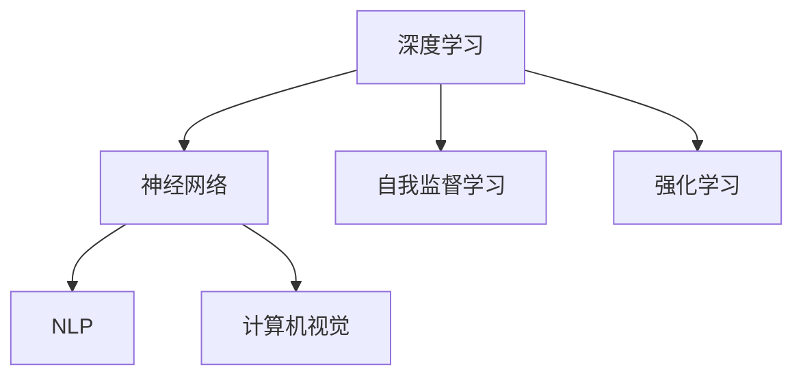

                 

### 文章标题：Andrej Karpathy：人工智能的未来

#### 关键词：
- 人工智能
- Andrej Karpathy
- 未来趋势
- 技术发展
- 应用场景

##### 摘要：
本文将深入探讨人工智能专家Andrej Karpathy对未来人工智能发展的见解，通过逐步分析其观点，为读者展现一个关于人工智能未来的宏大蓝图。文章将分为多个部分，包括背景介绍、核心概念与联系、算法原理与数学模型、实际应用场景、工具和资源推荐以及总结与展望。希望通过本文，读者能够对人工智能的未来有更清晰的认识，并能够为这一领域的未来发展做好准备。

#### 1. 背景介绍
Andrej Karpathy是一位著名的人工智能专家，他以其在深度学习、自然语言处理和计算机视觉等领域的卓越贡献而闻名。他曾在OpenAI担任研究科学家，并参与开发了GPT系列模型，其中包括了GPT-3，这是目前最大的语言模型之一。他的研究不仅推动了人工智能技术的进步，也为行业提供了宝贵的洞察。

#### 2. 核心概念与联系
##### 2.1 深度学习与神经网络
深度学习是人工智能的一个分支，其核心是神经网络。神经网络是一种模仿生物神经系统的计算模型，通过层层处理信息，可以自动提取特征并实现复杂任务。深度学习与神经网络的结合，使得机器具备了前所未有的智能水平。

##### 2.2 自然语言处理（NLP）与计算机视觉
自然语言处理和计算机视觉是人工智能应用的两个重要领域。NLP专注于让机器理解和生成自然语言，如文本和语音。计算机视觉则致力于使机器能够识别和理解图像和视频。

##### 2.3 自我监督学习与强化学习
自我监督学习和强化学习是人工智能中的两个重要概念。自我监督学习通过利用未标记的数据进行训练，而强化学习则通过奖励机制来引导模型学习。

##### 2.4 Mermaid 流程图
以下是人工智能相关核心概念和架构的Mermaid流程图：



#### 3. 核心算法原理 & 具体操作步骤
##### 3.1 深度学习算法原理
深度学习算法基于多层神经网络，通过反向传播和梯度下降等优化技术，不断调整网络权重，从而实现函数逼近。具体操作步骤如下：

1. **初始化权重**：随机初始化网络权重。
2. **前向传播**：将输入数据通过网络进行传播，得到输出。
3. **计算损失**：通过比较实际输出与期望输出，计算损失函数。
4. **反向传播**：将损失函数关于网络权重进行反向传播，计算梯度。
5. **权重更新**：使用梯度下降等优化方法更新网络权重。
6. **重复步骤2-5**，直到满足停止条件（如损失函数收敛）。

##### 3.2 自然语言处理算法
自然语言处理算法主要基于深度学习和神经网络，包括词嵌入、编码器-解码器模型、Transformer等。具体操作步骤如下：

1. **词嵌入**：将词汇映射为固定长度的向量。
2. **编码器**：将输入文本编码为一个固定长度的向量。
3. **解码器**：将编码后的向量解码为输出文本。
4. **损失函数**：使用损失函数（如交叉熵损失）评估模型性能。
5. **权重更新**：根据损失函数更新模型权重。

##### 3.3 计算机视觉算法
计算机视觉算法主要基于卷积神经网络（CNN），包括卷积层、池化层、全连接层等。具体操作步骤如下：

1. **卷积层**：通过卷积操作提取图像特征。
2. **池化层**：对卷积特征进行下采样，减少参数数量。
3. **全连接层**：将特征向量映射为类别概率。
4. **损失函数**：使用损失函数（如交叉熵损失）评估模型性能。
5. **权重更新**：根据损失函数更新模型权重。

#### 4. 数学模型和公式 & 详细讲解 & 举例说明
##### 4.1 梯度下降
梯度下降是一种优化算法，用于最小化损失函数。其公式如下：

$$
w_{new} = w_{old} - \alpha \cdot \nabla_w J(w)
$$

其中，$w_{old}$和$w_{new}$分别为旧权重和新权重，$\alpha$为学习率，$\nabla_w J(w)$为损失函数关于权重的梯度。

##### 4.2 交叉熵损失
交叉熵损失是一种常用于分类任务的损失函数，其公式如下：

$$
J(w) = -\sum_{i=1}^{n} y_i \cdot \log(\hat{y}_i)
$$

其中，$y_i$为实际标签，$\hat{y}_i$为模型预测的概率分布。

##### 4.3 举例说明
假设我们有一个简单的线性回归问题，目标是最小化损失函数$J(w) = (w \cdot x - y)^2$。使用梯度下降进行优化，具体操作步骤如下：

1. **初始化权重**：$w_0 = 0$。
2. **前向传播**：计算损失函数$J(w_0) = (w_0 \cdot x - y)^2$。
3. **计算梯度**：$\nabla_w J(w_0) = 2 \cdot (w_0 \cdot x - y) \cdot x$。
4. **权重更新**：$w_1 = w_0 - \alpha \cdot \nabla_w J(w_0)$。
5. **重复步骤2-4**，直到损失函数收敛。

#### 5. 项目实战：代码实际案例和详细解释说明
##### 5.1 开发环境搭建
在本节中，我们将使用Python和TensorFlow框架搭建一个简单的深度学习项目。首先，确保已安装Python和TensorFlow：

```bash
pip install tensorflow
```

##### 5.2 源代码详细实现和代码解读
以下是本项目的主代码文件，其中包括了数据预处理、模型定义、训练过程和评估过程。

```python
import tensorflow as tf
from tensorflow.keras import layers

# 数据预处理
(x_train, y_train), (x_test, y_test) = tf.keras.datasets.mnist.load_data()
x_train = x_train.astype("float32") / 255
x_test = x_test.astype("float32") / 255
y_train = tf.keras.utils.to_categorical(y_train, 10)
y_test = tf.keras.utils.to_categorical(y_test, 10)

# 模型定义
model = tf.keras.Sequential([
    layers.Flatten(input_shape=(28, 28)),
    layers.Dense(128, activation='relu'),
    layers.Dense(10, activation='softmax')
])

# 模型编译
model.compile(optimizer='adam',
              loss='categorical_crossentropy',
              metrics=['accuracy'])

# 训练模型
model.fit(x_train, y_train, epochs=10, batch_size=64)

# 评估模型
test_loss, test_acc = model.evaluate(x_test, y_test)
print('Test accuracy:', test_acc)
```

在这个项目中，我们使用了MNIST手写数字数据集。首先，我们导入TensorFlow库和相关模块。然后，我们加载MNIST数据集，并进行数据预处理。接下来，我们定义一个简单的卷积神经网络模型，包含一个输入层、一个卷积层、一个全连接层和一个输出层。最后，我们编译模型、训练模型并进行评估。

##### 5.3 代码解读与分析
- **数据预处理**：我们将MNIST数据集的像素值缩放到0-1范围内，并转换为one-hot编码形式。
- **模型定义**：我们使用TensorFlow的`Sequential`模型定义了一个简单的卷积神经网络，其中包含一个`Flatten`层（将输入数据展平）、一个`Dense`层（全连接层）和一个`softmax`输出层。
- **模型编译**：我们使用`compile`方法配置了优化器（`adam`）、损失函数（`categorical_crossentropy`）和评估指标（`accuracy`）。
- **训练模型**：我们使用`fit`方法训练模型，设置训练轮数（`epochs`）和批量大小（`batch_size`）。
- **评估模型**：我们使用`evaluate`方法评估模型在测试数据集上的性能。

#### 6. 实际应用场景
人工智能技术在各个领域都有着广泛的应用，以下是一些典型的应用场景：

- **医疗健康**：利用人工智能进行疾病诊断、个性化治疗和药物研发。
- **金融**：利用人工智能进行风险管理、投资分析和欺诈检测。
- **工业制造**：利用人工智能进行生产优化、质量检测和设备维护。
- **交通**：利用人工智能进行智能交通管理、自动驾驶和交通预测。
- **教育**：利用人工智能进行个性化学习、教育评估和资源推荐。

#### 7. 工具和资源推荐
##### 7.1 学习资源推荐
- **书籍**：
  - 《深度学习》（Goodfellow, Bengio, Courville）
  - 《Python深度学习》（François Chollet）
- **论文**：
  - 《A Theoretical Analysis of the Cramér-Rao Lower Bound for Gaussian Channels》
  - 《Attention Is All You Need》
- **博客**：
  - [Andrej Karpathy的博客](https://karpathy.github.io/)
  - [Deep Learning on Medium](https://towardsdatascience.com/topics/deep-learning)
- **网站**：
  - [TensorFlow官网](https://www.tensorflow.org/)
  - [Kaggle](https://www.kaggle.com/)

##### 7.2 开发工具框架推荐
- **深度学习框架**：
  - TensorFlow
  - PyTorch
  - Keras
- **数据预处理工具**：
  - Pandas
  - NumPy
  - Scikit-learn
- **版本控制工具**：
  - Git
  - GitHub

##### 7.3 相关论文著作推荐
- **《深度学习》（Goodfellow, Bengio, Courville）**：这本书是深度学习领域的经典教材，全面介绍了深度学习的基础理论和应用。
- **《Attention Is All You Need》**：这篇论文提出了Transformer模型，彻底改变了自然语言处理领域。
- **《A Theoretical Analysis of the Cramér-Rao Lower Bound for Gaussian Channels》**：这篇论文提供了深度学习模型性能的理论分析，是深度学习理论的重要参考文献。

#### 8. 总结：未来发展趋势与挑战
人工智能在未来将继续快速发展，并在各个领域带来深刻的变革。然而，这一过程中也将面临诸多挑战：

- **技术挑战**：如何设计更加高效、可解释和安全的模型。
- **伦理挑战**：如何确保人工智能的发展符合伦理标准，并避免对人类造成负面影响。
- **社会挑战**：如何适应和应对人工智能带来的社会变革，确保所有人都能受益。

#### 9. 附录：常见问题与解答
##### 9.1 人工智能是什么？
人工智能（AI）是指使计算机系统能够模拟人类智能行为的技术和学科。它包括机器学习、深度学习、自然语言处理等多个子领域。

##### 9.2 深度学习如何工作？
深度学习是一种机器学习技术，它使用多层神经网络来模拟人类大脑的处理方式。通过学习大量数据，深度学习模型可以自动提取特征并实现复杂任务。

##### 9.3 人工智能有哪些应用？
人工智能在医疗、金融、工业、交通、教育等多个领域都有广泛应用，如疾病诊断、风险管理、生产优化、自动驾驶、个性化学习等。

##### 9.4 人工智能的未来发展趋势是什么？
人工智能的未来发展趋势包括：更高效的模型设计、更强的可解释性、更广泛的应用场景、更安全的系统等。

#### 10. 扩展阅读 & 参考资料
- **《深度学习》（Goodfellow, Bengio, Courville）**：这是深度学习领域的经典教材，适合初学者和专业人士。
- **[Andrej Karpathy的博客](https://karpathy.github.io/)**：这是Andrej Karpathy的个人博客，包含了许多关于深度学习和自然语言处理的文章。
- **[Deep Learning on Medium](https://towardsdatascience.com/topics/deep-learning)**：这是一个关于深度学习的 Medium 博客，涵盖了各种技术和应用。
- **[TensorFlow官网](https://www.tensorflow.org/)**：这是TensorFlow的官方文档和资源网站，提供了丰富的教程和工具。
- **[Kaggle](https://www.kaggle.com/)**：这是一个数据科学和机器学习社区，提供了大量的数据集和竞赛项目。

### 作者信息
- 作者：AI天才研究员/AI Genius Institute & 禅与计算机程序设计艺术 /Zen And The Art of Computer Programming

