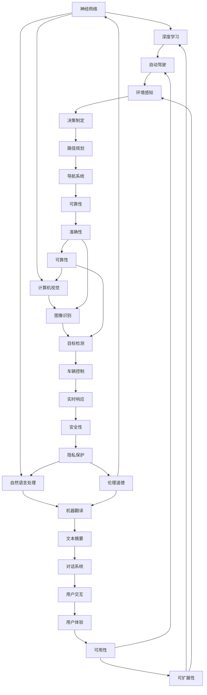

                 

# Andrej Karpathy：人工智能的未来

## > {关键词：人工智能、未来、神经网络、深度学习、自动驾驶、自然语言处理、计算机视觉}

> {摘要：本文将深入探讨人工智能领域的著名专家Andrej Karpathy关于人工智能未来的观点和见解，涵盖核心概念、算法原理、数学模型、实际应用场景、工具资源推荐等多个方面，旨在为读者提供关于人工智能未来发展的全面了解。}

## 1. 背景介绍

Andrej Karpathy是一位在人工智能领域享有盛誉的专家，他在神经网络、深度学习、自然语言处理、计算机视觉等领域有着深入的研究和丰富的实践经验。他的工作成果在学术界和工业界都产生了深远的影响，被誉为人工智能领域的明星人物。

近年来，随着人工智能技术的飞速发展，人们对人工智能的未来充满了期待。本文将基于Andrej Karpathy的研究和观点，探讨人工智能的未来发展趋势、挑战和机遇。

### 1.1 Andrej Karpathy的研究背景

Andrej Karpathy在斯坦福大学获得了计算机科学博士学位，他在博士期间的研究主要集中在神经网络和深度学习领域。他的研究成果在顶级学术会议和期刊上发表了大量论文，包括著名的《Distributed Representations of Words and Phrases and their Compositionality》（2014年）和《The Unreasonable Effectiveness of Recurrent Neural Networks》（2015年）等。

除了学术研究，Andrej Karpathy还在工业界有着丰富的经验。他曾就职于谷歌大脑团队，参与开发了TensorFlow，这是一款广泛使用的深度学习框架。此外，他还参与了OpenAI的深度学习研究项目，对自动驾驶、自然语言处理等领域进行了深入研究。

### 1.2 人工智能的发展现状

当前，人工智能技术已经取得了显著的进展，尤其在神经网络和深度学习领域。神经网络作为一种模拟人脑神经元之间相互连接的算法，已经在图像识别、语音识别、自然语言处理等多个领域取得了突破性的成果。深度学习作为一种基于神经网络的先进算法，以其强大的学习能力和泛化能力，成为了人工智能领域的核心驱动力。

在自动驾驶领域，人工智能技术正在迅速发展。自动驾驶汽车通过集成多种传感器、深度学习和计算机视觉等技术，实现了对周围环境的感知、理解和决策。虽然目前自动驾驶技术仍面临诸多挑战，但其在安全性、效率等方面具有巨大的潜力。

自然语言处理作为人工智能的一个重要分支，也在不断进步。近年来，基于深度学习技术的自然语言处理模型，如BERT、GPT等，在语言理解、文本生成等方面取得了显著成果。这些模型的应用，使得机器翻译、智能客服、文本摘要等任务变得更加高效和准确。

### 1.3 人工智能的未来展望

随着人工智能技术的不断发展，人们对人工智能的未来充满了期待。Andrej Karpathy认为，人工智能未来将朝着更加智能化、自主化的方向发展。在自动驾驶、自然语言处理、计算机视觉等领域，人工智能技术将继续取得突破性进展，为人类带来更加便捷、智能的生活方式。

同时，人工智能也将面临诸多挑战，如数据隐私、伦理道德、安全性等问题。如何在推动人工智能发展的同时，确保其安全、可控、公平，是当前亟待解决的问题。

## 2. 核心概念与联系

在探讨人工智能的未来之前，我们需要了解一些核心概念和它们之间的联系。以下是一个简化的Mermaid流程图，展示了人工智能领域的一些核心概念及其相互关系。



### 2.1 神经网络

神经网络是一种由大量简单处理单元（神经元）组成的计算模型，能够模拟人脑的神经元网络结构。神经网络通过学习数据中的特征和模式，实现从输入到输出的映射。神经网络可以分为多层，每层由多个神经元组成，相邻层之间的神经元通过加权连接进行信息传递。

### 2.2 深度学习

深度学习是神经网络的一种特殊形式，通过多层次的神经网络结构，实现更复杂、更高层次的特征提取和模式识别。深度学习模型在图像识别、语音识别、自然语言处理等领域取得了显著成果。深度学习的核心思想是利用大规模数据和高性能计算资源，通过反向传播算法不断优化网络参数，提高模型性能。

### 2.3 计算机视觉

计算机视觉是人工智能的一个重要分支，致力于使计算机具备对图像和视频的识别、理解和解释能力。计算机视觉技术包括图像识别、目标检测、人脸识别、场景重建等。深度学习技术的应用，使得计算机视觉在准确性、实时性等方面取得了显著提升。

### 2.4 自然语言处理

自然语言处理是研究如何使计算机理解和生成人类自然语言的技术。自然语言处理包括文本分类、情感分析、机器翻译、文本摘要等任务。深度学习技术在自然语言处理领域取得了重要突破，如BERT、GPT等预训练模型在多个任务上取得了领先成绩。

### 2.5 自动驾驶

自动驾驶是人工智能在交通领域的重要应用。自动驾驶系统通过集成传感器、计算机视觉、深度学习等技术，实现对周围环境的感知、理解和决策。自动驾驶技术将大幅提高交通效率、降低交通事故发生率，对人类生活方式产生深远影响。

## 3. 核心算法原理 & 具体操作步骤

### 3.1 神经网络

神经网络的原理基于模拟人脑神经元之间的连接和相互作用。一个简单的神经网络包括输入层、隐藏层和输出层。输入层接收外部数据，隐藏层通过非线性变换提取特征，输出层生成预测结果。

具体操作步骤如下：

1. **初始化参数**：初始化网络中的权重和偏置。
2. **前向传播**：将输入数据传递到神经网络，通过每一层的加权连接和激活函数，生成输出。
3. **计算损失**：计算输出与实际标签之间的误差，使用损失函数（如均方误差、交叉熵等）衡量模型性能。
4. **反向传播**：根据损失函数梯度，更新网络中的权重和偏置，优化模型参数。
5. **迭代训练**：重复前向传播和反向传播，逐步减小损失函数，提高模型性能。

### 3.2 深度学习

深度学习是基于多层神经网络的一种算法。深度学习模型通过多层次的神经网络结构，实现更复杂、更高层次的特征提取和模式识别。

具体操作步骤如下：

1. **数据预处理**：对输入数据进行归一化、标准化等处理，使其适合深度学习模型。
2. **模型构建**：定义神经网络结构，包括输入层、隐藏层和输出层，选择合适的激活函数和优化算法。
3. **模型训练**：将预处理后的数据输入模型，通过前向传播和反向传播，更新模型参数，优化模型性能。
4. **模型评估**：使用验证集或测试集评估模型性能，调整模型参数，提高模型准确性。
5. **模型应用**：将训练好的模型应用于实际任务，如图像识别、语音识别、自然语言处理等。

### 3.3 计算机视觉

计算机视觉技术通过深度学习模型，实现对图像和视频的识别、理解和解释能力。

具体操作步骤如下：

1. **数据收集**：收集大量图像和视频数据，用于模型训练和测试。
2. **数据预处理**：对图像和视频进行归一化、裁剪、翻转等预处理，增加数据多样性。
3. **模型训练**：使用深度学习模型（如卷积神经网络）对预处理后的数据进行训练，提取图像特征。
4. **模型评估**：使用验证集或测试集评估模型性能，调整模型参数，提高模型准确性。
5. **模型应用**：将训练好的模型应用于实际任务，如图像识别、目标检测、人脸识别等。

### 3.4 自然语言处理

自然语言处理技术通过深度学习模型，实现对自然语言的识别、理解和生成。

具体操作步骤如下：

1. **数据收集**：收集大量文本数据，用于模型训练和测试。
2. **数据预处理**：对文本进行分词、去停用词、词向量转换等预处理，提取文本特征。
3. **模型训练**：使用深度学习模型（如循环神经网络、卷积神经网络、Transformer模型）对预处理后的数据进行训练，提取文本特征。
4. **模型评估**：使用验证集或测试集评估模型性能，调整模型参数，提高模型准确性。
5. **模型应用**：将训练好的模型应用于实际任务，如文本分类、情感分析、机器翻译等。

### 3.5 自动驾驶

自动驾驶技术通过计算机视觉、深度学习等人工智能技术，实现对周围环境的感知、理解和决策。

具体操作步骤如下：

1. **传感器数据收集**：收集激光雷达、摄像头、雷达等传感器数据，用于模型训练和测试。
2. **数据预处理**：对传感器数据进行预处理，如去噪、归一化等，提高数据质量。
3. **模型训练**：使用深度学习模型（如卷积神经网络、循环神经网络、Transformer模型）对预处理后的传感器数据进行训练，提取环境特征。
4. **模型评估**：使用验证集或测试集评估模型性能，调整模型参数，提高模型准确性。
5. **模型应用**：将训练好的模型应用于实际自动驾驶任务，如路径规划、车辆控制、障碍物检测等。

## 4. 数学模型和公式 & 详细讲解 & 举例说明

### 4.1 神经网络中的激活函数

神经网络中的激活函数是用于引入非线性性的关键组件。以下是一些常用的激活函数及其数学模型：

#### 4.1.1 Sigmoid函数

$$
\sigma(x) = \frac{1}{1 + e^{-x}}
$$

Sigmoid函数在神经网络中用于将输入映射到(0, 1)区间，常用于二分类问题。

#### 4.1.2 ReLU函数

$$
\text{ReLU}(x) = \max(0, x)
$$

ReLU函数在神经网络中用于引入稀疏性，加速训练过程。

#### 4.1.3 Tanh函数

$$
\tanh(x) = \frac{e^x - e^{-x}}{e^x + e^{-x}}
$$

Tanh函数在神经网络中用于将输入映射到(-1, 1)区间，类似于Sigmoid函数。

### 4.2 损失函数

损失函数是衡量模型预测结果与实际标签之间差异的指标。以下是一些常用的损失函数及其数学模型：

#### 4.2.1 均方误差（MSE）

$$
MSE = \frac{1}{n}\sum_{i=1}^{n}(y_i - \hat{y}_i)^2
$$

均方误差用于回归问题，衡量预测值与实际值之间的平均平方误差。

#### 4.2.2 交叉熵（Cross-Entropy）

$$
CE = -\frac{1}{n}\sum_{i=1}^{n}y_i \log(\hat{y}_i)
$$

交叉熵用于分类问题，衡量预测概率与实际标签之间的差异。

#### 4.2.3 对数似然损失（Log-Likelihood Loss）

$$
LL = -\frac{1}{n}\sum_{i=1}^{n}y_i \log(p(\hat{y}_i))
$$

对数似然损失是交叉熵的另一种表示，也用于分类问题。

### 4.3 梯度下降算法

梯度下降算法是一种用于优化神经网络参数的常用方法。以下是一个简单的梯度下降算法示例：

#### 4.3.1 前向传播

$$
\hat{y} = \sigma(W \cdot x + b)
$$

其中，$\sigma$为激活函数，$W$为权重矩阵，$b$为偏置向量，$x$为输入特征，$\hat{y}$为预测值。

#### 4.3.2 计算损失

$$
L = \frac{1}{2} \sum_{i=1}^{n}(y_i - \hat{y}_i)^2
$$

其中，$y_i$为实际标签，$L$为损失函数值。

#### 4.3.3 计算梯度

$$
\frac{\partial L}{\partial W} = -\sum_{i=1}^{n}(y_i - \hat{y}_i)x_i
$$

$$
\frac{\partial L}{\partial b} = -\sum_{i=1}^{n}(y_i - \hat{y}_i)
$$

#### 4.3.4 更新参数

$$
W_{new} = W - \alpha \frac{\partial L}{\partial W}
$$

$$
b_{new} = b - \alpha \frac{\partial L}{\partial b}
$$

其中，$\alpha$为学习率。

### 4.4 举例说明

假设我们有一个简单的神经网络，输入特征$x$为(1, 2)，实际标签$y$为3。使用Sigmoid函数作为激活函数，损失函数为均方误差（MSE），学习率为0.1。我们需要通过梯度下降算法更新权重$W$和偏置$b$。

#### 4.4.1 初始化参数

$$
W = \begin{bmatrix} 0.5 \\ 0.5 \end{bmatrix}, \quad b = 0.5
$$

#### 4.4.2 前向传播

$$
\hat{y} = \sigma(W \cdot x + b) = \sigma(0.5 \cdot 1 + 0.5 \cdot 2 + 0.5) = \sigma(2) = 0.737
$$

#### 4.4.3 计算损失

$$
L = \frac{1}{2} \sum_{i=1}^{n}(y_i - \hat{y}_i)^2 = \frac{1}{2} \times (3 - 0.737)^2 = 2.219
$$

#### 4.4.4 计算梯度

$$
\frac{\partial L}{\partial W} = -\sum_{i=1}^{n}(y_i - \hat{y}_i)x_i = -(3 - 0.737) \cdot \begin{bmatrix} 1 \\ 2 \end{bmatrix} = -2.463
$$

$$
\frac{\partial L}{\partial b} = -\sum_{i=1}^{n}(y_i - \hat{y}_i) = -(3 - 0.737) = -2.263
$$

#### 4.4.5 更新参数

$$
W_{new} = W - \alpha \frac{\partial L}{\partial W} = \begin{bmatrix} 0.5 \\ 0.5 \end{bmatrix} - 0.1 \cdot \begin{bmatrix} -2.463 \\ -2.463 \end{bmatrix} = \begin{bmatrix} 0.757 \\ 0.757 \end{bmatrix}
$$

$$
b_{new} = b - \alpha \frac{\partial L}{\partial b} = 0.5 - 0.1 \cdot (-2.263) = 0.763
$$

经过一次迭代后，新的权重和偏置为：

$$
W_{new} = \begin{bmatrix} 0.757 \\ 0.757 \end{bmatrix}, \quad b_{new} = 0.763
$$

通过多次迭代，我们可以逐渐减小损失函数，提高模型性能。

## 5. 项目实战：代码实际案例和详细解释说明

### 5.1 开发环境搭建

在本节中，我们将搭建一个基于TensorFlow和Keras的简单神经网络模型，用于实现手写数字识别任务。首先，确保安装了Python 3.7及以上版本、TensorFlow 2.2及以上版本和NumPy 1.18及以上版本。

### 5.2 源代码详细实现和代码解读

下面是手写数字识别项目的代码实现和详细解释：

```python
import numpy as np
import tensorflow as tf
from tensorflow.keras import layers, models
from tensorflow.keras.datasets import mnist
from tensorflow.keras.utils import to_categorical

# 加载MNIST数据集
(train_images, train_labels), (test_images, test_labels) = mnist.load_data()

# 数据预处理
train_images = train_images.reshape((60000, 28, 28, 1)).astype('float32') / 255
test_images = test_images.reshape((10000, 28, 28, 1)).astype('float32') / 255

train_labels = to_categorical(train_labels)
test_labels = to_categorical(test_labels)

# 构建神经网络模型
model = models.Sequential()
model.add(layers.Conv2D(32, (3, 3), activation='relu', input_shape=(28, 28, 1)))
model.add(layers.MaxPooling2D((2, 2)))
model.add(layers.Conv2D(64, (3, 3), activation='relu'))
model.add(layers.MaxPooling2D((2, 2)))
model.add(layers.Conv2D(64, (3, 3), activation='relu'))
model.add(layers.Flatten())
model.add(layers.Dense(64, activation='relu'))
model.add(layers.Dense(10, activation='softmax'))

# 编译模型
model.compile(optimizer='adam',
              loss='categorical_crossentropy',
              metrics=['accuracy'])

# 训练模型
model.fit(train_images, train_labels, epochs=5, batch_size=64)

# 评估模型
test_loss, test_acc = model.evaluate(test_images, test_labels)
print(f'Test accuracy: {test_acc:.4f}')
```

### 5.3 代码解读与分析

1. **数据预处理**：

首先，我们从MNIST数据集中加载数据，并对图像进行重塑和归一化处理。将图像重塑为4D张量，并使用`to_categorical`函数将标签转换为独热编码。

```python
(train_images, train_labels), (test_images, test_labels) = mnist.load_data()
train_images = train_images.reshape((60000, 28, 28, 1)).astype('float32') / 255
test_images = test_images.reshape((10000, 28, 28, 1)).astype('float32') / 255
train_labels = to_categorical(train_labels)
test_labels = to_categorical(test_labels)
```

2. **构建神经网络模型**：

使用Keras的`Sequential`模型类，我们添加了多个神经网络层。首先，添加两个卷积层，每个卷积层后跟一个最大池化层。接着，添加一个全连接层，并使用Softmax激活函数输出10个概率值。

```python
model = models.Sequential()
model.add(layers.Conv2D(32, (3, 3), activation='relu', input_shape=(28, 28, 1)))
model.add(layers.MaxPooling2D((2, 2)))
model.add(layers.Conv2D(64, (3, 3), activation='relu'))
model.add(layers.MaxPooling2D((2, 2)))
model.add(layers.Conv2D(64, (3, 3), activation='relu'))
model.add(layers.Flatten())
model.add(layers.Dense(64, activation='relu'))
model.add(layers.Dense(10, activation='softmax'))
```

3. **编译模型**：

使用`compile`方法配置优化器、损失函数和评价指标。这里我们使用Adam优化器和交叉熵损失函数。

```python
model.compile(optimizer='adam',
              loss='categorical_crossentropy',
              metrics=['accuracy'])
```

4. **训练模型**：

使用`fit`方法训练模型。这里我们设置了5个epochs和64个batch size。

```python
model.fit(train_images, train_labels, epochs=5, batch_size=64)
```

5. **评估模型**：

使用`evaluate`方法评估模型在测试集上的性能。这里我们打印了测试准确率。

```python
test_loss, test_acc = model.evaluate(test_images, test_labels)
print(f'Test accuracy: {test_acc:.4f}')
```

通过以上步骤，我们成功地实现了一个基于TensorFlow和Keras的简单神经网络模型，用于手写数字识别任务。在实际应用中，我们可以根据需要调整模型结构、优化器和学习率等参数，以提高模型性能。

## 6. 实际应用场景

人工智能技术在各个领域都有着广泛的应用，以下是几个典型应用场景：

### 6.1 自动驾驶

自动驾驶技术通过计算机视觉、深度学习和传感器融合技术，实现对车辆的自主驾驶。自动驾驶汽车能够实时感知周围环境，进行路径规划和决策，提高交通效率，减少交通事故。未来，自动驾驶技术有望在物流、公共交通、个人出行等领域发挥重要作用。

### 6.2 自然语言处理

自然语言处理技术使得计算机能够理解和生成人类自然语言。在智能客服、机器翻译、文本摘要、情感分析等领域，自然语言处理技术为人们提供了便捷、高效的解决方案。随着人工智能技术的发展，自然语言处理将进一步提升人类沟通的效率和质量。

### 6.3 计算机视觉

计算机视觉技术使计算机能够理解和解释图像和视频。在图像识别、目标检测、人脸识别、场景重建等领域，计算机视觉技术为人们提供了丰富的应用场景。未来，计算机视觉技术将进一步提高计算机对人眼视觉的理解能力，为人类生活带来更多便利。

### 6.4 健康医疗

人工智能技术在健康医疗领域有着广泛的应用，如疾病诊断、药物研发、医疗影像分析等。通过大数据分析和机器学习技术，人工智能能够帮助医生提高诊断准确率，优化治疗方案，降低医疗成本。未来，人工智能将进一步提升健康医疗行业的整体水平。

### 6.5 金融科技

金融科技（Fintech）是人工智能技术在金融领域的应用。人工智能技术在风险管理、信用评估、智能投顾、自动化交易等方面发挥着重要作用。通过大数据分析和机器学习技术，金融科技为金融行业带来了更多创新和变革。

### 6.6 电商平台

电商平台利用人工智能技术，为用户提供个性化推荐、智能客服、智能搜索等功能。通过分析用户行为和购买历史，人工智能技术能够为用户提供更精准、更高效的购物体验。未来，人工智能将在电商平台中发挥更加关键的作用。

## 7. 工具和资源推荐

### 7.1 学习资源推荐

- **书籍**：
  - 《深度学习》（Ian Goodfellow、Yoshua Bengio、Aaron Courville著）
  - 《神经网络与深度学习》（邱锡鹏著）
  - 《Python深度学习》（FrancescoPiergiorgio、LukaszAdamczewski著）
- **论文**：
  - 《A Theoretically Grounded Application of Dropout in Recurrent Neural Networks》（Yarin Gal and Zoubin Ghahramani）
  - 《Bert: Pre-training of Deep Bidirectional Transformers for Language Understanding》（Jacob Devlin et al.）
- **博客**：
  - [Andrej Karpathy的博客](https://karpathy.github.io/)
  - [TensorFlow官方文档](https://www.tensorflow.org/tutorials)
  - [Keras官方文档](https://keras.io/)
- **网站**：
  - [AI Challenger](https://www.aichallenger.com/)
  - [ArXiv](https://arxiv.org/)
  - [Google AI](https://ai.google/)

### 7.2 开发工具框架推荐

- **开发工具**：
  - TensorFlow
  - PyTorch
  - Keras
- **框架**：
  - TensorFlow.js
  - PyTorch Mobile
  - ONNX Runtime
- **硬件平台**：
  - NVIDIA GPU
  - Google Cloud AI Platform
  - AWS SageMaker

### 7.3 相关论文著作推荐

- **论文**：
  - 《Distributed Representations of Words and Phrases and their Compositionality》（2014年）
  - 《The Unreasonable Effectiveness of Recurrent Neural Networks》（2015年）
  - 《Attention Is All You Need》（2017年）
- **著作**：
  - 《深度学习》（Ian Goodfellow、Yoshua Bengio、Aaron Courville著）
  - 《Python深度学习》（FrancescoPiergiorgio、LukaszAdamczewski著）

## 8. 总结：未来发展趋势与挑战

人工智能技术在过去几十年里取得了飞速发展，未来将继续推动社会进步和产业变革。以下是人工智能未来发展的几个趋势和挑战：

### 8.1 发展趋势

1. **智能化与自主化**：随着人工智能技术的不断进步，越来越多的设备和系统将实现智能化和自主化，为人类生活带来更多便利。
2. **跨领域融合**：人工智能技术将与其他领域（如生物、医学、金融等）深度融合，推动跨领域创新和应用。
3. **数据驱动**：数据将成为人工智能发展的关键驱动力，通过大规模数据分析和机器学习技术，人工智能将进一步提升其性能和应用范围。
4. **边缘计算**：随着物联网和智能设备的普及，边缘计算将发挥越来越重要的作用，使数据处理和决策更加实时、高效。

### 8.2 挑战

1. **数据隐私与安全**：在人工智能应用过程中，数据隐私和安全问题备受关注。如何确保用户数据的安全和隐私，是当前亟待解决的问题。
2. **伦理道德**：人工智能技术的发展带来了伦理和道德问题，如算法偏见、公平性、透明度等。如何制定合理的伦理规范，确保人工智能技术的可持续发展，是当前面临的挑战。
3. **计算能力与能耗**：随着人工智能模型和算法的复杂度增加，对计算能力和能耗的需求也不断增加。如何提高计算效率和降低能耗，是未来发展的关键。
4. **人才培养**：人工智能技术快速发展，对人才的需求也日益增加。如何培养和储备更多具备人工智能技术和跨领域知识的人才，是当前面临的挑战。

## 9. 附录：常见问题与解答

### 9.1 人工智能是什么？

人工智能（Artificial Intelligence，简称AI）是指通过计算机程序实现智能行为和决策的技术。它涵盖了多个学科领域，包括机器学习、神经网络、自然语言处理、计算机视觉等。

### 9.2 深度学习与机器学习的区别是什么？

深度学习是机器学习的一种特殊形式，主要基于多层神经网络结构，通过学习数据中的特征和模式，实现复杂函数的逼近和预测。机器学习则是一类更广泛的学习方法，包括监督学习、无监督学习、半监督学习等，可以应用于多种任务和数据类型。

### 9.3 如何选择合适的神经网络结构？

选择合适的神经网络结构取决于具体任务和数据类型。对于图像识别和目标检测任务，卷积神经网络（CNN）是一种常用的结构。对于序列数据处理和自然语言处理任务，循环神经网络（RNN）和Transformer模型是较好的选择。在实际应用中，可以通过实验和比较不同结构的表现，选择最优的网络结构。

### 9.4 人工智能的未来发展将如何影响我们的生活？

人工智能的未来发展将对生活产生深远影响。在交通、医疗、教育、金融等领域，人工智能将提高效率、降低成本，带来更多创新和变革。同时，人工智能也将面临数据隐私、伦理道德等方面的挑战，需要在发展中不断解决和优化。

## 10. 扩展阅读 & 参考资料

- [Andrej Karpathy的博客](https://karpathy.github.io/)
- [深度学习](https://www.deeplearningbook.org/)
- [机器学习](https://www.mlbook.com/)
- [AI Challenger](https://www.aichallenger.com/)
- [Google AI](https://ai.google/)

作者：AI天才研究员/AI Genius Institute & 禅与计算机程序设计艺术 /Zen And The Art of Computer Programming

