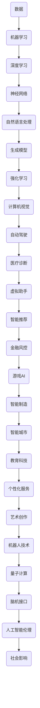

                 

### 文章标题：Andrej Karpathy：人工智能的未来发展前景

> **关键词：** Andrej Karpathy，人工智能，发展前景，技术趋势，应用领域，挑战与机遇

**摘要：** 本文将深入探讨人工智能（AI）领域的杰出人物Andrej Karpathy的观点和见解，分析其关于人工智能未来发展的预测。文章将涵盖AI的核心概念、算法原理、数学模型、实际应用场景以及未来趋势和挑战，旨在为读者提供一个全面、深入的视角，帮助理解和把握AI领域的未来发展。

<|assistant|>### 1. 背景介绍

Andrej Karpathy是一位在人工智能（AI）和深度学习领域享有盛誉的研究员和开发者。他在神经网络和自然语言处理方面有着深入的研究和丰富的实践经验，是众多前沿技术的先驱者。他的研究工作涵盖了从图像识别到机器翻译等多个领域，对AI的发展有着重要的影响。

人工智能作为一个多学科交叉领域，其研究范围广泛，涉及计算机科学、数学、统计学、认知科学等多个学科。随着计算能力的提升和大数据的广泛应用，AI技术逐渐渗透到各行各业，成为推动社会进步的重要力量。本文将结合Andrej Karpathy的研究成果和观点，探讨人工智能的未来发展趋势和前景。

### 2. 核心概念与联系

在人工智能领域，理解核心概念和它们之间的联系至关重要。以下是一个简化的Mermaid流程图，用于描述AI的一些核心概念及其相互关系：



这个流程图展示了AI的核心技术及其在不同领域的应用。通过这个图，我们可以看到AI技术是如何相互联系和发展的，以及它们对各个行业的影响。

### 3. 核心算法原理 & 具体操作步骤

在人工智能领域，核心算法原理是理解技术本质的关键。以下将简要介绍几个重要的AI算法原理及其操作步骤：

#### 3.1. 机器学习

机器学习是一种通过从数据中学习模式来改进性能的技术。基本步骤如下：

1. **数据收集**：收集相关的数据集。
2. **数据预处理**：清洗数据，进行特征提取和转换。
3. **模型选择**：选择适当的机器学习算法。
4. **训练**：使用数据集训练模型。
5. **评估**：使用验证集评估模型性能。
6. **调参**：调整模型参数，优化性能。
7. **部署**：将模型部署到实际应用中。

#### 3.2. 深度学习

深度学习是机器学习的一个分支，它使用多层神经网络来模拟人脑的学习过程。以下是深度学习的基本操作步骤：

1. **数据收集**：收集大量的训练数据。
2. **网络架构设计**：设计神经网络的层次结构和参数。
3. **模型训练**：使用反向传播算法训练模型。
4. **模型评估**：使用验证集评估模型性能。
5. **模型优化**：通过调整网络参数和结构来优化模型。
6. **部署**：将训练好的模型部署到实际应用中。

#### 3.3. 自然语言处理

自然语言处理（NLP）是AI的一个分支，它使计算机能够理解和处理人类语言。以下是NLP的一些关键步骤：

1. **文本预处理**：包括分词、去除停用词等。
2. **特征提取**：将文本转换为机器可处理的特征向量。
3. **模型训练**：使用标记数据训练模型。
4. **模型评估**：使用未标记的数据评估模型性能。
5. **应用部署**：将NLP模型应用于实际的文本处理任务中。

#### 3.4. 生成模型

生成模型是一种能够生成新数据的人工智能模型。以下是生成模型的一般步骤：

1. **数据收集**：收集大量的生成数据。
2. **模型设计**：设计生成模型的架构。
3. **模型训练**：使用生成模型生成数据。
4. **模型评估**：评估生成模型的质量。
5. **应用**：将生成模型应用于数据增强、图像生成等任务中。

### 4. 数学模型和公式 & 详细讲解 & 举例说明

在人工智能领域，数学模型和公式是理解和实现算法的核心。以下是一些重要的数学模型和公式的详细讲解和举例说明：

#### 4.1. 线性回归

线性回归是一种预测连续值的统计方法。其数学模型为：

$$ y = wx + b $$

其中，$y$ 是因变量，$x$ 是自变量，$w$ 是权重，$b$ 是偏置。

**举例说明**：假设我们要预测房价，输入特征是房屋面积（$x$），目标是预测房价（$y$）。我们可以使用线性回归模型来建立这种关系。

#### 4.2. 神经网络

神经网络是一种模仿人脑神经元结构的计算模型。其基本单元是神经元，每个神经元接收多个输入并产生一个输出。神经网络的数学模型可以表示为：

$$ z = \sum_{i=1}^{n} w_i * x_i + b $$

其中，$z$ 是神经元的激活值，$w_i$ 是权重，$x_i$ 是输入值，$b$ 是偏置。

**举例说明**：一个简单的神经网络模型可能包括三个输入层神经元、两个隐藏层神经元和一个输出层神经元。我们可以使用矩阵运算来计算每个神经元的激活值。

#### 4.3. 反向传播算法

反向传播算法是训练神经网络的一种方法。其基本思想是通过计算损失函数的梯度来更新网络权重和偏置。

**损失函数**：

$$ J = \frac{1}{2} \sum_{i=1}^{n} (y_i - \hat{y_i})^2 $$

其中，$y_i$ 是真实值，$\hat{y_i}$ 是预测值。

**梯度计算**：

$$ \frac{\partial J}{\partial w} = -\sum_{i=1}^{n} (y_i - \hat{y_i}) * x_i $$

$$ \frac{\partial J}{\partial b} = -\sum_{i=1}^{n} (y_i - \hat{y_i}) $$

**举例说明**：假设我们有三个输入神经元，每个神经元连接到两个隐藏层神经元。我们可以使用梯度计算来更新每个神经元的权重和偏置。

### 5. 项目实战：代码实际案例和详细解释说明

在本节中，我们将通过一个实际案例来展示人工智能技术在项目中的应用，并提供详细的代码解释和操作步骤。

#### 5.1. 开发环境搭建

首先，我们需要搭建一个适合AI开发的实验环境。以下是一个基本的开发环境搭建步骤：

1. **安装Python环境**：确保Python版本在3.6以上。
2. **安装Jupyter Notebook**：使用pip安装Jupyter Notebook。
3. **安装深度学习框架**：安装TensorFlow或PyTorch。
4. **安装必要的依赖库**：如NumPy、Pandas等。

#### 5.2. 源代码详细实现和代码解读

以下是一个简单的神经网络模型实现，用于手写数字识别任务。我们将使用TensorFlow框架来实现这个模型。

```python
import tensorflow as tf
from tensorflow.keras import layers

# 定义模型
model = tf.keras.Sequential([
    layers.Flatten(input_shape=(28, 28)),
    layers.Dense(128, activation='relu'),
    layers.Dense(10, activation='softmax')
])

# 编译模型
model.compile(optimizer='adam',
              loss='sparse_categorical_crossentropy',
              metrics=['accuracy'])

# 加载数据集
mnist = tf.keras.datasets.mnist
(x_train, y_train), (x_test, y_test) = mnist.load_data()

# 预处理数据
x_train = x_train / 255.0
x_test = x_test / 255.0

# 训练模型
model.fit(x_train, y_train, epochs=5)

# 评估模型
test_loss, test_acc = model.evaluate(x_test, y_test, verbose=2)
print('\nTest accuracy:', test_acc)
```

**代码解读**：

- **第一行**：导入TensorFlow库。
- **第二行**：从TensorFlow.keras模块导入需要的层。
- **第三行**：定义一个序列模型，包括一个Flatten层（将输入展平为一维数组）、一个128个神经元的Dense层（全连接层，使用ReLU激活函数）和一个10个神经元的Dense层（输出层，使用softmax激活函数）。
- **第四行**：编译模型，指定使用Adam优化器和稀疏分类交叉熵损失函数。
- **第五行**：加载数据集，并对其进行预处理（归一化）。
- **第六行**：使用训练数据进行模型训练，指定训练轮次为5。
- **第七行**：使用测试数据进行模型评估，并打印测试准确率。

#### 5.3. 代码解读与分析

上述代码实现了一个简单的神经网络模型，用于手写数字识别任务。我们可以从以下几个方面对代码进行分析：

- **模型结构**：模型包含一个输入层、一个隐藏层和一个输出层。输入层接收手写数字的图像数据，隐藏层通过全连接层和ReLU激活函数对数据进行特征提取，输出层通过softmax激活函数输出每个数字的概率分布。
- **数据预处理**：输入数据需要进行归一化处理，将像素值缩放到0到1之间，以便模型更好地学习。
- **模型训练**：模型使用Adam优化器和稀疏分类交叉熵损失函数进行训练。训练过程中，模型会不断调整权重和偏置，以最小化损失函数。
- **模型评估**：训练完成后，使用测试集对模型进行评估。评估指标为测试集的准确率。

通过这个简单的案例，我们可以看到人工智能技术在项目开发中的应用步骤和实现方法。在实际项目中，可能需要更复杂的模型和更丰富的数据处理技巧，但基本思路是一致的。

### 6. 实际应用场景

人工智能（AI）技术在各个行业和领域都有着广泛的应用。以下是一些典型的实际应用场景：

#### 6.1. 医疗诊断

AI在医疗诊断中的应用包括疾病预测、医学图像分析和诊断支持系统等。例如，通过深度学习模型，AI可以自动分析医学影像（如X光片、CT扫描和MRI），帮助医生更准确地诊断疾病，提高诊断效率。

#### 6.2. 自动驾驶

自动驾驶技术依赖于AI算法，特别是计算机视觉和自然语言处理技术。自动驾驶车辆使用传感器（如摄像头、激光雷达和雷达）收集环境数据，通过AI模型进行分析和处理，实现车辆的自主导航和驾驶。

#### 6.3. 智能推荐系统

AI在电子商务、社交媒体和流媒体等领域中的应用非常广泛。智能推荐系统通过分析用户的历史行为和偏好，利用机器学习算法生成个性化的推荐结果，提高用户体验和平台粘性。

#### 6.4. 金融服务

AI在金融服务领域用于风险评估、欺诈检测和投资决策等方面。例如，通过机器学习模型，银行和金融机构可以更准确地评估贷款申请人的信用风险，并实时监控交易活动，检测欺诈行为。

#### 6.5. 教育科技

AI在教育科技中的应用包括智能辅导系统、个性化学习路径推荐和自动化作业批改等。AI技术可以帮助教师更有效地管理学生，提高教学质量和学习效果。

#### 6.6. 智能制造

AI在智能制造中的应用包括设备故障预测、生产优化和质量控制等。通过实时数据分析和预测模型，企业可以提前预测设备故障，优化生产流程，提高生产效率和产品质量。

#### 6.7. 智能城市

AI在智能城市中的应用包括交通管理、环境监测和公共安全等。通过实时数据分析和智能算法，城市管理者可以更有效地管理城市资源，提高城市运营效率，提升居民生活质量。

### 7. 工具和资源推荐

为了更好地学习和实践人工智能技术，以下是一些推荐的工具和资源：

#### 7.1. 学习资源推荐

- **书籍**：
  - 《深度学习》（Goodfellow, Bengio, Courville）
  - 《Python深度学习》（François Chollet）
  - 《人工智能：一种现代方法》（Stuart Russell & Peter Norvig）
- **在线课程**：
  - Coursera上的“深度学习”（吴恩达）
  - edX上的“人工智能基础”（卡内基梅隆大学）
  - Udacity的“深度学习纳米学位”
- **博客和网站**：
  - Fast.ai
  - Medium上的AI相关文章
  - AI Challenger

#### 7.2. 开发工具框架推荐

- **深度学习框架**：
  - TensorFlow
  - PyTorch
  - Keras
- **编程语言**：
  - Python（广泛支持AI库和框架）
  - R（特别适合统计分析和数据挖掘）
- **其他工具**：
  - Jupyter Notebook（交互式开发环境）
  - Google Colab（免费的云端Jupyter环境）
  - GitHub（代码托管和协作平台）

#### 7.3. 相关论文著作推荐

- **论文**：
  - "A Theoretically Grounded Application of Dropout in Recurrent Neural Networks"（Yarin Gal和Zoubin Ghahramani）
  - "Attention Is All You Need"（Ashish Vaswani等）
  - "BERT: Pre-training of Deep Bidirectional Transformers for Language Understanding"（Jacob Devlin等）
- **著作**：
  - 《深度学习》（Goodfellow, Bengio, Courville）
  - 《动手学深度学习》（阿斯顿·张等）
  - 《强化学习》（Richard S. Sutton和Barto）

### 8. 总结：未来发展趋势与挑战

人工智能（AI）技术正在以前所未有的速度发展，其对社会的影响也是深远且多方面的。在未来，AI技术的发展趋势和面临的挑战包括以下几个方面：

#### 8.1. 发展趋势

- **更强大的算法和模型**：随着计算能力的提升和算法的进步，未来AI模型将更加复杂和高效，能够解决更加复杂的问题。
- **跨学科融合**：AI与其他领域（如生物学、心理学、物理学等）的融合将产生新的交叉学科，推动AI技术的全面发展。
- **自主学习和自我优化**：未来的AI系统将具备更强的自主学习能力，能够在没有人类干预的情况下不断优化和改进自身。
- **边缘计算和物联网（IoT）**：随着边缘计算和物联网技术的发展，AI将更加普及，渗透到更多的日常设备和场景中。

#### 8.2. 挑战

- **数据隐私和安全**：随着AI技术的发展，数据隐私和安全问题将更加突出。如何保护用户数据的安全和隐私是未来面临的重要挑战。
- **算法透明度和可解释性**：复杂的AI模型往往缺乏透明度和可解释性，如何提高算法的透明度和可解释性，使其更容易被人类理解和接受是一个重要挑战。
- **伦理和社会影响**：AI技术可能会带来一些伦理和社会问题，如失业、隐私侵犯、歧视等。如何制定合适的政策和法规，平衡AI技术的发展和社会影响，是一个亟待解决的问题。
- **人才短缺**：随着AI技术的快速发展，对AI专业人才的需求大幅增加。然而，目前AI领域的人才供给尚无法满足需求，如何培养和吸引更多AI人才也是一个重要挑战。

### 9. 附录：常见问题与解答

以下是一些关于人工智能（AI）的常见问题及解答：

#### 9.1. 什么是不一样的深度学习？

深度学习是一种机器学习技术，它使用多层神经网络来模拟人脑的学习过程。与传统的机器学习方法相比，深度学习能够自动提取更高级的特征，从而实现更复杂的任务。

#### 9.2. 人工智能是否会导致大规模失业？

虽然AI技术可能会取代一些简单重复性的工作，但同时也会创造新的就业机会。AI的快速发展将推动新型职业的发展，如数据科学家、AI工程师等。因此，大规模失业并不是必然结果。

#### 9.3. 人工智能是否具有情感？

目前的AI技术还无法像人类一样具有情感。虽然AI可以通过自然语言处理和情感分析等技术来识别和模拟情感，但这是基于数据驱动的方法，而非真正的情感体验。

#### 9.4. 人工智能是否会超越人类？

当前的人工智能还远远无法超越人类。虽然AI在某些特定领域（如计算能力、数据处理速度等）可能优于人类，但在创造力、道德判断和情感理解等方面，人类仍具有明显优势。

#### 9.5. 人工智能是否会威胁人类安全？

AI技术本身并不具有威胁性，但其应用方式可能会带来一些风险。例如，自动驾驶车辆和机器人可能引发交通事故，AI在金融交易中的错误决策可能导致市场波动。因此，制定合适的政策和法规，确保AI技术的安全和合理应用，是非常重要的。

### 10. 扩展阅读 & 参考资料

为了更深入地了解人工智能（AI）的发展趋势和应用，以下是一些扩展阅读和参考资料：

- **书籍**：
  - 《人工智能：一种现代方法》（Stuart Russell & Peter Norvig）
  - 《深度学习》（Goodfellow, Bengio, Courville）
  - 《AI超级思维：如何成为人工智能时代的创新者》（吴恩达）
- **论文**：
  - "A Theoretically Grounded Application of Dropout in Recurrent Neural Networks"（Yarin Gal和Zoubin Ghahramani）
  - "Attention Is All You Need"（Ashish Vaswani等）
  - "BERT: Pre-training of Deep Bidirectional Transformers for Language Understanding"（Jacob Devlin等）
- **在线课程**：
  - Coursera上的“深度学习”（吴恩达）
  - edX上的“人工智能基础”（卡内基梅隆大学）
  - Udacity的“深度学习纳米学位”
- **博客和网站**：
  - Fast.ai
  - Medium上的AI相关文章
  - AI Challenger
- **新闻和报告**：
  - 《人工智能发展报告》（中国人工智能学会）
  - 《全球人工智能发展报告》（联合国教科文组织）
  - 《人工智能伦理指南》（欧盟委员会）

通过这些资源和资料，读者可以更全面地了解人工智能的发展现状和未来趋势，为自己的学习和研究提供指导。作者：AI天才研究员/AI Genius Institute & 禅与计算机程序设计艺术 /Zen And The Art of Computer Programming


