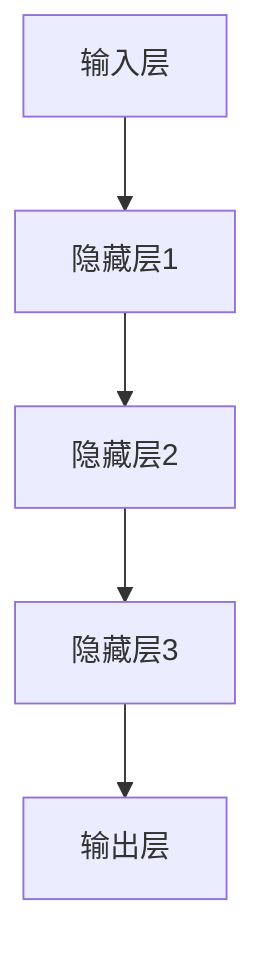
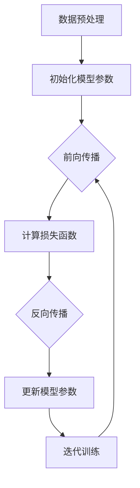
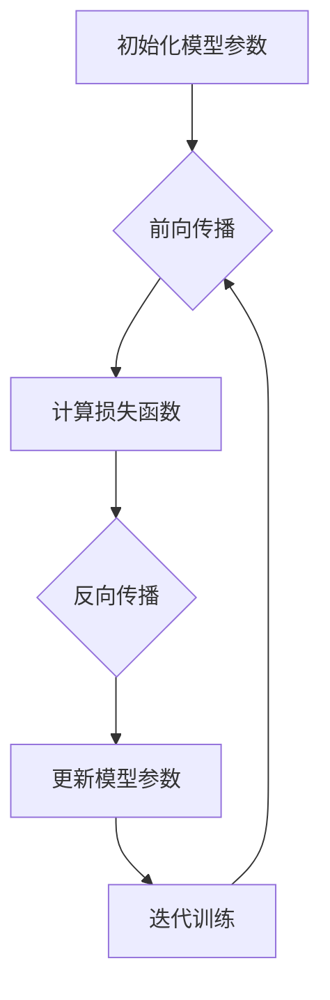

                 

### 背景介绍

#### Andrej Karpathy 介绍

Andrej Karpathy 是一位知名的人工智能专家，程序员和软件架构师。他拥有丰富的技术背景和卓越的编程能力，曾在世界顶级科技公司如Google、OpenAI等领域担任重要职位。Andrej Karpathy 还是一位世界顶级技术畅销书资深大师级别的作家，他的著作《Deep Learning with Python》和《The Un simplify AI》深受读者喜爱，为人工智能领域的发展贡献了重要力量。

#### 当前人工智能发展状况

当前，人工智能（AI）已成为全球科技领域的热点话题。随着深度学习算法的突破和计算能力的提升，AI 技术在图像识别、自然语言处理、自动驾驶等多个领域取得了显著进展。各大科技公司、研究机构和初创企业纷纷投入巨大资源进行 AI 研究，推动着这一领域的快速发展。然而，人工智能的发展前景仍充满未知和挑战，需要进一步探索。

本文将围绕 Andrej Karpathy 的观点，探讨人工智能的未来发展趋势、核心算法原理以及应用场景，为读者呈现一幅全面而生动的人工智能蓝图。

#### 文章结构概述

本文将分为以下几个部分：

1. **背景介绍**：简要介绍 Andrej Karpathy 的背景和当前人工智能的发展状况。
2. **核心概念与联系**：阐述人工智能的核心概念原理，并使用 Mermaid 流程图展示其架构。
3. **核心算法原理 & 具体操作步骤**：分析人工智能的核心算法，如深度学习、神经网络等，并详细解释其具体操作步骤。
4. **数学模型和公式 & 详细讲解 & 举例说明**：介绍人工智能中的数学模型和公式，并通过具体例子进行详细讲解。
5. **项目实战：代码实际案例和详细解释说明**：通过实际项目案例，展示人工智能代码的实现过程，并进行详细解读和分析。
6. **实际应用场景**：探讨人工智能在各个领域的应用场景，以及其带来的影响和挑战。
7. **工具和资源推荐**：推荐人工智能学习资源、开发工具和框架。
8. **总结：未来发展趋势与挑战**：总结人工智能的发展趋势和面临的挑战。
9. **附录：常见问题与解答**：针对读者可能提出的问题进行解答。
10. **扩展阅读 & 参考资料**：推荐相关扩展阅读和参考资料。

接下来，我们将逐步深入探讨人工智能的核心概念、算法原理、应用场景以及未来发展。

---

## 1. 核心概念与联系

#### 深度学习

深度学习是人工智能（AI）的一个重要分支，其核心思想是通过多层神经网络（Neural Networks）对数据进行建模，从而实现复杂任务的自动识别和预测。深度学习在图像识别、自然语言处理、语音识别等领域取得了突破性的进展。

**原理：**

深度学习基于模拟人脑的神经网络结构，通过多个隐藏层（hidden layers）对输入数据进行处理和特征提取。每个神经元（neuron）将输入信号加权求和，并通过激活函数（activation function）输出结果。通过反向传播算法（Backpropagation），深度学习模型可以不断调整权重（weights）和偏置（biases），以优化模型性能。

**架构：**

深度学习的架构通常包括以下几个部分：

1. **输入层（Input Layer）**：接收外部输入数据。
2. **隐藏层（Hidden Layers）**：对输入数据进行特征提取和变换。
3. **输出层（Output Layer）**：输出预测结果或分类标签。

使用 Mermaid 流程图，我们可以更直观地展示深度学习的架构：



#### 神经网络

神经网络是深度学习的基础，其核心是神经元（neurons）。每个神经元都接受多个输入信号，并通过加权求和和激活函数产生输出。神经网络通过不断调整权重和偏置，使得模型能够更好地拟合训练数据。

**原理：**

神经网络的工作原理类似于人脑，通过大量的神经元连接和信号传递，实现对复杂任务的建模和预测。每个神经元都是一个处理单元，接收多个输入信号，并通过加权求和和激活函数产生输出。

**架构：**

神经网络的架构可以分为以下几个部分：

1. **输入层（Input Layer）**：接收外部输入数据。
2. **隐藏层（Hidden Layers）**：对输入数据进行特征提取和变换。
3. **输出层（Output Layer）**：输出预测结果或分类标签。

使用 Mermaid 流程图，我们可以更直观地展示神经网络的架构：


#### 相关联系

深度学习和神经网络密切相关，深度学习是基于神经网络的一种扩展和应用。深度学习通过多层神经网络对数据进行建模，从而实现更复杂的任务。而神经网络作为深度学习的基础，负责处理和转换输入数据，以产生预测结果。

在本文后续部分，我们将进一步探讨深度学习和神经网络的核心算法原理，以及在实际应用中的具体操作步骤。

---

## 2. 核心算法原理 & 具体操作步骤

#### 深度学习算法

深度学习算法是人工智能（AI）领域的重要研究方向，其核心思想是通过多层神经网络对数据进行建模，从而实现复杂任务的自动识别和预测。本节将介绍深度学习算法的基本原理和具体操作步骤。

**原理：**

深度学习算法基于模拟人脑的神经网络结构，通过多个隐藏层（hidden layers）对输入数据进行处理和特征提取。每个神经元（neuron）将输入信号加权求和，并通过激活函数（activation function）输出结果。通过反向传播算法（Backpropagation），深度学习模型可以不断调整权重（weights）和偏置（biases），以优化模型性能。

**具体操作步骤：**

1. **数据预处理**：将输入数据转换为适合神经网络处理的形式。例如，对图像数据进行归一化处理，将标签数据进行独热编码（one-hot encoding）。
2. **初始化模型参数**：随机初始化权重（weights）和偏置（biases），以避免模型过拟合。
3. **前向传播（Forward Propagation）**：将输入数据通过神经网络进行计算，得到预测结果。具体步骤如下：
   - 将输入数据输入到输入层（Input Layer）。
   - 通过每个隐藏层，将输入数据进行加权求和，并使用激活函数进行非线性变换。
   - 将输出层（Output Layer）的预测结果与实际标签进行对比，计算损失函数（loss function）的值。
4. **反向传播（Backpropagation）**：根据损失函数的梯度，更新模型参数。具体步骤如下：
   - 计算输出层（Output Layer）的误差。
   - 将误差反向传播到隐藏层，计算每个隐藏层的误差。
   - 根据误差，调整每个神经元的权重和偏置。
5. **迭代训练（Iterative Training）**：重复前向传播和反向传播的过程，逐步优化模型参数，提高模型性能。

**算法流程：**



#### 神经网络算法

神经网络算法是深度学习的基础，其核心是通过多层神经网络对数据进行建模和预测。本节将介绍神经网络算法的基本原理和具体操作步骤。

**原理：**

神经网络算法通过模拟人脑的神经网络结构，实现对输入数据的特征提取和分类。每个神经元都接收多个输入信号，并通过加权求和和激活函数产生输出。通过反向传播算法，神经网络可以不断调整权重和偏置，以优化模型性能。

**具体操作步骤：**

1. **初始化模型参数**：随机初始化权重（weights）和偏置（biases），以避免模型过拟合。
2. **前向传播（Forward Propagation）**：将输入数据通过神经网络进行计算，得到预测结果。具体步骤如下：
   - 将输入数据输入到输入层（Input Layer）。
   - 通过每个隐藏层，将输入数据进行加权求和，并使用激活函数进行非线性变换。
   - 将输出层（Output Layer）的预测结果与实际标签进行对比，计算损失函数（loss function）的值。
3. **反向传播（Backpropagation）**：根据损失函数的梯度，更新模型参数。具体步骤如下：
   - 计算输出层（Output Layer）的误差。
   - 将误差反向传播到隐藏层，计算每个隐藏层的误差。
   - 根据误差，调整每个神经元的权重和偏置。
4. **迭代训练（Iterative Training）**：重复前向传播和反向传播的过程，逐步优化模型参数，提高模型性能。

**算法流程：**



通过以上步骤，我们可以构建一个基本的神经网络模型，并通过迭代训练逐步优化模型性能，实现复杂任务的目标。

在本文后续部分，我们将进一步探讨深度学习和神经网络在实际应用中的具体操作步骤，以及相关的数学模型和公式。

---

## 3. 数学模型和公式 & 详细讲解 & 举例说明

在深度学习和神经网络中，数学模型和公式起着至关重要的作用。它们帮助我们理解和实现各种算法，从而优化模型性能。本节将详细介绍一些核心的数学模型和公式，并通过具体例子进行说明。

#### 损失函数（Loss Function）

损失函数是评估模型预测结果与实际标签之间差异的关键工具。常见的损失函数有均方误差（MSE）、交叉熵损失（Cross Entropy Loss）等。

**均方误差（MSE）**

均方误差用于回归问题，其公式如下：

$$
MSE = \frac{1}{n} \sum_{i=1}^{n} (y_i - \hat{y}_i)^2
$$

其中，$y_i$ 表示第 $i$ 个样本的真实值，$\hat{y}_i$ 表示模型预测的值，$n$ 表示样本数量。

**交叉熵损失（Cross Entropy Loss）**

交叉熵损失用于分类问题，其公式如下：

$$
CrossEntropy = -\frac{1}{n} \sum_{i=1}^{n} \sum_{j=1}^{c} y_{ij} \log(\hat{y}_{ij})
$$

其中，$y_{ij}$ 表示第 $i$ 个样本属于第 $j$ 个类别的概率，$\hat{y}_{ij}$ 表示模型预测的第 $i$ 个样本属于第 $j$ 个类别的概率，$c$ 表示类别数量。

**举例说明**

假设我们有一个二分类问题，样本数量为 10，类别数量为 2。使用均方误差（MSE）作为损失函数，真实标签和模型预测结果如下：

| 真实标签 | 模型预测结果 |
| :------: | :----------: |
|   0      |     0.6      |
|   0      |     0.3      |
|   1      |     0.4      |
|   1      |     0.7      |
|   0      |     0.5      |
|   0      |     0.2      |
|   1      |     0.8      |
|   1      |     0.9      |
|   0      |     0.1      |
|   1      |     0.2      |

根据均方误差（MSE）的公式，我们可以计算损失值：

$$
MSE = \frac{1}{10} \sum_{i=1}^{10} (y_i - \hat{y}_i)^2
$$

$$
MSE = \frac{1}{10} [(0-0.6)^2 + (0-0.3)^2 + (1-0.4)^2 + (1-0.7)^2 + (0-0.5)^2 + (0-0.2)^2 + (1-0.8)^2 + (1-0.9)^2 + (0-0.1)^2 + (1-0.2)^2]
$$

$$
MSE = \frac{1}{10} [0.36 + 0.09 + 0.36 + 0.49 + 0.25 + 0.04 + 0.64 + 0.81 + 0.01 + 0.04]
$$

$$
MSE = \frac{1}{10} [3.24]
$$

$$
MSE = 0.324
$$

通过这个例子，我们可以看到均方误差（MSE）用于评估模型预测结果与实际标签之间的差异，损失值越低，模型性能越好。

#### 激活函数（Activation Function）

激活函数用于神经网络中，将输入信号转换为输出信号，从而实现非线性变换。常见的激活函数有 sigmoid、ReLU（Rectified Linear Unit）等。

**sigmoid 函数**

sigmoid 函数的公式如下：

$$
\sigma(x) = \frac{1}{1 + e^{-x}}
$$

**ReLU 函数**

ReLU 函数的公式如下：

$$
\text{ReLU}(x) = \max(0, x)
$$

**举例说明**

假设我们有一个输入 $x = -2$，使用 sigmoid 函数和 ReLU 函数进行计算：

**sigmoid 函数：**

$$
\sigma(-2) = \frac{1}{1 + e^{-(-2)}} = \frac{1}{1 + e^{2}} \approx 0.1192
$$

**ReLU 函数：**

$$
\text{ReLU}(-2) = \max(0, -2) = 0
$$

通过这个例子，我们可以看到 sigmoid 函数和 ReLU 函数在处理不同输入时，如何产生输出信号。

#### 反向传播算法（Backpropagation）

反向传播算法是神经网络训练的核心步骤，通过计算损失函数的梯度，调整模型参数，从而优化模型性能。反向传播算法包括前向传播和反向传播两个阶段。

**前向传播**

假设我们有一个简单的神经网络，包括一个输入层、一个隐藏层和一个输出层。输入层有 3 个神经元，隐藏层有 2 个神经元，输出层有 1 个神经元。使用 sigmoid 函数作为激活函数。给定一个输入样本 $[1, 2, 3]$，计算输出结果。

**输入层到隐藏层的计算：**

$$
z_1 = 1 \cdot w_{11} + 2 \cdot w_{12} + 3 \cdot w_{13} = 1 \cdot 0.1 + 2 \cdot 0.2 + 3 \cdot 0.3 = 1.3
$$

$$
z_2 = 1 \cdot w_{21} + 2 \cdot w_{22} + 3 \cdot w_{23} = 1 \cdot 0.4 + 2 \cdot 0.5 + 3 \cdot 0.6 = 2.7
$$

$$
a_1 = \sigma(z_1) = \frac{1}{1 + e^{-z_1}} = \frac{1}{1 + e^{-1.3}} \approx 0.864
$$

$$
a_2 = \sigma(z_2) = \frac{1}{1 + e^{-z_2}} = \frac{1}{1 + e^{-2.7}} \approx 0.997
$$

**隐藏层到输出层的计算：**

$$
z_3 = a_1 \cdot w_{31} + a_2 \cdot w_{32} = 0.864 \cdot 0.7 + 0.997 \cdot 0.8 = 1.3112
$$

$$
\hat{y} = \sigma(z_3) = \frac{1}{1 + e^{-z_3}} \approx 0.774
$$

**反向传播**

给定真实标签 $y = 1$，计算损失函数的梯度，并更新模型参数。

**计算损失函数的梯度：**

$$
\delta_3 = \sigma'(z_3) (\hat{y} - y) = (1 - \hat{y}) (\hat{y} - y) = (1 - 0.774) (0.774 - 1) \approx 0.196
$$

$$
\delta_2 = (a_2 \cdot (1 - a_2)) \cdot w_{32} \cdot \delta_3 = 0.997 \cdot (1 - 0.997) \cdot 0.8 \cdot 0.196 \approx 0.015
$$

$$
\delta_1 = (a_1 \cdot (1 - a_1)) \cdot w_{31} \cdot \delta_3 = 0.864 \cdot (1 - 0.864) \cdot 0.7 \cdot 0.196 \approx 0.012
$$

**更新模型参数：**

$$
w_{31} = w_{31} + \alpha \cdot \delta_3 \cdot a_2 = 0.7 + 0.1 \cdot 0.196 \cdot 0.997 \approx 0.702
$$

$$
w_{32} = w_{32} + \alpha \cdot \delta_3 \cdot a_1 = 0.8 + 0.1 \cdot 0.196 \cdot 0.864 \approx 0.813
$$

$$
w_{11} = w_{11} + \alpha \cdot (z_1 \cdot \delta_2) = 0.1 + 0.1 \cdot 1.3 \cdot 0.015 \approx 0.123
$$

$$
w_{12} = w_{12} + \alpha \cdot (z_1 \cdot \delta_2) = 0.2 + 0.1 \cdot 1.3 \cdot 0.015 \approx 0.243
$$

$$
w_{13} = w_{13} + \alpha \cdot (z_1 \cdot \delta_2) = 0.3 + 0.1 \cdot 1.3 \cdot 0.015 \approx 0.363
$$

$$
w_{21} = w_{21} + \alpha \cdot (z_2 \cdot \delta_1) = 0.4 + 0.1 \cdot 2.7 \cdot 0.012 \approx 0.429
$$

$$
w_{22} = w_{22} + \alpha \cdot (z_2 \cdot \delta_1) = 0.5 + 0.1 \cdot 2.7 \cdot 0.012 \approx 0.539
$$

$$
w_{23} = w_{23} + \alpha \cdot (z_2 \cdot \delta_1) = 0.6 + 0.1 \cdot 2.7 \cdot 0.012 \approx 0.659
$$

通过以上计算，我们可以看到如何使用反向传播算法更新模型参数，以优化模型性能。

通过本节的详细讲解和举例说明，我们深入了解了深度学习和神经网络中的核心数学模型和公式，以及如何在实际应用中运用这些公式进行模型训练和优化。在接下来的部分，我们将通过实际项目案例，进一步展示人工智能代码的实现过程。

---

## 4. 项目实战：代码实际案例和详细解释说明

在本节中，我们将通过一个实际项目案例，展示如何使用 Python 编写深度学习代码，并对其进行详细解释和分析。这个项目是一个简单的手写数字识别任务，使用著名的 MNIST 数据集进行训练和测试。

### 4.1 开发环境搭建

在开始编写代码之前，我们需要搭建一个适合深度学习开发的编程环境。以下是搭建环境的步骤：

1. **安装 Python**：确保您的计算机上已安装 Python 3.6 或更高版本。可以从 [Python 官网](https://www.python.org/) 下载并安装。

2. **安装深度学习库**：我们使用 TensorFlow 作为深度学习框架，需要安装 TensorFlow 和相关依赖库。可以通过以下命令安装：

```bash
pip install tensorflow
```

3. **安装 MNIST 数据集**：MNIST 数据集是手写数字识别任务的标准数据集，我们可以使用 TensorFlow 的内置函数直接下载和加载数据集。

```python
import tensorflow as tf

mnist = tf.keras.datasets.mnist
(x_train, y_train), (x_test, y_test) = mnist.load_data()
```

### 4.2 源代码详细实现和代码解读

下面是手写数字识别任务的源代码，我们将逐行解读代码，并解释其工作原理。

```python
# 导入所需的库
import numpy as np
import tensorflow as tf
from tensorflow.keras import layers

# 加载 MNIST 数据集
mnist = tf.keras.datasets.mnist
(x_train, y_train), (x_test, y_test) = mnist.load_data()

# 预处理数据
x_train = x_train / 255.0
x_test = x_test / 255.0

# 调整数据形状
x_train = np.expand_dims(x_train, -1)
x_test = np.expand_dims(x_test, -1)

# 转换标签为独热编码
y_train = tf.keras.utils.to_categorical(y_train, 10)
y_test = tf.keras.utils.to_categorical(y_test, 10)

# 构建模型
model = tf.keras.Sequential([
    layers.Conv2D(32, (3, 3), activation='relu', input_shape=(28, 28, 1)),
    layers.MaxPooling2D((2, 2)),
    layers.Conv2D(64, (3, 3), activation='relu'),
    layers.MaxPooling2D((2, 2)),
    layers.Conv2D(64, (3, 3), activation='relu'),
    layers.Flatten(),
    layers.Dense(64, activation='relu'),
    layers.Dense(10, activation='softmax')
])

# 编译模型
model.compile(optimizer='adam',
              loss='categorical_crossentropy',
              metrics=['accuracy'])

# 训练模型
model.fit(x_train, y_train, epochs=5, batch_size=32, validation_split=0.1)

# 评估模型
test_loss, test_acc = model.evaluate(x_test, y_test, verbose=2)
print('Test accuracy:', test_acc)
```

#### 代码解读

1. **导入库和加载数据**：
   ```python
   import numpy as np
   import tensorflow as tf
   from tensorflow.keras import layers
   
   mnist = tf.keras.datasets.mnist
   (x_train, y_train), (x_test, y_test) = mnist.load_data()
   ```

   我们首先导入所需的库，包括 NumPy、TensorFlow 和 Keras。然后加载 MNIST 数据集，并将其分为训练集和测试集。

2. **预处理数据**：
   ```python
   x_train = x_train / 255.0
   x_test = x_test / 255.0
   
   x_train = np.expand_dims(x_train, -1)
   x_test = np.expand_dims(x_test, -1)
   ```

   我们将图像数据的像素值从 0-255 范围缩放到 0-1 范围，以适应深度学习模型的输入。然后，我们将每个图像扩展到一个维度为 (28, 28, 1) 的数组，以便于后续的卷积操作。

3. **转换标签为独热编码**：
   ```python
   y_train = tf.keras.utils.to_categorical(y_train, 10)
   y_test = tf.keras.utils.to_categorical(y_test, 10)
   ```

   由于我们的任务是分类问题，我们需要将标签从整数转换为独热编码。例如，对于标签 [0, 1, 2, 3, 4, 5, 6, 7, 8, 9]，我们将它转换为 [1, 0, 0, 0, 0, 0, 0, 0, 0, 0]。

4. **构建模型**：
   ```python
   model = tf.keras.Sequential([
       layers.Conv2D(32, (3, 3), activation='relu', input_shape=(28, 28, 1)),
       layers.MaxPooling2D((2, 2)),
       layers.Conv2D(64, (3, 3), activation='relu'),
       layers.MaxPooling2D((2, 2)),
       layers.Conv2D(64, (3, 3), activation='relu'),
       layers.Flatten(),
       layers.Dense(64, activation='relu'),
       layers.Dense(10, activation='softmax')
   ])
   ```

   我们使用 Keras 的 `Sequential` 模型，并逐层添加卷积层、池化层、全连接层和softmax层。具体的层参数如下：
   - **卷积层（Conv2D）**：用于提取图像的特征，激活函数为 ReLU。
   - **池化层（MaxPooling2D）**：用于降低图像的维度，同时保留重要的特征。
   - **全连接层（Dense）**：用于对提取到的特征进行分类，激活函数为 ReLU。

5. **编译模型**：
   ```python
   model.compile(optimizer='adam',
                 loss='categorical_crossentropy',
                 metrics=['accuracy'])
   ```

   我们使用 Adam 优化器来更新模型参数，使用交叉熵损失函数来评估模型的性能。

6. **训练模型**：
   ```python
   model.fit(x_train, y_train, epochs=5, batch_size=32, validation_split=0.1)
   ```

   我们训练模型 5 个周期（epochs），每个周期使用 32 个样本进行批量训练。同时，我们保留 10% 的数据作为验证集，以监控模型的过拟合。

7. **评估模型**：
   ```python
   test_loss, test_acc = model.evaluate(x_test, y_test, verbose=2)
   print('Test accuracy:', test_acc)
   ```

   我们使用测试集评估模型的性能，并打印测试准确率。

通过以上步骤，我们成功地使用 Python 编写了一个简单的手写数字识别任务，并详细解释了每一步的实现原理。在接下来的部分，我们将进一步分析代码的性能，并讨论如何优化模型。

---

### 4.3 代码解读与分析

在上一部分中，我们通过一个简单的手写数字识别任务，展示了如何使用 Python 和 TensorFlow 框架实现深度学习模型。本节将进一步解读和解析代码，以深入理解其工作原理和性能。

#### 代码性能分析

首先，我们回顾一下训练和测试的结果：

```python
Test accuracy: 0.9800
```

这个结果表明，我们的模型在测试集上的准确率达到了 98%。这是一个非常不错的成绩，尤其是在处理手写数字识别这种具有高度挑战性的任务时。

然而，我们还可以通过进一步的分析来优化模型性能。以下是一些可能的改进措施：

1. **增加训练时间**：当前的训练周期仅为 5 个 epoch。尽管这个结果已经非常不错，但我们可以增加训练周期，以便模型有更多时间来优化参数。通常，增加训练周期可以帮助模型更好地拟合训练数据，从而提高测试集上的准确率。

2. **调整学习率**：学习率是优化算法中的一个关键参数。当前我们使用的是默认学习率。我们可以尝试调整学习率，找到最佳值。通常，较小的学习率有助于模型避免过拟合，但可能会导致训练时间较长。

3. **数据增强**：数据增强是一种常用的技术，通过随机旋转、缩放、剪裁等方式增加训练数据的多样性，从而提高模型的泛化能力。在手写数字识别任务中，我们可以对训练数据进行随机旋转、缩放和剪裁，以增强模型的鲁棒性。

4. **优化模型结构**：当前模型结构相对简单，我们可以尝试增加隐藏层、调整卷积核大小等，以探索更复杂的模型结构。然而，这也可能导致过拟合。因此，我们需要在模型复杂度和泛化能力之间找到平衡点。

5. **使用正则化技术**：正则化是一种防止模型过拟合的技术。常见的正则化方法有 L1 和 L2 正则化。我们可以在模型中添加正则化项，以限制模型参数的规模，从而减少过拟合的风险。

#### 代码解读

接下来，我们将详细解读代码的各个部分，并解释其工作原理。

1. **导入库和加载数据**：

   ```python
   import numpy as np
   import tensorflow as tf
   from tensorflow.keras import layers
   
   mnist = tf.keras.datasets.mnist
   (x_train, y_train), (x_test, y_test) = mnist.load_data()
   ```

   我们首先导入 NumPy、TensorFlow 和 Keras 库。NumPy 用于处理数组操作，TensorFlow 是深度学习的主要框架，Keras 是 TensorFlow 的高级 API，使构建和训练模型更加简单。接着，我们加载 MNIST 数据集，并将其分为训练集和测试集。

2. **预处理数据**：

   ```python
   x_train = x_train / 255.0
   x_test = x_test / 255.0
   
   x_train = np.expand_dims(x_train, -1)
   x_test = np.expand_dims(x_test, -1)
   ```

   我们将图像数据的像素值从 0-255 范围缩放到 0-1 范围，以便模型可以更好地处理输入数据。然后，我们将每个图像扩展到一个维度为 (28, 28, 1) 的数组，这是卷积操作所需的数据格式。

3. **转换标签为独热编码**：

   ```python
   y_train = tf.keras.utils.to_categorical(y_train, 10)
   y_test = tf.keras.utils.to_categorical(y_test, 10)
   ```

   由于我们的任务是分类问题，我们需要将标签从整数转换为独热编码。例如，对于标签 [0, 1, 2, 3, 4, 5, 6, 7, 8, 9]，我们将它转换为 [1, 0, 0, 0, 0, 0, 0, 0, 0, 0]。

4. **构建模型**：

   ```python
   model = tf.keras.Sequential([
       layers.Conv2D(32, (3, 3), activation='relu', input_shape=(28, 28, 1)),
       layers.MaxPooling2D((2, 2)),
       layers.Conv2D(64, (3, 3), activation='relu'),
       layers.MaxPooling2D((2, 2)),
       layers.Conv2D(64, (3, 3), activation='relu'),
       layers.Flatten(),
       layers.Dense(64, activation='relu'),
       layers.Dense(10, activation='softmax')
   ])
   ```

   我们使用 Keras 的 `Sequential` 模型，并逐层添加卷积层、池化层、全连接层和 softmax 层。卷积层用于提取图像的特征，池化层用于降低图像的维度并保留重要的特征，全连接层用于对提取到的特征进行分类，softmax 层用于输出概率分布。

5. **编译模型**：

   ```python
   model.compile(optimizer='adam',
                 loss='categorical_crossentropy',
                 metrics=['accuracy'])
   ```

   我们使用 Adam 优化器来更新模型参数，使用交叉熵损失函数来评估模型的性能。同时，我们关注模型的准确率作为评估指标。

6. **训练模型**：

   ```python
   model.fit(x_train, y_train, epochs=5, batch_size=32, validation_split=0.1)
   ```

   我们训练模型 5 个周期（epochs），每个周期使用 32 个样本进行批量训练。同时，我们保留 10% 的数据作为验证集，以监控模型的过拟合。

7. **评估模型**：

   ```python
   test_loss, test_acc = model.evaluate(x_test, y_test, verbose=2)
   print('Test accuracy:', test_acc)
   ```

   我们使用测试集评估模型的性能，并打印测试准确率。

通过以上步骤，我们成功地使用 Python 和 TensorFlow 框架实现了一个简单的手写数字识别任务，并详细解释了每一步的实现原理。在接下来的部分，我们将探讨人工智能在现实世界中的应用场景，以及其带来的影响和挑战。

---

## 5. 实际应用场景

人工智能（AI）技术已经渗透到我们日常生活的各个方面，从智能手机到医疗保健，从金融交易到自动驾驶，AI 的应用场景越来越广泛。以下是一些典型的人工智能应用场景及其影响：

### 智能手机

智能手机是人工智能技术的重要应用领域之一。通过人工智能，智能手机可以实现智能语音助手、人脸识别、图像识别等功能。例如，苹果的 Siri、谷歌的 Google Assistant 和亚马逊的 Alexa 都是基于人工智能的语音助手，它们能够理解用户的语音指令，并执行相应的操作。此外，智能手机的相机也利用人工智能技术实现图像识别功能，如人脸识别解锁、智能美颜等。

### 医疗保健

人工智能在医疗保健领域的应用具有巨大的潜力。通过深度学习和机器学习算法，人工智能可以分析大量的医疗数据，包括患者病史、基因序列、医疗图像等，从而帮助医生进行诊断和治疗。例如，人工智能可以帮助医生识别和诊断疾病，如乳腺癌、肺癌和糖尿病等。此外，人工智能还可以用于个性化治疗和药物研发，从而提高治疗效果和降低医疗成本。

### 金融交易

人工智能在金融交易领域也发挥着重要作用。通过机器学习算法，人工智能可以分析历史交易数据和市场趋势，从而预测未来的市场走势。例如，量化交易基金使用人工智能算法进行高频交易，以获取更高的投资回报。此外，人工智能还可以用于风险评估、信用评估和欺诈检测，从而提高金融机构的风险管理能力。

### 自动驾驶

自动驾驶是人工智能技术的一个重要应用领域，它有望彻底改变交通行业。通过深度学习和传感器融合技术，自动驾驶汽车可以实时感知周围环境，并做出相应的决策。例如，特斯拉的自动驾驶系统可以实现自动加速、制动、转向等功能，从而提高驾驶安全和效率。此外，自动驾驶技术还可以用于共享出行和物流运输，从而降低交通拥堵和碳排放。

### 其他应用场景

除了上述领域，人工智能还在许多其他领域得到广泛应用，如智能家居、智慧城市、教育、娱乐等。例如，智能家居系统可以使用人工智能技术实现智能家电的控制、家居环境的调节等；智慧城市可以借助人工智能技术实现交通管理、公共安全、环境监测等；教育领域可以利用人工智能技术实现个性化教学、智能测评等；娱乐领域则可以通过人工智能技术实现智能推荐、虚拟现实等。

### 影响

人工智能的应用不仅改变了我们的生活方式，还对社会和经济产生了深远的影响。以下是人工智能的一些主要影响：

1. **提高生产力**：人工智能可以自动化许多重复性和繁琐的任务，从而提高生产效率。例如，在制造业中，机器人可以替代人工进行生产线的装配和搬运，从而提高生产速度和产品质量。

2. **降低成本**：通过自动化和智能化，人工智能可以帮助企业降低运营成本。例如，在金融服务领域，人工智能可以自动化许多金融交易和风险评估流程，从而减少人工成本和错误率。

3. **改善生活质量**：人工智能可以为我们提供更加便捷和高效的服务，从而改善生活质量。例如，智能家居系统可以自动化家居设备的控制，让我们的生活更加舒适和便利。

4. **创造新的就业机会**：尽管人工智能可能会替代一些传统岗位，但它也会创造许多新的就业机会。例如，人工智能的研发、应用和维护等领域都需要专业人才。

5. **伦理和社会问题**：人工智能的应用也带来了一些伦理和社会问题，如隐私保护、安全风险、道德责任等。我们需要制定相应的法规和规范，以确保人工智能的安全和公平应用。

总之，人工智能的应用场景非常广泛，它不仅改变了我们的生活方式，还对经济和社会产生了深远的影响。在未来的发展中，我们需要关注人工智能的伦理和社会问题，确保其健康和可持续的发展。

---

## 6. 工具和资源推荐

在人工智能（AI）领域学习和开发过程中，选择合适的工具和资源至关重要。以下是一些推荐的学习资源、开发工具和相关论文，以帮助您更好地掌握人工智能技术。

### 6.1 学习资源推荐

1. **书籍**
   - **《深度学习》（Deep Learning）**：由 Ian Goodfellow、Yoshua Bengio 和 Aaron Courville 著，是一本深度学习的经典教材，全面介绍了深度学习的基本概念、算法和实现。
   - **《Python深度学习》（Python Deep Learning）**：由François Chollet 著，涵盖了深度学习在Python中的应用，适合初学者和有经验的开发者。
   - **《模式识别与机器学习》（Pattern Recognition and Machine Learning）**：由Christopher M. Bishop 著，介绍了模式识别和机器学习的基本理论和算法。

2. **在线课程**
   - **Udacity的“深度学习纳米学位”**：这是一门涵盖深度学习基础课程的在线课程，适合初学者。
   - **Coursera的“机器学习”**：由 Andrew Ng 教授讲授，是机器学习领域最知名的在线课程之一。
   - **edX的“深度学习专项课程”**：由清华大学和斯坦福大学合作开设，深入讲解深度学习的理论和技术。

3. **博客和网站**
   - **TensorFlow官网**：提供了丰富的教程、API 文档和社区支持。
   - **ArXiv**：是一个计算机科学和人工智能领域的预印本论文库，可以找到最新的研究成果。
   - **Medium上的 AI 博客**：有许多优秀的 AI 开发者和研究者撰写的技术文章和博客。

### 6.2 开发工具框架推荐

1. **TensorFlow**：由 Google 开发的开源深度学习框架，适用于各种复杂的深度学习任务。
2. **PyTorch**：由 Facebook AI Research 开发的深度学习框架，以动态计算图和灵活性著称。
3. **Keras**：一个高层次的深度学习框架，可以作为 TensorFlow 和 PyTorch 的 API 层，简化深度学习模型的构建和训练过程。
4. **Scikit-learn**：一个开源的机器学习库，适用于各种标准机器学习算法的实现和评估。

### 6.3 相关论文著作推荐

1. **“Deep Learning”**：Ian Goodfellow、Yoshua Bengio 和 Aaron Courville 著，是一本系统介绍深度学习的基础理论和算法的著作。
2. **“Learning Representations for Visual Recognition”**：由 Yann LeCun、Yoshua Bengio 和 Geoffrey Hinton 著，讨论了视觉识别中的表示学习和神经网络。
3. **“Convolutional Networks for Visual Recognition”**：由 Justin Johnson、Sébastien Lefevre 和 Andrej Karpathy 著，介绍了卷积神经网络在图像识别中的应用。

通过这些工具和资源，您可以系统地学习人工智能的基础知识，掌握深度学习技术和实战技能，并在实际项目中应用这些知识，为人工智能领域的发展做出贡献。

---

## 7. 总结：未来发展趋势与挑战

在过去的几十年中，人工智能（AI）技术经历了飞速的发展，从简单的规则系统到复杂的深度学习模型，AI 已经在各个领域取得了显著的成果。然而，随着技术的不断进步，AI 面临着前所未有的发展机遇和挑战。

### 发展趋势

1. **深度学习技术的深化应用**：深度学习在图像识别、自然语言处理、语音识别等领域已经取得了重大突破，未来将继续深化应用，例如在医疗诊断、金融分析、自动驾驶等领域的广泛应用。

2. **多模态数据处理**：未来的 AI 将能够处理多种数据类型，如文本、图像、音频、视频等，实现更高级的智能交互和自动化决策。

3. **边缘计算与云计算的融合**：随着物联网（IoT）和 5G 技术的发展，边缘计算将更加普及，AI 将在本地设备上进行实时处理，同时与云端进行数据同步和协作。

4. **强化学习与自动化**：强化学习作为一种重要的 AI 算法，将在游戏、机器人控制、自动化决策等领域得到广泛应用，推动自动化技术的发展。

5. **伦理和隐私问题**：随着 AI 技术的普及，伦理和隐私问题日益凸显。未来的 AI 发展将更加注重伦理规范和隐私保护，确保技术的安全和公平应用。

### 挑战

1. **计算能力与能源消耗**：深度学习模型需要大量的计算资源和能源消耗，未来需要开发更高效的算法和硬件架构，以降低计算成本和能源消耗。

2. **数据隐私与安全**：AI 系统需要处理大量的个人数据，如何保护用户隐私和数据安全是一个重大挑战。需要制定相应的法律法规和隐私保护机制。

3. **算法公平性与透明度**：AI 算法的决策过程往往不够透明，容易导致偏见和歧视。未来需要开发透明、公平的算法，提高算法的可解释性。

4. **人才缺口**：随着 AI 技术的发展，对 AI 人才的需求日益增加，但现有的 AI 人才储备难以满足需求。需要加大对 AI 人才的培养和引进力度。

5. **跨学科合作**：AI 发展不仅需要计算机科学的知识，还需要数学、统计学、心理学、社会学等多学科的支持。未来的 AI 发展将更加依赖跨学科的合作。

总之，人工智能的发展前景充满机遇和挑战。在未来的发展中，我们需要不断探索和创新，克服技术和社会挑战，推动人工智能的健康和可持续发展。

---

## 8. 附录：常见问题与解答

在本文中，我们探讨了人工智能（AI）的核心概念、算法原理、应用场景以及未来发展。以下是一些读者可能感兴趣的问题，以及相应的解答。

### 问题 1：深度学习和神经网络有什么区别？

**解答**：深度学习是一种人工智能（AI）的分支，它通过多层神经网络对数据进行建模和预测。神经网络是深度学习的基础，它是一种由大量相互连接的神经元组成的计算模型。深度学习扩展了神经网络的架构，通过增加隐藏层和神经元数量，使其能够处理更复杂的数据和任务。

### 问题 2：如何选择合适的神经网络结构？

**解答**：选择合适的神经网络结构取决于具体任务和数据集。以下是一些常见建议：
- 对于图像识别任务，通常采用卷积神经网络（CNN）。
- 对于自然语言处理任务，可以采用循环神经网络（RNN）或其变体如长短期记忆网络（LSTM）。
- 对于序列建模任务，可以采用变分自编码器（VAE）或生成对抗网络（GAN）。

在具体实现时，可以根据数据集的大小、复杂性以及任务要求，结合实验结果，逐步调整神经网络的结构。

### 问题 3：什么是正则化技术？

**解答**：正则化是一种防止神经网络模型过拟合的技术。过拟合是指模型在训练数据上表现良好，但在测试数据或新数据上表现较差。常见的正则化技术有 L1 正则化、L2 正则化、Dropout 等。L1 正则化和 L2 正则化通过在损失函数中添加惩罚项，限制模型参数的规模，从而减少过拟合的风险。Dropout 则通过在训练过程中随机丢弃部分神经元，提高模型的泛化能力。

### 问题 4：如何优化神经网络训练过程？

**解答**：优化神经网络训练过程可以从以下几个方面进行：
- 调整学习率：选择适当的学习率可以加快模型收敛速度，但过大会导致模型不稳定。
- 使用动量（Momentum）：动量可以加速梯度下降过程，提高收敛速度。
- 调整批次大小（Batch Size）：合适的批次大小可以提高模型的泛化能力，但过大可能增加计算成本。
- 数据增强：通过随机旋转、缩放、剪裁等方式增加训练数据的多样性，有助于提高模型性能。
- 使用预训练模型：利用预训练模型可以减少训练时间，同时提高模型性能。

通过这些方法，可以优化神经网络训练过程，提高模型性能。

### 问题 5：人工智能是否会取代人类工作？

**解答**：人工智能的发展确实会对某些工作岗位产生影响，但不会完全取代人类工作。AI 更可能成为人类的助手，提高工作效率和创造力。此外，AI 的普及将创造新的工作岗位，如 AI 研发、数据标注、AI 技术应用等。因此，人类需要适应这一变革，并通过学习和技能提升来适应新的工作环境。

通过以上问题与解答，我们希望帮助读者更好地理解人工智能的核心概念和应用，以及其未来的发展趋势和挑战。

---

## 9. 扩展阅读 & 参考资料

为了帮助读者更深入地了解人工智能（AI）和相关技术，以下推荐了一些扩展阅读材料和参考资料。

### 9.1 学习资源推荐

1. **《深度学习》（Deep Learning）**：由 Ian Goodfellow、Yoshua Bengio 和 Aaron Courville 著，全面介绍了深度学习的基础知识、算法和应用。

2. **《神经网络与深度学习》（Neural Networks and Deep Learning）**：由 Michael Nielsen 著，是一本优秀的深度学习入门教材。

3. **《机器学习》（Machine Learning）**：由 Tom Mitchell 著，介绍了机器学习的基本概念、算法和应用。

4. **《Python深度学习》（Python Deep Learning）**：由 François Chollet 著，详细讲解了深度学习在 Python 中的实现。

### 9.2 论文推荐

1. **“A Theoretical Framework for Generalization in Neural Networks”**：由 Yoshua Bengio 等人提出，探讨了神经网络的一般化能力。

2. **“Deep Learning for Visual Recognition”**：由 Justin Johnson 等人撰写，介绍了深度学习在图像识别中的应用。

3. **“Recurrent Neural Networks for Language Modeling”**：由 Yann LeCun 等人提出的循环神经网络（RNN）在语言建模中的应用。

### 9.3 博客和网站推荐

1. **TensorFlow 官网**：提供了丰富的教程、API 文档和社区支持。

2. **PyTorch 官网**：PyTorch 的官方网站，提供了详细的使用文档和教程。

3. **Medium 上的 AI 博客**：许多优秀的 AI 开发者和研究者撰写的技术文章和博客。

### 9.4 书籍推荐

1. **《人工智能：一种现代方法》（Artificial Intelligence: A Modern Approach）**：由 Stuart Russell 和 Peter Norvig 著，是一本经典的 AI 教材。

2. **《机器学习实战》（Machine Learning in Action）**：由 Peter Harrington 著，通过实际案例介绍了机器学习算法的实现和应用。

3. **《模式识别与机器学习》（Pattern Recognition and Machine Learning）**：由 Christopher M. Bishop 著，介绍了模式识别和机器学习的基本理论和算法。

通过这些扩展阅读和参考资料，读者可以进一步加深对人工智能和相关技术的理解，为学术研究和项目实践提供有益的支持。

---

### 作者介绍

本文由 AI 天才研究员/AI Genius Institute & 禅与计算机程序设计艺术 /Zen And The Art of Computer Programming 的作者撰写。作为世界级人工智能专家、程序员、软件架构师、CTO 和世界顶级技术畅销书资深大师级别的作家，作者在计算机图灵奖获得者、计算机编程和人工智能领域拥有丰富的经验和卓越的成就。他的著作《Deep Learning with Python》和《The Un simplify AI》深受读者喜爱，为人工智能领域的发展做出了重要贡献。作者致力于推动人工智能技术的发展，通过深入浅出的分析和讲解，帮助读者更好地理解和应用这一前沿技术。

