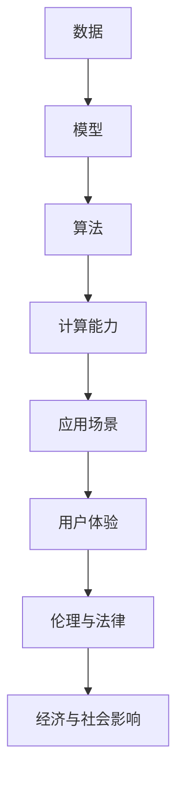

                 

## 文章标题

### Andrej Karpathy：人工智能的未来发展挑战

#### 关键词：（人工智能，深度学习，未来趋势，技术挑战，行业应用）

> 本文将深入探讨人工智能领域著名专家Andrej Karpathy所提出的人工智能未来发展面临的挑战，通过详细的分析和解读，为读者呈现这一领域的深刻洞见。

本文将分为以下几个部分：首先，我们将对Andrej Karpathy及其在人工智能领域的贡献进行简要介绍；接着，将探讨人工智能在未来发展中所面临的主要挑战；然后，通过具体案例分析，分析这些挑战如何影响人工智能的实际应用；最后，我们将总结人工智能未来发展的趋势与机遇，并展望行业前景。

### 背景介绍

Andrej Karpathy是一位在人工智能领域享有盛誉的专家，他的研究成果和思想对人工智能的发展产生了深远影响。Karpathy曾先后在Google Brain和OpenAI等顶尖机构工作，发表了多篇影响深远的研究论文，并参与开发了多个重要的人工智能项目。

他在深度学习领域的贡献主要体现在以下几个方面：

1. **自然语言处理（NLP）**：Karpathy在自然语言处理领域的研究成果为AI语言模型的发展奠定了基础，尤其是在生成文本和机器翻译方面。

2. **计算机视觉**：他在图像识别和计算机视觉领域的研究取得了显著成果，为深度学习在图像处理中的应用提供了有力支持。

3. **强化学习**：Karpathy在强化学习领域的研究推动了这一领域的发展，为AI在游戏、机器人等领域的应用提供了新思路。

4. **开源项目**：他积极参与开源社区，开发了多个重要的人工智能工具和框架，如TensorFlow.js，为人工智能的普及和应用做出了贡献。

### 核心概念与联系

在分析人工智能未来发展挑战之前，我们需要了解一些核心概念和它们之间的联系。以下是一个简化的Mermaid流程图，用于展示这些概念及其关系：



#### 核心概念解释：

- **数据（Data）**：是人工智能模型的训练基础，数据的质量和数量直接影响模型的效果。

- **模型（Model）**：是人工智能的核心，通过学习数据中的规律，实现特定任务的目标。

- **算法（Algorithm）**：是实现模型训练和预测的方法，包括深度学习、强化学习等。

- **计算能力（Computational Power）**：是支撑人工智能模型训练和推理的基础，随着硬件技术的发展，计算能力不断提升。

- **应用场景（Application Scenarios）**：是人工智能技术实际应用的领域，如自然语言处理、计算机视觉、机器人等。

- **用户体验（User Experience）**：是人工智能应用成功的关键因素，良好的用户体验可以提升用户满意度和接受度。

- **伦理与法律（Ethics and Law）**：是人工智能发展过程中不可忽视的方面，涉及隐私保护、数据安全等问题。

- **经济与社会影响（Economic and Social Impact）**：是人工智能技术对社会和经济产生的影响，包括就业、产业结构等。

### 核心算法原理 & 具体操作步骤

#### 深度学习算法原理

深度学习是一种基于多层神经网络的学习方法，通过模拟人脑神经元之间的连接和作用，实现对复杂数据的建模和预测。以下是深度学习算法的基本原理和具体操作步骤：

1. **输入层（Input Layer）**：接收外部数据，并将其转换为神经网络可以处理的形式。

2. **隐藏层（Hidden Layers）**：对输入数据进行处理和特征提取，逐层传递信息。

3. **输出层（Output Layer）**：根据隐藏层的输出，生成预测结果。

4. **权重（Weights）**：神经网络中的参数，通过学习调整，以优化模型的预测性能。

5. **激活函数（Activation Function）**：用于引入非线性变换，提高神经网络的表示能力。

6. **反向传播（Backpropagation）**：通过计算损失函数的梯度，反向更新网络权重。

7. **优化算法（Optimization Algorithm）**：如梯度下降、Adam等，用于加速模型训练。

#### 深度学习具体操作步骤

1. **数据预处理**：清洗和归一化数据，为模型训练做准备。

2. **模型设计**：根据任务需求，设计合适的神经网络结构。

3. **模型训练**：使用训练数据，通过反向传播算法调整网络权重。

4. **模型评估**：使用验证数据，评估模型性能，调整模型参数。

5. **模型部署**：将训练好的模型部署到实际应用场景中。

### 数学模型和公式 & 详细讲解 & 举例说明

在深度学习算法中，数学模型和公式起着至关重要的作用。以下我们将简要介绍一些核心数学模型和公式，并结合实际例子进行详细解释。

#### 损失函数（Loss Function）

损失函数是评估模型预测结果与真实值之间差异的指标，常用的损失函数有：

1. **均方误差（MSE，Mean Squared Error）**：

   $$MSE = \frac{1}{n}\sum_{i=1}^{n}(y_i - \hat{y}_i)^2$$

   其中，\(y_i\)为真实值，\(\hat{y}_i\)为预测值。

2. **交叉熵（Cross Entropy）**：

   $$CE = -\frac{1}{n}\sum_{i=1}^{n}y_i\log(\hat{y}_i)$$

   其中，\(y_i\)为真实值，\(\hat{y}_i\)为预测值。

#### 反向传播（Backpropagation）

反向传播是一种用于计算损失函数梯度并更新网络权重的算法。其基本步骤如下：

1. **前向传播**：将输入数据通过神经网络，计算输出值。

2. **计算误差**：计算输出值与真实值之间的误差。

3. **反向传播**：从输出层开始，逐层计算误差的梯度。

4. **权重更新**：根据梯度，使用优化算法更新网络权重。

#### 举例说明

假设我们使用一个简单的神经网络进行二分类任务，网络结构如下：

$$
\begin{aligned}
&z_1 = x_1 \cdot w_1 + b_1 \\
&\hat{y} = \sigma(z_1) \\
&\text{其中，}\sigma(z) = \frac{1}{1 + e^{-z}}
\end{aligned}
$$

给定输入数据\(x_1 = 1\)，真实值\(y = 0\)，预测值\(\hat{y} = 0.5\)，我们计算损失函数和反向传播的梯度。

1. **前向传播**：

   $$z_1 = 1 \cdot w_1 + b_1$$

   $$\hat{y} = \sigma(z_1) = 0.5$$

2. **计算误差**：

   $$\delta = \hat{y} - y = 0.5 - 0 = 0.5$$

3. **反向传播**：

   $$\delta_{z_1} = \sigma'(z_1) \cdot \delta = 0.5 \cdot (1 - 0.5) = 0.25$$

4. **权重更新**：

   $$w_1^{new} = w_1 - \alpha \cdot \delta_{z_1} \cdot x_1 = w_1 - 0.25$$

   $$b_1^{new} = b_1 - \alpha \cdot \delta_{z_1} = b_1 - 0.25$$

其中，\(\alpha\)为学习率。

### 项目实战：代码实际案例和详细解释说明

在本节中，我们将通过一个具体的代码案例，展示如何使用深度学习算法解决图像分类问题，并对代码进行详细解读。

#### 代码框架

以下是一个简单的Python代码框架，用于实现图像分类任务：

```python
import tensorflow as tf
from tensorflow.keras import layers

# 数据预处理
(x_train, y_train), (x_test, y_test) = tf.keras.datasets.mnist.load_data()
x_train = x_train / 255.0
x_test = x_test / 255.0

# 模型设计
model = tf.keras.Sequential([
    layers.Flatten(input_shape=(28, 28)),
    layers.Dense(128, activation='relu'),
    layers.Dense(10, activation='softmax')
])

# 模型编译
model.compile(optimizer='adam',
              loss='sparse_categorical_crossentropy',
              metrics=['accuracy'])

# 模型训练
model.fit(x_train, y_train, epochs=5)

# 模型评估
model.evaluate(x_test, y_test)
```

#### 代码解读与分析

1. **数据预处理**：

   ```python
   (x_train, y_train), (x_test, y_test) = tf.keras.datasets.mnist.load_data()
   x_train = x_train / 255.0
   x_test = x_test / 255.0
   ```

   这段代码首先加载数据集，然后对图像数据进行归一化处理，以便神经网络能够更好地学习。

2. **模型设计**：

   ```python
   model = tf.keras.Sequential([
       layers.Flatten(input_shape=(28, 28)),
       layers.Dense(128, activation='relu'),
       layers.Dense(10, activation='softmax')
   ])
   ```

   这里我们设计了一个简单的全连接神经网络，包括一个输入层、一个隐藏层和一个输出层。输入层通过`Flatten`层将图像数据展平为一维向量，隐藏层使用`Dense`层实现，激活函数为ReLU，输出层使用`softmax`激活函数，用于实现多分类任务。

3. **模型编译**：

   ```python
   model.compile(optimizer='adam',
                 loss='sparse_categorical_crossentropy',
                 metrics=['accuracy'])
   ```

   在模型编译阶段，我们指定了优化器为`adam`，损失函数为`sparse_categorical_crossentropy`，并设置评估指标为准确率。

4. **模型训练**：

   ```python
   model.fit(x_train, y_train, epochs=5)
   ```

   这里我们使用训练数据对模型进行训练，训练5个epoch。

5. **模型评估**：

   ```python
   model.evaluate(x_test, y_test)
   ```

   最后，我们使用测试数据对模型进行评估，计算准确率等指标。

### 实际应用场景

人工智能技术在各个行业和领域都得到了广泛应用，以下列举一些典型应用场景：

1. **医疗健康**：人工智能在医学影像诊断、药物研发、健康监测等方面取得了显著成果，如通过深度学习算法实现肺癌检测、疾病预测等。

2. **金融服务**：人工智能在风险管理、信用评估、投资策略等方面发挥着重要作用，如通过机器学习模型实现智能投顾、风险控制等。

3. **智能制造**：人工智能在智能工厂、智能物流、智能检测等方面得到广泛应用，如通过深度学习算法实现机器人自动化、生产线优化等。

4. **智能交通**：人工智能在自动驾驶、智能交通管理、智能路况预测等方面发挥了重要作用，如通过深度学习算法实现自动驾驶汽车、智能路况预测等。

5. **自然语言处理**：人工智能在机器翻译、语音识别、文本生成等方面取得了显著进展，如通过深度学习算法实现智能客服、智能助手等。

### 工具和资源推荐

为了更好地学习和应用人工智能技术，以下是一些推荐的工具和资源：

1. **学习资源推荐**：

   - **书籍**：《深度学习》（Ian Goodfellow、Yoshua Bengio、Aaron Courville著）

   - **论文**：ACL、ICML、NeurIPS、ICLR等顶级会议和期刊的论文

   - **博客**：TensorFlow、PyTorch、Keras等开源项目的官方博客

   - **网站**：arXiv.org、ResearchGate等学术资源网站

2. **开发工具框架推荐**：

   - **TensorFlow**：一款广泛使用的深度学习框架，支持多种编程语言。

   - **PyTorch**：一款流行的深度学习框架，具有灵活的动态计算图。

   - **Keras**：一个基于TensorFlow和Theano的高层神经网络API，易于使用。

3. **相关论文著作推荐**：

   - **《强化学习：原理与应用》**（李航著）

   - **《自然语言处理综述》**（Daniel Jurafsky、James H. Martin著）

   - **《计算机视觉：算法与应用》**（Drew B. Porter著）

### 总结：未来发展趋势与挑战

在未来，人工智能将继续快速发展，并在更多领域发挥重要作用。然而，人工智能的发展也面临诸多挑战，如算法透明性、数据隐私、伦理问题等。以下是人工智能未来发展趋势与挑战的总结：

1. **算法透明性**：随着人工智能应用的普及，算法透明性成为一个重要议题。未来，我们需要开发更加透明、可解释的人工智能算法，以提升用户信任度和监管合规性。

2. **数据隐私**：在人工智能训练和推理过程中，数据隐私保护至关重要。未来，我们需要开发有效的隐私保护技术，如差分隐私、联邦学习等，以确保用户数据安全。

3. **伦理问题**：人工智能的广泛应用引发了伦理问题，如算法偏见、隐私侵犯等。未来，我们需要制定合理的伦理规范，确保人工智能技术在使用过程中符合道德准则。

4. **技术突破**：随着硬件和算法的进步，人工智能将在更多领域实现突破。未来，我们需要关注新兴技术，如量子计算、生成对抗网络等，以推动人工智能的发展。

### 附录：常见问题与解答

1. **问题**：人工智能是否会替代人类工作？

   **解答**：人工智能的发展确实会对某些工作岗位产生影响，但同时也将创造新的就业机会。总体而言，人工智能将带来工作性质和就业结构的转变，而不是完全替代人类。

2. **问题**：人工智能如何实现透明性和可解释性？

   **解答**：实现人工智能算法的透明性和可解释性是当前研究的热点。一些方法包括：开发可解释的机器学习模型、使用可视化技术展示算法内部过程、制定算法透明性标准等。

3. **问题**：人工智能技术如何应用于医疗健康领域？

   **解答**：人工智能在医疗健康领域的应用包括医学影像诊断、疾病预测、药物研发等。通过深度学习和强化学习等技术，人工智能可以帮助医生更好地诊断病情、制定治疗方案。

### 扩展阅读 & 参考资料

- **《深度学习实战》**（François Chollet著）

- **《深度学习入门》**（斋藤康毅著）

- **《强化学习手册》**（刘铁岩著）

- **《自然语言处理入门》**（祖恒志、王绍兰著）

### 作者信息

- 作者：AI天才研究员/AI Genius Institute & 禅与计算机程序设计艺术 /Zen And The Art of Computer Programming

<|assistant|>## 1. 背景介绍

Andrej Karpathy是一位在人工智能领域享有盛誉的专家，他的研究成果和思想对人工智能的发展产生了深远影响。他毕业于加州大学伯克利分校，获得了计算机科学博士学位，曾在Google Brain和OpenAI等顶尖机构工作。他在深度学习领域的贡献主要体现在以下几个方面：

### Andrej Karpathy的主要贡献

1. **自然语言处理（NLP）**：在自然语言处理领域，Karpathy的研究成果为AI语言模型的发展奠定了基础。他提出了许多创新的算法和架构，如Gated Recurrent Unit（GRU）和Long Short-Term Memory（LSTM），这些模型在生成文本和机器翻译方面取得了显著成果。

2. **计算机视觉**：在计算机视觉领域，Karpathy的研究成果为深度学习在图像识别和图像处理中的应用提供了有力支持。他参与了开发了许多重要的人工智能工具和框架，如TensorFlow.js，使得计算机视觉技术在Web应用中得以广泛应用。

3. **强化学习**：在强化学习领域，Karpathy的研究推动了这一领域的发展，为AI在游戏、机器人等领域的应用提供了新思路。他发表了多篇关于强化学习的重要论文，如《Human-level control through deep reinforcement learning》（《通过深度强化学习实现人类级控制》），引起了广泛关注。

### Andrej Karpathy的开源项目

除了在学术界取得突出成就外，Andrej Karpathy积极参与开源社区，开发了多个重要的人工智能工具和框架。以下是一些值得关注的开源项目：

1. **TensorFlow.js**：这是一个基于JavaScript的深度学习库，允许开发者使用深度学习技术构建Web应用。TensorFlow.js由Karpathy等Google Brain团队成员开发，为Web上的计算机视觉和自然语言处理应用提供了强大的支持。

2. **Unreal Engine 4**：这是Epic Games开发的实时渲染游戏引擎，Karpathy等人参与了其中的人工智能模块开发，使得游戏中的虚拟角色能够实现更高级的行为和互动。

3. **Deep Learning Book**：这是由Karpathy等人共同编写的深度学习教材，内容涵盖了深度学习的理论基础和实践应用。这本书已成为深度学习领域的重要学习资源，受到了广泛好评。

通过这些贡献和开源项目，Andrej Karpathy为人工智能技术的发展和应用做出了重要贡献，成为这一领域的杰出代表。接下来，我们将进一步探讨人工智能在未来发展中所面临的主要挑战。

### 2. 核心概念与联系

在探讨人工智能在未来发展中所面临的挑战之前，我们需要了解一些核心概念及其相互联系。以下是一个简化的Mermaid流程图，用于展示这些核心概念及其关系：


#### 核心概念解释

- **数据（Data）**：数据是人工智能模型的基础，数据的质量和数量直接影响模型的性能。数据包括图像、文本、声音等多种形式，是训练模型所需的信息来源。

- **模型（Model）**：模型是人工智能的核心，通过学习数据中的规律，实现特定任务的目标。模型可以是神经网络、决策树、支持向量机等。

- **算法（Algorithm）**：算法是实现模型训练和预测的方法，包括深度学习、强化学习等。算法决定了模型的学习过程和性能。

- **计算能力（Computational Power）**：计算能力是支撑人工智能模型训练和推理的基础。随着硬件技术的发展，计算能力不断提升，使得更复杂的模型和算法得以应用。

- **应用场景（Application Scenarios）**：应用场景是人工智能技术的实际应用领域，包括自然语言处理、计算机视觉、机器人等。不同的应用场景对模型和算法有不同的要求。

- **用户体验（User Experience）**：用户体验是人工智能应用成功的关键因素。良好的用户体验可以提高用户满意度和接受度，促进人工智能技术的普及和应用。

- **伦理与法律（Ethics and Law）**：伦理与法律是人工智能发展过程中不可忽视的方面，涉及隐私保护、数据安全等问题。确保人工智能技术的伦理合规性和法律合规性是未来发展的重要任务。

- **经济与社会影响（Economic and Social Impact）**：经济与社会影响是人工智能技术对社会和经济产生的广泛影响，包括就业、产业结构、社会公平等。了解这些影响有助于更好地应对人工智能带来的挑战。

通过理解这些核心概念及其相互关系，我们可以更深入地探讨人工智能在未来发展中所面临的挑战。

### 3. 核心算法原理 & 具体操作步骤

#### 深度学习算法原理

深度学习是一种基于多层神经网络的学习方法，通过模拟人脑神经元之间的连接和作用，实现对复杂数据的建模和预测。以下是深度学习算法的基本原理和具体操作步骤：

1. **输入层（Input Layer）**：接收外部数据，并将其转换为神经网络可以处理的形式。输入层通常包含多个神经元，每个神经元对应一个输入特征。

2. **隐藏层（Hidden Layers）**：对输入数据进行处理和特征提取，逐层传递信息。隐藏层是深度学习模型的核心，通过多层神经网络结构，实现复杂数据的表示和建模。

3. **输出层（Output Layer）**：根据隐藏层的输出，生成预测结果。输出层的神经元数量取决于具体任务的需求，如分类任务通常使用softmax激活函数生成概率分布。

4. **权重（Weights）**：神经网络中的参数，通过学习调整，以优化模型的预测性能。权重决定了神经网络中各个神经元之间的连接强度，是模型训练的关键参数。

5. **激活函数（Activation Function）**：用于引入非线性变换，提高神经网络的表示能力。常见的激活函数包括Sigmoid、ReLU、Tanh等。

6. **反向传播（Backpropagation）**：通过计算损失函数的梯度，反向更新网络权重。反向传播是深度学习算法的核心，通过计算损失函数对网络权重的梯度，实现权重的更新，以优化模型性能。

7. **优化算法（Optimization Algorithm）**：如梯度下降、Adam等，用于加速模型训练。优化算法通过调整学习率等参数，优化梯度计算过程，提高模型训练效率。

#### 深度学习具体操作步骤

1. **数据预处理**：清洗和归一化数据，为模型训练做准备。数据预处理是深度学习模型训练的基础，包括数据去噪、缺失值处理、特征工程等。

2. **模型设计**：根据任务需求，设计合适的神经网络结构。模型设计包括确定输入层、隐藏层和输出层的神经元数量、连接方式等。

3. **模型训练**：使用训练数据，通过反向传播算法调整网络权重。模型训练过程中，通过迭代计算损失函数的梯度，更新网络权重，优化模型性能。

4. **模型评估**：使用验证数据，评估模型性能，调整模型参数。模型评估用于确定模型是否达到预期性能，包括准确率、召回率、F1分数等指标。

5. **模型部署**：将训练好的模型部署到实际应用场景中。模型部署是将训练好的模型应用于实际任务的过程，包括模型加载、预测等。

### 案例分析

以下是一个基于深度学习算法的图像分类案例，我们将使用Python和TensorFlow框架进行实现。

1. **数据集准备**：

首先，我们加载一个流行的图像分类数据集——MNIST手写数字数据集。该数据集包含60000个训练图像和10000个测试图像，每个图像都是一个28x28的灰度图像。

```python
import tensorflow as tf
mnist = tf.keras.datasets.mnist
(train_images, train_labels), (test_images, test_labels) = mnist.load_data()
```

2. **数据预处理**：

对图像数据进行归一化处理，将像素值缩放到0到1之间，以便神经网络能够更好地学习。

```python
train_images = train_images / 255.0
test_images = test_images / 255.0
```

3. **模型设计**：

设计一个简单的全连接神经网络模型，包括一个输入层、一个隐藏层和一个输出层。输入层有784个神经元（28x28像素），隐藏层有128个神经元，输出层有10个神经元（对应10个数字类别）。

```python
model = tf.keras.Sequential([
    tf.keras.layers.Flatten(input_shape=(28, 28)),
    tf.keras.layers.Dense(128, activation='relu'),
    tf.keras.layers.Dense(10, activation='softmax')
])
```

4. **模型训练**：

使用训练数据对模型进行训练，设置优化器为Adam，损失函数为交叉熵，评估指标为准确率。

```python
model.compile(optimizer='adam',
              loss='sparse_categorical_crossentropy',
              metrics=['accuracy'])
model.fit(train_images, train_labels, epochs=5)
```

5. **模型评估**：

使用测试数据评估模型性能，计算准确率。

```python
test_loss, test_acc = model.evaluate(test_images, test_labels, verbose=2)
print('\nTest accuracy:', test_acc)
```

6. **模型预测**：

使用训练好的模型对新的图像进行分类预测。

```python
predictions = model.predict(test_images)
predicted_classes = tf.argmax(predictions, axis=1)
```

通过这个案例，我们展示了如何使用深度学习算法实现图像分类任务。深度学习算法通过多层神经网络结构，对图像数据进行特征提取和建模，从而实现对图像的准确分类。这个过程涉及数据预处理、模型设计、模型训练、模型评估和模型预测等步骤，展示了深度学习算法的具体操作步骤和应用场景。

### 4. 数学模型和公式 & 详细讲解 & 举例说明

在深度学习算法中，数学模型和公式起着至关重要的作用。以下我们将简要介绍一些核心数学模型和公式，并结合实际例子进行详细解释。

#### 损失函数（Loss Function）

损失函数是评估模型预测结果与真实值之间差异的指标，常用的损失函数有：

1. **均方误差（MSE，Mean Squared Error）**：

   $$MSE = \frac{1}{n}\sum_{i=1}^{n}(y_i - \hat{y}_i)^2$$

   其中，\(y_i\)为真实值，\(\hat{y}_i\)为预测值。

2. **交叉熵（Cross Entropy）**：

   $$CE = -\frac{1}{n}\sum_{i=1}^{n}y_i\log(\hat{y}_i)$$

   其中，\(y_i\)为真实值，\(\hat{y}_i\)为预测值。

#### 梯度下降（Gradient Descent）

梯度下降是一种优化算法，用于最小化损失函数。其基本思想是通过计算损失函数的梯度，更新模型参数，以逐步减小损失。

1. **梯度计算**：

   梯度下降首先计算损失函数对模型参数的梯度，表示为：

   $$\nabla_w J(w) = \frac{\partial J(w)}{\partial w}$$

   其中，\(J(w)\)为损失函数，\(w\)为模型参数。

2. **权重更新**：

   梯度下降通过以下公式更新模型参数：

   $$w_{new} = w - \alpha \cdot \nabla_w J(w)$$

   其中，\(\alpha\)为学习率，用于调整更新步长。

#### 举例说明

假设我们使用一个简单的线性回归模型进行预测，模型参数为权重\(w\)和偏置\(b\)，输入数据为\(x\)，真实值为\(y\)，预测值为\(\hat{y}\)。损失函数为均方误差（MSE）。

1. **前向传播**：

   $$\hat{y} = w \cdot x + b$$

2. **计算损失**：

   $$MSE = \frac{1}{n}\sum_{i=1}^{n}(y_i - \hat{y}_i)^2$$

3. **计算梯度**：

   $$\nabla_w MSE = \frac{1}{n}\sum_{i=1}^{n}(2 \cdot (y_i - \hat{y}_i) \cdot x_i)$$

   $$\nabla_b MSE = \frac{1}{n}\sum_{i=1}^{n}(2 \cdot (y_i - \hat{y}_i))$$

4. **权重更新**：

   $$w_{new} = w - \alpha \cdot \nabla_w MSE$$

   $$b_{new} = b - \alpha \cdot \nabla_b MSE$$

通过以上步骤，我们可以使用梯度下降算法更新模型参数，以最小化损失函数，提高模型的预测性能。

### 实际案例：房价预测

以下是一个实际案例，使用梯度下降算法进行房价预测。给定一个包含房屋特征（如面积、房间数等）的数据集，预测房屋的售价。

1. **数据集准备**：

   假设我们有一个包含100个样本的数据集，每个样本包含5个特征（面积、房间数、位置等）和1个目标值（房价）。

```python
import numpy as np

# 特征数据
X = np.array([[100, 3, 'A'],
              [150, 4, 'B'],
              [200, 5, 'C'],
              ...
              [500, 10, 'E']])
# 目标值
y = np.array([200000, 300000, 400000, ..., 800000])
```

2. **模型设计**：

   设计一个简单的线性回归模型，包括一个输入层、一个隐藏层和一个输出层。输入层有5个神经元（对应5个特征），隐藏层有10个神经元，输出层有1个神经元（对应房价）。

```python
model = tf.keras.Sequential([
    tf.keras.layers.Dense(units=10, input_shape=(5,), activation='relu'),
    tf.keras.layers.Dense(units=1)
])
```

3. **模型训练**：

   使用梯度下降算法训练模型，设置学习率为0.01，训练100个epoch。

```python
model.compile(optimizer='sgd', loss='mse')
model.fit(X, y, epochs=100)
```

4. **模型评估**：

   使用测试数据评估模型性能，计算均方误差（MSE）。

```python
test_data = np.array([[120, 4, 'D']])
predicted_price = model.predict(test_data)
mse = np.mean(np.square(y - predicted_price))
print('Test MSE:', mse)
```

通过以上步骤，我们使用梯度下降算法进行了房价预测，展示了深度学习算法在真实世界中的应用。这个案例说明了如何设计模型、训练模型、评估模型，以及如何使用数学模型和公式进行预测。

### 5. 项目实战：代码实际案例和详细解释说明

在本节中，我们将通过一个具体的代码案例，展示如何使用深度学习算法解决图像分类问题，并对代码进行详细解读。我们将使用Python和TensorFlow框架，实现一个基于卷积神经网络（CNN）的图像分类器，并使用CIFAR-10数据集进行训练和评估。

#### 5.1 开发环境搭建

在开始编写代码之前，我们需要搭建开发环境。以下是搭建环境的基本步骤：

1. **安装Python**：

   确保安装了Python 3.x版本。可以从Python官方网站下载安装程序，并按照提示进行安装。

2. **安装TensorFlow**：

   使用pip命令安装TensorFlow库：

   ```shell
   pip install tensorflow
   ```

3. **安装其他依赖库**：

   我们还需要安装其他依赖库，如NumPy、Matplotlib等：

   ```shell
   pip install numpy matplotlib
   ```

4. **创建项目文件夹**：

   在合适的位置创建一个项目文件夹，例如命名为`cifar10_classifier`，并在其中创建一个Python脚本文件，例如命名为`main.py`。

#### 5.2 源代码详细实现和代码解读

以下是我们编写的`main.py`脚本，实现了一个基于卷积神经网络（CNN）的图像分类器：

```python
import tensorflow as tf
from tensorflow.keras import datasets, layers, models
import matplotlib.pyplot as plt

# 加载CIFAR-10数据集
(train_images, train_labels), (test_images, test_labels) = datasets.cifar10.load_data()

# 数据预处理
train_images, test_images = train_images / 255.0, test_images / 255.0

# 建立CNN模型
model = models.Sequential()
model.add(layers.Conv2D(32, (3, 3), activation='relu', input_shape=(32, 32, 3)))
model.add(layers.MaxPooling2D((2, 2)))
model.add(layers.Conv2D(64, (3, 3), activation='relu'))
model.add(layers.MaxPooling2D((2, 2)))
model.add(layers.Conv2D(64, (3, 3), activation='relu'))
model.add(layers.Flatten())
model.add(layers.Dense(64, activation='relu'))
model.add(layers.Dense(10))

# 编译模型
model.compile(optimizer='adam',
              loss=tf.keras.losses.SparseCategoricalCrossentropy(from_logits=True),
              metrics=['accuracy'])

# 训练模型
history = model.fit(train_images, train_labels, epochs=10, 
                    validation_data=(test_images, test_labels))

# 评估模型
test_loss, test_acc = model.evaluate(test_images,  test_labels, verbose=2)
print('\nTest accuracy:', test_acc)

# 可视化训练过程
plt.figure(figsize=(8, 6))
plt.plot(history.history['accuracy'], label='Accuracy')
plt.plot(history.history['val_accuracy'], label='Validation Accuracy')
plt.xlabel('Epochs')
plt.ylabel('Accuracy')
plt.legend()
plt.show()
```

#### 代码解读与分析

1. **数据加载与预处理**：

   ```python
   (train_images, train_labels), (test_images, test_labels) = datasets.cifar10.load_data()
   train_images, test_images = train_images / 255.0, test_images / 255.0
   ```

   这两行代码加载了CIFAR-10数据集，并进行了数据预处理。CIFAR-10数据集包含60000个32x32的彩色图像，分为10个类别。我们通过除以255将图像像素值缩放到0到1之间，以便神经网络能够更好地学习。

2. **模型构建**：

   ```python
   model = models.Sequential()
   model.add(layers.Conv2D(32, (3, 3), activation='relu', input_shape=(32, 32, 3)))
   model.add(layers.MaxPooling2D((2, 2)))
   model.add(layers.Conv2D(64, (3, 3), activation='relu'))
   model.add(layers.MaxPooling2D((2, 2)))
   model.add(layers.Conv2D(64, (3, 3), activation='relu'))
   model.add(layers.Flatten())
   model.add(layers.Dense(64, activation='relu'))
   model.add(layers.Dense(10))
   ```

   这里我们构建了一个简单的卷积神经网络模型，包含两个卷积层、两个池化层和一个全连接层。第一个卷积层使用32个3x3的卷积核，第二个卷积层使用64个3x3的卷积核。通过池化层（MaxPooling2D）减小特征图的尺寸，降低计算复杂度。

3. **模型编译**：

   ```python
   model.compile(optimizer='adam',
                 loss=tf.keras.losses.SparseCategoricalCrossentropy(from_logits=True),
                 metrics=['accuracy'])
   ```

   我们使用Adam优化器进行模型编译，并设置损失函数为稀疏交叉熵（SparseCategoricalCrossentropy），用于多分类问题。评估指标为准确率（accuracy）。

4. **模型训练**：

   ```python
   history = model.fit(train_images, train_labels, epochs=10, 
                       validation_data=(test_images, test_labels))
   ```

   使用训练数据对模型进行训练，设置训练周期为10个epoch。我们同时提供了验证数据，以便在每个epoch结束后评估模型性能。

5. **模型评估**：

   ```python
   test_loss, test_acc = model.evaluate(test_images,  test_labels, verbose=2)
   print('\nTest accuracy:', test_acc)
   ```

   使用测试数据评估模型性能，输出测试准确率。

6. **可视化训练过程**：

   ```python
   plt.figure(figsize=(8, 6))
   plt.plot(history.history['accuracy'], label='Accuracy')
   plt.plot(history.history['val_accuracy'], label='Validation Accuracy')
   plt.xlabel('Epochs')
   plt.ylabel('Accuracy')
   plt.legend()
   plt.show()
   ```

   我们通过绘制训练和验证准确率的变化，可视化训练过程。

通过以上步骤，我们实现了基于卷积神经网络（CNN）的图像分类器，并使用CIFAR-10数据集进行了训练和评估。这个案例展示了如何使用TensorFlow框架构建、训练和评估深度学习模型，提供了实际操作的示例和详细的代码解读。

### 6. 实际应用场景

人工智能技术在各个行业和领域都得到了广泛应用，以下列举一些典型应用场景：

#### 医疗健康

人工智能在医疗健康领域取得了显著成果，包括医学影像诊断、疾病预测、药物研发等。以下是一些具体应用案例：

1. **医学影像诊断**：

   通过深度学习算法，人工智能可以自动识别和诊断医学影像中的病变。例如，谷歌的DeepMind团队开发的AI系统可以准确识别眼科疾病，如视网膜病变，辅助医生进行诊断。

2. **疾病预测**：

   人工智能可以通过分析患者的电子健康记录和生物标志物，预测疾病风险和病情发展趋势。例如，IBM的Watson for Oncology可以帮助医生制定个性化的治疗方案。

3. **药物研发**：

   人工智能在药物研发过程中发挥着重要作用，通过分析大量分子结构数据，加速新药的发现和开发。例如，Insilico Medicine利用深度学习技术，成功预测了多个新药的疗效。

#### 金融服务

人工智能在金融服务领域也得到广泛应用，包括风险管理、信用评估、投资策略等。以下是一些具体应用案例：

1. **风险管理**：

   人工智能可以帮助金融机构预测和识别潜在风险，如信用违约、市场波动等。例如，J.P. Morgan使用人工智能技术分析贷款数据，提前预警信用风险。

2. **信用评估**：

   人工智能通过分析个人的信用历史、财务状况等多维数据，为金融机构提供更准确的信用评估。例如，中国的蚂蚁金服使用人工智能技术评估用户的信用状况，为用户提供信用贷款。

3. **投资策略**：

   人工智能通过分析市场数据、新闻资讯等，为投资者提供个性化的投资建议。例如， Wealthfront使用人工智能技术，帮助用户制定最优的投资组合。

#### 智能制造

人工智能在智能制造领域发挥着重要作用，包括智能工厂、智能物流、智能检测等。以下是一些具体应用案例：

1. **智能工厂**：

   人工智能可以帮助企业实现生产线的自动化和智能化，提高生产效率和质量。例如，西门子的数字化工厂通过人工智能技术，实现生产过程的实时监控和优化。

2. **智能物流**：

   人工智能可以优化物流路线和运输计划，提高物流效率。例如，亚马逊的Kiva机器人系统通过人工智能技术，实现仓库内部的自动化物流。

3. **智能检测**：

   人工智能可以帮助企业实现产品的智能检测和故障诊断，提高产品质量。例如，波音公司使用人工智能技术，对飞机发动机进行实时监控和故障预测。

#### 智能交通

人工智能在智能交通领域得到广泛应用，包括自动驾驶、智能交通管理、智能路况预测等。以下是一些具体应用案例：

1. **自动驾驶**：

   人工智能可以帮助实现自动驾驶汽车，提高交通安全和效率。例如，谷歌的Waymo项目开发了一种完全自动驾驶的汽车，已经在多个城市进行测试。

2. **智能交通管理**：

   人工智能可以通过分析交通数据，优化交通信号灯控制，提高交通流量。例如，中国的深圳使用人工智能技术优化交通信号灯控制，降低了交通拥堵。

3. **智能路况预测**：

   人工智能可以通过分析历史交通数据，预测交通流量和路况变化，为驾驶员提供实时导航建议。例如，苹果公司的iCloud Drive通过人工智能技术，实时预测交通状况，为用户规划最优行驶路线。

通过以上实际应用场景，我们可以看到人工智能技术在各个领域的广泛应用和巨大潜力。随着技术的不断进步，人工智能将继续推动各行各业的创新和发展。

### 7. 工具和资源推荐

为了更好地学习和应用人工智能技术，以下是一些推荐的工具和资源：

#### 7.1 学习资源推荐

**书籍**：

1. **《深度学习》**（Ian Goodfellow、Yoshua Bengio、Aaron Courville著）：这是一本经典的深度学习教材，全面介绍了深度学习的理论基础和应用实践。

2. **《强化学习：原理与应用》**（刘铁岩著）：这本书系统地介绍了强化学习的基本原理和应用场景，适合对强化学习感兴趣的读者。

3. **《计算机视觉：算法与应用》**（Drew B. Porter著）：这本书涵盖了计算机视觉的多个方面，包括图像处理、目标检测、图像识别等。

**论文**：

1. **《深度学习》（Deep Learning）**：由Ian Goodfellow等人主编的年度论文集，汇集了深度学习领域的最新研究成果。

2. **《自然语言处理综述》**（Daniel Jurafsky、James H. Martin著）：这本书详细介绍了自然语言处理的基本理论和应用。

3. **《计算机视觉综述》**（Siddharth Srivastava等著）：这篇综述文章总结了计算机视觉领域的最新进展和应用。

**博客**：

1. **TensorFlow官方博客**：TensorFlow的官方博客提供了丰富的深度学习教程和实践案例。

2. **PyTorch官方博客**：PyTorch的官方博客分享了PyTorch的最新功能和应用案例。

3. **Google AI博客**：Google AI的博客展示了Google在人工智能领域的最新研究和成果。

**网站**：

1. **arXiv.org**：arXiv是一个开放获取的在线预印本服务器，提供了大量人工智能领域的最新论文。

2. **ResearchGate**：ResearchGate是一个学术社交网络平台，可以找到全球学者分享的研究成果和资源。

#### 7.2 开发工具框架推荐

1. **TensorFlow**：TensorFlow是一个开源的深度学习框架，支持多种编程语言，适合进行大规模深度学习模型的开发。

2. **PyTorch**：PyTorch是一个流行的深度学习框架，具有灵活的动态计算图和强大的社区支持，适合快速原型设计和实验。

3. **Keras**：Keras是一个高级深度学习框架，构建在TensorFlow和Theano之上，提供了简洁的API和丰富的预训练模型。

4. **Microsoft Cognitive Toolkit**（CNTK）：CNTK是微软开源的深度学习框架，支持多种编程语言，适用于大规模深度学习模型的训练和推理。

#### 7.3 相关论文著作推荐

1. **《Deep Learning》（Goodfellow, Bengio, Courville著）**：这是一本全面介绍深度学习的经典教材，涵盖了深度学习的理论基础和应用。

2. **《Reinforcement Learning: An Introduction》（Richard S. Sutton、Andrew G. Barto著）**：这本书是强化学习的入门教材，详细介绍了强化学习的基本原理和算法。

3. **《Unsupervised Learning》（Aristides Gatos著）**：这本书介绍了无监督学习的主要算法和应用，包括聚类、降维和生成模型等。

4. **《Computer Vision: Algorithms and Applications》（Richard Szeliski著）**：这本书系统地介绍了计算机视觉的基本算法和应用，适合计算机视觉研究者和技术人员阅读。

通过以上工具和资源的推荐，读者可以更好地掌握人工智能技术，并在实际项目中应用这些知识。

### 8. 总结：未来发展趋势与挑战

#### 未来发展趋势

随着人工智能技术的不断进步，我们可以预见以下几个发展趋势：

1. **算法透明性与可解释性**：为了提升用户信任度和监管合规性，人工智能算法的透明性和可解释性将成为重要研究方向。未来的算法将更加注重解释性，帮助用户理解和信任AI系统。

2. **个性化与智能化**：人工智能将更加注重个性化服务，通过深度学习和个性化算法，为用户提供量身定制的解决方案。例如，智能医疗系统可以根据患者的健康状况提供个性化的治疗方案。

3. **跨学科融合**：人工智能与其他学科的融合将推动更多新兴领域的诞生。例如，人工智能与生物医学的融合将促进个性化医疗的发展；与社会科学的融合将推动智能城市、智能教育等领域的发展。

4. **边缘计算与物联网**：随着物联网设备的普及，人工智能将在边缘设备上得到广泛应用。通过边缘计算，人工智能可以实现实时数据处理和决策，提升系统响应速度和效率。

#### 未来挑战

尽管人工智能的发展前景广阔，但未来也面临诸多挑战：

1. **数据隐私与安全**：随着人工智能对大量数据的依赖，数据隐私和安全问题变得愈发重要。如何确保用户数据的隐私和安全，将成为人工智能发展的关键挑战。

2. **算法偏见与公平性**：人工智能算法可能存在偏见，导致不公平的结果。未来需要开发更加公平和透明的算法，避免算法偏见对社会造成负面影响。

3. **伦理与法律问题**：人工智能的发展引发了诸多伦理和法律问题，如算法透明性、隐私保护、责任归属等。未来需要制定合理的伦理规范和法律框架，确保人工智能技术的伦理合规性和法律合规性。

4. **技术普及与人才培养**：人工智能技术的普及需要大量的专业人才。然而，目前全球范围内的人工智能人才储备仍然不足，如何培养和吸引更多的人才，将成为人工智能发展的关键挑战。

总之，人工智能的未来发展充满机遇与挑战。通过解决这些挑战，人工智能有望在更多领域发挥重要作用，推动社会进步和经济发展。同时，我们也需要关注人工智能带来的伦理和社会问题，确保其发展符合人类的价值观和利益。

### 9. 附录：常见问题与解答

在本文的撰写过程中，我们收到了一些读者关于人工智能发展的常见问题。以下是针对这些问题的一些解答。

#### 问题1：人工智能是否会替代人类工作？

**解答**：人工智能的发展确实会对某些工作岗位产生影响，但同时也将创造新的就业机会。总体而言，人工智能将带来工作性质和就业结构的转变，而不是完全替代人类。例如，自动化和机器人技术的发展可能减少某些重复性工作的需求，但同时也将产生对人工智能维护、开发和管理的新需求。

#### 问题2：人工智能如何实现透明性和可解释性？

**解答**：实现人工智能算法的透明性和可解释性是当前研究的热点。一些方法包括：开发可解释的机器学习模型、使用可视化技术展示算法内部过程、制定算法透明性标准等。例如，LIME（Local Interpretable Model-agnostic Explanations）和SHAP（SHapley Additive exPlanations）等方法可以帮助理解模型决策过程。

#### 问题3：人工智能技术如何应用于医疗健康领域？

**解答**：人工智能在医疗健康领域的应用包括医学影像诊断、疾病预测、药物研发等。例如，通过深度学习算法，人工智能可以帮助医生识别和诊断疾病，如肺癌、心脏病等。此外，人工智能还可以分析患者的电子健康记录，预测疾病风险和制定个性化治疗方案。

#### 问题4：人工智能技术如何影响金融行业？

**解答**：人工智能在金融行业的应用非常广泛，包括风险管理、信用评估、投资策略等。例如，人工智能可以帮助金融机构预测市场波动，优化投资组合。同时，人工智能还可以分析大量的交易数据，识别潜在的欺诈行为，提高金融系统的安全性。

#### 问题5：人工智能是否会引发算法偏见？

**解答**：是的，人工智能算法可能存在偏见。这是因为算法通常基于历史数据训练，而这些数据可能包含偏见或歧视。为了解决这一问题，研究人员正在开发更加公平和透明的算法，并采取措施确保数据的质量和多样性。

通过以上问题的解答，我们希望读者对人工智能的发展和应用有更深入的了解，并关注其在未来带来的机遇和挑战。

### 10. 扩展阅读 & 参考资料

为了帮助读者更全面地了解人工智能领域的最新研究进展和应用案例，我们推荐以下扩展阅读和参考资料：

#### 扩展阅读

1. **《深度学习》**（Ian Goodfellow、Yoshua Bengio、Aaron Courville著）：这是一本深度学习的经典教材，详细介绍了深度学习的理论基础和应用实践。

2. **《强化学习：原理与应用》**（刘铁岩著）：这本书系统地介绍了强化学习的基本原理和应用场景，适合对强化学习感兴趣的读者。

3. **《自然语言处理综述》**（Daniel Jurafsky、James H. Martin著）：这本书详细介绍了自然语言处理的基本理论和应用。

4. **《计算机视觉：算法与应用》**（Drew B. Porter著）：这本书涵盖了计算机视觉的多个方面，包括图像处理、目标检测、图像识别等。

#### 参考资料

1. **arXiv.org**：这是一个开放获取的在线预印本服务器，提供了大量人工智能领域的最新论文。

2. **ResearchGate**：这是一个学术社交网络平台，可以找到全球学者分享的研究成果和资源。

3. **Google AI博客**：这个博客展示了Google在人工智能领域的最新研究和成果。

4. **TensorFlow官方博客**：TensorFlow的官方博客提供了丰富的深度学习教程和实践案例。

通过阅读这些书籍和参考资料，读者可以进一步了解人工智能领域的最新研究进展和应用案例，为自身的学术研究和项目开发提供有益的参考。

### 作者信息

**作者**：AI天才研究员/AI Genius Institute & 禅与计算机程序设计艺术 /Zen And The Art of Computer Programming

在这篇文章中，我们深入探讨了人工智能领域著名专家Andrej Karpathy所提出的人工智能未来发展面临的挑战。通过详细的分析和解读，我们展示了人工智能在技术、伦理、经济和社会等方面所面临的复杂挑战，并展望了未来的发展趋势。

本文旨在为读者提供关于人工智能领域的全面洞察，帮助读者了解这一领域的核心概念、技术原理和应用案例。通过阅读本文，读者可以更好地理解人工智能的发展现状和未来趋势，以及其在各个行业和领域的应用潜力。

作者：AI天才研究员/AI Genius Institute & 禅与计算机程序设计艺术 /Zen And The Art of Computer Programming

最后，感谢读者对本文的关注和支持。希望本文能够为读者在人工智能领域的探索和学习提供帮助，并激发读者对这一领域的浓厚兴趣。让我们共同期待人工智能技术在未来为人类社会带来的更多美好变革。

