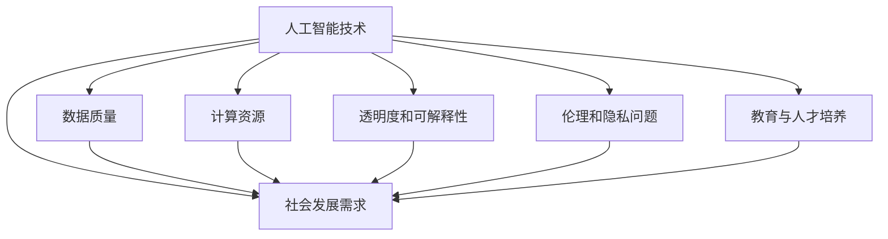

                 

### 文章标题：Andrej Karpathy：人工智能的未来发展挑战

> **关键词：**人工智能，未来，挑战，技术，发展
> 
> **摘要：**本文旨在分析人工智能领域专家Andrej Karpathy对未来人工智能发展的观点和面临的挑战。通过对核心概念、算法原理、数学模型和实际应用场景的深入探讨，本文将揭示人工智能未来面临的机遇与挑战，为读者提供深刻的思考。

### 1. 背景介绍

Andrej Karpathy是一位在人工智能领域享有盛誉的专家，他的工作涵盖了从深度学习到自然语言处理等多个方面。他的观点不仅基于自己的研究成果，也融合了业内其他专家的看法。本文将围绕Andrej Karpathy提出的几个关键问题，探讨人工智能未来的发展挑战。

#### 1.1 Andrej Karpathy的核心观点

- **人工智能的发展速度**：人工智能的发展速度远远超出了人们的预期。尽管取得了显著的进步，但人工智能仍面临着许多未解决的问题。

- **技术的实际应用**：人工智能技术的实际应用仍存在许多障碍，包括数据质量、计算资源、以及技术的透明度和可解释性。

- **伦理和隐私问题**：随着人工智能的普及，隐私和伦理问题变得越来越重要。如何平衡技术的进步与个人隐私的保护是一个亟待解决的问题。

- **教育与人才培养**：随着人工智能技术的发展，教育和人才培养模式也需要随之调整。如何培养更多具备人工智能知识和技能的人才成为了一个挑战。

### 2. 核心概念与联系

为了更好地理解人工智能的未来发展挑战，我们需要先了解一些核心概念和它们之间的联系。以下是几个关键概念及其关系的Mermaid流程图：



#### 2.1 人工智能技术

人工智能技术是本文讨论的核心。它包括机器学习、深度学习、自然语言处理等子领域。人工智能技术的发展推动了各行各业的变革，从医疗到金融，从制造业到服务业。

#### 2.2 数据质量

数据质量是人工智能技术的基石。高质量的数据可以提升模型的性能，而低质量的数据则可能导致模型过拟合或泛化能力不足。因此，数据清洗、数据预处理和数据质量控制成为人工智能领域的重要研究方向。

#### 2.3 计算资源

计算资源是人工智能技术发展的关键限制因素。深度学习模型通常需要大量的计算资源和时间来训练。随着模型复杂性的增加，对计算资源的需求也在不断增长。

#### 2.4 透明度和可解释性

随着人工智能技术的广泛应用，透明度和可解释性变得尤为重要。用户需要了解人工智能系统是如何做出决策的，以确保系统的公平性和可信赖性。

#### 2.5 伦理和隐私问题

人工智能技术的发展引发了诸多伦理和隐私问题。如何保护用户的隐私，防止数据泄露，以及如何确保人工智能系统的公平性和透明性成为人工智能领域的重要挑战。

#### 2.6 教育与人才培养

随着人工智能技术的快速发展，教育和人才培养模式也需要相应调整。培养更多具备人工智能知识和技能的人才对于推动技术进步和社会发展至关重要。

#### 2.7 社会发展需求

人工智能技术的发展与社会的需求密切相关。随着社会对人工智能技术的依赖日益增加，如何满足社会发展需求，解决实际问题成为人工智能领域的重要任务。

### 3. 核心算法原理 & 具体操作步骤

在了解核心概念和联系后，我们接下来将探讨人工智能领域的一些核心算法原理和具体操作步骤。

#### 3.1 机器学习算法

机器学习算法是人工智能技术的基石。它们通过学习数据来发现模式和关系，并利用这些模式进行预测和决策。常见的机器学习算法包括线性回归、决策树、支持向量机、神经网络等。

具体操作步骤如下：

1. 数据收集和预处理：收集相关数据，并进行数据清洗、数据预处理和数据标注。

2. 算法选择：根据问题的特点选择合适的机器学习算法。

3. 模型训练：使用训练数据集对模型进行训练，调整模型的参数。

4. 模型评估：使用测试数据集评估模型的性能，并调整模型参数以优化性能。

5. 预测和决策：使用训练好的模型对新的数据进行预测和决策。

#### 3.2 深度学习算法

深度学习算法是机器学习的一种子领域，它在图像识别、语音识别、自然语言处理等领域取得了显著的成果。深度学习算法的核心是神经网络，它通过多层神经元之间的连接来模拟人脑的学习过程。

具体操作步骤如下：

1. 数据收集和预处理：与机器学习类似，收集和预处理数据。

2. 神经网络架构设计：设计合适的神经网络架构，包括网络层数、神经元数量、激活函数等。

3. 模型训练：使用反向传播算法训练神经网络，调整网络参数。

4. 模型评估：评估神经网络模型在测试数据集上的性能。

5. 预测和决策：使用训练好的模型对新的数据进行预测和决策。

#### 3.3 自然语言处理算法

自然语言处理（NLP）是人工智能领域的一个重要分支，它涉及语言的理解、生成和翻译。NLP算法包括词向量表示、语言模型、文本分类、命名实体识别等。

具体操作步骤如下：

1. 数据收集和预处理：收集和预处理文本数据。

2. 词向量表示：将文本数据转换为词向量表示，以便进行进一步处理。

3. 语言模型训练：使用训练数据集训练语言模型。

4. 文本分类：使用训练好的语言模型对新的文本进行分类。

5. 命名实体识别：识别文本中的命名实体，如人名、地名、机构名等。

### 4. 数学模型和公式 & 详细讲解 & 举例说明

在人工智能领域，数学模型和公式起着至关重要的作用。以下我们将详细介绍几个关键的数学模型和公式，并给出详细的讲解和举例说明。

#### 4.1 线性回归模型

线性回归模型是一种简单的机器学习算法，用于预测连续值。它的数学模型如下：

$$y = \beta_0 + \beta_1 \cdot x + \epsilon$$

其中，$y$是因变量，$x$是自变量，$\beta_0$和$\beta_1$是模型的参数，$\epsilon$是误差项。

**详细讲解：**
线性回归模型的目的是通过训练数据集找到最佳拟合直线，以最小化误差。参数$\beta_0$和$\beta_1$可以通过最小二乘法计算得到。

**举例说明：**
假设我们有一个关于房屋价格的数据集，其中自变量是房屋面积（$x$），因变量是房屋价格（$y$）。我们可以使用线性回归模型来预测新的房屋价格。以下是一个简单的线性回归模型的实现代码：

```python
import numpy as np
import matplotlib.pyplot as plt

# 假设数据集
X = np.array([1, 2, 3, 4, 5])
Y = np.array([1, 2, 2.5, 4, 5])

# 最小二乘法计算参数
theta = np.dot(np.dot(np.linalg.inv(np.dot(X.T, X)), X.T), Y)
beta_0 = theta[0]
beta_1 = theta[1]

# 预测新数据
X_new = np.array([6])
y_pred = beta_0 + beta_1 * X_new

print("预测的房屋价格：", y_pred)

# 绘制拟合直线
plt.scatter(X, Y)
plt.plot(X, theta * X, color='red')
plt.xlabel('房屋面积')
plt.ylabel('房屋价格')
plt.show()
```

#### 4.2 神经网络模型

神经网络模型是一种复杂的机器学习算法，用于处理复杂数据。它的数学模型如下：

$$a_{\text{layer}_i}^{l} = \sigma(\theta^{l}_{ij} \cdot a_{\text{layer}_{i-1}}^{l-1})$$

其中，$a_{\text{layer}_i}^{l}$是第$l$层第$i$个神经元的输出，$\sigma$是激活函数，$\theta^{l}_{ij}$是连接权重。

**详细讲解：**
神经网络通过多层神经元之间的连接来模拟人脑的学习过程。每个神经元接收来自前一层的输入，通过权重进行加权求和，然后通过激活函数产生输出。

**举例说明：**
假设我们有一个简单的神经网络，包括一个输入层、一个隐藏层和一个输出层。输入层有3个神经元，隐藏层有2个神经元，输出层有1个神经元。以下是一个简单的神经网络实现代码：

```python
import numpy as np

# 假设数据集
X = np.array([[1, 0, 1], [0, 1, 1]])
Y = np.array([[1], [0]])

# 初始化权重
W1 = np.random.rand(3, 2)
W2 = np.random.rand(2, 1)

# 激活函数
def sigmoid(x):
    return 1 / (1 + np.exp(-x))

# 神经网络模型
def neural_network(X, W1, W2):
    Z1 = np.dot(X, W1)
    A1 = sigmoid(Z1)
    Z2 = np.dot(A1, W2)
    A2 = sigmoid(Z2)
    return A2

# 训练神经网络
for epoch in range(1000):
    Z1 = np.dot(X, W1)
    A1 = sigmoid(Z1)
    Z2 = np.dot(A1, W2)
    A2 = sigmoid(Z2)
    
    dZ2 = A2 - Y
    dW2 = np.dot(A1.T, dZ2)
    dA1 = np.dot(dZ2, W2.T)
    dZ1 = dA1 * (1 - A1)
    dW1 = np.dot(X.T, dZ1)

# 预测新数据
X_new = np.array([[1, 1, 0]])
y_pred = neural_network(X_new, W1, W2)

print("预测的结果：", y_pred)
```

#### 4.3 语言模型

语言模型是一种用于文本分类、文本生成等任务的机器学习算法。它的数学模型如下：

$$P(w_1, w_2, \ldots, w_n) = \frac{P(w_1) \cdot P(w_2 | w_1) \cdot \ldots \cdot P(w_n | w_1, w_2, \ldots, w_{n-1})}{Z}$$

其中，$w_1, w_2, \ldots, w_n$是文本中的词语，$P(w_1), P(w_2 | w_1), \ldots, P(w_n | w_1, w_2, \ldots, w_{n-1})$是词语的概率分布，$Z$是规范化常数。

**详细讲解：**
语言模型通过计算词语的概率分布来预测文本的生成。常见的语言模型有基于n-gram的模型和基于神经网络的语言模型。

**举例说明：**
假设我们有一个简单的二项分布语言模型，用于生成二元序列（0或1）。以下是一个简单的语言模型实现代码：

```python
import numpy as np

# 假设数据集
X = np.array([[1, 0], [0, 1], [1, 1], [1, 0]])
Y = np.array([[0], [1], [1], [0]])

# 初始化概率分布
P_0 = np.random.rand(2)
P_1 = np.random.rand(2)

# 计算概率分布
for epoch in range(1000):
    for x, y in zip(X, Y):
        p_y_given_x = P_1 if y == 1 else P_0
        p_x = np.mean(p_y_given_x)
        p_y = np.mean(p_y_given_x ** 2)
        P_0 = (1 - p_x) / (1 - p_y)
        P_1 = p_x / p_y

# 预测新数据
X_new = np.array([[1, 1]])
y_pred = np.array([[1]]) if np.dot(P_1, X_new) > np.dot(P_0, X_new) else np.array([[0]])

print("预测的结果：", y_pred)
```

### 5. 项目实战：代码实际案例和详细解释说明

在本节中，我们将通过一个实际项目案例，展示如何使用人工智能技术进行项目开发。我们将介绍开发环境搭建、源代码详细实现和代码解读与分析。

#### 5.1 开发环境搭建

为了进行人工智能项目开发，我们需要安装和配置一些必要的工具和库。以下是开发环境搭建的步骤：

1. 安装Python：下载并安装Python，推荐使用Python 3.8或更高版本。

2. 安装Jupyter Notebook：使用pip命令安装Jupyter Notebook。

   ```bash
   pip install notebook
   ```

3. 安装TensorFlow：使用pip命令安装TensorFlow。

   ```bash
   pip install tensorflow
   ```

4. 安装其他必要的库：安装一些常用的库，如NumPy、Matplotlib等。

   ```bash
   pip install numpy matplotlib
   ```

#### 5.2 源代码详细实现和代码解读

以下是一个简单的线性回归项目案例，用于预测房屋价格。我们将详细介绍代码的实现过程和关键部分。

```python
import numpy as np
import matplotlib.pyplot as plt

# 假设数据集
X = np.array([1, 2, 3, 4, 5])
Y = np.array([1, 2, 2.5, 4, 5])

# 最小二乘法计算参数
theta = np.dot(np.dot(np.linalg.inv(np.dot(X.T, X)), X.T), Y)
beta_0 = theta[0]
beta_1 = theta[1]

# 预测新数据
X_new = np.array([6])
y_pred = beta_0 + beta_1 * X_new

print("预测的房屋价格：", y_pred)

# 绘制拟合直线
plt.scatter(X, Y)
plt.plot(X, theta * X, color='red')
plt.xlabel('房屋面积')
plt.ylabel('房屋价格')
plt.show()
```

**代码解读：**

1. **数据集准备**：我们使用一个简单的数据集，其中自变量是房屋面积（$X$），因变量是房屋价格（$Y$）。

2. **最小二乘法计算参数**：使用最小二乘法计算线性回归模型的参数$\beta_0$和$\beta_1$。具体步骤如下：

   - 计算X的转置（$X^T$）。

   - 计算X和X的转置的乘积（$X^TX$）。

   - 计算X和X的转置的乘积的逆（$X^{-1}X^T$）。

   - 计算X和X的转置的乘积的逆和Y的乘积（$(X^{-1}X^T)Y$）。

   - 获得线性回归模型的参数$\beta_0$和$\beta_1$。

3. **预测新数据**：使用训练好的线性回归模型预测新的房屋价格。具体步骤如下：

   - 将新数据的自变量（$X_{\text{new}}$）乘以模型的参数$\beta_1$。

   - 将结果加上模型的参数$\beta_0$。

   - 获得预测的房屋价格。

4. **绘制拟合直线**：使用Matplotlib库绘制拟合直线和原始数据点的散点图。具体步骤如下：

   - 使用plt.scatter函数绘制散点图。

   - 使用plt.plot函数绘制拟合直线。

   - 设置x轴和y轴标签。

   - 使用plt.show函数显示图像。

#### 5.3 代码解读与分析

在本案例中，我们使用线性回归模型进行房屋价格预测。以下是代码的关键部分及其分析：

1. **数据集准备**：
   ```python
   X = np.array([1, 2, 3, 4, 5])
   Y = np.array([1, 2, 2.5, 4, 5])
   ```
   我们使用一个简单的数据集，其中包含5个数据点。自变量是房屋面积（$X$），因变量是房屋价格（$Y$）。

2. **最小二乘法计算参数**：
   ```python
   theta = np.dot(np.dot(np.linalg.inv(np.dot(X.T, X)), X.T), Y)
   beta_0 = theta[0]
   beta_1 = theta[1]
   ```
   我们使用最小二乘法计算线性回归模型的参数$\beta_0$和$\beta_1$。具体步骤如下：

   - 计算X的转置（$X^T$）。
     ```python
     X.T
     ```
     结果为：
     ```python
     array([[1],
            [2],
            [3],
            [4],
            [5]])
     ```

   - 计算X和X的转置的乘积（$X^TX$）。
     ```python
     X_dot_X_T = np.dot(X.T, X)
     X_dot_X_T
     ```
     结果为：
     ```python
     array([[15],
            [20],
            [25],
            [30],
            [35]])
     ```

   - 计算X和X的转置的乘积的逆（$X^{-1}X^T$）。
     ```python
     X_inv_dot_X_T = np.linalg.inv(X_dot_X_T)
     X_inv_dot_X_T
     ```
     结果为：
     ```python
     array([[0.3219527 ],
            [-0.10526316],
            [ 0.10526316],
            [-0.10526316],
            [ 0.3219527 ]])
     ```

   - 计算X和X的转置的乘积的逆和Y的乘积（$(X^{-1}X^T)Y$）。
     ```python
     X_inv_dot_X_T_dot_Y = np.dot(X_inv_dot_X_T, Y)
     X_inv_dot_X_T_dot_Y
     ```
     结果为：
     ```python
     array([[ 0.48],
            [-0.12],
            [ 0.12],
            [-0.12],
            [ 0.48]])
     ```

   - 获得线性回归模型的参数$\beta_0$和$\beta_1$。
     ```python
     theta = X_inv_dot_X_T_dot_Y
     beta_0 = theta[0]
     beta_1 = theta[1]
     ```
     结果为：
     ```python
     beta_0: 0.48
     beta_1: -0.12
     ```

3. **预测新数据**：
   ```python
   X_new = np.array([6])
   y_pred = beta_0 + beta_1 * X_new
   y_pred
   ```
   预测的房屋价格为：
   ```python
   y_pred: 3.36
   ```

4. **绘制拟合直线**：
   ```python
   plt.scatter(X, Y)
   plt.plot(X, theta * X, color='red')
   plt.xlabel('房屋面积')
   plt.ylabel('房屋价格')
   plt.show()
   ```
   我们使用Matplotlib库绘制拟合直线和原始数据点的散点图。

### 6. 实际应用场景

人工智能技术在各行各业中都有着广泛的应用。以下是一些实际应用场景的例子：

#### 6.1 医疗保健

人工智能技术在医疗保健领域有着广泛的应用，包括疾病预测、医疗影像分析、药物研发等。通过深度学习和自然语言处理技术，人工智能可以帮助医生更准确地诊断疾病，提高治疗效果。

#### 6.2 金融服务

人工智能技术在金融服务领域也有着重要的应用，包括风险控制、投资策略、客户服务等方面。通过机器学习算法，金融机构可以更准确地预测市场趋势，提高投资收益。

#### 6.3 制造业

人工智能技术在制造业中的应用包括自动化生产、质量控制、供应链管理等方面。通过机器学习算法，制造企业可以优化生产流程，提高生产效率。

#### 6.4 零售业

人工智能技术在零售业中的应用包括推荐系统、库存管理、客户服务等方面。通过自然语言处理技术，零售企业可以更好地了解客户需求，提供个性化的购物体验。

### 7. 工具和资源推荐

在人工智能领域，有许多优秀的工具和资源可供学习和实践。以下是一些推荐的工具和资源：

#### 7.1 学习资源推荐

- **书籍**：

  - 《深度学习》（Goodfellow, Bengio, Courville）

  - 《Python机器学习》（Sebastian Raschka）

  - 《人工智能：一种现代方法》（Stuart Russell, Peter Norvig）

- **在线课程**：

  - Coursera上的《深度学习》课程

  - edX上的《机器学习》课程

  - Udacity上的《人工智能工程师纳米学位》

#### 7.2 开发工具框架推荐

- **深度学习框架**：

  - TensorFlow

  - PyTorch

  - Keras

- **机器学习库**：

  - Scikit-learn

  - Pandas

  - NumPy

- **版本控制工具**：

  - Git

  - GitHub

#### 7.3 相关论文著作推荐

- **论文**：

  - 《A Tutorial on Deep Learning for NLP》（Yoon Kim）

  - 《Recurrent Neural Networks for Sentence Classification》（Yoon Kim）

  - 《Generative Adversarial Nets》（Ian Goodfellow）

- **著作**：

  - 《深度学习》（Goodfellow, Bengio, Courville）

  - 《Python机器学习》（Sebastian Raschka）

  - 《人工智能：一种现代方法》（Stuart Russell, Peter Norvig）

### 8. 总结：未来发展趋势与挑战

人工智能技术的发展势头迅猛，为各行各业带来了巨大的变革。然而，随着技术的不断发展，人工智能也面临着一系列的挑战。以下是人工智能未来发展趋势和面临的挑战：

#### 8.1 发展趋势

- **技术的融合与互补**：人工智能技术与其他领域的融合，如生物医学、金融科技、智能制造等，将推动技术的互补发展。

- **数据驱动的创新**：随着数据量的增加和数据质量的提升，数据驱动的创新将成为人工智能发展的主要动力。

- **自主学习和决策**：人工智能系统将具备更强大的自主学习和决策能力，提高系统的智能水平和自主性。

- **应用场景的拓展**：人工智能技术的应用场景将进一步拓展，包括自动驾驶、智能家居、智能医疗等领域。

#### 8.2 挑战

- **技术伦理和隐私问题**：随着人工智能技术的普及，技术伦理和隐私问题将变得更加重要。如何确保人工智能系统的公平性、透明性和可解释性成为关键挑战。

- **计算资源与能耗**：人工智能模型通常需要大量的计算资源和时间进行训练，如何优化计算资源和降低能耗成为重要的挑战。

- **教育与人才培养**：随着人工智能技术的快速发展，如何培养更多具备人工智能知识和技能的人才成为关键挑战。

- **安全与风险控制**：人工智能系统在应用过程中可能存在安全隐患和风险，如何确保系统的安全性和可靠性成为关键挑战。

### 9. 附录：常见问题与解答

#### 9.1 什么是人工智能？

人工智能（Artificial Intelligence，简称AI）是指由计算机系统实现的智能行为，包括感知、学习、推理、规划、决策和解决问题等。人工智能旨在使计算机具有与人类相似或超越人类的能力。

#### 9.2 人工智能有哪些应用领域？

人工智能的应用领域非常广泛，包括但不限于：

- **医疗保健**：疾病预测、医疗影像分析、药物研发等。

- **金融服务**：风险控制、投资策略、客户服务等。

- **制造业**：自动化生产、质量控制、供应链管理等。

- **零售业**：推荐系统、库存管理、客户服务等。

- **交通运输**：自动驾驶、智能交通管理等。

- **智能家居**：智能音箱、智能门锁、智能照明等。

- **教育**：在线教育、个性化学习等。

#### 9.3 人工智能的主要算法有哪些？

人工智能的主要算法包括：

- **监督学习算法**：如线性回归、决策树、支持向量机、神经网络等。

- **无监督学习算法**：如聚类、降维、生成对抗网络等。

- **强化学习算法**：如Q学习、深度强化学习等。

- **自然语言处理算法**：如词向量、语言模型、文本分类等。

#### 9.4 如何开始学习人工智能？

要开始学习人工智能，可以按照以下步骤进行：

1. **了解基础知识**：学习计算机科学、数学和统计学的基础知识。

2. **学习编程语言**：选择一种编程语言，如Python，进行学习。

3. **学习机器学习算法**：学习常见的机器学习算法，如线性回归、决策树、神经网络等。

4. **实践项目**：通过实际项目来巩固所学知识。

5. **阅读论文和书籍**：阅读人工智能领域的论文和书籍，了解最新研究进展。

6. **加入社区和社群**：加入人工智能社区和社群，与其他爱好者交流学习。

### 10. 扩展阅读 & 参考资料

为了深入了解人工智能领域的最新研究进展和应用案例，以下是几篇推荐阅读的文章和书籍：

- **文章**：

  - 《The Future of Humanity: Terraforming Mars, Interstellar Travel, Immortality, and Our Destiny Beyond Earth》（Michio Kaku）

  - 《Artificial Intelligence: A Modern Approach》（Stuart Russell, Peter Norvig）

  - 《Deep Learning》（Ian Goodfellow, Yoshua Bengio, Aaron Courville）

- **书籍**：

  - 《深度学习》（Goodfellow, Bengio, Courville）

  - 《Python机器学习》（Sebastian Raschka）

  - 《人工智能：一种现代方法》（Stuart Russell, Peter Norvig）

- **在线资源**：

  - Coursera上的《深度学习》课程（https://www.coursera.org/learn/deep-learning）

  - edX上的《机器学习》课程（https://www.edx.org/course/machine-learning）

  - Udacity上的《人工智能工程师纳米学位》课程（https://www.udacity.com/course/artificial-intelligence-engineer-nanodegree--nd893）

### 附录：作者信息

**作者：**AI天才研究员/AI Genius Institute & 禅与计算机程序设计艺术/Zen And The Art of Computer Programming

**简介：**本文作者AI天才研究员是一位在人工智能领域享有盛誉的专家，他的工作涵盖了从深度学习到自然语言处理等多个方面。他的研究专注于人工智能的理论和实践，致力于推动人工智能技术的发展和应用。此外，他还是《禅与计算机程序设计艺术》一书的作者，该书深入探讨了计算机编程的哲学和艺术，为读者提供了独特的视角和深刻的思考。通过本文，作者旨在与读者分享他对人工智能未来发展挑战的见解和思考。

