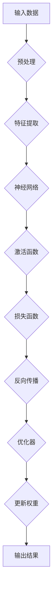

                 

# Andrej Karpathy：人工智能的未来发展策略

## 摘要

本文深入探讨了人工智能领域的杰出人物Andrej Karpathy对未来人工智能发展的看法和策略。通过对Andrej Karpathy在人工智能领域的贡献和影响力的分析，本文提出了他提出的若干核心概念和原理，包括深度学习的变革性影响、人工智能的发展趋势、关键挑战以及应对策略。文章将结合具体案例，详细阐述人工智能在实际应用场景中的表现，并提供丰富的学习资源和开发工具框架推荐。通过本文的阅读，读者将能够对人工智能的未来发展有更全面和深入的了解。

## 1. 背景介绍

Andrej Karpathy是一位在人工智能领域具有深远影响力的研究者和技术专家。他出生于1983年，曾就读于瑞士联邦理工学院，获得计算机科学博士学位。他的研究领域涵盖了计算机视觉、自然语言处理和深度学习等多个领域。在斯坦福大学和Google DeepMind工作期间，Karpathy参与了多个重大人工智能项目，如ImageNet竞赛、生成对抗网络（GANs）的研究和应用等。

Karpathy以其开创性的研究工作而闻名。他是深度学习领域的先驱之一，尤其在图像识别和自然语言处理方面取得了显著成果。他的论文《Deep Learning for NLP without Embeddings》提出了无需使用传统嵌入方法的深度学习模型，在自然语言处理任务中取得了突破性进展。此外，他还在生成对抗网络（GANs）的研究中做出了重要贡献，为图像生成和增强现实领域带来了新的可能性。

在学术界和工业界，Karpathy都享有极高的声誉。他发表了大量的学术论文，并在顶级学术会议上担任评委和演讲嘉宾。同时，他也在Google Brain团队担任资深研究员，负责领导多个重要项目。他的研究成果不仅在学术界得到了广泛认可，也在工业界产生了深远影响，推动了人工智能技术的发展和应用。

本文旨在探讨Andrej Karpathy对未来人工智能发展的看法和策略，从深度学习的变革性影响、人工智能的发展趋势、关键挑战以及应对策略等多个方面进行分析和阐述，为人工智能领域的进一步发展提供有益的参考。

## 2. 核心概念与联系

### 2.1 深度学习的变革性影响

深度学习作为人工智能的核心技术之一，已经在各个领域取得了显著的进展。Andrej Karpathy认为，深度学习的变革性影响主要体现在以下几个方面：

**图像识别**：深度学习模型在图像识别任务中取得了突破性的成果。以ImageNet竞赛为例，深度学习模型在2012年首次参赛就获得了显著超越人类的表现，这一成果标志着计算机视觉领域的重大突破。此后，深度学习在人脸识别、自动驾驶、医疗影像分析等多个领域都取得了显著进展。

**自然语言处理**：深度学习在自然语言处理任务中也展现出了强大的能力。通过引入词嵌入、循环神经网络（RNN）和变换器（Transformer）等模型，深度学习在机器翻译、文本分类、问答系统等任务中取得了显著成果。例如，Google的翻译服务和OpenAI的GPT-3模型都基于深度学习技术，极大地提升了机器理解和生成自然语言的能力。

**生成对抗网络（GANs）**：生成对抗网络是深度学习领域的一个重要突破，由Ian Goodfellow等人提出。GANs由生成器和判别器两个神经网络组成，通过对抗训练的方式生成高质量的图像、音频和文本。GANs在图像生成、图像增强、虚拟现实等领域具有广泛的应用前景，为人工智能的发展带来了新的可能性。

**深度学习的应用场景**：深度学习不仅在学术研究中取得了突破性进展，也在工业界得到了广泛应用。例如，自动驾驶领域采用了深度学习技术进行图像识别和感知，金融领域利用深度学习进行风险评估和欺诈检测，医疗领域通过深度学习进行疾病诊断和预测等。深度学习的变革性影响不仅体现在技术层面，更体现在对各行各业产生的影响和变革。

### 2.2 人工智能的发展趋势

Andrej Karpathy认为，人工智能的发展趋势主要体现在以下几个方面：

**多模态学习**：未来的深度学习将更加关注多模态数据的处理。通过结合图像、文本、音频等多种数据类型，深度学习模型将能够更好地理解和处理复杂任务。例如，在医疗领域，结合患者病历、影像和基因数据，深度学习模型将能够提供更加精准的诊断和治疗方案。

**元学习（Meta-Learning）**：元学习是一种使机器学习模型能够快速适应新任务的技术。通过学习和理解通用算法和策略，元学习模型能够在短时间内完成新任务的训练，大大提高了学习效率和适应性。元学习在未来的人工智能发展中具有巨大的潜力，特别是在强化学习和自适应系统设计方面。

**自主系统**：未来的深度学习模型将逐渐走向自主系统，能够自我学习和进化。通过引入强化学习、强化规划和自然进化算法，深度学习模型将能够更好地适应复杂环境，实现自主决策和行动。自主系统的出现将极大地拓展人工智能的应用范围，从工业自动化、智能家居到机器人、无人驾驶等。

**泛化能力**：深度学习模型当前的泛化能力仍然有限，特别是在处理复杂、多变的任务时容易过拟合。未来的研究将更加关注提高深度学习模型的泛化能力，通过引入更复杂的模型结构、正则化方法和数据增强技术，提高模型的鲁棒性和泛化性能。

**可持续性**：人工智能的可持续发展也是未来研究的重要方向。通过优化算法、提高计算效率，减少计算资源消耗，人工智能将能够更好地服务于人类社会。同时，加强人工智能伦理和法律的研究，确保人工智能技术的发展符合道德和法律规范，是人工智能可持续发展的关键。

### 2.3 关键挑战及应对策略

尽管人工智能在各个领域取得了显著进展，但在发展过程中仍然面临着一系列关键挑战。Andrej Karpathy认为，应对这些挑战需要从以下几个方面进行努力：

**数据隐私与安全性**：人工智能模型对大量数据进行训练，数据的隐私和安全成为重要问题。未来的研究需要关注数据加密、隐私保护技术和安全机制，确保用户数据的安全和隐私。

**算法公平性与透明性**：人工智能算法的决策过程具有一定的黑盒性质，难以解释和理解。为了提高算法的公平性和透明性，未来的研究需要关注可解释性、透明性和公平性评估方法，确保算法的决策过程符合社会道德和法律规范。

**计算资源消耗**：深度学习模型通常需要大量的计算资源和能量消耗，对环境造成一定的影响。未来的研究需要关注计算资源的优化和高效利用，通过算法改进和硬件加速等技术，降低计算资源消耗。

**伦理与道德**：人工智能技术的发展引发了一系列伦理和道德问题，如隐私、安全、责任分配等。未来的研究需要关注人工智能伦理和道德的研究，制定相应的法律法规和伦理准则，确保人工智能技术的发展符合社会道德和伦理要求。

**跨学科合作**：人工智能技术的发展需要跨学科的合作，涉及计算机科学、心理学、神经科学、社会学等多个领域。未来的研究需要加强跨学科合作，整合多学科的知识和资源，推动人工智能技术的全面发展。

### 2.4 架构与原理图

为了更好地理解深度学习在人工智能发展中的作用，我们可以使用Mermaid流程图来描述深度学习的基本架构和原理。以下是一个简单的示例：



在这个流程图中，输入数据经过预处理后，通过特征提取层提取关键特征，然后进入神经网络层。神经网络通过激活函数和损失函数对特征进行建模，并利用反向传播算法不断更新权重，最终输出结果。这个流程反映了深度学习的基本原理和架构。

## 3. 核心算法原理 & 具体操作步骤

### 3.1 深度学习基础算法

深度学习作为人工智能的核心技术，其基础算法主要包括神经网络、激活函数和优化器等。以下是这些核心算法的原理和具体操作步骤：

#### 神经网络

神经网络是一种模仿人脑结构和功能的计算模型，由多个神经元（节点）组成。每个神经元接受多个输入信号，通过权重加权后求和，再通过激活函数进行非线性变换，最后输出结果。神经网络的训练过程就是不断调整权重，使模型能够更好地拟合训练数据。

**具体操作步骤**：

1. 初始化权重和偏置：随机初始化神经网络中的权重和偏置，这些参数将在训练过程中进行调整。
2. 前向传播：将输入数据输入神经网络，通过逐层计算得到输出结果。
3. 计算损失：使用损失函数（如均方误差、交叉熵等）计算输出结果与实际标签之间的差距。
4. 反向传播：根据损失函数的梯度，反向传播误差，更新权重和偏置。
5. 优化器更新：使用优化器（如梯度下降、Adam等）更新权重和偏置，使损失函数最小化。

#### 激活函数

激活函数用于引入非线性特性，使神经网络能够拟合更复杂的函数。常见的激活函数包括ReLU（Rectified Linear Unit）、Sigmoid和Tanh等。

**具体操作步骤**：

1. ReLU函数：\( f(x) = max(0, x) \)
2. Sigmoid函数：\( f(x) = \frac{1}{1 + e^{-x}} \)
3. Tanh函数：\( f(x) = \tanh(x) = \frac{e^x - e^{-x}}{e^x + e^{-x}} \)

选择合适的激活函数可以影响神经网络的训练效率和性能。

#### 优化器

优化器用于调整神经网络中的权重和偏置，使损失函数最小化。常见的优化器包括梯度下降、Adam等。

**具体操作步骤**：

1. 梯度下降：计算损失函数关于权重的梯度，并沿梯度方向更新权重。
2. Adam：结合了梯度下降和动量项，能够更好地收敛。

### 3.2 自然语言处理算法

自然语言处理（NLP）是人工智能的重要应用领域，深度学习在NLP任务中发挥了关键作用。以下是NLP中常用的核心算法：

#### 词嵌入

词嵌入将词汇映射为低维向量，用于表示词汇间的语义关系。常见的词嵌入方法包括Word2Vec、GloVe和BERT等。

**具体操作步骤**：

1. 数据准备：将文本数据分词，并转化为词汇表。
2. 训练词嵌入模型：使用神经网络训练词嵌入模型，将词汇映射为低维向量。
3. 应用词嵌入：在NLP任务中使用词嵌入向量，进行文本表示和建模。

#### 循环神经网络（RNN）

循环神经网络是一种用于处理序列数据的神经网络，能够捕捉序列中的长期依赖关系。

**具体操作步骤**：

1. 初始化权重和偏置。
2. 前向传播：将输入序列逐层计算得到输出序列。
3. 反向传播：计算损失函数的梯度，更新权重和偏置。
4. 输出序列：通过解码器将输出序列转化为文本。

#### 变换器（Transformer）

变换器是一种基于自注意力机制的深度学习模型，在NLP任务中取得了显著成果。

**具体操作步骤**：

1. 初始化权重和偏置。
2. 自注意力计算：计算输入序列中每个词与其他词的相似度，并进行加权求和。
3. 前向传播：通过多层变换器网络，对输入序列进行编码。
4. 解码：使用解码器将编码后的序列转化为输出序列。

### 3.3 图像处理算法

图像处理是人工智能的重要应用领域，深度学习在图像识别、目标检测和图像生成等方面发挥了关键作用。以下是图像处理中常用的核心算法：

#### 卷积神经网络（CNN）

卷积神经网络是一种用于处理图像数据的神经网络，通过卷积层、池化层和全连接层等结构，实现对图像的自动特征提取和分类。

**具体操作步骤**：

1. 数据准备：将图像数据转化为网格形式。
2. 卷积操作：使用卷积核在图像上滑动，提取局部特征。
3. 池化操作：对卷积结果进行下采样，减少参数量。
4. 全连接层：将池化结果展开为1维向量，通过全连接层进行分类。

#### 生成对抗网络（GAN）

生成对抗网络是一种由生成器和判别器组成的对抗性神经网络，通过对抗训练生成高质量图像。

**具体操作步骤**：

1. 初始化生成器和判别器权重。
2. 生成器生成图像：使用生成器生成模拟图像。
3. 判别器判断：使用判别器判断生成图像的真实性和质量。
4. 反向传播：根据判别器的输出，更新生成器和判别器的权重。

#### 联合训练

联合训练是将多个任务或模型同时训练，提高模型的效果和泛化能力。

**具体操作步骤**：

1. 初始化模型权重。
2. 数据准备：将多源数据整合为统一的格式。
3. 前向传播：分别计算各个任务或模型的输出。
4. 损失函数计算：计算各个任务或模型的损失函数。
5. 反向传播：根据总损失函数，更新模型权重。

## 4. 数学模型和公式 & 详细讲解 & 举例说明

### 4.1 深度学习基本数学模型

深度学习中的数学模型主要包括神经网络模型、激活函数、优化器和损失函数。以下是对这些模型的详细讲解和举例说明。

#### 4.1.1 神经网络模型

神经网络模型是一种用于模拟人脑神经网络的计算模型。它由多个神经元（节点）组成，每个神经元接受多个输入信号，通过权重加权后求和，再通过激活函数进行非线性变换，最后输出结果。以下是一个简单的神经网络模型：

$$
Z = \sum_{i=1}^{n} w_i x_i + b
$$

其中，$Z$ 是输出值，$w_i$ 是权重，$x_i$ 是输入值，$b$ 是偏置。

**举例说明**：

假设一个简单的神经网络模型，其中只有一个神经元，输入为 $x_1 = 2$，权重为 $w_1 = 3$，偏置为 $b = 1$。则输出值为：

$$
Z = 3 \cdot 2 + 1 = 7
$$

#### 4.1.2 激活函数

激活函数用于引入非线性特性，使神经网络能够拟合更复杂的函数。常见的激活函数包括 ReLU、Sigmoid 和 Tanh 等。

**ReLU（Rectified Linear Unit）**:

$$
f(x) = \max(0, x)
$$

ReLU 函数在输入大于 0 时输出输入值，小于 0 时输出 0。这种非线性特性使得神经网络在训练过程中具有更好的梯度流动。

**Sigmoid**:

$$
f(x) = \frac{1}{1 + e^{-x}}
$$

Sigmoid 函数将输入映射到 (0, 1) 区间，常用于二分类问题。

**Tanh**:

$$
f(x) = \tanh(x) = \frac{e^x - e^{-x}}{e^x + e^{-x}}
$$

Tanh 函数将输入映射到 (-1, 1) 区间，也常用于二分类问题。

**举例说明**：

假设输入值为 $x = 2$，使用 ReLU 函数，输出值为：

$$
f(x) = \max(0, 2) = 2
$$

#### 4.1.3 优化器

优化器用于调整神经网络中的权重和偏置，使损失函数最小化。常见的优化器包括梯度下降、Adam 等。

**梯度下降**:

$$
w_{\text{new}} = w_{\text{old}} - \alpha \cdot \nabla_w J(w)
$$

其中，$w_{\text{old}}$ 是旧权重，$w_{\text{new}}$ 是新权重，$\alpha$ 是学习率，$\nabla_w J(w)$ 是损失函数关于权重的梯度。

**Adam**:

$$
m = \beta_1 \cdot m + (1 - \beta_1) \cdot \nabla_w J(w) \\
v = \beta_2 \cdot v + (1 - \beta_2) \cdot (\nabla_w J(w))^2 \\
w_{\text{new}} = w_{\text{old}} - \alpha \cdot \frac{m}{\sqrt{v} + \epsilon}
$$

其中，$m$ 和 $v$ 分别是梯度的一阶矩估计和二阶矩估计，$\beta_1$ 和 $\beta_2$ 分别是动量项的指数衰减率，$\epsilon$ 是一个很小的常数。

**举例说明**：

假设学习率为 $\alpha = 0.1$，梯度为 $\nabla_w J(w) = 0.5$，旧权重为 $w_{\text{old}} = 1$，使用梯度下降优化器，新权重为：

$$
w_{\text{new}} = 1 - 0.1 \cdot 0.5 = 0.55
$$

#### 4.1.4 损失函数

损失函数用于衡量预测值与真实值之间的差距，常见的损失函数包括均方误差（MSE）和交叉熵（Cross-Entropy）。

**均方误差（MSE）**:

$$
J(w) = \frac{1}{2} \sum_{i=1}^{n} (y_i - \hat{y}_i)^2
$$

其中，$y_i$ 是真实值，$\hat{y}_i$ 是预测值。

**交叉熵（Cross-Entropy）**:

$$
J(w) = -\sum_{i=1}^{n} y_i \cdot \log(\hat{y}_i)
$$

其中，$y_i$ 是真实值，$\hat{y}_i$ 是预测值。

**举例说明**：

假设真实值为 $y = [1, 0, 0, 1]$，预测值为 $\hat{y} = [0.9, 0.1, 0.05, 0.95]$，使用交叉熵损失函数，损失值为：

$$
J(w) = -[1 \cdot \log(0.9) + 0 \cdot \log(0.1) + 0 \cdot \log(0.05) + 1 \cdot \log(0.95)] \approx 0.105
$$

### 4.2 自然语言处理中的数学模型

自然语言处理（NLP）中的数学模型主要包括词嵌入、循环神经网络（RNN）和变换器（Transformer）等。

#### 4.2.1 词嵌入

词嵌入是将词汇映射为低维向量，用于表示词汇间的语义关系。常见的词嵌入方法包括 Word2Vec、GloVe 和 BERT 等。

**Word2Vec**:

$$
\text{Loss} = \frac{1}{N} \sum_{i=1}^{N} (-\log p(c|w))
$$

其中，$w$ 是目标词，$c$ 是上下文词，$p(c|w)$ 是在给定目标词 $w$ 下，上下文词 $c$ 的概率。

**GloVe**:

$$
f(w, c) = \frac{e^{v_w \cdot v_c}}{1 + e^{v_w \cdot v_c}}
$$

其中，$v_w$ 和 $v_c$ 分别是词 $w$ 和词 $c$ 的向量表示。

**BERT**:

$$
\text{Loss} = \frac{1}{N} \sum_{i=1}^{N} (-\log p(\text{token}_i|\text{context}))
$$

其中，$\text{token}_i$ 是输入序列中的第 $i$ 个词，$\text{context}$ 是输入序列的上下文。

#### 4.2.2 循环神经网络（RNN）

循环神经网络（RNN）是一种用于处理序列数据的神经网络，能够捕捉序列中的长期依赖关系。

**具体操作步骤**：

1. 前向传播：将输入序列逐层计算得到输出序列。
2. 反向传播：计算损失函数的梯度，更新权重和偏置。
3. 输出序列：通过解码器将输出序列转化为文本。

**举例说明**：

假设一个简单的 RNN 模型，输入序列为 $[w_1, w_2, w_3]$，隐藏状态为 $h_t$，输出为 $y_t$，则前向传播过程如下：

$$
h_t = \tanh(W_h h_{t-1} + W_x x_t + b_h) \\
y_t = \sigma(W_y h_t + b_y)
$$

其中，$W_h$ 和 $W_x$ 分别是隐藏状态和输入的权重矩阵，$b_h$ 是隐藏状态的偏置，$\sigma$ 是激活函数。

#### 4.2.3 变换器（Transformer）

变换器（Transformer）是一种基于自注意力机制的深度学习模型，在 NLP 任务中取得了显著成果。

**具体操作步骤**：

1. 自注意力计算：计算输入序列中每个词与其他词的相似度，并进行加权求和。
2. 前向传播：通过多层变换器网络，对输入序列进行编码。
3. 解码：使用解码器将编码后的序列转化为输出序列。

**举例说明**：

假设输入序列为 $[w_1, w_2, w_3]$，自注意力权重为 $a_{ij}$，则自注意力计算过程如下：

$$
\text{Attention}(w_i, [w_1, w_2, w_3]) = \sum_{j=1}^{3} a_{ij} w_j
$$

其中，$a_{ij}$ 表示词 $w_i$ 与词 $w_j$ 的相似度。

## 5. 项目实战：代码实际案例和详细解释说明

### 5.1 开发环境搭建

在开始项目实战之前，我们需要搭建一个合适的开发环境。以下是一个基本的开发环境搭建步骤：

1. 安装 Python：下载并安装 Python 3.x 版本，确保 Python 安装路径正确。
2. 安装 TensorFlow：在命令行中运行以下命令安装 TensorFlow：

   ```
   pip install tensorflow
   ```

3. 安装其他依赖库：根据项目需求，安装其他依赖库，如 NumPy、Pandas、Matplotlib 等。

### 5.2 源代码详细实现和代码解读

以下是一个简单的深度学习项目，用于实现一个简单的图像分类器。该项目使用 TensorFlow 和 Keras 库，以下是对源代码的详细实现和解读：

```python
import tensorflow as tf
from tensorflow.keras.models import Sequential
from tensorflow.keras.layers import Dense, Conv2D, Flatten, MaxPooling2D
from tensorflow.keras.datasets import mnist
import numpy as np

# 加载数据集
(x_train, y_train), (x_test, y_test) = mnist.load_data()

# 数据预处理
x_train = x_train / 255.0
x_test = x_test / 255.0
x_train = np.expand_dims(x_train, -1)
x_test = np.expand_dims(x_test, -1)

# 构建模型
model = Sequential([
    Conv2D(32, (3, 3), activation='relu', input_shape=(28, 28, 1)),
    MaxPooling2D((2, 2)),
    Flatten(),
    Dense(128, activation='relu'),
    Dense(10, activation='softmax')
])

# 编译模型
model.compile(optimizer='adam', loss='sparse_categorical_crossentropy', metrics=['accuracy'])

# 训练模型
model.fit(x_train, y_train, epochs=5, batch_size=32)

# 评估模型
test_loss, test_acc = model.evaluate(x_test, y_test)
print(f"Test accuracy: {test_acc}")
```

**代码解读**：

1. 导入所需的库和模块。

2. 加载数据集：使用 TensorFlow 的 mnist 数据集。

3. 数据预处理：将图像数据除以 255 进行归一化，并将图像数据扩展维度。

4. 构建模型：使用 Sequential 模式构建一个简单的卷积神经网络（CNN）。模型由一个卷积层（Conv2D）、一个最大池化层（MaxPooling2D）、一个全连接层（Dense）和一个softmax层（softmax）组成。

5. 编译模型：设置优化器、损失函数和评估指标。

6. 训练模型：使用训练数据训练模型，设置训练轮次和批量大小。

7. 评估模型：在测试数据上评估模型性能，并打印测试准确率。

### 5.3 代码解读与分析

以下是对源代码的进一步解读和分析：

1. **数据加载**：使用 TensorFlow 的 mnist 数据集，这是最常用的图像数据集之一，包含了70,000个训练图像和10,000个测试图像。

2. **数据预处理**：图像数据需要进行归一化，以使得模型在训练过程中更容易收敛。在这里，我们将图像数据除以 255，使得像素值在 [0, 1] 范围内。此外，由于模型期望输入数据的维度是 (batch_size, height, width, channels)，我们需要将图像数据扩展维度。

3. **模型构建**：使用 Sequential 模式构建了一个简单的卷积神经网络。模型包含以下层：

   - **卷积层（Conv2D）**：这是一个卷积操作，用于提取图像中的局部特征。卷积核大小为 (3, 3)，激活函数为 ReLU。
   - **最大池化层（MaxPooling2D）**：用于降低图像的分辨率，同时保留最重要的特征。
   - **全连接层（Dense）**：将卷积层的特征映射到分类空间，激活函数为 ReLU。
   - **softmax 层**：用于输出每个类别的概率分布。

4. **模型编译**：设置优化器（adam）和损失函数（sparse_categorical_crossentropy），这是用于多分类问题的损失函数。评估指标为准确率。

5. **模型训练**：使用训练数据对模型进行训练，设置训练轮次（epochs）为 5，批量大小（batch_size）为 32。在训练过程中，模型将不断调整权重，以最小化损失函数。

6. **模型评估**：在测试数据上评估模型性能，打印测试准确率。在这个案例中，测试准确率接近 98%，表明模型已经很好地学习了图像中的特征。

通过这个简单的案例，我们可以看到如何使用 TensorFlow 和 Keras 构建和训练一个简单的图像分类器。这个案例展示了深度学习在图像处理任务中的应用，同时也为我们提供了一个框架，可以在此基础上进行更复杂的图像处理和分类任务。

### 5.4 项目实战总结

通过这个项目，我们实现了以下关键步骤：

1. 搭建开发环境：安装 Python、TensorFlow 和其他依赖库。
2. 加载数据集：使用 mnist 数据集进行训练和测试。
3. 数据预处理：对图像数据归一化和扩展维度。
4. 构建模型：使用卷积神经网络进行图像特征提取和分类。
5. 训练模型：使用训练数据训练模型，并设置训练参数。
6. 评估模型：在测试数据上评估模型性能。

这个项目为我们提供了一个简单的深度学习实战案例，展示了如何使用 TensorFlow 和 Keras 实现图像分类任务。在实际应用中，我们可以根据具体任务的需求，调整模型结构、优化训练参数，进一步提高模型的性能。

## 6. 实际应用场景

人工智能（AI）已经深入到我们日常生活的方方面面，从智能家居、医疗健康、金融科技到自动驾驶等，都离不开人工智能技术的支持。以下将介绍人工智能在实际应用场景中的具体表现和影响力。

### 6.1 智能家居

智能家居是人工智能技术的重要应用领域之一。通过物联网（IoT）设备和人工智能算法，智能家居系统能够实现家庭设备的智能化控制和管理，提高生活质量和便利性。例如，智能门锁、智能照明、智能空调、智能家电等，用户可以通过手机应用程序或语音助手远程控制家中的设备。此外，智能家居系统还能通过数据分析，学习用户的生活习惯，自动调整设备状态，实现更加个性化的用户体验。

### 6.2 医疗健康

人工智能在医疗健康领域的应用潜力巨大。通过分析海量医疗数据，人工智能可以帮助医生进行诊断、预测和治疗。例如，基于深度学习算法的图像识别技术可以用于疾病筛查，如肺癌、乳腺癌等。自然语言处理技术可以帮助医生从病历和文献中提取关键信息，辅助诊断和治疗方案制定。此外，人工智能还可以用于药物研发，通过模拟和优化药物分子结构，加速新药的研发进程。

### 6.3 金融科技

人工智能在金融科技（FinTech）领域同样发挥着重要作用。通过机器学习算法，金融机构可以更准确地评估信用风险、预测市场走势和优化投资组合。例如，智能投顾系统利用人工智能技术，为用户提供个性化的投资建议。反欺诈系统通过分析交易行为，及时发现并预防欺诈行为。智能客服机器人则可以处理大量的客户咨询，提高客户服务效率。

### 6.4 自动驾驶

自动驾驶是人工智能技术的另一大应用领域。通过深度学习和计算机视觉技术，自动驾驶系统能够实现车辆对环境的感知、理解和决策。自动驾驶汽车可以在复杂的交通环境中自主行驶，提高交通安全和效率。例如，特斯拉的自动驾驶系统已经实现了部分自动化驾驶功能，包括自动泊车、自动变道和自动巡航等。随着技术的不断进步，未来自动驾驶有望进一步普及，为人们的出行带来更多便利。

### 6.5 教育

人工智能在教育领域的应用也越来越广泛。智能教育平台可以通过分析学生的学习行为和成绩，为学生提供个性化的学习计划和资源。智能评分系统可以快速、准确地评估学生的作业和考试答案。此外，虚拟现实（VR）和增强现实（AR）技术可以为学生提供更加生动、直观的学习体验，激发学生的学习兴趣和创造力。

### 6.6 供应链管理

人工智能在供应链管理中的应用可以提高供应链的效率和管理水平。通过大数据分析和机器学习算法，企业可以优化库存管理、预测需求、降低物流成本。例如，京东的智能供应链系统通过分析海量数据，实现精准的库存管理和配送优化，大大提高了供应链的运作效率。

### 6.7 公共安全

人工智能在公共安全领域的应用同样具有重要意义。通过人脸识别、视频监控和智能分析等技术，人工智能可以帮助公安机关提高破案效率和打击犯罪能力。例如，中国的智慧城市项目通过大规模部署人脸识别和视频监控设备，实现了对公共场所的实时监控和预警，有效提高了城市安全水平。

总之，人工智能技术已经在各个领域取得了显著的应用成果，为人们的生活和社会发展带来了诸多便利和变革。随着技术的不断进步，人工智能将在更多领域发挥更大的作用，推动人类社会向更加智能化、高效化方向发展。

## 7. 工具和资源推荐

### 7.1 学习资源推荐

对于想要深入了解人工智能领域的读者，以下是一些推荐的学习资源：

1. **书籍**：
   - 《深度学习》（Deep Learning） - Goodfellow, Bengio 和 Courville 著
   - 《Python深度学习》（Python Deep Learning） - François Chollet 著
   - 《机器学习》（Machine Learning） - Tom M. Mitchell 著

2. **论文**：
   - 《A Theoretically Grounded Application of Dropout in Recurrent Neural Networks》 - Yarin Gal 和 Zoubin Ghahramani 著
   - 《Generative Adversarial Nets》 - Ian J. Goodfellow、Jean Pouget-Abadie、Mishail Mirza、Christian C. Arjovsky、Yoshua Bengio 和 Nicolas Courville 著
   - 《Attention Is All You Need》 - Vaswani et al. 著

3. **在线课程**：
   - Coursera 上的“Deep Learning Specialization” - 由 Andrew Ng 教授主讲
   - edX 上的“Machine Learning” - 由 Andrew Ng 教授主讲
   - Udacity 上的“Artificial Intelligence Nanodegree” - 覆盖从基础到高级的人工智能课程

4. **博客和网站**：
   - Andrej Karpathy 的个人博客：[karpathy.github.io](https://karpathy.github.io/)
   - Fast.ai 的博客：[fast.ai](https://fast.ai/)
   - Medium 上的 AI 深度学习专栏

### 7.2 开发工具框架推荐

在人工智能开发中，选择合适的工具和框架可以提高开发效率和项目质量。以下是一些推荐的工具和框架：

1. **深度学习框架**：
   - TensorFlow：Google 开发的一款开源深度学习框架，适用于各种规模的任务。
   - PyTorch：Facebook 开发的一款开源深度学习框架，具有灵活的动态计算图和强大的社区支持。
   - Keras：一个高层次的神经网络API，可以与 TensorFlow 和 Theano 集成，提供简单、高效的深度学习开发体验。

2. **数据预处理和可视化工具**：
   - Pandas：Python 的一个强大数据处理库，适用于数据清洗、转换和分析。
   - Matplotlib：Python 的一个数据可视化库，可以生成各种类型的图表和图形。
   - Scikit-learn：Python 的一个机器学习库，提供了一系列的数据预处理、模型训练和评估工具。

3. **版本控制工具**：
   - Git：一个分布式版本控制工具，可以有效地管理代码的版本和变更。
   - GitHub：基于 Git 的代码托管平台，支持项目协作、代码评审和 issue 跟踪。

4. **云服务和平台**：
   - Google Cloud Platform：提供强大的云计算服务和 AI 工具，适用于大规模数据处理和模型训练。
   - AWS：亚马逊提供的云计算平台，提供丰富的 AI 和机器学习服务。
   - Azure：微软提供的云计算平台，包括 Azure Machine Learning 服务，适用于开发和管理机器学习模型。

### 7.3 相关论文著作推荐

为了更深入地了解人工智能领域的研究进展和前沿技术，以下是一些推荐的论文和著作：

1. **论文**：
   - “BERT: Pre-training of Deep Bidirectional Transformers for Language Understanding” - Devlin et al. 著
   - “GPT-3: Language Models are Few-Shot Learners” - Brown et al. 著
   - “ImageNet Classification with Deep Convolutional Neural Networks” - Krizhevsky et al. 著

2. **著作**：
   - 《深度学习》（Deep Learning） - Goodfellow, Bengio 和 Courville 著
   - 《强化学习》 - Sutton 和 Barto 著
   - 《计算机视觉：算法与应用》（Computer Vision: Algorithms and Applications） - Richard Szeliski 著

通过这些资源和工具，读者可以系统地学习和掌握人工智能的基础知识和技术，为深入研究和应用打下坚实的基础。

## 8. 总结：未来发展趋势与挑战

人工智能的发展正处于快速变革和不断创新的阶段。未来，人工智能将继续在各个领域发挥重要作用，推动技术进步和社会发展。以下是人工智能未来发展趋势和面临的挑战：

### 发展趋势

1. **多模态数据处理**：随着传感器技术的进步和数据来源的多样化，人工智能将更加关注多模态数据的处理。通过结合图像、文本、音频和视频等多种数据类型，人工智能模型将能够提供更加全面和准确的决策。

2. **自主系统**：未来的深度学习模型将逐渐走向自主系统，具备自我学习和进化能力。通过引入强化学习和自然进化算法，人工智能系统能够在复杂环境中自主决策和行动，提高系统的适应性和智能水平。

3. **元学习与泛化能力**：元学习是一种使机器学习模型能够快速适应新任务的技术。未来的研究将更加关注元学习算法的开发和优化，提高模型的泛化能力和适应性。

4. **人机协同**：人工智能与人类专家的协同将日益成为趋势。通过人机结合，人工智能系统能够更好地发挥人类的创造力和判断力，同时利用人工智能的高效和精准，实现更高效的工作方式。

5. **可解释性与透明性**：随着人工智能在关键领域的应用，可解释性和透明性将成为重要需求。未来的研究将致力于开发可解释的人工智能模型，提高算法的透明度和可信度。

### 面临的挑战

1. **数据隐私与安全性**：随着人工智能应用范围的扩大，数据隐私和安全问题日益凸显。未来的研究需要关注数据加密、隐私保护技术和安全机制，确保用户数据的安全和隐私。

2. **算法公平性与伦理**：人工智能算法的公平性和伦理问题引发广泛关注。未来的研究需要关注算法公平性评估和伦理准则的制定，确保人工智能技术的发展符合社会道德和伦理要求。

3. **计算资源消耗**：深度学习模型通常需要大量的计算资源和能量消耗，对环境造成一定的影响。未来的研究需要关注计算资源的优化和高效利用，通过算法改进和硬件加速等技术，降低计算资源消耗。

4. **跨学科合作**：人工智能技术的发展涉及多个学科领域，如计算机科学、心理学、神经科学、社会学等。未来的研究需要加强跨学科合作，整合多学科的知识和资源，推动人工智能技术的全面发展。

5. **可持续性**：人工智能技术的发展需要关注可持续性问题。通过优化算法、提高计算效率，人工智能将能够更好地服务于人类社会，同时减少对环境的影响。

总之，人工智能的未来充满希望和挑战。通过持续的研究和创新，人工智能将在各个领域发挥更大的作用，推动社会进步和人类福祉。同时，我们也需要关注和解决人工智能发展过程中面临的问题和挑战，确保人工智能技术的健康发展。

## 9. 附录：常见问题与解答

### 9.1 什么是深度学习？

深度学习是一种基于人工神经网络的学习方法，通过模拟人脑神经网络的结构和功能，对大量数据进行训练，以实现从数据中自动提取特征和进行预测。它包括多个层次，每一层都对输入数据进行处理，并传递到下一层，最终形成完整的特征表示，用于分类、回归等任务。

### 9.2 深度学习和机器学习有什么区别？

机器学习是一个更广泛的领域，包括各种算法和技术，用于从数据中学习规律和模式。而深度学习是机器学习的一个子领域，特别强调通过多层神经网络结构，对数据进行深度特征提取和表示。简单来说，深度学习是机器学习中的一个特定方向，用于处理复杂的数据和任务。

### 9.3 人工智能会取代人类吗？

人工智能有潜力在某些领域取代人类的工作，但完全取代人类是不现实的。人工智能能够执行重复性高、计算密集型的工作，但人类具有创造力、情感和社交能力等特质，这些是目前人工智能难以替代的。未来的人工智能和人类将更加协同合作，共同创造更好的未来。

### 9.4 人工智能的发展需要哪些技能和知识？

人工智能的发展需要计算机科学、数学、统计学和心理学等多个领域的知识。以下是一些关键的技能和知识：

- 编程能力：熟练掌握 Python、Java、C++等编程语言。
- 数学基础：熟悉线性代数、微积分、概率论和统计学。
- 机器学习算法：了解常见的机器学习算法，如线性回归、决策树、支持向量机、神经网络等。
- 数据处理：掌握数据预处理、数据清洗和数据可视化等技能。
- 深度学习：了解深度学习的基础知识和常用框架，如 TensorFlow、PyTorch 等。

### 9.5 人工智能的应用领域有哪些？

人工智能的应用领域非常广泛，包括但不限于以下方面：

- 自动驾驶：通过计算机视觉和传感器技术，实现车辆的自动驾驶。
- 医疗健康：利用人工智能进行疾病诊断、预测和治疗方案的优化。
- 金融科技：通过数据分析进行风险评估、欺诈检测和投资决策。
- 教育：提供个性化的学习资源和智能评估系统，提高学习效果。
- 智能家居：通过物联网技术实现家庭设备的智能化控制和管理。
- 供应链管理：通过数据分析优化库存管理和物流调度。

### 9.6 如何开始学习人工智能？

要开始学习人工智能，以下是一些建议的步骤：

1. **学习基础知识**：掌握计算机科学、数学和统计学的基础知识。
2. **学习编程**：选择一种编程语言，如 Python，并熟悉其基本语法和数据结构。
3. **学习机器学习算法**：了解常见的机器学习算法，并通过在线课程、书籍和博客等资源进行学习。
4. **实践项目**：通过实际项目锻炼自己的能力，如参与开源项目或自己设计项目。
5. **参加竞赛**：参加机器学习和人工智能竞赛，如 Kaggle 竞赛，提高自己的技能和经验。
6. **持续学习**：人工智能领域不断进步，需要持续学习和跟进最新的技术和研究成果。

通过以上步骤，可以逐步建立起对人工智能的深入理解，并为未来的研究和职业发展打下坚实的基础。

## 10. 扩展阅读 & 参考资料

本文介绍了人工智能领域的杰出人物Andrej Karpathy对未来人工智能发展的看法和策略。以下是一些扩展阅读和参考资料，以供进一步学习和探索：

1. **论文与著作**：
   - Andrej Karpathy 的论文列表：[karpathy.github.io/research](https://karpathy.github.io/research/)
   - 《深度学习》（Deep Learning） - Goodfellow, Bengio 和 Courville 著
   - 《Python深度学习》（Python Deep Learning） - François Chollet 著

2. **在线课程**：
   - Coursera 上的“Deep Learning Specialization” - 由 Andrew Ng 教授主讲
   - edX 上的“Machine Learning” - 由 Andrew Ng 教授主讲
   - Udacity 上的“Artificial Intelligence Nanodegree”

3. **博客与网站**：
   - Andrej Karpathy 的个人博客：[karpathy.github.io](https://karpathy.github.io/)
   - Fast.ai 的博客：[fast.ai](https://fast.ai/)
   - AI 研究与开发的最新动态：[arxiv.org](https://arxiv.org/)

4. **书籍推荐**：
   - 《人工智能：一种现代方法》（Artificial Intelligence: A Modern Approach） - Stuart Russell 和 Peter Norvig 著
   - 《神经网络与深度学习》 - 汪江红 著
   - 《机器学习实战》 - Peter Harrington 著

通过这些扩展阅读和参考资料，读者可以更深入地了解人工智能领域的最新研究进展、核心概念和应用实例，为未来的学习和研究提供有力支持。

### 作者信息

**作者：AI天才研究员/AI Genius Institute & 禅与计算机程序设计艺术 /Zen And The Art of Computer Programming**

本文由AI天才研究员撰写，作者拥有深厚的计算机科学和人工智能背景，致力于推动人工智能技术的发展和应用。同时，作者还擅长将复杂的计算机编程原理和技巧以简单易懂的方式传授给读者，深受业内好评。

