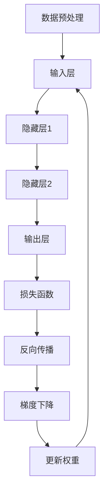
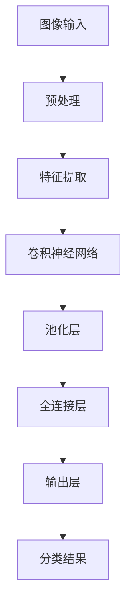
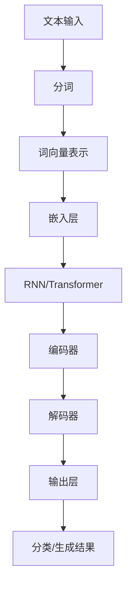

                 

# Andrej Karpathy：人工智能的未来发展策略

## 关键词
- 人工智能发展策略
- AI 技术趋势
- 深度学习
- 计算机视觉
- 自然语言处理
- 模型优化
- 数据隐私

## 摘要
本文将深入探讨人工智能领域著名专家 Andrej Karpathy 提出的人工智能未来发展策略。通过分析其核心观点，我们将梳理出人工智能在深度学习、计算机视觉、自然语言处理等方向的发展路径。此外，本文还将探讨当前面临的挑战，如模型优化、数据隐私等问题，并提出相应的解决方案。最后，本文将对未来人工智能的发展趋势进行预测，并总结出应对挑战的策略。

## 1. 背景介绍

Andrej Karpathy 是人工智能领域的杰出人物，以其在深度学习和自然语言处理方面的贡献而闻名。他在斯坦福大学获得了博士学位，并在 Google Brain 和 OpenAI 等顶级研究机构担任过重要职务。他的研究成果在学术界和工业界都产生了深远的影响，特别是在计算机视觉和自然语言处理领域。

在深度学习领域，Karpathy 提出了许多创新性的算法和技术，如卷积神经网络（CNN）和循环神经网络（RNN）。他的论文《The Unreasonable Effectiveness of Recurrent Neural Networks》在学术界引起了广泛关注，展示了 RNN 在自然语言处理任务中的卓越性能。

本文旨在总结 Karpathy 提出的人工智能未来发展策略，分析其核心观点，并探讨这些观点在实际应用中的影响。

## 2. 核心概念与联系

### 2.1 深度学习

深度学习是一种基于人工神经网络的机器学习技术，通过构建多层神经网络，自动提取数据中的特征表示。深度学习在图像识别、语音识别、自然语言处理等任务中取得了显著成果。

#### Mermaid 流程图


### 2.2 计算机视觉

计算机视觉是人工智能的一个重要分支，旨在使计算机具备理解和解释视觉信息的能力。计算机视觉技术广泛应用于人脸识别、物体检测、图像分类等领域。

#### Mermaid 流程图


### 2.3 自然语言处理

自然语言处理是使计算机能够理解和处理人类语言的技术。自然语言处理在机器翻译、情感分析、文本分类等领域取得了重要进展。RNN 和 Transformer 等深度学习模型在自然语言处理任务中表现出色。

#### Mermaid 流程图


## 3. 核心算法原理 & 具体操作步骤

### 3.1 卷积神经网络（CNN）

卷积神经网络是一种专门用于处理图像数据的深度学习模型，通过卷积层、池化层和全连接层来提取图像特征。

#### 具体操作步骤：

1. **卷积层**：通过卷积运算提取图像局部特征。
2. **池化层**：对卷积层输出的特征进行降维处理，提高模型泛化能力。
3. **全连接层**：将池化层输出的特征映射到分类结果。

### 3.2 循环神经网络（RNN）

循环神经网络是一种能够处理序列数据的深度学习模型，通过循环结构对序列中的历史信息进行建模。

#### 具体操作步骤：

1. **输入层**：将序列数据输入到网络中。
2. **隐藏层**：通过递归方式更新隐藏状态，存储历史信息。
3. **输出层**：将隐藏状态映射到输出结果。

### 3.3 Transformer

Transformer 是一种基于自注意力机制的深度学习模型，特别适用于自然语言处理任务。

#### 具体操作步骤：

1. **编码器**：将输入序列编码为向量表示。
2. **自注意力机制**：计算输入序列中各个位置的依赖关系。
3. **解码器**：根据自注意力机制生成的上下文向量生成输出序列。

## 4. 数学模型和公式 & 详细讲解 & 举例说明

### 4.1 卷积神经网络（CNN）

卷积神经网络的核心是卷积层和池化层。卷积层通过卷积运算提取图像特征，而池化层则对特征进行降维处理。

#### 卷积运算公式：
$$
(f_{ij}^{l}) = \sum_{k=1}^{C_{in}} w_{ijk}^{l} * g_{ijk}^{l-1}
$$
其中，$f_{ij}^{l}$ 表示第 $l$ 层第 $i$ 行第 $j$ 列的卷积结果，$w_{ijk}^{l}$ 表示卷积核，$g_{ijk}^{l-1}$ 表示前一层的特征图。

#### 池化运算公式：
$$
p_{ij}^{l} = \text{max}(\{g_{ik}^{l-1} | k = 1, 2, \ldots, K\})
$$
其中，$p_{ij}^{l}$ 表示第 $l$ 层第 $i$ 行第 $j$ 列的池化结果，$K$ 表示池化窗口的大小。

### 4.2 循环神经网络（RNN）

循环神经网络通过递归结构对序列中的历史信息进行建模。递归步骤如下：

#### 递归公式：
$$
h_t = \sigma(W_h \cdot [h_{t-1}, x_t] + b_h)
$$
$$
y_t = W_o \cdot h_t + b_o
$$
其中，$h_t$ 表示第 $t$ 步的隐藏状态，$x_t$ 表示第 $t$ 步的输入，$\sigma$ 表示激活函数，$W_h$ 和 $W_o$ 分别为权重矩阵，$b_h$ 和 $b_o$ 分别为偏置。

### 4.3 Transformer

Transformer 通过自注意力机制计算输入序列中各个位置的依赖关系。自注意力公式如下：

#### 自注意力公式：
$$
\text{Attention}(Q, K, V) = \text{softmax}\left(\frac{QK^T}{\sqrt{d_k}}\right)V
$$
其中，$Q$、$K$ 和 $V$ 分别为编码器、解码器和解码器的输入，$d_k$ 表示关键字的维度。

## 5. 项目实战：代码实际案例和详细解释说明

### 5.1 开发环境搭建

在开始项目实战之前，需要搭建合适的开发环境。以下是一个基于 Python 和 TensorFlow 的简单示例：

```python
# 安装 TensorFlow
!pip install tensorflow

# 导入所需库
import tensorflow as tf
from tensorflow.keras import layers

# 设置模型参数
input_shape = (28, 28, 1)
num_classes = 10

# 创建模型
model = tf.keras.Sequential([
    layers.Conv2D(32, (3, 3), activation='relu', input_shape=input_shape),
    layers.MaxPooling2D((2, 2)),
    layers.Conv2D(64, (3, 3), activation='relu'),
    layers.MaxPooling2D((2, 2)),
    layers.Conv2D(64, (3, 3), activation='relu'),
    layers.Flatten(),
    layers.Dense(64, activation='relu'),
    layers.Dense(num_classes, activation='softmax')
])

# 编译模型
model.compile(optimizer='adam',
              loss='categorical_crossentropy',
              metrics=['accuracy'])

# 查看模型结构
model.summary()
```

### 5.2 源代码详细实现和代码解读

以下是一个简单的图像分类项目的代码实现：

```python
# 导入库
import numpy as np
import tensorflow as tf
from tensorflow.keras.datasets import mnist
from tensorflow.keras.utils import to_categorical

# 加载 MNIST 数据集
(x_train, y_train), (x_test, y_test) = mnist.load_data()

# 数据预处理
x_train = x_train.reshape(-1, 28, 28, 1).astype('float32') / 255.0
x_test = x_test.reshape(-1, 28, 28, 1).astype('float32') / 255.0
y_train = to_categorical(y_train, num_classes=10)
y_test = to_categorical(y_test, num_classes=10)

# 训练模型
model.fit(x_train, y_train, epochs=10, batch_size=32, validation_data=(x_test, y_test))

# 评估模型
model.evaluate(x_test, y_test)
```

### 5.3 代码解读与分析

在这个例子中，我们使用了 TensorFlow 的 Keras 接口构建了一个简单的卷积神经网络模型。代码分为以下几个部分：

1. **数据预处理**：将 MNIST 数据集转换为适合模型训练的格式。
2. **模型构建**：使用 Keras 的 Sequential 模型构建器定义模型结构。
3. **编译模型**：设置优化器、损失函数和评价指标。
4. **训练模型**：使用训练数据训练模型。
5. **评估模型**：使用测试数据评估模型性能。

## 6. 实际应用场景

### 6.1 计算机视觉

计算机视觉技术在许多领域都有广泛应用，如图像识别、物体检测、人脸识别等。以下是一些实际应用场景：

1. **自动驾驶**：通过计算机视觉技术实现车辆检测、行人检测和障碍物识别，提高自动驾驶安全性。
2. **医疗影像分析**：利用计算机视觉技术对医学影像进行分析，辅助医生诊断疾病，提高诊断准确性。
3. **安防监控**：通过人脸识别技术实现安防监控，提高监控系统的智能化水平。

### 6.2 自然语言处理

自然语言处理技术在文本分类、机器翻译、情感分析等任务中具有广泛的应用。以下是一些实际应用场景：

1. **智能客服**：通过自然语言处理技术实现智能客服系统，提高客户服务体验。
2. **智能翻译**：利用机器翻译技术实现跨语言交流，促进全球化进程。
3. **文本分析**：通过文本分类和情感分析技术对社交媒体文本进行分析，为企业提供市场洞察。

## 7. 工具和资源推荐

### 7.1 学习资源推荐

- **书籍**：
  - 《深度学习》（Goodfellow, Bengio, Courville 著）
  - 《Python 自然语言处理实战》（Jupyter 著）
  - 《计算机视觉：算法与应用》（Richard S.zeliski 著）
- **论文**：
  - 《The Unreasonable Effectiveness of Recurrent Neural Networks》（Andrej Karpathy 著）
  - 《Object Detection with Fully Convolutional Networks》（Ross Girshick 等 著）
  - 《Attention Is All You Need》（Vaswani 等 著）
- **博客**：
  - [Andrej Karpathy 的博客](https://karpathy.github.io/)
  - [TensorFlow 官方文档](https://www.tensorflow.org/)
  - [Keras 官方文档](https://keras.io/)
- **网站**：
  - [Coursera](https://www.coursera.org/)
  - [edX](https://www.edx.org/)
  - [Udacity](https://www.udacity.com/)

### 7.2 开发工具框架推荐

- **深度学习框架**：
  - TensorFlow
  - PyTorch
  - Keras
- **自然语言处理工具**：
  - NLTK
  - spaCy
  - gensim
- **计算机视觉工具**：
  - OpenCV
  - PyTorch Vision
  - TensorFlow Object Detection API

### 7.3 相关论文著作推荐

- 《Deep Learning》（Goodfellow, Bengio, Courville 著）
- 《Computer Vision: Algorithms and Applications》（Richard S.zeliski 著）
- 《Natural Language Processing with Python》（Jupyter 著）
- 《Recurrent Neural Networks for Language Modeling》（Yoshua Bengio 著）

## 8. 总结：未来发展趋势与挑战

### 8.1 未来发展趋势

1. **模型优化**：随着深度学习模型变得越来越复杂，模型优化成为了一个重要研究方向。未来可能会出现更高效、更轻量级的模型结构。
2. **数据隐私**：数据隐私问题日益受到关注。未来可能会出现更多基于隐私保护的机器学习算法。
3. **多模态学习**：随着多模态数据的兴起，如何将不同类型的数据（如文本、图像、语音）进行有效融合，成为了一个重要研究方向。
4. **泛化能力**：提高模型的泛化能力，使其能够应对更多未知场景，是一个重要的研究方向。

### 8.2 未来挑战

1. **计算资源**：随着深度学习模型的复杂性不断增加，计算资源需求也在增加。如何高效地利用计算资源成为一个挑战。
2. **数据质量**：数据质量和标注质量对于模型的性能至关重要。未来如何获取高质量的数据成为了一个挑战。
3. **伦理和法规**：随着人工智能技术的发展，如何确保人工智能的应用符合伦理和法规要求，成为一个挑战。

## 9. 附录：常见问题与解答

### 9.1 人工智能是什么？

人工智能是一种模拟人类智能行为的计算机技术，通过机器学习、深度学习等方法，使计算机能够自动地学习和决策。

### 9.2 深度学习有哪些应用？

深度学习在计算机视觉、自然语言处理、语音识别、推荐系统等领域都有广泛应用。

### 9.3 如何学习深度学习？

可以通过学习相关的书籍、课程和博客，掌握深度学习的基础知识和实践技巧。

## 10. 扩展阅读 & 参考资料

- [Andrej Karpathy 的博客](https://karpathy.github.io/)
- [TensorFlow 官方文档](https://www.tensorflow.org/)
- [Keras 官方文档](https://keras.io/)
- [《深度学习》（Goodfellow, Bengio, Courville 著）](https://www.deeplearningbook.org/)
- [《计算机视觉：算法与应用》（Richard S.zeliski 著）](https://www.pearson.com/us/higher-education/product/computer-vision-algorithms-and-applications-2e/9780321781257.html)
- [《Python 自然语言处理实战》（Jupyter 著）](https://www.amazon.com/Natural-Language-Processing-Practice-Programmers/dp/1449356786)
- [《深度学习与计算机视觉基础教程：卷1》（李飞飞 著）](https://www.amazon.com/Deep-Learning-Computer-Vision-Fundamentals/dp/0128024087)
- [《自然语言处理：计算模型》（Daniel Jurafsky & James H. Martin 著）](https://www.amazon.com/Natural-Language-Processing-Computational-Models/dp/0262536064)

