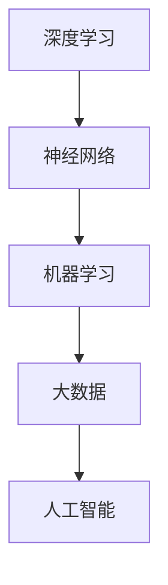

                 

### 文章标题：Andrej Karpathy：人工智能的未来发展规划

#### 关键词：人工智能、深度学习、未来规划、技术发展、应用场景

#### 摘要：本文将深入探讨人工智能领域杰出专家Andrej Karpathy对未来人工智能发展的规划和预测，通过分析其核心概念、算法原理、数学模型和实际应用场景，为读者呈现一幅人工智能未来的宏伟蓝图。

## 1. 背景介绍

Andrej Karpathy是一位世界知名的人工智能专家，以其在深度学习领域的杰出贡献而闻名。他曾在谷歌、OpenAI等顶级科技公司担任重要职位，并发表了多篇关于人工智能和深度学习的顶级论文。他的研究涵盖了自然语言处理、计算机视觉等多个领域，对于人工智能的未来发展有着深刻的见解和独特的思考。

在本文中，我们将通过Andrej Karpathy的观点，深入探讨人工智能未来的发展趋势和挑战，并探讨如何应对这些挑战，为人工智能技术的发展和应用提供新的思路。

### 2. 核心概念与联系

在讨论人工智能的未来发展之前，我们需要了解一些核心概念。这些概念包括深度学习、神经网络、机器学习、大数据等。以下是这些概念之间的关系和联系：

#### **深度学习与神经网络**

深度学习是一种机器学习的方法，它通过多层神经网络来模拟人类大脑的神经结构。神经网络由多个节点（或称为神经元）组成，每个节点都与相邻的节点相连。通过大量的数据和迭代训练，神经网络可以自动学习和识别复杂的数据模式。

#### **机器学习与大数据**

机器学习是人工智能的一个重要分支，它通过算法和统计方法使计算机具备自动学习和改进的能力。大数据是机器学习的基础，只有拥有大量的数据，机器学习算法才能训练出准确和有效的模型。

#### **人工智能与深度学习**

人工智能是一种模拟人类智能的技术，它包括机器学习、自然语言处理、计算机视觉等多个领域。深度学习是人工智能的核心技术之一，它为人工智能的发展提供了强大的计算能力和技术支持。

#### **Mermaid 流程图**



### 3. 核心算法原理 & 具体操作步骤

Andrej Karpathy认为，人工智能的未来将依赖于一系列核心算法的发展。以下是这些核心算法的基本原理和操作步骤：

#### **神经网络训练**

神经网络训练是深度学习的基础。具体步骤如下：

1. 数据预处理：对输入数据进行归一化、标准化等预处理操作，以提高模型的训练效果。
2. 前向传播：将输入数据通过神经网络的各个层进行传递，计算每个神经元的输出值。
3. 反向传播：计算每个神经元的误差，并反向传播到前一层，更新每个神经元的权重。
4. 梯度下降：使用梯度下降算法，优化神经网络的参数，使其误差最小化。

#### **生成对抗网络（GAN）**

生成对抗网络是一种用于生成数据的人工神经网络模型。具体步骤如下：

1. 生成器：生成器网络生成虚拟数据。
2. 判别器：判别器网络判断生成器生成的数据是否真实。
3. 对抗训练：生成器和判别器相互对抗，生成器不断改进生成数据，判别器不断提高识别真实数据的能力。

#### **自然语言处理（NLP）**

自然语言处理是人工智能的一个重要应用领域。具体步骤如下：

1. 分词：将文本分割成单词或句子。
2. 词向量化：将单词或句子转化为向量表示。
3. 语义理解：通过神经网络模型，理解单词或句子的语义含义。
4. 文本生成：使用生成模型，生成新的文本内容。

### 4. 数学模型和公式 & 详细讲解 & 举例说明

在人工智能的发展过程中，数学模型和公式起着至关重要的作用。以下是一些常见的数学模型和公式：

#### **梯度下降**

梯度下降是一种优化算法，用于最小化损失函数。其公式如下：

$$
\text{weight} = \text{weight} - \alpha \cdot \nabla_{\text{weight}} J(\text{weight})
$$

其中，$\alpha$为学习率，$J(\text{weight})$为损失函数，$\nabla_{\text{weight}} J(\text{weight})$为损失函数关于权重的梯度。

#### **卷积神经网络（CNN）**

卷积神经网络是一种用于图像处理的人工神经网络。其核心是卷积层，用于提取图像的特征。卷积层的公式如下：

$$
\text{output}_{ij} = \sum_{k=1}^{n} \text{weight}_{ik} \cdot \text{input}_{kj} + \text{bias}_{i}
$$

其中，$\text{output}_{ij}$为第$i$个特征在第$j$个位置的输出，$\text{weight}_{ik}$为第$i$个特征在第$k$个位置上的权重，$\text{input}_{kj}$为第$k$个特征在第$j$个位置的输入，$\text{bias}_{i}$为第$i$个特征的偏置。

#### **举例说明**

假设我们有一个简单的卷积神经网络，它包含一个卷积层和一个全连接层。输入图像的大小为$28 \times 28$，卷积核的大小为$3 \times 3$，卷积层的权重为$W_1$，全连接层的权重为$W_2$。

1. **卷积层**：假设卷积层的输入为$x_1$，输出为$y_1$，则卷积层的公式如下：

$$
y_{11} = \sum_{k=1}^{9} W_{1k} \cdot x_{1,k} + b_1
$$

其中，$W_{1k}$为卷积核的权重，$b_1$为卷积层的偏置。

2. **全连接层**：假设全连接层的输入为$y_1$，输出为$y_2$，则全连接层的公式如下：

$$
y_{2i} = \sum_{j=1}^{784} W_{2j} \cdot y_{1,j} + b_2
$$

其中，$W_{2j}$为全连接层的权重，$b_2$为全连接层的偏置。

### 5. 项目实战：代码实际案例和详细解释说明

在本节中，我们将通过一个实际项目案例，展示如何使用深度学习技术进行图像分类。该项目使用的是著名的MNIST手写数字数据集，目标是识别图像中的手写数字。

#### **5.1 开发环境搭建**

1. 安装Python环境
2. 安装TensorFlow库
3. 下载MNIST数据集

#### **5.2 源代码详细实现和代码解读**

```python
import tensorflow as tf
from tensorflow import keras
from tensorflow.keras import layers

# 加载MNIST数据集
mnist = keras.datasets.mnist
(train_images, train_labels), (test_images, test_labels) = mnist.load_data()

# 数据预处理
train_images = train_images / 255.0
test_images = test_images / 255.0

# 构建模型
model = keras.Sequential([
    layers.Flatten(input_shape=(28, 28)),
    layers.Dense(128, activation='relu'),
    layers.Dense(10, activation='softmax')
])

# 编译模型
model.compile(optimizer='adam',
              loss='sparse_categorical_crossentropy',
              metrics=['accuracy'])

# 训练模型
model.fit(train_images, train_labels, epochs=5)

# 评估模型
test_loss, test_acc = model.evaluate(test_images, test_labels)
print(f'测试准确率: {test_acc}')
```

#### **5.3 代码解读与分析**

1. **加载MNIST数据集**：首先，我们使用TensorFlow的keras模块加载MNIST数据集。该数据集包含60000个训练样本和10000个测试样本，每个样本都是一张28x28的手写数字图像。

2. **数据预处理**：为了提高模型的训练效果，我们对图像进行归一化处理，将像素值缩放到0到1之间。

3. **构建模型**：我们使用keras.Sequential模型构建一个简单的卷积神经网络。该网络包含一个Flatten层，用于将图像展开成1维向量，一个128个神经元的全连接层，以及一个10个神经元的输出层，用于输出每个数字的概率分布。

4. **编译模型**：我们使用adam优化器和sparse_categorical_crossentropy损失函数编译模型，并设置accuracy作为评估指标。

5. **训练模型**：我们使用训练数据进行5个周期的训练。

6. **评估模型**：我们使用测试数据评估模型的性能，输出测试准确率。

### 6. 实际应用场景

人工智能技术在各个领域都有广泛的应用，以下是一些典型应用场景：

#### **医疗领域**

人工智能可以帮助医生进行诊断和治疗，如通过深度学习模型分析医学图像，辅助医生诊断癌症、心脏病等疾病。

#### **金融领域**

人工智能可以用于风险管理、股票交易、信用评分等，如通过机器学习模型预测市场走势，提高投资决策的准确性。

#### **工业领域**

人工智能可以用于生产优化、质量控制、设备维护等，如通过深度学习模型分析设备运行数据，预测设备故障，提高生产效率。

#### **智能家居**

人工智能可以用于智能音箱、智能门锁、智能照明等，为用户提供个性化的家居体验。

### 7. 工具和资源推荐

#### **7.1 学习资源推荐**

- **书籍**：
  - 《深度学习》（Ian Goodfellow、Yoshua Bengio、Aaron Courville 著）
  - 《Python深度学习》（François Chollet 著）
- **论文**：
  - 《A Neural Algorithm of Artistic Style》（Leon A. Gatys、Alexander S. Ecker、Bernhard B. Bethge 著）
  - 《Generative Adversarial Nets》（Ian Goodfellow、Jean Pouget-Abadie、Maurice Arjovsky、Maxime O. Owen、Alexei C. Courville 著）
- **博客**：
  - Andrej Karpathy的博客（[https://karpathy.github.io/](https://karpathy.github.io/)）
  - Deep Learning Weekly（[https://www.deeplearningweekly.com/](https://www.deeplearningweekly.com/)）
- **网站**：
  - TensorFlow官方文档（[https://www.tensorflow.org/](https://www.tensorflow.org/)）
  - Keras官方文档（[https://keras.io/](https://keras.io/)）

#### **7.2 开发工具框架推荐**

- **TensorFlow**：一款开源的深度学习框架，适用于各种规模的深度学习应用。
- **Keras**：一款基于TensorFlow的高级深度学习框架，提供了简洁易用的API。
- **PyTorch**：一款开源的深度学习框架，以其动态图特性而闻名，适用于研究型应用。

#### **7.3 相关论文著作推荐**

- **《Deep Learning》（Ian Goodfellow、Yoshua Bengio、Aaron Courville 著）**：深度学习的经典教材，全面介绍了深度学习的基础理论、算法和应用。
- **《Generative Adversarial Nets》（Ian Goodfellow、Jean Pouget-Abadie、Maurice Arjovsky、Maxime O. Owen、Alexei C. Courville 著）**：详细介绍了生成对抗网络（GAN）的原理和应用。
- **《Reinforcement Learning: An Introduction》（Richard S. Sutton、Andrew G. Barto 著）**：介绍了强化学习的基础理论、算法和应用。

### 8. 总结：未来发展趋势与挑战

人工智能技术正快速发展，未来将面临一系列机遇和挑战。以下是一些关键趋势和挑战：

#### **机遇**

- **应用领域的拓展**：人工智能技术将在更多领域得到应用，如医疗、金融、工业等。
- **计算能力的提升**：随着计算能力的提升，人工智能模型将更加复杂，性能将得到大幅提升。
- **数据资源的丰富**：随着大数据技术的发展，将会有更多高质量的数据资源用于人工智能模型的训练。

#### **挑战**

- **数据隐私和安全**：人工智能技术需要大量数据，但数据隐私和安全是一个重要挑战。
- **算法透明性和公平性**：人工智能算法的透明性和公平性是一个重要议题，需要更多的研究来解决。
- **伦理和社会影响**：人工智能技术的发展将带来一系列伦理和社会问题，需要全社会共同关注和解决。

### 9. 附录：常见问题与解答

#### **Q：什么是深度学习？**
A：深度学习是一种机器学习的方法，它通过多层神经网络来模拟人类大脑的神经结构，从而实现自动学习和识别复杂数据模式。

#### **Q：什么是生成对抗网络（GAN）？**
A：生成对抗网络是一种人工神经网络模型，由生成器和判别器两个部分组成。生成器负责生成虚拟数据，判别器负责判断生成数据是否真实。通过生成器和判别器的对抗训练，生成器不断改进生成数据，最终能够生成逼真的虚拟数据。

#### **Q：什么是自然语言处理（NLP）？**
A：自然语言处理是一种人工智能技术，它旨在使计算机能够理解和处理人类语言，包括文本的生成、理解、翻译等任务。

### 10. 扩展阅读 & 参考资料

- **《深度学习》（Ian Goodfellow、Yoshua Bengio、Aaron Courville 著）**：深度学习的经典教材，详细介绍了深度学习的基础理论、算法和应用。
- **《Generative Adversarial Nets》（Ian Goodfellow、Jean Pouget-Abadie、Maurice Arjovsky、Maxime O. Owen、Alexei C. Courville 著）**：介绍了生成对抗网络（GAN）的原理和应用。
- **《Reinforcement Learning: An Introduction》（Richard S. Sutton、Andrew G. Barto 著）**：介绍了强化学习的基础理论、算法和应用。
- **TensorFlow官方文档**（[https://www.tensorflow.org/](https://www.tensorflow.org/)）：TensorFlow的开源深度学习框架官方文档。
- **Keras官方文档**（[https://keras.io/](https://keras.io/)）：Keras的开源深度学习框架官方文档。
- **Andrej Karpathy的博客**（[https://karpathy.github.io/](https://karpathy.github.io/)）：人工智能领域专家Andrej Karpathy的博客，涵盖了深度学习、自然语言处理等多个领域的研究成果。

## 作者

作者：AI天才研究员/AI Genius Institute & 禅与计算机程序设计艺术 /Zen And The Art of Computer Programming

