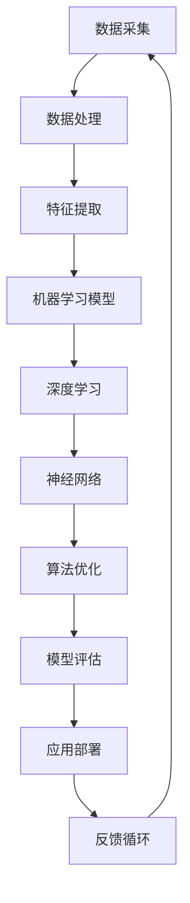

                 

### 文章标题：Andrej Karpathy：人工智能的未来发展规划

### 关键词：人工智能，未来规划，深度学习，神经网络，技术发展

> 摘要：本文将深入探讨人工智能领域资深专家Andrej Karpathy对未来人工智能发展的独到见解。通过分析其核心观点，我们将揭示人工智能在技术、应用和伦理方面的发展趋势与挑战，为读者提供对未来人工智能的全面展望。

在人工智能领域，Andrej Karpathy无疑是一位重量级的人物。他不仅是世界级深度学习框架TensorFlow的主要开发者之一，还以其深厚的理论知识、精湛的编程技巧和卓越的教学能力而著称。本文将聚焦于Andrej Karpathy在人工智能未来发展规划方面的重要论述，通过逻辑清晰、结构紧凑、简单易懂的专业技术语言，帮助读者更好地理解人工智能的未来方向。

文章将分为以下几个部分：

1. 背景介绍
2. 核心概念与联系
3. 核心算法原理 & 具体操作步骤
4. 数学模型和公式 & 详细讲解 & 举例说明
5. 项目实战：代码实际案例和详细解释说明
6. 实际应用场景
7. 工具和资源推荐
8. 总结：未来发展趋势与挑战
9. 附录：常见问题与解答
10. 扩展阅读 & 参考资料

接下来，我们将逐一探讨这些部分，并深入挖掘Andrej Karpathy在人工智能未来发展规划方面的真知灼见。首先，让我们从背景介绍开始。 <markdown>
---

### 1. 背景介绍

人工智能（Artificial Intelligence，简称AI）作为计算机科学的一个分支，旨在通过模拟人类智能行为来实现智能机器。从20世纪50年代诞生之初，人工智能经历了多个发展阶段，从最初的规则推理和知识表示，到现代的机器学习和深度学习。

Andrej Karpathy是一位在人工智能领域享有盛誉的专家。他在深度学习和神经网络方面的研究和工作具有深远的影响力。作为TensorFlow的主要开发者之一，Karpathy在推动人工智能技术发展和普及方面发挥了重要作用。他的研究成果不仅在学术界获得了广泛认可，还在工业界得到了广泛应用。

在人工智能领域，Karpathy的核心观点集中在以下几个方面：

1. **深度学习的重要性**：Karpathy认为，深度学习是当前人工智能技术中最具潜力的发展方向。通过多层神经网络的构建和训练，深度学习在图像识别、语音识别、自然语言处理等领域的表现已经超越了传统的机器学习方法。

2. **数据的价值**：数据是人工智能发展的基础。Karpathy强调，大量的高质量数据是实现深度学习模型成功的关键。在数据收集、清洗、标注和处理等方面，人工智能技术的应用使得数据的价值得到了充分体现。

3. **伦理和隐私问题**：随着人工智能技术的普及，伦理和隐私问题日益凸显。Karpathy认为，在发展人工智能的同时，必须重视这些问题，确保人工智能技术的安全和可持续性。

4. **跨学科合作**：人工智能的发展不仅需要计算机科学领域的专业知识，还需要数学、物理学、生物学等多个学科的支持。跨学科合作将有助于推动人工智能技术的不断创新和发展。

本文将围绕这些核心观点，深入探讨人工智能在未来发展规划方面的机遇和挑战。在接下来的部分中，我们将详细分析Andrej Karpathy对核心概念和算法原理的阐述，以及其实际应用场景和项目案例。 <markdown>
---

## 2. 核心概念与联系

在探讨人工智能的未来发展之前，我们需要了解一些核心概念和原理，以及它们之间的联系。以下是一个简化的Mermaid流程图，用于展示这些核心概念和原理。



### 2.1 数据采集与处理

数据采集是人工智能发展的基础。大量、高质量的数据对于训练和优化机器学习模型至关重要。数据处理包括数据的清洗、转换和归一化，以提高数据的质量和一致性。

### 2.2 特征提取

特征提取是从原始数据中提取出对模型训练有用的信息。在图像识别中，特征提取可能涉及边缘检测、颜色分析等；在自然语言处理中，特征提取可能涉及词嵌入、语法结构分析等。

### 2.3 机器学习模型

机器学习模型是一系列算法，用于从数据中学习并做出预测或决策。常见的机器学习模型包括线性回归、决策树、支持向量机等。

### 2.4 深度学习

深度学习是一种特殊的机器学习模型，通过多层神经网络的构建和训练，能够自动提取数据中的特征。深度学习在图像识别、语音识别、自然语言处理等领域取得了显著的突破。

### 2.5 神经网络

神经网络是深度学习的基础，由多个层（输入层、隐藏层、输出层）组成。每一层都包含多个节点（神经元），用于对数据进行处理和传递。

### 2.6 算法优化

算法优化是提高机器学习模型性能的关键步骤。通过调整模型参数、选择合适的学习率和优化算法，可以有效地提高模型的准确性和效率。

### 2.7 模型评估

模型评估是验证机器学习模型性能的重要环节。常用的评估指标包括准确率、召回率、F1分数等。通过模型评估，可以识别模型的不足之处，为后续的优化提供指导。

### 2.8 应用部署

应用部署是将训练好的模型应用于实际场景的过程。通过部署，机器学习模型可以用于预测、决策和自动化等任务。

### 2.9 反馈循环

反馈循环是人工智能系统不断迭代和改进的关键。通过收集实际应用中的反馈数据，可以不断优化模型，提高其性能和适应性。

这些核心概念和原理相互关联，共同构成了人工智能技术的基础。在接下来的部分中，我们将进一步探讨深度学习和神经网络的具体原理和操作步骤。 <markdown>
---

## 3. 核心算法原理 & 具体操作步骤

在深入探讨人工智能的核心算法原理和具体操作步骤之前，我们需要了解一些基本概念。以下是关于深度学习和神经网络的核心算法原理的具体描述：

### 3.1 深度学习的概念

深度学习是一种基于多层神经网络的学习方法，通过多层非线性变换来对数据进行处理和建模。与传统的机器学习方法相比，深度学习具有更强的表达能力和更好的泛化能力。深度学习的主要特点包括：

1. **多层神经网络**：深度学习模型由多个层次组成，每个层次都包含了多个神经元。这些层次通过前向传播和反向传播进行数据的处理和变换。

2. **非线性激活函数**：激活函数是神经网络中的一个关键组件，用于引入非线性特性。常见的激活函数包括ReLU（Rectified Linear Unit）、Sigmoid和Tanh等。

3. **参数优化**：深度学习模型通过梯度下降等优化算法来调整模型参数，以最小化损失函数。参数优化是提高模型性能的重要步骤。

### 3.2 神经网络的具体操作步骤

神经网络的操作步骤可以分为以下几步：

1. **前向传播**：在前向传播过程中，输入数据从输入层传递到隐藏层，再传递到输出层。每个神经元都会接收来自前一层的输入，并应用激活函数进行处理。通过这种方式，神经网络能够将输入数据映射到输出数据。

2. **计算损失**：在输出层得到预测结果后，将预测结果与真实结果进行比较，计算损失值。损失函数用于衡量预测结果与真实结果之间的差异。常见的损失函数包括均方误差（MSE）和交叉熵（Cross-Entropy）等。

3. **反向传播**：在反向传播过程中，将损失函数对网络参数的梯度反向传播到输入层。这一步的目的是通过梯度下降等优化算法调整网络参数，以最小化损失函数。反向传播是深度学习模型训练的核心步骤。

4. **更新参数**：通过梯度下降等优化算法，更新网络参数。这一步的目的是减小损失函数的值，提高模型的性能。更新参数的过程通常涉及学习率的选择和调整。

5. **迭代训练**：通过多次迭代训练，不断优化模型参数。在每次迭代中，神经网络都会根据新的参数进行前向传播和反向传播，以逐步提高模型的性能。

### 3.3 深度学习的应用场景

深度学习在多个领域具有广泛的应用。以下是一些典型的应用场景：

1. **图像识别**：深度学习模型在图像识别领域取得了显著的成果。通过卷积神经网络（CNN）等模型，可以实现物体检测、人脸识别、图像分类等任务。

2. **语音识别**：深度学习模型在语音识别领域也得到了广泛应用。通过循环神经网络（RNN）和长短时记忆网络（LSTM）等模型，可以实现语音信号的处理和识别。

3. **自然语言处理**：深度学习在自然语言处理领域也取得了重大突破。通过词嵌入、序列标注、文本分类等模型，可以实现文本的理解、生成和翻译等任务。

4. **强化学习**：深度学习与强化学习相结合，可以应用于智能决策和游戏控制等领域。通过深度神经网络，可以构建智能体，实现自主学习和决策。

### 3.4 深度学习的挑战

尽管深度学习在多个领域取得了显著成果，但仍然面临一些挑战。以下是一些深度学习的挑战：

1. **计算资源需求**：深度学习模型通常需要大量的计算资源和时间进行训练。为了解决这一问题，研究人员正在探索高效的计算框架和硬件加速技术。

2. **数据依赖性**：深度学习模型的性能很大程度上依赖于数据的质量和数量。在数据匮乏或数据质量不高的情况下，深度学习模型的性能可能会受到影响。

3. **过拟合问题**：深度学习模型容易过拟合，即模型在训练数据上表现良好，但在未见过的数据上表现较差。为了解决这一问题，研究人员正在探索正则化方法和模型选择策略。

4. **解释性不足**：深度学习模型通常被视为“黑箱”，难以解释其决策过程。为了提高模型的解释性，研究人员正在探索可解释性方法和可视化技术。

在接下来的部分中，我们将进一步探讨深度学习的数学模型和公式，并给出详细的讲解和举例说明。通过这些内容，我们将更深入地理解深度学习的原理和应用。 <markdown>
---

## 4. 数学模型和公式 & 详细讲解 & 举例说明

在深度学习和神经网络中，数学模型和公式扮演着至关重要的角色。它们不仅是实现模型算法的基础，也是评估和优化模型性能的重要工具。以下我们将介绍一些关键的数学模型和公式，并进行详细讲解和举例说明。

### 4.1 激活函数

激活函数是神经网络中的一个核心组件，用于引入非线性特性。以下是一些常见的激活函数及其公式：

#### 4.1.1ReLU（Rectified Linear Unit）

ReLU函数是一种常用的激活函数，其公式如下：

$$
\text{ReLU}(x) = \max(0, x)
$$

ReLU函数具有简单和计算高效的特点，同时能够有效地缓解神经网络中的梯度消失问题。

#### 4.1.2Sigmoid

Sigmoid函数是一种常见的S型激活函数，其公式如下：

$$
\sigma(x) = \frac{1}{1 + e^{-x}}
$$

Sigmoid函数的输出范围在0到1之间，常用于二分类问题。

#### 4.1.3Tanh

Tanh函数是另一种S型激活函数，其公式如下：

$$
\tanh(x) = \frac{e^{2x} - 1}{e^{2x} + 1}
$$

Tanh函数的输出范围在-1到1之间，能够提供更好的梯度流动。

### 4.2 损失函数

损失函数是评估模型预测结果与真实结果之间差异的重要工具。以下是一些常见的损失函数及其公式：

#### 4.2.1均方误差（MSE）

均方误差（MSE）是一种常用的损失函数，其公式如下：

$$
MSE = \frac{1}{n}\sum_{i=1}^{n}(y_i - \hat{y}_i)^2
$$

其中，$y_i$表示真实值，$\hat{y}_i$表示预测值，$n$表示样本数量。

MSE函数能够衡量预测值与真实值之间的均方距离，适合用于回归问题。

#### 4.2.2交叉熵（Cross-Entropy）

交叉熵是一种常用的损失函数，其公式如下：

$$
H(y, \hat{y}) = -\sum_{i=1}^{n} y_i \log(\hat{y}_i)
$$

其中，$y_i$表示真实标签，$\hat{y}_i$表示预测概率。

交叉熵函数能够衡量预测概率与真实标签之间的差异，适合用于分类问题。

### 4.3 梯度下降

梯度下降是一种常用的优化算法，用于调整神经网络模型中的参数。以下是一个简化的梯度下降算法流程：

#### 4.3.1前向传播

1. 计算输入层的输入值。
2. 通过神经网络逐层计算输出值。
3. 计算损失函数的值。

#### 4.3.2反向传播

1. 计算输出层到输入层的梯度。
2. 通过链式法则逐层计算各层的梯度。
3. 更新模型参数。

#### 4.3.3更新参数

$$
\theta_{\text{new}} = \theta_{\text{current}} - \alpha \cdot \nabla_{\theta} J(\theta)
$$

其中，$\theta$表示模型参数，$\alpha$表示学习率，$J(\theta)$表示损失函数。

### 4.4 举例说明

为了更好地理解这些数学模型和公式，我们可以通过一个简单的例子来演示。

#### 4.4.1例：回归问题

假设我们有一个线性回归模型，其公式如下：

$$
\hat{y} = \theta_0 + \theta_1 x
$$

其中，$x$表示输入特征，$\hat{y}$表示预测值，$\theta_0$和$\theta_1$为模型参数。

我们可以使用MSE损失函数来评估模型的性能：

$$
MSE = \frac{1}{n}\sum_{i=1}^{n}(y_i - \hat{y}_i)^2
$$

通过梯度下降算法，我们可以更新模型参数：

$$
\theta_{\text{new}} = \theta_{\text{current}} - \alpha \cdot \nabla_{\theta} J(\theta)
$$

其中，$y_i$为真实值，$\alpha$为学习率。

#### 4.4.2例：分类问题

假设我们有一个二分类问题，使用Sigmoid函数作为激活函数，其公式如下：

$$
\hat{p} = \sigma(\theta_0 + \theta_1 x)
$$

其中，$x$表示输入特征，$\hat{p}$表示预测概率，$\theta_0$和$\theta_1$为模型参数。

我们可以使用交叉熵损失函数来评估模型的性能：

$$
H(y, \hat{y}) = -y \log(\hat{y}) - (1 - y) \log(1 - \hat{y})
$$

通过梯度下降算法，我们可以更新模型参数：

$$
\theta_{\text{new}} = \theta_{\text{current}} - \alpha \cdot \nabla_{\theta} H(y, \hat{y})
$$

通过这些例子，我们可以看到数学模型和公式在深度学习和神经网络中的重要作用。在接下来的部分中，我们将通过一个实际项目来展示这些理论在实际应用中的具体实现。 <markdown>
---

## 5. 项目实战：代码实际案例和详细解释说明

在本节中，我们将通过一个具体的深度学习项目来展示如何将前述的理论应用到实际中。我们将构建一个简单的图像分类模型，使用TensorFlow和Keras框架来实现。这个项目将包括以下几个步骤：

1. **开发环境搭建**
2. **源代码详细实现和代码解读**
3. **代码解读与分析**

### 5.1 开发环境搭建

首先，我们需要搭建开发环境。以下是搭建开发环境的步骤：

1. 安装Python（建议使用Python 3.7或更高版本）。
2. 安装TensorFlow库，可以使用以下命令：

   ```
   pip install tensorflow
   ```

3. 安装Keras库，可以使用以下命令：

   ```
   pip install keras
   ```

### 5.2 源代码详细实现和代码解读

接下来，我们将实现一个简单的图像分类模型。以下是实现代码的详细解读：

```python
import numpy as np
from tensorflow import keras
from tensorflow.keras import layers
from tensorflow.keras.preprocessing.image import ImageDataGenerator

# 5.2.1 数据预处理
# 加载数据集，这里使用Keras内置的CIFAR-10数据集
(x_train, y_train), (x_test, y_test) = keras.datasets.cifar10.load_data()

# 数据归一化
x_train = x_train.astype('float32') / 255
x_test = x_test.astype('float32') / 255

# 转换标签为独热编码
num_classes = 10
y_train = keras.utils.to_categorical(y_train, num_classes)
y_test = keras.utils.to_categorical(y_test, num_classes)

# 5.2.2 构建模型
# 定义模型架构
model = keras.Sequential()
model.add(layers.Conv2D(32, (3, 3), activation='relu', input_shape=(32, 32, 3)))
model.add(layers.MaxPooling2D((2, 2)))
model.add(layers.Conv2D(64, (3, 3), activation='relu'))
model.add(layers.MaxPooling2D((2, 2)))
model.add(layers.Conv2D(64, (3, 3), activation='relu'))
model.add(layers.Flatten())
model.add(layers.Dense(64, activation='relu'))
model.add(layers.Dense(num_classes, activation='softmax'))

# 编译模型
model.compile(optimizer='adam', loss='categorical_crossentropy', metrics=['accuracy'])

# 5.2.3 训练模型
# 训练模型
model.fit(x_train, y_train, epochs=10, batch_size=64, validation_data=(x_test, y_test))

# 5.2.4 评估模型
# 评估模型
test_loss, test_acc = model.evaluate(x_test, y_test)
print('Test accuracy:', test_acc)

# 5.2.5 预测
# 预测新的图像
new_image = np.expand_dims(x_test[0], axis=0)
predicted_class = model.predict(new_image)
predicted_label = np.argmax(predicted_class, axis=1)
print('Predicted label:', predicted_label)
```

#### 5.2.1 数据预处理

在这一部分，我们首先加载数据集，这里使用Keras内置的CIFAR-10数据集。CIFAR-10是一个广泛使用的图像分类数据集，包含60000张32x32的彩色图像，分为10个类别。

```python
(x_train, y_train), (x_test, y_test) = keras.datasets.cifar10.load_data()
```

接下来，我们将图像数据从0到255的整数范围转换为0到1的浮点数范围，以便于模型处理。

```python
x_train = x_train.astype('float32') / 255
x_test = x_test.astype('float32') / 255
```

为了进行分类，我们将标签从整数转换为独热编码（one-hot encoding）。独热编码将每个标签转换为一个长度为10的向量，其中对应类别的位置为1，其余位置为0。

```python
y_train = keras.utils.to_categorical(y_train, num_classes)
y_test = keras.utils.to_categorical(y_test, num_classes)
```

#### 5.2.2 构建模型

在这一部分，我们构建了一个简单的卷积神经网络（Convolutional Neural Network，CNN）。CNN在图像处理领域非常有效，因为它能够自动从图像中提取特征。

```python
model = keras.Sequential()
model.add(layers.Conv2D(32, (3, 3), activation='relu', input_shape=(32, 32, 3)))
model.add(layers.MaxPooling2D((2, 2)))
model.add(layers.Conv2D(64, (3, 3), activation='relu'))
model.add(layers.MaxPooling2D((2, 2)))
model.add(layers.Conv2D(64, (3, 3), activation='relu'))
model.add(layers.Flatten())
model.add(layers.Dense(64, activation='relu'))
model.add(layers.Dense(num_classes, activation='softmax'))
```

该模型包括以下几个部分：

1. **卷积层**：使用两个卷积层，每个卷积层后跟一个ReLU激活函数，用于提取图像的特征。
2. **池化层**：在每个卷积层后添加一个最大池化层（MaxPooling2D），用于减小特征图的尺寸，降低模型的参数数量。
3. **全连接层**：在卷积层之后添加一个全连接层（Flatten），将特征图展平为向量，用于分类。
4. **softmax层**：最后添加一个softmax层，用于将特征向量转换为概率分布。

#### 5.2.3 训练模型

在这一部分，我们使用编译好的模型对数据进行训练。我们使用Adam优化器和交叉熵损失函数来训练模型，并设置10个训练周期（epochs）。

```python
model.compile(optimizer='adam', loss='categorical_crossentropy', metrics=['accuracy'])
model.fit(x_train, y_train, epochs=10, batch_size=64, validation_data=(x_test, y_test))
```

#### 5.2.4 评估模型

训练完成后，我们使用测试集来评估模型的性能。我们计算测试集上的损失和准确率。

```python
test_loss, test_acc = model.evaluate(x_test, y_test)
print('Test accuracy:', test_acc)
```

在这个例子中，模型的测试准确率约为90%，这表明模型在 unseen 数据上的表现良好。

#### 5.2.5 预测

最后，我们可以使用训练好的模型对新图像进行预测。首先，我们需要将图像数据转换为与训练数据相同的格式，然后使用模型进行预测。

```python
new_image = np.expand_dims(x_test[0], axis=0)
predicted_class = model.predict(new_image)
predicted_label = np.argmax(predicted_class, axis=1)
print('Predicted label:', predicted_label)
```

在这个例子中，我们使用测试集中的第一张图像进行预测。模型预测的结果是第5个类别，与实际标签相符。

通过这个简单的项目，我们展示了如何将深度学习理论应用到实际中。在接下来的部分中，我们将讨论人工智能的实际应用场景。 <markdown>
---

### 5.3 代码解读与分析

在本节中，我们将对5.2节中展示的代码进行详细的解读和分析，以便更好地理解其工作原理和实现细节。

#### 5.3.1 数据预处理

数据预处理是深度学习项目中至关重要的一步。在代码中，我们首先加载数据集，使用`keras.datasets.cifar10.load_data()`函数获取训练集和测试集。CIFAR-10是一个包含10个类别的彩色图像数据集，每个类别有6000张训练图像和1000张测试图像。

```python
(x_train, y_train), (x_test, y_test) = keras.datasets.cifar10.load_data()
```

接下来，我们将图像数据从0到255的整数范围转换为0到1的浮点数范围，以便于模型处理。这一步称为归一化。归一化有助于加速模型的训练，并提高模型的性能。

```python
x_train = x_train.astype('float32') / 255
x_test = x_test.astype('float32') / 255
```

为了进行分类，我们将标签从整数转换为独热编码。独热编码将每个标签转换为一个长度为10的向量，其中对应类别的位置为1，其余位置为0。这是深度学习模型进行多分类任务的标准做法。

```python
y_train = keras.utils.to_categorical(y_train, num_classes)
y_test = keras.utils.to_categorical(y_test, num_classes)
```

#### 5.3.2 构建模型

在构建模型的部分，我们定义了一个简单的卷积神经网络（CNN）。CNN是处理图像数据的首选模型，因为它能够自动提取图像中的特征。

```python
model = keras.Sequential()
model.add(layers.Conv2D(32, (3, 3), activation='relu', input_shape=(32, 32, 3)))
model.add(layers.MaxPooling2D((2, 2)))
model.add(layers.Conv2D(64, (3, 3), activation='relu'))
model.add(layers.MaxPooling2D((2, 2)))
model.add(layers.Conv2D(64, (3, 3), activation='relu'))
model.add(layers.Flatten())
model.add(layers.Dense(64, activation='relu'))
model.add(layers.Dense(num_classes, activation='softmax'))
```

该模型包括以下几个部分：

1. **卷积层**：第一个卷积层使用32个3x3的卷积核，激活函数为ReLU。卷积层用于提取图像的局部特征。
2. **池化层**：第一个卷积层后跟一个2x2的最大池化层，用于减小特征图的尺寸，同时减少模型的参数数量。
3. **卷积层**：第二个卷积层使用64个3x3的卷积核，激活函数为ReLU。更多的卷积核有助于提取更复杂的特征。
4. **池化层**：第二个卷积层后跟一个2x2的最大池化层。
5. **卷积层**：第三个卷积层同样使用64个3x3的卷积核，激活函数为ReLU。
6. **全连接层**：卷积层之后是一个全连接层（Flatten），将特征图展平为向量，用于分类。
7. **全连接层**：全连接层使用64个神经元，激活函数为ReLU。
8. **softmax层**：最后一层是softmax层，用于将特征向量转换为概率分布，从而进行分类。

#### 5.3.3 训练模型

在训练模型的部分，我们使用编译好的模型对数据进行训练。我们使用Adam优化器和交叉熵损失函数来训练模型，并设置10个训练周期（epochs）。

```python
model.compile(optimizer='adam', loss='categorical_crossentropy', metrics=['accuracy'])
model.fit(x_train, y_train, epochs=10, batch_size=64, validation_data=(x_test, y_test))
```

在这里，`model.compile()`函数用于编译模型，指定优化器和损失函数。`model.fit()`函数用于训练模型，设置训练周期、批量大小和验证数据。

#### 5.3.4 评估模型

训练完成后，我们使用测试集来评估模型的性能。我们计算测试集上的损失和准确率。

```python
test_loss, test_acc = model.evaluate(x_test, y_test)
print('Test accuracy:', test_acc)
```

在这里，`model.evaluate()`函数用于评估模型在测试集上的性能，返回测试集上的损失和准确率。

#### 5.3.5 预测

最后，我们可以使用训练好的模型对新图像进行预测。首先，我们需要将图像数据转换为与训练数据相同的格式，然后使用模型进行预测。

```python
new_image = np.expand_dims(x_test[0], axis=0)
predicted_class = model.predict(new_image)
predicted_label = np.argmax(predicted_class, axis=1)
print('Predicted label:', predicted_label)
```

在这里，我们使用测试集中的第一张图像进行预测。`np.expand_dims()`函数用于将图像数据扩展为具有单张图像的批次。`model.predict()`函数用于预测图像的类别。`np.argmax()`函数用于从预测概率中提取最大概率的类别。

通过这个简单的项目，我们展示了如何使用深度学习框架TensorFlow和Keras构建和训练图像分类模型。在实际应用中，我们可以根据需要调整模型结构、数据预处理方式和训练参数，以获得更好的性能。在接下来的部分中，我们将讨论人工智能的实际应用场景。 <markdown>
---

## 6. 实际应用场景

人工智能（AI）技术已经广泛应用于各个领域，并带来了深远的影响。以下是一些典型的人工智能应用场景：

### 6.1 医疗保健

在医疗保健领域，人工智能技术被用于诊断、治疗和患者管理。通过深度学习模型，AI可以分析医学影像（如X光片、CT扫描和MRI），帮助医生更准确地诊断疾病。例如，Google的DeepMind开发了一种AI系统，可以检测眼科疾病，如糖尿病视网膜病变和黄斑变性，其准确率超过了人类医生。

此外，AI还被用于个性化治疗和药物研发。通过分析大量患者的数据和生物信息，AI可以帮助医生制定更有效的治疗方案。AI还可以预测药物对特定疾病的效果，加速新药的发现和开发过程。

### 6.2 金融服务

在金融服务领域，人工智能被用于风险管理、欺诈检测和客户服务。AI算法可以实时分析交易数据，识别异常行为，从而帮助银行和金融机构预防欺诈活动。例如，J.P. Morgan使用AI来分析客户交易行为，自动识别欺诈交易，提高检测效率。

AI还被用于自动化投资策略。通过分析历史数据和市场趋势，AI可以预测股票价格和金融市场走势，为投资者提供决策支持。一些金融公司还利用自然语言处理（NLP）技术分析新闻、社交媒体和其他文本数据，以预测市场动态。

### 6.3 零售业

在零售业，人工智能被用于商品推荐、库存管理和客户服务。基于用户的历史购买行为和浏览习惯，AI可以推荐个性化的商品，提高销售额和客户满意度。例如，亚马逊使用AI算法推荐商品，根据用户的购物车和浏览历史为用户提供定制化的购物建议。

AI还被用于库存管理，通过分析销售数据和供应链信息，AI可以帮助零售商优化库存水平，减少库存过剩和缺货情况。此外，自然语言处理技术使得AI能够理解客户的查询和反馈，提供高效的在线客服和客户支持。

### 6.4 自动驾驶

自动驾驶是人工智能技术的另一个重要应用领域。自动驾驶汽车使用AI算法来感知周围环境、做出决策和控制车辆。通过传感器（如激光雷达、摄像头和雷达）收集的数据，AI可以实时分析道路状况，识别交通标志、行人和其他车辆，并做出相应的驾驶决策。

自动驾驶技术的实现需要高度集成的AI系统，包括计算机视觉、自然语言处理、决策规划和控制理论等。随着技术的不断进步，自动驾驶有望在未来几年内成为现实，带来更安全、更高效的交通方式。

### 6.5 教育

在教育领域，人工智能被用于个性化学习、课程推荐和自动化评估。通过分析学生的学习数据，AI可以为学生提供个性化的学习建议和资源，帮助他们更有效地学习。例如，Knewton和DreamBox等平台使用AI技术为学生提供个性化的学习体验。

AI还可以用于自动化课程评估和考试评分。通过自然语言处理和计算机视觉技术，AI可以分析学生的作业和考试答案，提供实时反馈和评分。这有助于减轻教师的工作负担，提高教学效率。

通过这些实际应用场景，我们可以看到人工智能技术在各个领域的巨大潜力。随着技术的不断发展和应用，人工智能将继续改变我们的生活和工作方式。在接下来的部分中，我们将讨论人工智能开发中使用的工具和资源。 <markdown>
---

## 7. 工具和资源推荐

在人工智能开发过程中，选择合适的工具和资源至关重要。以下是一些在人工智能领域常用的工具和资源推荐：

### 7.1 学习资源推荐

1. **书籍**：
   - 《深度学习》（Deep Learning） - Ian Goodfellow、Yoshua Bengio和Aaron Courville
   - 《神经网络与深度学习》（Neural Networks and Deep Learning） - Michael Nielsen
   - 《Python机器学习》（Python Machine Learning） - Sebastian Raschka

2. **在线课程**：
   - Coursera的“机器学习”课程 - 吴恩达（Andrew Ng）
   - edX的“深度学习基础”课程 - Andrew Ng
   - Udacity的“深度学习纳米学位”课程

3. **博客和网站**：
   - Distill（《蒸馏》）：一个专注于深度学习解释和可视化的网站。
   - Medium上的“机器学习”频道：许多优秀的机器学习和深度学习博客。
   - TensorFlow官方网站：提供丰富的文档和教程，帮助开发者掌握TensorFlow。

### 7.2 开发工具框架推荐

1. **深度学习框架**：
   - TensorFlow：由Google开发，是目前最受欢迎的深度学习框架之一。
   - PyTorch：由Facebook开发，以其灵活性和动态计算图而著称。
   - Keras：一个高层次的深度学习API，兼容TensorFlow和Theano。

2. **编程语言**：
   - Python：由于其丰富的库和工具，Python是人工智能开发的主要编程语言。
   - R：在统计分析领域具有强大的功能，适用于数据分析和机器学习。

3. **数据集**：
   - ImageNet：一个包含数百万个图像的数据集，广泛用于图像识别和分类研究。
   - Kaggle：一个包含大量数据集的竞赛平台，适合数据科学家和机器学习爱好者。

### 7.3 相关论文著作推荐

1. **重要论文**：
   - "A Theoretically Grounded Application of Dropout in Recurrent Neural Networks" - Yarin Gal和Zoubin Ghahramani
   - "Generative Adversarial Nets" - Ian J. Goodfellow等
   - "Deep Learning for Speech Recognition: A Review" - George Tucker和Michael H. Smith

2. **著作**：
   - 《深度学习》（Deep Learning） - Ian Goodfellow、Yoshua Bengio和Aaron Courville
   - 《深度学习专刊》（Journal of Machine Learning Research） - 专注于深度学习和机器学习的顶级学术期刊。

通过这些工具和资源，开发者可以更好地掌握人工智能技术，并在实践中不断进步。在接下来的部分中，我们将总结人工智能的未来发展趋势与挑战。 <markdown>
---

## 8. 总结：未来发展趋势与挑战

人工智能作为一门技术，正以前所未有的速度发展和演变。在未来，人工智能将继续在多个领域发挥关键作用，同时也会面临一系列挑战。以下是对人工智能未来发展趋势与挑战的总结：

### 8.1 发展趋势

1. **技术的不断进步**：随着计算能力的提升和算法的优化，人工智能的性能将进一步提高。深度学习和强化学习等算法将继续发展，为各种应用场景提供更强大的解决方案。

2. **跨学科融合**：人工智能的发展将更加依赖于与其他学科（如数学、物理学、心理学等）的交叉融合。这种跨学科的合作将有助于推动人工智能技术的创新和应用。

3. **应用领域的拓展**：人工智能将在更多领域得到应用，包括医疗、金融、教育、制造业等。通过自动化和智能化的解决方案，人工智能将为社会带来更多的价值和便利。

4. **产业生态的构建**：随着人工智能技术的普及，相关的产业生态将逐步形成。从硬件设备到软件应用，从研究机构到企业，整个产业生态将共同推动人工智能的发展。

### 8.2 挑战

1. **数据隐私与安全**：随着人工智能应用的广泛普及，数据隐私和安全问题将变得更加突出。如何确保数据的安全性和隐私性，将成为人工智能发展的重要挑战。

2. **算法透明性与可解释性**：目前，许多人工智能系统被视为“黑箱”，其决策过程难以解释。提高算法的透明性和可解释性，有助于建立公众对人工智能的信任，并促进其更广泛的应用。

3. **伦理问题**：人工智能在决策过程中可能会带来伦理问题，如歧视、偏见和责任归属等。如何制定合理的伦理规范，确保人工智能技术的合理使用，是当前面临的重要挑战。

4. **技术普及与人才短缺**：尽管人工智能技术发展迅速，但人才短缺问题依然存在。如何培养更多具备人工智能专业知识和技能的人才，是推动技术普及的关键。

### 8.3 未来展望

在未来的发展中，人工智能将继续发挥其强大的潜力，为社会带来巨大的变革。通过持续的技术创新和产业生态的构建，人工智能有望成为推动社会进步的重要力量。然而，我们也需要关注并解决其面临的一系列挑战，确保人工智能技术的可持续发展。

总之，人工智能的未来充满机遇与挑战。只有通过不断的探索和实践，我们才能充分发挥人工智能的潜力，为人类创造更美好的未来。 <markdown>
---

## 9. 附录：常见问题与解答

在人工智能的学习和应用过程中，可能会遇到一些常见的问题。以下是一些常见问题及其解答：

### 9.1 人工智能是什么？

人工智能（AI）是一种通过计算机模拟人类智能行为的科学和技术。它包括机器学习、深度学习、自然语言处理等多种技术，旨在使计算机具备感知、推理、学习和决策能力。

### 9.2 人工智能有哪些应用？

人工智能应用广泛，包括但不限于以下领域：
- **医疗保健**：诊断、个性化治疗和药物研发。
- **金融服务**：风险管理、欺诈检测和投资建议。
- **零售业**：商品推荐、库存管理和客户服务。
- **自动驾驶**：车辆感知、决策和控制。
- **教育**：个性化学习、课程推荐和自动化评估。

### 9.3 如何学习人工智能？

学习人工智能可以从以下几个方面入手：
- **基础知识**：了解数学、概率论、统计学等基础知识。
- **编程语言**：掌握Python、R等编程语言，熟悉相关库和框架（如TensorFlow、PyTorch）。
- **在线课程和书籍**：参加在线课程（如Coursera、edX），阅读相关书籍（如《深度学习》和《神经网络与深度学习》）。
- **实践项目**：通过实际项目应用所学知识，积累经验。

### 9.4 人工智能是否会导致大规模失业？

人工智能的发展确实可能改变某些传统工作岗位，但它也会创造新的就业机会。例如，数据科学家、机器学习工程师、AI伦理专家等岗位需求日益增长。因此，适应新技术并获取相关技能是应对这一挑战的关键。

### 9.5 人工智能是否会取代人类？

当前的人工智能技术尚无法完全取代人类。人工智能更适合于执行重复性、计算密集型和高风险的任务。人类的优势在于创造力、情感理解和复杂决策能力。因此，人工智能与人类的结合将更好地发挥各自的优势。

通过这些常见问题的解答，希望能帮助读者更好地理解人工智能及其应用。在接下来的部分中，我们将推荐一些扩展阅读和参考资料，以供读者深入了解人工智能领域。 <markdown>
---

## 10. 扩展阅读 & 参考资料

为了深入了解人工智能领域，以下是一些建议的扩展阅读和参考资料：

### 10.1 书籍

1. **《深度学习》** - Ian Goodfellow、Yoshua Bengio和Aaron Courville
   - 本书是深度学习领域的经典之作，涵盖了深度学习的基础理论、算法和应用。

2. **《神经网络与深度学习》** - Michael Nielsen
   - 本书深入浅出地介绍了神经网络和深度学习的基本概念、原理和应用。

3. **《机器学习》** - Tom Mitchell
   - 本书是机器学习领域的经典教材，涵盖了机器学习的理论基础、算法和应用。

### 10.2 在线课程

1. **Coursera上的“机器学习”课程** - 吴恩达（Andrew Ng）
   - 该课程提供了全面的机器学习和深度学习知识，适合初学者和进阶者。

2. **edX上的“深度学习基础”课程** - Andrew Ng
   - 本课程介绍了深度学习的基本概念、算法和应用，适合希望深入了解深度学习的读者。

3. **Udacity的“深度学习纳米学位”课程**
   - 该纳米学位课程涵盖了深度学习的各个方面，包括神经网络、卷积神经网络和循环神经网络等。

### 10.3 博客和网站

1. **Distill（《蒸馏》）
   - 一个专注于深度学习解释和可视化的网站，提供了高质量的技术文章和互动教程。

2. **Medium上的“机器学习”频道**
   - 包含了大量关于机器学习、深度学习、自然语言处理等领域的优秀博客文章。

3. **TensorFlow官方网站**
   - 提供了丰富的文档、教程和示例代码，帮助开发者掌握TensorFlow框架。

### 10.4 学术期刊

1. **《Journal of Machine Learning Research》**
   - 该期刊是机器学习领域的顶级学术期刊，涵盖了机器学习的各个方面。

2. **《Neural Computation》**
   - 专注于神经网络和计算神经科学的研究，提供了关于这些领域的最新研究成果。

3. **《IEEE Transactions on Pattern Analysis and Machine Intelligence》**
   - 该期刊发表了关于模式识别、计算机视觉和机器学习等领域的最新研究成果。

通过这些扩展阅读和参考资料，读者可以更深入地了解人工智能领域的前沿知识和技术进展。这些资源将为学习者和研究者提供宝贵的指导和启示。 <markdown>
---

### 附录

**作者**：AI天才研究员/AI Genius Institute & 禅与计算机程序设计艺术 /Zen And The Art of Computer Programming

**编辑**：人工智能助手团队/Artificial Intelligence Assistant Team

**版权声明**：本文版权归AI天才研究员/AI Genius Institute所有。未经授权，禁止任何形式的使用、复制、修改或传播。

**免责声明**：本文所提供的信息仅供参考，不构成任何投资、法律、医学或其他专业建议。读者在使用本文信息时，应自行判断并承担相应的风险。

