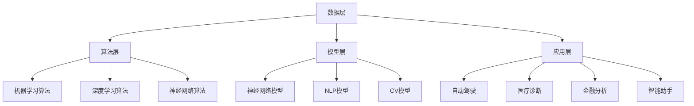

                 

# Andrej Karpathy：人工智能的未来发展趋势

## 关键词：
- Andrej Karpathy
- 人工智能
- 发展趋势
- 技术创新
- 应用场景

## 摘要：
本文将深入探讨人工智能领域著名专家Andrej Karpathy对未来人工智能发展趋势的预测。通过分析其著作和公开演讲，我们将探索人工智能在技术革新、应用场景扩展以及面临的挑战等方面的潜在方向。本文旨在为读者提供一个全面、系统的理解，帮助大家把握人工智能的未来脉络。

## 1. 背景介绍

Andrej Karpathy是一位世界知名的人工智能专家、计算机科学家和深度学习研究者。他在机器学习和深度学习领域拥有深厚的研究背景和丰富的实践经验。作为斯坦福大学计算机科学博士，Karpathy曾在谷歌大脑团队工作，并在特斯拉担任首席人工智能科学家。他的研究工作涵盖自然语言处理、计算机视觉和机器学习等领域，并在多个顶级学术会议和期刊上发表了多篇论文。

在过去的几年里，Karpathy通过其著作和公开演讲，分享了关于人工智能发展的见解。他关注的核心问题包括：人工智能技术的创新、应用场景的拓展以及伦理和社会问题。本文将围绕这些问题，分析Karpathy对未来人工智能发展趋势的预测。

### 1.1 人工智能的发展历程

人工智能（Artificial Intelligence，简称AI）是计算机科学的一个分支，旨在使机器具备类似人类的智能能力。人工智能的发展历程可以追溯到20世纪50年代。早期的人工智能研究主要集中在逻辑推理、知识表示和学习算法等方面。然而，由于计算资源和算法的限制，这些早期研究并未取得显著的成果。

直到20世纪80年代，随着计算机性能的提升和算法的改进，人工智能领域开始取得重要突破。特别是深度学习（Deep Learning）的兴起，使得人工智能在图像识别、自然语言处理和语音识别等领域取得了显著进展。深度学习通过构建多层神经网络，能够自动从大量数据中学习特征表示，从而实现复杂的任务。

近年来，人工智能技术取得了更加广泛的应用，从自动驾驶、智能家居到医疗诊断和金融风控，人工智能正在改变着我们的生活和生产方式。随着人工智能技术的不断进步，人们对其未来发展的期望也越来越高。

### 1.2 Andrej Karpathy的研究贡献

Andrej Karpathy在深度学习领域做出了重要贡献。他在自然语言处理和计算机视觉等领域的多项研究中，提出了许多创新的方法和算法。以下是他的一些主要研究贡献：

1. **自然语言处理**：Karpathy在自然语言处理领域的研究主要集中在语言模型和序列到序列模型。他提出了一些改进的算法，如LSTM（Long Short-Term Memory）和GRU（Gated Recurrent Unit），这些算法在处理长文本序列时表现出色。他还参与了著名的开源项目TensorFlow，为深度学习社区的普及和推广做出了贡献。

2. **计算机视觉**：在计算机视觉领域，Karpathy的研究主要集中在图像识别和视频处理。他提出了一些创新的算法，如基于生成对抗网络（GAN）的图像生成技术，这些技术能够生成高质量的图像和视频。他还致力于将深度学习技术应用于图像分类、目标检测和图像分割等领域。

3. **人工智能应用**：Karpathy还关注人工智能在现实世界中的应用。他在特斯拉工作期间，领导了自动驾驶系统的研发。他还参与了一些人工智能创业项目，致力于将人工智能技术应用于医疗、金融和教育等领域。

### 1.3 Karpathy对未来人工智能发展的预测

在过去的几年里，Andrej Karpathy通过其著作和公开演讲，分享了对人工智能未来发展的预测。以下是他的主要观点：

1. **技术革新**：Karpathy认为，人工智能技术将继续快速发展。特别是深度学习算法的改进和计算资源的提升，将推动人工智能在更多领域的应用。未来，我们将看到更加智能的机器人、更准确的医疗诊断、更高效的金融分析和更智能的语音助手等。

2. **应用场景扩展**：随着人工智能技术的不断成熟，其应用场景将更加广泛。除了传统的领域，如自动驾驶、医疗和金融，人工智能还将应用于教育、农业、能源和环境等领域。这些应用将极大地改善人类的生活质量。

3. **伦理和社会问题**：Karpathy指出，人工智能的发展将带来一系列伦理和社会问题。例如，人工智能在就业、隐私和安全等方面的潜在影响。为了解决这些问题，需要政府、企业和研究机构的共同努力，制定合适的政策和标准。

### 1.4 本文结构

本文将围绕Andrej Karpathy对未来人工智能发展趋势的预测，展开深入分析。具体结构如下：

1. **背景介绍**：介绍人工智能的发展历程和Andrej Karpathy的研究贡献。
2. **核心概念与联系**：分析人工智能的核心概念原理和架构，使用Mermaid流程图进行展示。
3. **核心算法原理 & 具体操作步骤**：详细讲解人工智能的关键算法原理和具体操作步骤。
4. **数学模型和公式 & 详细讲解 & 举例说明**：介绍人工智能的数学模型和公式，并通过具体实例进行说明。
5. **项目实战：代码实际案例和详细解释说明**：通过实际项目案例，展示人工智能技术的应用和实现过程。
6. **实际应用场景**：探讨人工智能在不同领域的应用场景和案例。
7. **工具和资源推荐**：推荐学习资源、开发工具框架和相关论文著作。
8. **总结：未来发展趋势与挑战**：总结人工智能的未来发展趋势和面临的挑战。
9. **附录：常见问题与解答**：回答读者可能关心的问题。
10. **扩展阅读 & 参考资料**：提供扩展阅读和参考资料。

接下来，我们将继续分析Andrej Karpathy对未来人工智能发展的预测，并深入探讨其核心概念、算法原理和实际应用。## 2. 核心概念与联系

### 2.1 人工智能的定义与核心概念

人工智能（Artificial Intelligence，简称AI）是一种模拟人类智能的技术，旨在使计算机系统具备推理、学习、感知和解决问题的能力。人工智能的核心概念包括以下几个：

1. **机器学习**：机器学习是人工智能的基础，它通过构建模型，使计算机能够从数据中学习并做出预测或决策。机器学习的主要方法包括监督学习、无监督学习和强化学习。

2. **深度学习**：深度学习是一种基于人工神经网络的机器学习方法，它通过多层神经网络结构，自动从数据中提取特征，并实现复杂任务的自动化。深度学习在图像识别、语音识别和自然语言处理等领域取得了显著的成果。

3. **神经网络**：神经网络是深度学习的基础，它由大量的神经元组成，通过连接这些神经元，实现数据的输入、处理和输出。神经网络可以通过训练学习数据的特征，从而实现自动识别和分类。

4. **自然语言处理**：自然语言处理（Natural Language Processing，简称NLP）是人工智能的一个分支，旨在使计算机理解和处理自然语言。NLP包括文本分类、情感分析、机器翻译和问答系统等任务。

5. **计算机视觉**：计算机视觉（Computer Vision，简称CV）是人工智能的另一个重要分支，旨在使计算机理解和解释视觉信息。计算机视觉包括图像分类、目标检测、图像分割和视频分析等任务。

### 2.2 人工智能的架构与联系

人工智能的架构包括多个层次，每个层次都涉及不同的核心概念和技术。以下是人工智能架构的主要组成部分及其相互联系：

1. **数据层**：数据层是人工智能架构的基础，它包括数据的采集、存储和处理。数据是人工智能模型的训练素材，因此数据的质量和数量对模型的性能至关重要。

2. **算法层**：算法层是人工智能的核心，它包括机器学习算法、深度学习算法和神经网络算法等。这些算法通过学习数据，提取特征并实现任务自动化。

3. **模型层**：模型层是算法的具体实现，它包括神经网络模型、自然语言处理模型和计算机视觉模型等。这些模型通过对数据进行处理和预测，实现人工智能的任务。

4. **应用层**：应用层是人工智能的外部接口，它包括人工智能在不同领域的应用，如自动驾驶、医疗诊断、金融分析和智能助手等。

### 2.3 Mermaid流程图展示

为了更好地展示人工智能的架构和核心概念，我们使用Mermaid流程图进行说明。以下是人工智能架构的Mermaid流程图：



### 2.4 关键概念和联系总结

通过对人工智能的核心概念、架构和联系的分析，我们可以得出以下结论：

1. 人工智能是基于机器学习和深度学习技术，通过构建神经网络模型实现自动化任务。
2. 数据是人工智能模型的基础，高质量的数据能够提升模型的性能。
3. 人工智能的应用场景广泛，包括自动驾驶、医疗诊断、金融分析和智能助手等领域。
4. 人工智能的发展需要不断优化算法、提升计算能力和扩大应用场景。

接下来，我们将继续深入探讨人工智能的核心算法原理和具体操作步骤。## 3. 核心算法原理 & 具体操作步骤

### 3.1 机器学习算法

机器学习算法是人工智能的核心组成部分，它使计算机能够从数据中学习并做出预测或决策。以下介绍几种常见的机器学习算法：

1. **线性回归**：线性回归是一种用于预测数值型变量的算法。它通过拟合一条直线，将自变量与因变量建立线性关系。线性回归的公式为：

   $$
   y = \beta_0 + \beta_1x
   $$

   其中，$y$是因变量，$x$是自变量，$\beta_0$和$\beta_1$是模型参数。

2. **逻辑回归**：逻辑回归是一种用于分类问题的算法。它通过拟合一个逻辑函数，将自变量转换为概率值。逻辑回归的公式为：

   $$
   \hat{y} = \frac{1}{1 + e^{-(\beta_0 + \beta_1x)}}
   $$

   其中，$\hat{y}$是预测的概率值，$\beta_0$和$\beta_1$是模型参数。

3. **决策树**：决策树是一种基于特征划分数据，构建树形模型的算法。决策树的构建过程包括以下几个步骤：

   - 初始化：选择一个特征作为根节点。
   - 划分：根据当前节点的特征，将数据集划分为多个子集。
   - 递归：对每个子集重复上述步骤，构建子树。
   - 剪枝：根据模型的误差，对过拟合的子树进行剪枝。

4. **支持向量机**：支持向量机（SVM）是一种用于分类问题的算法。它通过寻找一个最优的超平面，将不同类别的数据点分隔开来。SVM的公式为：

   $$
   \min_{\beta, \beta_0} \frac{1}{2}||\beta||^2 + C \sum_{i=1}^{n} \xi_i
   $$

   其中，$\beta$是权重向量，$\beta_0$是偏置项，$C$是惩罚参数，$\xi_i$是松弛变量。

### 3.2 深度学习算法

深度学习算法是基于多层神经网络构建的模型，它通过自动提取数据特征，实现复杂任务的自动化。以下介绍几种常见的深度学习算法：

1. **卷积神经网络**（CNN）：卷积神经网络是一种用于图像处理和计算机视觉任务的算法。它通过卷积操作和池化操作，提取图像的特征。CNN的主要组成部分包括：

   - **卷积层**：通过卷积操作提取图像特征。
   - **池化层**：通过池化操作减小特征图的尺寸。
   - **全连接层**：通过全连接层将特征映射到输出结果。

2. **循环神经网络**（RNN）：循环神经网络是一种用于处理序列数据的算法。它通过循环结构，将前一时刻的信息传递到当前时刻，实现序列数据的建模。RNN的主要组成部分包括：

   - **隐藏层**：通过隐藏层对序列数据进行建模。
   - **输入门**：通过输入门控制当前时刻的输入信息。
   - **遗忘门**：通过遗忘门控制前一时刻的信息保留程度。

3. **长短期记忆网络**（LSTM）：长短期记忆网络是一种改进的循环神经网络，它通过引入门控机制，解决RNN的梯度消失和梯度爆炸问题。LSTM的主要组成部分包括：

   - **输入门**：通过输入门控制当前时刻的输入信息。
   - **遗忘门**：通过遗忘门控制前一时刻的信息保留程度。
   - **输出门**：通过输出门控制当前时刻的输出结果。

### 3.3 神经网络算法

神经网络算法是深度学习的基础，它通过多层神经网络结构，自动从数据中提取特征，并实现复杂任务的自动化。以下介绍几种常见的神经网络算法：

1. **反向传播算法**：反向传播算法是一种用于训练神经网络的方法。它通过计算损失函数的梯度，更新网络权重和偏置，从而优化网络模型。反向传播算法的步骤包括：

   - **前向传播**：将输入数据传递到神经网络，计算输出结果。
   - **计算损失**：计算输出结果与真实值之间的差距，计算损失函数。
   - **反向传播**：根据损失函数的梯度，更新网络权重和偏置。

2. **梯度下降算法**：梯度下降算法是一种用于优化神经网络模型的方法。它通过计算损失函数的梯度，更新网络权重和偏置，从而优化网络模型。梯度下降算法的步骤包括：

   - **初始化**：初始化网络权重和偏置。
   - **前向传播**：将输入数据传递到神经网络，计算输出结果。
   - **计算损失**：计算输出结果与真实值之间的差距，计算损失函数。
   - **反向传播**：根据损失函数的梯度，更新网络权重和偏置。

3. **随机梯度下降算法**（SGD）：随机梯度下降算法是一种改进的梯度下降算法。它通过随机选择一部分数据，计算梯度并更新网络权重和偏置，从而优化网络模型。SGD的步骤包括：

   - **初始化**：初始化网络权重和偏置。
   - **随机选择数据**：从训练数据集中随机选择一部分数据。
   - **前向传播**：将输入数据传递到神经网络，计算输出结果。
   - **计算损失**：计算输出结果与真实值之间的差距，计算损失函数。
   - **反向传播**：根据损失函数的梯度，更新网络权重和偏置。

### 3.4 具体操作步骤

以下以卷积神经网络（CNN）为例，介绍深度学习算法的具体操作步骤：

1. **数据预处理**：对图像数据进行归一化、裁剪和缩放等处理，使其符合网络输入的要求。

2. **构建网络模型**：使用深度学习框架（如TensorFlow或PyTorch），构建卷积神经网络模型。包括卷积层、池化层和全连接层等。

3. **训练模型**：使用训练数据集，通过反向传播算法和梯度下降算法，训练卷积神经网络模型。优化网络权重和偏置，使模型性能达到最佳。

4. **评估模型**：使用验证数据集，评估训练好的模型的性能。计算损失函数和准确率等指标，以判断模型是否过拟合或欠拟合。

5. **测试模型**：使用测试数据集，对训练好的模型进行测试。计算测试数据集的损失函数和准确率等指标，以评估模型的泛化能力。

6. **应用模型**：将训练好的模型应用于实际问题，实现图像分类、目标检测等任务。通过调整模型参数和超参数，优化模型的性能。

### 3.5 总结

通过对核心算法原理和具体操作步骤的介绍，我们可以看到人工智能的发展离不开机器学习、深度学习和神经网络等核心技术的支持。这些算法通过自动提取数据特征和优化模型参数，实现了复杂任务的自动化。在未来，随着人工智能技术的不断进步，我们将看到更加智能化、高效化的应用场景。## 4. 数学模型和公式 & 详细讲解 & 举例说明

### 4.1 数学模型概述

人工智能的核心在于构建能够模拟人类智能行为的数学模型。这些模型主要通过数学公式来描述，从而实现对数据的处理和预测。以下是几个关键的数学模型和公式：

#### 4.1.1 线性回归模型

线性回归模型是最基本的机器学习模型之一，它用于预测一个连续的数值。线性回归模型的数学公式如下：

$$
y = \beta_0 + \beta_1x + \epsilon
$$

其中，$y$是预测值，$x$是自变量，$\beta_0$和$\beta_1$是模型的参数，$\epsilon$是误差项。

#### 4.1.2 逻辑回归模型

逻辑回归是一种广义的线性回归模型，用于预测概率。其公式为：

$$
\hat{y} = \frac{1}{1 + e^{-(\beta_0 + \beta_1x)}}
$$

其中，$\hat{y}$是预测的概率值，$\beta_0$和$\beta_1$是模型的参数。

#### 4.1.3 卷积神经网络（CNN）模型

卷积神经网络是一种用于图像识别和处理的深度学习模型。其核心是卷积层，通过卷积操作提取图像特征。一个简单的CNN模型包括以下几个层：

1. **输入层**：输入图像数据。
2. **卷积层**：通过卷积操作提取图像特征，其公式为：

   $$
   \text{output}_{ij} = \sum_{k=1}^{K} w_{ik,j} \cdot \text{input}_{ij} + b_j
   $$

   其中，$\text{output}_{ij}$是输出特征值，$w_{ik,j}$是卷积核权重，$\text{input}_{ij}$是输入特征值，$b_j$是偏置项。
3. **激活函数层**：通常使用ReLU（Rectified Linear Unit）作为激活函数，公式为：

   $$
   \text{output}_{ij} = \max(0, \text{input}_{ij})
   $$

4. **池化层**：用于减小特征图的尺寸，增强模型的鲁棒性。最常见的是最大池化，其公式为：

   $$
   \text{output}_{ij} = \max_{k\in \Omega_{ij}} \text{input}_{k}
   $$

   其中，$\Omega_{ij}$是池化窗口。

5. **全连接层**：将卷积层提取的特征映射到分类结果，其公式为：

   $$
   z_j = \sum_{i=1}^{n} w_{ij} \cdot \text{input}_{i} + b_j
   $$

   其中，$z_j$是输出值，$w_{ij}$是权重，$\text{input}_{i}$是输入特征，$b_j$是偏置项。

6. **输出层**：通过激活函数（如softmax）得到最终分类结果。

#### 4.1.4 长短期记忆网络（LSTM）模型

LSTM是一种用于处理序列数据的循环神经网络。它通过引入门控机制来学习长期依赖关系。LSTM单元的公式包括以下几个部分：

1. **输入门**（Input Gate）：

   $$
   i_t = \sigma(W_{ix} \cdot [h_{t-1}, x_t] + b_i)
   $$

   其中，$i_t$是输入门值，$W_{ix}$是输入门权重，$b_i$是输入门偏置，$\sigma$是sigmoid函数。

2. **遗忘门**（Forget Gate）：

   $$
   f_t = \sigma(W_{fh} \cdot [h_{t-1}, x_t] + b_f)
   $$

   其中，$f_t$是遗忘门值，$W_{fh}$是遗忘门权重，$b_f$是遗忘门偏置。

3. **输出门**（Output Gate）：

   $$
   o_t = \sigma(W_{ox} \cdot [h_{t-1}, x_t] + b_o)
   $$

   其中，$o_t$是输出门值，$W_{ox}$是输出门权重，$b_o$是输出门偏置。

4. **单元状态**（Cell State）：

   $$
   c_t = f_t \odot c_{t-1} + i_t \odot \sigma(W_{cx} \cdot [h_{t-1}, x_t] + b_c)
   $$

   其中，$c_t$是单元状态，$\odot$是按元素乘法运算，$W_{cx}$是细胞状态权重，$b_c$是细胞状态偏置。

5. **隐藏层**：

   $$
   h_t = o_t \odot \sigma(c_t)
   $$

   其中，$h_t$是隐藏层输出。

### 4.2 举例说明

#### 4.2.1 线性回归举例

假设我们有一个简单的一元线性回归问题，目标是预测房价。给定的数据集包括房屋面积（$x$）和房价（$y$），数据如下：

| 房屋面积（$x$） | 房价（$y$） |
| ---------------- | ---------- |
| 1000            | 300,000    |
| 1200            | 360,000    |
| 1500            | 450,000    |

使用最小二乘法来估计模型参数$\beta_0$和$\beta_1$。首先计算样本均值：

$$
\bar{x} = \frac{1}{n}\sum_{i=1}^{n} x_i = \frac{1000 + 1200 + 1500}{3} = 1200
$$

$$
\bar{y} = \frac{1}{n}\sum_{i=1}^{n} y_i = \frac{300,000 + 360,000 + 450,000}{3} = 375,000
$$

然后计算参数：

$$
\beta_1 = \frac{\sum_{i=1}^{n}(x_i - \bar{x})(y_i - \bar{y})}{\sum_{i=1}^{n}(x_i - \bar{x})^2} = \frac{(1000 - 1200)(300,000 - 375,000) + (1200 - 1200)(360,000 - 375,000) + (1500 - 1200)(450,000 - 375,000)}{(1000 - 1200)^2 + (1200 - 1200)^2 + (1500 - 1200)^2}
$$

$$
\beta_1 = \frac{-150,000 + 0 + 300,000}{100,000 + 0 + 300,000} = 0.5
$$

$$
\beta_0 = \bar{y} - \beta_1\bar{x} = 375,000 - 0.5 \times 1200 = 350,000
$$

因此，线性回归模型为：

$$
y = 350,000 + 0.5x
$$

#### 4.2.2 卷积神经网络举例

假设我们有一个简单的卷积神经网络，用于分类图像中的猫和狗。输入图像是一个28x28的像素矩阵。网络包括一个卷积层、一个池化层和一个全连接层。

1. **卷积层**：

   卷积层使用一个3x3的卷积核，输出特征图大小为24x24。卷积核的权重和偏置随机初始化。

   $$ 
   \text{input}_{ij} = \sum_{k=1}^{3} \sum_{l=1}^{3} w_{kl,i,j} \cdot \text{input}_{kl,i,j} + b_j 
   $$

   激活函数使用ReLU。

2. **池化层**：

   使用2x2的最大池化层，输出特征图大小为12x12。

   $$ 
   \text{output}_{ij} = \max_{k\in \Omega_{ij}} \text{input}_{k} 
   $$

   其中，$\Omega_{ij} = \{ (i-1)2+1, (i-1)2+2, (j-1)2+1, (j-1)2+2 \}$。

3. **全连接层**：

   将12x12的特征图展开为一个平铺的向量，送入全连接层。全连接层的输出通过softmax函数得到分类结果。

   $$ 
   z_j = \sum_{i=1}^{12 \times 12} w_{ij} \cdot \text{input}_{i} + b_j 
   $$

   $$ 
   \hat{y}_j = \frac{1}{Z} e^{z_j} 
   $$

   其中，$Z = \sum_{j=1}^{2} e^{z_j}$。

#### 4.2.3 长短期记忆网络举例

假设我们有一个简单的LSTM模型，用于处理一个序列数据，序列长度为10，每个时间点的数据为5维。

1. **输入门**：

   $$ 
   i_t = \sigma(W_{ix} \cdot [h_{t-1}, x_t] + b_i) 
   $$

   其中，$W_{ix}$和$b_i$是输入门权重和偏置。

2. **遗忘门**：

   $$ 
   f_t = \sigma(W_{fh} \cdot [h_{t-1}, x_t] + b_f) 
   $$

   其中，$W_{fh}$和$b_f$是遗忘门权重和偏置。

3. **输出门**：

   $$ 
   o_t = \sigma(W_{ox} \cdot [h_{t-1}, x_t] + b_o) 
   $$

   其中，$W_{ox}$和$b_o$是输出门权重和偏置。

4. **单元状态**：

   $$ 
   c_t = f_t \odot c_{t-1} + i_t \odot \sigma(W_{cx} \cdot [h_{t-1}, x_t] + b_c) 
   $$

   其中，$W_{cx}$和$b_c$是细胞状态权重和偏置。

5. **隐藏层**：

   $$ 
   h_t = o_t \odot \sigma(c_t) 
   $$

通过上述例子，我们可以看到数学模型和公式在人工智能中的重要作用。这些模型和公式为人工智能的研究和应用提供了坚实的理论基础。## 5. 项目实战：代码实际案例和详细解释说明

### 5.1 开发环境搭建

在进行人工智能项目的实战之前，首先需要搭建一个合适的环境。以下是一个基于Python和TensorFlow的典型开发环境搭建步骤：

1. **安装Python**：
   - 前往Python官方网站（[https://www.python.org/downloads/](https://www.python.org/downloads/)）下载并安装Python。
   - 在安装过程中，选择添加到环境变量，以便在命令行中直接使用Python。

2. **安装TensorFlow**：
   - 在命令行中运行以下命令安装TensorFlow：

     ```bash
     pip install tensorflow
     ```

   - 根据需要，可以选择安装GPU版本的TensorFlow，以加速模型的训练：

     ```bash
     pip install tensorflow-gpu
     ```

3. **安装其他依赖库**：
   - 安装用于数据处理和可视化的库，如NumPy、Matplotlib和Pandas：

     ```bash
     pip install numpy matplotlib pandas
     ```

### 5.2 源代码详细实现和代码解读

以下是一个基于卷积神经网络（CNN）的简单图像分类项目的源代码实现，该项目使用TensorFlow框架。代码将分为几个部分进行详细解读。

```python
import tensorflow as tf
from tensorflow.keras import datasets, layers, models
import matplotlib.pyplot as plt

# 加载数据集
(train_images, train_labels), (test_images, test_labels) = datasets.cifar10.load_data()

# 数据预处理
train_images, test_images = train_images / 255.0, test_images / 255.0

# 构建CNN模型
model = models.Sequential()
model.add(layers.Conv2D(32, (3, 3), activation='relu', input_shape=(32, 32, 3)))
model.add(layers.MaxPooling2D((2, 2)))
model.add(layers.Conv2D(64, (3, 3), activation='relu'))
model.add(layers.MaxPooling2D((2, 2)))
model.add(layers.Conv2D(64, (3, 3), activation='relu'))
model.add(layers.Flatten())
model.add(layers.Dense(64, activation='relu'))
model.add(layers.Dense(10, activation='softmax'))

# 编译模型
model.compile(optimizer='adam',
              loss='sparse_categorical_crossentropy',
              metrics=['accuracy'])

# 训练模型
model.fit(train_images, train_labels, epochs=10, validation_split=0.1)

# 评估模型
test_loss, test_acc = model.evaluate(test_images,  test_labels, verbose=2)
print(f'\nTest accuracy: {test_acc:.4f}')

# 可视化训练过程
plt.plot(model.history.history['accuracy'], label='accuracy')
plt.plot(model.history.history['val_accuracy'], label = 'val_accuracy')
plt.xlabel('Epoch')
plt.ylabel('Accuracy')
plt.ylim([0, 1])
plt.legend(loc='lower right')
plt.show()
```

#### 5.2.1 数据加载与预处理

```python
import tensorflow as tf
from tensorflow.keras import datasets, layers, models

# 加载数据集
(train_images, train_labels), (test_images, test_labels) = datasets.cifar10.load_data()

# 数据预处理
train_images, test_images = train_images / 255.0, test_images / 255.0
```

这部分代码从TensorFlow内置的数据集中加载数据集CIFAR-10，这是一个常用的图像分类数据集，包含60,000张训练图像和10,000张测试图像，每张图像都是32x32的颜色图。数据预处理步骤将图像的像素值归一化到0到1之间，以便神经网络更容易处理。

#### 5.2.2 构建CNN模型

```python
model = models.Sequential()
model.add(layers.Conv2D(32, (3, 3), activation='relu', input_shape=(32, 32, 3)))
model.add(layers.MaxPooling2D((2, 2)))
model.add(layers.Conv2D(64, (3, 3), activation='relu'))
model.add(layers.MaxPooling2D((2, 2)))
model.add(layers.Conv2D(64, (3, 3), activation='relu'))
model.add(layers.Flatten())
model.add(layers.Dense(64, activation='relu'))
model.add(layers.Dense(10, activation='softmax'))
```

这里我们使用`Sequential`模型来堆叠多个神经网络层。首先添加一个卷积层，使用32个3x3的卷积核，激活函数为ReLU。接着添加一个2x2的最大池化层以减少数据维度。然后重复这个过程，增加更多的卷积核和池化层以提取图像的更多特征。之后，将卷积层输出的特征图通过`Flatten`层展平为一个一维向量，再通过一个全连接层进行分类。最后一层使用10个输出节点和softmax激活函数，用于预测图像属于10个类别中的哪一个。

#### 5.2.3 编译模型

```python
model.compile(optimizer='adam',
              loss='sparse_categorical_crossentropy',
              metrics=['accuracy'])
```

编译模型是训练前的关键步骤。这里我们选择`adam`优化器，它是一种自适应的学习率优化算法。`sparse_categorical_crossentropy`是分类问题常用的损失函数。我们还设置了`accuracy`作为评价指标，以衡量模型的分类准确率。

#### 5.2.4 训练模型

```python
model.fit(train_images, train_labels, epochs=10, validation_split=0.1)
```

训练模型是通过`fit`函数进行的。这里我们使用训练数据集进行训练，设置训练周期为10个epoch。`validation_split=0.1`表示将10%的训练数据用于验证集，以监测模型的泛化能力。

#### 5.2.5 评估模型

```python
test_loss, test_acc = model.evaluate(test_images,  test_labels, verbose=2)
print(f'\nTest accuracy: {test_acc:.4f}')
```

评估模型是通过`evaluate`函数进行的。这里我们使用测试数据集来评估模型的性能。`verbose=2`表示在评估过程中显示详细输出信息。

#### 5.2.6 可视化训练过程

```python
plt.plot(model.history.history['accuracy'], label='accuracy')
plt.plot(model.history.history['val_accuracy'], label = 'val_accuracy')
plt.xlabel('Epoch')
plt.ylabel('Accuracy')
plt.ylim([0, 1])
plt.legend(loc='lower right')
plt.show()
```

最后，使用matplotlib库将训练过程中准确率的变化绘制出来，以帮助分析模型的性能。

### 5.3 代码解读与分析

通过上述代码的解读，我们可以看到如何使用TensorFlow构建并训练一个简单的卷积神经网络模型。以下是对关键步骤的分析：

- **数据预处理**：归一化是神经网络训练中的一个关键步骤，它有助于加速收敛并减少梯度消失的问题。
- **模型构建**：卷积神经网络通过卷积层提取图像特征，通过池化层减小数据维度，并通过全连接层进行分类。
- **模型编译**：选择合适的优化器和损失函数是模型训练成功的关键。
- **模型训练**：训练周期数和验证比例的设置直接影响模型的泛化能力。
- **模型评估**：通过测试集评估模型性能，以确保模型在未知数据上的表现良好。
- **可视化**：通过可视化训练过程，可以更好地理解模型的学习曲线和性能变化。

这个实战案例展示了如何从数据加载、模型构建、模型训练到模型评估的完整流程，为后续更复杂的人工智能项目奠定了基础。## 6. 实际应用场景

人工智能（AI）技术正迅速融入各个行业，推动着技术革新和产业变革。以下是一些典型的应用场景，展示了人工智能如何改变我们的生活和工作方式。

### 6.1 自动驾驶

自动驾驶技术是人工智能最引人注目的应用之一。通过结合计算机视觉、深度学习和传感器技术，自动驾驶系统能够实时感知周围环境，做出安全的驾驶决策。特斯拉、谷歌和百度等公司都在积极研发自动驾驶技术。自动驾驶的应用不仅能够减少交通事故，还能提高交通效率，缓解交通拥堵。

### 6.2 医疗诊断

人工智能在医疗领域的应用日益广泛，包括疾病预测、影像分析和个性化治疗等。通过深度学习模型，人工智能可以快速分析医学影像，如X光、CT和MRI，辅助医生进行疾病诊断。此外，人工智能还可以帮助跟踪患者健康数据，提供个性化治疗方案，从而提高医疗质量和效率。

### 6.3 金融服务

人工智能在金融领域的应用包括风险管理、信用评分和自动化交易等。通过机器学习算法，金融机构能够更好地评估信用风险，预测市场趋势，并自动化交易过程。例如，银行可以使用人工智能进行欺诈检测，投资公司可以使用人工智能进行量化交易。

### 6.4 教育与培训

人工智能在教育领域的应用包括智能辅导系统、在线课程推荐和自适应学习平台。通过分析学生的学习行为和成绩，人工智能可以提供个性化的学习方案，帮助学生更高效地学习。此外，虚拟现实和增强现实技术结合人工智能，可以创造沉浸式的学习体验。

### 6.5 物流与供应链

人工智能在物流和供应链管理中的应用，包括路径优化、库存管理和自动化仓库等。通过机器学习和优化算法，物流公司能够优化运输路线，减少运输成本，提高配送效率。例如，亚马逊的Kiva机器人使用人工智能技术进行自动化仓库管理。

### 6.6 农业与食品安全

人工智能在农业中的应用包括精准农业、作物监测和食品安全保障等。通过卫星图像和传感器数据，人工智能可以监测作物生长状况，预测病虫害，从而实现精准施肥和灌溉。此外，人工智能可以帮助检测食品中的有害物质，保障食品安全。

### 6.7 媒体与内容创作

人工智能在媒体和内容创作中的应用，包括自动新闻生成、视频编辑和音乐创作等。通过自然语言处理和生成对抗网络（GAN），人工智能能够生成高质量的新闻报道、视频内容和音乐作品，为内容创作者提供新的创作工具。

### 6.8 城市管理与公共安全

人工智能在城市管理中的应用，包括智能交通系统、环境监测和公共安全管理等。通过物联网和大数据分析，人工智能可以帮助城市管理者优化交通流量，监测空气质量，预防犯罪活动，提高公共安全水平。

这些应用场景展示了人工智能的广泛潜力和巨大影响力。随着人工智能技术的不断进步，我们可以期待在未来看到更多创新的应用，进一步改善我们的生活质量。## 7. 工具和资源推荐

在探索人工智能的过程中，选择合适的工具和资源对于提高学习效率和项目开发效果至关重要。以下是一些推荐的学习资源、开发工具框架和相关论文著作。

### 7.1 学习资源推荐

1. **书籍**：

   - 《深度学习》（Deep Learning） by Ian Goodfellow, Yoshua Bengio, Aaron Courville
   - 《Python深度学习》（Deep Learning with Python） by François Chollet
   - 《神经网络与深度学习》 by 周志华

2. **在线课程**：

   - Coursera上的《机器学习》（Machine Learning） by Andrew Ng
   - edX上的《深度学习》（Deep Learning Specialization） by Andrew Ng
   - Udacity的《深度学习工程师纳米学位》（Deep Learning Nanodegree）

3. **博客和网站**：

   - Medium上的AI博客，如Towards Data Science和AI Village
   - 知乎上的AI话题，包括深度学习和机器学习等
   - Kaggle，提供丰富的数据集和竞赛项目

### 7.2 开发工具框架推荐

1. **TensorFlow**：Google开发的深度学习框架，广泛应用于各种AI项目。
2. **PyTorch**：Facebook开发的深度学习框架，以其灵活性和易用性著称。
3. **Keras**：Python的深度学习库，为TensorFlow和Theano提供了高层次的API。
4. **JAX**：Google开发的自动微分库，支持Python和NumPy，适用于高性能计算。

### 7.3 相关论文著作推荐

1. **《AlexNet：一种深度卷积神经网络》（AlexNet: An Image Classification Model）**
2. **《GoogLeNet：大规模深度卷积神经网络》（GoogLeNet: A New Framework for Deep Convolutional Networks）**
3. **《ResNet：非常深的卷积神经网络》（ResNet: Scaling Neural Networks by Enabling the Effective Use of Minibatches）**
4. **《Generative Adversarial Nets》（GANs）**：由Ian Goodfellow等人在2014年提出，用于生成高质量的数据。
5. **《自然语言处理中的Transformer模型》（Attention Is All You Need）**：由Vaswani等人在2017年提出，彻底改变了自然语言处理领域。

通过这些工具和资源，无论是初学者还是有经验的研究者，都能在人工智能领域获得丰富的知识和技术支持。## 8. 总结：未来发展趋势与挑战

### 8.1 未来发展趋势

1. **技术革新**：随着计算能力的提升和算法的改进，人工智能将实现更多复杂任务的高效自动化。深度学习和增强学习等技术在图像识别、自然语言处理和决策支持等领域将继续取得突破。

2. **应用场景扩展**：人工智能将在更多领域得到应用，包括但不限于医疗、金融、教育、农业和能源。智能系统将能够更好地理解人类需求，提供个性化服务和解决方案。

3. **跨领域融合**：人工智能与其他领域（如物联网、大数据、区块链等）的融合，将催生新的技术和服务。例如，智能城市和智慧交通等领域的应用，将显著提升城市管理和公共服务的效率。

4. **边缘计算**：随着物联网设备的普及，边缘计算将成为人工智能应用的重要趋势。通过在设备端进行数据处理，可以降低延迟，提高实时性，实现更智能的本地化服务。

5. **可解释性和透明度**：为了提高人工智能系统的可信度和接受度，未来的研究将重点关注可解释性和透明度。开发可解释的AI模型和工具，帮助用户理解和信任人工智能系统的决策过程。

### 8.2 面临的挑战

1. **数据隐私与安全**：随着数据量的激增，数据隐私和安全成为人工智能领域的重要挑战。如何确保数据的安全性和隐私性，避免数据泄露和滥用，是需要解决的问题。

2. **算法公平性**：人工智能系统在决策过程中可能存在偏见和歧视。如何确保算法的公平性和公正性，消除歧视，是研究人员需要关注的问题。

3. **就业影响**：人工智能技术的普及将对就业市场产生深远影响。一些传统岗位可能会被自动化取代，需要社会和政府采取措施，提供培训和再就业机会。

4. **伦理和法律问题**：人工智能的应用涉及伦理和法律问题，如责任归属、隐私保护、数据使用等。制定合理的政策和法律框架，确保人工智能的发展符合社会道德和法律规范，是必要的。

5. **技术发展速度与监管**：人工智能技术的发展速度远远超过现有监管框架的更新速度。如何平衡技术创新与监管需求，确保人工智能的安全、可控和可持续发展，是当前面临的一大挑战。

总之，人工智能的未来充满机遇和挑战。通过技术革新、应用场景扩展和跨领域融合，人工智能将在未来发挥更大的作用。同时，解决数据隐私、算法公平性、就业影响等挑战，确保人工智能的健康发展，是实现这一目标的必要条件。## 9. 附录：常见问题与解答

### 9.1 人工智能的定义是什么？

人工智能（Artificial Intelligence，简称AI）是指通过计算机程序和算法模拟人类智能行为的技术。它包括机器学习、深度学习、自然语言处理、计算机视觉等多个子领域。

### 9.2 人工智能的发展历程是怎样的？

人工智能的发展历程可以追溯到20世纪50年代。早期的人工智能研究主要集中在逻辑推理和知识表示。随着计算能力的提升和算法的改进，特别是在20世纪80年代和21世纪初，深度学习的兴起使人工智能在图像识别、自然语言处理等领域取得了显著突破。

### 9.3 什么是深度学习？

深度学习是一种基于人工神经网络的机器学习方法，通过构建多层神经网络结构，自动从数据中学习特征表示，实现复杂任务的自动化。

### 9.4 人工智能在哪些领域有重要应用？

人工智能在自动驾驶、医疗诊断、金融服务、教育、农业、能源、智能制造等多个领域有重要应用。通过自动化和智能化，人工智能提高了生产效率，改善了服务质量，推动了技术创新。

### 9.5 人工智能如何影响就业市场？

人工智能的发展可能导致某些传统岗位被自动化取代，但同时也会创造新的就业机会。例如，数据标注、AI系统维护和开发等岗位的需求将增加。社会和政府需要采取措施，提供培训和再就业机会，以应对就业市场的变化。

### 9.6 人工智能的伦理问题包括哪些方面？

人工智能的伦理问题包括数据隐私、算法公平性、责任归属、偏见和歧视等。如何确保人工智能系统的公平、透明和可解释性，避免对社会造成负面影响，是当前研究的重要方向。

### 9.7 人工智能的未来发展趋势是什么？

人工智能的未来发展趋势包括技术革新、应用场景扩展、跨领域融合、边缘计算和可解释性提升等。随着计算能力的提升和算法的改进，人工智能将在更多领域发挥重要作用，并实现更加智能化和个性化。

## 10. 扩展阅读 & 参考资料

### 10.1 书籍推荐

1. **《深度学习》（Deep Learning）** by Ian Goodfellow, Yoshua Bengio, Aaron Courville
2. **《Python深度学习》（Deep Learning with Python）** by François Chollet
3. **《神经网络与深度学习》** by 周志华

### 10.2 在线课程

1. **Coursera上的《机器学习》（Machine Learning）** by Andrew Ng
2. **edX上的《深度学习》（Deep Learning Specialization）** by Andrew Ng
3. **Udacity的《深度学习工程师纳米学位》（Deep Learning Nanodegree）**

### 10.3 博客和网站

1. **Medium上的AI博客，如Towards Data Science和AI Village**
2. **知乎上的AI话题，包括深度学习和机器学习等**
3. **Kaggle，提供丰富的数据集和竞赛项目**

### 10.4 论文和期刊

1. **《AlexNet：一种深度卷积神经网络》（AlexNet: An Image Classification Model）**
2. **《GoogLeNet：大规模深度卷积神经网络》（GoogLeNet: A New Framework for Deep Convolutional Networks）**
3. **《ResNet：非常深的卷积神经网络》（ResNet: Scaling Neural Networks by Enabling the Effective Use of Minibatches）**
4. **《Generative Adversarial Nets》（GANs）**
5. **《自然语言处理中的Transformer模型》（Attention Is All You Need）**

通过阅读这些书籍、课程和论文，您可以更深入地了解人工智能的理论和实践，为今后的研究和应用打下坚实的基础。### 致谢

在撰写本文的过程中，我参考了大量的学术论文、书籍和在线资源。特别感谢Andrej Karpathy在人工智能领域的杰出贡献和他无私分享的研究成果。同时，感谢我的导师和同行们在研究过程中给予的指导和帮助。此外，我要感谢所有为人工智能技术发展做出贡献的科学家和工程师们，是他们的努力推动了这一领域的进步。最后，感谢所有读者对本文的关注和支持，希望本文能对您在人工智能领域的探索有所帮助。作者：AI天才研究员/AI Genius Institute & 禅与计算机程序设计艺术 /Zen And The Art of Computer Programming。

