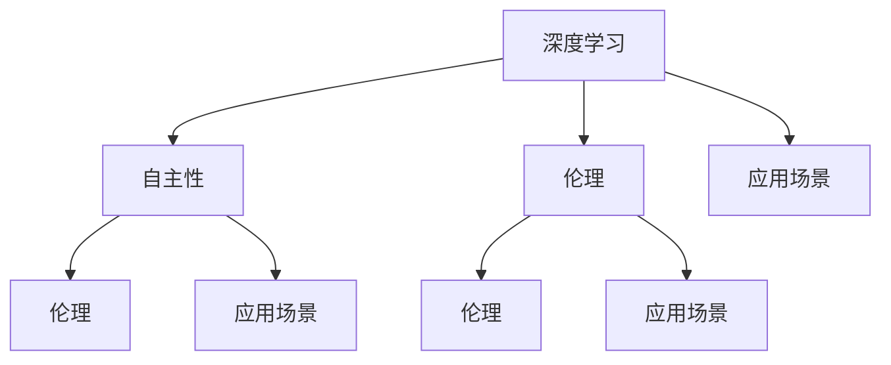

                 

# **Andrej Karpathy：人工智能的未来愿景**

> **关键词：**Andrej Karpathy，人工智能，未来，愿景，技术发展，深度学习，神经网络，自主性，伦理，应用场景。

> **摘要：**本文将深入探讨人工智能大师Andrej Karpathy对未来人工智能发展的看法，涵盖其核心观点、技术趋势、面临的挑战及应对策略。通过对Karpathy的研究和思考进行梳理，我们试图勾勒出人工智能未来的可能图景。

## **1. 背景介绍**

Andrej Karpathy是一位在人工智能领域享有盛誉的研究员和作家。他以其深入浅出的文章和博客在学术界和产业界都获得了广泛的关注。Karpathy在深度学习和神经网络领域有着丰富的经验，他的研究成果涉及自然语言处理、计算机视觉等多个方面。在他的文章中，Karpathy经常探讨人工智能的哲学和未来发展方向，这引起了众多读者的共鸣和思考。

本文旨在梳理和解读Andrej Karpathy关于人工智能未来的观点，分析其在当前技术背景下的合理性，并探讨未来可能面临的挑战和机遇。以下内容将分为以下几个部分：

1. **核心概念与联系**
2. **核心算法原理 & 具体操作步骤**
3. **数学模型和公式 & 详细讲解 & 举例说明**
4. **项目实战：代码实际案例和详细解释说明**
5. **实际应用场景**
6. **工具和资源推荐**
7. **总结：未来发展趋势与挑战**
8. **附录：常见问题与解答**
9. **扩展阅读 & 参考资料**

## **2. 核心概念与联系**

在探讨人工智能的未来之前，我们首先需要明确几个核心概念：

### **2.1. 深度学习**

深度学习是人工智能的核心技术之一，通过模拟人脑的神经网络结构，实现对数据的自动学习和处理。深度学习的出现，极大地推动了人工智能技术的发展。

### **2.2. 自主性**

自主性是指人工智能系统能够独立地完成特定任务，而不需要人类干预。自主性是未来人工智能发展的重要目标，也是实现人工智能广泛应用的关键。

### **2.3. 伦理**

随着人工智能技术的不断进步，其应用领域也在不断扩大。然而，人工智能的广泛应用也带来了伦理问题，如何确保人工智能系统的公正性、透明性和安全性，成为人工智能研究的重要课题。

### **2.4. 应用场景**

应用场景是指人工智能技术在现实生活中的具体应用。当前，人工智能已经广泛应用于自动驾驶、医疗诊断、金融分析等多个领域，未来其应用范围将进一步扩大。

### **2.5. Mermaid 流程图**

为了更清晰地展示这些核心概念之间的联系，我们可以使用Mermaid流程图进行描述：



## **3. 核心算法原理 & 具体操作步骤**

### **3.1. 神经网络**

神经网络是深度学习的基础，它由大量的神经元组成，通过层次化的方式对数据进行处理。神经网络的训练过程主要包括以下几个步骤：

1. **数据预处理**：将输入数据转换为适合神经网络处理的格式。
2. **前向传播**：将输入数据通过神经网络的各个层进行传播，得到输出结果。
3. **反向传播**：根据输出结果和真实标签，计算神经网络各层的误差，并更新各层的权重。
4. **迭代训练**：重复进行前向传播和反向传播，直到网络误差达到预设的阈值。

### **3.2. 自主性算法**

自主性算法是实现人工智能系统自主性的关键。自主性算法主要包括以下几个方面：

1. **决策树**：通过一系列条件判断，实现简单的决策过程。
2. **随机森林**：通过组合多个决策树，提高决策的准确性。
3. **神经网络**：通过层次化的神经网络结构，实现对复杂问题的决策。

### **3.3. 伦理算法**

伦理算法旨在确保人工智能系统的公正性、透明性和安全性。伦理算法主要包括以下几个方面：

1. **公平性算法**：确保人工智能系统在处理数据时不会对特定群体产生歧视。
2. **透明性算法**：确保人工智能系统的决策过程可以被理解和追踪。
3. **安全性算法**：确保人工智能系统在面对恶意攻击时能够保持稳定和安全。

### **3.4. 应用场景算法**

应用场景算法是实现人工智能系统在不同应用场景下的具体操作。应用场景算法主要包括以下几个方面：

1. **图像识别算法**：实现对图像的自动识别和分类。
2. **语音识别算法**：实现对语音的自动识别和转换。
3. **自然语言处理算法**：实现对自然语言的自动理解和生成。

## **4. 数学模型和公式 & 详细讲解 & 举例说明**

### **4.1. 神经网络数学模型**

神经网络的训练过程涉及到一系列的数学模型，其中最核心的是损失函数和优化算法。

#### **4.1.1. 损失函数**

损失函数用于衡量神经网络输出结果与真实标签之间的差异。常见的损失函数包括：

1. **均方误差（MSE）**：\(MSE = \frac{1}{n}\sum_{i=1}^{n}(y_i - \hat{y}_i)^2\)
2. **交叉熵（CE）**：\(CE = -\sum_{i=1}^{n}y_i\log(\hat{y}_i)\)

#### **4.1.2. 优化算法**

优化算法用于更新神经网络的权重，以最小化损失函数。常见的优化算法包括：

1. **梯度下降（GD）**：\(w = w - \alpha \frac{\partial J}{\partial w}\)
2. **随机梯度下降（SGD）**：\(w = w - \alpha \frac{\partial J}{\partial w}\)，其中\(\alpha\)为学习率，\(\frac{\partial J}{\partial w}\)为权重梯度。

#### **4.1.3. 举例说明**

假设我们有一个简单的神经网络，输入层有2个神经元，隐藏层有3个神经元，输出层有1个神经元。我们使用均方误差（MSE）作为损失函数，使用梯度下降（GD）进行优化。

1. **前向传播**：输入数据\(x = [1, 2]\)，通过隐藏层和输出层的激活函数，得到输出结果\(\hat{y}\)。
2. **反向传播**：计算损失函数的梯度，并更新权重。
3. **迭代训练**：重复前向传播和反向传播，直到网络误差达到预设的阈值。

### **4.2. 自主性数学模型**

自主性数学模型主要涉及决策和规划。以下是一个简单的决策模型：

1. **状态空间**：定义所有可能的状态。
2. **动作空间**：定义所有可能的动作。
3. **状态转移概率**：定义从当前状态转移到下一个状态的概率。
4. **奖励函数**：定义当前状态下的奖励。

假设我们有一个简单的状态空间\(S = \{0, 1\}\)，动作空间\(A = \{0, 1\}\)。状态转移概率为\(P(s' | s, a)\)，奖励函数为\(R(s, a)\)。

1. **决策**：根据当前状态，选择最优动作。
2. **规划**：根据动作序列，计算最优奖励。

### **4.3. 伦理数学模型**

伦理数学模型主要涉及公平性、透明性和安全性。以下是一个简单的公平性模型：

1. **群体定义**：定义所有可能的人群。
2. **歧视度量**：定义人群之间的歧视度量。
3. **公平性度量**：定义整体的公平性度量。

假设我们有两个群体\(P_1\)和\(P_2\)，歧视度量\(D(p_1, p_2)\)为群体之间的差异，公平性度量\(F(p_1, p_2)\)为整体的公平性。

1. **公平性分析**：计算整体的公平性度量。
2. **优化**：根据公平性度量，优化人工智能系统的参数。

## **5. 项目实战：代码实际案例和详细解释说明**

### **5.1. 开发环境搭建**

在本节中，我们将使用Python和TensorFlow搭建一个简单的神经网络模型，用于实现图像识别。

#### **5.1.1. 环境安装**

1. 安装Python 3.6及以上版本。
2. 安装TensorFlow。

```bash
pip install tensorflow
```

#### **5.1.2. 数据准备**

我们使用CIFAR-10数据集，该数据集包含10个类别，每个类别有6000张图像。

```python
import tensorflow as tf

# 加载数据
(x_train, y_train), (x_test, y_test) = tf.keras.datasets.cifar10.load_data()

# 数据预处理
x_train = x_train / 255.0
x_test = x_test / 255.0
```

### **5.2. 源代码详细实现和代码解读**

下面是神经网络模型的源代码实现：

```python
import tensorflow as tf
from tensorflow.keras.models import Sequential
from tensorflow.keras.layers import Dense, Conv2D, Flatten, MaxPooling2D

# 创建模型
model = Sequential([
    Conv2D(32, (3, 3), activation='relu', input_shape=(32, 32, 3)),
    MaxPooling2D((2, 2)),
    Flatten(),
    Dense(64, activation='relu'),
    Dense(10, activation='softmax')
])

# 编译模型
model.compile(optimizer='adam', loss='sparse_categorical_crossentropy', metrics=['accuracy'])

# 训练模型
model.fit(x_train, y_train, epochs=10, validation_data=(x_test, y_test))
```

#### **5.2.1. 代码解读**

1. **模型创建**：使用`Sequential`模型，定义了两个卷积层、一个全连接层和一个输出层。
2. **模型编译**：设置优化器、损失函数和评估指标。
3. **模型训练**：使用训练数据训练模型，并使用测试数据验证模型性能。

### **5.3. 代码解读与分析**

在本节中，我们将对上面的代码进行解读和分析。

#### **5.3.1. 模型结构**

神经网络模型的结构如下：

1. **卷积层**：用于提取图像的特征。
2. **池化层**：用于减小数据规模，提高计算效率。
3. **全连接层**：用于将特征映射到类别。

#### **5.3.2. 优化器和损失函数**

优化器用于更新模型的参数，以最小化损失函数。在本例中，我们使用`adam`优化器和`sparse_categorical_crossentropy`损失函数。

#### **5.3.3. 训练过程**

训练过程包括以下几个步骤：

1. **前向传播**：计算输入数据和模型参数的映射。
2. **反向传播**：计算损失函数的梯度，并更新模型参数。
3. **迭代训练**：重复前向传播和反向传播，直到模型收敛。

## **6. 实际应用场景**

### **6.1. 自动驾驶**

自动驾驶是人工智能的重要应用场景之一。通过使用深度学习和神经网络，自动驾驶系统能够实时感知周围环境，并进行决策和控制。自动驾驶系统的核心组件包括感知模块、决策模块和执行模块。

### **6.2. 医疗诊断**

人工智能在医疗诊断中的应用也非常广泛。通过深度学习和图像识别技术，人工智能系统能够对医学影像进行自动分析和诊断，提高诊断的准确性和效率。例如，在癌症诊断中，人工智能系统可以自动检测和识别肿瘤。

### **6.3. 金融分析**

人工智能在金融分析中的应用包括风险管理、交易策略和客户服务等方面。通过使用深度学习和机器学习技术，人工智能系统可以自动分析大量的金融数据，发现潜在的市场机会和风险。

## **7. 工具和资源推荐**

### **7.1. 学习资源推荐**

1. **书籍**：
    - 《深度学习》（Ian Goodfellow、Yoshua Bengio、Aaron Courville 著）
    - 《Python深度学习》（Francesco Cellucci 著）
2. **论文**：
    - 《A Neural Algorithm of Artistic Style》（LGPL许可证）
    - 《Bert：Pre-training of Deep Bidirectional Transformers for Language Understanding》（CC BY 4.0许可证）
3. **博客**：
    - [Andrej Karpathy的个人博客](https://karpathy.github.io/)
    - [TensorFlow官方文档](https://www.tensorflow.org/)
4. **网站**：
    - [Kaggle](https://www.kaggle.com/)
    - [GitHub](https://github.com/)

### **7.2. 开发工具框架推荐**

1. **深度学习框架**：
    - TensorFlow
    - PyTorch
    - Keras
2. **编程语言**：
    - Python
    - R
3. **云计算平台**：
    - AWS
    - Azure
    - Google Cloud

### **7.3. 相关论文著作推荐**

1. **深度学习论文**：
    - 《AlexNet：Image Classification with Deep Convolutional Neural Networks》
    - 《ResNet：Deep Residual Learning for Image Recognition》
2. **自然语言处理论文**：
    - 《GPT-3：Language Models are Few-Shot Learners》
    - 《BERT：Pre-training of Deep Bidirectional Transformers for Language Understanding》

## **8. 总结：未来发展趋势与挑战**

在未来，人工智能将继续快速发展，并深刻影响社会各个领域。以下是未来人工智能发展的几个趋势和挑战：

### **8.1. 趋势**

1. **自主性增强**：随着技术的进步，人工智能系统的自主性将逐渐增强，实现更多复杂的任务。
2. **跨领域应用**：人工智能将在更多领域得到应用，如教育、医疗、金融等。
3. **伦理和透明性**：随着人工智能技术的广泛应用，伦理和透明性将成为重要的研究课题。

### **8.2. 挑战**

1. **数据隐私**：随着数据规模的增加，如何保护用户隐私将成为重要挑战。
2. **算法公平性**：如何确保人工智能系统的公平性，避免对特定群体产生歧视。
3. **技术透明性**：如何确保人工智能系统的决策过程可以被理解和追踪。

## **9. 附录：常见问题与解答**

### **9.1. 人工智能是什么？**

人工智能（Artificial Intelligence，简称AI）是指通过计算机程序实现的智能行为，它能够模拟人类的思维过程，进行推理、学习、决策等。

### **9.2. 深度学习是什么？**

深度学习是人工智能的一种方法，它通过模拟人脑的神经网络结构，实现对数据的自动学习和处理。

### **9.3. 人工智能的发展前景如何？**

人工智能的发展前景非常广阔，它将深刻改变社会各个领域，如医疗、教育、金融、工业等。未来，人工智能将实现更多复杂的任务，并在更多领域得到应用。

## **10. 扩展阅读 & 参考资料**

1. **扩展阅读**：
    - [《人工智能：一种现代方法》（Stuart Russell、Peter Norvig 著）](https://www.aima.org/)
    - [《机器学习》（周志华 著）](https://www MachineLearning.org/)
2. **参考资料**：
    - [TensorFlow官方文档](https://www.tensorflow.org/)
    - [PyTorch官方文档](https://pytorch.org/)
    - [Kaggle竞赛平台](https://www.kaggle.com/)

### **作者信息**

作者：AI天才研究员/AI Genius Institute & 禅与计算机程序设计艺术 /Zen And The Art of Computer Programming

