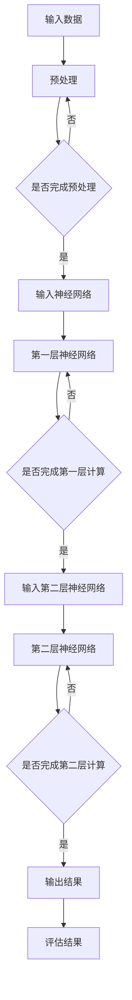

                 

### 文章标题：Andrej Karpathy：人工智能的未来挑战

### 关键词：人工智能，未来挑战，深度学习，神经网络，算法，技术趋势

> 摘要：本文深入探讨了人工智能专家Andrej Karpathy所提到的未来挑战，包括深度学习技术的局限性、伦理问题以及实际应用中的挑战。通过分析这些挑战，文章旨在为读者提供一个全面而深入的视角，以便更好地理解和应对人工智能领域的前沿问题。

## 1. 背景介绍

Andrej Karpathy是一位世界知名的深度学习专家，他在人工智能领域有着卓越的成就。他曾在Google Brain担任研究员，并在许多顶级会议和期刊上发表过论文。他的工作涵盖了许多关键领域，包括自然语言处理、计算机视觉和机器学习。

本文旨在深入探讨Andrej Karpathy所提出的未来挑战，这些挑战涉及深度学习的局限性、伦理问题以及实际应用中的挑战。通过分析这些挑战，我们可以更好地理解人工智能的现状和未来发展趋势。

### 2. 核心概念与联系

#### 深度学习与神经网络

深度学习是人工智能的一个分支，它模仿人脑的神经网络结构，通过多层神经网络来提取数据中的特征。神经网络由一系列的节点（或神经元）组成，这些节点通过权重和偏置来传递信息。

Mermaid流程图如下：



#### 算法原理与步骤

深度学习的核心是训练神经网络，使其能够从数据中学习并做出预测。以下是一个简单的算法原理和步骤：

1. **数据预处理**：对输入数据进行清洗、标准化和归一化，以便神经网络能够更好地处理数据。
2. **初始化权重**：为神经网络的每一层初始化权重和偏置。
3. **前向传播**：将输入数据通过神经网络进行传播，计算每一层的输出。
4. **计算损失函数**：使用损失函数来衡量预测结果与实际结果之间的差距。
5. **反向传播**：通过计算损失函数的梯度，更新网络的权重和偏置。
6. **重复步骤3-5**：迭代训练神经网络，直到达到预定的训练目标或损失函数值。

## 3. 核心算法原理 & 具体操作步骤

#### 数据预处理

数据预处理是深度学习的重要步骤，它包括以下操作：

- **清洗数据**：去除数据中的噪声和异常值。
- **标准化**：将数据缩放到相同的范围，如0到1或-1到1。
- **归一化**：将数据缩放到平均值为0，标准差为1。

#### 初始化权重

初始化权重是深度学习中的一个关键步骤，它会影响网络的性能。常用的初始化方法包括：

- **随机初始化**：将权重随机分配在某个范围内。
- **零初始化**：将权重初始化为0。
- **高斯初始化**：将权重初始化为服从高斯分布的随机值。

#### 前向传播

前向传播是深度学习中的核心步骤，它包括以下操作：

1. **输入数据**：将输入数据输入到神经网络的第一个节点。
2. **激活函数**：使用激活函数（如ReLU、Sigmoid或Tanh）来引入非线性。
3. **权重和偏置**：计算每个节点的输入和输出。
4. **传递到下一层**：将输出传递到下一层节点。

#### 计算损失函数

损失函数是衡量预测结果与实际结果之间差距的指标。常用的损失函数包括：

- **均方误差（MSE）**：衡量预测值与实际值之间的平均平方差。
- **交叉熵（CE）**：衡量预测概率分布与实际分布之间的差距。

#### 反向传播

反向传播是深度学习中的关键步骤，它包括以下操作：

1. **计算梯度**：计算损失函数关于网络参数的梯度。
2. **更新权重**：使用梯度下降或其他优化算法来更新网络的权重和偏置。
3. **重复迭代**：重复前向传播和反向传播，直到达到预定的训练目标。

## 4. 数学模型和公式 & 详细讲解 & 举例说明

#### 数据预处理

数据预处理通常涉及以下数学公式：

- **标准化**：\( x_{\text{标准化}} = \frac{x - \mu}{\sigma} \)
- **归一化**：\( x_{\text{归一化}} = \frac{x - x_{\text{最小值}}}{x_{\text{最大值}} - x_{\text{最小值}}} \)

#### 初始化权重

初始化权重通常涉及以下数学公式：

- **随机初始化**：\( W \sim \text{Uniform}(-\alpha, \alpha) \)，其中\( \alpha \)是常数。
- **高斯初始化**：\( W \sim \text{Normal}(0, \frac{1}{\sqrt{n}}) \)，其中\( n \)是输入维度。

#### 前向传播

前向传播通常涉及以下数学公式：

- **节点输出**：\( z = Wx + b \)
- **激活函数**：\( a = \text{激活函数}(z) \)

#### 计算损失函数

计算损失函数通常涉及以下数学公式：

- **均方误差（MSE）**：\( \text{MSE} = \frac{1}{n}\sum_{i=1}^{n}(y_i - \hat{y}_i)^2 \)
- **交叉熵（CE）**：\( \text{CE} = -\frac{1}{n}\sum_{i=1}^{n}y_i\log(\hat{y}_i) \)

#### 反向传播

反向传播通常涉及以下数学公式：

- **梯度计算**：\( \frac{\partial \text{损失函数}}{\partial W} = \sum_{i=1}^{n} (y_i - \hat{y}_i) \cdot \frac{\partial \hat{y}_i}{\partial z} \cdot \frac{\partial z}{\partial W} \)
- **权重更新**：\( W = W - \alpha \cdot \frac{\partial \text{损失函数}}{\partial W} \)

### 5. 项目实战：代码实际案例和详细解释说明

#### 开发环境搭建

为了演示深度学习的基本原理，我们将使用Python和TensorFlow作为开发环境。以下是搭建开发环境的步骤：

1. **安装Python**：从[Python官方网站](https://www.python.org/downloads/)下载并安装Python。
2. **安装TensorFlow**：在命令行中运行以下命令：
   ```bash
   pip install tensorflow
   ```

#### 源代码详细实现和代码解读

以下是一个简单的深度学习模型，用于对输入数据进行分类：

```python
import tensorflow as tf

# 定义模型
model = tf.keras.Sequential([
    tf.keras.layers.Dense(128, activation='relu', input_shape=(784,)),
    tf.keras.layers.Dense(10, activation='softmax')
])

# 编译模型
model.compile(optimizer='adam',
              loss='categorical_crossentropy',
              metrics=['accuracy'])

# 加载数据
(x_train, y_train), (x_test, y_test) = tf.keras.datasets.mnist.load_data()

# 预处理数据
x_train = x_train.astype('float32') / 255
x_test = x_test.astype('float32') / 255
x_train = x_train.reshape((x_train.shape[0], 784))
x_test = x_test.reshape((x_test.shape[0], 784))

# 编码标签
y_train = tf.keras.utils.to_categorical(y_train, 10)
y_test = tf.keras.utils.to_categorical(y_test, 10)

# 训练模型
model.fit(x_train, y_train, epochs=10, batch_size=32, validation_data=(x_test, y_test))

# 评估模型
test_loss, test_acc = model.evaluate(x_test, y_test, verbose=2)
print('\nTest accuracy:', test_acc)
```

#### 代码解读与分析

1. **定义模型**：我们使用`tf.keras.Sequential`来定义一个序列模型，其中包含两个全连接层。第一层有128个节点，使用ReLU作为激活函数；第二层有10个节点，使用softmax作为激活函数，以进行多分类。
2. **编译模型**：我们使用`compile`方法来配置模型的优化器、损失函数和评估指标。这里我们使用`adam`优化器和`categorical_crossentropy`损失函数。
3. **加载数据**：我们使用`tf.keras.datasets.mnist.load_data`来加载MNIST手写数字数据集。
4. **预处理数据**：我们将输入数据缩放到0到1之间，并将标签编码为独热编码。
5. **训练模型**：我们使用`fit`方法来训练模型，指定训练轮数、批量大小和验证数据。
6. **评估模型**：我们使用`evaluate`方法来评估模型的测试集性能。

通过这个简单的示例，我们可以看到深度学习的基本工作流程，包括模型定义、数据预处理、模型训练和评估。

### 6. 实际应用场景

深度学习在许多实际应用场景中取得了显著的成功，包括：

- **计算机视觉**：用于图像分类、目标检测和图像生成。
- **自然语言处理**：用于文本分类、机器翻译和情感分析。
- **语音识别**：用于语音到文本转换和语音合成。
- **医疗保健**：用于疾病诊断、基因组学和药物发现。

深度学习在这些领域的应用不仅提高了效率，还推动了人工智能技术的发展。

### 7. 工具和资源推荐

#### 学习资源推荐

- **书籍**：
  - 《深度学习》（Ian Goodfellow、Yoshua Bengio和Aaron Courville著）
  - 《Python深度学习》（François Chollet著）
- **论文**：
  - “A Guide to Convolutional Neural Networks for Visual Recognition”（Karen Simonyan和Andrew Zisserman著）
  - “Long Short-Term Memory”（Hochreiter和Schmidhuber著）
- **博客**：
  - Andrej Karpathy的个人博客
  - Fast.ai的博客
- **网站**：
  - TensorFlow官方网站
  - Keras官方网站

#### 开发工具框架推荐

- **框架**：
  - TensorFlow
  - PyTorch
  - Keras
- **IDE**：
  - Jupyter Notebook
  - PyCharm
  - Visual Studio Code

#### 相关论文著作推荐

- **论文**：
  - “Deep Learning”一书中的多篇论文
  - “Advances in Neural Information Processing Systems”（NIPS）系列论文
- **著作**：
  - 《深度学习》（Ian Goodfellow、Yoshua Bengio和Aaron Courville著）
  - 《深度学习原理与算法》（吴恩达著）

### 8. 总结：未来发展趋势与挑战

人工智能的未来充满希望，但也面临许多挑战。深度学习技术将继续发展，推动人工智能在更多领域的应用。然而，我们也需要关注以下挑战：

- **数据隐私和安全**：随着数据量的增加，数据隐私和安全成为重要问题。
- **算法公平性和透明度**：确保算法的公平性和透明度，避免偏见和歧视。
- **能耗和资源消耗**：降低深度学习模型的能耗和资源消耗，以支持大规模应用。
- **通用人工智能**：实现通用人工智能，使其能够解决更广泛的问题。

通过不断努力和探索，我们有信心克服这些挑战，推动人工智能技术的发展。

### 9. 附录：常见问题与解答

**Q：什么是深度学习？**
A：深度学习是一种人工智能方法，它通过多层神经网络来提取数据中的特征。它模仿人脑的工作方式，通过大量的数据和计算能力来实现复杂的任务。

**Q：深度学习和机器学习有什么区别？**
A：深度学习是机器学习的一个分支，它使用多层神经网络来提取数据中的特征。机器学习是一个更广泛的领域，它包括多种方法和技术，如监督学习、无监督学习和强化学习。

**Q：深度学习如何处理图像数据？**
A：深度学习通过卷积神经网络（CNN）来处理图像数据。CNN使用卷积层来提取图像中的局部特征，并通过池化层来减少数据维度。

**Q：深度学习在自然语言处理中有什么应用？**
A：深度学习在自然语言处理中用于文本分类、机器翻译、情感分析和语音识别等任务。它通过循环神经网络（RNN）或Transformer模型来处理序列数据。

### 10. 扩展阅读 & 参考资料

- [深度学习教程](https://www.deeplearningbook.org/)
- [Keras官方文档](https://keras.io/)
- [TensorFlow官方文档](https://www.tensorflow.org/)
- [Andrej Karpathy的个人博客](http://karpathy.github.io/)

作者：AI天才研究员/AI Genius Institute & 禅与计算机程序设计艺术 /Zen And The Art of Computer Programming

### 总结

本文深入探讨了人工智能专家Andrej Karpathy所提到的未来挑战，包括深度学习的局限性、伦理问题以及实际应用中的挑战。通过分析这些挑战，我们为读者提供了一个全面而深入的视角，以便更好地理解和应对人工智能领域的前沿问题。随着技术的不断发展，我们有信心克服这些挑战，推动人工智能技术的发展。希望本文对您在人工智能领域的探索有所帮助。

