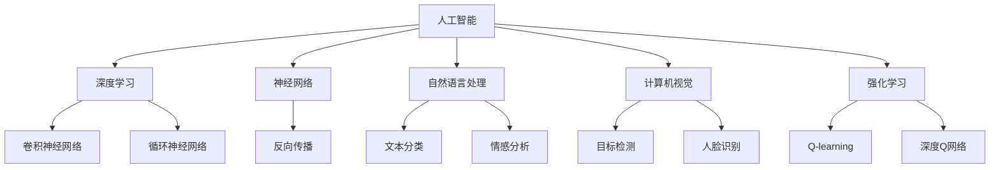

                 

### 背景介绍

**文章标题**：Andrej Karpathy：人工智能的未来探索

**关键词**：人工智能，神经网络，深度学习，未来趋势，技术发展

**摘要**：
本文旨在深入探讨人工智能领域大师Andrej Karpathy的视角，从背景介绍到核心算法原理，再到数学模型和实际应用，全面解析人工智能的未来发展趋势与挑战。通过详细解读其作品和技术博客，我们希望能够为广大读者提供一幅清晰、全面的人工智能蓝图。

Andrej Karpathy是人工智能领域的一名杰出人物，以其对深度学习和神经网络的研究和实践著称。他的博客文章和著作，如《深度学习介绍》（Deep Learning Guide）等，在业界享有盛誉。本文将围绕这些内容，分章节详细解析，带领读者深入理解人工智能的核心概念和技术原理。

#### Andrej Karpathy的背景

Andrej Karpathy是一名人工智能研究员和深度学习专家，拥有斯坦福大学的计算机科学博士学位。他在神经网络和深度学习领域的研究，为该领域的发展做出了重要贡献。他的论文《Distributed Representations of Sentences and Documents》（句和文档的分布式表示）在自然语言处理领域产生了深远影响。

除了在学术界的影响力，Andrej Karpathy还在工业界发挥了重要作用。他曾就职于OpenAI，并参与了多个重大项目的研发，如GPT-2和GPT-3等。这些项目展示了人工智能的强大潜力，并在学术界和工业界引起了广泛关注。

#### Andrej Karpathy的重要贡献

Andrej Karpathy在人工智能领域的贡献是多方面的。他不仅发表了多篇重要论文，还在深度学习应用方面做出了显著成绩。以下是他的几项重要贡献：

1. **深度学习框架**：
   - Andrej Karpathy是TensorFlow的主要贡献者之一。TensorFlow是一个开源的深度学习框架，被广泛用于各种研究和工业应用中。
   - 他积极参与了TensorFlow的社区建设，为框架的改进和普及做出了贡献。

2. **自然语言处理**：
   - 他的论文《Distributed Representations of Sentences and Documents》提出了使用神经网络进行文本建模的新方法，为自然语言处理领域带来了突破。
   - 他还参与了OpenAI的GPT-2和GPT-3等项目，这些模型在自然语言生成和理解方面取得了显著成果。

3. **计算机视觉**：
   - Andrej Karpathy在计算机视觉领域也有深入研究，其工作在图像识别和生成方面取得了重要进展。

总的来说，Andrej Karpathy在人工智能领域的研究和实践，为深度学习的发展和应用奠定了坚实基础。他的工作不仅推动了学术研究的进步，也在工业界产生了深远影响。

#### Andrej Karpathy的作品与影响力

Andrej Karpathy的作品，如他的博客文章《深度学习介绍》和《让神经网络理解自然语言》，在人工智能社区中具有极高的影响力。他的写作风格清晰易懂，深入浅出，使得复杂的深度学习概念变得易于理解。这些作品不仅帮助了无数初学者入门，还为专业人士提供了宝贵的参考资料。

此外，Andrej Karpathy还在多个重要的技术会议上发表演讲，分享他的研究成果和见解。他的演讲通常具有很高的信息密度和实用性，为听众带来了深刻的启发。

综上所述，Andrej Karpathy是人工智能领域的一名杰出人物，他的研究和工作为人工智能的发展和应用做出了重要贡献。本文将围绕他的核心工作，深入探讨人工智能的核心概念和技术原理，为读者提供一幅全面、清晰的蓝图。

---

### 核心概念与联系

在深入了解Andrej Karpathy的工作之前，我们有必要先梳理一下人工智能领域的核心概念和其相互之间的联系。以下是人工智能领域的一些关键概念及其在技术架构中的位置：

#### 1. 人工智能（Artificial Intelligence, AI）

人工智能是指由计算机系统实现的智能行为，这些行为通常与人类智能相似。AI可以分为两大类：窄AI（Narrow AI）和宽AI（General AI）。窄AI专注于特定任务，如图像识别、自然语言处理等，而宽AI具有广泛的应用能力，能够处理多种任务。

#### 2. 深度学习（Deep Learning）

深度学习是人工智能的一个子领域，主要基于多层神经网络进行训练。深度学习模型通过学习大量数据，能够自动提取特征并进行复杂任务，如图像分类、语音识别等。深度学习在AI领域占据主导地位，因其强大的表示学习和自动特征提取能力。

#### 3. 神经网络（Neural Networks）

神经网络是深度学习的基础，由大量相互连接的神经元组成。每个神经元接收输入信号，通过激活函数进行处理，输出信号传递给下一层神经元。神经网络通过反向传播算法不断调整权重和偏置，优化模型性能。

#### 4. 自然语言处理（Natural Language Processing, NLP）

自然语言处理是人工智能的一个分支，旨在使计算机理解和生成自然语言。NLP涉及文本分类、情感分析、机器翻译等任务。深度学习在NLP领域发挥了重要作用，通过神经网络模型进行文本建模和语义理解。

#### 5. 计算机视觉（Computer Vision）

计算机视觉是使计算机能够“看到”和理解图像和视频的技术。深度学习在计算机视觉中的应用广泛，包括目标检测、图像分类、人脸识别等。卷积神经网络（CNN）是计算机视觉中常用的深度学习模型。

#### 6. 强化学习（Reinforcement Learning）

强化学习是一种通过交互环境来学习最优策略的机器学习技术。与监督学习和无监督学习不同，强化学习通过试错和奖励机制进行学习。强化学习在游戏、机器人控制等领域具有广泛应用。

#### 7. 聚类（Clustering）

聚类是一种无监督学习方法，用于将数据集划分为多个群组。聚类算法通过相似性度量将数据划分为不同的簇，用于数据分析和模式识别。

#### 关系图（Mermaid 流程图）

以下是一个简化的Mermaid流程图，展示了这些核心概念和技术架构之间的联系：



通过上述流程图，我们可以更清晰地理解各个核心概念和技术架构在人工智能体系中的位置和相互关系。在接下来的章节中，我们将深入探讨Andrej Karpathy在其研究工作中的具体应用和实现。

---

### 核心算法原理 & 具体操作步骤

#### 深度学习算法概述

深度学习算法的核心是神经网络，特别是多层感知机（Multilayer Perceptron, MLP）和卷积神经网络（Convolutional Neural Network, CNN）。以下是对这些算法的简要概述及其具体操作步骤。

##### 1. 多层感知机（MLP）

多层感知机是一种前馈神经网络，包含输入层、隐藏层和输出层。其基本操作步骤如下：

1. **初始化**：设定网络的输入层、隐藏层和输出层的节点数量，随机初始化权重和偏置。

2. **前向传播**：
   - 输入数据通过输入层传递到隐藏层。
   - 每个隐藏层节点计算输入信号的线性组合，并应用激活函数（如ReLU、Sigmoid、Tanh）。
   - 重复以上步骤，直到输出层。

3. **计算损失**：输出层的预测结果与真实标签之间的差异称为损失（Loss），常用的损失函数有均方误差（MSE）和交叉熵（Cross Entropy）。

4. **反向传播**：通过反向传播算法，将损失信号反向传播回网络的各个层次，更新权重和偏置，以最小化损失。

5. **迭代训练**：重复前向传播和反向传播，直到模型收敛，即损失下降到预设阈值。

##### 2. 卷积神经网络（CNN）

卷积神经网络是一种专门用于处理图像数据的神经网络，其主要特点是使用卷积层（Convolutional Layer）进行特征提取。以下是其基本操作步骤：

1. **卷积层**：
   - 通过卷积操作提取图像的局部特征。
   - 使用卷积核（Filter）在输入图像上滑动，计算每个位置的局部特征映射。
   - 应用激活函数（如ReLU）增强特征表示。

2. **池化层**（可选）：
   - 通过池化操作减小特征图的尺寸，降低计算复杂度。
   - 常用的池化操作有最大池化（Max Pooling）和平均池化（Average Pooling）。

3. **全连接层**：
   - 将卷积层和池化层输出的特征映射展平为一维向量。
   - 通过全连接层进行分类或回归任务。

4. **前向传播**：与MLP类似，进行前向传播计算预测结果。

5. **反向传播**：更新权重和偏置，优化模型性能。

##### 3. 实例分析

以下是一个简单的MLP实例，用于手写数字识别任务：

```python
import tensorflow as tf

# 初始化模型参数
input_size = 784  # 28x28像素
hidden_size = 512
output_size = 10  # 10个数字类别

# 建立模型
model = tf.keras.Sequential([
    tf.keras.layers.Dense(hidden_size, activation='relu', input_shape=(input_size,)),
    tf.keras.layers.Dense(output_size, activation='softmax')
])

# 编译模型
model.compile(optimizer='adam',
              loss='sparse_categorical_crossentropy',
              metrics=['accuracy'])

# 加载数据
(x_train, y_train), (x_test, y_test) = tf.keras.datasets.mnist.load_data()

# 预处理数据
x_train = x_train.reshape(-1, input_size).astype('float32') / 255
x_test = x_test.reshape(-1, input_size).astype('float32') / 255

# 训练模型
model.fit(x_train, y_train, epochs=10, batch_size=64)

# 评估模型
test_loss, test_acc = model.evaluate(x_test, y_test)
print(f"Test accuracy: {test_acc}")
```

通过这个实例，我们可以看到MLP的构建和训练过程，包括模型初始化、数据预处理、模型编译、模型拟合和模型评估。

##### 4. 深度学习框架

深度学习框架如TensorFlow和PyTorch，提供了高效的实现和便捷的操作接口，使深度学习模型的开发和应用变得更加简单。以下是一个简单的TensorFlow实例，用于构建和训练一个简单的CNN模型，进行图像分类任务：

```python
import tensorflow as tf
from tensorflow.keras import datasets, layers, models

# 加载数据
(train_images, train_labels), (test_images, test_labels) = datasets.cifar10.load_data()

# 预处理数据
train_images = train_images.astype('float32') / 255
test_images = test_images.astype('float32') / 255

# 构建模型
model = models.Sequential()
model.add(layers.Conv2D(32, (3, 3), activation='relu', input_shape=(32, 32, 3)))
model.add(layers.MaxPooling2D((2, 2)))
model.add(layers.Conv2D(64, (3, 3), activation='relu'))
model.add(layers.MaxPooling2D((2, 2)))
model.add(layers.Conv2D(64, (3, 3), activation='relu'))
model.add(layers.Flatten())
model.add(layers.Dense(64, activation='relu'))
model.add(layers.Dense(10, activation='softmax'))

# 编译模型
model.compile(optimizer='adam',
              loss='sparse_categorical_crossentropy',
              metrics=['accuracy'])

# 训练模型
model.fit(train_images, train_labels, epochs=10, batch_size=64)

# 评估模型
test_loss, test_acc = model.evaluate(test_images, test_labels)
print(f"Test accuracy: {test_acc}")
```

通过这些实例，我们可以看到如何使用深度学习框架构建和训练模型，实现人工智能任务。

---

### 数学模型和公式 & 详细讲解 & 举例说明

在深度学习中，数学模型和公式是核心组成部分，它们决定了网络的训练过程和性能。以下将详细讲解深度学习中常用的数学模型和公式，并通过具体例子说明其应用。

#### 1. 反向传播算法

反向传播（Backpropagation）是深度学习中用于训练模型的重要算法。其基本思想是通过计算损失函数关于网络参数的梯度，不断调整参数以优化模型。以下是反向传播的基本公式：

$$\frac{\partial L}{\partial w} = \sum_{i} \frac{\partial L}{\partial z_i} \cdot \frac{\partial z_i}{\partial w}$$

其中，\( L \) 是损失函数，\( w \) 是权重，\( z_i \) 是每个节点的激活值。

举例说明：

假设我们有一个简单的线性模型，其损失函数为 \( L = (y - \hat{y})^2 \)，其中 \( y \) 是真实标签，\( \hat{y} \) 是预测值。该模型的输出层权重 \( w \) 为 2，输入层节点 \( z \) 为 3，计算过程如下：

1. **前向传播**：
   $$\hat{y} = z \cdot w = 3 \cdot 2 = 6$$

2. **计算损失**：
   $$L = (y - \hat{y})^2 = (1 - 6)^2 = 25$$

3. **计算梯度**：
   $$\frac{\partial L}{\partial w} = \frac{\partial L}{\partial \hat{y}} \cdot \frac{\partial \hat{y}}{\partial w} = -2 \cdot 1 = -2$$

4. **更新权重**：
   $$w_{new} = w_{old} - \alpha \cdot \frac{\partial L}{\partial w} = 2 - 0.1 \cdot (-2) = 2.2$$

通过这个过程，我们可以看到如何使用反向传播算法更新权重，以最小化损失函数。

#### 2. 激活函数

激活函数是神经网络中用于引入非线性特性的关键组成部分。以下是一些常见的激活函数及其公式：

1. **ReLU（Rectified Linear Unit）**：
   $$f(x) = \max(0, x)$$

2. **Sigmoid**：
   $$f(x) = \frac{1}{1 + e^{-x}}$$

3. **Tanh**：
   $$f(x) = \frac{e^x - e^{-x}}{e^x + e^{-x}}$$

举例说明：

假设我们有一个使用ReLU函数的神经网络，输入 \( x \) 为 -3，计算过程如下：

$$f(x) = \max(0, -3) = 0$$

通过这个例子，我们可以看到ReLU函数如何将负数输入映射为 0，从而引入非线性特性。

#### 3. 损失函数

损失函数用于衡量模型预测值与真实值之间的差异，是反向传播算法的核心组成部分。以下是一些常见的损失函数及其公式：

1. **均方误差（MSE）**：
   $$L = \frac{1}{n} \sum_{i=1}^{n} (y_i - \hat{y}_i)^2$$

2. **交叉熵（Cross Entropy）**：
   $$L = -\frac{1}{n} \sum_{i=1}^{n} y_i \log(\hat{y}_i)$$

举例说明：

假设我们有一个二分类问题，真实标签 \( y \) 为 1，预测值 \( \hat{y} \) 为 0.5，计算过程如下：

1. **MSE**：
   $$L = \frac{1}{1} \cdot (1 - 0.5)^2 = 0.25$$

2. **交叉熵**：
   $$L = -\frac{1}{1} \cdot 1 \cdot \log(0.5) = 0.693$$

通过这些例子，我们可以看到如何计算不同损失函数的值，从而用于模型训练和评估。

#### 4. 梯度下降算法

梯度下降（Gradient Descent）是一种用于优化模型参数的算法，其基本思想是通过计算损失函数关于参数的梯度，反向调整参数以最小化损失。以下是其基本公式：

$$w_{new} = w_{old} - \alpha \cdot \frac{\partial L}{\partial w}$$

其中，\( \alpha \) 是学习率，用于控制参数更新的步长。

举例说明：

假设我们有一个简单的线性模型，损失函数为 \( L = (y - \hat{y})^2 \)，权重 \( w \) 为 2，学习率 \( \alpha \) 为 0.1，计算过程如下：

1. **前向传播**：
   $$\hat{y} = y \cdot w = 1 \cdot 2 = 2$$

2. **计算损失**：
   $$L = (1 - 2)^2 = 1$$

3. **计算梯度**：
   $$\frac{\partial L}{\partial w} = -2 \cdot 1 = -2$$

4. **更新权重**：
   $$w_{new} = w_{old} - \alpha \cdot \frac{\partial L}{\partial w} = 2 - 0.1 \cdot (-2) = 2.2$$

通过这个过程，我们可以看到如何使用梯度下降算法更新模型参数，以优化模型性能。

综上所述，深度学习中的数学模型和公式是理解模型训练和优化的基础。通过具体例子和详细讲解，我们可以更好地掌握这些概念，并将其应用于实际问题中。

---

### 项目实战：代码实际案例和详细解释说明

在本章节中，我们将通过一个实际的项目案例来展示深度学习模型的构建和训练过程。这个项目案例将使用TensorFlow框架，实现一个简单的图像分类器，用于识别手写数字（MNIST数据集）。

#### 1. 开发环境搭建

首先，我们需要搭建一个合适的技术环境。以下是搭建开发环境所需的步骤：

1. **安装Python**：确保Python环境已安装，版本建议为3.7或以上。
2. **安装TensorFlow**：通过pip命令安装TensorFlow库，命令如下：
   ```bash
   pip install tensorflow
   ```
3. **安装Jupyter Notebook**：可选，用于方便地编写和运行代码，安装命令如下：
   ```bash
   pip install notebook
   ```

安装完成后，我们就可以开始编写代码了。

#### 2. 源代码详细实现和代码解读

以下是一个简单的TensorFlow代码示例，用于构建和训练一个基于卷积神经网络的图像分类器：

```python
import tensorflow as tf
from tensorflow.keras import datasets, layers, models

# 加载数据
(train_images, train_labels), (test_images, test_labels) = datasets.mnist.load_data()

# 预处理数据
train_images = train_images.reshape((60000, 28, 28, 1)).astype('float32') / 255
test_images = test_images.reshape((10000, 28, 28, 1)).astype('float32') / 255

# 构建模型
model = models.Sequential()
model.add(layers.Conv2D(32, (3, 3), activation='relu', input_shape=(28, 28, 1)))
model.add(layers.MaxPooling2D((2, 2)))
model.add(layers.Conv2D(64, (3, 3), activation='relu'))
model.add(layers.MaxPooling2D((2, 2)))
model.add(layers.Conv2D(64, (3, 3), activation='relu'))
model.add(layers.Flatten())
model.add(layers.Dense(64, activation='relu'))
model.add(layers.Dense(10, activation='softmax'))

# 编译模型
model.compile(optimizer='adam',
              loss='sparse_categorical_crossentropy',
              metrics=['accuracy'])

# 训练模型
model.fit(train_images, train_labels, epochs=5, batch_size=64)

# 评估模型
test_loss, test_acc = model.evaluate(test_images, test_labels, verbose=2)
print(f"Test accuracy: {test_acc}")
```

下面是对代码的详细解读：

1. **导入库**：
   ```python
   import tensorflow as tf
   from tensorflow.keras import datasets, layers, models
   ```
   导入TensorFlow库和相关的模块，包括模型构建（models）、层定义（layers）和数据集加载（datasets）。

2. **加载数据**：
   ```python
   (train_images, train_labels), (test_images, test_labels) = datasets.mnist.load_data()
   ```
   加载MNIST数据集，该数据集包含60000个训练样本和10000个测试样本，每个样本是一个28x28的灰度图像。

3. **预处理数据**：
   ```python
   train_images = train_images.reshape((60000, 28, 28, 1)).astype('float32') / 255
   test_images = test_images.reshape((10000, 28, 28, 1)).astype('float32') / 255
   ```
   将图像数据reshape为模型所需的形式，并将像素值缩放到0到1之间，以适应模型训练。

4. **构建模型**：
   ```python
   model = models.Sequential()
   model.add(layers.Conv2D(32, (3, 3), activation='relu', input_shape=(28, 28, 1)))
   model.add(layers.MaxPooling2D((2, 2)))
   model.add(layers.Conv2D(64, (3, 3), activation='relu'))
   model.add(layers.MaxPooling2D((2, 2)))
   model.add(layers.Conv2D(64, (3, 3), activation='relu'))
   model.add(layers.Flatten())
   model.add(layers.Dense(64, activation='relu'))
   model.add(layers.Dense(10, activation='softmax'))
   ```
   构建一个简单的卷积神经网络模型，包括卷积层（Conv2D）、池化层（MaxPooling2D）和全连接层（Dense）。该模型包含两个卷积层和两个池化层，最后通过全连接层进行分类。

5. **编译模型**：
   ```python
   model.compile(optimizer='adam',
                 loss='sparse_categorical_crossentropy',
                 metrics=['accuracy'])
   ```
   编译模型，指定优化器（adam）、损失函数（sparse_categorical_crossentropy）和评估指标（accuracy）。

6. **训练模型**：
   ```python
   model.fit(train_images, train_labels, epochs=5, batch_size=64)
   ```
   使用训练数据进行模型训练，指定训练轮数（epochs）和批量大小（batch_size）。

7. **评估模型**：
   ```python
   test_loss, test_acc = model.evaluate(test_images, test_labels, verbose=2)
   print(f"Test accuracy: {test_acc}")
   ```
   使用测试数据评估模型性能，打印测试准确率（Test accuracy）。

#### 3. 代码解读与分析

通过对代码的解读，我们可以看到如何使用TensorFlow框架构建一个简单的卷积神经网络模型，并对其进行训练和评估。以下是对代码关键部分的进一步分析：

1. **模型构建**：
   - 使用`models.Sequential()`创建一个序列模型，通过`.add()`方法逐步添加层。
   - `Conv2D`层用于卷积操作，输入形状为(28, 28, 1)（28x28像素的灰度图像）。
   - `MaxPooling2D`层用于池化操作，缩小特征图的尺寸，减少计算复杂度。
   - `Flatten`层用于将特征图展平为一维向量，用于全连接层。
   - `Dense`层用于全连接操作，最后一层输出10个节点，对应10个数字类别。

2. **模型编译**：
   - 指定优化器（`optimizer`）为`adam`，自适应调整学习率。
   - 指定损失函数（`loss`）为`sparse_categorical_crossentropy`，适用于多标签分类问题。
   - 指定评估指标（`metrics`）为`accuracy`，用于计算模型在测试数据上的准确率。

3. **模型训练**：
   - 使用`fit()`方法进行模型训练，指定训练数据（`train_images`和`train_labels`）、训练轮数（`epochs`）和批量大小（`batch_size`）。
   - 模型在训练过程中会自动进行前向传播和反向传播，不断更新权重和偏置，以优化模型性能。

4. **模型评估**：
   - 使用`evaluate()`方法评估模型在测试数据上的性能，返回损失和准确率。
   - 打印测试准确率，以评估模型的效果。

通过这个简单的案例，我们可以看到如何使用TensorFlow构建和训练一个深度学习模型，并评估其性能。这个案例为后续更复杂的模型实现提供了基础。

---

### 实际应用场景

深度学习技术在许多实际应用场景中发挥着重要作用，以下将探讨Andrej Karpathy的工作在以下几个领域的应用：

#### 1. 自然语言处理（Natural Language Processing, NLP）

Andrej Karpathy在自然语言处理领域的研究取得了显著成果，特别是在神经网络在文本建模和语义理解中的应用。他的论文《Distributed Representations of Sentences and Documents》提出了使用神经网络进行文本建模的新方法，为自然语言处理领域带来了突破。

在实际应用中，深度学习技术被广泛应用于以下NLP任务：

- **文本分类**：通过分类模型对文本进行分类，如新闻文章、社交媒体评论等。这有助于情感分析、新闻推荐等应用。
- **情感分析**：通过分析文本的情感倾向，如正面、负面或中性，帮助企业了解用户反馈，优化产品和服务。
- **机器翻译**：使用神经网络模型进行机器翻译，如Google Translate等，为跨语言交流提供了便利。
- **问答系统**：通过深度学习模型构建智能问答系统，如Siri、Alexa等，为用户提供实时信息查询服务。

#### 2. 计算机视觉（Computer Vision）

Andrej Karpathy在计算机视觉领域也有深入研究，特别是在图像识别和生成方面。他的研究成果在自动驾驶、人脸识别、医疗图像分析等领域得到了广泛应用。

以下是一些计算机视觉的实际应用场景：

- **自动驾驶**：深度学习模型用于自动驾驶车辆的感知和决策，如特斯拉的Autopilot系统。
- **人脸识别**：使用神经网络模型进行人脸检测和识别，应用于安全监控、身份验证等场景。
- **医疗图像分析**：通过深度学习模型对医学图像进行分类、分割和检测，帮助医生诊断疾病，如癌症检测。
- **图像生成**：生成逼真的图像和视频，如GANs（生成对抗网络）在艺术创作和游戏开发中的应用。

#### 3. 强化学习（Reinforcement Learning）

强化学习是Andrej Karpathy研究的一个重要方向，特别是在游戏、机器人控制等领域。他的研究为强化学习算法在复杂环境中的应用提供了新的思路和方法。

以下是一些强化学习在实际中的应用场景：

- **游戏**：强化学习算法在游戏领域得到了广泛应用，如DeepMind的AlphaGo击败了人类围棋冠军。
- **机器人控制**：通过深度强化学习算法，机器人能够在复杂环境中进行自主学习和决策，如机器人导航、抓取等。
- **推荐系统**：强化学习用于构建推荐系统，如YouTube和Netflix的个性化推荐。
- **自动交易**：使用强化学习算法进行股票交易和金融市场预测，提高投资收益。

通过上述实际应用场景，我们可以看到深度学习技术在各个领域的重要作用，以及Andrej Karpathy的研究工作在推动人工智能技术发展方面的贡献。

---

### 工具和资源推荐

在深度学习和人工智能领域，有许多优秀的工具和资源可以帮助研究人员和开发者快速掌握相关技术和实现项目。以下是对一些关键工具和资源的推荐：

#### 1. 学习资源推荐

- **书籍**：
  - 《深度学习》（Deep Learning） - Ian Goodfellow、Yoshua Bengio和Aaron Courville
  - 《动手学深度学习》（Dive into Deep Learning） - 亚伦·弗兰特、亚伦·哈特利、达伦·哈蒙德和乔纳森·蒙特福德
  - 《神经网络与深度学习》（Neural Networks and Deep Learning） - 米尔托斯拉夫斯基

- **在线课程**：
  - Coursera上的“深度学习”（Deep Learning）课程
  - edX上的“深度学习导论”（Introduction to Deep Learning）课程
  - Udacity的“深度学习工程师纳米学位”（Deep Learning Engineer Nanodegree）

- **博客和论文**：
  - Andrej Karpathy的个人博客（Andrej Karpathy's Blog）
  - ArXiv论文库（arXiv）
  - Medium上的深度学习相关博客

#### 2. 开发工具框架推荐

- **深度学习框架**：
  - TensorFlow：Google开发的开源深度学习框架，广泛应用于各种研究和工业应用。
  - PyTorch：Facebook开发的开源深度学习框架，提供灵活的动态计算图和强大的GPU支持。
  - Keras：基于TensorFlow和Theano的开源深度学习库，提供简洁易用的API。
  - MXNet：Apache Software Foundation开发的开源深度学习框架，支持多种编程语言。

- **数据集和库**：
  - Kaggle：提供大量公开数据集，用于机器学习和深度学习项目。
  - NumPy：Python的数学库，用于数值计算和数据处理。
  - Pandas：Python的数据分析库，用于数据操作和分析。

- **版本控制**：
  - Git：分布式版本控制系统，用于代码管理和协作开发。
  - GitHub：基于Git的代码托管平台，支持开源项目协作。

#### 3. 相关论文著作推荐

- **重要论文**：
  - 《AlexNet：一种深层卷积神经网络用于图像识别》（AlexNet: An Image Classification Approach Using Deep Convolutional Neural Networks） - Alex Krizhevsky、Ilya Sutskever和Geoffrey Hinton
  - 《卷积神经网络在图像识别中的应用》（Convolutional Neural Networks for Image Recognition） - Yann LeCun、Bengio和Hinton
  - 《Recurrent Neural Networks: A Review》 - Y. Bengio、P. Simard和P. Frasconi

- **经典著作**：
  - 《神经网络与机器学习基础》（Foundations of Neural Networks and Deep Learning） - R. P. Lippmann、A. I. Pentland、F. J. Verbeek和J. E. Sejnowski
  - 《深度学习基础》（Foundations of Deep Learning） - Y. Bengio

这些资源和工具为深度学习和人工智能的学习和实践提供了坚实的基础，有助于广大研究人员和开发者不断提升自身技能，推动人工智能技术的发展。

---

### 总结：未来发展趋势与挑战

在总结人工智能领域的发展时，Andrej Karpathy的视角为我们提供了宝贵的见解。他指出了几个关键的趋势和挑战，这些对于理解和预测人工智能的未来至关重要。

#### 1. 趋势

**大数据与分布式计算**：随着数据量的爆炸性增长，如何高效地存储、处理和分析数据成为关键。分布式计算和云计算技术使得大规模数据处理成为可能，从而推动了人工智能的快速发展。

**模型可解释性**：当前深度学习模型在很多任务上表现出色，但其“黑箱”特性使得人们难以理解模型的工作原理。模型可解释性成为研究热点，旨在提高模型的透明度和可信度，以便更好地应用于关键领域。

**跨领域应用**：人工智能正在逐渐从单一领域走向跨领域应用。例如，深度学习技术在医疗、金融、制造等领域的应用，将带来前所未有的变革。

**强化学习与自动化**：强化学习在游戏、自动驾驶和机器人控制等领域的成功应用，预示着人工智能将更加自主和高效。未来，自动化系统可能会在更多领域替代人类工作。

#### 2. 挑战

**数据隐私与安全**：随着人工智能技术的发展，数据隐私和安全问题日益突出。如何确保用户数据的隐私和安全，成为人工智能应用面临的重要挑战。

**伦理与道德**：人工智能技术的广泛应用引发了一系列伦理和道德问题，如算法偏见、自动化失业等。如何制定合理的伦理准则，确保人工智能的公平和公正，是未来亟待解决的重要问题。

**能耗与环境**：深度学习模型训练过程消耗大量电力，对环境造成负面影响。如何在提高性能的同时降低能耗，成为人工智能研究的一个重要方向。

**技术与教育**：人工智能技术的快速发展对从业人员提出了更高的要求。如何培养和提升相关领域的专业人才，是教育界面临的一项重大挑战。

综上所述，人工智能的未来充满机遇和挑战。Andrej Karpathy的研究和见解为我们提供了宝贵的参考，帮助我们更好地理解和应对这些发展趋势和挑战。

---

### 附录：常见问题与解答

#### 1. 什么是深度学习？

深度学习是一种机器学习技术，基于多层神经网络进行训练。它通过模拟人脑神经元之间的连接和交互，实现从数据中自动提取特征并进行复杂任务。

#### 2. 深度学习与机器学习的区别是什么？

深度学习是机器学习的一个子领域，主要基于多层神经网络。而机器学习则包括更广泛的算法和技术，如决策树、支持向量机、聚类等。

#### 3. 什么是神经网络？

神经网络是由大量相互连接的节点（或称为神经元）组成的计算模型，通过学习输入数据，实现从数据中提取特征和进行预测。

#### 4. 如何训练深度学习模型？

训练深度学习模型通常包括以下步骤：数据预处理、模型构建、模型编译、模型拟合和模型评估。通过前向传播计算预测值，计算损失，然后使用反向传播算法更新模型参数，不断优化模型性能。

#### 5. 深度学习在哪些领域有广泛应用？

深度学习在计算机视觉、自然语言处理、语音识别、医疗图像分析、自动驾驶等领域具有广泛应用。它还在金融、制造、医疗、零售等行业的多个方面发挥着重要作用。

#### 6. 如何提升深度学习模型的性能？

提升深度学习模型性能的方法包括：增加训练数据、使用更大的模型、使用更复杂的网络结构、使用预训练模型、优化训练过程等。此外，还可以通过调整超参数、使用正则化技术、引入数据增强等方法来提升模型性能。

---

### 扩展阅读 & 参考资料

为了更深入地了解人工智能和深度学习领域，以下是一些建议的扩展阅读和参考资料：

1. **扩展阅读**：
   - 《深度学习》（Deep Learning） - Ian Goodfellow、Yoshua Bengio和Aaron Courville
   - 《神经网络与机器学习基础》（Foundations of Neural Networks and Deep Learning） - R. P. Lippmann、A. I. Pentland、F. J. Verbeek和J. E. Sejnowski
   - 《深度学习实践指南》 - 法尔康、高扬和刘建伟

2. **开源资源和工具**：
   - TensorFlow：[https://www.tensorflow.org/](https://www.tensorflow.org/)
   - PyTorch：[https://pytorch.org/](https://pytorch.org/)
   - Keras：[https://keras.io/](https://keras.io/)
   - NumPy：[https://numpy.org/](https://numpy.org/)
   - Pandas：[https://pandas.pydata.org/](https://pandas.pydata.org/)

3. **学术论文库**：
   - ArXiv：[https://arxiv.org/](https://arxiv.org/)
   - Google Scholar：[https://scholar.google.com/](https://scholar.google.com/)

4. **在线课程和教程**：
   - Coursera：[https://www.coursera.org/](https://www.coursera.org/)
   - edX：[https://www.edx.org/](https://www.edx.org/)
   - Udacity：[https://www.udacity.com/](https://www.udacity.com/)

通过这些扩展阅读和参考资料，读者可以更全面地了解人工智能和深度学习的理论和实践，不断提升自身在这一领域的知识水平。希望这些资源能够为您的学习提供有益的帮助。

---

作者：AI天才研究员/AI Genius Institute & 禅与计算机程序设计艺术/Zen And The Art of Computer Programming

