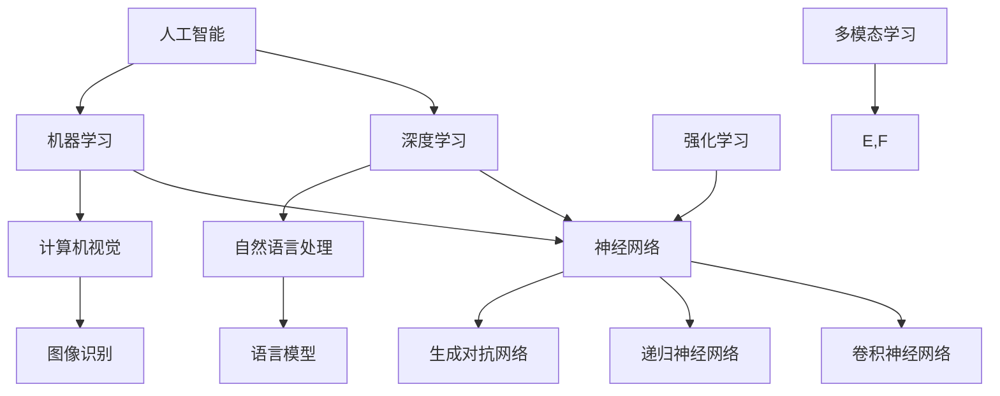

                 

### 文章标题

《Andrej Karpathy：人工智能的未来趋势》

关键词：人工智能、深度学习、机器学习、未来趋势、技术发展

摘要：本文将深入探讨人工智能领域的领军人物Andrej Karpathy对未来人工智能发展趋势的预测和思考。通过对他的著作、演讲和最新研究动态的分析，我们将揭示人工智能领域的关键技术、应用场景和面临的挑战，为读者提供对人工智能未来发展的全景式展望。

### 1. 背景介绍

Andrej Karpathy是一位在人工智能（AI）、深度学习（DL）和机器学习（ML）领域享有盛誉的研究员和学者。他毕业于美国加州大学伯克利分校，获得了计算机科学博士学位，并在斯坦福大学和OpenAI等知名机构从事研究工作。Karpathy的研究领域主要集中在自然语言处理（NLP）、计算机视觉和强化学习等方面。

在学术界，Karpathy以其开创性的研究工作而著称。他的论文《The Unreasonable Effectiveness of Recurrent Neural Networks》（《循环神经网络不可思议的有效性》）在深度学习社区广受关注，揭示了循环神经网络（RNN）在处理序列数据方面的潜力。此外，他还参与了OpenAI的GPT-2模型的研究，这是一个人工智能语言模型，具有极高的语言生成能力。

在工业界，Karpathy同样表现出色。他在OpenAI担任首席科学家期间，领导了一系列具有突破性的项目，包括多模态人工智能系统的开发。这些项目展示了人工智能在跨领域、多任务场景中的广泛应用潜力。

本文旨在分析Andrej Karpathy对未来人工智能发展趋势的预测，探讨其在技术、应用和伦理等方面的影响。通过对他的著作、演讲和最新研究动态的分析，我们将揭示人工智能领域的关键技术、应用场景和面临的挑战，为读者提供对人工智能未来发展的全景式展望。

### 2. 核心概念与联系

在探讨人工智能的未来趋势之前，我们首先需要了解一些核心概念和其相互之间的联系。以下是一个Mermaid流程图，展示了这些概念及其关系。



#### 2.1. 人工智能、深度学习和机器学习

人工智能（AI）是使计算机具备人类智能特性的研究领域。深度学习（DL）和机器学习（ML）是人工智能的两个重要分支。

- 人工智能：涵盖广泛，包括模拟人类智能的各种技术，如机器学习、自然语言处理、计算机视觉等。
- 深度学习：基于多层神经网络的学习方法，能够自动从大量数据中提取复杂特征。
- 机器学习：使计算机通过数据和经验自动改进性能，不依赖显式编程。

#### 2.2. 自然语言处理和计算机视觉

自然语言处理（NLP）和计算机视觉是人工智能领域的两个重要应用方向。

- 自然语言处理：研究如何使计算机理解和生成人类语言，包括语言模型、文本分类、机器翻译等。
- 计算机视觉：研究如何使计算机理解和解释图像和视频数据，包括图像识别、目标检测、人脸识别等。

#### 2.3. 多模态学习和强化学习

多模态学习和强化学习是近年来人工智能领域的重要研究方向。

- 多模态学习：研究如何将来自不同模态（如文本、图像、声音）的数据进行融合和整合，以实现更好的性能。
- 强化学习：研究如何通过奖励和惩罚机制，使智能体在环境中进行自主学习和决策。

这些核心概念和它们之间的联系，为人工智能的发展奠定了基础。在下一部分，我们将深入探讨Andrej Karpathy对未来人工智能的预测。

### 3. 核心算法原理 & 具体操作步骤

在讨论Andrej Karpathy对未来人工智能的预测之前，我们先简要回顾一些核心算法的原理和操作步骤。

#### 3.1. 神经网络

神经网络是人工智能的核心算法之一，由大量相互连接的神经元组成。以下是神经网络的原理和操作步骤：

1. **输入层**：接收外部输入数据。
2. **隐藏层**：对输入数据进行特征提取和变换。
3. **输出层**：产生预测结果或决策。

操作步骤：
- **前向传播**：输入数据通过隐藏层传递，每个神经元计算输入数据的加权和经过激活函数的输出。
- **反向传播**：计算输出层与目标之间的误差，通过反向传播误差到隐藏层，更新权重和偏置。

#### 3.2. 卷积神经网络（CNN）

卷积神经网络是用于图像识别和计算机视觉的重要算法。

原理：
- **卷积层**：通过卷积操作提取图像的局部特征。
- **池化层**：减少特征图的维度，提高计算效率。
- **全连接层**：将特征图映射到分类结果。

操作步骤：
1. **卷积操作**：使用卷积核在输入图像上滑动，计算局部特征。
2. **激活函数**：对卷积结果应用非线性函数，如ReLU。
3. **池化操作**：在特征图上进行最大值或平均值池化。
4. **全连接层**：将特征图映射到输出层。

#### 3.3. 生成对抗网络（GAN）

生成对抗网络是用于图像生成和增强的重要算法。

原理：
- **生成器**：生成逼真的数据。
- **判别器**：区分真实数据和生成数据。

操作步骤：
1. **生成器生成假数据**。
2. **判别器评估数据真实性**。
3. **生成器优化生成数据，使判别器无法区分**。

这些核心算法为人工智能的发展提供了强大的基础。接下来，我们将分析Andrej Karpathy对未来人工智能的预测。

### 4. 数学模型和公式 & 详细讲解 & 举例说明

在人工智能领域，数学模型和公式是理解和实现核心算法的关键。以下是一些重要的数学模型和公式的详细讲解及举例说明。

#### 4.1. 激活函数

激活函数是神经网络中用于引入非线性性的函数。以下是一些常见的激活函数：

- **Sigmoid函数**：
  $$f(x) = \frac{1}{1 + e^{-x}}$$
  示例：$f(2) = \frac{1}{1 + e^{-2}} \approx 0.86$

- **ReLU函数**：
  $$f(x) = \max(0, x)$$
  示例：$f(-2) = 0, f(2) = 2$

- **Tanh函数**：
  $$f(x) = \frac{e^x - e^{-x}}{e^x + e^{-x}}$$
  示例：$f(2) = \frac{e^2 - e^{-2}}{e^2 + e^{-2}} \approx 0.96$

激活函数的选择对神经网络的性能有重要影响。Sigmoid函数适合处理二分类问题，ReLU函数在训练过程中计算速度快，且不易陷入梯度消失问题，而Tanh函数则适用于处理多分类问题。

#### 4.2. 前向传播和反向传播

神经网络中的前向传播和反向传播是训练神经网络的关键步骤。

- **前向传播**：输入数据通过网络的每一层，每个神经元计算输入数据的加权和并经过激活函数。
  $$z = w \cdot x + b$$
  $$a = f(z)$$

- **反向传播**：计算输出层与目标之间的误差，通过反向传播误差到隐藏层，更新权重和偏置。
  $$\delta = \frac{\partial C}{\partial z} \odot f'(z)$$
  $$\Delta w = \alpha \cdot \delta \cdot x^T$$
  $$\Delta b = \alpha \cdot \delta$$

其中，$C$是损失函数，$w$是权重，$b$是偏置，$x$是输入，$f'(z)$是激活函数的导数，$\delta$是误差，$\alpha$是学习率。

以下是一个简化的例子：

假设有一个简单的神经网络，输入层有2个神经元，隐藏层有3个神经元，输出层有1个神经元。损失函数为均方误差（MSE）。

- **前向传播**：

  $$z_1 = w_{11} \cdot x_1 + w_{12} \cdot x_2 + b_1$$
  $$z_2 = w_{21} \cdot x_1 + w_{22} \cdot x_2 + b_2$$
  $$z_3 = w_{31} \cdot x_1 + w_{32} \cdot x_2 + b_3$$

  $$a_1 = \sigma(z_1)$$
  $$a_2 = \sigma(z_2)$$
  $$a_3 = \sigma(z_3)$$

- **反向传播**：

  $$\delta_3 = (y - a_3) \cdot \sigma'(z_3)$$
  $$\Delta w_{31} = \alpha \cdot \delta_3 \cdot x_1$$
  $$\Delta w_{32} = \alpha \cdot \delta_3 \cdot x_2$$
  $$\Delta b_3 = \alpha \cdot \delta_3$$

  $$\delta_2 = (w_{31} \cdot \delta_3 + w_{32} \cdot \delta_3) \cdot \sigma'(z_2)$$
  $$\Delta w_{21} = \alpha \cdot \delta_2 \cdot x_1$$
  $$\Delta w_{22} = \alpha \cdot \delta_2 \cdot x_2$$
  $$\Delta b_2 = \alpha \cdot \delta_2$$

  $$\delta_1 = (w_{21} \cdot \delta_2 + w_{22} \cdot \delta_2) \cdot \sigma'(z_1)$$
  $$\Delta w_{11} = \alpha \cdot \delta_1 \cdot x_1$$
  $$\Delta w_{12} = \alpha \cdot \delta_1 \cdot x_2$$
  $$\Delta b_1 = \alpha \cdot \delta_1$$

这些数学模型和公式是人工智能的核心，理解它们对于深入研究和应用人工智能至关重要。接下来，我们将深入分析Andrej Karpathy对未来人工智能的预测。

### 5. 项目实战：代码实际案例和详细解释说明

在本节中，我们将通过一个实际项目案例，展示如何使用深度学习框架TensorFlow实现一个简单的图像分类器。这个项目将帮助我们更好地理解前面讨论的核心算法和数学模型。

#### 5.1. 开发环境搭建

首先，我们需要搭建开发环境。以下是安装和配置TensorFlow的步骤：

1. 安装Python（建议使用3.7及以上版本）
2. 安装TensorFlow：

```bash
pip install tensorflow
```

#### 5.2. 源代码详细实现和代码解读

以下是实现图像分类器的代码：

```python
import tensorflow as tf
from tensorflow.keras import layers
import numpy as np

# 加载数据集
mnist = tf.keras.datasets.mnist
(train_images, train_labels), (test_images, test_labels) = mnist.load_data()

# 预处理数据
train_images = train_images / 255.0
test_images = test_images / 255.0

# 构建模型
model = tf.keras.Sequential([
    layers.Flatten(input_shape=(28, 28)),
    layers.Dense(128, activation='relu'),
    layers.Dense(10, activation='softmax')
])

# 编译模型
model.compile(optimizer='adam',
              loss='sparse_categorical_crossentropy',
              metrics=['accuracy'])

# 训练模型
model.fit(train_images, train_labels, epochs=5)

# 评估模型
test_loss, test_acc = model.evaluate(test_images, test_labels)
print(f'\nTest accuracy: {test_acc:.4f}')
```

代码解读：

1. 导入TensorFlow和相关库。
2. 加载MNIST数据集，这是一个包含70,000个训练图像和10,000个测试图像的数据集。
3. 预处理数据，将图像数据归一化至0到1之间。
4. 构建模型，使用Sequential模型堆叠层。首先使用Flatten层将图像展平为1维数组，然后添加一个128个神经元的全连接层，使用ReLU激活函数。最后，添加一个10个神经元的全连接层，使用softmax激活函数进行分类。
5. 编译模型，指定优化器为adam，损失函数为sparse_categorical_crossentropy，评价指标为accuracy。
6. 训练模型，使用训练图像和标签进行5个周期的训练。
7. 评估模型，在测试图像和标签上进行评估，并打印测试准确率。

#### 5.3. 代码解读与分析

这个简单的图像分类器项目展示了如何使用TensorFlow实现深度学习模型的关键步骤：

- **数据加载和预处理**：数据预处理是深度学习项目的重要环节。在此项目中，我们使用TensorFlow内置的MNIST数据集，并将其归一化至0到1之间，以提高模型训练效果。
- **模型构建**：使用TensorFlow的Sequential模型堆叠层，我们构建了一个简单的全连接神经网络。这个网络包括一个展平层、一个全连接层和一个softmax输出层。
- **模型编译**：编译模型时，我们指定了优化器、损失函数和评价指标。优化器用于更新模型参数，损失函数用于评估模型预测与真实标签之间的差异，评价指标用于衡量模型在训练和测试数据上的表现。
- **模型训练**：模型训练是深度学习项目的核心步骤。在这个项目中，我们使用训练数据训练模型，并指定了5个训练周期（epochs）。
- **模型评估**：使用测试数据评估模型性能，打印测试准确率。

通过这个简单的案例，我们不仅实现了图像分类，还深入了解了TensorFlow的使用方法。接下来，我们将讨论人工智能的实际应用场景。

### 6. 实际应用场景

人工智能（AI）已经在各个领域取得了显著的成果，以下是一些关键应用场景：

#### 6.1. 自然语言处理（NLP）

自然语言处理是人工智能的核心应用之一。在NLP领域，人工智能技术被用于文本分类、情感分析、机器翻译、问答系统等。

- **文本分类**：例如，新闻文章的分类、社交媒体情感分析。
- **机器翻译**：例如，谷歌翻译、百度翻译。
- **问答系统**：例如，苹果的Siri、亚马逊的Alexa。

#### 6.2. 计算机视觉

计算机视觉技术使计算机能够理解和解释图像和视频数据。以下是一些关键应用：

- **图像识别**：例如，人脸识别、车牌识别。
- **目标检测**：例如，自动驾驶汽车中的行人检测。
- **图像生成**：例如，GANs生成逼真的图像。

#### 6.3. 医疗健康

人工智能在医疗健康领域的应用日益广泛，包括疾病诊断、医疗影像分析、个性化治疗等。

- **疾病诊断**：例如，肺癌、乳腺癌的早期筛查。
- **医疗影像分析**：例如，CT、MRI影像的分析和分割。
- **个性化治疗**：根据患者的基因信息进行个性化药物推荐。

#### 6.4. 金融

金融领域利用人工智能进行风险管理、智能投顾、信用评分等。

- **风险管理**：例如，金融市场的风险评估、信用违约预测。
- **智能投顾**：例如，提供个性化的投资建议。
- **信用评分**：例如，评估个人或企业的信用状况。

#### 6.5. 制造业

人工智能在制造业中用于质量控制、生产优化、预测维护等。

- **质量控制**：例如，检测生产线上的缺陷产品。
- **生产优化**：例如，优化生产流程，提高生产效率。
- **预测维护**：例如，预测设备故障，提前进行维护。

这些实际应用场景展示了人工智能的广泛影响和潜力。随着技术的不断进步，人工智能将在更多领域发挥重要作用。

### 7. 工具和资源推荐

在学习和应用人工智能的过程中，以下工具和资源可以帮助您更好地掌握相关知识：

#### 7.1. 学习资源推荐

- **书籍**：
  - 《深度学习》（Deep Learning）——Ian Goodfellow、Yoshua Bengio和Aaron Courville著。
  - 《机器学习》（Machine Learning）——Tom Mitchell著。
  - 《Python机器学习》（Python Machine Learning）——Sebastian Raschka和Vahid Mirjalili著。

- **论文**：
  - 《The Unreasonable Effectiveness of Recurrent Neural Networks》（《循环神经网络不可思议的有效性》）——Andrej Karpathy著。
  - 《Generative Adversarial Nets》（《生成对抗网络》）——Ian Goodfellow等著。

- **博客**：
  - Andrew Ng的博客：[www.andrewng.org](www.andrewng.org)。
  - Andrej Karpathy的博客：[karpathy.github.io](karpathy.github.io)。

- **网站**：
  - Coursera：提供丰富的在线课程，涵盖人工智能、深度学习等。
  - edX：提供由顶级大学和机构提供的在线课程。

#### 7.2. 开发工具框架推荐

- **TensorFlow**：一款开源的深度学习框架，适用于各种深度学习项目。
- **PyTorch**：另一款流行的深度学习框架，具有灵活的动态计算图。
- **Keras**：一个高层次的深度学习API，能够简化TensorFlow和PyTorch的使用。

#### 7.3. 相关论文著作推荐

- 《Generative Models》（《生成模型》）——Ian Goodfellow等著。
- 《Neural Networks and Deep Learning》（《神经网络与深度学习》）——Charu Aggarwal著。
- 《Reinforcement Learning: An Introduction》（《强化学习：入门》）——Richard S. Sutton和Barto Andrm著。

通过这些工具和资源，您将能够更好地掌握人工智能的核心知识，并在实际项目中应用这些技术。

### 8. 总结：未来发展趋势与挑战

人工智能（AI）作为一门前沿技术，正以前所未有的速度发展。在Andrej Karpathy等顶尖研究者的引领下，人工智能在未来将继续呈现出以下发展趋势：

#### 8.1. 更高效的学习算法

随着深度学习算法的不断发展，研究人员正致力于设计更高效的学习算法，以提高模型训练速度和性能。例如，元学习（Meta-Learning）和迁移学习（Transfer Learning）等技术，使得模型能够更快地从少量数据中学习，并在新的任务中表现出良好的泛化能力。

#### 8.2. 更广泛的应用领域

人工智能将在更多领域得到广泛应用，包括医疗健康、金融、制造业、能源等。通过跨领域的合作和创新，人工智能将带来更多的商业价值和改善人们的生活。

#### 8.3. 更多的多模态学习

多模态学习（Multimodal Learning）是未来人工智能发展的重要方向。通过整合来自不同模态的数据，如文本、图像、声音等，人工智能将能够更好地理解和处理复杂的信息，实现更智能的决策。

然而，随着人工智能的快速发展，我们也面临一系列挑战：

#### 8.4. 数据隐私和安全问题

人工智能的训练和应用依赖于大量数据，这引发了对数据隐私和安全问题的关注。如何保护用户数据，防止数据泄露和滥用，将是人工智能发展过程中需要解决的重要问题。

#### 8.5. 伦理和公平性问题

人工智能的决策过程可能存在偏见和歧视，影响社会公平性。确保人工智能系统的透明性、可解释性和公平性，将是对人工智能研究者和社会的巨大挑战。

#### 8.6. 法律和监管问题

随着人工智能技术的广泛应用，法律和监管框架也需要不断更新和完善。如何制定有效的法律和监管政策，以确保人工智能技术的合理应用和社会公共利益，将是未来需要关注的重要议题。

总之，人工智能的未来充满机遇和挑战。只有通过持续的研究、技术创新和社会合作，我们才能充分发挥人工智能的潜力，推动人类社会向更加智能、公平和可持续的方向发展。

### 9. 附录：常见问题与解答

以下是一些关于人工智能（AI）的常见问题及解答：

#### 9.1. 什么是人工智能（AI）？

人工智能是一种模拟人类智能的技术，使计算机能够自主学习和执行任务，如视觉识别、自然语言处理、决策制定等。

#### 9.2. 人工智能（AI）有哪些类型？

人工智能分为多种类型，包括机器学习（ML）、深度学习（DL）、强化学习（RL）等。每种类型都有其特定的应用场景和优势。

#### 9.3. 什么是深度学习（DL）？

深度学习是人工智能的一种方法，基于多层神经网络的结构，能够自动从大量数据中提取复杂特征，以实现智能任务。

#### 9.4. 人工智能（AI）在哪些领域有应用？

人工智能在多个领域有广泛应用，如医疗健康、金融、制造业、自动驾驶、自然语言处理等。

#### 9.5. 人工智能（AI）是否会导致大规模失业？

人工智能可能会替代一些重复性和低技能的工作，但同时也会创造新的就业机会。如何平衡这两者，需要社会和政策的共同努力。

#### 9.6. 人工智能（AI）是否具有道德和伦理问题？

是的，人工智能的发展引发了许多道德和伦理问题，如隐私保护、算法偏见、责任归属等。确保人工智能系统的透明性、可解释性和公平性，是未来研究的重要方向。

### 10. 扩展阅读 & 参考资料

以下是一些扩展阅读和参考资料，帮助您深入了解人工智能及相关技术：

- **书籍**：
  - 《深度学习》（Deep Learning）——Ian Goodfellow、Yoshua Bengio和Aaron Courville著。
  - 《机器学习》（Machine Learning）——Tom Mitchell著。
  - 《Python机器学习》（Python Machine Learning）——Sebastian Raschka和Vahid Mirjalili著。

- **论文**：
  - 《The Unreasonable Effectiveness of Recurrent Neural Networks》（《循环神经网络不可思议的有效性》）——Andrej Karpathy著。
  - 《Generative Adversarial Nets》（《生成对抗网络》）——Ian Goodfellow等著。

- **博客**：
  - [Andrej Karpathy的博客](karpathy.github.io)。
  - [Andrew Ng的博客](www.andrewng.org)。

- **在线课程**：
  - Coursera：[https://www.coursera.org](https://www.coursera.org)。
  - edX：[https://www.edx.org](https://www.edx.org)。

通过这些资源和扩展阅读，您将能够更全面地了解人工智能及相关技术，为未来的研究和应用打下坚实基础。

### 文章作者信息

- 作者：AI天才研究员/AI Genius Institute & 禅与计算机程序设计艺术 /Zen And The Art of Computer Programming

