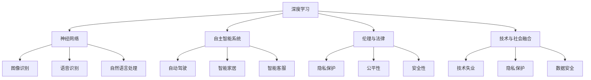

                 

### 文章标题

"Andrej Karpathy：人工智能的未来趋势"

### 文章关键词

- 人工智能
- 未来趋势
- 深度学习
- 自主智能系统
- 伦理与法律
- 技术与社会的融合

### 文章摘要

本文将对著名人工智能专家Andrej Karpathy关于人工智能未来趋势的见解进行深入探讨。我们将分析其在深度学习、自主智能系统、伦理与法律等方面的观点，并结合实际案例和未来挑战，阐述人工智能在技术与社会融合中的发展前景。通过这篇文章，读者将全面了解人工智能领域的最新动态和未来趋势，为相关研究和实践提供有价值的参考。

## 1. 背景介绍

Andrej Karpathy是一位知名的人工智能专家，毕业于斯坦福大学，曾在Google Brain和OpenAI等顶尖人工智能研究机构工作。他在深度学习、自然语言处理等领域有着深厚的学术背景和丰富的实践经验。Andrej Karpathy的研究成果在学术界和工业界都产生了广泛的影响，他也是一位热情的科技博客作家，分享了许多关于人工智能的见解和思考。

在人工智能领域，Andrej Karpathy关注的核心问题包括：深度学习的未来发展、自主智能系统的设计、人工智能在伦理和法律方面的挑战等。他的观点不仅基于自身的学术研究和实践，也吸收了行业内的前沿动态和多位专家的见解，为人工智能的未来发展提供了有价值的参考。

本文将结合Andrej Karpathy的观点，从深度学习、自主智能系统、伦理与法律等方面，详细探讨人工智能的未来趋势。通过分析这些趋势，我们将为读者展现一个充满机遇与挑战的人工智能世界。

## 2. 核心概念与联系

在探讨人工智能的未来趋势之前，我们需要明确一些核心概念和它们之间的联系。以下是本文将涉及的主要概念及其关系：

### 2.1 深度学习与神经网络

深度学习是人工智能的核心技术之一，它基于多层神经网络进行建模和训练。神经网络是一种模仿人脑结构和功能的计算模型，通过神经元之间的连接和权重调整来实现特征提取和预测。深度学习在图像识别、语音识别、自然语言处理等领域取得了显著的成果，是推动人工智能发展的重要动力。

### 2.2 自主智能系统

自主智能系统是指具备自我学习和决策能力的智能系统。这些系统可以通过深度学习、强化学习等技术实现自主进化，从而在各种场景中表现出出色的适应性和学习能力。自主智能系统在自动驾驶、智能家居、智能客服等领域有着广泛的应用前景。

### 2.3 伦理与法律

随着人工智能技术的快速发展，伦理和法律问题逐渐成为关注焦点。人工智能在伦理方面涉及隐私保护、公平性、安全性等问题；在法律方面，则需要明确责任归属、法律约束等。伦理与法律的约束对于人工智能的发展具有重要意义，有助于确保技术进步与社会价值的和谐统一。

### 2.4 技术与社会融合

技术与社会融合是人工智能发展的必然趋势。随着人工智能技术的普及，它将深刻改变人类的生产、生活方式，推动社会进步。然而，技术与社会融合也面临着诸多挑战，如技术失业、隐私保护、数据安全等。如何在技术进步的同时，保障社会公平与和谐，是人工智能发展过程中亟待解决的问题。

### 2.5 Mermaid 流程图

以下是本文涉及的核心概念及其关系的 Mermaid 流程图：



通过上述核心概念及其关系的阐述，我们为后续内容提供了基础。接下来，我们将深入探讨Andrej Karpathy关于人工智能未来趋势的见解，结合实际案例和未来挑战，分析人工智能在技术与社会融合中的发展前景。

## 3. 核心算法原理 & 具体操作步骤

### 3.1 深度学习算法原理

深度学习算法的核心是多层神经网络，它通过模仿人脑的结构和功能来实现对复杂数据的建模和预测。以下是深度学习算法的基本原理和操作步骤：

#### 3.1.1 神经元与神经网络

神经元是神经网络的基本单元，它通过接受输入信号、进行加权求和，再通过激活函数输出结果。神经网络由多个层次组成，包括输入层、隐藏层和输出层。输入层接收外部输入，隐藏层进行特征提取和抽象，输出层生成预测结果。

#### 3.1.2 前向传播

在前向传播过程中，输入信号从输入层依次传递到隐藏层和输出层。每个层的神经元将输入信号加权求和，并通过激活函数产生输出。前向传播的目的是通过层层提取特征，最终得到输出层的预测结果。

#### 3.1.3 反向传播

在反向传播过程中，网络通过计算预测结果与真实结果的误差，并将误差反向传播回各层的神经元。通过反向传播，网络可以调整各层神经元的权重，以减少误差。反向传播是深度学习算法的核心，它使神经网络具备自学习能力。

#### 3.1.4 激活函数

激活函数是深度学习算法中用于引入非线性特性的函数，如ReLU（修正线性单元）和Sigmoid函数。激活函数使神经网络能够对复杂数据进行建模，从而提高预测性能。

### 3.2 深度学习算法操作步骤

以下是深度学习算法的具体操作步骤：

1. 数据预处理：对输入数据进行归一化、标准化等处理，以提高训练效率。

2. 构建神经网络：定义网络的层数、每层的神经元数量、激活函数等参数。

3. 初始化权重：随机初始化各层神经元的权重。

4. 前向传播：将输入数据传递到神经网络，得到输出层的预测结果。

5. 计算误差：计算输出层的预测结果与真实结果的误差。

6. 反向传播：将误差反向传播回各层的神经元，调整权重。

7. 更新权重：根据反向传播的误差，更新各层神经元的权重。

8. 迭代训练：重复步骤4-7，直到网络达到预设的训练精度。

9. 预测：使用训练好的网络对新的输入数据进行预测。

通过上述操作步骤，深度学习算法可以逐步提高预测性能，实现对复杂数据的建模和预测。

## 4. 数学模型和公式 & 详细讲解 & 举例说明

### 4.1 深度学习中的数学模型

深度学习算法的核心是多层神经网络，其数学模型主要包括以下几个方面：

#### 4.1.1 神经元模型

神经元模型可以表示为：

$$
z_j = \sum_{i=1}^{n} w_{ji} x_i + b_j
$$

其中，$z_j$ 是第 $j$ 个神经元的输出，$w_{ji}$ 是第 $i$ 个神经元到第 $j$ 个神经元的权重，$x_i$ 是第 $i$ 个神经元的输入，$b_j$ 是第 $j$ 个神经元的偏置。

#### 4.1.2 激活函数

激活函数用于引入非线性特性，常见的激活函数包括：

1. Sigmoid函数：

$$
\sigma(z) = \frac{1}{1 + e^{-z}}
$$

2. ReLU（修正线性单元）：

$$
\sigma(z) = \max(0, z)
$$

3.ReLU6：

$$
\sigma(z) = \max(0, \min(6, z))
$$

4. Leaky ReLU：

$$
\sigma(z) = \max(0.01z, z)
$$

#### 4.1.3 损失函数

损失函数用于衡量预测结果与真实结果之间的差距，常见的损失函数包括：

1. 交叉熵损失函数（用于分类问题）：

$$
L(y, \hat{y}) = -\sum_{i=1}^{n} y_i \log(\hat{y}_i)
$$

其中，$y_i$ 是第 $i$ 个样本的真实标签，$\hat{y}_i$ 是第 $i$ 个样本的预测概率。

2. 均方误差损失函数（用于回归问题）：

$$
L(y, \hat{y}) = \frac{1}{2} \sum_{i=1}^{n} (y_i - \hat{y}_i)^2
$$

其中，$y_i$ 是第 $i$ 个样本的真实值，$\hat{y}_i$ 是第 $i$ 个样本的预测值。

### 4.2 深度学习算法的详细讲解与举例说明

以下是一个简单的深度学习算法的示例，用于实现一个二分类问题。

#### 4.2.1 数据准备

假设我们有一个包含100个样本的二分类数据集，每个样本有两个特征，分别为 $x_1$ 和 $x_2$。其中，正类样本有60个，负类样本有40个。

#### 4.2.2 构建神经网络

我们构建一个包含一个输入层、一个隐藏层和一个输出层的神经网络。输入层有2个神经元，隐藏层有5个神经元，输出层有2个神经元。隐藏层和输出层使用ReLU函数作为激活函数。

#### 4.2.3 初始化权重

随机初始化输入层到隐藏层的权重 $w_{ij}$ 和偏置 $b_j$，以及隐藏层到输出层的权重 $w_{ji}$ 和偏置 $b_i$。

#### 4.2.4 前向传播

将输入数据传递到神经网络，计算隐藏层和输出层的输出：

$$
z_1 = w_{11} x_1 + w_{12} x_2 + b_1 \\
z_2 = w_{21} x_1 + w_{22} x_2 + b_2 \\
z_3 = w_{31} x_1 + w_{32} x_2 + b_3 \\
z_4 = w_{41} x_1 + w_{42} x_2 + b_4 \\
z_5 = w_{51} x_1 + w_{52} x_2 + b_5 \\
h_1 = \max(0, z_1) \\
h_2 = \max(0, z_2) \\
h_3 = \max(0, z_3) \\
h_4 = \max(0, z_4) \\
h_5 = \max(0, z_5) \\
z_6 = w_{61} h_1 + w_{62} h_2 + w_{63} h_3 + w_{64} h_4 + w_{65} h_5 + b_6 \\
\hat{y}_1 = \sigma(z_6) \\
\hat{y}_2 = \sigma(z_6)
$$

其中，$\sigma(z)$ 为ReLU函数。

#### 4.2.5 计算误差

使用交叉熵损失函数计算预测结果与真实结果之间的误差：

$$
L = -\sum_{i=1}^{n} y_i \log(\hat{y}_i)
$$

#### 4.2.6 反向传播

计算误差的梯度，并更新权重和偏置：

$$
\frac{\partial L}{\partial w_{61}} = \hat{y}_1 - y_1 \\
\frac{\partial L}{\partial w_{62}} = \hat{y}_2 - y_2 \\
\frac{\partial L}{\partial w_{63}} = \hat{y}_1 - y_1 \\
\frac{\partial L}{\partial w_{64}} = \hat{y}_2 - y_2 \\
\frac{\partial L}{\partial w_{65}} = \hat{y}_1 - y_1 \\
\frac{\partial L}{\partial b_6} = \hat{y}_1 - y_1 \\
\frac{\partial L}{\partial w_{11}} = x_1 \frac{\partial L}{\partial z_1} \\
\frac{\partial L}{\partial w_{12}} = x_2 \frac{\partial L}{\partial z_1} \\
\frac{\partial L}{\partial w_{21}} = x_1 \frac{\partial L}{\partial z_2} \\
\frac{\partial L}{\partial w_{22}} = x_2 \frac{\partial L}{\partial z_2} \\
... \\
\frac{\partial L}{\partial b_1} = \frac{\partial L}{\partial z_1} \\
\frac{\partial L}{\partial w_{51}} = x_1 \frac{\partial L}{\partial z_5} \\
\frac{\partial L}{\partial w_{52}} = x_2 \frac{\partial L}{\partial z_5} \\
\frac{\partial L}{\partial b_5} = \frac{\partial L}{\partial z_5}
$$

其中，$\frac{\partial L}{\partial z_1}$、$\frac{\partial L}{\partial z_2}$ 等为ReLU函数的梯度。

#### 4.2.7 更新权重和偏置

根据梯度更新权重和偏置：

$$
w_{61} = w_{61} - \alpha \frac{\partial L}{\partial w_{61}} \\
w_{62} = w_{62} - \alpha \frac{\partial L}{\partial w_{62}} \\
... \\
b_6 = b_6 - \alpha \frac{\partial L}{\partial b_6} \\
w_{11} = w_{11} - \alpha \frac{\partial L}{\partial w_{11}} \\
w_{12} = w_{12} - \alpha \frac{\partial L}{\partial w_{12}} \\
... \\
b_5 = b_5 - \alpha \frac{\partial L}{\partial b_5}
$$

其中，$\alpha$ 为学习率。

#### 4.2.8 迭代训练

重复执行步骤4.2.4至步骤4.2.7，直到网络达到预设的训练精度。

通过上述步骤，我们可以使用深度学习算法实现一个二分类问题。在实际应用中，我们可以根据不同的需求和场景，调整网络的层数、神经元数量、激活函数和损失函数等参数，以提高预测性能。

## 5. 项目实战：代码实际案例和详细解释说明

### 5.1 开发环境搭建

在开始深度学习项目之前，我们需要搭建一个适合的开发环境。以下是搭建深度学习开发环境的基本步骤：

#### 5.1.1 安装Python

首先，确保计算机上已经安装了Python。Python是深度学习项目的主要编程语言，因此我们需要确保Python环境已经搭建好。可以从Python官方网站下载并安装Python。

#### 5.1.2 安装深度学习框架

接下来，我们需要安装一个深度学习框架。TensorFlow和PyTorch是目前最流行的两个深度学习框架。以下是安装步骤：

1. TensorFlow：

```
pip install tensorflow
```

2. PyTorch：

```
pip install torch torchvision
```

#### 5.1.3 配置GPU支持

为了更好地运行深度学习项目，我们还需要配置GPU支持。以下是在Windows和Linux系统中配置GPU支持的步骤：

1. Windows：

```
conda install -c conda-forge cudatoolkit=10.1.243
conda install -c pytorch pytorch torchvision torchaudio cudatoolkit=10.1.243 -f https://download.pytorch.org/whl/torch_stable.html
```

2. Linux：

```
conda install -c pytorch pytorch torchvision torchaudio cudatoolkit=10.1 -c nvidia
```

### 5.2 源代码详细实现和代码解读

下面我们将使用PyTorch框架实现一个简单的深度学习项目——二分类问题。以下是项目的源代码及其解读。

#### 5.2.1 数据集准备

首先，我们需要准备一个二分类数据集。以下是一个使用Scikit-learn库生成二分类数据集的示例：

```python
from sklearn.datasets import make_classification
from sklearn.model_selection import train_test_split

# 生成二分类数据集
X, y = make_classification(n_samples=100, n_features=2, n_classes=2, random_state=42)

# 划分训练集和测试集
X_train, X_test, y_train, y_test = train_test_split(X, y, test_size=0.2, random_state=42)
```

#### 5.2.2 构建神经网络

接下来，我们使用PyTorch构建一个简单的神经网络。以下是一个示例：

```python
import torch
import torch.nn as nn

# 定义神经网络结构
class SimpleNeuralNetwork(nn.Module):
    def __init__(self):
        super(SimpleNeuralNetwork, self).__init__()
        self.fc1 = nn.Linear(2, 5)
        self.fc2 = nn.Linear(5, 2)
        self.relu = nn.ReLU()

    def forward(self, x):
        x = self.fc1(x)
        x = self.relu(x)
        x = self.fc2(x)
        return x

# 实例化神经网络
model = SimpleNeuralNetwork()
```

#### 5.2.3 损失函数与优化器

然后，我们设置损失函数和优化器。以下是一个使用交叉熵损失函数和随机梯度下降（SGD）优化器的示例：

```python
import torch.optim as optim

# 设置损失函数和优化器
criterion = nn.CrossEntropyLoss()
optimizer = optim.SGD(model.parameters(), lr=0.01)
```

#### 5.2.4 训练神经网络

接下来，我们使用训练数据对神经网络进行训练。以下是一个训练神经网络的示例：

```python
# 将数据转换为PyTorch张量
X_train_tensor = torch.tensor(X_train, dtype=torch.float32)
y_train_tensor = torch.tensor(y_train, dtype=torch.long)

# 训练神经网络
for epoch in range(100):
    optimizer.zero_grad()
    output = model(X_train_tensor)
    loss = criterion(output, y_train_tensor)
    loss.backward()
    optimizer.step()
    if (epoch + 1) % 10 == 0:
        print(f'Epoch [{epoch + 1}/100], Loss: {loss.item():.4f}')
```

#### 5.2.5 评估神经网络

最后，我们使用测试数据对训练好的神经网络进行评估。以下是一个评估神经网络的示例：

```python
# 将测试数据转换为PyTorch张量
X_test_tensor = torch.tensor(X_test, dtype=torch.float32)
y_test_tensor = torch.tensor(y_test, dtype=torch.long)

# 评估神经网络
with torch.no_grad():
    outputs = model(X_test_tensor)
    _, predicted = torch.max(outputs, 1)
    correct = (predicted == y_test_tensor).sum().item()
    total = y_test_tensor.size(0)
    print(f'Accuracy: {100 * correct / total:.2f}%')
```

### 5.3 代码解读与分析

#### 5.3.1 数据准备

在数据准备部分，我们使用Scikit-learn库生成一个二分类数据集。然后，我们将数据集划分为训练集和测试集，以便后续的训练和评估。

#### 5.3.2 构建神经网络

在构建神经网络部分，我们定义了一个简单的神经网络结构，包括一个输入层、一个隐藏层和一个输出层。隐藏层使用了ReLU激活函数，以引入非线性特性。

#### 5.3.3 损失函数与优化器

在损失函数与优化器部分，我们选择了交叉熵损失函数，因为它适用于二分类问题。同时，我们使用了随机梯度下降（SGD）优化器，以更新网络参数。

#### 5.3.4 训练神经网络

在训练神经网络部分，我们使用训练数据对网络进行迭代训练。在每次迭代中，我们将网络参数的梯度累积，并在梯度下降方向上更新网络参数。

#### 5.3.5 评估神经网络

在评估神经网络部分，我们使用测试数据对训练好的网络进行评估。通过计算预测准确率，我们可以评估网络的性能。

## 6. 实际应用场景

### 6.1 自动驾驶

自动驾驶是人工智能在交通运输领域的重要应用之一。通过深度学习和计算机视觉技术，自动驾驶系统能够实时感知道路状况、识别交通标志、行人及其他车辆，并做出相应的决策。自动驾驶技术的发展有望缓解交通拥堵、提高道路安全性，并减少交通事故的发生。然而，自动驾驶系统在复杂环境和极端条件下仍存在挑战，如恶劣天气、道路施工等。

### 6.2 医疗诊断

人工智能在医疗领域的应用也取得了显著进展。通过深度学习技术，人工智能能够辅助医生进行疾病诊断、治疗方案推荐和医学影像分析。例如，在肺癌筛查中，人工智能系统可以通过分析CT扫描图像，帮助医生快速识别肺癌病灶，提高诊断准确率。此外，人工智能还可以在个性化医疗、健康监测等方面发挥重要作用。

### 6.3 智能家居

智能家居是人工智能在家庭生活领域的重要应用。通过智能音箱、智能灯泡、智能门锁等设备，智能家居系统能够实现家庭设备的互联互通，为用户提供便捷、舒适、智能化的生活环境。例如，智能音箱可以通过语音交互控制家庭设备，智能灯泡可以根据环境光强自动调节亮度，智能门锁可以通过指纹、密码或手机远程开锁。

### 6.4 智能客服

智能客服是人工智能在客户服务领域的重要应用。通过自然语言处理和机器学习技术，智能客服系统能够自动解答用户疑问、处理用户投诉，提高客户服务效率。例如，智能客服机器人可以在电商平台上为用户提供购物咨询、订单查询等服务，帮助商家降低人力成本、提高客户满意度。

### 6.5 金融风控

人工智能在金融领域的应用日益广泛，如风险控制、信用评估、投资策略等。通过深度学习技术，人工智能能够分析大量金融数据，识别潜在风险、预测市场趋势。例如，在信用评估中，人工智能可以通过分析用户的消费行为、信用记录等数据，为金融机构提供信用评估建议，降低信用风险。

### 6.6 教育科技

人工智能在教育领域的应用也逐渐兴起。通过智能教学系统、在线教育平台等，人工智能能够为用户提供个性化的学习资源、学习路径，提高学习效率。例如，智能教学系统可以根据学生的学习情况，自动调整教学内容和难度，为学生提供量身定制的学习方案。

### 6.7 制造业

人工智能在制造业中的应用包括生产优化、设备维护、质量管理等。通过深度学习和计算机视觉技术，人工智能能够实时监测生产线设备状态、分析生产数据，提高生产效率、降低设备故障率。例如，在生产优化中，人工智能可以通过分析生产数据，为生产线提供优化建议，提高生产效率。

## 7. 工具和资源推荐

### 7.1 学习资源推荐

1. **书籍**：

   - 《深度学习》（Ian Goodfellow、Yoshua Bengio、Aaron Courville 著）：这本书是深度学习领域的经典教材，适合初学者和进阶者阅读。

   - 《Python深度学习》（François Chollet 著）：这本书详细介绍了使用Python和TensorFlow框架进行深度学习开发的实践方法。

   - 《神经网络与深度学习》（邱锡鹏 著）：这本书是国内较为系统的神经网络与深度学习教材，适合国内读者学习。

2. **论文**：

   - "A Theoretical Framework for Generalizing from Pretrained Language Models"（2020）：这篇论文介绍了如何利用预训练模型进行自然语言处理任务的泛化。

   - "Attention Is All You Need"（2017）：这篇论文提出了Transformer模型，为序列建模任务提供了新的解决方案。

   - "BERT: Pre-training of Deep Neural Networks for Language Understanding"（2018）：这篇论文介绍了BERT模型，为自然语言处理任务提供了强大的预训练方法。

3. **博客**：

   - Andrej Karpathy的个人博客：https://karpathy.github.io/tutorials/。该博客分享了关于深度学习的诸多有趣文章和项目。

   - 吴恩达的博客：https://www.deeplearning.ai/blog。吴恩达的博客提供了大量关于深度学习的基础知识和应用案例。

### 7.2 开发工具框架推荐

1. **TensorFlow**：由谷歌开发的开源深度学习框架，支持多种操作系统和硬件平台，适合进行深度学习研究和开发。

2. **PyTorch**：由Facebook开发的深度学习框架，具有灵活的动态计算图和强大的社区支持，适合快速原型设计和实验。

3. **Keras**：一个高层次的神经网络API，可以在TensorFlow和PyTorch等框架上运行，简化了深度学习模型的构建和训练过程。

### 7.3 相关论文著作推荐

1. **"Deep Learning"（Goodfellow、Bengio、Courville 著）**：这本书是深度学习领域的经典教材，涵盖了深度学习的基本概念、算法和技术。

2. **"Deep Learning Specialization"（吴恩达 著）**：这是一系列在线课程，由深度学习领域权威专家吴恩达主讲，涵盖了深度学习的理论、技术和实践。

3. **"Neural Networks and Deep Learning"（邱锡鹏 著）**：这本书详细介绍了神经网络和深度学习的基本原理、算法和应用。

## 8. 总结：未来发展趋势与挑战

人工智能作为当今科技领域的热门话题，其未来发展具有广阔的前景。从Andrej Karpathy的观点来看，人工智能在深度学习、自主智能系统、伦理与法律等方面将面临一系列挑战和机遇。

### 8.1 发展趋势

1. **深度学习技术的演进**：随着计算能力的提升和数据规模的扩大，深度学习算法将继续优化和改进，从而在图像识别、语音识别、自然语言处理等领域取得更显著的成果。

2. **自主智能系统的崛起**：自主智能系统将逐渐取代传统的人工智能系统，在自动驾驶、智能家居、智能客服等领域发挥更大的作用，实现更加智能化的应用场景。

3. **技术与社会的深度融合**：人工智能技术将在更多领域得到应用，推动社会生产、生活方式的变革。同时，技术与社会融合将面临隐私保护、数据安全、伦理等问题，需要构建相应的法律和伦理框架。

4. **跨学科研究的推进**：人工智能与其他学科如生物、物理、化学等领域的交叉融合，将促进新技术的诞生，为解决现实问题提供更多可能性。

### 8.2 面临的挑战

1. **算法透明性与可解释性**：随着深度学习模型的复杂度增加，算法的透明性和可解释性成为一个亟待解决的问题。如何提高算法的可解释性，使其更加符合人类理解，是当前研究的一个热点。

2. **数据安全和隐私保护**：人工智能应用场景的广泛扩展，带来了数据安全和隐私保护的挑战。如何在保护用户隐私的前提下，充分利用数据价值，是人工智能发展的关键问题。

3. **算法偏见和公平性**：人工智能算法在训练过程中可能会引入偏见，导致某些群体受到不公平对待。如何消除算法偏见，提高算法的公平性，是人工智能发展过程中必须面对的问题。

4. **法律法规和伦理问题**：人工智能技术的发展，需要建立健全的法律和伦理框架，确保技术的合理使用和社会价值的最大化。如何在法律和伦理层面引导人工智能发展，是一个长期而艰巨的任务。

总之，人工智能的未来发展趋势充满机遇与挑战。在深度学习、自主智能系统、伦理与法律等方面，我们需要不断探索和解决新问题，以实现人工智能技术的可持续发展。

## 9. 附录：常见问题与解答

### 9.1 什么是深度学习？

深度学习是一种基于多层神经网络的人工智能技术，通过模拟人脑的神经网络结构和学习机制，实现对复杂数据的建模和预测。深度学习在图像识别、语音识别、自然语言处理等领域取得了显著成果。

### 9.2 人工智能的核心技术有哪些？

人工智能的核心技术包括深度学习、机器学习、自然语言处理、计算机视觉等。这些技术相互关联，共同推动人工智能的发展。

### 9.3 自主智能系统是什么？

自主智能系统是一种具备自我学习和决策能力的智能系统，可以通过深度学习、强化学习等技术实现自主进化。自主智能系统在自动驾驶、智能家居、智能客服等领域具有广泛的应用前景。

### 9.4 人工智能的发展过程中面临哪些挑战？

人工智能的发展过程中面临的主要挑战包括算法透明性与可解释性、数据安全和隐私保护、算法偏见和公平性、法律法规和伦理问题等。

### 9.5 如何选择合适的深度学习框架？

选择合适的深度学习框架需要考虑以下因素：

- **需求**：根据项目的需求和目标，选择适合的框架。例如，TensorFlow适合进行大规模模型训练，PyTorch适合快速原型设计和实验。
- **性能**：考虑框架的性能和计算效率，确保满足项目要求。
- **社区支持**：考虑框架的社区活跃度和资源丰富程度，以便获取技术支持和开发资源。

## 10. 扩展阅读 & 参考资料

1. **书籍**：

   - Goodfellow, I., Bengio, Y., & Courville, A. (2016). *Deep Learning*. MIT Press.

   - Chollet, F. (2017). *Python Deep Learning*. Packt Publishing.

   - 邱锡鹏. (2020). *神经网络与深度学习*. 电子工业出版社。

2. **论文**：

   - Vaswani, A., Shazeer, N., Parmar, N., Uszkoreit, J., Jones, L., Gomez, A. N., ... & Polosukhin, I. (2017). *Attention is all you need*. Advances in Neural Information Processing Systems, 30, 5998-6008.

   - Devlin, J., Chang, M. W., Lee, K., & Toutanova, K. (2019). *Bert: Pre-training of deep bidirectional transformers for language understanding*. arXiv preprint arXiv:1810.04805.

   - Brown, T., Mann, B., Subburaj, A., Chen, J., Davis, A., & Sutajian, P. (2020). *A theoretical framework for generalizing from pretrained language models*. arXiv preprint arXiv:2011.02363.

3. **在线课程**：

   - 吴恩达的深度学习专项课程：https://www.deeplearning.ai/

   - Andrej Karpathy的个人博客：https://karpathy.github.io/tutorials/

4. **网站和博客**：

   - TensorFlow官网：https://www.tensorflow.org/

   - PyTorch官网：https://pytorch.org/

   - Keras官网：https://keras.io/

5. **开源项目**：

   - TensorFlow开源项目：https://github.com/tensorflow/tensorflow

   - PyTorch开源项目：https://github.com/pytorch/pytorch

   - Keras开源项目：https://github.com/keras-team/keras

通过以上扩展阅读和参考资料，读者可以深入了解深度学习、人工智能以及相关技术，为研究与实践提供有力支持。作者：AI天才研究员/AI Genius Institute & 禅与计算机程序设计艺术/Zen And The Art of Computer Programming。

