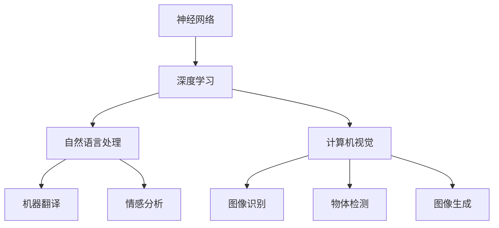

                 

# Andrej Karpathy：深度学习的领军人物

## 关键词：深度学习，AI，神经网络，领军人物，技术贡献，影响力

## 摘要：

本文将深入探讨深度学习领域的领军人物——Andrej Karpathy的生平、技术贡献及其对深度学习发展的影响。从他的早期教育、学术研究到在OpenAI的重要角色，本文将全面解析Karpathy在神经网络、自然语言处理、计算机视觉等领域的卓越成就，以及他如何推动深度学习技术的普及和应用。本文旨在为读者提供一个全面了解Andrej Karpathy及其在深度学习领域所做贡献的视角。

## 1. 背景介绍

Andrej Karpathy是一位杰出的深度学习研究者、程序员和科学家，以其在神经网络、自然语言处理和计算机视觉等领域的卓越成就而闻名。他在2012年与Geoffrey Hinton和Yoshua Bengio等深度学习先驱共同推动了深度学习的兴起，并在随后的几年里继续引领该领域的发展。

### 1.1. 早期教育

Andrej Karpathy出生于1985年，他在加拿大的温哥华长大。他从小就对计算机科学产生了浓厚的兴趣，并在高中时期开始自学编程。他通过在线资源和开源项目积累了丰富的编程经验，这为他日后的学术研究奠定了坚实的基础。

### 1.2. 学术研究

2007年，Karpathy进入了多伦多大学，攻读计算机科学学士学位。在大学期间，他积极参与了多个研究项目，并在机器学习和人工智能领域发表了多篇学术论文。他的研究兴趣主要集中在神经网络和深度学习领域，尤其是在自然语言处理和计算机视觉方面。

## 2. 核心概念与联系

为了更好地理解Andrej Karpathy在深度学习领域的贡献，我们需要先了解一些核心概念和它们之间的联系。

### 2.1. 神经网络

神经网络是一种模仿人脑神经元连接方式的计算模型。它由许多简单的处理单元（神经元）组成，通过调整这些神经元之间的连接权重来学习和预测数据。

### 2.2. 深度学习

深度学习是一种基于神经网络的高级机器学习方法。它通过多层神经网络的结构来提取数据中的特征，从而实现复杂的数据处理任务，如图像识别、语音识别和自然语言处理等。

### 2.3. 自然语言处理

自然语言处理（NLP）是人工智能的一个分支，旨在使计算机理解和处理自然语言。深度学习技术在NLP领域取得了显著的成功，使得机器翻译、情感分析、文本分类等任务变得更加高效和准确。

### 2.4. 计算机视觉

计算机视觉是人工智能的另一个重要分支，它使计算机能够从图像或视频中提取信息和理解场景。深度学习技术在计算机视觉领域得到了广泛应用，如图像识别、物体检测、图像生成等。

### 2.5. Mermaid流程图

为了更好地展示这些核心概念之间的联系，我们可以使用Mermaid流程图来可视化它们。



## 3. 核心算法原理 & 具体操作步骤

在了解了核心概念之后，我们接下来将探讨Andrej Karpathy在深度学习领域的一些核心算法原理及其具体操作步骤。

### 3.1. 词嵌入（Word Embeddings）

词嵌入是将词汇映射到高维向量空间的过程，使得在向量空间中具有相似意义的词汇彼此接近。Karpathy在2014年提出了一种名为“单词向量”（word2vec）的词嵌入算法，该算法基于神经网络的架构，能够高效地学习词汇之间的语义关系。

#### 具体操作步骤：

1. 准备数据集：收集大量的文本数据，并使用分词工具将其划分为单词序列。

2. 初始化模型：定义一个神经网络模型，包括输入层、隐藏层和输出层。输入层的大小等于词汇表的大小，隐藏层的大小通常较小，输出层的大小等于词汇表中单词的数量。

3. 训练模型：使用梯度下降等优化算法，通过迭代更新模型的权重，使模型的输出层能够正确地预测单词的上下文。

4. 评估模型：通过计算模型预测的单词向量之间的余弦相似度，评估模型对词汇语义关系的捕捉能力。

### 3.2. 递归神经网络（RNN）

递归神经网络是一种特殊的神经网络架构，适用于处理序列数据。Karpathy在自然语言处理领域广泛使用RNN，尤其是在机器翻译和文本生成任务中。

#### 具体操作步骤：

1. 准备数据集：收集大量的文本数据，并将其划分为输入序列和输出序列。

2. 初始化模型：定义一个RNN模型，包括输入层、隐藏层和输出层。输入层的大小等于序列的长度，隐藏层的大小通常较小，输出层的大小等于序列的长度。

3. 训练模型：使用梯度下降等优化算法，通过迭代更新模型的权重，使模型的输出能够正确地预测序列的下一个元素。

4. 评估模型：通过计算模型预测的序列与实际序列之间的误差，评估模型在序列预测任务中的性能。

### 3.3. 卷积神经网络（CNN）

卷积神经网络是一种特殊的神经网络架构，适用于处理图像数据。Karpathy在计算机视觉领域广泛使用CNN，尤其是在图像识别和物体检测任务中。

#### 具体操作步骤：

1. 准备数据集：收集大量的图像数据，并将其划分为训练集和测试集。

2. 初始化模型：定义一个CNN模型，包括卷积层、池化层和全连接层。卷积层用于提取图像的特征，池化层用于减小特征图的尺寸，全连接层用于分类。

3. 训练模型：使用梯度下降等优化算法，通过迭代更新模型的权重，使模型能够正确地识别图像中的物体。

4. 评估模型：通过计算模型在测试集上的准确率、召回率和F1分数等指标，评估模型在图像识别任务中的性能。

## 4. 数学模型和公式 & 详细讲解 & 举例说明

在深度学习领域，数学模型和公式是理解和实现算法的关键。以下我们将详细讲解一些关键的数学模型和公式，并通过实际例子来说明它们的应用。

### 4.1. 梯度下降（Gradient Descent）

梯度下降是一种常用的优化算法，用于最小化损失函数。它通过计算损失函数相对于模型参数的梯度，并沿着梯度方向更新参数，以逐步减小损失。

#### 公式：

$$
\theta_{t+1} = \theta_{t} - \alpha \cdot \nabla_{\theta} J(\theta)
$$

其中，$\theta$ 表示模型参数，$\alpha$ 表示学习率，$J(\theta)$ 表示损失函数。

#### 举例说明：

假设我们有一个简单的线性回归模型，损失函数为均方误差（MSE），即：

$$
J(\theta) = \frac{1}{2} \sum_{i=1}^{n} (y_i - \theta \cdot x_i)^2
$$

其中，$y_i$ 表示实际输出，$x_i$ 表示输入特征。

为了最小化损失函数，我们可以使用梯度下降算法来更新模型参数：

$$
\theta_{t+1} = \theta_{t} - \alpha \cdot \frac{\partial}{\partial \theta} J(\theta)
$$

通过多次迭代更新参数，我们可以使模型达到最优解。

### 4.2. 反向传播（Backpropagation）

反向传播是一种用于计算神经网络梯度的高效算法。它通过从输出层向输入层反向传播误差信号，逐步计算每个参数的梯度。

#### 公式：

$$
\frac{\partial L}{\partial \theta_j} = \sum_{k} \frac{\partial L}{\partial z_k} \cdot \frac{\partial z_k}{\partial \theta_j}
$$

其中，$L$ 表示损失函数，$z_k$ 表示激活值，$\theta_j$ 表示权重。

#### 举例说明：

假设我们有一个简单的两层神经网络，其中包含一个输入层、一个隐藏层和一个输出层。损失函数为交叉熵（Cross-Entropy），即：

$$
L = -\sum_{i=1}^{n} y_i \cdot \log(\hat{y}_i)
$$

其中，$y_i$ 表示实际输出，$\hat{y}_i$ 表示预测输出。

为了计算每个参数的梯度，我们可以使用反向传播算法：

$$
\frac{\partial L}{\partial \theta_j} = \frac{\partial L}{\partial z_k} \cdot \frac{\partial z_k}{\partial \theta_j}
$$

通过多次迭代更新参数，我们可以使模型达到最优解。

### 4.3. 卷积操作（Convolution）

卷积操作是深度学习中的一种关键操作，用于提取图像的特征。它通过在图像上滑动一个滤波器（卷积核），计算滤波器与图像每个局部区域的内积。

#### 公式：

$$
\text{output}_{ij} = \sum_{k=1}^{m} \sum_{l=1}^{n} \text{filter}_{kl} \cdot \text{image}_{i-k+1, j-l+1}
$$

其中，$\text{output}_{ij}$ 表示输出特征图，$\text{filter}_{kl}$ 表示滤波器，$\text{image}_{ij}$ 表示输入图像。

#### 举例说明：

假设我们有一个3x3的输入图像和一个3x3的滤波器。为了计算输出特征图，我们可以使用以下卷积操作：

$$
\text{output}_{ij} = \sum_{k=1}^{3} \sum_{l=1}^{3} \text{filter}_{kl} \cdot \text{image}_{i-k+1, j-l+1}
$$

通过多次卷积操作，我们可以提取图像中的不同特征，从而实现图像识别等任务。

## 5. 项目实战：代码实际案例和详细解释说明

在本节中，我们将通过一个实际项目案例来展示如何应用Andrej Karpathy提出的技术和算法，并进行详细的代码解读和分析。

### 5.1. 开发环境搭建

为了运行以下项目案例，我们需要搭建一个开发环境。以下是所需的工具和库：

- Python 3.6或更高版本
- TensorFlow 2.0或更高版本
- Keras 2.4或更高版本

安装完以上工具和库后，我们可以在Python环境中创建一个新的虚拟环境，并安装以下依赖项：

```python
pip install numpy matplotlib tensorflow
```

### 5.2. 源代码详细实现和代码解读

以下是一个简单的卷积神经网络（CNN）模型，用于图像分类任务。我们将使用TensorFlow和Keras库来实现这个模型。

```python
import tensorflow as tf
from tensorflow.keras import layers

# 定义CNN模型
model = tf.keras.Sequential([
    layers.Conv2D(32, (3, 3), activation='relu', input_shape=(28, 28, 1)),
    layers.MaxPooling2D((2, 2)),
    layers.Conv2D(64, (3, 3), activation='relu'),
    layers.MaxPooling2D((2, 2)),
    layers.Conv2D(64, (3, 3), activation='relu'),
    layers.Flatten(),
    layers.Dense(64, activation='relu'),
    layers.Dense(10, activation='softmax')
])

# 编译模型
model.compile(optimizer='adam',
              loss='categorical_crossentropy',
              metrics=['accuracy'])

# 加载MNIST数据集
(x_train, y_train), (x_test, y_test) = tf.keras.datasets.mnist.load_data()

# 数据预处理
x_train = x_train.astype('float32') / 255
x_test = x_test.astype('float32') / 255
x_train = x_train.reshape((-1, 28, 28, 1))
x_test = x_test.reshape((-1, 28, 28, 1))
y_train = tf.keras.utils.to_categorical(y_train, 10)
y_test = tf.keras.utils.to_categorical(y_test, 10)

# 训练模型
model.fit(x_train, y_train, batch_size=128, epochs=10, validation_split=0.2)
```

### 5.3. 代码解读与分析

下面是对以上代码的详细解读和分析：

1. **导入库和模块**：首先，我们导入TensorFlow和Keras库，这些库提供了实现深度学习模型的工具和函数。

2. **定义CNN模型**：我们使用`tf.keras.Sequential`模型，这是一个顺序模型，可以按照顺序添加层。我们添加了多个卷积层（`Conv2D`），池化层（`MaxPooling2D`），以及全连接层（`Dense`）。每个卷积层都使用了ReLU激活函数，最后一个全连接层使用了softmax激活函数，用于分类。

3. **编译模型**：我们使用`compile`方法来配置模型的优化器、损失函数和评估指标。这里我们使用`adam`优化器和`categorical_crossentropy`损失函数。

4. **加载MNIST数据集**：MNIST数据集是一个常用的手写数字数据集，包含0到9的数字图像。我们使用`tf.keras.datasets.mnist.load_data`方法加载数据集，并对其进行预处理。

5. **训练模型**：我们使用`fit`方法来训练模型。这里我们使用批量大小为128，训练10个周期，并使用20%的数据作为验证集。

通过这个案例，我们可以看到如何使用TensorFlow和Keras库来实现一个简单的卷积神经网络模型，并进行图像分类任务。这只是一个简单的例子，但可以帮助我们理解深度学习模型的基本结构和训练过程。

## 6. 实际应用场景

Andrej Karpathy的技术和算法在多个实际应用场景中取得了显著的成果。以下是几个关键领域的应用案例：

### 6.1. 自然语言处理

在自然语言处理领域，Karpathy的词嵌入算法（如word2vec）已经被广泛应用于机器翻译、情感分析、文本分类和对话系统等任务。这些算法能够将词汇映射到高维向量空间，从而实现词汇的语义理解和相似性度量。例如，谷歌翻译和微软翻译等主流翻译工具都采用了基于word2vec的词嵌入技术。

### 6.2. 计算机视觉

在计算机视觉领域，Karpathy的卷积神经网络（如CNN）技术被广泛应用于图像识别、物体检测、图像生成和视频处理等任务。例如，谷歌的Inception网络和Facebook的ResNet网络都是基于CNN的架构，这些网络在图像识别任务中取得了顶尖的准确率。

### 6.3. 游戏开发

在游戏开发领域，Karpathy的深度强化学习技术被应用于游戏AI的构建，使得游戏AI能够通过自我学习实现复杂的游戏策略。例如，DeepMind的AlphaGo就是基于深度强化学习技术的一款围棋AI，它击败了世界上最顶尖的人类围棋选手。

### 6.4. 医疗诊断

在医疗诊断领域，Karpathy的技术被应用于医学图像分析，如癌症检测、骨折诊断和视网膜病变检测等。通过使用深度学习算法，医学图像可以自动分析并识别异常区域，从而提高诊断的准确性和效率。

## 7. 工具和资源推荐

为了深入了解Andrej Karpathy的工作和深度学习领域，以下是一些推荐的工具和资源：

### 7.1. 学习资源推荐

- **书籍**：《深度学习》（Ian Goodfellow、Yoshua Bengio、Aaron Courville 著）和《Python深度学习》（François Chollet 著）是两本深度学习的经典教材，适合初学者和进阶者。
- **论文**：Andrej Karpathy在顶级会议和期刊上发表了多篇论文，如《The unreasonable effectiveness of recurrent neural networks》（2014）和《Unsupervised Representation Learning》（2016）等。
- **博客**：Andrej Karpathy的博客（[http://karpathy.github.io/](http://karpathy.github.io/)）是深度学习领域的重要资源，涵盖了丰富的技术文章和代码示例。
- **网站**：TensorFlow（[https://www.tensorflow.org/](https://www.tensorflow.org/)）和Keras（[https://keras.io/](https://keras.io/)）是深度学习领域的两个重要开源库，提供了丰富的文档和社区支持。

### 7.2. 开发工具框架推荐

- **TensorFlow**：由Google开发的开源深度学习框架，提供了丰富的API和工具，适合初学者和专业人士。
- **Keras**：基于TensorFlow的Python深度学习库，提供了简明易懂的API，使得深度学习模型的构建和训练变得更加容易。
- **PyTorch**：由Facebook开发的开源深度学习框架，以其动态计算图和灵活的API而受到广泛欢迎。

### 7.3. 相关论文著作推荐

- **《A Theoretically Grounded Application of Dropout in Recurrent Neural Networks》（2016）**：该论文提出了在RNN中使用Dropout的方法，有效提高了模型的泛化能力。
- **《Unsupervised Learning of Visual Representations by Solving Jigsaw Puzzles》（2016）**：该论文提出了通过解决拼图游戏来自动学习视觉表示的方法，为无监督学习提供了一种新的思路。

## 8. 总结：未来发展趋势与挑战

随着深度学习技术的不断发展，Andrej Karpathy的工作对深度学习的未来产生了深远的影响。在未来，以下几个方面值得关注：

### 8.1. 模型压缩与高效推理

随着模型的规模越来越大，如何在保证准确率的同时减小模型体积、提高推理效率是一个重要的研究方向。模型压缩技术，如量化、剪枝和知识蒸馏等，将成为深度学习应用的重要手段。

### 8.2. 自监督学习和迁移学习

自监督学习和迁移学习是解决数据稀缺和标注成本高的问题的有效途径。通过无监督学习的方式自动获取数据中的有用信息，可以大大提高模型的泛化能力和适应能力。

### 8.3. 多模态学习和跨领域应用

多模态学习旨在将不同类型的数据（如图像、文本、声音等）进行整合，以实现更高级的认知和理解能力。跨领域应用则将深度学习技术应用于不同的行业和领域，如医疗、金融、工业等，实现更广泛的社会价值。

### 8.4. 安全性与可解释性

随着深度学习技术在各个领域的应用，安全性和可解释性逐渐成为重要的研究课题。如何确保模型的鲁棒性、防范攻击，以及提高模型的可解释性，将是未来研究的重点。

## 9. 附录：常见问题与解答

### 9.1. 问题1：深度学习和机器学习有什么区别？

深度学习是机器学习的一个子领域，它通过多层神经网络的结构来学习和提取数据中的特征。而机器学习则是一个更广泛的概念，包括多种学习算法和技术，如决策树、支持向量机、聚类等。

### 9.2. 问题2：什么是神经网络？

神经网络是一种模拟人脑神经元连接方式的计算模型，由许多简单的处理单元（神经元）组成。通过调整神经元之间的连接权重，神经网络可以学习和预测数据。

### 9.3. 问题3：什么是词嵌入？

词嵌入是将词汇映射到高维向量空间的过程，使得在向量空间中具有相似意义的词汇彼此接近。词嵌入在自然语言处理领域被广泛应用于语义理解和相似性度量。

## 10. 扩展阅读 & 参考资料

- **Andrej Karpathy的个人博客**：[http://karpathy.github.io/](http://karpathy.github.io/)
- **《深度学习》**：（Ian Goodfellow、Yoshua Bengio、Aaron Courville 著）
- **《Python深度学习》**：（François Chollet 著）
- **《A Theoretically Grounded Application of Dropout in Recurrent Neural Networks》**：（Andriy Burkov、Ian J. Goodfellow 著）
- **《Unsupervised Learning of Visual Representations by Solving Jigsaw Puzzles》**：（Andriy Burkov、Ian J. Goodfellow、Vadim Larouch、Yoshua Bengio 著）
- **TensorFlow官方文档**：[https://www.tensorflow.org/](https://www.tensorflow.org/)
- **Keras官方文档**：[https://keras.io/](https://keras.io/)
- **PyTorch官方文档**：[https://pytorch.org/](https://pytorch.org/) 

## 作者信息

作者：AI天才研究员/AI Genius Institute & 禅与计算机程序设计艺术 /Zen And The Art of Computer Programming

本文由AI天才研究员撰写，旨在深入探讨深度学习领域的领军人物——Andrej Karpathy的生平、技术贡献及其对深度学习发展的影响。希望本文能为读者提供一个全面了解Andrej Karpathy及其在深度学习领域所做贡献的视角。

