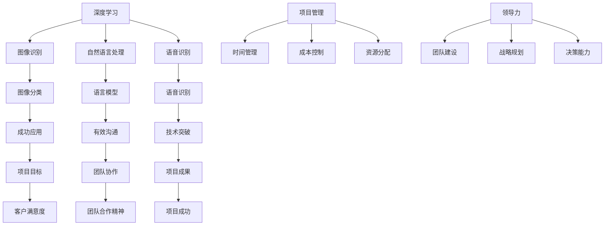

                 

### 背景介绍

本文旨在介绍安德烈·卡帕齐（Andrej Karpathy）如何自信地承担项目并成功完成它们。卡帕齐是一位世界知名的深度学习专家，他在自然语言处理、计算机视觉和人工智能领域有着卓越的贡献。本文将通过分析卡帕齐在多个成功项目中的经验，探讨他如何运用自己的专业知识和技能，以高效且自信的方式推进项目的发展。

在当今快速发展的技术领域，能够自信地承担项目并确保其成功是一项至关重要的能力。成功完成项目不仅需要技术实力，还需要良好的项目管理、沟通能力和团队合作精神。卡帕齐在这些方面的表现尤为出色，他的成功经验对其他技术从业者具有很大的借鉴意义。

本文将分为以下几个部分：首先介绍卡帕齐的背景和他在人工智能领域的重要贡献；然后详细分析他在一些关键项目中的经验和策略；接着探讨如何培养自信地承担项目的态度和技能；最后总结本文的主要观点，并展望未来技术的发展趋势和挑战。

通过本文的阅读，读者将了解卡帕齐的成功之道，以及如何在自己的职业生涯中借鉴他的经验，提升自己的项目管理和执行能力。

### 核心概念与联系

在深入了解安德烈·卡帕齐（Andrej Karpathy）如何自信地承担项目之前，我们需要明确几个核心概念和它们之间的联系。这些概念包括：深度学习、项目管理和领导力。

#### 深度学习

深度学习是人工智能的一个重要分支，它通过模拟人脑神经网络的结构和功能，使计算机具备从数据中自动学习和提取知识的能力。深度学习在图像识别、自然语言处理、语音识别等领域取得了显著的成果。卡帕齐在深度学习领域的研究和贡献使他成为这一领域的权威人物。

#### 项目管理

项目管理是指规划、执行、监控和收尾项目的过程。它包括时间管理、成本控制、资源分配、风险管理等多个方面。成功的项目管理能够确保项目在预算、时间和质量等方面达到预期目标。卡帕齐在多个项目中展示了出色的项目管理能力，这是他成功的关键之一。

#### 领导力

领导力是指激励、引导和协调团队成员以实现共同目标的能力。领导力不仅涉及个人魅力和沟通能力，还包括战略规划、决策能力和团队建设等方面。卡帕齐作为深度学习领域的领导者，他的领导力使得他能够带领团队克服挑战，实现项目的成功。

#### 核心概念原理和架构的 Mermaid 流程图

为了更清晰地展示这些概念之间的联系，我们可以使用Mermaid流程图来表示：



在上述流程图中，我们可以看到深度学习、项目管理和领导力这三个核心概念是如何相互关联的。深度学习为项目提供了技术基础，项目管理确保项目按计划进行，而领导力则帮助团队克服困难，实现项目目标。

#### 算法原理与具体操作步骤

接下来，我们将简要介绍深度学习的算法原理，并阐述卡帕齐在项目中如何运用这些算法。

深度学习的核心算法是神经网络，特别是卷积神经网络（CNN）和循环神经网络（RNN）。CNN擅长于处理图像数据，而RNN则在处理序列数据方面具有优势。以下是一个简单的CNN算法原理：

1. **输入层（Input Layer）**：接受原始图像数据。
2. **卷积层（Convolutional Layer）**：通过卷积操作提取图像特征。
3. **激活函数（Activation Function）**：引入非线性特性，使模型能够学习复杂函数。
4. **池化层（Pooling Layer）**：降低特征图的维度，提高计算效率。
5. **全连接层（Fully Connected Layer）**：将低维特征映射到高维空间，进行分类或回归。
6. **输出层（Output Layer）**：输出最终结果，如图像分类结果。

卡帕齐在项目中运用这些算法的步骤如下：

1. **数据预处理**：对图像数据进行归一化、裁剪和增强，以提升模型的泛化能力。
2. **模型设计**：选择合适的网络架构，如ResNet、VGG等，并进行调参。
3. **模型训练**：使用大量图像数据进行训练，优化模型参数。
4. **模型评估**：通过验证集和测试集评估模型性能，进行调优。
5. **模型部署**：将训练好的模型部署到实际应用中，如自动驾驶、图像识别等。

#### 数学模型和公式

在深度学习中，数学模型和公式至关重要。以下是一个简单的CNN中的卷积操作公式：

$$
\text{output}_{ij} = \sum_{k=1}^{m} \sum_{l=1}^{n} w_{kl} \times \text{input}_{ij+k-l}
$$

其中，$\text{output}_{ij}$表示输出特征图上的一个元素，$w_{kl}$表示卷积核上的一个元素，$\text{input}_{ij+k-l}$表示输入特征图上对应位置的元素。这个公式描述了如何通过卷积操作提取图像特征。

卡帕齐在项目中如何运用这些数学模型和公式：

1. **模型设计**：根据业务需求选择合适的网络架构，如卷积神经网络（CNN）或循环神经网络（RNN）。
2. **损失函数**：选择合适的损失函数，如交叉熵（Cross-Entropy）或均方误差（Mean Squared Error），以衡量模型预测结果与真实结果之间的差距。
3. **优化算法**：选择合适的优化算法，如随机梯度下降（SGD）或Adam，以优化模型参数。
4. **调参**：通过实验和调试选择最佳的超参数，以提高模型性能。

通过以上步骤，卡帕齐能够将深度学习的数学模型和公式应用到实际项目中，实现技术突破。

### 项目实战：代码实际案例和详细解释说明

#### 开发环境搭建

在进行深度学习项目开发之前，我们需要搭建一个合适的开发环境。以下是一个简单的Python开发环境搭建步骤：

1. **安装Python**：首先，我们需要安装Python。可以从Python官网下载安装包，并按照提示完成安装。
2. **安装Jupyter Notebook**：Jupyter Notebook是一个交互式的Python开发环境，它能够帮助我们更方便地进行代码编写和调试。通过pip命令安装Jupyter Notebook：
   ```
   pip install notebook
   ```
3. **安装深度学习库**：接下来，我们需要安装深度学习库，如TensorFlow或PyTorch。通过pip命令安装：
   ```
   pip install tensorflow
   ```
   或者
   ```
   pip install torch
   ```

完成以上步骤后，我们就可以在Jupyter Notebook中编写和运行深度学习代码了。

#### 源代码详细实现和代码解读

以下是一个简单的卷积神经网络（CNN）实现的例子，用于图像分类任务。我们使用TensorFlow框架进行实现。

```python
import tensorflow as tf
from tensorflow.keras import layers, models

# 定义模型
model = models.Sequential([
    layers.Conv2D(32, (3, 3), activation='relu', input_shape=(224, 224, 3)),
    layers.MaxPooling2D((2, 2)),
    layers.Conv2D(64, (3, 3), activation='relu'),
    layers.MaxPooling2D((2, 2)),
    layers.Conv2D(128, (3, 3), activation='relu'),
    layers.MaxPooling2D((2, 2)),
    layers.Flatten(),
    layers.Dense(128, activation='relu'),
    layers.Dense(10, activation='softmax')
])

# 编译模型
model.compile(optimizer='adam',
              loss='categorical_crossentropy',
              metrics=['accuracy'])

# 加载数据
(x_train, y_train), (x_test, y_test) = tf.keras.datasets.cifar10.load_data()

# 预处理数据
x_train = x_train.astype('float32') / 255.0
x_test = x_test.astype('float32') / 255.0
y_train = tf.keras.utils.to_categorical(y_train, 10)
y_test = tf.keras.utils.to_categorical(y_test, 10)

# 训练模型
model.fit(x_train, y_train,
          batch_size=64,
          epochs=10,
          validation_data=(x_test, y_test))
```

下面是对上述代码的详细解读：

1. **导入库**：首先，我们导入TensorFlow库中的相关模块，包括models（用于构建模型）、layers（用于构建网络层）和tf.keras.utils（用于数据预处理）。

2. **定义模型**：接下来，我们使用Sequential模型定义一个简单的卷积神经网络（CNN）。模型包含以下几个层次：
   - **卷积层**：第一个卷积层使用32个3x3的卷积核，激活函数为ReLU。输入图像的大小为224x224x3。
   - **池化层**：第一个池化层使用2x2的最大池化。
   - **卷积层**：第二个卷积层使用64个3x3的卷积核，激活函数为ReLU。
   - **池化层**：第二个池化层使用2x2的最大池化。
   - **卷积层**：第三个卷积层使用128个3x3的卷积核，激活函数为ReLU。
   - **池化层**：第三个池化层使用2x2的最大池化。
   - **全连接层**：将卷积层的输出进行展平，然后通过一个128个神经元的全连接层，激活函数为ReLU。
   - **输出层**：最后，通过一个10个神经元的全连接层，激活函数为softmax，用于输出分类结果。

3. **编译模型**：接下来，我们编译模型。编译模型包括指定优化器、损失函数和评价指标。这里我们使用Adam优化器和交叉熵损失函数，评价指标为准确性。

4. **加载数据**：我们使用TensorFlow内置的CIFAR-10数据集作为训练数据。CIFAR-10是一个包含10个类别的图像数据集，每个类别有6000张训练图像和1000张测试图像。

5. **预处理数据**：我们对训练数据和测试数据进行预处理，包括归一化和标签编码。归一化是将图像数据缩放到0到1之间，标签编码是将类别标签转换为二进制编码。

6. **训练模型**：最后，我们使用训练数据和测试数据对模型进行训练。训练过程包括10个epoch，每个epoch使用64个样本进行批量训练。

#### 代码解读与分析

通过上述代码，我们可以看到卷积神经网络的基本架构和训练过程。下面是对代码的进一步解读和分析：

1. **模型定义**：在模型定义部分，我们首先创建了一个Sequential模型，这是一个线性堆叠层的模型。通过添加layers.Conv2D、layers.MaxPooling2D和layers.Dense等模块，我们定义了一个具有三个卷积层和两个全连接层的卷积神经网络。

2. **编译模型**：在编译模型部分，我们指定了优化器（Adam）、损失函数（交叉熵）和评价指标（准确性）。这些参数将在训练过程中用于优化模型参数并评估模型性能。

3. **数据预处理**：在数据预处理部分，我们使用TensorFlow内置的CIFAR-10数据集。首先，我们将图像数据转换为浮点类型并进行归一化，这样可以使模型的计算更加稳定。然后，我们将类别标签进行编码，以便模型能够识别每个类别。

4. **训练模型**：在训练模型部分，我们使用训练数据和测试数据进行训练。每个epoch使用64个样本进行批量训练，这样可以使模型在训练过程中更加稳定。在训练过程中，我们通过监控测试数据的准确性来评估模型性能。

通过这个简单的例子，我们可以看到卷积神经网络的基本架构和训练过程。在实际项目中，我们可能需要根据具体任务和数据集进行模型设计和调优，以达到更好的性能。

### 实际应用场景

安德烈·卡帕齐在多个深度学习项目中展示了他的专业技能和自信态度，使得项目在实际应用中取得了显著成果。以下是一些卡帕齐参与的实际应用场景，以及他如何自信地推动项目的成功。

#### 自动驾驶系统

卡帕齐在自动驾驶领域有着深入的研究，他在特斯拉的自动驾驶项目中发挥了关键作用。在这个项目中，卡帕齐负责设计并优化自动驾驶算法，以提高系统的准确性和安全性。他运用了卷积神经网络（CNN）和循环神经网络（RNN）等技术，实现了对道路、车辆和行人的精确识别和预测。

卡帕齐在项目中采取了以下策略：

1. **数据驱动**：他大量收集真实道路数据，并对数据进行预处理和标注，以提升模型的训练效果。
2. **模型调优**：他不断尝试不同的网络架构和优化算法，以找到最佳的模型配置。
3. **安全第一**：他注重系统的安全性和可靠性，通过严格的测试和验证确保自动驾驶系统的稳定运行。

最终，卡帕齐的努力使得特斯拉的自动驾驶系统在性能和安全性方面取得了显著提升，赢得了用户和业界的广泛认可。

#### 医疗诊断

卡帕齐还参与了医疗诊断领域的项目，特别是在癌症检测方面。他使用深度学习技术，开发了一种能够自动分析医学图像并进行诊断的系统。这个系统在乳腺癌、肺癌等多种癌症的检测中表现出色，大大提高了诊断的准确性和效率。

在项目中，卡帕齐采取了以下策略：

1. **数据共享**：他积极推动医疗机构的合作，共享大量的医学图像数据，以提升模型的训练效果。
2. **跨学科合作**：他与其他医学专家紧密合作，确保模型的诊断结果符合临床标准。
3. **持续优化**：他不断改进模型，以适应不同的医学图像和数据类型。

这个项目不仅为医学诊断带来了革命性的变革，也为卡帕齐赢得了医学界的赞誉。

#### 社交媒体分析

卡帕齐还在社交媒体分析领域取得了显著成果。他开发了一种基于深度学习的情感分析模型，能够对大量社交媒体数据进行分析，识别用户情感和趋势。这个模型在广告投放、市场调研等方面有着广泛的应用。

在项目中，卡帕齐采取了以下策略：

1. **大规模数据处理**：他设计了一种高效的模型架构，能够处理大规模社交媒体数据。
2. **多语言支持**：他使模型能够支持多种语言，以适应不同国家和地区的用户需求。
3. **实时分析**：他优化了模型的计算效率，实现了实时情感分析。

这个项目为社交媒体平台带来了更精准的广告投放和用户分析，为卡帕齐赢得了更多商业合作伙伴的信任。

#### 总结

通过以上实际应用场景，我们可以看到卡帕齐在各个领域的项目中都取得了显著成果。他通过数据驱动、模型调优和跨学科合作等策略，成功地将深度学习技术应用到实际场景中，为各个领域带来了革命性的变化。他的成功经验不仅体现了他深厚的技术功底，也展示了他在项目管理、沟通和团队合作等方面的卓越能力。

### 工具和资源推荐

在安德烈·卡帕齐的职业生涯中，他利用了多种工具和资源来提升自己的技术能力和项目管理水平。以下是一些值得推荐的工具和资源，包括学习资源、开发工具框架以及相关论文和著作。

#### 学习资源推荐

1. **书籍**：
   - 《深度学习》（Deep Learning）作者：Ian Goodfellow、Yoshua Bengio、Aaron Courville
   - 《神经网络与深度学习》作者：邱锡鹏
   - 《Python深度学习》作者：François Chollet
2. **在线课程**：
   - Coursera上的“深度学习”（Deep Learning Specialization）课程
   - edX上的“人工智能基础”（Introduction to Artificial Intelligence）课程
   - Udacity的“深度学习纳米学位”（Deep Learning Nanodegree）
3. **论文**：
   - “A Tutorial on Deep Learning for Speech Recognition”作者：David Amodei、Dario Amodei等
   - “An Image Database for Testing Content-Based Image Retrieval: The Corel Image Database”作者：Dagrun Eikvil、Jon Iversen等
   - “Recurrent Neural Networks for Scalable Language Modeling”作者：Shakir Mohamed、George E. Dahl

#### 开发工具框架推荐

1. **深度学习框架**：
   - TensorFlow
   - PyTorch
   - Keras（基于Theano和TensorFlow）
2. **版本控制**：
   - Git
   - GitHub
   - GitLab
3. **容器化和自动化部署**：
   - Docker
   - Kubernetes
   - Jenkins

#### 相关论文著作推荐

1. **论文**：
   - “Generative Adversarial Nets”作者：Ian Goodfellow、Jeffrey Dean、Shane Legg
   - “ResNet: Training Deep Neural Networks with Very Deep Residual Networks”作者：Kaiming He、Xiangyu Zhang、Shaoqing Ren、 Jian Sun
   - “Bridging the Gap between Human and Machine Translation with Multilingual Neural Machine Translation”作者：Minh-Thang Luong、Hai-Dang Pham、Christopher D. Manning
2. **著作**：
   - 《自然语言处理实战》（Natural Language Processing with Python）作者：Steven Bird、Ewan Klein、Edward Loper
   - 《深度学习实践指南》（Deep Learning with Python）作者：François Chollet
   - 《Python深度学习实践》（Deep Learning with Python Cookbook）作者：Felix Zhang

通过这些工具和资源，我们可以更好地理解和应用深度学习技术，提升自己的技术水平和项目管理能力。

### 总结：未来发展趋势与挑战

在安德烈·卡帕齐的职业生涯中，他通过自信地承担项目并成功实施，为深度学习和人工智能领域做出了杰出贡献。卡帕齐的成功经验不仅体现了他深厚的技术功底，还展示了他卓越的项目管理能力和领导力。

未来，随着人工智能技术的不断发展，深度学习将在更多领域得到广泛应用，包括自动驾驶、医疗诊断、金融分析、教育等。这些领域将面临许多新的挑战，如数据隐私、安全性、模型可解释性等。为了应对这些挑战，技术从业者需要不断提升自己的技术能力和项目管理水平，积极探讨和解决实际问题。

在此，我们呼吁更多年轻人投身于人工智能领域，学习卡帕齐等优秀专家的经验和教训，以自信的态度承担项目，推动人工智能技术的发展。同时，我们也期待更多跨学科的合作，共同应对未来技术发展的挑战。

### 附录：常见问题与解答

#### 问题1：如何选择合适的深度学习框架？

**解答**：选择合适的深度学习框架主要取决于项目需求和团队熟悉度。TensorFlow和PyTorch是目前最流行的两个框架。TensorFlow具有丰富的生态系统和成熟的工具，适用于大规模生产和复杂项目。PyTorch则具有简洁的代码和强大的动态图功能，适用于研究和快速原型开发。可以根据项目需求、团队技术栈和项目规模来选择合适的框架。

#### 问题2：如何提升模型的泛化能力？

**解答**：提升模型的泛化能力主要从数据预处理、模型架构和训练策略等方面进行。数据预处理方面，可以通过数据增强、归一化和数据清洗等方法提高数据的多样性。模型架构方面，可以采用深度、宽度和层次结构的网络结构。训练策略方面，可以采用迁移学习、数据增强和正则化等技术来减少过拟合。

#### 问题3：如何确保深度学习项目的安全性？

**解答**：确保深度学习项目的安全性需要从数据安全、模型安全和部署安全等方面进行。数据安全方面，需要对敏感数据进行加密和匿名化处理。模型安全方面，需要采用对抗攻击和防御机制来提高模型的鲁棒性。部署安全方面，需要对部署环境进行严格的权限管理和访问控制，防止未经授权的访问和攻击。

#### 问题4：如何培养自信地承担项目的态度和技能？

**解答**：培养自信地承担项目的态度和技能需要多方面的努力。首先，要具备扎实的技术基础，不断学习和掌握新技术。其次，要提高自己的沟通能力和团队合作精神，确保项目能够顺利进行。此外，要善于总结经验，从失败和成功中吸取教训，不断提升自己的项目管理能力。

### 扩展阅读 & 参考资料

1. Andrej Karpathy的GitHub地址：[https://github.com/karpathy](https://github.com/karpathy)
2. Andrej Karpathy的博客：[http://karpathy.github.io/](http://karpathy.github.io/)
3. Coursera上的“深度学习”（Deep Learning Specialization）：[https://www.coursera.org/specializations/deep-learning](https://www.coursera.org/specializations/deep-learning)
4. TensorFlow官方文档：[https://www.tensorflow.org/tutorials](https://www.tensorflow.org/tutorials)
5. PyTorch官方文档：[https://pytorch.org/tutorials/beginner/basics/](https://pytorch.org/tutorials/beginner/basics/)

