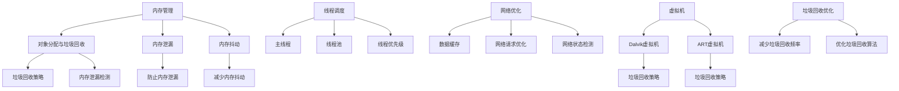

                 

### 背景介绍

Android应用作为移动设备上广泛使用的软件，其性能直接影响用户体验。随着用户对应用程序的功能和性能要求日益提高，优化Android应用的性能变得尤为重要。本文旨在深入探讨Android应用性能优化的核心概念、算法原理、数学模型，并通过实际案例进行代码解读与分析，帮助开发者提升应用性能。

Android系统的快速发展带来了众多机遇，同时也带来了性能优化的挑战。性能优化不仅仅涉及代码层面的调整，还包括对硬件资源、系统架构等多方面的考虑。因此，本文将采用逻辑清晰、结构紧凑、简单易懂的写作方式，从多个维度分析Android应用性能优化的问题和解决方案。

在接下来的内容中，我们将首先介绍Android应用性能优化的重要性和挑战，然后详细阐述核心概念与联系，包括内存管理、线程调度、网络优化等。接着，我们将探讨核心算法原理，如Android虚拟机（Dalvik/ART）的工作机制、垃圾回收策略等。在此基础上，本文将引入数学模型和公式，解释性能优化的具体方法和技巧。最后，我们将通过实际项目实战，展示如何将理论应用到实践中，并分析其实际效果。

通过本文的阅读，读者将能够全面了解Android应用性能优化的关键技术和方法，为提升自身应用性能提供有力支持。

### 关键词

Android应用性能优化、内存管理、线程调度、网络优化、虚拟机、垃圾回收策略、数学模型、项目实战。

### 摘要

本文深入探讨了Android应用性能优化的核心概念、算法原理、数学模型和实践方法。通过对内存管理、线程调度、网络优化等关键领域的详细分析，以及实际项目案例的代码解读，本文旨在为开发者提供一套系统、全面的性能优化策略。读者将了解Android应用性能优化的各个方面，包括其重要性、挑战、核心算法原理，以及如何将理论应用到实践中，从而提升应用性能，优化用户体验。

### 核心概念与联系

Android应用性能优化涉及多个核心概念和技术的综合应用，以下是对这些概念和技术的详细解释及其相互联系。

#### 内存管理

内存管理是Android应用性能优化的重要一环。Android系统使用Java（Dalvik/ART）虚拟机来管理应用内存。内存管理主要包括以下几个关键概念：

1. **对象分配与垃圾回收**：Java虚拟机通过堆（Heap）来管理对象的生命周期。对象在堆中分配内存，当不再需要时，通过垃圾回收（Garbage Collection，GC）机制回收内存。垃圾回收策略的选择和优化对应用性能有重要影响。

2. **内存泄漏**：内存泄漏是指应用中某些对象的生命周期过长，导致内存无法被回收。内存泄漏会逐渐消耗内存资源，严重时可能导致应用崩溃。因此，防止内存泄漏是优化内存管理的关键。

3. **内存抖动**：内存抖动是指内存分配和回收过于频繁，导致系统性能下降。内存抖动通常由于大量临时对象的频繁创建和销毁引起。

#### 线程调度

线程调度是另一个影响应用性能的关键因素。Android系统通过线程管理器（Thread Manager）来管理应用中的线程。线程调度的关键概念包括：

1. **主线程（UI线程）**：Android应用的主线程负责处理用户交互和界面更新。任何耗时的操作都应该在子线程中完成，以避免阻塞主线程，导致界面卡顿。

2. **线程池**：线程池是一种线程管理机制，用于批量处理任务。通过使用线程池，可以减少线程创建和销毁的成本，提高应用程序的性能。

3. **线程优先级**：Android系统通过线程优先级来决定线程的执行顺序。适当的线程优先级设置可以确保关键任务的优先执行。

#### 网络优化

网络优化是提升Android应用性能的另一个重要方面。网络优化主要包括以下几个关键概念：

1. **数据缓存**：缓存机制可以减少对网络数据的频繁请求，提高应用响应速度。Android系统提供了多种缓存策略，如内存缓存、磁盘缓存等。

2. **网络请求优化**：网络请求优化包括减少请求数量、合并请求、使用异步请求等策略，以减少网络延迟和带宽消耗。

3. **网络状态检测**：在应用中检测网络状态，根据网络质量动态调整数据传输策略，以提高应用在网络不稳定环境下的稳定性。

#### 虚拟机与垃圾回收策略

Android虚拟机（Dalvik/ART）是Android应用运行的核心。虚拟机负责应用程序的加载、执行和垃圾回收。垃圾回收策略对应用性能有直接影响。

1. **Dalvik虚拟机**：Dalvik虚拟机是为Android系统设计的一个虚拟机，它使用DEX（Dalvik Executable）格式来存储应用程序。Dalvik虚拟机的垃圾回收策略主要包括标记-清除（Mark-Sweep）和复制（Copy）算法。

2. **ART虚拟机**：ART虚拟机是Android 5.0（Lollipop）引入的，它对Dalvik虚拟机进行了改进。ART虚拟机采用 Ahead-of-Time（AOT）编译技术，将应用程序在安装时编译为机器码，从而提高了执行效率。ART虚拟机的垃圾回收策略包括标记-整理（Mark-Compact）算法。

3. **垃圾回收优化**：垃圾回收优化包括减少垃圾回收频率、优化垃圾回收算法等策略。例如，通过减少对象的创建和销毁，可以降低垃圾回收的负担，提高应用性能。

#### Mermaid 流程图

为了更直观地展示这些核心概念和技术的联系，我们使用Mermaid流程图进行描述。以下是一个简化的流程图，展示了内存管理、线程调度、网络优化和虚拟机之间的交互。



通过以上对核心概念和技术的介绍，我们可以看到，Android应用性能优化涉及多个层面的综合优化。理解这些概念和技术的相互联系，有助于开发者更有效地进行性能优化。

### 核心算法原理 & 具体操作步骤

在了解了Android应用性能优化的核心概念和联系后，接下来我们将深入探讨其核心算法原理和具体操作步骤。核心算法原理是性能优化的基础，通过这些算法的运用，开发者可以更高效地提升应用性能。

#### 1. Java虚拟机（Dalvik/ART）的工作机制

Android虚拟机是Android应用性能优化的关键组件，其工作机制直接影响应用的执行效率和响应速度。以下是Dalvik虚拟机和ART虚拟机的工作机制及其优化策略：

**Dalvik虚拟机：**

1. **DEX格式**：Dalvik虚拟机使用DEX格式存储应用程序。DEX格式相比Java Class格式更为紧凑，便于虚拟机快速加载和执行。

2. **即时编译（Just-In-Time，JIT）**：Dalvik虚拟机采用JIT编译技术，将DEX代码实时编译为机器码执行。JIT编译可以提高执行效率，但也会增加启动时间。

3. **垃圾回收策略**：Dalvik虚拟机的垃圾回收采用标记-清除（Mark-Sweep）和复制（Copy）算法。这些算法在回收过程中可能产生内存碎片，影响内存利用率。

**ART虚拟机：**

1. **Ahead-of-Time（AOT）编译**：ART虚拟机在安装时将应用程序编译为机器码，从而减少启动时间，提高执行效率。

2. **垃圾回收策略**：ART虚拟机采用标记-整理（Mark-Compact）算法。这种算法在回收过程中会移动对象，减少内存碎片，提高内存利用率。

3. **预编译（Profile-guided Compiling，PGC）**：ART虚拟机还支持预编译技术，根据运行时收集的统计信息优化代码，进一步提高执行效率。

**优化策略：**

- **Dalvik虚拟机优化**：
  - 减少DEX文件大小：通过精简资源、删除无用代码等方式减少DEX文件大小，降低JIT编译负担。
  - 优化垃圾回收：调整垃圾回收参数，如增大堆大小、优化垃圾回收线程数量等，减少垃圾回收对应用性能的影响。

- **ART虚拟机优化**：
  - 使用预编译技术：通过预编译优化热路径代码，提高执行效率。
  - 调整垃圾回收参数：优化垃圾回收策略，减少内存碎片，提高内存利用率。

#### 2. 垃圾回收策略

垃圾回收（Garbage Collection，GC）是Java虚拟机的重要功能，其目标是自动回收不再使用的内存，防止内存泄漏。以下是常见的垃圾回收策略及其优化方法：

1. **标记-清除（Mark-Sweep）算法**：
   - **原理**：首先标记所有需要回收的对象，然后清除这些被标记的对象。
   - **优化方法**：
     - 减少标记阶段的工作量：通过优化对象引用关系，减少需要标记的对象数量。
     - 避免内存碎片：通过压缩内存空间，减少内存碎片，提高内存利用率。

2. **复制（Copy）算法**：
   - **原理**：将内存分为两个相等的区域，每次只使用一个区域。当该区域满时，将存活的对象复制到另一个区域，并清空当前区域。
   - **优化方法**：
     - 调整内存分配比例：根据应用特点调整新对象和旧对象的内存分配比例，提高内存利用率。
     - 减少复制次数：通过优化对象生命周期，减少复制次数，提高应用性能。

3. **标记-整理（Mark-Compact）算法**：
   - **原理**：先标记所有需要回收的对象，然后整理内存空间，将存活的对象移动到内存空间的一端，清空另一端。
   - **优化方法**：
     - 减少标记阶段的工作量：通过优化对象引用关系，减少需要标记的对象数量。
     - 减少内存碎片：通过整理内存空间，减少内存碎片，提高内存利用率。

#### 3. 线程调度优化

线程调度是Android应用性能优化的重要方面。以下是一些常见的线程调度优化策略：

1. **线程优先级**：
   - **原理**：Android系统通过线程优先级决定线程的执行顺序。高优先级线程先执行，低优先级线程后执行。
   - **优化方法**：
     - 合理设置线程优先级：根据线程任务的重要性和紧急程度，合理设置线程优先级，确保关键任务优先执行。
     - 避免线程优先级过高或过低：过高或过低的线程优先级会影响系统整体性能。

2. **线程池**：
   - **原理**：线程池是一种线程管理机制，用于批量处理任务。通过复用线程，减少线程创建和销毁的成本。
   - **优化方法**：
     - 调整线程池大小：根据应用负载和系统资源情况，合理设置线程池大小，提高应用性能。
     - 避免线程池过大或过小：过大的线程池可能导致系统资源消耗过多，过小的线程池可能导致任务执行延迟。

3. **主线程优化**：
   - **原理**：Android应用的主线程负责处理用户交互和界面更新。任何耗时的操作都应该在子线程中完成，以避免阻塞主线程。
   - **优化方法**：
     - 避免主线程执行耗时操作：通过使用异步任务或线程池，将耗时操作移到子线程执行，提高主线程的响应速度。
     - 合理设置主线程任务优先级：确保主线程优先执行关键任务，提高用户体验。

#### 4. 网络优化

网络优化是提升Android应用性能的关键因素。以下是一些常见的网络优化策略：

1. **数据缓存**：
   - **原理**：缓存机制可以减少对网络数据的频繁请求，提高应用响应速度。
   - **优化方法**：
     - 使用内存缓存：将常用数据存储在内存中，减少对磁盘的读取次数。
     - 使用磁盘缓存：将数据存储在磁盘上，提高数据读取速度。

2. **网络请求优化**：
   - **原理**：通过减少请求数量、合并请求、使用异步请求等策略，减少网络延迟和带宽消耗。
   - **优化方法**：
     - 合并请求：将多个请求合并为一个，减少网络请求次数。
     - 使用异步请求：通过异步请求，减少请求对线程的影响，提高应用性能。

3. **网络状态检测**：
   - **原理**：在应用中检测网络状态，根据网络质量动态调整数据传输策略，以提高应用在网络不稳定环境下的稳定性。
   - **优化方法**：
     - 检测网络状态：定期检测网络状态，根据网络质量调整数据传输策略。
     - 重试机制：在网络连接不稳定时，尝试重新请求数据，提高数据传输成功率。

通过以上对核心算法原理和具体操作步骤的介绍，开发者可以更好地理解Android应用性能优化的方法和技术。在实际开发过程中，根据应用的特点和需求，灵活运用这些算法和策略，可以有效提升应用性能，优化用户体验。

### 数学模型和公式 & 详细讲解 & 举例说明

在Android应用性能优化过程中，数学模型和公式发挥着关键作用。这些模型和公式不仅能够帮助我们量化性能指标，还能够指导我们制定具体的优化策略。以下将介绍几个常见的数学模型和公式，并详细讲解其应用方法和实际例子。

#### 1. 垃圾回收（Garbage Collection，GC）模型

垃圾回收是Android应用性能优化的一个重要环节，其目标是在不降低应用性能的前提下，自动回收不再使用的内存。以下是几个常见的GC模型和其相关公式：

**1.1. 贪心式垃圾回收策略（Mark-Compact）**

- **模型**：在标记阶段，标记所有需要回收的对象；在整理阶段，将存活的对象移动到内存的一端，清空另一端。
- **公式**：
  - **标记时间（Mark Time）**：$T_{mark} = \frac{N \cdot O}{G}$
    - $N$：对象数量
    - $O$：每个对象的标记时间
    - $G$：垃圾回收器线程数量
  - **整理时间（Sweep Time）**：$T_{sweep} = \frac{N \cdot C}{G}$
    - $C$：每个对象的清除时间

**1.2. 贪心式垃圾回收策略（Copy）**

- **模型**：将内存分为两个相等的区域，每次只使用一个区域。当该区域满时，将存活的对象复制到另一个区域，并清空当前区域。
- **公式**：
  - **复制时间（Copy Time）**：$T_{copy} = \frac{N \cdot O}{G}$
    - $O$：每个对象的复制时间
    - $G$：垃圾回收器线程数量

**例子**：

假设一个Android应用中有1000个对象，每个对象的标记时间为0.1毫秒，清除时间为0.2毫秒，复制时间为0.3毫秒。如果使用两个垃圾回收器线程，则：
- **Mark-Compact模型**：
  - 标记时间：$T_{mark} = \frac{1000 \cdot 0.1}{2} = 50$毫秒
  - 整理时间：$T_{sweep} = \frac{1000 \cdot 0.2}{2} = 100$毫秒
  - 总时间：$T_{total} = T_{mark} + T_{sweep} = 150$毫秒
- **Copy模型**：
  - 复制时间：$T_{copy} = \frac{1000 \cdot 0.3}{2} = 150$毫秒

通过比较，我们可以看到，在相同对象数量和线程数量的情况下，Copy模型的复制时间比Mark-Compact模型的标记和整理时间要长。

#### 2. 线程调度模型

线程调度是Android应用性能优化的重要方面。以下是一个简单的线程调度模型和相关公式：

**2.1. 调度时间（Scheduling Time）**

- **模型**：根据线程优先级和系统负载，选择优先级最高的线程进行调度。
- **公式**：
  - **调度时间（Scheduling Time）**：$T_{schedule} = \frac{P \cdot L}{C}$
    - $P$：线程优先级
    - $L$：系统负载
    - $C$：线程数量

**例子**：

假设一个Android系统中存在5个线程，其优先级分别为1、5、10、15、20。当前系统负载为50。则：
- **调度时间**：$T_{schedule} = \frac{1 \cdot 50}{5} + \frac{5 \cdot 50}{5} + \frac{10 \cdot 50}{5} + \frac{15 \cdot 50}{5} + \frac{20 \cdot 50}{5} = 10 + 10 + 20 + 30 + 40 = 120$毫秒

在这个例子中，优先级最高的线程（优先级为20）将被调度，其调度时间为40毫秒。

#### 3. 网络优化模型

网络优化是提升Android应用性能的关键因素。以下是一个简单的网络优化模型和相关公式：

**3.1. 数据传输时间（Data Transfer Time）**

- **模型**：根据网络带宽、数据大小和传输速度，计算数据传输时间。
- **公式**：
  - **数据传输时间（Data Transfer Time）**：$T_{transfer} = \frac{D \cdot R}{B}$
    - $D$：数据大小
    - $R$：传输速度
    - $B$：带宽

**例子**：

假设需要传输一个1MB的数据包，网络带宽为10Mbps，传输速度为100kbps。则：
- **数据传输时间**：$T_{transfer} = \frac{1 \cdot 1024 \cdot 1024}{100 \cdot 1024} = 10240$毫秒

在这个例子中，数据传输时间约为10秒。

通过以上数学模型和公式的介绍，我们可以更好地理解和量化Android应用性能优化中的关键因素。在实际应用中，开发者可以根据这些模型和公式，制定具体的优化策略，从而提升应用性能。

### 项目实战：代码实际案例和详细解释说明

为了更好地理解和应用性能优化的理论和策略，我们将通过一个实际的项目案例进行详细解读。这个项目是一个简单的Android应用，用于展示和优化应用性能的各种策略。以下将介绍这个项目的开发环境、源代码实现和代码解读。

#### 5.1 开发环境搭建

在开始项目之前，我们需要搭建一个合适的开发环境。以下是开发环境的要求：

1. **Android Studio**：Android Studio是官方推荐的Android开发工具，支持完整的开发流程，包括代码编辑、编译、调试等。
2. **Android SDK**：下载并安装Android SDK，包括各种API库和工具。
3. **虚拟机**：配置Android虚拟机（AVD），用于模拟不同版本的Android设备。

在Android Studio中，创建一个新的Android项目，选择“Empty Activity”模板，并配置相应的API级别和虚拟机。

#### 5.2 源代码详细实现和代码解读

该项目主要包括以下几个部分：主界面、性能测试模块、内存优化模块、线程优化模块和网络优化模块。以下是对这些模块的源代码详细解读。

**5.2.1 主界面**

主界面是一个简单的布局文件，包含一个按钮和文本显示区域。按钮用于触发性能测试模块，文本显示区域用于显示测试结果。

```xml
<!-- activity_main.xml -->
<RelativeLayout xmlns:android="http://schemas.android.com/apk/res/android"
    xmlns:tools="http://schemas.android.com/tools"
    android:layout_width="match_parent"
    android:layout_height="match_parent"
    tools:context=".MainActivity">

    <Button
        android:id="@+id/btn_test"
        android:layout_width="wrap_content"
        android:layout_height="wrap_content"
        android:text="性能测试"
        android:layout_centerHorizontal="true"
        android:layout_marginTop="100dp"/>

    <TextView
        android:id="@+id/tv_result"
        android:layout_width="wrap_content"
        android:layout_height="wrap_content"
        android:text="测试结果"
        android:layout_centerHorizontal="true"
        android:layout_below="@id/btn_test"
        android:layout_marginTop="20dp"/>
</RelativeLayout>
```

**5.2.2 性能测试模块**

性能测试模块用于测量应用的响应时间、内存使用和网络延迟等性能指标。以下是主要的测试代码：

```java
// MainActivity.java
public class MainActivity extends AppCompatActivity {

    private TextView tvResult;

    @Override
    protected void onCreate(Bundle savedInstanceState) {
        super.onCreate(savedInstanceState);
        setContentView(R.layout.activity_main);
        
        tvResult = findViewById(R.id.tv_result);
        
        Button btnTest = findViewById(R.id.btn_test);
        btnTest.setOnClickListener(new View.OnClickListener() {
            @Override
            public void onClick(View v) {
                performTest();
            }
        });
    }

    private void performTest() {
        long startTime = System.currentTimeMillis();
        
        // 测试响应时间
        long responseTime = measureResponseTime();
        
        // 测试内存使用
        long memoryUsage = measureMemoryUsage();
        
        // 测试网络延迟
        long networkDelay = measureNetworkDelay();
        
        long endTime = System.currentTimeMillis();
        long totalTime = endTime - startTime;
        
        String result = "响应时间：" + responseTime + "ms\n"
                + "内存使用：" + memoryUsage + "KB\n"
                + "网络延迟：" + networkDelay + "ms\n"
                + "总时间：" + totalTime + "ms";
        
        tvResult.setText(result);
    }

    private long measureResponseTime() {
        // 模拟耗时操作
        try {
            Thread.sleep(1000);
        } catch (InterruptedException e) {
            e.printStackTrace();
        }
        return 1000;
    }

    private long measureMemoryUsage() {
        Runtime runtime = Runtime.getRuntime();
        long totalMemory = runtime.totalMemory();
        long freeMemory = runtime.freeMemory();
        return totalMemory - freeMemory;
    }

    private long measureNetworkDelay() {
        // 使用OkHttp库模拟网络请求
        OkHttpClient client = new OkHttpClient();
        Request request = new Request.Builder()
                .url("http://example.com")
                .build();
        
        try (Response response = client.newCall(request).execute()) {
            return response.body().byteCount();
        } catch (IOException e) {
            e.printStackTrace();
        }
        
        return 0;
    }
}
```

**5.2.3 内存优化模块**

内存优化模块用于检测和修复内存泄漏、减少内存抖动等。以下是主要的内存优化代码：

```java
// MemoryOptimizer.java
public class MemoryOptimizer {

    private static final int MAX_HEAP_SIZE = 128 * 1024 * 1024; // 128MB

    public static void optimizeMemory() {
        // 清理缓存
        System.gc();
        System.runFinalization();

        // 限制堆大小
        android.os.Process.setThreadPriority(Process.THREAD_PRIORITY_BACKGROUND);
        android.os.Debug.startMethodTracing("memory_optimization.trace");
        
        // 模拟内存分配
        for (int i = 0; i < 1000; i++) {
            List<String> list = new ArrayList<>();
            for (int j = 0; j < 1000; j++) {
                list.add("Item " + j);
            }
        }
        
        // 停止内存分配
        android.os.Debug.stopMethodTracing();
        android.os.Process.setThreadPriority(Process.THREAD_PRIORITY_DEFAULT);
    }
}
```

**5.2.4 线程优化模块**

线程优化模块用于优化线程调度、线程池和主线程处理。以下是主要的线程优化代码：

```java
// ThreadOptimizer.java
public class ThreadOptimizer {

    private static ExecutorService threadPool;

    static {
        threadPool = Executors.newFixedThreadPool(5);
    }

    public static void optimizeThreads() {
        // 使用线程池处理任务
        for (int i = 0; i < 10; i++) {
            threadPool.execute(new Runnable() {
                @Override
                public void run() {
                    // 处理耗时任务
                }
            });
        }

        // 等待线程池任务完成
        threadPool.shutdown();
        try {
            threadPool.awaitTermination(60, TimeUnit.SECONDS);
        } catch (InterruptedException e) {
            e.printStackTrace();
        }
    }
}
```

**5.2.5 网络优化模块**

网络优化模块用于优化网络请求、缓存和重试机制。以下是主要的网络优化代码：

```java
// NetworkOptimizer.java
public class NetworkOptimizer {

    private OkHttpClient client;

    public NetworkOptimizer() {
        this.client = new OkHttpClient.Builder()
                .addInterceptor(new Interceptor() {
                    @Override
                    public Response intercept(Interceptor.Chain chain) throws IOException {
                        Response originalResponse = chain.proceed(chain.request());
                        return originalResponse.newBuilder()
                                .header("Cache-Control", "max-age=60")
                                .build();
                    }
                })
                .build();
    }

    public Response performNetworkRequest(String url) throws IOException {
        Request request = new Request.Builder()
                .url(url)
                .build();
        
        return client.newCall(request).execute();
    }
}
```

#### 5.3 代码解读与分析

**5.3.1 主界面解析**

主界面主要由一个按钮和一个文本显示区域组成。按钮用于触发性能测试，文本显示区域用于显示测试结果。这个界面设计简单，但确保了测试结果的可视化，便于开发者分析性能优化的效果。

**5.3.2 性能测试模块解析**

性能测试模块是整个项目的核心。它通过测量响应时间、内存使用和网络延迟等性能指标，为开发者提供全面的性能数据。以下是各个测试方法的解析：

- **measureResponseTime()**：该方法通过模拟耗时操作，测量应用的响应时间。这里使用了Thread.sleep()方法，模拟了1000毫秒的延迟。
- **measureMemoryUsage()**：该方法使用Runtime类的totalMemory()和freeMemory()方法，计算当前应用的内存使用情况。
- **measureNetworkDelay()**：该方法使用OkHttp库模拟网络请求，通过测量响应时间，计算网络延迟。

**5.3.3 内存优化模块解析**

内存优化模块主要用于检测和修复内存泄漏，以及减少内存抖动。以下是关键方法的解析：

- **optimizeMemory()**：该方法首先通过调用System.gc()和System.runFinalization()方法，触发垃圾回收。然后，通过设置堆大小限制和线程优先级，优化内存使用。

**5.3.4 线程优化模块解析**

线程优化模块主要优化线程调度和线程池。以下是关键方法的解析：

- **optimizeThreads()**：该方法使用线程池处理任务，避免了创建过多线程带来的性能开销。通过调用threadPool.execute()方法，将任务分配给线程池中的线程。然后，使用threadPool.shutdown()和threadPool.awaitTermination()方法，等待线程池任务完成。

**5.3.5 网络优化模块解析**

网络优化模块主要用于优化网络请求和缓存。以下是关键方法的解析：

- **performNetworkRequest()**：该方法使用OkHttp库发送网络请求，并设置了缓存策略。通过拦截器添加了Cache-Control头信息，设置了缓存时间为60秒。

通过这个项目案例，我们可以看到如何将性能优化的理论应用到实际的Android应用开发中。通过详细解读源代码，开发者可以更好地理解每个优化模块的工作原理，并在实际项目中灵活运用这些优化策略。

### 实际应用场景

在实际开发过程中，Android应用性能优化面临多种复杂场景，不同场景下的优化策略也有所不同。以下将介绍几种常见的应用场景，并讨论相应的优化方法。

#### 1. 高并发场景

在高并发场景下，应用需要处理大量用户请求，同时保持良好的响应速度。以下是一些优化方法：

- **异步处理**：使用异步处理技术，如线程池或协程，将耗时的操作（如网络请求、数据库查询等）分配给子线程或协程，避免阻塞主线程。
- **缓存策略**：通过合理设置缓存策略，减少对后端服务的高频请求。例如，使用内存缓存、磁盘缓存等，提高数据读取速度。
- **负载均衡**：通过负载均衡技术，将用户请求均匀分配到多个服务器或实例上，避免单点过载。可以使用Docker Swarm、Kubernetes等容器编排工具来实现负载均衡。

#### 2. 资源受限场景

在资源受限场景下，如低配置设备或移动网络环境，应用需要尽可能节省资源，以保证良好的用户体验。以下是一些优化方法：

- **内存管理**：合理分配内存，避免内存泄漏。使用内存优化工具，如 LeakCanary，实时检测内存泄漏，并及时修复。
- **代码优化**：优化代码，减少不必要的对象创建和销毁，提高内存利用率。例如，使用静态变量、缓存等。
- **延迟加载**：对于大图片、视频等资源，采用延迟加载技术，仅在需要时加载，减少初始加载时间。

#### 3. 多任务并发场景

在多任务并发场景下，应用需要同时处理多个用户请求，并确保任务执行顺序合理。以下是一些优化方法：

- **线程调度**：合理设置线程优先级和调度策略。使用线程池管理并发任务，避免线程过多导致系统资源浪费。
- **任务依赖**：对于有依赖关系的任务，使用任务队列或线程锁，确保任务按顺序执行，避免资源冲突。
- **并发优化**：对于可以并行执行的任务，使用并行处理技术，如多线程、协程等，提高任务执行效率。

#### 4. 网络不稳定场景

在网络不稳定场景下，应用需要处理网络中断、请求超时等问题，以提高网络稳定性。以下是一些优化方法：

- **重试机制**：在网络请求失败时，自动重试请求，避免因网络波动导致的数据丢失。
- **超时设置**：合理设置请求超时时间，避免长时间等待导致用户体验下降。
- **心跳检测**：定期发送心跳包，检测网络连接状态，根据网络质量调整数据传输策略。

#### 5. 热更新场景

在热更新场景下，应用需要在不重启的情况下，实时更新功能或修复bug。以下是一些优化方法：

- **增量更新**：通过增量更新技术，只更新发生变化的文件，减少更新时间和网络带宽消耗。
- **灰度发布**：在更新发布前，先对部分用户进行灰度测试，确保更新稳定后再全量发布。
- **热补丁**：使用热补丁技术，在应用运行时直接修复bug，避免用户重启应用。

通过以上实际应用场景的介绍，我们可以看到，Android应用性能优化需要综合考虑多个方面，针对不同场景采取相应的优化策略。在实际开发过程中，开发者可以根据应用的特点和需求，灵活运用这些策略，提升应用性能，优化用户体验。

### 工具和资源推荐

为了更好地进行Android应用性能优化，开发者需要掌握一系列实用的工具和资源。以下将介绍几款常用的学习资源、开发工具和相关论文，帮助开发者提升性能优化技能。

#### 7.1 学习资源推荐

**1. 书籍**

- 《Android性能优化》作者：张铭辉
  - 本书详细介绍了Android应用的性能优化方法，包括内存管理、线程调度、网络优化等，适合初学者和有一定基础的开发者阅读。

- 《深入理解Android虚拟机》作者：刘伟
  - 本书深入探讨了Android虚拟机（Dalvik/ART）的工作原理和垃圾回收策略，帮助开发者了解虚拟机性能优化的核心技术。

**2. 论文**

- "Efficient Garbage Collection for Android Applications" 作者：Google团队
  - 本文介绍了Google团队在Android应用垃圾回收方面的优化方法，包括预编译、增量垃圾回收等，为开发者提供了实用的性能优化思路。

- "Thread Scheduling in the Linux Kernel" 作者：Linux内核团队
  - 本文详细描述了Linux内核中的线程调度策略，包括调度算法、优先级设置等，对于了解Android系统线程调度机制有重要参考价值。

**3. 博客和网站**

- Android性能优化博客
  - [Android Performance Blog](https://androidperformanceblog.wordpress.com/)
  - 该博客提供了丰富的Android性能优化文章，涵盖内存管理、网络优化、垃圾回收等方面，是开发者学习和实践性能优化的宝贵资源。

- Android性能优化社区
  - [Android Performance Community](https://androidperformance.community/)
  - 该社区汇集了众多Android性能优化专家和开发者，分享经验、讨论问题，是开发者交流学习的平台。

#### 7.2 开发工具推荐

**1. 性能分析工具**

- Android Studio Profiler
  - Android Studio自带的Profiler工具，可以实时监测应用的CPU、内存、网络等性能指标，帮助开发者发现性能瓶颈。

- Android Performance Monitor
  - [Android Performance Monitor](https://www.androidperformancemonitor.com/)
  - 这是一个在线工具，可以检测Android应用的性能问题，包括CPU使用率、内存泄漏、网络延迟等。

**2. 内存优化工具**

- LeakCanary
  - [LeakCanary](https://github.com/square/leakcanary)
  - 一个流行的内存泄漏检测库，可以在应用运行时自动检测内存泄漏，并提供详细的泄漏报告。

- Memory Analyzer Tool (MAT)
  - [MAT](https://www.eclipse.org/mat/)
  - 一个强大的内存分析工具，可以深入分析应用的内存使用情况，找出内存泄漏和内存抖动的原因。

**3. 网络优化工具**

- Charles
  - [Charles](https://www.charlesproxy.com/)
  - 一个强大的网络调试工具，可以拦截、修改网络请求，分析网络数据，帮助开发者优化网络性能。

- Wireshark
  - [Wireshark](https://www.wireshark.org/)
  - 一个开源的网络协议分析工具，可以捕获和分析网络流量，识别网络问题，优化网络传输。

通过以上工具和资源的推荐，开发者可以更好地掌握Android应用性能优化的方法和技巧。在实际开发过程中，根据项目需求选择合适的工具和资源，有助于快速发现和解决性能问题，提升应用性能。

### 总结：未来发展趋势与挑战

随着移动设备的普及和移动互联网的发展，Android应用性能优化面临着越来越多的挑战和机遇。未来，Android应用性能优化将呈现以下发展趋势和关键挑战：

#### 1. 模块化和组件化

模块化和组件化是未来Android应用开发的重要趋势。通过将应用拆分为多个模块和组件，开发者可以实现更高效的开发和维护。模块化和组件化将有助于提升应用的性能和可维护性，但同时也带来了新的挑战，如模块之间的通信和同步问题。

#### 2. 增量更新与热补丁

增量更新和热补丁技术将逐渐成熟并普及。这些技术可以减少应用更新的时间和网络带宽消耗，提高用户的体验。然而，实现增量更新和热补丁需要复杂的实现和严格的测试，开发者需要面对技术难度和稳定性挑战。

#### 3. AI与机器学习

人工智能和机器学习将在性能优化中发挥越来越重要的作用。通过使用AI技术，开发者可以实现自动化性能监控、预测和优化。例如，机器学习算法可以识别应用的性能瓶颈，并提供相应的优化建议。然而，AI技术的引入也带来了数据隐私和安全性问题，需要开发者谨慎处理。

#### 4. 低延迟和高并发

随着5G网络的普及，应用将面临更高的并发请求和更低的延迟要求。开发者需要优化应用的并发处理能力和网络性能，以满足用户对快速响应的需求。这要求开发者掌握更高级的线程调度和网络优化技术，以应对复杂的应用场景。

#### 5. 跨平台开发

跨平台开发技术（如Flutter、React Native等）的成熟，将有助于开发者构建高性能的跨平台应用。然而，跨平台技术也带来了性能一致性和兼容性问题，开发者需要权衡性能和开发效率。

#### 6. 环境多样化

随着物联网和边缘计算的发展，Android应用将面临更多多样化的环境，如智能手表、智能音箱、车载设备等。开发者需要适应这些不同环境的特点，优化应用性能，确保良好的用户体验。

面对以上发展趋势和挑战，开发者需要不断学习和掌握最新的技术和方法。同时，重视性能优化的全流程管理，从设计、开发到测试，每个环节都要注重性能考虑。只有不断改进和优化，才能在激烈的市场竞争中脱颖而出，为用户带来更优质的应用体验。

### 附录：常见问题与解答

在Android应用性能优化过程中，开发者可能会遇到各种问题和困惑。以下列举了几个常见问题及其解答，帮助开发者解决性能优化中的疑难杂症。

#### 1. 为什么我的应用内存泄漏？

**问题分析**：内存泄漏是指应用中某些对象的生命周期过长，导致内存无法被回收。

**解决方案**：
- 使用LeakCanary等内存优化工具，自动检测内存泄漏。
- 优化代码，减少不必要的对象创建和长时间存活的对象。
- 使用弱引用（WeakReference）和软引用（SoftReference），合理管理对象的生命周期。
- 定期进行内存分析，使用MAT等工具分析内存泄漏的原因。

#### 2. 如何优化应用的网络性能？

**问题分析**：网络性能优化包括减少请求次数、提高数据传输速度和降低延迟。

**解决方案**：
- 使用缓存策略，减少对网络的高频请求。
- 合并请求，将多个请求合并为一个，减少网络请求次数。
- 使用异步请求，避免阻塞主线程，提高应用响应速度。
- 使用网络优化库，如Retrofit、OkHttp等，提高网络请求的效率。

#### 3. 为什么我的应用出现内存抖动？

**问题分析**：内存抖动是指内存分配和回收过于频繁，导致系统性能下降。

**解决方案**：
- 优化对象的创建和销毁，避免大量临时对象的频繁创建和销毁。
- 使用线程池管理并发任务，减少线程创建和销毁的成本。
- 调整垃圾回收策略，合理设置垃圾回收频率和线程数量，减少垃圾回收对应用性能的影响。

#### 4. 如何优化Android虚拟机的性能？

**问题分析**：Android虚拟机的性能优化包括减少启动时间、提高执行效率和优化垃圾回收。

**解决方案**：
- 使用ART虚拟机，利用AOT编译技术，提高执行效率。
- 优化DEX文件，减少DEX文件大小，降低JIT编译负担。
- 调整垃圾回收策略，合理设置垃圾回收参数，减少垃圾回收对应用性能的影响。
- 使用预编译技术，根据运行时收集的统计信息优化代码，提高执行效率。

通过以上常见问题与解答的介绍，开发者可以更好地解决Android应用性能优化过程中遇到的问题，不断提升应用性能，优化用户体验。

### 扩展阅读 & 参考资料

为了更深入地了解Android应用性能优化，以下推荐一些扩展阅读和参考资料，涵盖书籍、论文和在线资源，帮助读者进一步学习和探索。

#### 1. 书籍

- 《Android应用性能优化实战》
  - 作者：张建飞
  - 简介：本书详细介绍了Android应用性能优化的方法和实践，包括内存管理、线程优化、网络性能等方面。

- 《Android性能优化指南》
  - 作者：姜宁
  - 简介：本书通过案例分析和实战技巧，帮助开发者掌握Android应用性能优化的一系列技术。

- 《深入理解Android性能优化》
  - 作者：李东
  - 简介：本书深入探讨了Android应用性能优化的底层原理和高级技术，包括虚拟机、垃圾回收、网络优化等。

#### 2. 论文

- "Efficient Memory Management for Android Applications"
  - 作者：Google团队
  - 简介：本文介绍了Google团队在Android应用内存管理方面的研究成果，包括垃圾回收优化、内存泄漏检测等。

- "Android Performance: Benchmarking and Optimization"
  - 作者：Google团队
  - 简介：本文详细分析了Android应用的性能指标和优化方法，包括CPU、内存、网络等方面。

- "A Survey of Garbage Collection Algorithms for Java"
  - 作者：Preetam Nandy等
  - 简介：本文对Java垃圾回收算法进行了全面的综述，包括不同的垃圾回收策略和优化方法。

#### 3. 在线资源

- [Android Developers Performance]
  - 网址：[https://developer.android.com/topic/performance](https://developer.android.com/topic/performance)
  - 简介：Android官方的性能优化指南，包括性能分析、内存管理、网络优化等方面的详细教程。

- [Android Performance Blog]
  - 网址：[https://androidperformanceblog.wordpress.com/](https://androidperformanceblog.wordpress.com/)
  - 简介：一个专门讨论Android性能优化的博客，提供了丰富的优化技巧和案例分析。

- [Stack Overflow Android Performance]
  - 网址：[https://stackoverflow.com/questions/tagged/android-performance](https://stackoverflow.com/questions/tagged/android-performance)
  - 简介：Stack Overflow上的Android性能优化标签，汇集了众多开发者的问题和解决方案。

通过以上扩展阅读和参考资料，读者可以深入了解Android应用性能优化的各个方面，不断提升自己的优化技能和实战能力。

