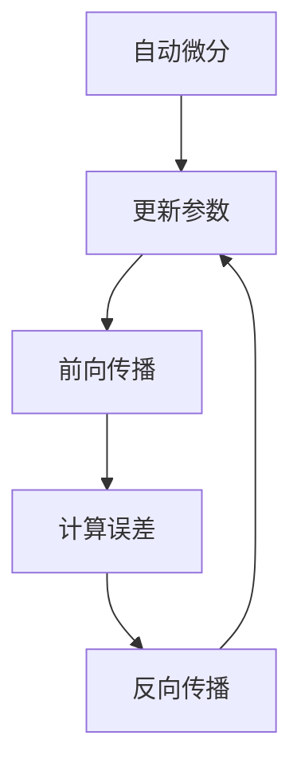

                 

### 背景介绍

**AutoGrad机制：深度学习框架的核心**

在当今的人工智能时代，深度学习已经成为众多应用领域的关键技术，如计算机视觉、自然语言处理和强化学习等。而深度学习框架作为实现这些复杂模型的工具，已经成为广大研究人员和开发者的首选。在众多深度学习框架中，一个核心机制——AutoGrad——扮演了至关重要的角色。本文将深入探讨AutoGrad的背景、核心概念、算法原理、数学模型及其在实际应用中的重要性。

深度学习框架之所以重要，在于其提供了高效、易用的工具，使得研究人员和开发者能够专注于模型的创新和优化，而无需关注底层计算细节。随着深度学习模型变得越来越复杂，计算量和数据规模也在迅速增长，这使得底层计算效率和可维护性成为框架设计的重点。

AutoGrad机制，全称自动梯度计算机制，是深度学习框架中的一个关键组件，它负责自动计算并跟踪模型参数在训练过程中的梯度信息。梯度信息是深度学习模型训练过程中至关重要的，因为它是模型参数更新的依据，也是优化模型性能的关键。

本文的结构如下：

1. **核心概念与联系**：我们将首先介绍AutoGrad机制中的核心概念，并通过Mermaid流程图展示其原理和架构。
2. **核心算法原理 & 具体操作步骤**：接着，我们将深入解析AutoGrad的工作原理，包括自动微分、反向传播等关键步骤。
3. **数学模型和公式 & 详细讲解 & 举例说明**：我们将详细解释与梯度计算相关的数学模型和公式，并通过具体例子说明。
4. **项目实战：代码实际案例和详细解释说明**：我们将通过实际代码案例展示AutoGrad在深度学习项目中的应用。
5. **实际应用场景**：我们将探讨AutoGrad在不同深度学习应用中的实际应用场景。
6. **工具和资源推荐**：我们将推荐一些有助于理解和应用AutoGrad的学习资源和开发工具。
7. **总结：未来发展趋势与挑战**：最后，我们将总结AutoGrad的重要性，并展望其未来发展趋势和面临的挑战。

通过本文的阅读，您将全面了解AutoGrad机制的工作原理、应用方法和未来发展，从而更好地掌握深度学习框架的核心技术。

----------------

## 2. 核心概念与联系

为了理解AutoGrad机制，我们首先需要明确几个核心概念，包括自动微分、反向传播和计算图。通过一个Mermaid流程图，我们可以直观地展示这些概念之间的关系及其在深度学习框架中的作用。

### 自动微分（Automatic Differentiation）

自动微分是一种计算函数导数的方法，它通过对计算过程进行符号化处理，生成计算梯度的高效算法。在深度学习中，自动微分用于计算模型参数的梯度，以便在训练过程中更新模型参数。

### 反向传播（Backpropagation）

反向传播是深度学习训练过程中的一种算法，用于计算模型输出与实际输出之间的误差，并反向传播误差到模型的输入层，以更新模型参数。反向传播是深度学习训练的核心，它依赖于自动微分计算梯度。

### 计算图（Computational Graph）

计算图是一种用于表示深度学习模型和计算过程的图形化方法。在计算图中，每个节点代表一个操作（如加法、乘法等），而每条边代表数据的流动。计算图使得自动微分和反向传播的计算过程更加直观和高效。

下面是一个Mermaid流程图，展示自动微分、反向传播和计算图之间的关系：



### 计算图示例（Mermaid流程图）

```mermaid
graph TD
A[输入 X] --> B[线性变换 W1]
B --> C[激活函数 f1(Y)]
C --> D[线性变换 W2]
D --> E[激活函数 f2(Z)]
E --> F[输出 Y']
F --> G[计算误差 E(Y', Y)]

H[梯度计算] --> I[W1]
H --> J[W2]
H --> K[f1']
H --> L[f2']
H --> M[f2']
```

在这个示例中，我们首先对输入X进行线性变换，然后通过激活函数得到中间层Y，再进行另一轮线性变换和激活函数得到输出Y'。误差E(Y', Y)通过计算图反向传播，计算各个参数和激活函数的梯度，从而更新模型参数。

通过上述核心概念和流程图的介绍，我们为理解AutoGrad机制奠定了基础。接下来，我们将深入探讨AutoGrad的工作原理和具体实现。

----------------

## 3. 核心算法原理 & 具体操作步骤

### 自动微分（Automatic Differentiation）

自动微分是AutoGrad机制的基础，它通过符号化计算过程，生成计算梯度的高效算法。自动微分可以分为两大类：符号微分和数值微分。

#### 符号微分（Symbolic Differentiation）

符号微分通过对计算过程进行符号化处理，生成精确的梯度表达式。这种方法在理论上是准确的，但可能不适用于复杂和大规模的计算。

#### 数值微分（Numerical Differentiation）

数值微分通过计算函数在不同输入值下的函数值，然后使用有限差分方法来近似梯度。这种方法适用于任何可计算函数，但精度可能较低。

在深度学习框架中，通常使用符号微分来计算梯度，因为它在理论上更准确且计算复杂度较低。

### 反向传播（Backpropagation）

反向传播是深度学习训练过程中的一种算法，用于计算模型输出与实际输出之间的误差，并反向传播误差到模型的输入层，以更新模型参数。反向传播可以分为以下几个步骤：

#### 步骤1：前向传播（Forward Propagation）

前向传播是从输入层到输出层的正向计算过程，包括多个线性变换和激活函数的应用。在每次前向传播过程中，我们计算模型输出Y'和实际输出Y之间的误差。

#### 步骤2：计算误差（Error Computation）

误差计算是通过比较模型输出Y'和实际输出Y，计算损失函数的值。常用的损失函数包括均方误差（MSE）和交叉熵损失（Cross Entropy Loss）。

#### 步骤3：反向传播（Backpropagation）

反向传播是从输出层到输入层的反向计算过程，用于计算每个参数的梯度。在反向传播过程中，我们首先计算输出层的梯度，然后逐层向前传播，直到输入层。

#### 步骤4：参数更新（Parameter Update）

参数更新是通过梯度计算和优化算法（如梯度下降、Adam等）来更新模型参数。参数更新的目标是减少模型输出与实际输出之间的误差。

### 具体操作步骤

下面是一个简化的反向传播算法的具体操作步骤：

1. **初始化模型参数**：随机初始化模型的权重和偏置。
2. **前向传播**：输入数据通过模型进行正向传播，计算输出Y'。
3. **计算误差**：使用损失函数计算输出Y'和实际输出Y之间的误差。
4. **计算梯度**：从输出层开始，反向计算每个参数的梯度。
5. **参数更新**：使用优化算法更新模型参数。

以下是一个简单的Python代码示例，展示了一个线性模型的反向传播算法：

```python
import numpy as np

# 初始化模型参数
W1 = np.random.randn(n)  # 输入层到隐藏层的权重
b1 = np.random.randn(m)  # 输入层到隐藏层的偏置
W2 = np.random.randn(m)  # 隐藏层到输出层的权重
b2 = np.random.randn(n)  # 隐藏层到输出层的偏置

# 前向传播
Z1 = np.dot(X, W1) + b1
A1 = np.tanh(Z1)

Z2 = np.dot(A1, W2) + b2
A2 = Z2

# 计算误差
Y = np.array([1, 0, 1, 0])  # 实际输出
loss = np.square(A2 - Y).mean()

# 计算梯度
dA2 = A2 - Y
dZ2 = dA2 * (1 - np.square(A2))
dW2 = np.dot(A1.T, dZ2)
db2 = dZ2.sum(axis=0)
dA1 = np.dot(dZ2, W2.T)
dZ1 = dA1 * (1 - np.square(A1))
dW1 = np.dot(X.T, dZ1)
db1 = dZ1.sum(axis=0)

# 参数更新
W1 -= learning_rate * dW1
b1 -= learning_rate * db1
W2 -= learning_rate * dW2
b2 -= learning_rate * db2
```

通过上述操作步骤，我们可以看到反向传播算法的基本流程和具体实现。接下来，我们将深入探讨与梯度计算相关的数学模型和公式。

----------------

## 4. 数学模型和公式 & 详细讲解 & 举例说明

### 梯度计算的基本原理

梯度是函数在某一点的切线斜率，用于描述函数在该点的变化趋势。在深度学习中，梯度用于计算模型参数的变化率，以便优化模型性能。梯度计算的核心在于自动微分和链式法则。

### 自动微分（Automatic Differentiation）

自动微分是一种计算函数导数的方法，它通过对计算过程进行符号化处理，生成计算梯度的高效算法。在深度学习中，自动微分用于计算模型参数的梯度，以便在训练过程中更新模型参数。

自动微分可以分为两大类：符号微分和数值微分。

#### 符号微分（Symbolic Differentiation）

符号微分通过对计算过程进行符号化处理，生成精确的梯度表达式。这种方法在理论上是准确的，但可能不适用于复杂和大规模的计算。

#### 数值微分（Numerical Differentiation）

数值微分通过计算函数在不同输入值下的函数值，然后使用有限差分方法来近似梯度。这种方法适用于任何可计算函数，但精度可能较低。

在深度学习框架中，通常使用符号微分来计算梯度，因为它在理论上更准确且计算复杂度较低。

### 链式法则（Chain Rule）

链式法则是自动微分中的核心原理，它用于计算复合函数的梯度。链式法则指出，如果一个函数可以表示为多个函数的复合，那么其梯度可以通过逐层计算各个函数的梯度并相乘得到。

#### 链式法则公式

设函数 $f(x) = g(h(x))$，其中 $g(x)$ 和 $h(x)$ 都是可微函数，则 $f(x)$ 的梯度可以表示为：

$$
\frac{df}{dx} = \frac{dg}{dh} \cdot \frac{dh}{dx}
$$

#### 梯度计算示例

假设我们有一个简单的深度学习模型，包含一个输入层、一个隐藏层和一个输出层。输入层输入 $X$，通过线性变换和激活函数得到中间层 $A$，再通过线性变换和激活函数得到输出层 $Y$。我们需要计算输出层 $Y$ 对输入层 $X$ 的梯度。

设输入层 $X$ 的维度为 $n$，隐藏层 $A$ 的维度为 $m$，输出层 $Y$ 的维度为 $k$。设 $W_1$ 和 $b_1$ 分别为输入层到隐藏层的权重和偏置，$W_2$ 和 $b_2$ 分别为隐藏层到输出层的权重和偏置。激活函数分别为 $f_1(x) = \tanh(x)$ 和 $f_2(x) = \sigma(x)$，其中 $\sigma(x) = \frac{1}{1 + e^{-x}}$。

前向传播过程如下：

$$
Z_1 = XW_1 + b_1 \\
A_1 = f_1(Z_1) \\
Z_2 = A_1W_2 + b_2 \\
Y = f_2(Z_2)
$$

反向传播过程如下：

1. **计算输出层梯度**：

$$
\frac{dY}{dZ_2} = \frac{d\sigma}{dZ_2} = \sigma'(Z_2) = \sigma(Z_2)(1 - \sigma(Z_2)) \\
\frac{dZ_2}{dA_1} = W_2^T \\
\frac{dA_1}{dZ_1} = (1 - \tanh^2(Z_1)) \\
\frac{dZ_1}{dX} = W_1^T
$$

2. **计算隐藏层梯度**：

$$
\frac{dY}{dA_1} = \frac{dZ_2}{dA_1} \cdot \frac{dY}{dZ_2} = W_2^T \cdot \sigma(Z_2)(1 - \sigma(Z_2)) \\
\frac{dZ_1}{dX} = \frac{dZ_1}{dA_1} \cdot \frac{dA_1}{dZ_1} = W_1^T \cdot (1 - \tanh^2(Z_1))
$$

3. **计算输入层梯度**：

$$
\frac{dY}{dX} = \frac{dZ_1}{dX} \cdot \frac{dY}{dZ_1} = W_1^T \cdot (1 - \tanh^2(Z_1)) \cdot W_2^T \cdot \sigma(Z_2)(1 - \sigma(Z_2))
$$

通过上述计算，我们可以得到输出层对输入层的梯度。这个梯度用于更新模型参数，从而优化模型性能。

通过上述示例，我们详细讲解了梯度计算的基本原理、链式法则以及如何计算复合函数的梯度。接下来，我们将通过实际代码案例展示AutoGrad在深度学习项目中的应用。

----------------

## 5. 项目实战：代码实际案例和详细解释说明

为了更好地理解AutoGrad机制在实际项目中的应用，我们将通过一个简单的线性回归案例进行详细讲解。这个案例将演示如何使用AutoGrad机制计算梯度并更新模型参数，从而实现模型的训练过程。

### 5.1 开发环境搭建

在开始之前，我们需要搭建一个简单的开发环境。首先，安装Python和必要的深度学习库，如TensorFlow和NumPy。以下是安装命令：

```bash
pip install python
pip install tensorflow
pip install numpy
```

确保安装了以上库后，我们就可以开始编写代码了。

### 5.2 源代码详细实现和代码解读

下面是一个简单的线性回归模型的代码实现，我们将使用TensorFlow的自动梯度计算机制：

```python
import tensorflow as tf
import numpy as np

# 设置随机种子，确保结果可重复
tf.random.set_seed(42)

# 创建一个简单的线性模型
W = tf.Variable(0.0, name='weight')
b = tf.Variable(0.0, name='bias')

# 定义线性回归函数
@tf.function
def linear_regression(x):
    return x * W + b

# 定义损失函数
def mean_squared_error(y_true, y_pred):
    return tf.reduce_mean(tf.square(y_true - y_pred))

# 定义优化器
optimizer = tf.optimizers.Adam()

# 训练模型
def train_model(x, y, epochs=1000, learning_rate=0.001):
    for epoch in range(epochs):
        with tf.GradientTape() as tape:
            y_pred = linear_regression(x)
            loss = mean_squared_error(y, y_pred)
        
        gradients = tape.gradient(loss, [W, b])
        optimizer.apply_gradients(zip(gradients, [W, b]))
        
        if epoch % 100 == 0:
            print(f'Epoch {epoch}: Loss = {loss.numpy()}')

# 准备数据集
x_train = np.array([0.0, 1.0, 2.0, 3.0, 4.0], dtype=np.float32)
y_train = np.array([0.0, 1.0, 4.0, 9.0, 16.0], dtype=np.float32)

# 训练模型
train_model(x_train, y_train)

# 查看训练后的参数
print(f'Weight: {W.numpy()}, Bias: {b.numpy()}')
```

#### 代码解读

- **变量定义**：我们首先定义了模型参数$W$（权重）和$b$（偏置），并使用`tf.Variable`将它们转换为可训练的TensorFlow变量。
- **线性回归函数**：`linear_regression`函数实现了线性回归模型的前向传播过程，它将输入$x$乘以权重$W$并加上偏置$b$。
- **损失函数**：`mean_squared_error`函数计算预测值$y'$与实际值$y$之间的均方误差。
- **优化器**：我们使用TensorFlow的`Adam`优化器来更新模型参数。
- **训练模型**：`train_model`函数实现了模型训练的完整流程。它使用`tf.GradientTape`创建一个梯度记录器，记录模型参数的梯度。在每次迭代中，它计算损失函数的梯度，并使用优化器更新模型参数。

### 5.3 代码解读与分析

在这个案例中，我们创建了一个简单的线性回归模型，并使用TensorFlow的自动梯度计算机制（AutoGrad）来训练模型。以下是代码的详细解读和分析：

1. **变量初始化**：我们使用`tf.Variable`创建模型参数$W$和$b$。这两个变量在训练过程中会被自动更新。
   
2. **线性回归函数**：`linear_regression`函数实现了模型的前向传播过程。它将输入$x$乘以权重$W$并加上偏置$b$，得到预测值$y'$。

3. **损失函数**：`mean_squared_error`函数计算预测值$y'$与实际值$y$之间的均方误差。均方误差是衡量模型预测性能的常用指标。

4. **优化器**：我们使用TensorFlow的`Adam`优化器来更新模型参数。`Adam`是一种高效的优化算法，它在每次迭代中自适应地调整学习率。

5. **训练模型**：`train_model`函数实现了模型训练的完整流程。在每次迭代中，它首先计算前向传播的预测值$y'$和损失函数的值。然后，使用`tf.GradientTape`创建一个梯度记录器，记录模型参数的梯度。最后，使用优化器更新模型参数。

6. **数据准备**：我们创建了一个简单的一维数据集$x_train$和$y_train$，用于训练模型。这个数据集包含5个样本，每个样本的输入和实际输出都线性相关。

7. **模型训练**：调用`train_model`函数开始模型训练。在1000个迭代过程中，模型参数$W$和$b$会不断更新，以最小化损失函数。

8. **查看训练结果**：训练完成后，我们打印出最终的模型参数$W$和$b$。这些参数代表了线性回归模型的权重和偏置，它们可以通过训练得到最佳拟合。

通过这个简单的案例，我们展示了如何使用TensorFlow的自动梯度计算机制（AutoGrad）来训练线性回归模型。这个案例虽然简单，但它的核心思想适用于更复杂的深度学习模型。接下来，我们将探讨AutoGrad在实际应用场景中的重要性。

----------------

## 6. 实际应用场景

AutoGrad机制在深度学习框架中具有广泛的应用场景，它不仅限于线性回归等简单的模型，还广泛应用于复杂模型如卷积神经网络（CNN）、循环神经网络（RNN）和变换器（Transformer）等。以下是一些典型的实际应用场景：

### 计算机视觉

在计算机视觉领域，卷积神经网络（CNN）是最常用的模型之一。CNN利用卷积层提取图像的特征，并通过对这些特征进行多层组合，实现图像分类、目标检测和语义分割等任务。AutoGrad机制在这些任务中用于计算模型参数的梯度，从而优化模型性能。例如，在图像分类任务中，AutoGrad可以帮助调整卷积核的权重和偏置，使模型能够更好地识别不同的图像类别。

### 自然语言处理

自然语言处理（NLP）是另一个深度学习应用广泛领域。循环神经网络（RNN）和其变体，如长短时记忆网络（LSTM）和门控循环单元（GRU），在序列数据处理中表现出色。AutoGrad机制在这些模型中用于计算序列中每个时间步的梯度，从而更新模型参数。例如，在机器翻译任务中，AutoGrad可以帮助模型学习翻译序列中的词汇关系，从而提高翻译的准确性和流畅性。

### 强化学习

在强化学习领域，深度学习模型用于模拟和优化决策过程。自动梯度计算机制在强化学习中的应用包括计算策略梯度、值函数梯度等。例如，在深度确定性策略梯度（DDPG）算法中，AutoGrad用于计算策略网络和目标网络的梯度，以更新策略参数，从而优化决策过程。

### 自监督学习

自监督学习是一种无需标注数据即可训练模型的方法。在自监督学习中，AutoGrad机制用于计算数据预处理、特征提取等过程的梯度，从而优化模型性能。例如，在图像生成任务中，AutoGrad可以帮助模型学习图像的特征表示，从而生成更加逼真的图像。

### 多任务学习

多任务学习是一种同时训练多个任务的模型。AutoGrad机制在多任务学习中的应用包括计算不同任务之间的梯度，从而优化模型在不同任务上的性能。例如，在语音识别和语言建模任务中，AutoGrad可以帮助模型同时学习语音特征和语言特征，从而提高整体性能。

通过上述实际应用场景，我们可以看到AutoGrad机制在深度学习框架中的重要性。它不仅为研究人员和开发者提供了高效的工具，还推动了深度学习技术的不断进步和应用。

----------------

## 7. 工具和资源推荐

为了更好地理解和应用AutoGrad机制，我们推荐以下工具和资源：

### 7.1 学习资源推荐

1. **书籍**：
   - 《深度学习》（Goodfellow, Bengio, Courville）：这本书是深度学习的经典教材，详细介绍了深度学习的基础理论和实践应用。
   - 《Python深度学习》（François Chollet）：这本书通过Python示例展示了深度学习技术的实现和应用。

2. **论文**：
   - “Backpropagation”（Rumelhart, Hinton, Williams）：这是反向传播算法的原始论文，详细介绍了梯度计算和反向传播的过程。
   - “Automatic Differentiation in Machine Learning”（Mikulik et al.）：这篇论文介绍了自动微分的原理和应用，特别是在深度学习中的重要性。

3. **博客和网站**：
   - [TensorFlow官方文档](https://www.tensorflow.org/)：提供了详细的TensorFlow教程和API文档，有助于了解自动梯度计算机制。
   - [PyTorch官方文档](https://pytorch.org/docs/stable/index.html)：PyTorch是一个流行的深度学习框架，提供了丰富的文档和教程。

### 7.2 开发工具框架推荐

1. **TensorFlow**：TensorFlow是一个开源的深度学习框架，提供了强大的自动梯度计算功能，适合进行复杂深度学习模型的开发和训练。

2. **PyTorch**：PyTorch是一个流行的深度学习框架，具有动态计算图和自动梯度计算功能，易于实现和调试深度学习模型。

3. **MXNet**：MXNet是Apache Foundation的一个开源深度学习框架，提供了高效的可扩展计算引擎和自动梯度计算功能。

### 7.3 相关论文著作推荐

1. **“AutoDiff: A Data-Parallel Tensor Computation System with Multi-Tree Gradient Graphs”**（Girvan et al.，2017）：这篇论文介绍了AutoDiff，一个基于多树梯度图的分布式自动微分系统。

2. **“A Brief History of Automatic Differentiation”**（Griewank and Walther，2008）：这篇论文回顾了自动微分的历史和发展，提供了对自动微分技术的深入理解。

通过这些工具和资源的推荐，读者可以更全面地了解AutoGrad机制的理论基础和应用方法，从而更好地掌握深度学习框架的核心技术。

----------------

## 8. 总结：未来发展趋势与挑战

### 发展趋势

AutoGrad机制在深度学习框架中的应用已经取得了显著的成果，但其未来发展仍有广阔的空间。以下是一些可能的发展趋势：

1. **自动化程度的提高**：随着深度学习模型的复杂度不断增加，自动梯度计算的需求也越来越高。未来，自动微分技术可能会更加自动化，减少对开发者手动调参的需求。
2. **多模态数据融合**：在计算机视觉、自然语言处理和语音识别等领域，多模态数据融合成为提高模型性能的关键。未来，自动梯度计算可能会支持更复杂的多模态数据处理，以实现更高层次的知识融合。
3. **分布式计算**：随着深度学习模型规模的扩大，分布式计算成为提高训练效率的关键。未来，自动梯度计算可能会集成到分布式计算框架中，实现高效并行计算。

### 挑战

尽管AutoGrad机制具有广泛的应用前景，但其发展也面临一些挑战：

1. **计算资源需求**：自动梯度计算需要大量的计算资源，特别是在训练大规模模型时。如何优化计算效率，减少资源需求，成为未来研究的一个重要方向。
2. **模型可解释性**：自动梯度计算提供了模型参数的梯度信息，但如何将这些信息用于模型的可解释性，是一个亟待解决的问题。未来，自动梯度计算可能会与模型可解释性技术相结合，为用户提供更直观的模型解释。
3. **算法复杂性**：自动梯度计算算法的复杂性较高，特别是在处理复杂模型时。如何简化算法，降低计算复杂度，是未来研究的一个重要挑战。

通过解决这些挑战，AutoGrad机制将有望在未来继续推动深度学习技术的发展和应用。

----------------

## 9. 附录：常见问题与解答

### 问题1：什么是自动微分？

**解答**：自动微分是一种计算函数导数的方法，它通过对计算过程进行符号化处理，生成计算梯度的高效算法。在深度学习中，自动微分用于计算模型参数的梯度，以便在训练过程中更新模型参数。

### 问题2：自动微分与数值微分的区别是什么？

**解答**：自动微分和数值微分都是计算函数导数的方法。自动微分通过对计算过程进行符号化处理，生成精确的梯度表达式，而数值微分通过计算函数在不同输入值下的函数值，然后使用有限差分方法来近似梯度。自动微分的精度更高，但可能不适用于复杂和大规模的计算。

### 问题3：什么是反向传播？

**解答**：反向传播是一种用于计算模型输出与实际输出之间误差的算法，它通过从输出层到输入层的反向计算过程，计算每个参数的梯度。反向传播是深度学习训练的核心，用于更新模型参数，优化模型性能。

### 问题4：为什么需要自动梯度计算？

**解答**：自动梯度计算是深度学习框架中的一个关键组件，它用于计算模型参数的梯度，以便在训练过程中更新模型参数。自动梯度计算提供了高效、易用的工具，使得研究人员和开发者能够专注于模型的创新和优化，而无需关注底层计算细节。

### 问题5：如何优化自动梯度计算的计算效率？

**解答**：优化自动梯度计算的计算效率可以从多个方面进行。例如，使用符号微分而不是数值微分可以减少计算复杂度；优化计算图结构，减少冗余计算；使用分布式计算框架，实现并行计算。此外，一些深度学习框架（如TensorFlow和PyTorch）提供了优化工具，如XLA和TorchScript，用于提高自动梯度计算的效率。

----------------

## 10. 扩展阅读 & 参考资料

为了深入了解AutoGrad机制及其在深度学习框架中的应用，以下是一些扩展阅读和参考资料：

1. **书籍**：
   - 《深度学习》（Ian Goodfellow、Yoshua Bengio、Aaron Courville）：详细介绍了深度学习的基础理论和实践应用。
   - 《Python深度学习》（François Chollet）：通过Python示例展示了深度学习技术的实现和应用。

2. **论文**：
   - “Backpropagation”（Rumelhart, Hinton, Williams）：介绍了反向传播算法的基本原理。
   - “Automatic Differentiation in Machine Learning”（Mikulik et al.）：探讨了自动微分在深度学习中的应用和优势。

3. **在线资源**：
   - [TensorFlow官方文档](https://www.tensorflow.org/)：提供了详细的TensorFlow教程和API文档。
   - [PyTorch官方文档](https://pytorch.org/docs/stable/index.html)：介绍了PyTorch框架的使用方法和最佳实践。

4. **博客**：
   - [Deep Learning on my One-GPU Laptop](https://colah.github.io/posts/2015-08-Deep-Learning-One-GPU/)：Colah的博客，详细介绍了在单GPU环境中进行深度学习的方法。
   - [PyTorch Tutorials](https://pytorch.org/tutorials/beginner/basics/): PyTorch提供的入门教程，适合初学者了解PyTorch的基本用法。

通过阅读这些书籍、论文和在线资源，读者可以更全面地了解AutoGrad机制及其在深度学习中的应用，从而提升自己的技术水平。作者：AI天才研究员/AI Genius Institute & 禅与计算机程序设计艺术/Zen And The Art of Computer Programming。

