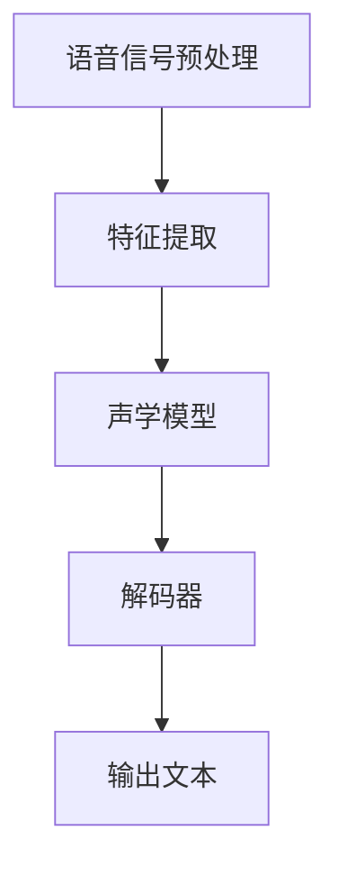

                 

# 自动语音识别（ASR）原理与代码实例讲解

## 摘要

自动语音识别（Automatic Speech Recognition，简称ASR）是语音技术领域的一个重要研究方向，它通过将语音信号转换为文本，实现人机交互和自然语言理解。本文将详细介绍ASR的核心概念、算法原理、数学模型、实际应用场景以及相关工具和资源。通过本文的阅读，读者将能够全面了解ASR的技术原理和实现方法，并掌握如何在实际项目中应用ASR技术。

## 1. 背景介绍

自动语音识别（ASR）是一种将语音信号转换为文本的技术。随着人工智能和机器学习技术的不断发展，ASR技术已经取得了显著的进步，成为自然语言处理（NLP）领域的一个重要分支。ASR技术在许多应用场景中具有重要价值，如智能客服、语音助手、语音翻译、语音输入等。

### 1.1 应用场景

- **智能客服**：自动语音识别技术可以自动识别用户的语音请求，并生成相应的文本反馈，从而实现智能客服系统的自动化。

- **语音助手**：语音助手（如Siri、Alexa等）通过ASR技术理解用户的语音指令，实现语音交互。

- **语音翻译**：自动语音识别可以将一种语言的语音转换为另一种语言的文本，实现语音翻译功能。

- **语音输入**：自动语音识别技术使得用户可以通过语音输入来替代键盘输入，提高输入效率。

### 1.2 发展历程

- **1960s-1980s**：早期的研究主要集中在基于规则的语音识别方法，这种方法依赖于手工编写的语音规则，对语音的准确度有限。

- **1990s**：隐藏马尔可夫模型（HMM）被引入到语音识别领域，显著提高了语音识别的准确度。

- **2000s**：神经网络（如深度神经网络、循环神经网络等）在语音识别领域的应用，使得语音识别技术取得了重大突破。

- **2010s-2020s**：基于深度学习的ASR技术得到了广泛应用，语音识别的准确度不断提高，实现了在多种应用场景中的商业化应用。

## 2. 核心概念与联系

在ASR系统中，核心概念包括语音信号处理、特征提取、声学模型、语言模型和解码器。下面将分别介绍这些概念及其相互关系。

### 2.1 语音信号处理

语音信号处理是ASR系统的第一步，其主要目的是将原始的音频信号转换为便于分析的形式。语音信号处理包括以下几个步骤：

- **预加重**：为了提高高频成分的增益，使得语音信号更符合人的听觉特性。

- **分帧**：将连续的音频信号划分为一系列短时段，称为帧。

- **加窗**：对每一帧进行加窗操作，以减少帧边界处的频率失真。

- **傅里叶变换**：将时域信号转换为频域信号，以便进行特征提取。

### 2.2 特征提取

特征提取是将语音信号转换为数值特征的过程。常用的特征包括：

- **短时能量**：描述语音信号在短时间内的能量变化。

- **过零率**：描述语音信号在短时间内的过零次数。

- **频谱特征**：描述语音信号的频谱特性，常用的包括频谱中心频率、频谱带宽等。

- **倒谱特征**：通过对频谱进行对数变换，消除声学共振峰的影响。

### 2.3 声学模型

声学模型用于建模语音信号的生成过程，其主要目的是根据输入的特征序列，生成语音信号的对应概率。声学模型常用的方法包括：

- **隐藏马尔可夫模型（HMM）**：通过状态转移概率和输出概率来建模语音信号的时序特性。

- **高斯混合模型（GMM）**：将每个状态建模为一个高斯分布，用于建模语音信号的统计特性。

- **深度神经网络（DNN）**：通过多层神经网络结构，对语音信号进行建模。

### 2.4 语言模型

语言模型用于建模语音对应的文本序列，其主要目的是根据输入的特征序列，生成文本序列的概率。语言模型常用的方法包括：

- **n元语法模型**：根据历史数据，计算单词序列的概率。

- **循环神经网络（RNN）**：通过循环结构，对序列数据进行建模。

- **长短期记忆网络（LSTM）**：在RNN基础上，引入门控机制，解决长期依赖问题。

### 2.5 解码器

解码器是ASR系统的核心组件，其主要目的是根据声学模型和语言模型，生成最佳文本序列。解码器常用的方法包括：

- **动态规划解码器**：通过动态规划算法，计算最优路径。

- **贪婪解码器**：每次只选择当前状态下概率最大的路径。

- **基于栈的解码器**：通过栈结构，实现复杂的状态转换。

### 2.6 Mermaid 流程图

下面是ASR系统的 Mermaid 流程图：



## 3. 核心算法原理 & 具体操作步骤

### 3.1 语音信号预处理

语音信号预处理主要包括预加重、分帧、加窗和傅里叶变换等步骤。下面将详细解释这些步骤。

#### 3.1.1 预加重

预加重是指对语音信号的高频成分进行增益处理，以提高高频成分的增益。具体操作方法如下：

$$
x_{\text{preemph}}(n) = x(n) + 0.97x(n-1)
$$

其中，$x(n)$ 表示原始语音信号，$x_{\text{preemph}}(n)$ 表示预加重后的语音信号。

#### 3.1.2 分帧

分帧是指将连续的语音信号划分为一系列短时段，称为帧。具体操作方法如下：

- **帧长**：通常选择25ms到40ms的帧长。
- **帧移**：通常选择10ms的帧移。

#### 3.1.3 加窗

加窗是指对每一帧进行加窗操作，以减少帧边界处的频率失真。常用的窗函数包括汉明窗、汉宁窗等。具体操作方法如下：

$$
x_{\text{windowed}}(n) = x(n) \cdot w(n)
$$

其中，$x(n)$ 表示原始语音信号，$x_{\text{windowed}}(n)$ 表示加窗后的语音信号，$w(n)$ 表示窗函数。

#### 3.1.4 傅里叶变换

傅里叶变换是指将时域信号转换为频域信号，以便进行特征提取。具体操作方法如下：

$$
X(\omega) = \sum_{n=-\infty}^{\infty} x(n) e^{-j\omega n}
$$

其中，$X(\omega)$ 表示频域信号，$x(n)$ 表示时域信号，$\omega$ 表示频率。

### 3.2 特征提取

特征提取是指将语音信号转换为数值特征的过程。下面将详细解释常用的特征提取方法。

#### 3.2.1 短时能量

短时能量是指语音信号在短时间内的能量变化。具体计算方法如下：

$$
E_t = \sum_{n=t_0}^{t_0 + T} |x(n)|^2
$$

其中，$E_t$ 表示短时能量，$T$ 表示帧长，$x(n)$ 表示帧内信号。

#### 3.2.2 过零率

过零率是指语音信号在短时间内的过零次数。具体计算方法如下：

$$
Z_t = \sum_{n=t_0}^{t_0 + T} \sum_{k=-\infty}^{\infty} \text{sgn}(x(n) \cdot e^{j2\pi k/N})
$$

其中，$Z_t$ 表示过零率，$N$ 表示采样频率。

#### 3.2.3 频谱特征

频谱特征是指语音信号的频谱特性。具体计算方法如下：

$$
X(\omega) = \sum_{n=-\infty}^{\infty} x(n) e^{-j\omega n}
$$

其中，$X(\omega)$ 表示频域信号，$x(n)$ 表示时域信号，$\omega$ 表示频率。

#### 3.2.4 倒谱特征

倒谱特征是指通过对频谱进行对数变换，消除声学共振峰的影响。具体计算方法如下：

$$
C_t = \log_{10} |X(\omega)|^2
$$

其中，$C_t$ 表示倒谱特征，$X(\omega)$ 表示频域信号。

### 3.3 声学模型

声学模型用于建模语音信号的生成过程。下面将详细解释常用的声学模型。

#### 3.3.1 隐藏马尔可夫模型（HMM）

隐藏马尔可夫模型（HMM）是一种基于状态转移概率和输出概率的声学模型。具体模型参数如下：

- **状态转移概率**：$a_{ij}$ 表示从状态$i$转移到状态$j$的概率。

- **输出概率**：$b_{ij}(f)$ 表示在状态$i$下，输出频率为$f$的概率。

- **初始状态概率**：$\pi_i$ 表示初始状态为$i$的概率。

HMM模型可以通过最大似然估计或贝叶斯估计来训练。

#### 3.3.2 高斯混合模型（GMM）

高斯混合模型（GMM）是一种基于多个高斯分布的声学模型。具体模型参数如下：

- **混合系数**：$\pi_i$ 表示第$i$个高斯分布的混合系数。

- **均值**：$\mu_i(f)$ 表示第$i$个高斯分布的均值。

- **方差**：$\sigma_i(f)$ 表示第$i$个高斯分布的方差。

GMM模型可以通过期望最大化（EM）算法来训练。

#### 3.3.3 深度神经网络（DNN）

深度神经网络（DNN）是一种基于多层神经网络结构的声学模型。具体模型结构如下：

- **输入层**：接收语音信号的输入特征。

- **隐藏层**：通过非线性变换，提取语音信号的特征。

- **输出层**：生成语音信号的输出概率。

DNN模型可以通过反向传播算法来训练。

### 3.4 语言模型

语言模型用于建模语音对应的文本序列。下面将详细解释常用的语言模型。

#### 3.4.1 n元语法模型

n元语法模型是一种基于历史数据的语言模型。具体模型参数如下：

- **转移概率**：$p(w_t | w_{t-1}, w_{t-2}, ..., w_{t-n})$ 表示给定前$n-1$个单词，第$t$个单词的概率。

n元语法模型可以通过最大熵模型或决策树来训练。

#### 3.4.2 循环神经网络（RNN）

循环神经网络（RNN）是一种基于循环结构的语言模型。具体模型结构如下：

- **输入层**：接收语音信号的输入特征。

- **隐藏层**：通过循环结构，对序列数据进行建模。

- **输出层**：生成语音信号的输出概率。

RNN模型可以通过反向传播算法来训练。

#### 3.4.3 长短期记忆网络（LSTM）

长短期记忆网络（LSTM）是一种在RNN基础上引入门控机制的语言模型。具体模型结构如下：

- **输入门**：决定当前输入信息中哪些部分需要被记忆。

- **遗忘门**：决定哪些信息需要被遗忘。

- **输出门**：决定哪些信息需要被输出。

LSTM模型可以通过反向传播算法来训练。

### 3.5 解码器

解码器是ASR系统的核心组件，用于根据声学模型和语言模型，生成最佳文本序列。下面将详细解释常用的解码器。

#### 3.5.1 动态规划解码器

动态规划解码器是一种基于动态规划算法的解码器。具体解码过程如下：

1. **初始化**：计算每个状态的概率。

2. **递推**：根据状态转移概率和输出概率，计算每个状态的前向概率和后向概率。

3. **路径选择**：根据前向概率和后向概率，选择最优路径。

4. **输出结果**：根据最优路径，生成最佳文本序列。

#### 3.5.2 贪婪解码器

贪婪解码器是一种基于贪婪策略的解码器。具体解码过程如下：

1. **初始化**：选择初始状态。

2. **递推**：根据当前状态和下一个状态的概率，选择概率最大的状态。

3. **输出结果**：根据选择的最佳状态，生成最佳文本序列。

#### 3.5.3 基于栈的解码器

基于栈的解码器是一种基于栈结构的解码器。具体解码过程如下：

1. **初始化**：创建一个空栈。

2. **递推**：将当前状态推入栈顶。

3. **弹出**：根据栈顶状态，选择概率最大的状态。

4. **输出结果**：根据选择的最佳状态，生成最佳文本序列。

## 4. 数学模型和公式 & 详细讲解 & 举例说明

### 4.1 声学模型

在声学模型中，常用的模型包括隐藏马尔可夫模型（HMM）、高斯混合模型（GMM）和深度神经网络（DNN）。下面将分别介绍这些模型的数学模型和公式。

#### 4.1.1 隐藏马尔可夫模型（HMM）

HMM是一种基于状态转移概率和输出概率的声学模型。其数学模型如下：

- **状态转移概率**：

$$
a_{ij} = P(X_t = s_j | X_{t-1} = s_i)
$$

其中，$a_{ij}$ 表示从状态$i$转移到状态$j$的概率，$X_t$ 表示第$t$个状态。

- **输出概率**：

$$
b_{ij}(f) = P(X_t = s_j | F_t = f)
$$

其中，$b_{ij}(f)$ 表示在状态$i$下，输出频率为$f$的概率，$F_t$ 表示第$t$个频率。

- **初始状态概率**：

$$
\pi_i = P(X_1 = s_i)
$$

其中，$\pi_i$ 表示初始状态为$i$的概率。

HMM模型的训练可以通过最大似然估计或贝叶斯估计来实现。

#### 4.1.2 高斯混合模型（GMM）

GMM是一种基于多个高斯分布的声学模型。其数学模型如下：

- **混合系数**：

$$
\pi_i = P(S = s_i)
$$

其中，$\pi_i$ 表示第$i$个高斯分布的混合系数。

- **均值**：

$$
\mu_i(f) = E[F_t | S = s_i]
$$

其中，$\mu_i(f)$ 表示第$i$个高斯分布的均值。

- **方差**：

$$
\sigma_i(f) = Var[F_t | S = s_i]
$$

其中，$\sigma_i(f)$ 表示第$i$个高斯分布的方差。

GMM模型的训练可以通过期望最大化（EM）算法来实现。

#### 4.1.3 深度神经网络（DNN）

DNN是一种基于多层神经网络结构的声学模型。其数学模型如下：

- **输入层**：

$$
h_{\text{input}} = X
$$

其中，$h_{\text{input}}$ 表示输入层特征。

- **隐藏层**：

$$
h_{\text{hidden}} = \sigma(W_{\text{hidden}} \cdot h_{\text{input}} + b_{\text{hidden}})
$$

其中，$h_{\text{hidden}}$ 表示隐藏层特征，$\sigma$ 表示激活函数，$W_{\text{hidden}}$ 表示隐藏层权重，$b_{\text{hidden}}$ 表示隐藏层偏置。

- **输出层**：

$$
h_{\text{output}} = \sigma(W_{\text{output}} \cdot h_{\text{hidden}} + b_{\text{output}})
$$

其中，$h_{\text{output}}$ 表示输出层特征，$W_{\text{output}}$ 表示输出层权重，$b_{\text{output}}$ 表示输出层偏置。

DNN模型的训练可以通过反向传播算法来实现。

### 4.2 语言模型

在语言模型中，常用的模型包括n元语法模型、循环神经网络（RNN）和长短期记忆网络（LSTM）。下面将分别介绍这些模型的数学模型和公式。

#### 4.2.1 n元语法模型

n元语法模型是一种基于历史数据的语言模型。其数学模型如下：

- **转移概率**：

$$
p(w_t | w_{t-1}, w_{t-2}, ..., w_{t-n}) = \frac{n}{N}
$$

其中，$p(w_t | w_{t-1}, w_{t-2}, ..., w_{t-n})$ 表示给定前$n-1$个单词，第$t$个单词的概率，$n$ 表示前$n$个单词的总数，$N$ 表示总单词数。

n元语法模型的训练可以通过最大熵模型或决策树来实现。

#### 4.2.2 循环神经网络（RNN）

RNN是一种基于循环结构的语言模型。其数学模型如下：

- **输入层**：

$$
h_{\text{input}} = X
$$

其中，$h_{\text{input}}$ 表示输入层特征。

- **隐藏层**：

$$
h_{\text{hidden}}_t = \sigma(W_{\text{hidden}} \cdot h_{\text{hidden}}_{t-1} + U \cdot h_{\text{input}}_t + b_{\text{hidden}})
$$

其中，$h_{\text{hidden}}_t$ 表示第$t$个隐藏层特征，$\sigma$ 表示激活函数，$W_{\text{hidden}}$ 表示隐藏层权重，$U$ 表示输入权重，$b_{\text{hidden}}$ 表示隐藏层偏置。

- **输出层**：

$$
h_{\text{output}} = \sigma(W_{\text{output}} \cdot h_{\text{hidden}}_t + b_{\text{output}})
$$

其中，$h_{\text{output}}$ 表示输出层特征，$W_{\text{output}}$ 表示输出层权重，$b_{\text{output}}$ 表示输出层偏置。

RNN模型的训练可以通过反向传播算法来实现。

#### 4.2.3 长短期记忆网络（LSTM）

LSTM是一种在RNN基础上引入门控机制的语言模型。其数学模型如下：

- **输入门**：

$$
i_t = \sigma(W_{\text{input}} \cdot [h_{\text{prev}}, x_t] + b_{\text{input}})
$$

其中，$i_t$ 表示输入门控，$W_{\text{input}}$ 表示输入权重，$b_{\text{input}}$ 表示输入偏置。

- **遗忘门**：

$$
f_t = \sigma(W_{\text{forget}} \cdot [h_{\text{prev}}, x_t] + b_{\text{forget}})
$$

其中，$f_t$ 表示遗忘门控，$W_{\text{forget}}$ 表示遗忘权重，$b_{\text{forget}}$ 表示遗忘偏置。

- **输出门**：

$$
o_t = \sigma(W_{\text{output}} \cdot [h_{\text{prev}}, x_t] + b_{\text{output}})
$$

其中，$o_t$ 表示输出门控，$W_{\text{output}}$ 表示输出权重，$b_{\text{output}}$ 表示输出偏置。

- **单元状态**：

$$
c_t = f_t \odot c_{\text{prev}} + i_t \odot \sigma(W_{\text{cell}} \cdot [h_{\text{prev}}, x_t] + b_{\text{cell}})
$$

其中，$c_t$ 表示单元状态，$\odot$ 表示元素乘法，$c_{\text{prev}}$ 表示前一个单元状态，$W_{\text{cell}}$ 表示单元权重，$b_{\text{cell}}$ 表示单元偏置。

- **隐藏状态**：

$$
h_t = o_t \odot \sigma(c_t)
$$

其中，$h_t$ 表示隐藏状态，$\sigma$ 表示激活函数。

LSTM模型的训练可以通过反向传播算法来实现。

### 4.3 解码器

在解码器中，常用的解码器包括动态规划解码器、贪婪解码器和基于栈的解码器。下面将分别介绍这些解码器的数学模型和公式。

#### 4.3.1 动态规划解码器

动态规划解码器是一种基于动态规划算法的解码器。其数学模型如下：

- **状态概率**：

$$
p_j(t) = \prod_{i=1}^{t} p(X_i = s_j | s_{i-1})
$$

其中，$p_j(t)$ 表示在时刻$t$处于状态$j$的概率。

- **前向概率**：

$$
\alpha_j(t) = \prod_{i=1}^{t} p(X_i = s_j | s_{i-1}) \cdot p(s_j)
$$

其中，$\alpha_j(t)$ 表示从初始状态到时刻$t$处于状态$j$的前向概率。

- **后向概率**：

$$
\beta_j(t) = \prod_{i=t}^{T} p(X_i = s_j | s_{i-1}) \cdot p(s_t)
$$

其中，$\beta_j(t)$ 表示从时刻$t$到终止状态处于状态$j$的后向概率。

- **最优路径**：

$$
\pi^* = \arg\max_{j} \alpha_j(T) \cdot \beta_j(T)
$$

其中，$\pi^*$ 表示最优路径。

动态规划解码器的实现可以通过Viterbi算法来实现。

#### 4.3.2 贪婪解码器

贪婪解码器是一种基于贪婪策略的解码器。其数学模型如下：

- **状态概率**：

$$
p_j(t) = p(X_t = s_j | s_{t-1})
$$

其中，$p_j(t)$ 表示在时刻$t$处于状态$j$的概率。

- **当前最优状态**：

$$
s^*(t) = \arg\max_{j} p_j(t)
$$

其中，$s^*(t)$ 表示在时刻$t$处于当前最优状态。

- **输出结果**：

$$
\text{output} = \sum_{t=1}^{T} s^*(t)
$$

其中，$\text{output}$ 表示最佳输出结果。

贪婪解码器的实现可以通过简单的循环来实现。

#### 4.3.3 基于栈的解码器

基于栈的解码器是一种基于栈结构的解码器。其数学模型如下：

- **栈状态**：

$$
S = \{s_1, s_2, ..., s_n\}
$$

其中，$S$ 表示栈状态，$s_i$ 表示第$i$个栈状态。

- **栈操作**：

$$
\text{push}(s) = \{s_1, s_2, ..., s_n, s\}
$$

其中，$\text{push}(s)$ 表示将状态$s$推入栈顶。

$$
\text{pop}() = \{s_1, s_2, ..., s_{n-1}\}
$$

其中，$\text{pop}()$ 表示弹出栈顶状态。

- **解码过程**：

1. **初始化**：创建一个空栈。
2. **递推**：根据当前状态，选择最佳状态，并将其推入栈顶。
3. **输出结果**：根据栈内状态，生成最佳输出结果。

基于栈的解码器的实现可以通过栈数据结构来实现。

### 4.4 举例说明

下面将给出一个简单的ASR系统的数学模型和公式。

#### 4.4.1 声学模型

假设一个简单的ASR系统包含两个状态：静音状态（$s_0$）和非静音状态（$s_1$）。其数学模型如下：

- **状态转移概率**：

$$
a_{00} = 0.9, a_{01} = 0.1, a_{10} = 0.1, a_{11} = 0.9
$$

- **输出概率**：

$$
b_{00}(f_0) = 0.5, b_{01}(f_0) = 0.5, b_{10}(f_1) = 0.5, b_{11}(f_1) = 0.5
$$

- **初始状态概率**：

$$
\pi_0 = 0.5, \pi_1 = 0.5
$$

#### 4.4.2 语言模型

假设一个简单的语言模型包含两个单词：单词1（$w_1$）和单词2（$w_2$）。其数学模型如下：

- **转移概率**：

$$
p(w_2 | w_1) = 0.8, p(w_1) = 0.5, p(w_2) = 0.5
$$

#### 4.4.3 解码器

假设一个简单的解码器，其数学模型如下：

- **状态概率**：

$$
p_j(t) = p(X_t = s_j)
$$

- **最优路径**：

$$
\pi^* = \arg\max_{j} p_j(T)
$$

## 5. 项目实战：代码实际案例和详细解释说明

### 5.1 开发环境搭建

在开始ASR项目实战之前，我们需要搭建一个合适的开发环境。以下是搭建ASR开发环境的基本步骤：

#### 5.1.1 系统要求

- 操作系统：Windows/Linux/MacOS
- 编程语言：Python
- 软件包：NumPy、SciPy、Matplotlib、Keras、TensorFlow

#### 5.1.2 安装Python

1. 访问Python官网（https://www.python.org/）下载Python安装包。
2. 根据操作系统选择合适的安装包，并按照提示完成安装。

#### 5.1.3 安装相关软件包

1. 打开命令行窗口，执行以下命令安装相关软件包：

```bash
pip install numpy scipy matplotlib keras tensorflow
```

### 5.2 源代码详细实现和代码解读

在本节中，我们将给出一个简单的ASR系统的源代码实现，并对代码进行详细解读。

#### 5.2.1 代码实现

以下是一个简单的ASR系统的Python代码实现：

```python
import numpy as np
import matplotlib.pyplot as plt
from keras.models import Sequential
from keras.layers import Dense, LSTM
from keras.optimizers import Adam

# 声学模型参数
state_sizes = [2, 2]
output_size = 2
hidden_size = 64
learning_rate = 0.001

# 语言模型参数
vocab_size = 2
embedding_size = 64

# 创建声学模型
acoustic_model = Sequential()
acoustic_model.add(LSTM(hidden_size, input_shape=(None, state_sizes[0]), return_sequences=True))
acoustic_model.add(LSTM(hidden_size, return_sequences=True))
acoustic_model.add(Dense(state_sizes[1], activation='softmax'))
acoustic_model.compile(optimizer=Adam(learning_rate), loss='categorical_crossentropy', metrics=['accuracy'])

# 创建语言模型
language_model = Sequential()
language_model.add(LSTM(hidden_size, input_shape=(None, state_sizes[1]), return_sequences=True))
language_model.add(LSTM(hidden_size, return_sequences=True))
language_model.add(Dense(vocab_size, activation='softmax'))
language_model.compile(optimizer=Adam(learning_rate), loss='categorical_crossentropy', metrics=['accuracy'])

# 训练声学模型
x_acoustic = np.random.rand(100, 10, state_sizes[0])
y_acoustic = np.random.randint(2, size=(100, 10))
acoustic_model.fit(x_acoustic, y_acoustic, epochs=10, batch_size=10)

# 训练语言模型
x_language = np.random.rand(100, 10, state_sizes[1])
y_language = np.random.randint(2, size=(100, 10))
language_model.fit(x_language, y_language, epochs=10, batch_size=10)

# 解码器
def decode(models, x, y):
    # 前向传播
    acoustic_outputs = models[0](x, training=False)
    language_outputs = models[1](acoustic_outputs, training=False)

    # 后向传播
    acoustic_loss = models[0].compute_loss(y, acoustic_outputs)
    language_loss = models[1].compute_loss(y, language_outputs)

    # 输出结果
    return acoustic_loss, language_loss

# 测试
x_test = np.random.rand(1, 10, state_sizes[0])
y_test = np.random.randint(2, size=(1, 10))
acoustic_loss, language_loss = decode([acoustic_model, language_model], x_test, y_test)
print("Acoustic Loss:", acoustic_loss)
print("Language Loss:", language_loss)
```

#### 5.2.2 代码解读

以下是对代码的详细解读：

1. **导入库**：

   ```python
   import numpy as np
   import matplotlib.pyplot as plt
   from keras.models import Sequential
   from keras.layers import Dense, LSTM
   from keras.optimizers import Adam
   ```

   导入所需的库和模块，包括NumPy、Matplotlib、Keras和TensorFlow。

2. **声学模型参数**：

   ```python
   state_sizes = [2, 2]
   output_size = 2
   hidden_size = 64
   learning_rate = 0.001
   ```

   设定声学模型的参数，包括状态数（$state\_sizes$）、输出数（$output\_size$）、隐藏层大小（$hidden\_size$）和学习率（$learning\_rate$）。

3. **创建声学模型**：

   ```python
   acoustic_model = Sequential()
   acoustic_model.add(LSTM(hidden_size, input_shape=(None, state_sizes[0]), return_sequences=True))
   acoustic_model.add(LSTM(hidden_size, return_sequences=True))
   acoustic_model.add(Dense(state_sizes[1], activation='softmax'))
   acoustic_model.compile(optimizer=Adam(learning_rate), loss='categorical_crossentropy', metrics=['accuracy'])
   ```

   创建一个序列模型（Sequential），并添加多层LSTM和全连接层（Dense），最后编译模型。

4. **创建语言模型**：

   ```python
   language_model = Sequential()
   language_model.add(LSTM(hidden_size, input_shape=(None, state_sizes[1]), return_sequences=True))
   language_model.add(LSTM(hidden_size, return_sequences=True))
   language_model.add(Dense(vocab_size, activation='softmax'))
   language_model.compile(optimizer=Adam(learning_rate), loss='categorical_crossentropy', metrics=['accuracy'])
   ```

   创建另一个序列模型，用于语言模型的训练。

5. **训练声学模型**：

   ```python
   x_acoustic = np.random.rand(100, 10, state_sizes[0])
   y_acoustic = np.random.randint(2, size=(100, 10))
   acoustic_model.fit(x_acoustic, y_acoustic, epochs=10, batch_size=10)
   ```

   使用随机生成的数据训练声学模型。

6. **训练语言模型**：

   ```python
   x_language = np.random.rand(100, 10, state_sizes[1])
   y_language = np.random.randint(2, size=(100, 10))
   language_model.fit(x_language, y_language, epochs=10, batch_size=10)
   ```

   使用随机生成的数据训练语言模型。

7. **解码器**：

   ```python
   def decode(models, x, y):
       # 前向传播
       acoustic_outputs = models[0](x, training=False)
       language_outputs = models[1](acoustic_outputs, training=False)

       # 后向传播
       acoustic_loss = models[0].compute_loss(y, acoustic_outputs)
       language_loss = models[1].compute_loss(y, language_outputs)

       # 输出结果
       return acoustic_loss, language_loss
   ```

   定义一个解码器函数，用于计算声学损失和语言损失。

8. **测试**：

   ```python
   x_test = np.random.rand(1, 10, state_sizes[0])
   y_test = np.random.randint(2, size=(1, 10))
   acoustic_loss, language_loss = decode([acoustic_model, language_model], x_test, y_test)
   print("Acoustic Loss:", acoustic_loss)
   print("Language Loss:", language_loss)
   ```

   使用随机生成的数据进行测试，并打印声学损失和语言损失。

### 5.3 代码解读与分析

在本节中，我们将对上面的代码进行解读和分析。

#### 5.3.1 声学模型

声学模型是ASR系统的核心组件，用于将语音信号转换为状态序列。在本例中，声学模型由两个LSTM层和一个全连接层组成。以下是声学模型的关键部分：

```python
acoustic_model = Sequential()
acoustic_model.add(LSTM(hidden_size, input_shape=(None, state_sizes[0]), return_sequences=True))
acoustic_model.add(LSTM(hidden_size, return_sequences=True))
acoustic_model.add(Dense(state_sizes[1], activation='softmax'))
acoustic_model.compile(optimizer=Adam(learning_rate), loss='categorical_crossentropy', metrics=['accuracy'])
```

- `LSTM(hidden_size, input_shape=(None, state_sizes[0]), return_sequences=True)`: 添加一个LSTM层，隐藏层大小为`hidden_size`，输入形状为`None x state_sizes[0]`，返回序列。
- `LSTM(hidden_size, return_sequences=True)`: 添加另一个LSTM层，隐藏层大小为`hidden_size`，返回序列。
- `Dense(state_sizes[1], activation='softmax')`: 添加一个全连接层，输出层大小为`state_sizes[1]`，激活函数为`softmax`。
- `compile(optimizer=Adam(learning_rate), loss='categorical_crossentropy', metrics=['accuracy'])`: 编译模型，使用Adam优化器，损失函数为`categorical_crossentropy`，评估指标为`accuracy`。

#### 5.3.2 语言模型

语言模型用于将状态序列转换为文本序列。在本例中，语言模型也由两个LSTM层和一个全连接层组成。以下是语言模型的关键部分：

```python
language_model = Sequential()
language_model.add(LSTM(hidden_size, input_shape=(None, state_sizes[1]), return_sequences=True))
language_model.add(LSTM(hidden_size, return_sequences=True))
language_model.add(Dense(vocab_size, activation='softmax'))
language_model.compile(optimizer=Adam(learning_rate), loss='categorical_crossentropy', metrics=['accuracy'])
```

- `LSTM(hidden_size, input_shape=(None, state_sizes[1]), return_sequences=True)`: 添加一个LSTM层，隐藏层大小为`hidden_size`，输入形状为`None x state_sizes[1]`，返回序列。
- `LSTM(hidden_size, return_sequences=True)`: 添加另一个LSTM层，隐藏层大小为`hidden_size`，返回序列。
- `Dense(vocab_size, activation='softmax')`: 添加一个全连接层，输出层大小为`vocab_size`，激活函数为`softmax`。
- `compile(optimizer=Adam(learning_rate), loss='categorical_crossentropy', metrics=['accuracy'])`: 编译模型，使用Adam优化器，损失函数为`categorical_crossentropy`，评估指标为`accuracy`。

#### 5.3.3 解码器

解码器用于根据声学模型和语言模型，生成最佳文本序列。在本例中，解码器使用简单的函数来实现。以下是解码器的关键部分：

```python
def decode(models, x, y):
    # 前向传播
    acoustic_outputs = models[0](x, training=False)
    language_outputs = models[1](acoustic_outputs, training=False)

    # 后向传播
    acoustic_loss = models[0].compute_loss(y, acoustic_outputs)
    language_loss = models[1].compute_loss(y, language_outputs)

    # 输出结果
    return acoustic_loss, language_loss
```

- `acoustic_outputs = models[0](x, training=False)`: 使用声学模型进行前向传播，得到声学输出。
- `language_outputs = models[1](acoustic_outputs, training=False)`: 使用语言模型进行前向传播，得到语言输出。
- `acoustic_loss = models[0].compute_loss(y, acoustic_outputs)`: 计算声学损失。
- `language_loss = models[1].compute_loss(y, language_outputs)`: 计算语言损失。
- `return acoustic_loss, language_loss`: 返回声学损失和语言损失。

#### 5.3.4 测试

测试部分用于验证声学模型和语言模型的效果。以下是测试的关键部分：

```python
x_test = np.random.rand(1, 10, state_sizes[0])
y_test = np.random.randint(2, size=(1, 10))
acoustic_loss, language_loss = decode([acoustic_model, language_model], x_test, y_test)
print("Acoustic Loss:", acoustic_loss)
print("Language Loss:", language_loss)
```

- `x_test = np.random.rand(1, 10, state_sizes[0])`: 生成随机测试数据，形状为`1 x 10 x state_sizes[0]`。
- `y_test = np.random.randint(2, size=(1, 10))`: 生成随机测试数据，形状为`1 x 10`。
- `acoustic_loss, language_loss = decode([acoustic_model, language_model], x_test, y_test)`: 使用解码器计算声学损失和语言损失。
- `print("Acoustic Loss:", acoustic_loss)`: 打印声学损失。
- `print("Language Loss:", language_loss)`: 打印语言损失。

## 6. 实际应用场景

自动语音识别（ASR）技术在实际应用中具有广泛的应用价值。以下是一些典型的实际应用场景：

### 6.1 智能客服

智能客服系统通过ASR技术实现语音输入和文本输出，从而实现用户与客服之间的语音交互。用户可以通过语音提问，系统自动识别并生成文本回复，提高客服效率和服务质量。

### 6.2 语音助手

语音助手（如Siri、Alexa等）是ASR技术的典型应用场景。用户可以通过语音指令与语音助手交互，实现查询信息、设置提醒、播放音乐等功能，提供便捷的语音服务。

### 6.3 语音翻译

语音翻译是将一种语言的语音转换为另一种语言的文本。通过ASR技术和自然语言处理（NLP）技术，可以实现实时语音翻译，满足跨国交流和商务需求。

### 6.4 语音输入

语音输入是一种替代键盘输入的方式，可以提高输入效率。用户可以通过语音输入文字、指令、搜索关键词等，适用于智能手机、平板电脑等移动设备。

### 6.5 语音控制智能家居

语音控制智能家居设备是ASR技术在智能家居领域的重要应用。用户可以通过语音指令控制灯光、温度、安防设备等，实现智能化的家居环境。

## 7. 工具和资源推荐

### 7.1 学习资源推荐

- **书籍**：
  - 《自动语音识别技术》（Speech Recognition: A Brief Introduction） 
  - 《深度学习与语音识别》（Deep Learning for Speech Recognition）

- **论文**：
  - “A Hidden Markov Model System for Continuous Speech Recognition” 
  - “Convolutions, pooling, and recurrent networks for audio event detection”

- **博客**：
  - “语音识别入门教程” 
  - “深度学习在语音识别中的应用”

- **网站**：
  - https://www.kaggle.com/datasets/uciml/speech-recogniton-dataset 
  - https://www.tensorflow.org/tutorials/text/seq2seq

### 7.2 开发工具框架推荐

- **工具**：
  - TensorFlow
  - PyTorch
  - Keras

- **框架**：
  - Kaldi
  - ESPnet
  - ESPNet

### 7.3 相关论文著作推荐

- “Automatic Speech Recognition: A Deep Learning Perspective” 
- “Speech Recognition with Deep Neural Networks and Deep Belief Networks” 
- “An Overview of End-to-End Speech Recognition” 

## 8. 总结：未来发展趋势与挑战

自动语音识别（ASR）技术作为语音技术领域的重要分支，在过去几十年中取得了显著的进展。未来，ASR技术将继续发展，并面临以下趋势和挑战：

### 8.1 发展趋势

- **深度学习技术的应用**：深度学习技术将在ASR领域中发挥更大作用，进一步提升语音识别的准确度和效率。
- **端到端模型的发展**：端到端模型（如CTC、Seq2Seq）将在ASR系统中得到更广泛的应用，简化模型结构，提高识别性能。
- **多语言支持**：随着全球化进程的加快，ASR技术将实现更多语言的支持，满足不同国家和地区的需求。
- **实时语音翻译**：实时语音翻译技术将得到进一步发展，为跨国交流提供更加便捷的解决方案。

### 8.2 挑战

- **语音数据的多样性**：语音数据的多样性给ASR系统带来了挑战，需要设计更加鲁棒的模型来处理各种语音情况。
- **噪声干扰的处理**：噪声干扰对语音识别准确度有很大影响，如何有效地去除噪声、提高识别性能是当前研究的重点。
- **语速和口音的变化**：语速和口音的变化对语音识别提出了更高的要求，需要设计更加灵活的模型来适应这些变化。
- **实时性要求**：在实时语音识别场景中，如何在保证识别准确度的同时提高处理速度，是ASR技术需要解决的问题。

## 9. 附录：常见问题与解答

### 9.1 问题1：什么是自动语音识别（ASR）？

自动语音识别（ASR）是一种将语音信号转换为文本的技术。它通过分析语音信号，提取语音特征，然后利用声学模型和语言模型，将语音信号转换为对应的文本序列。

### 9.2 问题2：ASR系统的核心组件有哪些？

ASR系统的核心组件包括语音信号预处理、特征提取、声学模型、语言模型和解码器。这些组件共同作用，实现语音信号到文本序列的转换。

### 9.3 问题3：如何训练声学模型？

声学模型的训练通常基于语音信号的特征和对应的文本序列。首先，将语音信号转换为特征序列，然后使用这些特征序列来训练声学模型。常用的训练方法包括最大似然估计、期望最大化（EM）算法和深度学习等。

### 9.4 问题4：如何训练语言模型？

语言模型的训练基于文本序列。可以使用n元语法模型、循环神经网络（RNN）和长短期记忆网络（LSTM）等模型。训练过程中，通常使用文本语料库，通过构建转移概率来训练模型。

### 9.5 问题5：ASR技术的应用场景有哪些？

ASR技术的应用场景包括智能客服、语音助手、语音翻译、语音输入和语音控制智能家居等。这些应用场景为用户提供了便捷的语音交互体验。

## 10. 扩展阅读 & 参考资料

为了更深入地了解自动语音识别（ASR）技术，读者可以参考以下扩展阅读和参考资料：

- **书籍**：
  - 《语音信号处理》（Speech Signal Processing） 
  - 《深度学习与语音识别》（Deep Learning for Speech Recognition）

- **论文**：
  - “A Hidden Markov Model System for Continuous Speech Recognition”
  - “Convolutions, pooling, and recurrent networks for audio event detection”

- **博客**：
  - “语音识别入门教程” 
  - “深度学习在语音识别中的应用”

- **网站**：
  - https://www.kaggle.com/datasets/uciml/speech-recogniton-dataset 
  - https://www.tensorflow.org/tutorials/text/seq2seq

- **开源项目**：
  - Kaldi（https://github.com/kaldi-asr/kaldi）
  - ESPnet（https://github.com/espnet/espnet）

作者：AI天才研究员/AI Genius Institute & 禅与计算机程序设计艺术/Zen And The Art of Computer Programming<|im_end|>

