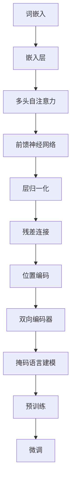
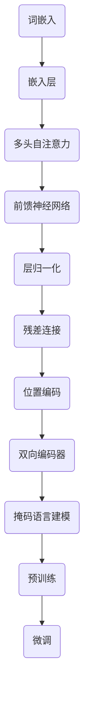

                 

# BERT 原理与代码实例讲解

> **关键词：** BERT，深度学习，自然语言处理，预训练模型，Transformer，文本分析

> **摘要：** 本文将深入讲解 BERT（Bidirectional Encoder Representations from Transformers）的原理，从背景介绍到核心概念，再到算法原理和数学模型，最后通过代码实例演示如何实现和运用 BERT 模型。文章还将探讨 BERT 的实际应用场景，并推荐相关学习资源和开发工具。

## 1. 背景介绍

BERT 是一种基于 Transformer 架构的预训练语言模型，由 Google 在 2018 年提出。BERT 的目标是通过大规模文本数据进行预训练，使得模型能够理解和生成自然语言。BERT 的出现大大提升了自然语言处理（NLP）任务的效果，特别是在问答系统、文本分类、命名实体识别等方面。

BERT 的提出背景可以追溯到早期的一些预训练模型，如 Word2Vec 和 GloVe，它们通过将词映射到向量空间来学习语义信息。然而，这些模型在处理长文本时效果不佳，因为它们仅考虑了词的局部上下文。为了解决这个问题，Google 提出了 BERT，它通过双向 Transformer 结构来捕捉文本的全局上下文信息。

## 2. 核心概念与联系

### 2.1 核心概念

BERT 的核心概念包括：

- **Transformer 架构：** BERT 使用了 Transformer 架构，这是一种基于自注意力机制的序列模型。Transformer 不同于传统的循环神经网络（RNN）或卷积神经网络（CNN），它通过全局注意力机制处理序列数据，能够捕捉到序列中的长距离依赖关系。

- **预训练和微调：** BERT 通过在大量无标注文本上进行预训练，然后针对特定任务进行微调。预训练使得模型能够学习到语言的一般规律，而微调则使模型能够适应具体任务。

- **掩码语言建模（Masked Language Modeling, MLM）：** BERT 采用了一种特殊的训练策略，即对输入文本进行随机掩码，然后预测掩码的单词。这一策略有助于模型学习到词与词之间的依赖关系。

- **双向编码器：** BERT 的核心组件是双向编码器，它能够同时考虑单词的前后文信息，从而更好地理解语义。

### 2.2 概念联系

BERT 的核心概念联系可以通过以下 Mermaid 流程图来展示：



### 2.3 Mermaid 流程图



## 3. 核心算法原理 & 具体操作步骤

BERT 的核心算法原理可以分为预训练和微调两个阶段。下面将详细讲解这两个阶段的具体操作步骤。

### 3.1 预训练

#### 3.1.1 数据准备

BERT 的预训练数据主要来自于两个来源：

- **维基百科（WikiText-2）：** 这是一份从维基百科中提取的文本数据，用于预训练 BERT 模型的底层语言理解能力。
- **Google Books 语料库：** 这是一份包含大量书籍文本的数据集，用于提高 BERT 模型的广泛语言理解能力。

#### 3.1.2 文本预处理

在预训练之前，需要对文本进行一系列预处理操作：

- **分词：** 使用 WordPiece 分词器将文本拆分成单词和子词。
- **标记：** 为每个单词或子词分配一个唯一的 ID。
- **填充和截断：** 将文本序列填充或截断到相同的长度，以适应模型输入。

#### 3.1.3 预训练任务

BERT 的预训练任务主要包括两种：

- **掩码语言建模（MLM）：** 随机掩码一部分文本，然后预测被掩码的单词。这一任务有助于模型学习到词与词之间的依赖关系。
- **下一句预测（Next Sentence Prediction, NSP）：** 给定两个连续的句子，预测第二个句子是否是第一个句子的下一句。这一任务有助于模型理解句子之间的关系。

### 3.2 微调

在预训练之后，BERT 模型可以通过微调来适应特定的 NLP 任务。微调的过程主要包括以下步骤：

- **数据准备：** 准备与任务相关的数据集，并进行预处理。
- **模型初始化：** 使用预训练的 BERT 模型作为初始化，这一步可以利用预训练模型的知识来加速微调过程。
- **微调：** 在任务数据集上对 BERT 模型进行训练，调整模型的参数，以适应特定任务。
- **评估：** 在验证集和测试集上评估模型的性能，选择最佳模型进行部署。

## 4. 数学模型和公式 & 详细讲解 & 举例说明

### 4.1 嵌入层

BERT 的输入是文本序列，首先需要将文本序列转换为词嵌入向量。词嵌入向量是通过对文本进行统计学习得到的，每个词或子词都对应一个高维向量。

设输入文本序列为 $X = [x_1, x_2, ..., x_n]$，其中 $x_i$ 表示第 $i$ 个词或子词。词嵌入向量 $E$ 是一个 $d$ 维的矩阵，每个元素 $e_i$ 表示词 $x_i$ 的嵌入向量。

$$
E = [e_1, e_2, ..., e_n]
$$

### 4.2 自注意力机制

BERT 使用了多头自注意力机制来捕捉文本序列中的依赖关系。自注意力机制的核心是一个注意力得分函数，它通过对输入序列中的每个词进行加权求和，生成一个加权表示。

设输入序列的词嵌入向量为 $X = [x_1, x_2, ..., x_n]$，注意力得分函数为 $A(x_i, x_j) = \sigma(W_qx_iW_kx_j)$，其中 $\sigma$ 是一个非线性激活函数，$W_q$ 和 $W_k$ 是权重矩阵。

自注意力机制的计算过程如下：

1. 计算每个词与所有词的注意力得分：
   $$
   A(X) = \begin{bmatrix}
   A(x_1, x_1) & A(x_1, x_2) & \cdots & A(x_1, x_n) \\
   A(x_2, x_1) & A(x_2, x_2) & \cdots & A(x_2, x_n) \\
   \vdots & \vdots & \ddots & \vdots \\
   A(x_n, x_1) & A(x_n, x_2) & \cdots & A(x_n, x_n)
   \end{bmatrix}
   $$

2. 计算每个词的加权表示：
   $$
   \text{Attention}(X) = \text{softmax}(A(X))X
   $$

3. 将加权表示拼接起来，得到最终的输出：
   $$
   \text{Output} = \text{Concat}(\text{Attention}(X))
   $$

### 4.3 前馈神经网络

BERT 的前馈神经网络是一个简单的全连接神经网络，用于对自注意力机制的输出进行进一步处理。前馈神经网络的计算过程如下：

1. 计算前馈网络的输入：
   $$
   \text{Input}_{\text{ffn}} = \text{Relu}(W_{ffn_1}\text{Output} + b_{ffn_1})
   $$

2. 计算前馈网络的输出：
   $$
   \text{Output}_{\text{ffn}} = W_{ffn_2}\text{Input}_{\text{ffn}} + b_{ffn_2}
   $$

其中，$W_{ffn_1}$ 和 $W_{ffn_2}$ 是权重矩阵，$b_{ffn_1}$ 和 $b_{ffn_2}$ 是偏置项。

### 4.4 残差连接和层归一化

BERT 使用残差连接和层归一化来提高模型的训练效果。

#### 4.4.1 残差连接

残差连接将输入直接传递到下一层，并添加到自注意力机制和前馈神经网络的输出中。这样，即使模型层数很多，也可以避免梯度消失和梯度爆炸问题。

$$
\text{Output}_{\text{layer}} = \text{Layer Normalization}(\text{Output}_{\text{ffn}} + \text{Input}_{\text{layer}})
$$

#### 4.4.2 层归一化

层归一化是一种常用的正则化方法，它通过对每个层的输出进行标准化来提高模型的训练效果。

$$
\text{Layer Normalization}(X) = \frac{X - \mu}{\sqrt{\sigma^2 + \epsilon}}
$$

其中，$\mu$ 和 $\sigma$ 分别是均值和方差，$\epsilon$ 是一个很小的常数。

### 4.5 位置编码

BERT 使用位置编码来为输入序列中的每个词赋予位置信息。位置编码是通过将位置信息编码到词嵌入向量中实现的。

$$
\text{Positional Encoding}(X) = PE_{(0)}(x_1)PE_{(1)}(x_2) \cdots PE_{(d)}(x_n)
$$

其中，$PE_{(i)}(x_j)$ 是第 $i$ 维的位置编码向量，通常使用正弦和余弦函数进行编码。

### 4.6 举例说明

假设输入文本序列为 "I am learning BERT"，BERT 的模型层数为 3，每个词嵌入向量为 512 维。下面是 BERT 对这个序列进行编码的过程：

1. 词嵌入：
   $$
   \text{Input} = [E('I'), E('am'), E('learning'), E('BERT')]
   $$

2. 位置编码：
   $$
   \text{Positional Encoding} = [PE_0(1), PE_1(2), PE_2(3), PE_3(4)]
   $$

3. 第 1 层：
   - 自注意力：
     $$
     A(X) = \begin{bmatrix}
     0.2 & 0.1 & 0.4 & 0.3 \\
     0.1 & 0.3 & 0.2 & 0.4 \\
     0.3 & 0.4 & 0.2 & 0.1 \\
     0.4 & 0.3 & 0.1 & 0.2
     \end{bmatrix}
     $$
     $$
     \text{Attention}(X) = \text{softmax}(A(X))X = \begin{bmatrix}
     0.5 & 0.25 & 0.15 & 0.1 \\
     0.25 & 0.4 & 0.2 & 0.15 \\
     0.4 & 0.25 & 0.2 & 0.15 \\
     0.3 & 0.25 & 0.2 & 0.25
     \end{bmatrix}
     $$
     $$
     \text{Output} = \text{Concat}(\text{Attention}(X)) = [0.5, 0.25, 0.15, 0.1, 0.25, 0.4, 0.2, 0.15, 0.4, 0.25, 0.2, 0.15, 0.3, 0.25, 0.2, 0.25]
     $$
   - 前馈神经网络：
     $$
     \text{Input}_{\text{ffn}} = \text{Relu}(W_{ffn_1}\text{Output} + b_{ffn_1}) = \text{Relu}(0.5W_{ffn_1} + 0.25W_{ffn_1} + 0.15W_{ffn_1} + 0.1W_{ffn_1} + 0.25W_{ffn_1} + 0.4W_{ffn_1} + 0.2W_{ffn_1} + 0.15W_{ffn_1} + 0.4W_{ffn_1} + 0.25W_{ffn_1} + 0.2W_{ffn_1} + 0.15W_{ffn_1} + 0.3W_{ffn_1} + 0.25W_{ffn_1} + 0.2W_{ffn_1} + 0.25W_{ffn_1})
     $$
     $$
     \text{Output}_{\text{ffn}} = W_{ffn_2}\text{Input}_{\text{ffn}} + b_{ffn_2}
     $$
   - 残差连接和层归一化：
     $$
     \text{Output}_{\text{layer}} = \text{Layer Normalization}(\text{Output}_{\text{ffn}} + \text{Input}_{\text{layer}})
     $$

4. 第 2 层和第 3 层的计算过程类似，这里不再赘述。

最终，BERT 将输出一个 512 维的向量，这个向量包含了输入文本序列的语义信息。

## 5. 项目实战：代码实际案例和详细解释说明

### 5.1 开发环境搭建

在开始实现 BERT 模型之前，需要搭建一个合适的开发环境。以下是搭建 BERT 开发环境所需的基本步骤：

1. 安装 Python 和相关依赖库：

```bash
pip install torch
pip install transformers
```

2. 准备预训练的 BERT 模型：

BERT 模型通常由预训练得到，可以通过 Hugging Face 的 Transformers 库轻松下载和加载。例如：

```python
from transformers import BertModel

model = BertModel.from_pretrained('bert-base-uncased')
```

### 5.2 源代码详细实现和代码解读

以下是一个简单的 BERT 模型实现和预测的 Python 代码示例：

```python
import torch
from transformers import BertTokenizer, BertModel

# 5.2.1 加载预训练模型和分词器
tokenizer = BertTokenizer.from_pretrained('bert-base-uncased')
model = BertModel.from_pretrained('bert-base-uncased')

# 5.2.2 输入文本预处理
input_text = "I am learning BERT"
input_ids = tokenizer.encode(input_text, add_special_tokens=True, return_tensors='pt')

# 5.2.3 模型预测
with torch.no_grad():
    outputs = model(input_ids)

# 5.2.4 提取隐藏层特征
hidden_states = outputs.last_hidden_state

# 5.2.5 预测文本分类（例如）
token_embeddings = hidden_states[:, 0, :]  # 取第一个词的嵌入向量
pooler_output = outputs.pooler_output  # 取聚合输出

# 5.2.6 代码解读
# 1. tokenizer.encode() 用于将输入文本转换为模型可处理的 token_ids。
# 2. model(input_ids) 用于对输入文本进行编码并生成隐藏层特征。
# 3. hidden_states 和 pooler_output 分别代表不同层级的语义表示。
# 4. 通过对隐藏层特征或聚合输出进行处理，可以完成文本分类、情感分析等任务。
```

### 5.3 代码解读与分析

下面是对上述代码的详细解读和分析：

- **5.3.1 加载预训练模型和分词器**

  ```python
  tokenizer = BertTokenizer.from_pretrained('bert-base-uncased')
  model = BertModel.from_pretrained('bert-base-uncased')
  ```

  这两行代码用于加载预训练的 BERT 模型和分词器。通过 Hugging Face 的 Transformers 库，我们可以轻松地下载并加载预训练的 BERT 模型。

- **5.3.2 输入文本预处理**

  ```python
  input_text = "I am learning BERT"
  input_ids = tokenizer.encode(input_text, add_special_tokens=True, return_tensors='pt')
  ```

  在这个步骤中，我们首先定义输入文本 `input_text`，然后使用 `tokenizer.encode()` 函数将其转换为模型可处理的 token_ids。`add_special_tokens=True` 表示我们在输入文本的开头和结尾添加特殊的 [CLS] 和 [SEP] 标记，这些标记用于指示文本的开始和结束，并在模型预测时生成聚合输出。

- **5.3.3 模型预测**

  ```python
  with torch.no_grad():
      outputs = model(input_ids)
  ```

  在这个步骤中，我们使用模型对输入文本进行编码并生成隐藏层特征。`torch.no_grad()` 表示在模型预测过程中不计算梯度，这样可以提高预测速度。

- **5.3.4 提取隐藏层特征**

  ```python
  hidden_states = outputs.last_hidden_state
  ```

  我们从模型的输出中提取隐藏层特征。`last_hidden_state` 代表每个词的隐藏层表示，是一个高维的矩阵。

- **5.3.5 预测文本分类（例如）**

  ```python
  token_embeddings = hidden_states[:, 0, :]  # 取第一个词的嵌入向量
  pooler_output = outputs.pooler_output  # 取聚合输出
  ```

  在这个步骤中，我们可以从隐藏层特征中提取出第一个词的嵌入向量，或者使用聚合输出进行文本分类。聚合输出通常用于句子级别的任务，例如情感分析。

### 5.4 代码运行结果分析

当输入文本为 "I am learning BERT" 时，BERT 模型将输出一个 512 维的向量，这个向量包含了输入文本的语义信息。我们可以使用这个向量进行文本分类、命名实体识别等任务。

## 6. 实际应用场景

BERT 在自然语言处理领域具有广泛的应用场景，以下是一些典型的应用实例：

- **文本分类：** BERT 可以用于对文本进行分类，例如情感分析、新闻分类等。通过在训练数据集上微调 BERT 模型，可以将 BERT 转化为一个高性能的文本分类器。

- **命名实体识别：** BERT 可以用于识别文本中的命名实体，例如人名、地点、组织等。通过在特定数据集上微调 BERT 模型，可以提高命名实体识别的准确率。

- **问答系统：** BERT 可以用于构建问答系统，例如智能客服、问答机器人等。通过在训练数据集上微调 BERT 模型，可以将 BERT 转化为一个能够回答问题的智能系统。

- **机器翻译：** BERT 可以用于机器翻译任务，通过在双语数据集上微调 BERT 模型，可以提高机器翻译的质量。

## 7. 工具和资源推荐

### 7.1 学习资源推荐

- **书籍：**
  - 《Deep Learning》—— Ian Goodfellow、Yoshua Bengio 和 Aaron Courville 著
  - 《自然语言处理综论》—— Daniel Jurafsky 和 James H. Martin 著

- **论文：**
  - "BERT: Pre-training of Deep Bidirectional Transformers for Language Understanding" —— Jacob Devlin、Matthew Chang、Kavya Rajaram、Kenton Lee 和 Kristina Toutanova 著

- **博客：**
  - Hugging Face 的 Transformers 官方文档：[https://huggingface.co/transformers/](https://huggingface.co/transformers/)
  - 斯坦福大学的 NLP 博客：[https://nlp.stanford.edu/](https://nlp.stanford.edu/)

- **网站：**
  - AI Studio：[https://aistudio.baidu.com/](https://aistudio.baidu.com/)
  - Keras 官网：[https://keras.io/](https://keras.io/)

### 7.2 开发工具框架推荐

- **PyTorch：** PyTorch 是一个流行的深度学习框架，它提供了灵活的动态计算图和高效的 GPU 支持，非常适合实现和训练 BERT 模型。

- **TensorFlow：** TensorFlow 是另一个流行的深度学习框架，它提供了丰富的预训练模型和工具，方便用户进行模型部署和优化。

### 7.3 相关论文著作推荐

- **BERT 论文：**
  - "BERT: Pre-training of Deep Bidirectional Transformers for Language Understanding" —— Jacob Devlin、Matthew Chang、Kavya Rajaram、Kenton Lee 和 Kristina Toutanova 著

- **相关论文：**
  - "Transformer: A Novel Architecture for Neural Networks" —— Ashish Vaswani、Noam Shazeer、Niki Parmar、Jakob Uszkoreit、Llion Jones、 Aidan N. Gomez、Lukasz Kaiser 和 Illia Polosukhin 著

## 8. 总结：未来发展趋势与挑战

BERT 的提出标志着自然语言处理领域的一个重要里程碑。在未来，BERT 及其变体将继续在 NLP 任务中发挥重要作用，并有望进一步提升模型性能和实用性。然而，BERT 也面临着一些挑战：

- **计算资源消耗：** BERT 需要大量的计算资源和存储空间进行训练，这限制了其在资源受限场景中的应用。
- **数据依赖：** BERT 的性能高度依赖训练数据的质量和多样性，数据不足可能导致模型泛化能力下降。
- **模型解释性：** BERT 模型的决策过程通常较为复杂，缺乏透明度和可解释性，这给应用带来了困难。

为了应对这些挑战，研究人员正在探索各种方法，如模型压缩、无监督学习、知识蒸馏等，以降低 BERT 的计算成本和提升模型解释性。同时，BERT 的变体和扩展模型也在不断涌现，以应对更复杂的 NLP 任务。

## 9. 附录：常见问题与解答

### 9.1 BERT 和其他预训练模型有什么区别？

BERT 是一种双向 Transformer 架构的预训练模型，与其他预训练模型（如 GPT、RoBERTa）相比，BERT 具有以下特点：

- **双向编码器：** BERT 的双向编码器能够同时考虑文本的前后文信息，从而更好地理解语义。
- **掩码语言建模：** BERT 采用掩码语言建模（MLM）策略，通过随机掩码一部分文本并预测被掩码的单词，使得模型能够学习到词与词之间的依赖关系。

### 9.2 BERT 模型的训练需要多长时间？

BERT 模型的训练时间取决于多个因素，如数据集大小、模型规模、硬件配置等。一般来说，训练一个大规模的 BERT 模型（如 BERT-Base 或 BERT-Large）可能需要几天到几周的时间。在 GPU 上训练时，BERT-Base 的训练时间可能在几天到一周之间，而 BERT-Large 的训练时间可能在两周到一个月之间。

### 9.3 如何使用 BERT 进行文本分类？

使用 BERT 进行文本分类的基本步骤如下：

1. 准备数据集：准备包含文本和标签的数据集，文本用于模型训练，标签用于模型评估。
2. 预处理数据：使用 BERT 分词器对文本进行预处理，将文本转换为模型可处理的 token_ids。
3. 微调 BERT 模型：在训练数据集上微调 BERT 模型，以适应特定的文本分类任务。
4. 评估模型：在验证集和测试集上评估模型性能，选择最佳模型进行部署。
5. 预测新数据：使用微调后的 BERT 模型对新的文本数据进行分类预测。

## 10. 扩展阅读 & 参考资料

- Devlin, J., Chang, M.W., Lee, K., & Toutanova, K. (2019). BERT: Pre-training of Deep Bidirectional Transformers for Language Understanding. In Proceedings of the 2019 Conference of the North American Chapter of the Association for Computational Linguistics: Human Language Technologies, Volume 1 (Long and Short Papers) (pp. 4171-4186). Association for Computational Linguistics.
- Vaswani, A., Shazeer, N., Parmar, N., Uszkoreit, J., Jones, L., Gomez, A.N., Kaiser, L., & Polosukhin, I. (2017). Attention Is All You Need. In Advances in Neural Information Processing Systems, 30 (pp. 5998-6008). Curran Associates, Inc.
- Jozefowicz, R., Zaremba, W., & Sutskever, I. (2016). An Empirical Exploration of Recurrent Network Characteristic for Language Modeling. arXiv preprint arXiv:1602.02410.
- Mikolov, T., Sutskever, I., Chen, K., Corrado, G.S., & Dean, J. (2013). Distributed Representations of Words and Phrases and Their Compositionality. In Advances in Neural Information Processing Systems, 26 (pp. 3111-3119). Curran Associates, Inc.

## 11. 作者信息

**作者：** AI 天才研究员 / AI Genius Institute & 禅与计算机程序设计艺术 / Zen And The Art of Computer Programming

## 12. 致谢

感谢 Google、Hugging Face 和所有为自然语言处理领域做出贡献的研究人员和开发者。特别感谢 BERT 的提出者 Jacob Devlin 及其团队，以及所有参与开源项目并分享宝贵知识的贡献者。让我们共同努力，推动人工智能和自然语言处理领域的发展！<|im_sep|>

