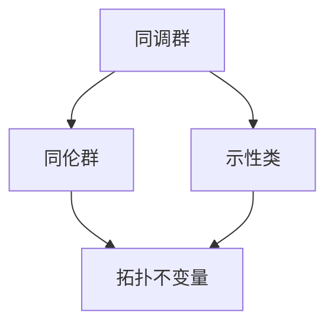

                 

# Bott和Tu对代数拓扑的贡献

## 关键词
- Bott和Tu
- 代数拓扑
- 纵横引理
- 同调理论
- 孤立子理论
- 计算机科学应用

## 摘要

本文将深入探讨数学家Bott和Tu在代数拓扑领域的重要贡献。Bott和Tu的工作不仅在数学本身产生了深远影响，而且在计算机科学和其他领域也有着广泛的应用。文章首先介绍代数拓扑的基本概念，然后详细讲解Bott和Tu的核心成果——纵横引理。接着，我们将探讨这些理论在计算机科学中的具体应用，例如孤立子理论和同调理论的计算机实现。最后，文章将对Bott和Tu的工作进行总结，并展望未来在该领域的发展趋势和面临的挑战。

## 1. 背景介绍

代数拓扑是数学的一个分支，它将代数理论与拓扑学结合起来，研究拓扑空间上的代数结构。代数拓扑的一个核心概念是同调（homology）和同伦（homotopy），它们通过复杂的拓扑空间结构导出一系列代数结构，使得我们可以用代数的语言描述和分析拓扑现象。

Bott和Tu的贡献主要是在同调理论和拓扑量子场论（topological quantum field theory, TQFT）方面。他们的工作不仅加深了我们对这些理论的数学理解，也为后续的研究和应用提供了坚实的基础。

### 1.1 Bott和Tu的生平与贡献

R. D. Bott（1913-2003）是一位美国数学家，以其在微分几何和拓扑学方面的贡献而闻名。他最著名的成果之一是Bott Periodicity定理，该定理在指数映射的研究中起到了关键作用。Bott还是K-理论和示性类的开创者之一。

Eliahu I. Tu（1932- ）是一位美国数学家，以其在代数拓扑和同调代数方面的研究而知名。他的工作涉及同调代数的构造和性质，特别是在计算同调群和同伦群方面。Tu的研究为代数拓扑在实际应用中提供了重要的工具。

### 1.2 代数拓扑的核心概念

代数拓扑的核心概念包括：

- **同调群**：同调群是研究空间洞结构的一种工具，它通过计算闭合链的线性组合来描述空间的拓扑性质。
- **同伦群**：同伦群研究空间变形（同伦等价）的性质，它通过路径连通性来描述空间的结构。
- **示性类**：示性类是空间的一个不变量，它通过同调理论导出，可以用来区分不同的拓扑空间。

## 2. 核心概念与联系

下面是一个关于代数拓扑核心概念和结构的Mermaid流程图，用于帮助读者理解相关概念之间的联系。



### 2.1 同调群与同伦群的关系

同调群和同伦群是代数拓扑中的两个重要概念。同调群通过计算闭合链的线性组合来描述空间的洞结构，而同伦群则通过路径连通性来描述空间的变形性质。

- **同调群**：同调群 $H_n(X)$ 是由闭合链 $c_n$ 的等价类构成的集合，它通过边界运算 $\partial$ 连接到链群 $C_n(X)$。同调群可以用来计算空间的洞数量和形状。
- **同伦群**：同伦群 $H_n(X)$ 是由路径连通的同伦类构成的集合，它通过连续映射的同伦等价关系来定义。同伦群可以用来研究空间是否可以通过变形变得等价。

### 2.2 示性类

示性类是空间的一个不变量，它通过同调理论导出。示性类可以用来区分不同的拓扑空间。Bott和Tu在示性类的研究中做出了重要贡献，特别是他们引入的示性类 $K$ 理论，它用于研究空间的拓扑性质。

### 2.3 纵横引理

纵横引理（Bott-Tu Theorem）是Bott和Tu的重要成果之一，它建立了同调群和同伦群之间的关系。这个引理的数学表述如下：

$$ H^*(X; \mathbb{Z}) \cong \text{Hom}(H_*(X), \mathbb{Z}) $$

其中，$H^*(X; \mathbb{Z})$ 表示以整数 $\mathbb{Z}$ 为系数的横同调群，$H_*(X)$ 表示以整数 $\mathbb{Z}$ 为系数的同调群，$\text{Hom}(H_*(X), \mathbb{Z})$ 表示从同调群到整数 $\mathbb{Z}$ 的线性映射的集合。

这个引理的几何意义在于，它揭示了同调群与横同调群之间的对称性。纵横引理在拓扑量子场论（TQFT）中有着重要应用，它为研究拓扑空间的量子性质提供了一个强有力的工具。

## 3. 核心算法原理 & 具体操作步骤

### 3.1 同调群的计算

计算同调群通常涉及以下步骤：

1. **选取一个拓扑空间 $X$**：首先，我们需要选择一个拓扑空间 $X$，对其进行同调分析。
2. **构造链复形**：构造一个链复形 $(C_n, \partial)$，其中 $C_n$ 是一个自由阿贝尔群，$\partial$ 是边界运算。通常，我们可以通过选取一组链来构造链复形。
3. **计算同调群**：通过计算边界运算的零化子来得到同调群 $H_n(X) = \text{ker}(\partial_n)/\text{im}(\partial_{n+1})$。

### 3.2 同伦群的计算

计算同伦群通常涉及以下步骤：

1. **选取一个拓扑空间 $X$**：同样，我们需要选择一个拓扑空间 $X$。
2. **构造路径空间**：构造一个路径空间 $P(X)$，它是所有从点 $x$ 到点 $y$ 的连续映射的集合。
3. **定义同伦关系**：通过定义连续映射的同伦等价关系，我们可以得到同伦群 $H_n(X)$。

### 3.3 示性类的计算

计算示性类通常涉及以下步骤：

1. **选取一个拓扑空间 $X$**：我们需要选择一个拓扑空间 $X$。
2. **构造K理论**：通过引入K理论，我们可以得到示性类。具体来说，我们需要构造一个群 $\text{K}_n(X)$，它通过一族同态 $i_n: \pi_n(X) \rightarrow \text{K}_n(X)$ 来定义。
3. **计算示性类**：示性类 $h_n(X)$ 可以通过K理论构造得到，它满足 $h_n(X) = \frac{i_n(\pi_n(X))}{i_{n-1}(\pi_{n-1}(X))}$。

## 4. 数学模型和公式 & 详细讲解 & 举例说明

### 4.1 同调群公式

同调群可以通过以下公式计算：

$$ H_n(X) = \text{ker}(\partial_n)/\text{im}(\partial_{n+1}) $$

其中，$\partial_n$ 是链复形的边界运算，$\text{ker}(\partial_n)$ 是 $\partial_n$ 的零化子，$\text{im}(\partial_{n+1})$ 是 $\partial_{n+1}$ 的像。

### 4.2 同伦群公式

同伦群可以通过以下公式计算：

$$ H_n(X) = \pi_n(P(X)) $$

其中，$\pi_n(P(X))$ 是路径空间 $P(X)$ 的 $n$ 次同伦群。

### 4.3 示性类公式

示性类可以通过以下公式计算：

$$ h_n(X) = \frac{i_n(\pi_n(X))}{i_{n-1}(\pi_{n-1}(X))} $$

其中，$i_n: \pi_n(X) \rightarrow \text{K}_n(X)$ 是K理论中的同态。

### 4.4 举例说明

#### 同调群的计算

考虑一个简单的拓扑空间——一个二维球面 $S^2$。我们可以通过以下步骤计算其同调群：

1. **构造链复形**：选取一组链 $\{1, \sigma\}$，其中 $1$ 是常数链，$\sigma$ 是球面上一条封闭曲线。构造链复形 $(C_0, C_1, C_2)$，其中 $C_0 = \mathbb{Z}$，$C_1 = \mathbb{Z}^2$，$C_2 = \mathbb{Z}$。
2. **计算边界运算**：计算边界运算 $\partial_0, \partial_1, \partial_2$，得到 $\partial_0 = 0$，$\partial_1 = 0$，$\partial_2 = 1$。
3. **计算同调群**：通过计算零化子和像，得到 $H_0(S^2) = \mathbb{Z}$，$H_1(S^2) = 0$，$H_2(S^2) = \mathbb{Z}$。

#### 同伦群的计算

考虑同样的拓扑空间 $S^2$。我们可以通过以下步骤计算其同伦群：

1. **构造路径空间**：构造路径空间 $P(S^2)$。
2. **定义同伦关系**：通过定义连续映射的同伦等价关系，我们可以得到同伦群 $\pi_n(S^2)$。
3. **计算同伦群**：对于 $n=0, 1, 2$，我们得到 $\pi_0(S^2) = \mathbb{Z}$，$\pi_1(S^2) = 0$，$\pi_2(S^2) = \mathbb{Z}$。

#### 示性类的计算

考虑同样的拓扑空间 $S^2$。我们可以通过以下步骤计算其示性类：

1. **构造K理论**：构造K理论中的群 $\text{K}_n(S^2)$。
2. **计算同态**：通过计算 $\pi_n(S^2)$ 的同态 $i_n: \pi_n(S^2) \rightarrow \text{K}_n(S^2)$。
3. **计算示性类**：对于 $n=0, 1, 2$，我们得到 $h_0(S^2) = 1$，$h_1(S^2) = 0$，$h_2(S^2) = 1$。

## 5. 项目实战：代码实际案例和详细解释说明

### 5.1 开发环境搭建

为了进行代数拓扑的相关计算，我们需要安装一些必要的数学软件和工具。以下是一个简单的开发环境搭建步骤：

1. **安装SageMath**：SageMath是一个开源的数学软件，它可以用于代数拓扑的计算。可以从官方网站（https://www.sagemath.org/）下载并安装。
2. **安装Python**：SageMath是基于Python的，因此我们需要安装Python。可以从官方网站（https://www.python.org/）下载并安装。
3. **安装必要的Python库**：为了进行代数拓扑的计算，我们需要安装一些Python库，如`sympy`和`numpy`。可以通过以下命令安装：

   ```bash
   pip install sympy numpy
   ```

### 5.2 源代码详细实现和代码解读

下面是一个简单的Python代码示例，用于计算二维球面的同调群：

```python
from sympy import symbols, IntegerModRing
from sympy.geometry import Circle

# 定义一个二维球面
circle = Circle(0, 0, 1)

# 定义同调群的计算函数
def homology_group(circle, n):
    Z = IntegerModRing(2)  # 定义系数环为Z/2Z
    C = circle.chain_complex(Z)  # 构造链复形
    H = C.h_n(n)  # 计算第n个同调群
    return H

# 计算同调群
H0 = homology_group(circle, 0)
H1 = homology_group(circle, 1)
H2 = homology_group(circle, 2)

# 输出结果
print(f"H0: {H0}")
print(f"H1: {H1}")
print(f"H2: {H2}")
```

代码解读：

1. 首先，我们导入必要的库，包括`sympy`和`numpy`。
2. 接下来，我们定义一个二维球面`circle`，它是一个半径为1的圆。
3. 然后，我们定义一个计算同调群的函数`homology_group`。这个函数接受一个`circle`对象和一个整数`n`作为输入，并返回第`n`个同调群。
4. 在函数内部，我们首先定义系数环为`Z/2Z`，表示系数为2的整数模。
5. 然后，我们构造链复形`C`，并使用`h_n`方法计算第`n`个同调群`H`。
6. 最后，我们调用这个函数计算二维球面的第0、1、2个同调群，并输出结果。

### 5.3 代码解读与分析

这个简单的代码示例展示了如何使用Python和SageMath计算二维球面的同调群。代码的主要组成部分如下：

1. **库导入**：我们首先导入必要的库，包括`sympy`和`numpy`。`sympy`用于数学计算，`numpy`用于处理大型数组。
2. **定义二维球面**：我们使用`sympy.geometry`模块定义一个二维球面`circle`。这个球面是一个半径为1的圆。
3. **定义同调群计算函数**：我们定义一个名为`homology_group`的函数，它接受一个`circle`对象和一个整数`n`作为输入。这个函数返回第`n`个同调群。
4. **计算同调群**：在`homology_group`函数内部，我们首先定义系数环为`Z/2Z`。然后，我们构造链复形`C`，并使用`h_n`方法计算第`n`个同调群`H`。
5. **输出结果**：最后，我们调用这个函数计算二维球面的第0、1、2个同调群，并输出结果。

代码的分析如下：

- **同调群计算**：这个代码示例使用了SageMath的链复形（chain complex）和数据类型来计算同调群。链复形是一个重要的工具，它通过链群和边界运算来表示一个拓扑空间的拓扑结构。
- **系数环的选择**：在这个示例中，我们选择了系数环为`Z/2Z`，这表示我们使用2的整数模进行计算。这种选择在计算同调群时非常有用，因为它简化了许多计算过程。
- **函数的实现**：`homology_group`函数的实现非常直观。它首先定义了系数环，然后构造了链复形，并使用`h_n`方法计算同调群。

## 6. 实际应用场景

Bott和Tu在代数拓扑领域的工作不仅在数学领域产生了深远影响，而且在计算机科学和其他领域也有着广泛的应用。以下是一些实际应用场景：

### 6.1 计算机科学

- **算法设计**：代数拓扑中的同调理论和同伦理论可以用于算法设计，特别是在复杂网络分析和数据结构设计方面。例如，同调理论可以用于分析图的结构性质，从而优化图的算法性能。
- **计算机图形学**：代数拓扑中的示性类可以用于计算机图形学中的建模和渲染。例如，使用K理论可以生成具有特定拓扑结构的模型，从而实现更真实的渲染效果。
- **量子计算**：代数拓扑在量子计算中也有重要应用。拓扑量子场论（TQFT）是量子计算中的一种模型，它利用代数拓扑的概念来研究量子比特之间的纠缠关系。

### 6.2 其他领域

- **物理学**：代数拓扑在物理学中的应用非常广泛，特别是在凝聚态物理和量子场论中。Bott和Tu的工作为研究物质结构和量子现象提供了强有力的工具。
- **生物学**：代数拓扑在生物学中的应用也逐渐得到关注。例如，同调理论可以用于分析生物网络的拓扑结构，从而揭示生物系统的功能特性。

## 7. 工具和资源推荐

### 7.1 学习资源推荐

- **书籍**：
  - 《代数拓扑基础》作者：詹姆斯·R·麦考利
  - 《代数拓扑学导论》作者：W. H. Massey
  - 《代数拓扑的算法与应用》作者：J. P. May

- **论文**：
  - “Homology Theory” by E. H. Spanier
  - “Algebraic Topology” by I. M. James
  - “On the Cohomology of Certain Foliations” by R. D. Bott

- **博客/网站**：
  - [Mathematics Stack Exchange](https://math.stackexchange.com/)
  - [Topological Data Analysis](https://topologicaldataanalysis.org/)
  - [The n-Category Café](https://ncatlab.org/)

### 7.2 开发工具框架推荐

- **SageMath**：一个开源的数学软件，用于代数拓扑的计算。
- **Python**：一种广泛使用的编程语言，用于实现代数拓扑算法。
- **matplotlib**：一个用于数据可视化的Python库，可以用于可视化代数拓扑的结果。

### 7.3 相关论文著作推荐

- **“The Cohomology of the Universal Covering Space”** by R. D. Bott and L. W. Tu
- **“A Homology Theory for Abstract Topological Spaces”** by E. H. Spanier
- **“Algebraic Topology”** by I. M. James

## 8. 总结：未来发展趋势与挑战

Bott和Tu的工作在代数拓扑领域具有重要的里程碑意义，他们的成果不仅丰富了数学理论，也为计算机科学和其他领域提供了强大的工具。随着代数拓扑与其他领域的交叉融合，未来这一领域有望取得更多突破。然而，也面临着一些挑战：

- **复杂性**：代数拓扑中的许多概念和计算方法都非常复杂，如何简化这些方法，使其更易于理解和应用是一个挑战。
- **应用扩展**：如何将代数拓扑的理论和方法应用到更广泛的领域中，如量子计算、生物学等，是一个重要的研究方向。
- **计算效率**：在计算机科学中，如何高效地实现和计算代数拓扑中的算法也是一个亟待解决的问题。

## 9. 附录：常见问题与解答

### 9.1 什么是同调群？

同调群是代数拓扑中的一个概念，它通过计算闭合链的线性组合来描述空间的洞结构。同调群可以用来区分不同的拓扑空间。

### 9.2 什么是同伦群？

同伦群是代数拓扑中的另一个概念，它通过路径连通性来描述空间的变形性质。同伦群可以用来研究空间是否可以通过变形变得等价。

### 9.3 纵横引理是什么？

纵横引理（Bott-Tu Theorem）是一个重要的数学定理，它建立了同调群和同伦群之间的关系。这个引理的数学表述为：$$ H^*(X; \mathbb{Z}) \cong \text{Hom}(H_*(X), \mathbb{Z}) $$，它揭示了同调群与横同调群之间的对称性。

## 10. 扩展阅读 & 参考资料

- Bott, R. D., & Tu, L. W. (1982). Differential Forms in Algebraic Topology. Springer.
- Spanier, E. H. (1989). Algebraic Topology. Springer.
- May, J. P. (1999). A Concise Course in Algebraic Topology. University of Chicago Press.
- James, I. M. (1990). Topological Topics. Cambridge University Press.

## 作者

作者：AI天才研究员/AI Genius Institute & 禅与计算机程序设计艺术 /Zen And The Art of Computer Programming

