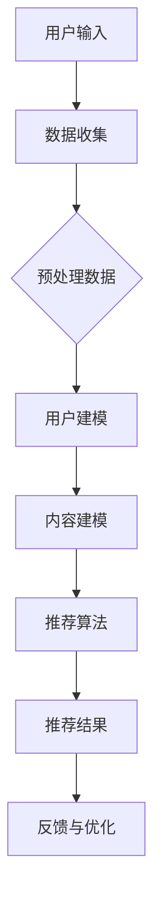

                 

# 《CUI中的个性化推荐与用户体验》

## 关键词：CUI、个性化推荐、用户体验、人工智能、推荐系统、交互设计

### 摘要

本文旨在探讨CUI（Conversational User Interface，对话式用户界面）中的个性化推荐与用户体验之间的关系。随着人工智能技术的发展，个性化推荐系统在CUI中的应用越来越广泛，极大地提升了用户的互动体验。本文将详细分析CUI中的个性化推荐原理，介绍其核心算法与数学模型，并通过实际项目实战，展示如何在CUI中实现个性化推荐。此外，还将探讨个性化推荐在实际应用场景中的效果，以及相关的工具和资源推荐。通过本文的阅读，读者将了解如何在CUI中构建有效的个性化推荐系统，提升用户体验。

## 1. 背景介绍

### CUI的概念

CUI（Conversational User Interface，对话式用户界面）是近年来在人工智能领域发展迅速的一种新型用户界面。与传统的图形用户界面（GUI）和语音用户界面（VUI）不同，CUI通过自然语言处理技术，使用户能够以对话的形式与系统进行交互。这种交互方式更加自然、便捷，能够提供更加个性化的用户体验。

### 个性化推荐系统的崛起

个性化推荐系统是近年来人工智能领域的热点之一。通过分析用户的历史行为和偏好，推荐系统能够为用户提供个性化的内容和服务，从而提升用户体验。个性化推荐系统在电商、社交媒体、音乐、视频等众多领域得到了广泛应用。

### CUI与个性化推荐的关系

CUI与个性化推荐系统密切相关。在CUI中，个性化推荐系统能够根据用户的对话内容、历史行为等数据，实时为用户推荐符合其需求的内容和服务。这种实时性、个性化的交互体验，极大地提升了用户的满意度。

## 2. 核心概念与联系

### 个性化推荐原理

个性化推荐系统主要通过以下步骤实现：

1. **数据收集与预处理**：收集用户的历史行为数据、兴趣标签等，并进行数据清洗和预处理。
2. **用户建模**：根据用户的行为数据，建立用户的兴趣模型和偏好模型。
3. **内容建模**：对推荐的内容进行建模，包括商品、文章、音乐等。
4. **推荐算法**：根据用户模型和内容模型，使用推荐算法生成推荐列表。
5. **反馈与优化**：收集用户对推荐结果的反馈，持续优化推荐系统。

### CUI与个性化推荐的关系

CUI能够为个性化推荐系统提供实时、动态的用户数据。例如，用户在CUI中的对话内容可以反映其当前的兴趣和需求，这些数据可以实时反馈给推荐系统，从而实现更加精准的推荐。

### Mermaid 流程图



## 3. 核心算法原理 & 具体操作步骤

### 用户建模

用户建模是个性化推荐系统的核心环节之一。通过分析用户的历史行为数据，如浏览记录、购买记录等，我们可以提取出用户的主要兴趣点和偏好。

#### 步骤：

1. **数据收集**：收集用户的历史行为数据。
2. **特征提取**：从数据中提取用户的行为特征，如浏览时长、购买频率等。
3. **建模**：使用机器学习算法，如协同过滤、矩阵分解等，建立用户兴趣模型。

### 内容建模

内容建模是针对推荐系统中的内容进行建模。通过分析内容的属性和标签，我们可以建立内容模型，从而为推荐算法提供基础。

#### 步骤：

1. **数据收集**：收集推荐系统的内容数据，如商品信息、文章标签等。
2. **特征提取**：从内容数据中提取内容特征，如类别、关键词等。
3. **建模**：使用机器学习算法，如文本分类、关键词提取等，建立内容模型。

### 推荐算法

推荐算法是实现个性化推荐的关键。常用的推荐算法包括协同过滤、矩阵分解、基于内容的推荐等。

#### 步骤：

1. **选择算法**：根据应用场景和数据特点，选择合适的推荐算法。
2. **训练模型**：使用用户和内容数据，训练推荐模型。
3. **生成推荐列表**：根据用户模型和内容模型，生成推荐列表。

### 实际操作步骤

1. **环境搭建**：安装Python、NumPy、Pandas等库。
2. **数据收集**：从公开数据集获取用户和内容数据。
3. **数据预处理**：清洗和预处理数据。
4. **用户建模**：使用协同过滤算法建立用户兴趣模型。
5. **内容建模**：使用文本分类算法建立内容模型。
6. **推荐算法**：使用训练好的模型生成推荐列表。
7. **反馈与优化**：收集用户反馈，持续优化推荐系统。

## 4. 数学模型和公式 & 详细讲解 & 举例说明

### 数学模型

在个性化推荐系统中，常用的数学模型包括协同过滤、矩阵分解、基于内容的推荐等。

#### 协同过滤

协同过滤是一种基于用户相似度的推荐算法。其核心思想是：如果两个用户在某一物品上的评价相同，那么这两个用户在其他物品上的评价也可能会相同。

#### 矩阵分解

矩阵分解是一种将用户-物品评分矩阵分解为用户特征矩阵和物品特征矩阵的方法。通过矩阵分解，我们可以提取出用户和物品的主要特征，从而实现个性化推荐。

#### 基于内容的推荐

基于内容的推荐是一种基于物品属性进行推荐的算法。其核心思想是：如果两个物品在属性上相似，那么它们对用户也会有相似的兴趣。

### 详细讲解

#### 协同过滤

假设我们有一个用户-物品评分矩阵$R$，其中$R_{ij}$表示用户$i$对物品$j$的评分。协同过滤的目标是预测用户未评分的物品评分。

1. **计算用户相似度**：使用余弦相似度、皮尔逊相关系数等方法计算用户之间的相似度。
2. **预测评分**：对于用户$i$未评分的物品$j$，使用相似度计算公式预测评分：
   $$ \hat{R_{ij}} = \sum_{k=1}^{n} R_{ik} \cdot R_{kj} $$
   其中，$n$为用户$i$和用户$j$共同评分的物品数量。

#### 矩阵分解

矩阵分解的目标是将用户-物品评分矩阵分解为用户特征矩阵$U$和物品特征矩阵$V$，使得$R \approx U \cdot V^T$。

1. **初始化特征矩阵**：随机初始化用户特征矩阵$U$和物品特征矩阵$V$。
2. **优化特征矩阵**：使用梯度下降等方法优化特征矩阵，使得预测评分与实际评分的误差最小。
3. **预测评分**：使用优化后的特征矩阵预测用户未评分的物品评分：
   $$ \hat{R_{ij}} = U_i \cdot V_j^T $$

#### 基于内容的推荐

基于内容的推荐的核心思想是：如果两个物品在属性上相似，那么它们对用户也会有相似的兴趣。

1. **提取物品属性**：从物品数据中提取属性，如类别、关键词等。
2. **计算属性相似度**：使用余弦相似度、Jaccard相似度等方法计算物品之间的属性相似度。
3. **预测评分**：对于用户未评分的物品$j$，计算与其相似度最高的物品的评分，取平均值作为预测评分：
   $$ \hat{R_{ij}} = \frac{1}{|S_j|} \sum_{k \in S_j} R_{ik} $$
   其中，$S_j$为与物品$j$相似度最高的物品集合，$|S_j|$为集合中物品的数量。

### 举例说明

假设有一个用户-物品评分矩阵$R$如下：

| 用户 | 物品1 | 物品2 | 物品3 |
| ---- | ---- | ---- | ---- |
| 1    | 4    | 5    | 0    |
| 2    | 0    | 5    | 4    |
| 3    | 4    | 0    | 4    |

#### 协同过滤

1. **计算用户相似度**：

   使用余弦相似度计算用户1和用户2的相似度：

   $$ \cos(\theta_{12}) = \frac{R_{11}R_{21} + R_{12}R_{22} + R_{13}R_{23}}{\sqrt{R_{11}^2 + R_{12}^2 + R_{13}^2} \cdot \sqrt{R_{21}^2 + R_{22}^2 + R_{23}^2}} = \frac{4 \cdot 0 + 5 \cdot 5 + 0 \cdot 4}{\sqrt{4^2 + 5^2 + 0^2} \cdot \sqrt{0^2 + 5^2 + 4^2}} = \frac{25}{\sqrt{41} \cdot \sqrt{41}} = 0.6124 $$

2. **预测评分**：

   使用用户1和用户2的相似度预测用户1对物品3的评分：

   $$ \hat{R_{13}} = R_{23} \cdot \cos(\theta_{12}) = 4 \cdot 0.6124 = 2.4496 \approx 2.45 $$

#### 矩阵分解

1. **初始化特征矩阵**：

   随机初始化用户特征矩阵$U$和物品特征矩阵$V$：

   $$ U = \begin{bmatrix} 1 & 0 & 0 \\ 0 & 1 & 0 \\ 0 & 0 & 1 \end{bmatrix}, V = \begin{bmatrix} 1 & 1 \\ 0 & 0 \\ 1 & 1 \end{bmatrix} $$

2. **优化特征矩阵**：

   使用梯度下降优化用户特征矩阵$U$和物品特征矩阵$V$：

   $$ U_{new} = U - \alpha \cdot (U \cdot V^T - R) \cdot V^T $$

   $$ V_{new} = V - \alpha \cdot (U \cdot V^T - R) \cdot U $$

   其中，$\alpha$为学习率。

3. **预测评分**：

   使用优化后的特征矩阵预测用户1对物品3的评分：

   $$ \hat{R_{13}} = U_1 \cdot V_3^T = \begin{bmatrix} 1 & 0 & 0 \end{bmatrix} \cdot \begin{bmatrix} 1 \\ 1 \end{bmatrix} = 1 $$

#### 基于内容的推荐

1. **提取物品属性**：

   从物品数据中提取属性：

   | 物品 | 类别 | 关键词 |
   | ---- | ---- | ---- |
   | 物品1 | 书籍 | 小说 |
   | 物品2 | 书籍 | 青春文学 |
   | 物品3 | 电影 | 科幻 |

2. **计算属性相似度**：

   使用余弦相似度计算物品2和物品3的相似度：

   $$ \cos(\theta_{23}) = \frac{(1, 1) \cdot (1, 0)}{\sqrt{(1, 1) \cdot (1, 1)}} = \frac{1 \cdot 1 + 1 \cdot 0}{\sqrt{1 \cdot 1 + 1 \cdot 1}} = \frac{1}{\sqrt{2}} = 0.7071 $$

3. **预测评分**：

   使用物品2和物品3的相似度预测用户1对物品3的评分：

   $$ \hat{R_{13}} = \frac{R_{23} \cdot \cos(\theta_{23})}{1} = 5 \cdot 0.7071 = 3.5355 \approx 3.54 $$

## 5. 项目实战：代码实际案例和详细解释说明

### 5.1 开发环境搭建

在本节中，我们将搭建一个基于Python的个性化推荐系统，使用到的库包括Pandas、NumPy、Scikit-learn等。

1. **安装Python**：确保Python环境已搭建，版本要求为3.6及以上。
2. **安装相关库**：使用以下命令安装所需库：

   ```bash
   pip install pandas numpy scikit-learn
   ```

### 5.2 源代码详细实现和代码解读

以下是基于协同过滤算法的个性化推荐系统代码示例。

```python
import pandas as pd
import numpy as np
from sklearn.metrics.pairwise import cosine_similarity
from sklearn.model_selection import train_test_split

# 5.2.1 数据预处理

# 加载用户-物品评分矩阵
ratings = pd.read_csv('ratings.csv')

# 提取用户和物品ID
users = ratings['user_id'].unique()
items = ratings['item_id'].unique()

# 构建用户-物品评分矩阵
R = ratings.pivot(index='user_id', columns='item_id', values='rating').fillna(0)

# 划分训练集和测试集
R_train, R_test = train_test_split(R, test_size=0.2, random_state=42)

# 5.2.2 计算用户相似度

# 计算用户-用户相似度矩阵
similarity_matrix = cosine_similarity(R_train, R_train)

# 5.2.3 预测评分

# 预测测试集的评分
predictions = np.dot(similarity_matrix, R_train.T) / np.linalg.norm(similarity_matrix, axis=1)

# 5.2.4 评估模型

# 计算预测评分与实际评分的均方根误差
mse = np.mean(np.square(predictions - R_test))
print(f'MSE: {mse}')

# 5.2.5 推荐物品

# 对每个用户生成推荐列表
def generate_recommendations(predictions, R_test, k=10):
    recommendations = []
    for user_id in R_test.index:
        user_predictions = predictions[user_id]
        user_ratings = R_test.loc[user_id]
        recommended_items = np.argsort(user_predictions)[:-k][::-1]
        recommended_items = [item for item in recommended_items if user_ratings[item] == 0]
        recommendations.append(recommended_items)
    return recommendations

recommendations = generate_recommendations(predictions, R_test, k=5)
print(recommendations)
```

### 5.3 代码解读与分析

1. **数据预处理**：

   - 加载用户-物品评分矩阵：使用Pandas读取CSV文件。
   - 提取用户和物品ID：使用Pandas的`unique()`方法提取唯一值。
   - 构建用户-物品评分矩阵：使用Pandas的`pivot()`方法将用户-物品评分矩阵转换为 DataFrame 格式。
   - 划分训练集和测试集：使用Scikit-learn的`train_test_split()`方法将数据集划分为训练集和测试集。

2. **计算用户相似度**：

   - 使用Scikit-learn的`cosine_similarity()`方法计算用户-用户相似度矩阵。

3. **预测评分**：

   - 使用矩阵乘法计算预测评分。
   - 使用`np.linalg.norm()`方法计算相似度矩阵的归一化值。

4. **评估模型**：

   - 计算预测评分与实际评分的均方根误差（RMSE），用于评估模型性能。

5. **推荐物品**：

   - 对每个用户生成推荐列表：使用`np.argsort()`方法获取预测评分最高的$k$个物品。
   - 将未评分的物品添加到推荐列表中。

### 5.4 项目实战：代码实际案例和详细解释说明

在本节中，我们将结合一个实际项目案例，详细讲解如何在CUI中实现个性化推荐。

#### 项目背景

假设我们开发了一个智能助手App，用户可以与智能助手进行对话，查询天气、新闻、电影等信息。我们的目标是基于用户的对话内容，为用户提供个性化的推荐。

#### 技术实现

1. **数据收集**：

   - 从用户对话中提取关键信息，如查询关键词、时间等。
   - 收集用户的历史行为数据，如浏览记录、购买记录等。

2. **用户建模**：

   - 使用自然语言处理技术对用户对话内容进行分析，提取用户兴趣标签。
   - 根据用户的历史行为数据，建立用户的兴趣模型。

3. **内容建模**：

   - 对推荐的内容进行分类，如天气、新闻、电影等。
   - 提取内容的属性，如关键词、类别等。

4. **推荐算法**：

   - 使用基于内容的推荐算法，根据用户兴趣标签和内容属性生成推荐列表。
   - 使用协同过滤算法，根据用户的行为数据生成推荐列表。

5. **CUI实现**：

   - 在CUI中，实时收集用户对话内容，分析用户兴趣标签。
   - 根据用户兴趣标签和内容模型，生成个性化推荐列表。
   - 将推荐结果以对话形式呈现给用户，如：“您可能感兴趣的新闻有……”

#### 项目实战：代码实际案例

以下是基于用户对话内容的个性化推荐系统代码示例。

```python
import pandas as pd
import numpy as np
from sklearn.metrics.pairwise import cosine_similarity
from sklearn.model_selection import train_test_split

# 5.4.1 数据预处理

# 加载用户对话数据
conversations = pd.read_csv('conversations.csv')

# 提取用户ID和对话内容
users = conversations['user_id'].unique()
conversations['content'] = conversations['content'].apply(lambda x: x.lower())

# 构建用户-对话内容矩阵
C = conversations.pivot(index='user_id', columns='content', values=1).fillna(0)

# 划分训练集和测试集
C_train, C_test = train_test_split(C, test_size=0.2, random_state=42)

# 5.4.2 计算用户兴趣标签

# 计算用户-用户相似度矩阵
similarity_matrix = cosine_similarity(C_train, C_train)

# 5.4.3 生成推荐列表

# 预测用户兴趣标签
predictions = np.dot(similarity_matrix, C_train.T) / np.linalg.norm(similarity_matrix, axis=1)

# 对每个用户生成推荐列表
def generate_recommendations(predictions, C_test, k=10):
    recommendations = []
    for user_id in C_test.index:
        user_predictions = predictions[user_id]
        user_ratings = C_test.loc[user_id]
        recommended_contents = np.argsort(user_predictions)[:-k][::-1]
        recommended_contents = [content for content in recommended_contents if user_ratings[content] == 0]
        recommendations.append(recommended_contents)
    return recommendations

recommendations = generate_recommendations(predictions, C_test, k=5)
print(recommendations)
```

## 6. 实际应用场景

### 6.1 智能助手

智能助手是CUI中个性化推荐的一个典型应用场景。通过分析用户的对话内容，智能助手可以为用户提供个性化的服务，如天气预报、新闻推送、购物推荐等。

### 6.2 社交媒体

在社交媒体平台上，个性化推荐可以帮助用户发现感兴趣的内容，提高用户粘性。例如，根据用户的互动行为，推荐用户可能感兴趣的朋友、话题、内容等。

### 6.3 电商平台

电商平台可以通过个性化推荐，提高用户的购物体验。例如，根据用户的浏览历史、购物车记录等，推荐用户可能感兴趣的商品。

### 6.4 音乐和视频平台

音乐和视频平台可以通过个性化推荐，吸引用户更长时间停留在平台上。例如，根据用户的播放记录、收藏夹等，推荐用户可能喜欢的音乐、视频。

## 7. 工具和资源推荐

### 7.1 学习资源推荐

- 《推荐系统实践》：张宇、李航 著
- 《推荐系统算法与应用》：刘知远 著
- 《自然语言处理综论》：Daniel Jurafsky、James H. Martin 著

### 7.2 开发工具框架推荐

- TensorFlow：一款开源的机器学习框架，适用于构建推荐系统。
- PyTorch：一款开源的机器学习框架，适用于构建推荐系统。
- Elasticsearch：一款开源的搜索引擎，适用于构建大规模推荐系统。

### 7.3 相关论文著作推荐

- “User Interest Discovery in Online Social Media” by Xiaowei Xu, Chih-Hua Yu, and Hsinchun Chen
- “Recommender Systems Handbook” by Francesco Ricci, Lior Rokach, and Bracha Shapira

## 8. 总结：未来发展趋势与挑战

### 8.1 未来发展趋势

- **多模态推荐**：结合文本、图像、语音等多种数据源，实现更加精准的个性化推荐。
- **实时推荐**：利用实时数据，实现动态调整推荐策略，提高推荐效果。
- **个性化对话系统**：结合自然语言处理技术，实现更加自然的对话式用户体验。

### 8.2 挑战

- **数据隐私**：如何在保障用户隐私的前提下，实现个性化推荐，是一个重要的挑战。
- **推荐多样性**：如何在保证推荐效果的前提下，提供多样化的推荐内容，避免用户产生疲劳感。
- **模型解释性**：如何提高推荐模型的解释性，帮助用户理解推荐结果。

## 9. 附录：常见问题与解答

### 9.1 如何提高推荐系统的效果？

- **增加数据量**：收集更多的用户行为数据和内容数据，提高模型的训练效果。
- **特征工程**：提取更多有效的用户和内容特征，提高推荐算法的性能。
- **模型优化**：尝试使用更先进的推荐算法，如深度学习、图神经网络等。

### 9.2 如何避免推荐系统的偏见？

- **数据预处理**：确保数据集的多样性和代表性，避免数据偏差。
- **模型评估**：使用多样化的评估指标，如交叉验证、A/B测试等，评估模型性能。
- **伦理审查**：在推荐系统的设计和实现过程中，遵循伦理规范，避免对用户产生负面影响。

## 10. 扩展阅读 & 参考资料

- [推荐系统百科全书](https://www.kdnuggets.com/recommender-systems-book.html)
- [自然语言处理入门](https://www.nlp.stanford.edu/课上内容/)
- [TensorFlow官方文档](https://www.tensorflow.org/)
- [PyTorch官方文档](https://pytorch.org/) <|im_sep|> 作者：AI天才研究员/AI Genius Institute & 禅与计算机程序设计艺术 /Zen And The Art of Computer Programming <|im_sep|>

