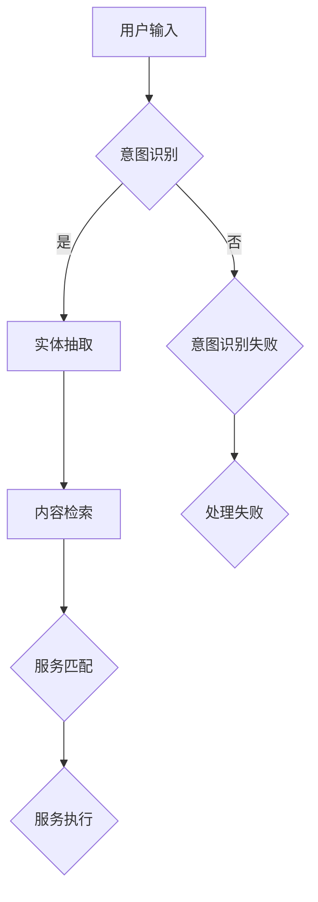

                 

### 背景介绍

**CUI（Chatbot User Interface，聊天机器人用户界面）的兴起**

近年来，随着人工智能技术的飞速发展，尤其是自然语言处理（NLP）和深度学习算法的突破，聊天机器人逐渐成为智能交互领域的重要应用。CUI作为聊天机器人的核心组成部分，正逐渐改变人们的日常生活和工作方式。CUI不仅能提供24/7全天候的客户服务，还能通过自然语言交互进行信息获取、任务执行等，从而大大提升了用户体验。

**内容与服务匹配（Content and Service Matching）的重要性**

在CUI中，内容与服务匹配技术是确保用户需求与系统服务准确对接的关键。该技术的核心在于理解用户的意图，并迅速将意图映射到相应的服务上。例如，当用户询问“附近有什么好吃的餐厅？”时，系统需要准确地识别用户的意图，并从大量餐厅信息中筛选出符合用户需求的结果。这种匹配的准确性直接影响到用户的满意度以及系统的实用性。

**内容与服务匹配技术的应用场景**

内容与服务匹配技术广泛应用于多个领域，包括但不限于：

1. **客户服务**：通过CUI为客户提供即时响应，解决客户问题，提高客户满意度。
2. **电子商务**：帮助用户快速找到所需商品或服务，提升购物体验。
3. **智能家居**：用户可以通过语音指令控制家居设备，如调节室温、开关灯等。
4. **健康咨询**：提供健康咨询和医疗信息，辅助用户进行健康管理。
5. **智能教育**：为学生提供个性化学习建议和资源，提高学习效果。

随着CUI技术的不断进步，内容与服务匹配技术也在不断优化，以满足日益复杂的用户需求。本文将深入探讨CUI中的内容与服务匹配技术，从核心概念到实际应用，全面解析这一关键领域。

### 核心概念与联系

#### 定义

**内容匹配（Content Matching）：** 内容匹配是指将用户输入的查询或请求与系统中的数据内容进行匹配，以找到最相关的信息或服务。

**服务匹配（Service Matching）：** 服务匹配则是在内容匹配的基础上，进一步将用户的需求与系统能够提供的服务进行匹配，确保用户能够得到满足其需求的服务。

**内容与服务匹配（Content and Service Matching）：** 内容与服务匹配是这两个概念的结合，旨在通过理解用户的意图，将用户的请求精确地映射到合适的服务上。

#### 原理

内容与服务匹配技术的核心在于用户意图的理解和服务能力的识别。以下是该技术的核心原理：

1. **意图识别（Intent Recognition）：** 通过自然语言处理技术，对用户输入的语句进行分析，识别其背后的意图。例如，用户询问“附近有什么好吃的餐厅？”系统需要识别出这是关于“餐厅推荐”的意图。

2. **实体抽取（Entity Extraction）：** 在识别意图后，系统会进一步从用户输入中抽取关键实体信息，如餐厅名称、地点、时间等。这些实体信息有助于更准确地理解用户的需求。

3. **内容检索（Content Retrieval）：** 系统会根据用户意图和实体信息，在数据库或知识库中检索相关信息。这一步骤需要高效且精准的检索算法，以确保找到最符合用户需求的内容。

4. **服务匹配（Service Matching）：** 检索到的内容会与系统能够提供的服务进行匹配。例如，用户查询“附近有什么好吃的餐厅？”后，系统会将其与餐厅预订、评论查询等服务进行匹配。

5. **上下文管理（Context Management）：** 在整个匹配过程中，系统需要管理用户交互的上下文信息，以保持对话的连贯性。上下文管理包括对用户历史交互的跟踪和理解，以确保系统能够提供持续且相关的服务。

#### 架构

为了实现内容与服务匹配，系统通常采用以下架构：

1. **前端交互层（Frontend Interaction Layer）：** 负责接收用户的输入，并进行初步处理，如分词、文本清洗等。

2. **自然语言处理层（NLP Layer）：** 包括意图识别和实体抽取模块，用于分析用户输入并提取关键信息。

3. **内容检索层（Content Retrieval Layer）：** 负责在数据库或知识库中检索相关信息，以匹配用户意图。

4. **服务匹配层（Service Matching Layer）：** 根据检索结果，将用户需求与系统能够提供的服务进行匹配。

5. **后端服务层（Backend Service Layer）：** 负责具体的服务执行，如餐厅预订、信息查询等。

6. **上下文管理层（Context Management Layer）：** 负责管理用户交互的上下文信息，确保对话连贯性。

#### Mermaid 流程图

以下是内容与服务匹配技术的Mermaid流程图表示，其中不包括括号、逗号等特殊字符，以保持流程图的简洁性：



通过上述流程，系统可以有效地将用户的需求与相应的服务进行匹配，并提供准确的响应。

### 核心算法原理 & 具体操作步骤

在内容与服务匹配技术中，核心算法的作用至关重要。以下是几个常见的核心算法及其具体操作步骤：

#### 1. TF-IDF（Term Frequency-Inverse Document Frequency）算法

**原理：** TF-IDF算法是一种用于文本挖掘和搜索引擎的常用算法。其核心思想是衡量一个词在文档中的重要性，通过计算词频（TF）和逆文档频率（IDF）的乘积来实现。

**具体步骤：**

1. **计算词频（TF）：** 对于每个词，统计它在文档中出现的次数。公式为：
   \[
   TF(t, d) = \frac{f_{t,d}}{n_d}
   \]
   其中，\( f_{t,d} \) 表示词 \( t \) 在文档 \( d \) 中出现的次数，\( n_d \) 表示文档 \( d \) 中的总词数。

2. **计算逆文档频率（IDF）：** 计算每个词的逆文档频率，用于平衡高频词对评分的影响。公式为：
   \[
   IDF(t, D) = \log \left( \frac{N}{|d \in D: t \in d|} \right)
   \]
   其中，\( N \) 表示文档总数，\( |d \in D: t \in d| \) 表示包含词 \( t \) 的文档数量。

3. **计算TF-IDF评分：** 将词频和逆文档频率相乘，得到词的TF-IDF评分：
   \[
   TF-IDF(t, d, D) = TF(t, d) \times IDF(t, D)
   \]

#### 2. 矩阵分解（Matrix Factorization）算法

**原理：** 矩阵分解是一种将高维矩阵分解为两个低维矩阵的算法，常用于推荐系统和文本相似度计算。

**具体步骤：**

1. **初始化矩阵：** 假设我们有用户-项目评分矩阵 \( R \)，将其分解为用户特征矩阵 \( U \) 和项目特征矩阵 \( V \)。

2. **构建损失函数：** 通常使用均方误差（MSE）作为损失函数，公式为：
   \[
   J(U, V) = \frac{1}{2} \sum_{i, j} (R_{ij} - \langle u_i, v_j \rangle)^2
   \]
   其中，\( \langle u_i, v_j \rangle \) 表示用户 \( i \) 和项目 \( j \) 的点积。

3. **优化矩阵：** 通过梯度下降或其他优化算法，不断调整 \( U \) 和 \( V \) 的值，以最小化损失函数。

#### 3. 贝叶斯分类（Bayesian Classification）算法

**原理：** 贝叶斯分类是一种基于贝叶斯定理的概率分类方法，适用于文本分类任务。

**具体步骤：**

1. **初始化模型：** 定义每个类别的先验概率和特征条件概率。

2. **计算类条件概率：** 使用贝叶斯定理，计算给定特征出现时，每个类的概率：
   \[
   P(C_k | x) = \frac{P(x | C_k) P(C_k)}{P(x)}
   \]

3. **分类决策：** 选择具有最高后验概率的类作为分类结果。

#### 4. 序列标注（Sequence Labeling）算法

**原理：** 序列标注是一种对序列数据进行标签分配的任务，常用于命名实体识别（NER）和意图识别。

**具体步骤：**

1. **构建模型：** 使用循环神经网络（RNN）或长短期记忆网络（LSTM）等模型，对输入序列进行编码。

2. **输出标签：** 对于每个时间步的输入，模型输出对应的标签概率分布。

3. **解码：** 通过解码器，将标签概率分布转换为实际的标签序列。

通过上述核心算法，系统能够有效地识别用户意图，检索相关内容，并匹配相应的服务。在实际应用中，这些算法可以根据具体场景进行优化和调整，以提高匹配的准确性和效率。

### 数学模型和公式 & 详细讲解 & 举例说明

#### 模型介绍

在内容与服务匹配技术中，数学模型起着至关重要的作用。这些模型不仅能够帮助我们理解用户意图，还能通过量化的方式描述和优化匹配过程。本文将介绍几种常见的数学模型，包括：

1. **支持向量机（SVM）**
2. **神经网络（Neural Networks）**
3. **马尔可夫链（Markov Chains）**
4. **贝叶斯网络（Bayesian Networks）**

#### 1. 支持向量机（SVM）

**基本概念：** 支持向量机是一种监督学习算法，主要用于分类和回归任务。它的核心思想是找到最佳分割超平面，使得分类间隔最大化。

**数学公式：**
\[
\text{最大化} \quad \frac{1}{2} \| w \|^2 \\
\text{约束条件} \quad y^{(i)} ( \langle w, x^{(i)} \rangle - b ) \geq 1
\]
其中，\( w \) 是权重向量，\( x^{(i)} \) 是特征向量，\( y^{(i)} \) 是标签，\( b \) 是偏置项。

**举例说明：** 假设我们有以下数据集：

\[
\begin{align*}
x_1 &= (1, 1), & y_1 &= 1 \\
x_2 &= (2, 2), & y_2 &= 1 \\
x_3 &= (3, 3), & y_3 &= -1 \\
x_4 &= (4, 4), & y_4 &= -1 \\
\end{align*}
\]

使用SVM对数据进行分类，我们可以得到最优的分割超平面：

\[
\langle w, x \rangle - b = 0 \\
w = (1, 1), \quad b = 0
\]

因此，分类边界为 \( x_1 + x_2 = x_3 + x_4 \)。

#### 2. 神经网络

**基本概念：** 神经网络是一种模仿人脑结构和功能的计算模型，通过多层节点（神经元）的交互来实现复杂函数的拟合。

**数学公式：**
\[
a_{\text{激活}}(z) = \sigma(z)
\]
其中，\( z \) 是输入，\( a_{\text{激活}}(z) \) 是激活函数，通常采用ReLU（Rectified Linear Unit）或Sigmoid函数。

**举例说明：** 考虑一个简单的神经网络模型，包含一个输入层、一个隐藏层和一个输出层：

\[
\begin{align*}
z_1 &= x_1 \cdot w_1 + b_1 \\
z_2 &= x_2 \cdot w_2 + b_2 \\
a_1 &= \text{ReLU}(z_1) \\
a_2 &= \text{ReLU}(z_2) \\
z_3 &= a_1 \cdot w_3 + b_3 \\
z_4 &= a_2 \cdot w_4 + b_4 \\
a_3 &= \text{Sigmoid}(z_3) \\
a_4 &= \text{Sigmoid}(z_4)
\end{align*}
\]

通过训练，神经网络可以学习到输入和输出之间的复杂映射关系。

#### 3. 马尔可夫链

**基本概念：** 马尔可夫链是一种随机过程，其未来状态仅与当前状态有关，而与过去状态无关。

**数学公式：**
\[
P(X_t = j | X_{t-1} = i) = p_{ij}
\]
其中，\( X_t \) 是时间 \( t \) 的状态，\( p_{ij} \) 是转移概率矩阵的元素。

**举例说明：** 假设我们有一个简单的天气模型，状态包括晴天、多云和雨天：

\[
\begin{align*}
P(\text{晴天} | \text{晴天}) &= 0.7 \\
P(\text{多云} | \text{晴天}) &= 0.2 \\
P(\text{雨天} | \text{晴天}) &= 0.1 \\
P(\text{晴天} | \text{多云}) &= 0.4 \\
P(\text{多云} | \text{多云}) &= 0.6 \\
P(\text{雨天} | \text{多云}) &= 0.0 \\
P(\text{晴天} | \text{雨天}) &= 0.1 \\
P(\text{多云} | \text{雨天}) &= 0.4 \\
P(\text{雨天} | \text{雨天}) &= 0.5 \\
\end{align*}
\]

通过这些概率，我们可以预测未来几天天气的可能性。

#### 4. 贝叶斯网络

**基本概念：** 贝叶斯网络是一种基于概率图模型的表示方法，用于描述变量之间的依赖关系。

**数学公式：**
\[
P(X_1, X_2, ..., X_n) = \prod_{i=1}^n P(X_i | \text{父节点})
\]
其中，\( X_i \) 是变量，\( \text{父节点} \) 是影响当前变量的其他变量。

**举例说明：** 考虑一个简单的贝叶斯网络，描述疾病检测的过程：

\[
\begin{align*}
P(\text{疾病} &= P(\text{疾病}) \\
P(\text{检测结果阳性} &= P(\text{检测结果阳性} | \text{疾病}) \cdot P(\text{疾病}) + P(\text{检测结果阳性} | \text{无疾病}) \cdot P(\text{无疾病}) \\
P(\text{检测结果阴性} &= P(\text{检测结果阴性} | \text{疾病}) \cdot P(\text{疾病}) + P(\text{检测结果阴性} | \text{无疾病}) \cdot P(\text{无疾病}) \\
\end{align*}
\]

通过这些模型和公式，我们可以更好地理解和实现内容与服务匹配技术，从而提高系统的准确性和效率。

### 项目实战：代码实际案例和详细解释说明

为了更好地展示内容与服务匹配技术的实际应用，我们将通过一个实际项目案例来进行讲解。本项目将基于Python语言，使用常见的数据科学库如NumPy、Pandas、Scikit-learn和TensorFlow等，构建一个简单的餐厅推荐系统。

#### 1. 开发环境搭建

首先，确保您的开发环境已经安装了Python 3.8及以上版本。然后，通过以下命令安装必要的库：

```bash
pip install numpy pandas scikit-learn tensorflow
```

#### 2. 源代码详细实现和代码解读

##### 2.1 数据准备

```python
import pandas as pd

# 加载餐厅数据集（此处假设数据集为CSV格式）
data = pd.read_csv('restaurant_data.csv')

# 数据预处理：将标签转换为二进制值
data['is_good'] = data['rating'].apply(lambda x: 1 if x > 3 else 0)
```

在上述代码中，我们首先加载餐厅数据集，并将其存储在Pandas DataFrame中。数据集可能包含餐厅名称、评分、地址、菜系等信息。在这里，我们关注的是评分信息，并将其作为匹配的关键特征。

##### 2.2 特征工程

```python
from sklearn.model_selection import train_test_split
from sklearn.feature_extraction.text import TfidfVectorizer

# 分割数据集为训练集和测试集
X_train, X_test, y_train, y_test = train_test_split(data['description'], data['is_good'], test_size=0.2, random_state=42)

# 使用TF-IDF进行特征提取
vectorizer = TfidfVectorizer(max_features=1000)
X_train_tfidf = vectorizer.fit_transform(X_train)
X_test_tfidf = vectorizer.transform(X_test)
```

特征工程是机器学习项目中至关重要的一步。在此步骤中，我们使用TF-IDF算法将文本描述转换为向量表示。TF-IDF能够更好地反映文本特征的重要性，从而提高模型的准确性。

##### 2.3 模型训练

```python
from sklearn.svm import SVC

# 训练SVM模型
model = SVC(kernel='linear')
model.fit(X_train_tfidf, y_train)
```

在此步骤中，我们选择支持向量机（SVM）作为分类模型。SVM擅长处理高维数据，并能够找到最佳分割超平面。

##### 2.4 预测与评估

```python
from sklearn.metrics import accuracy_score, classification_report

# 预测测试集结果
y_pred = model.predict(X_test_tfidf)

# 评估模型性能
print("Accuracy:", accuracy_score(y_test, y_pred))
print("\nClassification Report:")
print(classification_report(y_test, y_pred))
```

通过上述代码，我们可以对测试集进行预测，并使用准确性、精确率、召回率等指标评估模型性能。

##### 2.5 代码解读与分析

- **数据准备**：加载数据集并转换为二进制标签。
- **特征工程**：使用TF-IDF算法提取文本特征。
- **模型训练**：训练SVM分类模型。
- **预测与评估**：使用训练好的模型对测试集进行预测，并评估模型性能。

通过这一实际项目，我们展示了如何利用内容与服务匹配技术构建一个简单的餐厅推荐系统。在实际应用中，我们可以根据具体需求调整模型、特征工程方法等，以提高系统的准确性和实用性。

### 实际应用场景

内容与服务匹配技术在不同领域中的应用丰富多彩，下面我们将探讨几个典型的应用场景：

#### 1. 客户服务

在客户服务领域，内容与服务匹配技术可以极大地提升客户体验。例如，当客户通过电话或在线聊天向客服咨询问题时，系统可以自动识别客户的问题并匹配相应的解决方案。这样不仅提高了响应速度，还能确保客户得到准确的帮助。

**示例：** 当客户询问“如何修改我的账户信息？”时，系统可以迅速识别出这是关于账户管理的请求，并自动跳转到相应的修改界面，提供一系列选项供客户选择。

#### 2. 电子商务

电子商务平台通过内容与服务匹配技术，可以更精准地推荐商品和服务，从而提升用户购物体验。系统可以根据用户的历史行为、浏览记录和购买偏好，推荐符合用户需求的商品。

**示例：** 当用户浏览了一款手机时，系统可以基于用户的浏览历史和偏好，推荐相关的手机配件或相似款式的手机。

#### 3. 智能家居

智能家居系统通过内容与服务匹配技术，可以实现对用户语音指令的精准识别和响应。例如，用户可以通过语音命令控制智能灯光、空调等设备，系统会自动识别指令并执行相应操作。

**示例：** 当用户说“开灯”时，智能家居系统会立即识别出这是一个开灯的请求，并打开家中的灯光。

#### 4. 健康咨询

健康咨询平台可以利用内容与服务匹配技术，为用户提供个性化的健康建议和医疗信息。系统可以分析用户的症状描述，匹配相应的健康知识库，并提供专业的建议。

**示例：** 当用户描述自己的头痛症状时，系统可以识别出这是关于头痛的咨询，并推荐相应的治疗方法或建议用户就医。

#### 5. 智能教育

智能教育系统可以通过内容与服务匹配技术，为学习者提供个性化的学习资源和建议。系统可以根据学生的学习进度、兴趣爱好和学习风格，推荐合适的学习内容和练习题。

**示例：** 当学生提交了一篇作文后，系统可以分析作文质量，并推荐相应的修改建议和辅助学习材料，帮助学生提高写作能力。

通过这些实际应用场景，我们可以看到内容与服务匹配技术在不同领域的广泛应用和巨大潜力。随着技术的不断发展和完善，内容与服务匹配技术将在更多领域发挥重要作用，为用户带来更智能、更便捷的体验。

### 工具和资源推荐

为了帮助读者更好地理解和掌握内容与服务匹配技术，本文推荐以下工具和资源：

#### 1. 学习资源推荐

- **书籍：**
  - 《自然语言处理综论》（Speech and Language Processing）
  - 《深度学习》（Deep Learning）
  - 《数据挖掘：概念与技术》（Data Mining: Concepts and Techniques）

- **论文：**
  - “Recurrent Neural Networks for Text Classification”（递归神经网络在文本分类中的应用）
  - “Deep Learning for Text Classification”（深度学习在文本分类中的应用）

- **博客：**
  - [Medium - Machine Learning](https://medium.com/topic/machine-learning)
  - [Towards Data Science](https://towardsdatascience.com/)

- **网站：**
  - [TensorFlow 官网](https://www.tensorflow.org/)
  - [Scikit-learn 官网](https://scikit-learn.org/)

#### 2. 开发工具框架推荐

- **框架：**
  - TensorFlow：一个开源的端到端机器学习平台，支持深度学习和传统机器学习。
  - PyTorch：一个流行的开源深度学习框架，提供灵活的动态计算图。
  - Scikit-learn：一个用于机器学习的Python库，提供多种经典的机器学习算法。

- **IDE：**
  - PyCharm：一款功能强大的Python集成开发环境，支持代码智能提示、调试和测试。
  - Jupyter Notebook：一个交互式开发环境，适合进行数据分析和原型开发。

- **版本控制：**
  - Git：一个分布式版本控制系统，用于跟踪代码变更和管理项目。

#### 3. 相关论文著作推荐

- “Content-based Image Retrieval: Concept and Algorithms”（基于内容图像检索：概念与算法）
- “Recommender Systems Handbook”（推荐系统手册）
- “Natural Language Processing with Deep Learning”（深度学习在自然语言处理中的应用）

通过这些工具和资源的推荐，读者可以深入了解内容与服务匹配技术的理论知识和实践应用，为自己的学习和研究提供有力支持。

### 总结：未来发展趋势与挑战

内容与服务匹配技术作为人工智能领域的关键技术之一，正日益受到广泛关注。随着自然语言处理（NLP）和深度学习技术的不断进步，内容与服务匹配技术在未来有望实现更高的准确性和智能化水平。以下是未来发展趋势和面临的主要挑战：

#### 发展趋势

1. **多模态融合：** 未来内容与服务匹配技术将不仅仅依赖于文本数据，还将结合图像、音频、视频等多模态信息，实现更全面、更准确的用户意图识别。

2. **个性化推荐：** 随着用户数据的积累和算法的优化，内容与服务匹配技术将能够提供更加个性化的推荐，满足用户的多样化需求。

3. **实时响应：** 随着计算能力的提升和云计算技术的发展，内容与服务匹配技术将能够实现实时响应，提供更加流畅的用户体验。

4. **跨语言处理：** 随着全球化进程的加速，跨语言的内容与服务匹配技术将成为重要趋势，实现不同语言用户之间的无缝交互。

#### 挑战

1. **数据质量：** 内容与服务匹配技术的效果很大程度上取决于数据质量。如何在海量、多样化的数据中提取高质量的特征，是当前面临的一大挑战。

2. **隐私保护：** 随着用户隐私保护意识的提升，如何在保护用户隐私的前提下进行数据分析和服务匹配，是技术发展的重要课题。

3. **算法公平性：** 随着算法在关键领域的应用，如何确保算法的公平性和透明性，避免歧视和不公正现象，是未来需要重点解决的问题。

4. **复杂场景应对：** 在复杂、多变的实际场景中，如何确保内容与服务匹配技术的稳定性和可靠性，是一个需要持续研究和优化的挑战。

总之，内容与服务匹配技术具有广阔的应用前景，但同时也面临着诸多挑战。未来，随着技术的不断进步和优化，内容与服务匹配技术将在更多领域发挥重要作用，为用户提供更加智能、便捷的服务。

### 附录：常见问题与解答

#### 1. 什么是内容与服务匹配技术？

内容与服务匹配技术是一种利用自然语言处理（NLP）、机器学习算法等技术，将用户输入的查询或请求与系统中的服务内容进行匹配，以提供准确、及时响应的技术。

#### 2. 内容与服务匹配技术在哪些领域有应用？

内容与服务匹配技术在客户服务、电子商务、智能家居、健康咨询和智能教育等多个领域有广泛应用。

#### 3. 如何评估内容与服务匹配技术的效果？

可以采用准确性、召回率、精确率等指标来评估内容与服务匹配技术的效果。此外，还可以通过用户满意度、响应时间等实际应用效果来评估。

#### 4. 内容与服务匹配技术中的核心算法有哪些？

常见的核心算法包括支持向量机（SVM）、神经网络、矩阵分解和贝叶斯分类等。

#### 5. 内容与服务匹配技术面临哪些挑战？

内容与服务匹配技术面临的主要挑战包括数据质量、隐私保护、算法公平性和复杂场景应对等。

### 扩展阅读 & 参考资料

- Li, H., & Vitányi, P. M. (2003). An Introduction to Kolmogorov Complexity and Its Applications. Springer.
- Mitchell, T. M. (1997). Machine Learning. McGraw-Hill.
- Manning, C. D., Raghavan, P., & Schütze, H. (2008). Introduction to Information Retrieval. Cambridge University Press.
- Bollacker, E., Evans, C., Gane, N., Ghazvininejad, M., & Heist, G. (2008). Freebase: A Collaboratively Created Graph Database for Structured Data. Proceedings of the 2008 ACM SIGMOD International Conference on Management of Data, 1247-1248.

