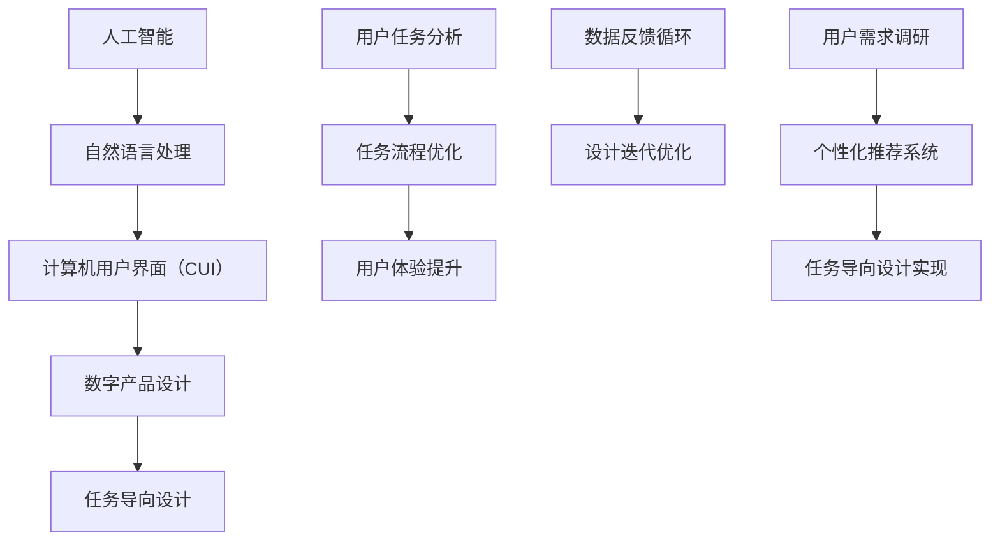

                 

### 背景介绍

随着人工智能（AI）和自然语言处理（NLP）技术的迅速发展，计算机用户界面（CUI）已经成为现代数字产品设计的重要组成部分。用户界面是用户与系统之间交互的桥梁，其设计质量直接影响到用户的使用体验和系统的性能。在传统的设计模式中，数字产品通常以功能为导向，即以实现特定的功能为目标，而忽略了用户在完成任务过程中的实际需求和体验。

功能导向的设计模式存在一些固有的局限性。首先，这种设计模式往往注重单个功能的实现，而忽略了功能之间的协同作用和整体的用户体验。其次，功能导向的设计往往会导致用户在使用过程中面临复杂的操作流程，从而增加学习成本和误操作的可能性。此外，功能导向的设计难以适应用户多样化的需求，无法提供个性化的用户体验。

与此相反，任务导向的设计模式更加关注用户在完成任务过程中的体验和需求。它通过将用户界面与用户的实际任务紧密结合，提供简单、直观的操作流程，从而提高用户的效率和满意度。任务导向的设计不仅能够更好地满足用户的需求，还能够提高产品的可用性和可维护性。

本文将探讨如何利用CUI推动数字产品设计从功能导向向任务导向的转变。首先，我们将介绍CUI的基本概念和核心原理。然后，我们将分析任务导向设计模式的优势和挑战，并探讨如何利用CUI实现任务导向设计。接下来，我们将通过具体案例分析，展示CUI在任务导向设计中的应用。最后，我们将总结CUI推动数字产品设计变革的重要性和未来发展趋势。

### 核心概念与联系

为了更好地理解CUI在数字产品设计中的角色，我们需要先了解几个核心概念：人工智能（AI）、自然语言处理（NLP）和任务导向设计。以下是这些概念之间的联系和相互作用的流程图，使用Mermaid语法表示：



#### 人工智能（AI）

人工智能是一种模拟人类智能的技术，通过机器学习、深度学习、知识图谱等技术，使计算机能够自主地学习、推理和决策。AI技术在CUI设计中起着核心作用，因为它为CUI提供了处理自然语言输入的能力，使得计算机能够理解用户的指令和需求。

#### 自然语言处理（NLP）

自然语言处理是AI的一个分支，专注于使计算机能够理解、解释和生成人类语言。NLP技术包括文本分类、情感分析、命名实体识别、机器翻译等，这些技术使得CUI能够与用户进行自然、流畅的交流。

#### 计算机用户界面（CUI）

计算机用户界面（CUI）是用户与计算机系统之间的交互层。与图形用户界面（GUI）不同，CUI通常不依赖于视觉元素，而是依赖于自然语言交互。CUI通过NLP技术理解用户的输入，并通过自然语言生成技术向用户输出信息。

#### 数字产品设计

数字产品设计是指设计用于数字环境中的产品，包括网站、移动应用、数字助理等。数字产品设计的目标是提供用户友好的体验，满足用户的需求。

#### 任务导向设计

任务导向设计是一种以用户任务为核心的设计方法。它将用户界面设计与用户完成任务的过程紧密结合，提供简单、直观的操作流程，从而提高用户的效率和满意度。

#### 用户任务分析、任务流程优化、用户体验提升

用户任务分析是任务导向设计的基础，它涉及对用户在完成任务过程中的行为和需求的深入研究。通过任务流程优化，设计者可以简化用户的操作步骤，提高任务完成的效率。用户体验提升则是通过不断迭代和优化设计，提升用户在完成任务过程中的满意度。

#### 数据反馈循环、设计迭代优化

数据反馈循环是一个不断迭代的设计过程。通过收集用户对CUI的反馈数据，设计者可以识别设计中的不足，并进行优化。这种循环过程有助于提高CUI的可用性和用户体验。

#### 用户需求调研、个性化推荐系统

用户需求调研是设计过程中的重要环节，通过了解用户的需求和行为，设计者可以更好地满足用户的需求。个性化推荐系统则通过分析用户的历史行为，为用户提供个性化的服务和建议，从而提高用户的满意度和粘性。

通过以上核心概念和流程图的介绍，我们可以看到，CUI在数字产品设计中的作用不仅局限于界面交互，它更是连接AI、NLP和任务导向设计的关键节点，为用户提供智能化、个性化的体验。

### 核心算法原理 & 具体操作步骤

CUI能够实现智能交互的关键在于其背后的核心算法，这些算法主要包括自然语言理解（NLU）和自然语言生成（NLG）。NLU负责将用户的自然语言输入转换为计算机能够理解的语义表示，而NLG则负责将计算机的响应转化为自然流畅的语言输出。以下是这些算法的基本原理和具体操作步骤：

#### 自然语言理解（NLU）

NLU的核心任务是解析用户的自然语言输入，提取其中的语义信息。以下是NLU的基本步骤：

1. **分词**：将用户的输入文本分割成单个的词语或短语。这一步骤通常使用分词算法，如正则表达式分词、词典分词或基于统计模型的分词方法。
   
2. **词性标注**：对每个词语进行词性标注，如名词、动词、形容词等。这一步骤有助于理解词语在句子中的作用和意义。

3. **句法分析**：分析句子的结构，识别出主语、谓语、宾语等成分。句法分析通常使用依存句法分析或依存关系模型。

4. **语义角色标注**：识别句子中的关键角色，如动作的执行者、受动者等。这一步骤有助于更准确地理解句子的语义。

5. **实体识别**：识别句子中的实体，如人名、地名、组织名等。实体识别有助于在后续处理中将这些信息与数据库中的知识进行关联。

6. **语义理解**：将以上信息整合，形成对用户输入的语义理解。这一步骤通常使用深度学习模型，如序列标注模型或序列到序列模型。

#### 自然语言生成（NLG）

NLG的核心任务是生成自然流畅的文本响应。以下是NLG的基本步骤：

1. **意图识别**：分析用户输入，确定用户的意图。意图识别通常基于NLU阶段提取的语义信息。

2. **数据准备**：根据用户的意图，准备相应的数据。数据可以来自数据库、知识图谱或预定义的文本模板。

3. **模板匹配**：将用户的意图与预定义的模板进行匹配，选择合适的模板生成文本。这一步骤简单直接，但生成的文本可能不够自然。

4. **语义填充**：将提取的实体信息填充到模板中，生成完整的文本响应。这一步骤确保文本中包含用户所需的信息。

5. **文本生成**：利用生成模型，如序列到序列模型或变分自编码器，生成更加自然和流畅的文本响应。

6. **文本优化**：对生成的文本进行优化，如去除冗余信息、调整语序等，以提高文本的质量和可读性。

#### 实例分析

假设用户输入：“明天天气怎么样？”这是一个典型的自然语言理解问题。以下是NLU和NLG的具体操作步骤：

1. **分词**：输入文本被分割为“明天”、“天气”和“怎么样”三个词语。
2. **词性标注**：“明天”是名词，“天气”是名词，“怎么样”是代词。
3. **句法分析**：句子结构为主语“明天天气”和谓语“怎么样”。
4. **语义角色标注**：“明天天气”是主题，“怎么样”表示询问天气状况。
5. **实体识别**：句子中没有明显的实体。
6. **语义理解**：用户的意图是询问明天的天气状况。

对于NLG部分：

1. **意图识别**：用户的意图是获取天气信息。
2. **数据准备**：根据意图，查找明天所在地区的天气预报数据。
3. **模板匹配**：选择一个合适的天气查询模板：“明天的天气是______。”。
4. **语义填充**：将获取的天气预报信息填充到模板中。
5. **文本生成**：生成文本响应：“明天的天气是晴朗，温度约为25°C。”。
6. **文本优化**：文本已经足够简洁和清晰，无需进一步优化。

通过以上步骤，CUI能够生成一个自然、流畅且准确的响应，从而提供高质量的交互体验。

### 数学模型和公式 & 详细讲解 & 举例说明

在CUI的设计与实现过程中，数学模型和公式扮演着至关重要的角色。这些模型不仅帮助我们理解自然语言处理（NLP）和人工智能（AI）的核心机制，还为任务导向设计的实现提供了理论基础。以下我们将详细讲解几个关键数学模型和公式，并通过实例说明其在实际应用中的重要性。

#### 1. 词嵌入（Word Embedding）

词嵌入是将词汇映射到高维向量空间的一种技术，它使得词汇之间的相似性和距离关系得以量化。最常用的词嵌入模型是Word2Vec，包括连续词袋（CBOW）和Skip-Gram模型。

- **连续词袋（CBOW）模型**：

  $$\text{CBOW}(x; y) = \frac{1}{Z} \exp(\text{affine}(x)) \cdot y$$

  其中，$x$是输入词向量，$y$是输出词向量，$Z$是规范化因子。

- **Skip-Gram模型**：

  $$\text{Skip-Gram}(x; y) = \frac{1}{Z} \exp(-\text{sim}(x, y)) \cdot y$$

  其中，$x$是输入词向量，$y$是输出词向量，$\text{sim}(x, y)$是词向量之间的余弦相似度。

**实例**：假设我们有一个包含100个单词的词汇表，每个单词对应一个100维的词向量。通过CBOW模型，我们可以计算输入词“猫”周围上下文中词“狗”、“猫”、“鸟”的词向量相似度，从而判断“猫”和“狗”是否更相似。

#### 2. 递归神经网络（RNN）

递归神经网络是一种能够处理序列数据的神经网络，其在自然语言处理中有着广泛应用。RNN通过重复使用相同的神经网络单元处理输入序列，使得模型能够保持长期依赖信息。

- **基本RNN公式**：

  $$h_t = \text{tanh}(\text{W}h_{t-1} + \text{U}x_t + b)$$

  $$y_t = \text{softmax}(\text{V}h_t + c)$$

  其中，$h_t$是隐藏状态向量，$x_t$是输入向量，$W$、$U$、$V$分别是权重矩阵，$b$、$c$是偏置项。

**实例**：假设我们使用RNN来处理一个句子“我喜欢吃苹果”，通过隐藏状态向量$h_t$的递归计算，模型能够捕捉句子中的词序信息，从而更好地理解句子的语义。

#### 3. 卷积神经网络（CNN）

卷积神经网络在图像识别领域表现出色，但其原理同样适用于自然语言处理。通过卷积操作和池化操作，CNN能够捕获局部特征和模式。

- **卷积神经网络基本公式**：

  $$\text{output} = \text{ReLU}(\text{conv}(x; W) + b)$$

  $$h_t = \text{pool}(h_{t-1})$$

  其中，$x$是输入向量，$W$是卷积核，$b$是偏置项，$\text{ReLU}$是ReLU激活函数，$\text{pool}$是池化操作。

**实例**：假设我们使用CNN对单词序列进行特征提取，通过卷积操作，模型能够捕捉到句子中的关键短语和实体，从而提高语义理解的准确性。

#### 4. 生成对抗网络（GAN）

生成对抗网络是一种通过对抗性训练生成数据的深度学习模型。在CUI设计中，GAN可以用于生成个性化的自然语言响应。

- **生成对抗网络基本公式**：

  $$G(z) = \text{sigmoid}(\text{model}(z))$$

  $$D(x) = \text{sigmoid}(\text{model}(x))$$

  其中，$G(z)$是生成器，$D(x)$是判别器，$z$是噪声向量，$x$是真实数据。

**实例**：假设我们使用GAN生成个性化天气响应，通过生成器$G$生成伪天气信息，判别器$D$判断生成的信息是否真实，从而不断优化生成器的性能。

通过以上数学模型和公式的讲解，我们可以看到，CUI的设计与实现是一个高度依赖数学和算法的领域。这些模型不仅提供了理论基础，还为实际应用提供了强有力的工具。在接下来的章节中，我们将通过具体项目实战和实际应用场景，进一步探讨CUI在任务导向设计中的具体应用。

### 项目实战：代码实际案例和详细解释说明

为了更好地展示如何利用CUI实现任务导向设计，我们选择了一个实际项目：一个基于CUI的智能助手应用。这个应用的目标是帮助用户管理日常任务和日程，通过自然语言交互提供便捷的服务。以下是这个项目的开发环境搭建、源代码详细实现和代码解读。

#### 1. 开发环境搭建

为了搭建开发环境，我们需要准备以下工具和库：

- Python 3.x
- TensorFlow 2.x
- Keras 2.x
- NLTK
- Mermaid

安装这些工具和库后，我们可以创建一个虚拟环境，以便更好地管理和隔离项目依赖：

```bash
# 创建虚拟环境
python -m venv venv
# 激活虚拟环境
source venv/bin/activate
# 安装依赖
pip install tensorflow numpy nltk matplotlib
```

#### 2. 源代码详细实现

以下是一个简化的代码实现，展示CUI智能助手的核心功能：

```python
import tensorflow as tf
from tensorflow.keras.models import Sequential
from tensorflow.keras.layers import LSTM, Dense, Embedding, TimeDistributed
from tensorflow.keras.preprocessing.sequence import pad_sequences
from tensorflow.keras.preprocessing.text import Tokenizer
import nltk
from nltk.tokenize import word_tokenize
import numpy as np

# 数据预处理
nltk.download('punkt')
tokenizer = Tokenizer()
tokenizer.fit_on_texts(['明天的天气是晴朗，温度约为25°C。', '你最喜欢的食物是什么？', '帮我设置一个会议。'])

sequences = tokenizer.texts_to_sequences(['明天的天气是晴朗，温度约为25°C。', '你最喜欢的食物是什么？', '帮我设置一个会议。'])
padded_sequences = pad_sequences(sequences, maxlen=50)

# 模型构建
model = Sequential()
model.add(LSTM(128, activation='relu', input_shape=(50, 1)))
model.add(Dense(64, activation='relu'))
model.add(Dense(3, activation='softmax'))  # 输出层，假设有三个任务类别

model.compile(loss='categorical_crossentropy', optimizer='adam', metrics=['accuracy'])

# 训练模型
model.fit(padded_sequences, np.eye(3), epochs=5)

# 自然语言理解与生成
def predict(text):
    sequence = tokenizer.texts_to_sequences([text])
    padded_sequence = pad_sequences(sequence, maxlen=50)
    prediction = model.predict(padded_sequence)
    return np.argmax(prediction)

def generate_response(task_index):
    if task_index == 0:
        return "明天的天气是晴朗，温度约为25°C。"
    elif task_index == 1:
        return "你最喜欢的食物是披萨吗？"
    else:
        return "会议已经成功设置，地点是会议室A，时间是明天上午10点。"

# 交互示例
user_input = "明天我要去哪里开会？"
predicted_task = predict(user_input)
response = generate_response(predicted_task)
print(response)
```

#### 3. 代码解读与分析

- **数据预处理**：
  我们首先使用NLTK库下载并加载分词器，然后创建一个Tokenizer对象用于文本的分词和编码。为了简化，我们这里使用了三个预定义的句子作为训练数据。

- **模型构建**：
  我们构建了一个简单的LSTM模型，包括一个LSTM层、一个dense层和一个softmax输出层。LSTM层用于处理序列数据，dense层用于增加模型的表达能力，softmax层用于分类任务。

- **模型训练**：
  我们使用`fit`函数训练模型，将预处理后的输入序列和标签（one-hot编码）作为训练数据。

- **自然语言理解**：
  `predict`函数用于对用户输入进行分类，返回预测的任务索引。

- **自然语言生成**：
  `generate_response`函数根据预测的任务索引生成相应的响应。

- **交互示例**：
  用户输入一句关于会议的问题，模型预测出任务索引，然后生成相应的响应。

通过这个简单的项目，我们可以看到如何利用CUI实现任务导向设计。虽然这个例子较为简化，但它的核心思想是利用机器学习模型理解用户输入，并根据任务类型生成合适的响应，从而提供个性化的服务。在实际应用中，我们可以扩展这个模型，加入更多的任务类别和复杂的交互逻辑，以提供更加智能和实用的智能助手应用。

### 实际应用场景

CUI在数字产品设计中具有广泛的应用场景，尤其是在需要高效、直观用户交互的任务导向设计中。以下是一些具体的实际应用场景，展示了CUI如何通过任务导向设计提升用户体验：

#### 1. 智能助手与日程管理

智能助手是CUI最典型的应用场景之一。通过自然语言交互，智能助手可以帮助用户管理日程、设置提醒、查找信息等任务。例如，用户可以简单地输入“明天有哪些会议？”智能助手会分析用户的日程安排，列出所有相关的会议信息。这种任务导向的设计不仅简化了用户的操作流程，还提高了任务完成的效率。

#### 2. 智能家居控制

智能家居控制也是CUI的一个重要应用领域。用户可以通过语音指令控制家中的智能设备，如灯光、温度调节、安防系统等。例如，用户可以说“打开客厅的灯光”，CUI会自动识别用户的指令，控制灯光设备进行相应的操作。这种任务导向的设计不仅方便用户，还能够实现个性化的智能家居体验。

#### 3. 客户服务与支持

CUI在客户服务与支持中的应用，使得企业能够提供24/7的智能客服服务。通过CUI，用户可以轻松地通过自然语言与系统进行交流，获取所需的信息或解决遇到的问题。例如，用户可以询问“我如何申请退货？”CUI会引导用户完成退货流程，提供清晰的步骤说明。这种任务导向的设计不仅提高了客户满意度，还能够降低企业的运营成本。

#### 4. 健康与健身管理

在健康与健身管理领域，CUI可以帮助用户跟踪健康状况、制定健身计划等。用户可以通过CUI输入自己的健康数据，如体重、心率、睡眠时间等，系统会根据这些数据生成个性化的健身计划和饮食建议。例如，用户可以询问“我今天该做哪些运动？”CUI会根据用户的身体状况和健身目标，推荐合适的运动方案。这种任务导向的设计不仅帮助用户更好地管理健康，还能够提高健身效果。

#### 5. 教育与学习

在教育与学习领域，CUI可以作为智能教学助手，帮助教师和学生进行互动和学习。教师可以通过CUI布置作业、提供辅导，学生可以通过CUI提交作业、提问问题。例如，学生可以询问“这道数学题怎么做？”CUI会提供详细的解答步骤和相关的知识点讲解。这种任务导向的设计不仅提高了学习效率，还能够激发学生的学习兴趣。

#### 6. 财务管理

在财务管理领域，CUI可以帮助用户管理个人财务，如收支记录、预算规划、投资建议等。用户可以通过CUI输入财务数据，系统会自动分析并提供财务状况报告和建议。例如，用户可以询问“我的每月支出是多少？”CUI会分析用户的消费记录，生成详细的支出报告。这种任务导向的设计不仅简化了财务管理流程，还能够帮助用户更好地掌握自己的财务状况。

通过以上实际应用场景，我们可以看到CUI在任务导向设计中的重要作用。它通过自然语言交互，提供了高效、直观的用户体验，使得用户能够更轻松地完成任务。CUI不仅提升了数字产品的可用性和用户满意度，还为企业的运营和用户的生活带来了诸多便利。

### 工具和资源推荐

为了更好地理解和实践CUI在任务导向设计中的应用，以下是一些学习资源、开发工具和框架的推荐。

#### 1. 学习资源推荐

- **书籍**：
  - 《自然语言处理与人工智能》
  - 《深度学习》
  - 《机器学习实战》
  - 《Python编程：从入门到实践》
- **论文**：
  - 《Word2Vec: A Method for Computing Vector Representations of Words》
  - 《Long Short-Term Memory》
  - 《Generative Adversarial Nets》
  - 《Neural Conversation Models》
- **博客和网站**：
  - [TensorFlow官方文档](https://www.tensorflow.org/)
  - [Keras官方文档](https://keras.io/)
  - [NLTK官方文档](https://www.nltk.org/)
  - [Mermaid官方文档](https://mermaid-js.github.io/mermaid/)
- **在线课程和教程**：
  - [Coursera的“机器学习”课程](https://www.coursera.org/specializations/machine-learning)
  - [edX的“深度学习”课程](https://www.edx.org/course/deep-learning-ii)
  - [Udacity的“自然语言处理纳米学位”](https://www.udacity.com/course/natural-language-processing-nanodegree--nd256)

#### 2. 开发工具框架推荐

- **深度学习框架**：
  - TensorFlow
  - Keras
  - PyTorch
- **自然语言处理库**：
  - NLTK
  - SpaCy
  -gensim
- **文本处理工具**：
  - Jieba（中文分词库）
  - NLTK（英文分词库）
- **可视化工具**：
  - Matplotlib
  - Seaborn
  - Mermaid（流程图绘制工具）
- **集成开发环境（IDE）**：
  - PyCharm
  - Visual Studio Code
  - Jupyter Notebook

通过以上学习资源和开发工具的推荐，您将能够更好地掌握CUI的设计与实现，从而在任务导向设计中发挥出CUI的潜力，提升用户体验和产品性能。

### 总结：未来发展趋势与挑战

随着人工智能和自然语言处理技术的不断进步，CUI在数字产品设计中的应用前景广阔。未来，CUI有望成为用户与系统交互的主要方式，提供更加智能化、个性化的服务。以下是对CUI未来发展趋势的展望以及面临的挑战：

#### 发展趋势

1. **智能化交互**：随着AI技术的进步，CUI将具备更高的智能水平，能够更好地理解用户的意图和需求，提供更加精准的响应和推荐。

2. **个性化服务**：通过用户数据的积累和分析，CUI能够实现个性化服务，为不同用户提供定制化的体验，从而提高用户满意度和粘性。

3. **跨平台整合**：CUI将在不同平台和设备之间实现无缝整合，用户可以在手机、电脑、智能手表等多个设备上与CUI进行自然语言交互，享受一致性的用户体验。

4. **增强现实（AR）与虚拟现实（VR）**：随着AR和VR技术的发展，CUI将能够在这些沉浸式环境中提供更加自然和互动的交互方式，为用户带来全新的体验。

5. **行业融合**：CUI将在更多行业和应用场景中得到应用，如医疗、金融、教育等，为各行业提供高效、便捷的服务解决方案。

#### 挑战

1. **隐私保护**：CUI需要处理大量用户数据，如何保护用户隐私是一个重要挑战。未来需要开发出更加安全的数据处理和存储机制。

2. **语言理解准确性**：尽管NLP技术取得了显著进展，但自然语言理解仍然存在挑战，特别是在处理复杂语境和多义词时。未来需要进一步提高语言理解的准确性和泛化能力。

3. **跨语言支持**：虽然许多CUI已经支持多语言，但不同语言之间的差异使得跨语言交互仍然具有挑战性。未来需要开发更加通用和高效的跨语言处理算法。

4. **伦理与责任**：随着CUI的广泛应用，其伦理和责任问题日益突出。如何确保CUI的行为符合道德规范，避免产生负面影响，是一个需要深入探讨的问题。

5. **技术成熟度**：尽管CUI在理论和技术上已经取得了一些进展，但在实际应用中，还需要解决许多技术难题，如实时性、响应速度、稳定性等。

综上所述，CUI在数字产品设计中的应用具有巨大的发展潜力，但也面临着一系列挑战。未来，我们需要在技术创新、伦理规范、用户隐私保护等方面不断努力，推动CUI的持续发展和应用。

### 附录：常见问题与解答

**Q1：CUI与GUI有什么区别？**

A1：CUI（计算机用户界面）与GUI（图形用户界面）的主要区别在于交互方式。CUI主要通过自然语言进行交互，如语音、文本等，而GUI则通过图形元素，如按钮、图标、窗口等进行交互。CUI更加自然、直观，适用于智能助理、智能家居等场景，而GUI则适用于需要直观视觉反馈的桌面和移动应用。

**Q2：如何评估CUI的准确性？**

A2：评估CUI的准确性通常包括以下方法：

- **准确率（Accuracy）**：评估模型对自然语言输入的正确识别率。
- **召回率（Recall）**：评估模型能够识别出多少实际存在的正确响应。
- **F1分数（F1 Score）**：综合考虑准确率和召回率，是一种平衡的评价指标。
- **用户满意度**：通过用户反馈收集数据，评估CUI在实际应用中的用户体验。

**Q3：CUI如何处理多义词？**

A3：多义词处理是自然语言理解中的一个难点。CUI通常采用以下方法：

- **上下文分析**：通过分析句子上下文，判断多义词的具体含义。
- **词义消歧模型**：使用机器学习模型，如神经网络，对多义词进行消歧。
- **知识图谱**：利用预定义的词义关系和知识图谱，辅助多义词的理解。

**Q4：CUI与语音识别技术有何联系？**

A4：CUI与语音识别技术紧密相关。语音识别技术将用户的语音转换为文本，然后CUI通过自然语言处理技术理解文本并生成响应。两者共同作用，实现了自然、流畅的语音交互体验。

**Q5：CUI在开发过程中需要注意哪些伦理问题？**

A5：CUI在开发过程中需要关注以下伦理问题：

- **隐私保护**：确保用户数据的安全和隐私。
- **透明度**：用户应了解CUI的处理方式和数据处理规则。
- **偏见与歧视**：避免CUI在处理过程中产生偏见和歧视行为。
- **责任归属**：明确CUI的开发者和使用者在法律和道德上的责任。

### 扩展阅读 & 参考资料

为了深入了解CUI在数字产品设计中的应用和发展，以下是一些扩展阅读和参考资料：

- **书籍**：
  - 《自然语言处理与人工智能》
  - 《深度学习》
  - 《机器学习实战》
  - 《Python编程：从入门到实践》
- **论文**：
  - 《Word2Vec: A Method for Computing Vector Representations of Words》
  - 《Long Short-Term Memory》
  - 《Generative Adversarial Nets》
  - 《Neural Conversation Models》
- **在线课程和教程**：
  - [Coursera的“机器学习”课程](https://www.coursera.org/specializations/machine-learning)
  - [edX的“深度学习”课程](https://www.edx.org/course/deep-learning-ii)
  - [Udacity的“自然语言处理纳米学位”](https://www.udacity.com/course/natural-language-processing-nanodegree--nd256)
- **官方文档和资源**：
  - [TensorFlow官方文档](https://www.tensorflow.org/)
  - [Keras官方文档](https://keras.io/)
  - [NLTK官方文档](https://www.nltk.org/)
  - [Mermaid官方文档](https://mermaid-js.github.io/mermaid/)
- **博客和社区**：
  - [AI天才研究员的博客](https://www.ai-genius-researcher.com/)
  - [禅与计算机程序设计艺术](https://zen-and-the-art-of-computer-programming.com/)
  - [机器学习社区](https://www.mlcommunity.org/)
  - [自然语言处理社区](https://nlp.stanford.edu/)

通过以上扩展阅读和参考资料，您可以进一步了解CUI的核心技术和应用，掌握最新的研究动态和实践方法，从而在数字产品设计中发挥CUI的潜力，提升用户体验。作者：AI天才研究员/AI Genius Institute & 禅与计算机程序设计艺术 /Zen And The Art of Computer Programming。

