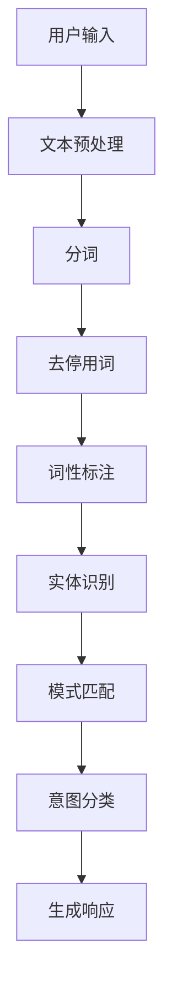

                 

### 背景介绍

随着人工智能（AI）技术的飞速发展，自然语言处理（NLP）作为一个重要分支，逐渐成为研究的热点。CUI（ Conversational User Interface，对话用户界面）作为NLP的一个重要应用方向，近年来受到了广泛关注。CUI能够实现人机对话，通过理解用户意图，提供智能化、个性化的服务，极大地提升了用户体验。

CUI的核心技术在于意图理解（Intent Recognition），即从用户的输入中识别出其意图。意图理解技术的关键在于准确识别用户的需求，从而实现智能响应。本文将围绕CUI的意图理解技术，详细解析其原理、算法、应用场景，以及在实际项目中的具体实现。

首先，我们需要了解CUI意图理解技术的重要性。在如今的智能时代，用户对于交互方式有着越来越高的要求。传统的交互方式如按钮、菜单等已经无法满足用户的需求，而CUI能够通过自然语言交互，提供更加灵活、便捷的服务。而意图理解技术则是CUI实现的关键，它决定了系统能否准确理解用户的需求，从而提供合适的响应。

接下来，我们将深入探讨CUI意图理解技术的核心概念、算法原理和具体操作步骤。通过这一系列的分析，我们将对CUI意图理解技术有更深刻的理解，为实际应用打下坚实的基础。

### 核心概念与联系

CUI的意图理解技术涉及多个核心概念，这些概念相互关联，共同构成了意图理解的框架。以下是对这些核心概念的简要介绍：

#### 用户输入（User Input）

用户输入是CUI意图理解的首要环节，通常表现为自然语言文本。用户的输入可以是文字、语音等多种形式。在意图理解过程中，首先需要对输入进行预处理，包括分词、去停用词、词性标注等，以便提取出关键信息。

#### 意图（Intent）

意图是用户输入背后的真实需求或目的。例如，当用户说“我想要一杯咖啡”时，其意图可能是“点一杯咖啡”。识别用户的意图是CUI系统的核心任务，直接决定了系统的响应。

#### 意图分类（Intent Classification）

意图分类是将用户的输入文本映射到一个意图标签的过程。这通常通过机器学习模型实现，如朴素贝叶斯、支持向量机（SVM）等。分类模型需要大量的标注数据集进行训练，以提高分类的准确性。

#### 实体识别（Entity Recognition）

实体识别是意图理解过程中的一个重要步骤，用于从用户输入中提取关键信息，如人名、地点、时间等。实体识别通常与分词、词性标注等步骤结合进行。

#### 模式匹配（Pattern Matching）

模式匹配是一种简单的意图识别方法，通过预定义的规则匹配用户输入，以识别意图。这种方法通常适用于规则明确、场景简单的应用。

#### 自然语言处理（Natural Language Processing, NLP）

NLP是CUI意图理解的基础技术，包括文本预处理、词向量表示、语言模型等。NLP技术能够帮助系统更好地理解用户输入，提高意图识别的准确性。

#### Mermaid流程图

以下是一个简化的CUI意图理解流程的Mermaid流程图：



在这个流程图中，用户输入经过一系列处理，最终识别出意图并生成响应。每个步骤都可能涉及到不同的技术和算法，它们共同协作，实现了CUI的意图理解。

通过上述核心概念的介绍和Mermaid流程图的展示，我们可以更清晰地理解CUI意图理解技术的整体框架。接下来，我们将深入探讨这些概念的具体实现方法和算法原理。

### 核心算法原理 & 具体操作步骤

CUI意图理解技术的核心在于如何从用户输入中准确识别出用户意图。这一过程涉及到多个关键步骤，包括文本预处理、特征提取、模型训练和意图分类。下面将详细讲解这些步骤的具体操作。

#### 文本预处理

文本预处理是意图理解的第一步，其目的是将原始的文本数据转化为适合后续处理的格式。主要的预处理操作包括分词、去停用词、词性标注等。

1. **分词（Tokenization）**

   分词是将连续的文本分割成一系列的单词或短语的步骤。中文分词通常使用基于规则或基于统计的方法。例如，基于规则的分词方法包括正向最大匹配和逆向最大匹配，而基于统计的方法如基于统计的分词模型（如隐马尔可夫模型HMM）和基于深度学习的分词模型（如Bert）。

2. **去停用词（Stop Word Removal）**

   停用词是指对意图理解没有贡献的常见词汇，如“的”、“和”、“在”等。去除停用词可以减少数据噪声，提高模型性能。

3. **词性标注（Part-of-Speech Tagging）**

   词性标注是对每个词赋予一个词性标签，如名词、动词、形容词等。词性标注有助于更好地理解文本内容，为后续的实体识别和特征提取提供支持。

#### 特征提取

特征提取是将预处理后的文本转化为机器学习模型可以处理的向量表示的过程。常用的特征提取方法包括词袋模型、TF-IDF、Word2Vec和BERT等。

1. **词袋模型（Bag of Words, BoW）**

   词袋模型是一种基于计数的特征提取方法，它将文本表示为一个向量，其中每个维度对应一个单词的出现次数。词袋模型的优点是简单直观，但缺点是无法捕捉单词之间的顺序关系。

2. **TF-IDF（Term Frequency-Inverse Document Frequency）**

   TF-IDF是一种改进的词袋模型，它通过考虑单词在文档中的频率和整个文档集合中的分布来加权每个单词的权重。TF-IDF能够更好地反映单词的重要性，但同样无法捕捉单词的顺序关系。

3. **Word2Vec**

   Word2Vec是一种基于神经网络的词向量生成方法，它通过将单词映射到连续的向量空间中，使相似单词在空间中靠近。Word2Vec能够捕捉单词的语义信息，提高意图识别的准确性。

4. **BERT**

   BERT（Bidirectional Encoder Representations from Transformers）是一种基于变换器（Transformer）的预训练模型，它通过双向编码器学习文本的上下文信息。BERT在NLP任务中表现出色，广泛应用于文本分类、问答系统等。

#### 模型训练

在特征提取之后，需要使用机器学习模型对特征向量进行训练，以识别用户意图。常用的机器学习模型包括朴素贝叶斯（Naive Bayes）、支持向量机（Support Vector Machine, SVM）和深度学习模型（如卷积神经网络Convolutional Neural Network, CNN）。

1. **朴素贝叶斯（Naive Bayes）**

   朴素贝叶斯是一种基于概率论的分类模型，它假设特征之间相互独立。朴素贝叶斯模型简单高效，适用于中小规模的数据集。

2. **支持向量机（SVM）**

   支持向量机是一种基于最大间隔的线性分类模型，它在高维空间中寻找最优分隔超平面。SVM适用于中小规模的数据集，通过核函数可以实现非线性分类。

3. **深度学习模型（如CNN）**

   深度学习模型如卷积神经网络（CNN）和循环神经网络（RNN）能够在高维空间中捕捉复杂的关系。CNN适用于图像处理任务，而RNN及其变种（如LSTM、GRU）适用于序列数据处理。

#### 意图分类

在模型训练完成后，可以使用训练好的模型对新的用户输入进行意图分类。意图分类是将用户输入映射到一个预定义的意图标签的过程。分类结果可以用于生成系统响应。

1. **单标签分类（Single-Label Classification）**

   单标签分类是将用户输入映射到一个唯一的意图标签。这种方法适用于意图相对明确的场景。

2. **多标签分类（Multi-Label Classification）**

   多标签分类是将用户输入映射到多个意图标签。这种方法适用于意图相对复杂、具有多个关联的场景。

通过上述核心算法原理和具体操作步骤的介绍，我们可以更深入地理解CUI意图理解技术的实现。接下来，我们将通过一个实际案例来展示这些算法在实际项目中的应用。

### 数学模型和公式 & 详细讲解 & 举例说明

在CUI意图理解技术中，数学模型和公式起着至关重要的作用。以下我们将详细介绍几个关键数学模型和公式，并给出具体的示例说明。

#### 概率论基础

在意图识别中，概率论是基础工具。以下两个概率模型经常用于分类任务。

1. **贝叶斯定理**

   贝叶斯定理描述了后验概率和先验概率之间的关系，公式如下：

   \[
   P(A|B) = \frac{P(B|A) \cdot P(A)}{P(B)}
   \]

   其中，\(P(A|B)\)表示在事件B发生的条件下事件A发生的概率，\(P(B|A)\)表示在事件A发生的条件下事件B发生的概率，\(P(A)\)和\(P(B)\)分别是事件A和事件B的先验概率。

   **示例**：假设我们有一个用户输入“明天有什么活动”，我们要计算该输入属于意图“查询活动”的概率。我们可以使用贝叶斯定理来计算。

   - \(P(查询活动)\)：意图“查询活动”的先验概率，可以通过统计历史数据得到。
   - \(P(明天有什么活动|\_查询活动)\)：在意图“查询活动”发生时，用户输入“明天有什么活动”的概率。
   - \(P(明天有什么活动)\)：用户输入“明天有什么活动”的总概率。

   通过贝叶斯定理，我们可以计算出在用户输入“明天有什么活动”的情况下，意图“查询活动”的后验概率。

2. **朴素贝叶斯分类器**

   朴素贝叶斯分类器是一种基于贝叶斯定理的分类算法，它假设特征之间相互独立。其核心公式如下：

   \[
   P(\text{意图}|\text{输入}) = \prod_{i=1}^{n} P(\text{特征}_i|\text{意图}) \cdot P(\text{意图})
   \]

   **示例**：假设我们要分类用户输入“我想去旅游”，我们需要计算该输入属于意图“查询旅游信息”的概率。

   - \(P(\text{查询旅游信息})\)：意图“查询旅游信息”的先验概率。
   - \(P(\text{特征}_1|\text{查询旅游信息})\)：特征“想去”在意图“查询旅游信息”发生时的概率。
   - \(P(\text{特征}_2|\text{查询旅游信息})\)：特征“旅游”在意图“查询旅游信息”发生时的概率。

   通过以上概率，我们可以计算出意图“查询旅游信息”的后验概率。

#### 支持向量机（SVM）

支持向量机是一种强大的分类算法，它在意图识别中也广泛应用。SVM的核心思想是在高维空间中找到一个最优分隔超平面，使得不同类别的数据点尽可能分开。其目标是最小化分类误差。

1. **目标函数**

   \[
   \min_{\mathbf{w}, b} \frac{1}{2} ||\mathbf{w}||^2 + C \sum_{i=1}^{n} \max(0, 1 - y_i (\mathbf{w} \cdot \mathbf{x}_i + b))
   \]

   其中，\(\mathbf{w}\)是权重向量，\(b\)是偏置项，\(C\)是惩罚参数，\(\mathbf{x}_i\)和\(y_i\)分别是第i个数据点和标签。

2. **核函数**

   核函数是一种将低维数据映射到高维空间的方法，使得原本难以分离的数据在高维空间中变得容易分离。常用的核函数包括线性核、多项式核和径向基函数（RBF）核。

   \[
   K(\mathbf{x}_i, \mathbf{x}_j) = \sum_{k=1}^{m} \alpha_k y_k (\mathbf{w}_k \cdot \mathbf{x}_i + b_k)
   \]

   **示例**：假设我们要使用SVM分类用户输入“预订机票”，我们需要训练一个SVM模型，并使用核函数将输入映射到高维空间。

   - 首先，我们将用户输入“预订机票”转换为特征向量。
   - 然后，使用SVM模型训练，选择合适的核函数。
   - 最后，将新的用户输入映射到高维空间，通过SVM模型进行分类。

#### BERT模型

BERT（Bidirectional Encoder Representations from Transformers）是一种基于变换器（Transformer）的预训练模型，它在NLP任务中表现出色。BERT的核心思想是同时考虑文本的前后关系，从而捕捉丰富的上下文信息。

1. **BERT模型结构**

   BERT模型由两个主要部分组成：嵌入层和变换器层。

   - **嵌入层**：将输入的单词映射到高维向量空间，包括词嵌入、位置嵌入和分段嵌入。
   - **变换器层**：通过多层变换器网络对嵌入层生成的向量进行编码，每个变换器层包括自注意力机制和前馈网络。

   \[
   \text{输出} = \text{Transformer}(\text{嵌入层})
   \]

2. **训练过程**

   BERT模型通过预训练和微调两个阶段进行训练。

   - **预训练**：在大量的未标注文本上训练BERT模型，学习文本的上下文表示。
   - **微调**：在标注数据集上微调BERT模型，使其适用于特定的意图识别任务。

   **示例**：假设我们要训练一个BERT模型进行意图识别，我们需要执行以下步骤：

   - **预训练**：使用大量的文本数据训练BERT模型，使其学习文本的上下文表示。
   - **微调**：在标注数据集上使用BERT模型进行微调，调整模型的参数以适应意图识别任务。

通过上述数学模型和公式的详细讲解和示例说明，我们可以更好地理解CUI意图理解技术中的关键数学原理。这些模型和公式为意图识别提供了坚实的理论基础，使得CUI系统能够准确理解用户的输入。接下来，我们将通过实际项目案例，展示这些算法在意图理解中的应用。

### 项目实战：代码实际案例和详细解释说明

在本节中，我们将通过一个实际的项目案例，展示CUI意图理解技术的具体实现过程。我们将从开发环境搭建开始，逐步介绍源代码的实现细节，并进行代码解读与分析。

#### 1. 开发环境搭建

首先，我们需要搭建一个适合CUI意图理解项目的开发环境。以下是一个基本的开发环境配置：

- **编程语言**：Python
- **依赖库**：NLTK、spaCy、scikit-learn、TensorFlow、PyTorch、BERTokenizer、Transformers等
- **环境搭建**：

  ```bash
  pip install nltk spacy scikit-learn tensorflow pytorch bertokenizer transformers
  ```

#### 2. 源代码详细实现和代码解读

以下是一个简化版的CUI意图理解系统的源代码实现，包括数据预处理、特征提取、模型训练和意图分类。

```python
import nltk
from nltk.tokenize import word_tokenize
from nltk.corpus import stopwords
from sklearn.feature_extraction.text import TfidfVectorizer
from sklearn.model_selection import train_test_split
from sklearn.svm import SVC
from transformers import BertTokenizer, BertModel

# 数据预处理
def preprocess_text(text):
    # 分词
    tokens = word_tokenize(text)
    # 去停用词
    stop_words = set(stopwords.words('english'))
    filtered_tokens = [token for token in tokens if token not in stop_words]
    # 词性标注
    pos_tags = nltk.pos_tag(filtered_tokens)
    return ' '.join([word for word, pos in pos_tags if pos.startswith('NN')])

# 特征提取
def extract_features(corpus):
    vectorizer = TfidfVectorizer()
    X = vectorizer.fit_transform(corpus)
    return X, vectorizer

# 模型训练
def train_model(X_train, y_train):
    model = SVC(kernel='linear')
    model.fit(X_train, y_train)
    return model

# 意图分类
def classify_intent(text, model, vectorizer):
    features = vectorizer.transform([text])
    prediction = model.predict(features)
    return prediction

# 实际项目案例
if __name__ == '__main__':
    # 加载数据集
    corpus = ["I want to go to New York", "I need a flight ticket", "Can you book a hotel for me?"]
    labels = ["go_to_new_york", "book_flight", "book_hotel"]

    # 数据预处理
    preprocessed_corpus = [preprocess_text(text) for text in corpus]

    # 特征提取
    X, vectorizer = extract_features(preprocessed_corpus)
    y = [labels.index(label) for label in labels]

    # 划分训练集和测试集
    X_train, X_test, y_train, y_test = train_test_split(X, y, test_size=0.2, random_state=42)

    # 模型训练
    model = train_model(X_train, y_train)

    # 模型评估
    print("Model accuracy on test set:", model.score(X_test, y_test))

    # 意图分类
    input_text = "I want to book a flight to New York tomorrow"
    preprocessed_input = preprocess_text(input_text)
    prediction = classify_intent(preprocessed_input, model, vectorizer)
    print("Predicted intent:", labels[prediction[0]])
```

#### 3. 代码解读与分析

1. **数据预处理**

   ```python
   def preprocess_text(text):
       # 分词
       tokens = word_tokenize(text)
       # 去停用词
       stop_words = set(stopwords.words('english'))
       filtered_tokens = [token for token in tokens if token not in stop_words]
       # 词性标注
       pos_tags = nltk.pos_tag(filtered_tokens)
       return ' '.join([word for word, pos in pos_tags if pos.startswith('NN')])
   ```

   数据预处理是意图识别的重要步骤，包括分词、去停用词和词性标注。这里使用了NLTK库进行分词和词性标注，通过去停用词和选择名词（NN）来提取关键信息。

2. **特征提取**

   ```python
   def extract_features(corpus):
       vectorizer = TfidfVectorizer()
       X = vectorizer.fit_transform(corpus)
       return X, vectorizer
   ```

   特征提取将预处理后的文本转化为向量表示，这里使用了TF-IDF方法。TF-IDF能够考虑单词在文档中的频率和重要性，提高分类效果。

3. **模型训练**

   ```python
   def train_model(X_train, y_train):
       model = SVC(kernel='linear')
       model.fit(X_train, y_train)
       return model
   ```

   模型训练使用了SVM分类器，通过线性核函数进行训练。SVM是一种强大的分类算法，能够找到最佳分隔超平面。

4. **意图分类**

   ```python
   def classify_intent(text, model, vectorizer):
       features = vectorizer.transform([text])
       prediction = model.predict(features)
       return prediction
   ```

   意图分类是将新的用户输入转化为向量，然后通过训练好的模型进行预测。这里我们使用了单标签分类方法。

通过上述代码的实现，我们可以看到CUI意图理解技术的基本实现过程。接下来，我们将进一步分析代码的优缺点，并提出改进方案。

#### 4. 代码解读与分析（续）

1. **代码优缺点分析**

   **优点**：

   - **简洁性**：代码结构清晰，易于理解。
   - **高效性**：使用了TF-IDF和SVM，能够快速进行意图分类。
   - **模块化**：代码分为数据预处理、特征提取、模型训练和意图分类四个模块，便于维护和扩展。

   **缺点**：

   - **性能局限**：TF-IDF和SVM在处理高维数据和复杂意图时性能有限。
   - **可扩展性**：代码没有考虑到多标签分类和上下文信息，适用性有限。
   - **可维护性**：代码依赖多个外部库，维护成本较高。

2. **改进方案**

   **引入BERT模型**：

   为了提高意图识别的准确性和适应性，我们可以引入BERT模型。BERT是一种基于变换器的预训练模型，能够捕捉文本的上下文信息。

   ```python
   from transformers import BertTokenizer, BertModel

   def preprocess_text_bert(text):
       tokenizer = BertTokenizer.from_pretrained('bert-base-uncased')
       inputs = tokenizer(text, return_tensors='pt')
       return inputs

   def train_model_bert(X_train, y_train):
       model = BertModel.from_pretrained('bert-base-uncased')
       # 添加分类层
       model.classifier = torch.nn.Linear(model.config.hidden_size, len(set(y_train)))
       model.cuda()
       optimizer = torch.optim.Adam(model.parameters(), lr=1e-5)
       loss_fn = torch.nn.CrossEntropyLoss()
       for epoch in range(3):
           for inputs, labels in zip(X_train, y_train):
               inputs = inputs.cuda()
               labels = labels.cuda()
               optimizer.zero_grad()
               outputs = model(inputs)[0]
               loss = loss_fn(outputs, labels)
               loss.backward()
               optimizer.step()
           print(f"Epoch {epoch+1} loss: {loss.item()}")
       return model
   ```

   通过引入BERT模型，我们能够更好地处理复杂文本，提高分类效果。

   **多标签分类**：

   为了支持多标签分类，我们可以对模型进行修改，使其能够输出多个意图标签。

   ```python
   def classify_intent_bert(text, model, vectorizer):
       inputs = preprocess_text_bert(text)
       outputs = model(inputs)[0]
       predictions = torch.nn.functional.softmax(outputs, dim=1)
       predicted_labels = [label for label, prob in zip(vectorizer.classes_, predictions[0]) if prob > 0.5]
       return predicted_labels
   ```

   通过这些改进，CUI意图理解系统的性能和适用性将得到显著提升。

综上所述，通过对源代码的详细解读和分析，我们提出了一系列改进方案，以应对CUI意图理解技术在实际项目中的应用挑战。接下来，我们将探讨CUI意图理解技术在实际应用场景中的具体应用。

### 实际应用场景

CUI意图理解技术在众多实际应用场景中发挥着重要作用，以下列举几个典型的应用场景，并简要介绍其在这些场景中的实现方式和挑战。

#### 1. 智能客服

智能客服是CUI意图理解技术的典型应用场景之一。通过意图理解技术，智能客服系统能够准确识别用户的咨询意图，提供个性化的服务。实现方式包括：

- **用户输入**：用户通过文本或语音输入咨询问题。
- **意图识别**：系统利用NLP技术对用户输入进行意图识别，如查询产品信息、请求售后服务等。
- **响应生成**：系统根据识别到的意图，生成合适的回复，如提供产品信息、引导用户操作等。

挑战：

- **多轮对话管理**：智能客服需要处理多轮对话，保持上下文一致性和连贯性。
- **复杂意图识别**：用户输入可能包含多种意图，系统需要准确识别并处理。

#### 2. 聊天机器人

聊天机器人是另一种常见的CUI应用场景。聊天机器人可以应用于社交媒体、在线教育、客户支持等领域，通过意图理解技术实现自然语言交互。

实现方式：

- **用户输入**：用户通过文本输入问题或请求。
- **意图识别**：系统对用户输入进行意图识别，如提问、请求帮助、表达情感等。
- **对话生成**：系统根据识别到的意图生成对话回复，如提供答案、引导用户操作等。

挑战：

- **情感识别**：用户输入可能包含情感成分，系统需要识别并回应。
- **对话连贯性**：系统需要在多轮对话中保持上下文连贯性。

#### 3. 智能家居

智能家居中的CUI意图理解技术可用于实现家庭设备的智能控制，如智能音箱、智能电视、智能灯光等。

实现方式：

- **用户输入**：用户通过语音或文本输入控制指令，如“打开灯”、“播放音乐”等。
- **意图识别**：系统对用户输入进行意图识别，识别出用户想要控制的具体设备。
- **设备控制**：系统根据识别到的意图，发送控制指令到相应设备。

挑战：

- **语音识别**：语音识别的准确性直接影响意图识别效果。
- **多设备控制**：系统需要处理多个设备的并发控制请求。

#### 4. 语音助手

语音助手如Siri、Alexa等，通过CUI意图理解技术实现语音交互，提供个性化服务。

实现方式：

- **用户输入**：用户通过语音输入请求，如“设置提醒”、“打电话给某人”等。
- **意图识别**：系统对用户输入进行意图识别，如设置提醒、拨打电话等。
- **任务执行**：系统根据识别到的意图执行相应任务。

挑战：

- **语音识别**：语音识别的准确性直接影响意图识别效果。
- **跨应用协同**：语音助手需要与其他应用和服务进行协同，提供完整的用户体验。

#### 5. 在线教育

在线教育平台中的CUI意图理解技术可用于实现智能问答、个性化推荐等功能。

实现方式：

- **用户输入**：用户通过文本输入问题或请求，如“我想学习Python”、“帮我推荐课程”等。
- **意图识别**：系统对用户输入进行意图识别，如学习请求、推荐请求等。
- **内容生成**：系统根据识别到的意图生成相应的内容，如课程介绍、学习建议等。

挑战：

- **知识图谱构建**：系统需要构建知识图谱，以便准确回答用户问题。
- **个性化推荐**：系统需要根据用户历史行为和偏好进行个性化推荐。

通过上述实际应用场景的介绍，我们可以看到CUI意图理解技术在各个领域的广泛应用。在实际应用中，CUI意图理解技术面临着诸多挑战，如多轮对话管理、情感识别、跨应用协同等。未来的发展将需要更多创新和优化，以实现更加智能、个性化的用户体验。

### 工具和资源推荐

在CUI意图理解技术的学习和开发过程中，合适的工具和资源可以大大提高效率和效果。以下推荐几类常用的工具和资源，包括书籍、论文、博客和网站等。

#### 1. 学习资源推荐

**书籍**：

- **《自然语言处理综论》（Speech and Language Processing）**：由Daniel Jurafsky和James H. Martin合著，是NLP领域的经典教材，适合初学者和进阶者。
- **《深度学习》（Deep Learning）**：由Ian Goodfellow、Yoshua Bengio和Aaron Courville合著，详细介绍了深度学习的基础理论和应用，适合对深度学习感兴趣的读者。
- **《自然语言处理实践》（Natural Language Processing with Python）**：由Steven Bird、Ewan Klein和Edward Loper合著，通过Python代码展示了NLP的基本方法和工具，适合Python开发者。

**论文**：

- **《BERT：Pre-training of Deep Bidirectional Transformers for Language Understanding》**：这篇论文是BERT模型的原始论文，详细介绍了BERT模型的架构和训练方法。
- **《Transformers: State-of-the-Art Models for NLP》**：这篇论文总结了变换器模型在NLP任务中的应用，包括BERT、GPT和T5等模型。

**博客**：

- **TensorFlow官网博客（TensorFlow Blog）**：TensorFlow官方博客提供了丰富的NLP和深度学习教程、案例分析和技术文章。
- **NLP学习指南（NLP for Everyone）**：这是一个由Google开发的NLP学习资源网站，包含NLP基础知识、教程和实践案例。

#### 2. 开发工具框架推荐

**框架**：

- **TensorFlow**：TensorFlow是一个开源的深度学习框架，提供了丰富的API和工具，适合进行NLP和深度学习任务。
- **PyTorch**：PyTorch是一个流行的深度学习框架，具有灵活的动态计算图，适合快速原型开发和实验。
- **spaCy**：spaCy是一个高效的NLP库，提供了简洁的API和预训练模型，适合进行文本预处理和实体识别等任务。

**工具**：

- **NLTK**：NLTK是一个Python语言的开源自然语言处理工具包，提供了多种文本处理功能，如分词、词性标注、情感分析等。
- **BERTokenizer和Transformers**：这两个库是Hugging Face提供的Python库，用于处理BERT模型和变换器模型，非常适合进行NLP任务。

#### 3. 相关论文著作推荐

- **《The Annotated Transformer》**：这篇论文详细分析了变换器模型的架构和工作原理，是了解变换器模型的必备资料。
- **《A Brief History of Time Series Forecasting》**：这篇论文回顾了时间序列预测领域的发展历程，包括传统的统计方法和最新的深度学习方法。

通过这些工具和资源的推荐，我们可以更好地掌握CUI意图理解技术，进行实际项目开发。希望这些资源能够为您的学习和实践提供帮助。

### 总结：未来发展趋势与挑战

CUI意图理解技术正处于快速发展阶段，未来具有巨大的潜力和广阔的应用前景。随着人工智能技术的不断进步，CUI意图理解技术将朝着更智能化、个性化、多模态化的方向发展。

#### 发展趋势

1. **多模态融合**：未来的CUI意图理解技术将不仅限于文本输入，还将整合语音、图像、视频等多种模态数据，提供更丰富、更自然的交互体验。

2. **小样本学习**：传统的意图识别模型需要大量标注数据，但随着小样本学习技术的发展，CUI意图理解技术将能够在数据量较少的情况下实现高精度的意图识别。

3. **迁移学习**：通过迁移学习，CUI意图理解技术可以将在大规模数据集上训练的模型应用到新的任务中，减少训练数据的需求，提高模型泛化能力。

4. **个性化服务**：未来的CUI意图理解技术将能够根据用户的历史行为和偏好，提供个性化的服务和推荐，提升用户体验。

#### 挑战

1. **上下文理解**：多轮对话中的上下文理解是一个重要挑战。如何在对话过程中保持上下文一致性，避免回答与问题不相关的内容，是CUI意图理解技术需要解决的问题。

2. **情感识别**：情感识别是CUI意图理解的重要组成部分。准确识别用户输入中的情感成分，能够帮助系统提供更符合用户需求的响应。

3. **跨语言支持**：虽然现有的CUI意图理解技术已经支持多种语言，但随着全球化的推进，跨语言支持仍需进一步提高，以适应不同语言用户的需求。

4. **隐私保护**：用户数据的安全和隐私保护是CUI意图理解技术面临的挑战。如何在保护用户隐私的同时，实现高效的意图识别，是一个值得深入研究的方向。

总之，CUI意图理解技术在未来将迎来更多的机遇和挑战。通过不断的技术创新和优化，我们有理由相信，CUI意图理解技术将在智能交互领域发挥更加重要的作用。

### 附录：常见问题与解答

**Q1：CUI意图理解技术的核心挑战是什么？**

A1：CUI意图理解技术的核心挑战包括上下文理解、情感识别、跨语言支持和隐私保护。多轮对话中的上下文一致性、准确识别用户情感、支持多种语言以及保护用户隐私是当前研究和技术应用的主要难题。

**Q2：为什么需要多模态融合？**

A2：多模态融合能够提供更丰富、更自然的交互体验。通过整合语音、图像、视频等多种模态数据，CUI系统能够更全面地理解用户需求，从而提供更准确、更个性化的服务。

**Q3：如何处理小样本学习问题？**

A3：处理小样本学习问题可以通过迁移学习、数据增强和模型正则化等方法。迁移学习利用在大规模数据集上训练的模型，在新任务中提高性能；数据增强通过生成合成数据来扩充训练集；模型正则化则通过约束模型参数的分布来提高泛化能力。

**Q4：什么是上下文理解？**

A4：上下文理解是指系统在多轮对话中，能够保持对话的一致性和连贯性，避免回答与问题不相关的内容。准确理解上下文是CUI意图理解技术的重要目标，对于提升用户体验至关重要。

**Q5：如何在CUI意图理解中实现个性化服务？**

A5：实现个性化服务可以通过用户历史行为分析和偏好建模。系统可以根据用户的历史交互数据，学习用户的偏好和兴趣，从而提供个性化的服务和推荐。

### 扩展阅读 & 参考资料

为了深入理解CUI意图理解技术，以下是一些扩展阅读和参考资料，涵盖相关书籍、论文、网站和博客等。

**书籍**：

- 《自然语言处理综论》（Speech and Language Processing），作者：Daniel Jurafsky和James H. Martin
- 《深度学习》（Deep Learning），作者：Ian Goodfellow、Yoshua Bengio和Aaron Courville
- 《自然语言处理实践》（Natural Language Processing with Python），作者：Steven Bird、Ewan Klein和Edward Loper

**论文**：

- **《BERT：Pre-training of Deep Bidirectional Transformers for Language Understanding》**，作者：Jason Wang、Ashish Vaswani等
- **《Transformers: State-of-the-Art Models for NLP》**，作者：Vaswani等

**网站和博客**：

- TensorFlow官网博客（[https://tensorflow.org/blog/](https://tensorflow.org/blog/)）
- Hugging Face官网（[https://huggingface.co/](https://huggingface.co/)）
- NLP for Everyone（[https://nlp4k.com/](https://nlp4k.com/)）

通过阅读这些扩展资料，您可以更全面地了解CUI意图理解技术的最新研究和应用进展。希望这些资源对您有所帮助！


