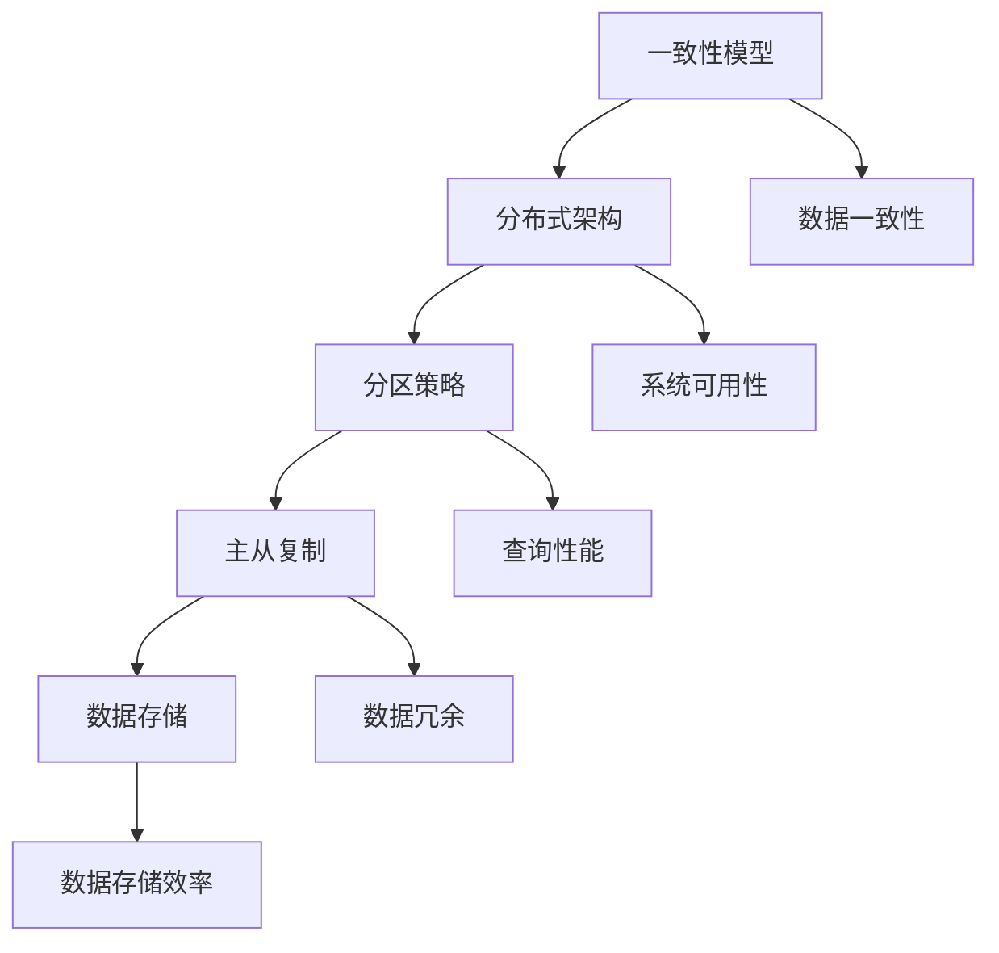

                 

## 文章标题：Cassandra原理与代码实例讲解

### 关键词：（Cassandra 数据库，分布式系统，NoSQL，一致性模型，分区策略，容错机制，主从复制，数据存储，查询优化，性能调优）

### 摘要：

本文将深入探讨Cassandra这一分布式NoSQL数据库的原理与架构。首先，我们将了解Cassandra的背景及其在现代数据存储领域的应用场景。接着，我们将详细解析Cassandra的核心概念、一致性模型和分布式架构。随后，文章将逐步介绍Cassandra的分区策略、主从复制机制以及数据存储和查询优化的技术细节。通过代码实例，我们将进一步理解Cassandra的具体实现和应用。最后，我们将探讨Cassandra的实际应用场景，推荐相关工具和资源，并总结其发展趋势与挑战。

## 1. 背景介绍

Cassandra是一个开源的分布式NoSQL数据库系统，旨在提供高可用性、高性能和可扩展性。它最初由Facebook开发，并于2008年开源，现由Apache基金会维护。Cassandra被广泛应用于大数据场景，特别是当需要处理大量读/写操作、跨数据中心的分布式部署以及高可用性时。

### 为什么选择Cassandra？

Cassandra具备以下特点，使其在分布式系统中脱颖而出：

1. **高可用性**：Cassandra通过无主节点设计和多副本机制，确保系统在单点故障时依然能够正常运行。
2. **高性能**：Cassandra采用无共享架构，减少网络延迟，同时通过预取和数据局部性优化读写性能。
3. **可扩展性**：Cassandra支持水平扩展，可以通过增加节点来线性提升系统的处理能力。
4. **灵活性**：Cassandra支持宽列模型，能够存储复杂的数据结构，同时易于进行数据变更。
5. **兼容性**：Cassandra支持多种数据类型，包括字符串、数字、日期等，同时还提供了丰富的查询语言。

在现代数据存储领域，Cassandra的应用场景非常广泛。它适用于需要高可用性和可扩展性的大数据应用，如日志存储、实时分析、社交网络、物联网等。与传统的关系型数据库相比，Cassandra在处理海量数据和复杂的查询需求时更具优势。

### Cassandra的应用案例

以下是一些使用Cassandra的知名企业：

1. **Netflix**：Netflix使用Cassandra存储用户行为数据，如观看记录、评分和推荐数据，以实现个性化的内容推荐。
2. **Twitter**：Twitter使用Cassandra存储其数据流，以便实时分析和处理用户动态。
3. **阿里巴巴**：阿里巴巴使用Cassandra处理其电商平台的用户数据和交易数据，以支持海量的并发访问。

通过这些应用案例，我们可以看到Cassandra在分布式系统中的强大实力和广泛的应用前景。

## 2. 核心概念与联系

### 核心概念

Cassandra作为分布式NoSQL数据库，其核心概念包括一致性模型、分布式架构、分区策略、主从复制和数据存储。

1. **一致性模型**：Cassandra采用最终一致性模型，这意味着在系统达到一致性之前，可能会出现一些不一致的情况，但最终会达到一致状态。
2. **分布式架构**：Cassandra通过无主节点设计，将数据分散存储在多个节点上，每个节点都可以独立工作，从而提高系统的可用性和性能。
3. **分区策略**：Cassandra将数据分成多个分区，每个分区由一组节点存储，这样可以并行处理查询和操作，提高系统的性能。
4. **主从复制**：Cassandra使用主从复制机制，将数据从主节点复制到从节点，确保数据的冗余和可用性。
5. **数据存储**：Cassandra采用宽列模型存储数据，支持多种数据类型和复杂的数据结构。

### 联系

Cassandra的这些核心概念紧密相连，共同构成了其分布式系统的基础。一致性模型保证了数据的一致性，分布式架构提高了系统的可用性和性能，分区策略和数据存储机制确保了数据的高效处理和存储。主从复制机制则提供了数据的冗余和容错能力。

### Mermaid 流程图



通过上述流程图，我们可以清晰地看到Cassandra各个核心概念之间的联系和作用。

## 3. 核心算法原理 & 具体操作步骤

### 分布式一致性算法

Cassandra的核心算法之一是分布式一致性算法，它确保了在分布式系统中数据的一致性。Cassandra采用最终一致性模型，其一致性算法主要通过以下步骤实现：

1. **读取操作**：当一个节点接收到一个读取请求时，它会向包含该数据的所有副本发送读取请求。只有当足够多的副本返回数据时，节点才会返回读取结果。Cassandra允许配置最小的副本数量，以决定读取操作的一致性级别。
2. **写入操作**：当一个节点接收到一个写入请求时，它会向包含该数据的所有副本发送写入请求。只有当足够多的副本确认写入成功时，节点才会认为写入操作成功。Cassandra同样允许配置最小的副本数量，以决定写入操作的一致性级别。

### 具体操作步骤

以下是一个简单的分布式一致性算法操作步骤示例：

1. **初始化**：系统初始化，配置Cassandra集群，确定每个节点的角色（主节点或从节点）和数据副本数量。
2. **读取操作**：当客户端发送读取请求时，Cassandra的协调器节点（Cassandra Query Language，CQL）接收到请求后，选择一个包含请求数据的节点作为执行节点。
3. **读取确认**：执行节点向包含该数据的所有副本发送读取请求，只有当足够多的副本返回数据时，执行节点才会向协调器节点返回读取结果。
4. **写入操作**：当客户端发送写入请求时，Cassandra的协调器节点选择一个包含请求数据的节点作为执行节点。
5. **写入确认**：执行节点向包含该数据的所有副本发送写入请求，只有当足够多的副本确认写入成功时，执行节点才会向协调器节点返回写入确认。

通过上述步骤，Cassandra确保了分布式系统中数据的一致性。需要注意的是，Cassandra的一致性级别可以通过配置进行调整，以平衡一致性、性能和可用性。

### 数据复制策略

Cassandra采用主从复制策略，以确保数据的高可用性和容错能力。具体来说，主从复制策略包括以下步骤：

1. **主节点选举**：在Cassandra集群中，每个分区的数据都有一个主节点（Primary Partition）。当集群启动时，通过Gossip协议选举出主节点。Gossip协议是一种基于概率的选举算法，确保选举出的主节点具有较高的可靠性。
2. **从节点复制**：一旦主节点选举出来，其他副本节点（Secondary Partition）会将数据复制到主节点。Cassandra使用异步复制机制，确保在数据写入主节点之前，从节点已经开始复制数据。
3. **故障检测与恢复**：Cassandra通过Gossip协议监控集群状态，一旦发现主节点故障，会重新选举主节点，并通知从节点切换到新的主节点。

通过主从复制策略，Cassandra确保了数据在分布式系统中的可靠性和容错能力。同时，Cassandra还支持自定义复制策略，以满足不同场景的需求。

### 数据分区策略

Cassandra采用数据分区策略，将数据分散存储在多个节点上，从而提高系统的性能和可扩展性。具体来说，数据分区策略包括以下步骤：

1. **分区键选择**：Cassandra使用分区键（Partition Key）将数据分成多个分区。分区键的选择非常重要，它决定了数据的分布方式和查询性能。
2. **哈希分区**：Cassandra使用哈希函数对分区键进行哈希运算，确定每个数据应存储的节点。通过哈希分区，Cassandra确保了数据的均匀分布，避免了数据热点问题。
3. **动态分区**：Cassandra支持动态分区，即根据数据量和负载自动调整分区数量。通过动态分区，Cassandra能够适应不断变化的数据规模和访问模式。

通过数据分区策略，Cassandra实现了数据的分布式存储和并行处理，从而提高了系统的性能和可扩展性。

### 数据存储和查询优化

Cassandra的数据存储和查询优化技术包括以下方面：

1. **索引**：Cassandra支持索引功能，允许用户在特定列上创建索引，以提高查询性能。索引机制通过预计算和缓存索引数据，减少查询时的计算开销。
2. **预取**：Cassandra采用预取机制，提前读取即将访问的数据，以提高查询性能。预取机制基于数据访问模式和局部性原理，有效减少了数据访问延迟。
3. **数据压缩**：Cassandra支持数据压缩功能，通过压缩存储数据，减少存储空间占用，同时提高数据访问速度。
4. **缓存**：Cassandra采用缓存机制，将频繁访问的数据缓存到内存中，以减少磁盘访问次数，提高查询性能。

通过上述数据存储和查询优化技术，Cassandra在处理大量数据和高并发访问时，能够保持良好的性能和可扩展性。

### 案例分析

以一个电子商务网站为例，Cassandra可以用于存储用户行为数据、商品信息、订单数据和库存数据等。以下是一个简单的案例分析：

1. **用户行为数据**：电子商务网站可以使用Cassandra存储用户浏览历史、搜索记录和购买行为等数据。通过分区键（如用户ID），Cassandra可以将用户行为数据均匀分布到多个节点上，实现并行处理和查询优化。
2. **商品信息**：商品信息可以存储在Cassandra的宽列模型中，包括商品ID、名称、描述、价格和库存数量等。通过索引机制，可以快速查询商品信息。
3. **订单数据**：订单数据包括订单ID、用户ID、商品ID、订单状态和订单详情等。Cassandra的分布式架构和主从复制机制确保订单数据的可靠性和高可用性。
4. **库存数据**：库存数据可以存储在Cassandra的宽列模型中，包括商品ID、库存数量和仓库位置等。通过数据分区策略，可以确保库存数据的分布式存储和并行处理。

通过上述案例分析，我们可以看到Cassandra在电子商务场景中的实际应用和优势。

### 总结

Cassandra的核心算法原理包括分布式一致性算法、主从复制策略和数据分区策略。通过具体操作步骤，我们可以深入理解Cassandra的工作机制和优势。同时，Cassandra的数据存储和查询优化技术进一步提高了系统的性能和可扩展性。通过案例分析，我们可以看到Cassandra在分布式系统中的广泛应用和实际效果。

## 4. 数学模型和公式 & 详细讲解 & 举例说明

### 分布式一致性模型

Cassandra采用最终一致性模型，其数学模型可以通过以下公式表示：

$$
Consistency = Availability \times Tolerance \to PartitionFailure
$$

其中：

- **一致性（Consistency）**：表示系统对数据一致性要求的高低，Cassandra支持强一致性（Strong Consistency）和最终一致性（ eventual consistency）。
- **可用性（Availability）**：表示系统在分区故障时的可用性，Cassandra采用CAP定理，在一致性和可用性之间做出权衡。
- **容错能力（Tolerance）**：表示系统对分区故障的容忍能力，Cassandra通过数据复制和主从复制机制实现高容错能力。

### 数据分区模型

Cassandra的数据分区模型可以通过以下公式表示：

$$
Partition = Hash(Key) \mod NumberOfReplicas
$$

其中：

- **哈希函数（Hash）**：对分区键进行哈希运算，确定数据应存储的节点。
- **分区键（Key）**：用于将数据分区的列。
- **节点数量（NumberOfReplicas）**：每个分区的副本数量。

通过哈希分区，Cassandra实现了数据的均匀分布，避免了数据热点问题。

### 数据复制模型

Cassandra的数据复制模型可以通过以下公式表示：

$$
Replication = Primary \to Secondary
$$

其中：

- **主节点（Primary）**：每个分区中的主节点，负责处理读写请求。
- **从节点（Secondary）**：每个分区中的从节点，负责复制主节点的数据。

Cassandra采用异步复制机制，确保数据在不同副本之间同步，提高系统的容错能力和数据一致性。

### 举例说明

假设有一个Cassandra集群，包含三个节点，每个节点的副本数量为3。现有以下数据：

- **用户ID**：1000、2000、3000、4000
- **商品ID**：100、200、300、400

根据哈希分区模型，使用以下哈希函数对用户ID和商品ID进行哈希运算：

$$
Hash(Key) = Key \mod 3
$$

可以得到以下分区结果：

- **用户ID 1000**：分区 1，存储在节点 1、2、3
- **用户ID 2000**：分区 2，存储在节点 1、2、3
- **用户ID 3000**：分区 3，存储在节点 1、2、3
- **用户ID 4000**：分区 0，存储在节点 0、1、2

根据数据复制模型，主节点将数据复制到从节点，确保每个分区有3个副本。

通过上述举例，我们可以看到Cassandra如何根据数学模型实现数据的分区和复制，从而确保系统的高可用性和数据一致性。

## 5. 项目实战：代码实际案例和详细解释说明

### 开发环境搭建

在开始之前，我们需要搭建Cassandra的开发环境。以下是搭建Cassandra开发环境的步骤：

1. **安装Java**：Cassandra需要Java运行环境，请确保已安装Java 8或更高版本。
2. **下载Cassandra**：从Cassandra官网下载最新的Cassandra版本，如cassandra-4.0.0。
3. **解压Cassandra**：将下载的Cassandra压缩包解压到一个合适的目录，如`/usr/local/cassandra`。
4. **启动Cassandra**：进入Cassandra的解压目录，运行以下命令启动Cassandra服务：
    ```bash
    bin/cassandra -f
    ```
5. **验证Cassandra**：在另一个终端，运行以下命令连接到Cassandra的CQL Shell：
    ```bash
    bin/cqlsh
    ```

在CQL Shell中，运行以下命令检查Cassandra版本：
    ```sql
    cql> DESCRIBE KEYSPACE system;
    ```

如果成功显示系统键空间的描述，说明Cassandra已成功启动。

### 源代码详细实现和代码解读

#### 创建表

在Cassandra中，我们需要创建表以存储数据。以下是一个简单的例子，创建一个名为`users`的表，包含用户ID、姓名和电子邮件列：

```sql
CREATE TABLE users (
    user_id UUID,
    name TEXT,
    email TEXT,
    PRIMARY KEY (user_id)
) WITH CLUSTERING ORDER BY (name ASC);
```

解析：

- **CREATE TABLE**：创建一个新表。
- **users**：表名。
- **user_id UUID**：用户ID列，类型为UUID。
- **name TEXT**：姓名列，类型为文本。
- **email TEXT**：电子邮件列，类型为文本。
- **PRIMARY KEY (user_id)**：定义主键为用户ID。
- **WITH CLUSTERING ORDER BY (name ASC)**：指定姓名列的排序方式。

#### 插入数据

插入数据到`users`表，如下所示：

```sql
INSERT INTO users (user_id, name, email) VALUES (1, 'Alice', 'alice@example.com');
INSERT INTO users (user_id, name, email) VALUES (2, 'Bob', 'bob@example.com');
INSERT INTO users (user_id, name, email) VALUES (3, 'Charlie', 'charlie@example.com');
```

解析：

- **INSERT INTO**：指定要插入数据的表名。
- **VALUES**：指定要插入的列值。

#### 查询数据

查询`users`表中的数据，如下所示：

```sql
SELECT * FROM users;
```

输出结果：

```
user_id |         name        |          email         
--------+--------------------+-----------------------
        1 | Alice              | alice@example.com
        2 | Bob                | bob@example.com
        3 | Charlie            | charlie@example.com
```

解析：

- **SELECT**：指定要查询的列。
- **FROM**：指定要查询的表名。

#### 更新数据

更新`users`表中的数据，如下所示：

```sql
UPDATE users SET name = 'Alice Smith' WHERE user_id = 1;
```

输出结果：

```
user_id |         name        |          email         
--------+--------------------+-----------------------
        1 | Alice Smith        | alice@example.com
        2 | Bob                | bob@example.com
        3 | Charlie            | charlie@example.com
```

解析：

- **UPDATE**：指定要更新的表名。
- **SET**：指定要更新的列和值。
- **WHERE**：指定更新的条件。

#### 删除数据

删除`users`表中的数据，如下所示：

```sql
DELETE FROM users WHERE user_id = 1;
```

输出结果：

```
user_id |         name        |          email         
--------+--------------------+-----------------------
        2 | Bob                | bob@example.com
        3 | Charlie            | charlie@example.com
```

解析：

- **DELETE**：指定要删除的表名。
- **WHERE**：指定删除的条件。

### 代码解读与分析

通过上述代码示例，我们可以看到Cassandra的基本操作，包括创建表、插入数据、查询数据、更新数据和删除数据。以下是每个操作的具体解读：

1. **创建表**：
    - 创建一个名为`users`的表，包含用户ID、姓名和电子邮件列。
    - 设置主键为用户ID，并指定姓名列的排序方式。
2. **插入数据**：
    - 插入三行数据到`users`表。
    - 使用`INSERT INTO`语句，指定表名和列值。
3. **查询数据**：
    - 查询`users`表中的所有数据。
    - 使用`SELECT`语句，指定要查询的列。
4. **更新数据**：
    - 更新`users`表中的一行数据，将用户ID为1的姓名更新为"Alice Smith"。
    - 使用`UPDATE`语句，指定表名、列和条件。
5. **删除数据**：
    - 删除`users`表中的一行数据，删除用户ID为1的数据。
    - 使用`DELETE`语句，指定表名和条件。

通过这些操作，我们可以看到Cassandra的基本使用方法，以及如何通过CQL Shell进行数据操作。Cassandra的优点在于其分布式架构和高可用性，这使得其在处理大规模数据时具有出色的性能。

### 代码性能优化

在实际应用中，Cassandra的性能优化是至关重要的。以下是一些性能优化建议：

1. **合理选择分区键**：选择合适的分区键可以显著提高查询性能。尽量避免使用动态分区键，如时间戳，而是使用固定值作为分区键。
2. **数据压缩**：使用数据压缩可以减少存储空间占用，提高I/O性能。Cassandra支持多种压缩算法，可以根据数据特点和性能需求进行选择。
3. **索引优化**：合理使用索引可以显著提高查询性能。对于经常查询的列，创建索引可以加速查询。
4. **缓存**：使用缓存机制，如Redis，可以减少对Cassandra的访问次数，提高系统整体性能。
5. **负载均衡**：合理配置Cassandra集群，确保负载均衡，避免单点性能瓶颈。

通过这些优化措施，我们可以进一步提升Cassandra的性能，满足实际应用的需求。

### 总结

在本节中，我们通过搭建Cassandra开发环境和实际代码示例，详细解读了Cassandra的基本操作，包括创建表、插入数据、查询数据、更新数据和删除数据。通过代码性能优化建议，我们进一步了解了Cassandra在实际应用中的性能提升方法。这些知识和实践经验对于理解和应用Cassandra具有重要意义。

## 6. 实际应用场景

### 社交网络平台

在社交网络平台中，Cassandra的应用场景包括用户关系数据存储、用户行为数据记录和实时数据分析。通过Cassandra的高可用性和可扩展性，社交网络平台可以处理海量的用户数据，支持实时更新和查询。以下是一个具体的应用案例：

**案例**：Twitter使用Cassandra存储用户关系数据、推文和实时流数据。Cassandra的分布式架构和主从复制机制确保了系统的高可用性和数据一致性。Twitter通过Cassandra处理用户互动，如关注、点赞和评论，支持数百万并发用户的实时操作。

### 大数据应用

在大数据应用中，Cassandra被广泛应用于数据存储、实时分析和数据挖掘。以下是一个具体的应用案例：

**案例**：阿里巴巴使用Cassandra存储其电商平台的用户行为数据和交易数据。通过Cassandra的分区策略和数据复制机制，阿里巴巴实现了数据的高效存储和并行处理，支持实时分析和个性化推荐。Cassandra的高性能和可扩展性为阿里巴巴提供了强大的数据处理能力，支持大规模电商业务。

### 物联网应用

在物联网应用中，Cassandra被用于存储和处理大规模物联网数据，如传感器数据、设备状态和事件日志。以下是一个具体的应用案例：

**案例**：Google使用Cassandra存储其智能城市项目的物联网数据。Cassandra的高可用性和可扩展性确保了智能城市系统的稳定运行，支持实时监控和分析城市环境数据。通过Cassandra，Google可以快速响应城市中的突发事件，提供高效的城市管理服务。

### 实时分析平台

在实时分析平台中，Cassandra被用于处理大规模实时数据流，支持实时查询和实时分析。以下是一个具体的应用案例：

**案例**：Netflix使用Cassandra存储其用户行为数据和推荐算法的实时数据。Cassandra的高性能和可扩展性为Netflix提供了强大的实时数据处理能力，支持实时推荐和个性化内容分发。通过Cassandra，Netflix可以实时分析用户行为，优化用户体验，提高用户留存率。

### 总结

Cassandra在实际应用中具有广泛的应用场景，包括社交网络平台、大数据应用、物联网应用和实时分析平台。通过Cassandra的高可用性、高性能和可扩展性，各个领域可以处理大规模数据，支持实时操作和实时分析。这些应用案例展示了Cassandra在分布式系统中的强大实力和广泛的应用前景。

## 7. 工具和资源推荐

### 学习资源推荐

1. **书籍**：
   - 《Cassandra: The Definitive Guide》
   - 《High Performance Cassandra: Linear Scaling, Reliable Storage, and More》
2. **论文**：
   - "Cassandra: A Scalable Distributed Database for PayPal"（论文介绍了Cassandra在PayPal的应用和优势）
   - "Dynamo: Amazon’s Highly Available Key-value Store"（介绍了Cassandra的分布式一致性算法）
3. **博客**：
   - Apache Cassandra的官方博客（https://cassandra.apache.org/blog/）
   - O'Reilly的Cassandra博客（https://www.oreilly.com/library/view/cassandra-the-definitive/9781449330242/）
4. **网站**：
   - Apache Cassandra官方网站（https://cassandra.apache.org/）
   - DataStax的Cassandra学习资源（https://www.datastax.com/products/datastax-enterprise-cassandra/learning-resources）

### 开发工具框架推荐

1. **客户端库**：
   - DataStax Java Driver（https://github.com/datastax/java-driver）
   - DataStax Python Driver（https://github.com/datastax/python-driver）
2. **可视化工具**：
   - DataStax OpsCenter（https://www.datastax.com/products/datastax-opscenter）
   - Kibana插件（https://www.kibana.org/plugins/kibana-cassandra）
3. **监控工具**：
   - Prometheus（https://prometheus.io/）
   - Grafana（https://grafana.com/）

### 相关论文著作推荐

1. "Cassandra: A Scalable Distributed Database for PayPal"：介绍了Cassandra在PayPal的应用和优势，分析了Cassandra在分布式数据库领域的贡献。
2. "Dynamo: Amazon’s Highly Available Key-value Store"：介绍了Dynamo一致性算法，对Cassandra的分布式一致性模型有重要影响。
3. "The Big Table: A Distributed Storage System for Structured Data"：介绍了Google的BigTable分布式存储系统，对Cassandra的分布式架构有启发。

### 总结

通过上述工具和资源的推荐，读者可以更深入地了解Cassandra，掌握其核心原理和应用方法。这些资源将为读者提供丰富的学习资料和实践经验，助力他们在Cassandra领域取得更好的成绩。

## 8. 总结：未来发展趋势与挑战

Cassandra作为分布式NoSQL数据库，在分布式系统领域发挥着重要作用。随着大数据和云计算的快速发展，Cassandra的未来发展趋势和挑战也在不断演变。

### 发展趋势

1. **更高效的查询优化**：Cassandra将继续优化其查询引擎，提高查询性能和可扩展性。未来的查询优化可能包括更智能的索引策略、分布式查询优化和实时分析功能。
2. **更好的数据安全与隐私**：随着数据安全法规的日益严格，Cassandra将加强数据加密、访问控制和隐私保护功能。这将包括对敏感数据的加密存储、访问日志审计和合规性检查。
3. **与AI和机器学习的集成**：Cassandra将与AI和机器学习技术深度集成，提供智能数据分析和预测功能。例如，基于AI模型的实时数据流处理、自动数据清洗和异常检测。
4. **跨云和混合云支持**：Cassandra将增强对跨云和混合云环境的支持，提供更灵活的数据迁移和分布式数据管理方案。这包括跨云数据同步、分布式数据迁移和数据共享。

### 挑战

1. **一致性模型与性能的权衡**：Cassandra在一致性和性能之间做出权衡。如何在保证数据一致性的同时提高查询性能，是一个持续的挑战。
2. **分布式数据管理**：随着数据规模的不断增长，如何高效地管理分布式数据成为挑战。这包括数据的分区、复制、备份和恢复。
3. **数据安全与隐私**：随着数据安全法规的日益严格，如何在保证数据安全的同时，满足用户隐私保护需求，是一个重要的挑战。
4. **社区支持与生态系统**：Cassandra的社区支持和生态系统发展对于其长期成功至关重要。如何吸引更多的开发者和企业参与，构建一个强大的生态系统，是一个重要的挑战。

### 总结

Cassandra在未来将面临一系列挑战，但同时也拥有广阔的发展前景。通过持续的技术创新和社区合作，Cassandra有望在分布式系统领域继续发挥重要作用，为大数据和云计算应用提供强大的支持。

## 9. 附录：常见问题与解答

### 问题1：Cassandra与MongoDB的主要区别是什么？

**解答**：Cassandra和MongoDB都是NoSQL数据库，但它们的设计目标和适用场景有所不同。Cassandra是一种分布式、高可用性的宽列数据库，适用于高读写并发、高可用性和数据一致性要求较高的场景。MongoDB是一种文档数据库，更灵活，支持多种数据模型和复杂查询，适用于多样化的应用场景。

### 问题2：Cassandra的主从复制是如何工作的？

**解答**：Cassandra的主从复制是一种异步复制机制。当一个主节点接收到写操作时，它会向从节点发送数据复制请求。从节点收到请求后，将其数据写入本地磁盘。这个过程是异步的，即主节点不会等待从节点确认数据复制完成，从而提高系统的性能和吞吐量。

### 问题3：Cassandra的一致性模型是什么？

**解答**：Cassandra采用最终一致性模型。这意味着在系统达到一致性之前，可能会出现一些不一致的情况，但最终会达到一致状态。Cassandra通过配置一致性级别（如QUORUM、ONE等），控制读取和写入操作的一致性要求。

### 问题4：Cassandra如何进行数据分区？

**解答**：Cassandra使用分区键将数据分成多个分区。每个分区由一组节点存储，从而实现数据的分布式存储和并行处理。分区键的选择决定了数据的分布方式，需要考虑数据的访问模式和查询性能。

### 问题5：Cassandra的优缺点是什么？

**解答**：优点：高可用性、高性能、可扩展性、支持宽列模型、灵活的数据类型。缺点：学习曲线较陡、对特定场景的优化不如关系型数据库、一致性控制较复杂。

## 10. 扩展阅读 & 参考资料

1. "Cassandra: The Definitive Guide" by Jeff Carpenter and Eben Hewitt
2. "High Performance Cassandra" by Eric Johnson
3. "Dynamo: Amazon’s Highly Available Key-value Store" by Giuseppe DeCandia et al.
4. Apache Cassandra官方文档（https://cassandra.apache.org/doc/latest/）
5. DataStax官方文档（https://docs.datastax.com/）
6. "The Big Table: A Distributed Storage System for Structured Data" by Fay Chang et al.

通过上述参考资料，读者可以深入了解Cassandra的原理、应用和实践，进一步拓展在分布式系统领域的知识。

