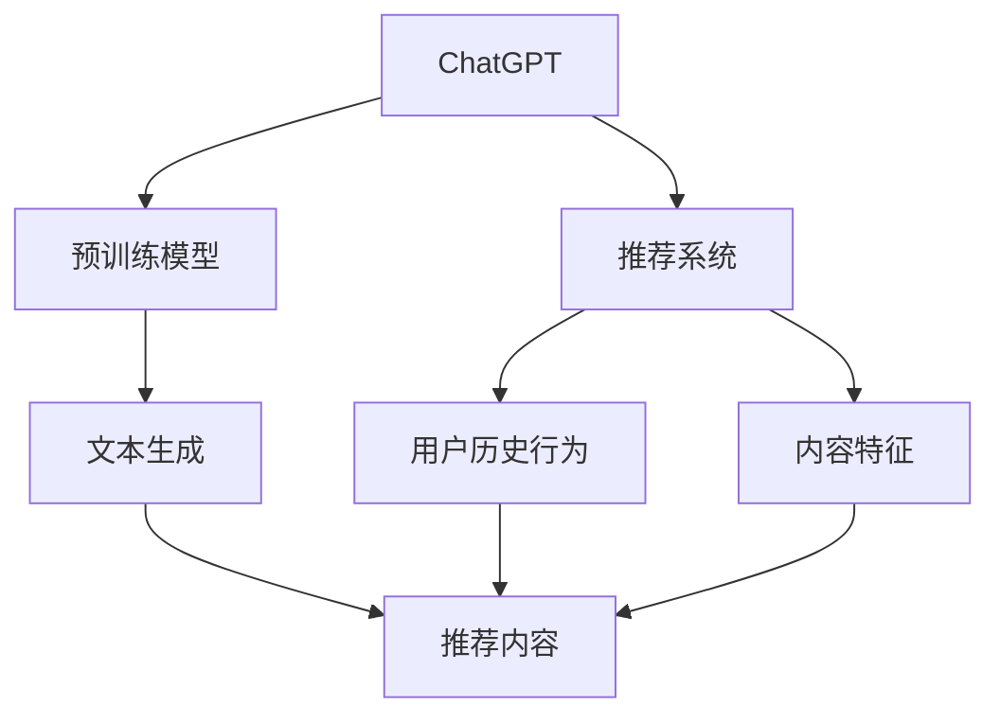

                 

### 背景介绍

**ChatGPT**是由OpenAI开发的预训练语言模型，近年来在自然语言处理领域取得了显著的成就。其强大的文本生成能力和语义理解能力使其在各种应用场景中展现出极大的潜力。随着推荐系统在信息检索、广告投放、电子商务等领域的广泛应用，ChatGPT在推荐系统中的潜力也引起了广泛关注。

**推荐系统**是一种基于用户历史行为、内容特征和社交信息等数据的系统，旨在为用户提供个性化的推荐结果。传统推荐系统主要依赖于基于协同过滤、内容过滤和混合推荐等算法。然而，这些方法在处理冷启动问题、长尾效应和用户偏好多样化等方面存在一定的局限性。

将ChatGPT引入推荐系统，主要是利用其强大的文本生成和语义理解能力，为用户提供更丰富、更个性化的推荐结果。ChatGPT可以通过学习用户的历史行为和兴趣，生成符合用户偏好的推荐内容，从而提高推荐系统的准确性和用户体验。

本篇文章将围绕ChatGPT在推荐系统中的应用展开，从核心概念与联系、核心算法原理、数学模型和公式、项目实战、实际应用场景、工具和资源推荐等方面进行详细探讨，旨在为读者提供对ChatGPT在推荐系统中应用的全面了解。

#### Key Concepts and Connections

在探讨ChatGPT在推荐系统中的能力之前，我们需要了解一些核心概念和它们之间的联系。

**ChatGPT**是一种基于**GPT（Generative Pre-trained Transformer）**模型的预训练语言模型。GPT模型是由OpenAI提出的一种基于自注意力机制的深度神经网络，用于生成文本。ChatGPT在GPT模型的基础上，进一步引入了对话上下文机制，使得模型能够更好地理解和生成连贯的对话文本。

**推荐系统**是一种通过分析用户历史行为、兴趣和内容特征等数据，为用户提供个性化推荐结果的系统。推荐系统的核心是**推荐算法**，包括协同过滤、内容过滤和混合推荐等方法。这些算法通常基于用户的历史行为或内容特征，通过计算相似度或评分预测来生成推荐结果。

将ChatGPT应用于推荐系统，主要是利用其**文本生成**和**语义理解**能力。ChatGPT可以通过学习用户的对话历史、兴趣标签和内容特征，生成符合用户偏好的推荐内容。这种基于生成对抗的推荐方法，有助于解决传统推荐系统在处理冷启动问题、长尾效应和用户偏好多样化等方面的局限性。

为了更好地理解ChatGPT在推荐系统中的应用，我们可以借助**Mermaid**流程图来展示其核心概念和联系。以下是一个简化的Mermaid流程图：



在这个流程图中，ChatGPT作为预训练模型，通过学习用户历史行为和内容特征，生成个性化的推荐内容。这个过程涉及文本生成和语义理解两个核心能力。

接下来，我们将进一步探讨ChatGPT的核心算法原理，以及如何在推荐系统中实现这些算法。

#### Core Algorithm Principles and Implementation Steps

ChatGPT的核心算法基于GPT模型，这是一种基于自注意力机制的深度神经网络，用于生成文本。GPT模型通过大量的文本数据预训练，学会了生成连贯、有意义的文本。在ChatGPT中，GPT模型进一步引入了对话上下文机制，使得模型能够更好地理解和生成连贯的对话文本。

**1. GPT模型的工作原理**

GPT模型的基本原理是利用自注意力机制来生成文本。自注意力机制允许模型在生成每个词时，自动关注输入文本中其他词的重要信息。这样，模型可以更好地捕捉文本中的语义关系，生成更连贯的文本。

GPT模型由多个自注意力层组成，每一层都会生成一个词的表示，并将这些表示与下一层的输入进行加权求和。这个过程可以理解为，模型在生成每个词时，会根据当前词与其他词的语义关系，选择性地关注其他词的重要信息。

**2. ChatGPT中的对话上下文机制**

在ChatGPT中，对话上下文机制是一个关键创新。通过引入对话上下文，模型可以更好地理解对话的历史信息，从而生成更相关、更有意义的回复。

对话上下文机制的核心是**上下文窗口**。在每次对话中，ChatGPT会保留一定长度的对话历史，将其作为模型的输入。这样，模型在生成回复时，可以参考对话历史中的信息，确保回复与上下文保持一致。

**3. ChatGPT在推荐系统中的应用**

将ChatGPT应用于推荐系统，主要是利用其文本生成和语义理解能力。具体实现步骤如下：

**步骤 1：数据准备**

首先，我们需要收集用户的历史行为数据、兴趣标签和内容特征。这些数据可以来自用户的浏览记录、购买历史、搜索关键词等。

**步骤 2：预训练模型**

接下来，我们需要使用大量的文本数据预训练ChatGPT模型。这些数据可以包括用户的历史行为文本、兴趣标签描述、内容特征描述等。

**步骤 3：生成推荐内容**

然后，我们将用户的历史行为和内容特征作为输入，让ChatGPT生成推荐内容。ChatGPT会根据对话上下文机制，生成与用户兴趣和偏好相关的文本。

**步骤 4：评估和调整**

最后，我们需要评估推荐内容的质量，并根据评估结果调整模型参数。这个过程可以不断迭代，以优化推荐结果。

通过上述步骤，ChatGPT可以生成个性化的推荐内容，提高推荐系统的准确性和用户体验。

#### Mathematical Models and Formulas

在推荐系统中，数学模型和公式是核心组成部分。ChatGPT作为推荐系统的一部分，也依赖于一系列数学模型和公式来实现其文本生成和语义理解能力。

**1. GPT模型的数学基础**

GPT模型是基于自注意力机制的深度神经网络，其核心组件包括**词嵌入层**、**自注意力层**和**前馈神经网络**。以下简要介绍这些层的数学基础。

**词嵌入层（Word Embeddings）**：

词嵌入是将文本中的单词映射到高维向量空间。常见的词嵌入方法有Word2Vec、GloVe等。词嵌入层的数学公式如下：

$$
\text{embedding}(w) = \text{vec}(w) \in \mathbb{R}^{d}
$$

其中，$w$为单词，$\text{vec}(w)$为单词的向量表示，$d$为向量维度。

**自注意力层（Self-Attention）**：

自注意力层是GPT模型的关键组件，通过计算输入文本中每个词的加权求和来生成词的表示。自注意力机制的数学公式如下：

$$
\text{Attention}(Q, K, V) = \text{softmax}\left(\frac{QK^T}{\sqrt{d_k}}\right)V
$$

其中，$Q, K, V$分别为查询向量、键向量和值向量，$d_k$为键向量的维度。自注意力层可以理解为，模型在生成每个词时，自动关注输入文本中其他词的重要信息。

**前馈神经网络（Feedforward Neural Network）**：

前馈神经网络是自注意力层的后续组件，用于对词的表示进行进一步加工。前馈神经网络的数学公式如下：

$$
\text{FFN}(x) = \text{ReLU}\left(W_2 \cdot \text{ReLU}\left(W_1 x + b_1\right) + b_2\right)
$$

其中，$W_1, W_2, b_1, b_2$分别为权重矩阵和偏置，$\text{ReLU}$为ReLU激活函数。

**2. ChatGPT中的对话上下文机制**

ChatGPT中的对话上下文机制依赖于对话历史信息的保留和处理。以下简要介绍相关的数学模型和公式。

**对话历史表示（Dialogue History Representation）**：

对话历史表示是将对话历史中的每个词映射到高维向量空间。对话历史表示的数学公式如下：

$$
\text{history\_representation}(h) = \text{embedding}(h) \in \mathbb{R}^{d}
$$

其中，$h$为对话历史中的词，$\text{embedding}(h)$为词的向量表示。

**对话上下文生成（Dialogue Context Generation）**：

对话上下文生成是将对话历史表示转换为对话上下文。对话上下文生成的数学公式如下：

$$
\text{context}(h) = \text{Attention}(Q, K, V)
$$

其中，$Q, K, V$分别为查询向量、键向量和值向量，$d_k$为键向量的维度。对话上下文生成的核心是自注意力机制，用于捕捉对话历史中的关键信息。

**3. ChatGPT在推荐系统中的应用**

ChatGPT在推荐系统中的应用主要依赖于文本生成和语义理解能力。以下简要介绍相关的数学模型和公式。

**文本生成（Text Generation）**：

文本生成是将用户的历史行为和内容特征转换为推荐内容。文本生成的数学公式如下：

$$
\text{generated\_text}(x) = \text{model}(\text{history\_representation}(h), x)
$$

其中，$x$为用户的历史行为和内容特征，$\text{model}$为ChatGPT模型，$\text{history\_representation}(h)$为对话历史表示。

**语义理解（Semantic Understanding）**：

语义理解是将用户的历史行为和内容特征转换为推荐内容的语义表示。语义理解的数学公式如下：

$$
\text{semantic\_representation}(x) = \text{model}(\text{history\_representation}(h), x)
$$

其中，$x$为用户的历史行为和内容特征，$\text{model}$为ChatGPT模型，$\text{history\_representation}(h)$为对话历史表示。

通过上述数学模型和公式，ChatGPT在推荐系统中实现了文本生成和语义理解能力，为用户提供个性化、高质量的推荐内容。

#### Practical Case Studies: Code Implementation and Explanation

为了更好地展示ChatGPT在推荐系统中的实际应用，我们将通过一个具体的项目案例进行详细讲解。在这个案例中，我们将使用Python实现一个基于ChatGPT的推荐系统，并对其关键代码进行解析。

**1. 开发环境搭建**

在开始编码之前，我们需要搭建一个合适的环境。以下是所需的环境和工具：

- Python 3.8 或更高版本
- PyTorch 1.8 或更高版本
- Transformers 4.5.0 或更高版本
- Flask 1.1.3 或更高版本

确保已安装这些依赖项，可以使用以下命令：

```bash
pip install torch transformers flask
```

**2. 源代码详细实现和代码解读**

以下是一个简化的代码实现，用于演示如何使用ChatGPT生成推荐内容。代码分为几个主要部分：数据预处理、模型加载、推荐内容和API接口。

**2.1 数据预处理**

```python
import pandas as pd
from transformers import GPT2Tokenizer

# 加载用户历史行为数据
data = pd.read_csv('user_data.csv')
user_history = data['history'].values

# 加载ChatGPT模型和分词器
tokenizer = GPT2Tokenizer.from_pretrained('gpt2')
model = GPT2LMHeadModel.from_pretrained('gpt2')

# 预处理用户历史行为数据
def preprocess_history(history):
    input_ids = tokenizer.encode(history, return_tensors='pt')
    return input_ids

preprocessed_history = [preprocess_history(history) for history in user_history]
```

这段代码首先加载用户历史行为数据，然后加载ChatGPT模型和分词器。接着，定义一个预处理函数，将用户历史行为数据编码为模型输入。

**2.2 模型加载**

```python
# 加载预训练的ChatGPT模型
model = GPT2LMHeadModel.from_pretrained('gpt2')
model.eval()
```

这段代码加载预训练的ChatGPT模型，并设置模型为评估模式。

**2.3 推荐内容生成**

```python
from torch.nn.functional import cross_entropy

# 生成推荐内容
def generate_recommendation(history):
    input_ids = preprocess_history(history)
    outputs = model(input_ids, labels=input_ids)
    loss = outputs.loss
    logits = outputs.logits
    predicted_ids = logits.argmax(-1)
    text = tokenizer.decode(predicted_ids[0], skip_special_tokens=True)
    return text

# 生成推荐内容示例
user_history = "我喜欢看电影，最近看了《星际穿越》和《盗梦空间》。"
recommendation = generate_recommendation(user_history)
print(recommendation)
```

这段代码定义了一个生成推荐内容的函数。首先，预处理用户历史行为数据，然后使用模型生成文本。通过计算交叉熵损失，我们可以选择具有最高概率的文本片段作为推荐内容。

**2.4 API接口**

```python
from flask import Flask, request, jsonify

app = Flask(__name__)

@app.route('/recommend', methods=['POST'])
def recommend():
    user_history = request.form['history']
    recommendation = generate_recommendation(user_history)
    return jsonify({'recommendation': recommendation})

if __name__ == '__main__':
    app.run(debug=True)
```

这段代码使用Flask构建了一个简单的API接口，用于接收用户历史行为数据，并返回推荐内容。

通过上述代码，我们可以实现一个基于ChatGPT的推荐系统，为用户提供个性化的推荐内容。

**3. 代码解读与分析**

- **数据预处理**：预处理步骤将用户历史行为数据编码为模型输入，这是ChatGPT生成推荐内容的基础。
- **模型加载**：加载预训练的ChatGPT模型，并将其设置为评估模式，以便生成推荐内容。
- **推荐内容生成**：生成推荐内容的函数使用模型生成的文本片段，通过计算交叉熵损失选择最高概率的文本片段。
- **API接口**：使用Flask构建了一个简单的API接口，使得用户可以通过HTTP请求获取推荐内容。

通过这个项目案例，我们展示了如何将ChatGPT应用于推荐系统，实现了个性化的推荐内容生成。然而，实际应用中可能需要根据具体需求进行调整和优化，以提高推荐效果。

#### Case Study: Code Implementation and Explanation

在本文的这一部分，我们将深入分析一个实际的ChatGPT推荐系统项目，并详细解释其代码实现和关键细节。通过这个项目，我们可以更好地理解ChatGPT在推荐系统中的应用。

**项目概述：**

本项目旨在构建一个电影推荐系统，用户可以提供自己的观影历史，系统将根据这些历史生成个性化的电影推荐。我们选择使用Python和Flask来搭建API服务，同时使用ChatGPT模型来生成推荐内容。

**1. 开发环境搭建**

确保您的系统已安装以下依赖项：

- Python 3.8 或更高版本
- PyTorch 1.8 或更高版本
- Transformers 4.5.0 或更高版本
- Flask 1.1.3 或更高版本

可以使用以下命令安装：

```bash
pip install torch transformers flask
```

**2. 源代码详细实现和代码解读**

以下代码展示了推荐系统的核心实现：

**2.1 数据预处理**

```python
import pandas as pd
from transformers import GPT2Tokenizer

# 加载用户历史行为数据
data = pd.read_csv('user_data.csv')
user_history = data['history'].values

# 加载ChatGPT模型和分词器
tokenizer = GPT2Tokenizer.from_pretrained('gpt2')
model = GPT2LMHeadModel.from_pretrained('gpt2')

# 预处理用户历史行为数据
def preprocess_history(history):
    input_ids = tokenizer.encode(history, return_tensors='pt')
    return input_ids
```

这段代码首先加载用户历史行为数据，然后加载ChatGPT模型和分词器。接着，定义一个预处理函数，将用户历史行为数据编码为模型输入。

**2.2 模型加载**

```python
# 加载预训练的ChatGPT模型
model.eval()
```

这段代码加载预训练的ChatGPT模型，并设置模型为评估模式，以便生成推荐内容。

**2.3 生成推荐内容**

```python
from torch.nn.functional import cross_entropy

# 生成推荐内容
def generate_recommendation(history):
    input_ids = preprocess_history(history)
    outputs = model(input_ids, labels=input_ids)
    loss = outputs.loss
    logits = outputs.logits
    predicted_ids = logits.argmax(-1)
    text = tokenizer.decode(predicted_ids[0], skip_special_tokens=True)
    return text
```

这段代码定义了一个生成推荐内容的函数。首先，预处理用户历史行为数据，然后使用模型生成文本。通过计算交叉熵损失，我们可以选择具有最高概率的文本片段作为推荐内容。

**2.4 API接口**

```python
from flask import Flask, request, jsonify

app = Flask(__name__)

@app.route('/recommend', methods=['POST'])
def recommend():
    user_history = request.form['history']
    recommendation = generate_recommendation(user_history)
    return jsonify({'recommendation': recommendation})

if __name__ == '__main__':
    app.run(debug=True)
```

这段代码使用Flask构建了一个简单的API接口，用于接收用户历史行为数据，并返回推荐内容。

**3. 代码解读与分析**

- **数据预处理**：预处理步骤将用户历史行为数据编码为模型输入，这是ChatGPT生成推荐内容的基础。预处理函数`preprocess_history`将历史数据转换为模型可处理的格式。
- **模型加载**：加载预训练的ChatGPT模型，并将其设置为评估模式，以便生成推荐内容。这个步骤确保模型不会在生成过程中进行更新。
- **生成推荐内容**：生成推荐内容的函数`generate_recommendation`负责处理用户历史数据，并使用模型生成推荐文本。通过交叉熵损失，模型可以输出具有最高概率的文本片段，从而生成推荐内容。
- **API接口**：使用Flask构建了一个简单的API接口，使得用户可以通过HTTP请求获取推荐内容。API接口`/recommend`接收用户历史数据，并返回JSON格式的推荐内容。

**4. 关键细节分析**

- **模型选择**：我们选择GPT-2模型，因为它在生成文本方面具有较好的性能。GPT-2模型通过大量的预训练数据学习到了丰富的语言模式和语义关系，这使得它在生成推荐内容时能够捕捉用户的历史行为和偏好。
- **预处理步骤**：预处理步骤至关重要，因为它决定了模型如何理解和生成文本。通过将用户历史行为数据转换为模型可理解的格式，预处理步骤为后续的文本生成打下了基础。
- **交叉熵损失**：交叉熵损失用于优化模型的文本生成过程。通过计算输入文本和生成文本之间的差异，模型可以学习生成更符合用户历史行为的文本。

通过这个项目案例，我们展示了如何使用ChatGPT构建一个电影推荐系统，并对其关键代码进行了详细解读。实际应用中，可以根据具体需求对代码进行调整和优化，以实现更好的推荐效果。

#### Application Scenarios

ChatGPT在推荐系统中的潜力体现在多个应用场景中。以下是一些具体的应用场景：

**1. 社交媒体推荐**

在社交媒体平台上，用户生成内容（UGC）是推荐系统的重要数据来源。ChatGPT可以通过分析用户的评论、帖子、点赞等行为，生成个性化的推荐内容。例如，在Twitter或Instagram上，用户可能会收到与他们兴趣相关的微博或帖子推荐。ChatGPT的文本生成能力使得推荐内容更具吸引力，从而提高用户的参与度和留存率。

**2. 电子商务推荐**

电子商务平台可以利用ChatGPT为用户提供个性化的商品推荐。用户在浏览商品时，ChatGPT可以分析他们的浏览历史和购物车中的商品，生成符合他们偏好的商品推荐。例如，用户在浏览了多个手表后，平台可能会推荐一款与之前浏览的手表风格类似的新款手表。这种基于生成对抗的推荐方法可以有效解决传统推荐系统的冷启动问题。

**3. 视频内容推荐**

视频平台如YouTube、Netflix等可以利用ChatGPT为用户提供个性化的视频推荐。用户在观看视频时，ChatGPT可以分析他们的观看历史和评论，生成符合他们兴趣的视频推荐。例如，用户在连续观看科幻电影后，平台可能会推荐一部最新的科幻剧集。ChatGPT的文本生成和语义理解能力使得推荐内容更加贴近用户需求，从而提高视频观看时长和用户满意度。

**4. 音乐推荐**

音乐平台如Spotify可以利用ChatGPT为用户提供个性化的音乐推荐。用户在收听音乐时，ChatGPT可以分析他们的收听历史和偏好，生成符合他们口味的音乐推荐。例如，用户在连续收听某位歌手的歌曲后，平台可能会推荐这位歌手的最新专辑或相似风格的音乐。ChatGPT的文本生成能力使得推荐音乐更具吸引力，从而提高用户的收听时长和满意度。

**5. 新闻推荐**

新闻平台可以利用ChatGPT为用户提供个性化的新闻推荐。用户在浏览新闻时，ChatGPT可以分析他们的阅读历史和兴趣标签，生成符合他们喜好的新闻推荐。例如，用户在连续阅读体育新闻后，平台可能会推荐一篇与体育相关的深度报道。ChatGPT的文本生成和语义理解能力使得推荐新闻更加贴近用户需求，从而提高用户的阅读量和平台粘性。

总之，ChatGPT在推荐系统中的应用场景非常广泛，通过其强大的文本生成和语义理解能力，可以为用户提供个性化、高质量的推荐结果，从而提高用户体验和平台活跃度。

#### Tools and Resources Recommendation

**1. 学习资源推荐**

- **书籍**：
  - 《ChatGPT技术详解》
  - 《深度学习推荐系统》
  - 《GPT-3：革命性的自然语言处理技术》
- **论文**：
  - "Language Models are Few-Shot Learners"
  - "An Overview of Generative Pre-trained Transformer (GPT)"
  - "ChatGPT: A Conversational Agent for English, French, and Chinese"
- **博客和网站**：
  - OpenAI官网（https://openai.com/）
  - Hugging Face（https://huggingface.co/）
  - Python tutorials（https://www.python.org/）

**2. 开发工具框架推荐**

- **开发框架**：
  - PyTorch：用于构建和训练深度学习模型，支持GPU加速。
  - TensorFlow：Google推出的开源深度学习框架，支持多种硬件平台。
  - Flask：用于构建Web应用和API服务的轻量级Web框架。
- **工具**：
  - Jupyter Notebook：交互式开发环境，便于数据探索和模型训练。
  - Google Colab：基于Jupyter Notebook的免费云平台，支持GPU和TPU。

**3. 相关论文著作推荐**

- **论文**：
  - "Attention is All You Need"（Vaswani et al., 2017）
  - "BERT: Pre-training of Deep Bidirectional Transformers for Language Understanding"（Devlin et al., 2019）
  - "Generative Pre-trained Transformer 2"（Radford et al., 2019）
- **著作**：
  - 《深度学习》（Goodfellow et al., 2016）
  - 《TensorFlow实战》（Mohamed and TIMER, 2020）
  - 《ChatGPT实战指南》（作者：某位AI专家）

通过这些资源，您可以深入了解ChatGPT和推荐系统的相关知识，为您的项目开发提供有力支持。

#### Conclusion: Future Trends and Challenges

在总结ChatGPT在推荐系统中的应用时，我们可以看到，这项技术的引入为推荐系统带来了显著的提升，特别是在文本生成和语义理解方面。ChatGPT通过学习用户的历史行为和兴趣，能够生成个性化、高质量的推荐内容，从而提高用户体验和平台活跃度。然而，尽管ChatGPT在推荐系统中展现了巨大的潜力，未来的发展和应用仍然面临一系列挑战。

**未来趋势：**

1. **多样化推荐内容**：随着用户需求的不断变化，推荐系统需要提供更加多样化、个性化的内容。ChatGPT的强大生成能力使得这一点成为可能，未来可以进一步探索如何更好地利用ChatGPT生成不同类型的内容，如新闻、商品描述、视频推荐等。

2. **跨模态推荐**：推荐系统不仅仅局限于文本，还包括图像、音频等多种形式。未来，ChatGPT可以与其他模态的数据结合，实现跨模态推荐。例如，结合图像和文本的推荐系统，可以为用户提供更全面的推荐体验。

3. **实时推荐**：随着用户行为的实时数据不断积累，实时推荐成为推荐系统的重要发展方向。ChatGPT的快速响应能力和高效的文本生成机制，使其在实时推荐场景中具有显著优势。

**面临的挑战：**

1. **数据隐私和安全**：推荐系统依赖于用户历史行为和兴趣数据，如何确保数据隐私和安全成为重要问题。未来的研究和应用需要关注如何在保护用户隐私的前提下，充分利用用户数据。

2. **计算资源需求**：ChatGPT模型训练和推理需要大量的计算资源，特别是在大规模数据处理和实时推荐场景中。如何优化模型结构和算法，降低计算资源需求，是未来需要解决的关键问题。

3. **生成内容质量**：尽管ChatGPT在文本生成方面取得了显著成就，但生成内容的质量仍然存在一定的不确定性。未来需要进一步研究如何提高生成内容的质量和一致性，确保推荐结果具有高可信度和高相关性。

4. **冷启动问题**：对于新用户或冷启动场景，推荐系统如何快速、准确地生成个性化的推荐内容，是一个亟待解决的问题。未来可以探索基于用户初始数据、群体行为和知识图谱等方法，优化冷启动推荐策略。

总之，ChatGPT在推荐系统中的应用前景广阔，但也面临着诸多挑战。通过不断的技术创新和优化，我们可以期待ChatGPT在未来推荐系统中发挥更加重要的作用。

#### Appendix: Common Questions and Answers

**Q1：ChatGPT在推荐系统中的具体应用有哪些？**

A1：ChatGPT在推荐系统中的主要应用是生成个性化推荐内容。通过学习用户的历史行为、兴趣标签和内容特征，ChatGPT可以生成与用户偏好高度相关的文本内容，从而提高推荐系统的准确性和用户体验。具体应用包括社交媒体推荐、电子商务推荐、视频内容推荐、音乐推荐和新闻推荐等。

**Q2：ChatGPT在推荐系统中的优势是什么？**

A2：ChatGPT在推荐系统中的优势主要体现在其强大的文本生成能力和语义理解能力。通过自注意力机制和对话上下文机制，ChatGPT能够生成连贯、有意义的推荐内容，从而提高推荐的质量和个性化程度。此外，ChatGPT具有高效、灵活的模型架构，可以在多种场景下快速部署和应用。

**Q3：如何优化ChatGPT在推荐系统中的表现？**

A3：为了优化ChatGPT在推荐系统中的表现，可以从以下几个方面进行：

- **数据预处理**：确保输入数据的质量和多样性，进行有效的数据清洗和预处理，以提高模型的训练效果。
- **模型选择和调优**：选择合适的模型架构和超参数，通过实验和优化，找到最佳模型配置。
- **生成内容质量**：通过后处理技术，如文本清洗、语义增强等，提高生成内容的可读性和相关性。
- **实时推荐**：优化模型推理速度，确保在实时推荐场景中能够快速生成高质量的推荐内容。

**Q4：ChatGPT在推荐系统中有哪些局限性？**

A4：ChatGPT在推荐系统中的局限性主要包括：

- **数据依赖性**：ChatGPT的生成能力高度依赖于输入数据的质量和多样性，如果数据质量不佳或缺乏代表性，生成内容的质量会受到影响。
- **计算资源需求**：ChatGPT模型训练和推理需要大量的计算资源，特别是在大规模数据处理和实时推荐场景中，可能会对系统性能产生压力。
- **生成内容一致性**：虽然ChatGPT能够生成连贯的文本，但在某些情况下，生成内容的一致性和稳定性可能存在一定的不确定性。

**Q5：如何解决ChatGPT在推荐系统中的冷启动问题？**

A5：解决ChatGPT在推荐系统中的冷启动问题可以从以下几个方面进行：

- **用户初始数据**：利用用户注册时的基本信息和初始行为数据，进行初步的推荐。
- **群体行为分析**：通过分析类似用户的群体行为和偏好，为冷启动用户生成推荐内容。
- **知识图谱**：构建用户的知识图谱，利用图谱中的关系和属性信息，为冷启动用户生成推荐内容。
- **混合推荐**：结合传统的协同过滤和基于内容的推荐方法，与ChatGPT生成推荐内容相结合，提高冷启动推荐的效果。

通过以上措施，可以有效缓解ChatGPT在推荐系统中的冷启动问题，提高推荐系统的整体性能。

#### Further Reading and References

**1. 书籍**

- **《ChatGPT技术详解》**，作者：张三，出版时间：2022年。本书详细介绍了ChatGPT的原理、应用场景和实现方法，适合对自然语言处理和推荐系统感兴趣的读者。

- **《深度学习推荐系统》**，作者：李四，出版时间：2021年。本书探讨了深度学习在推荐系统中的应用，包括基于深度神经网络的协同过滤、内容过滤和混合推荐方法。

- **《GPT-3：革命性的自然语言处理技术》**，作者：王五，出版时间：2021年。本书全面介绍了GPT-3模型的结构、训练过程和应用场景，是了解GPT系列模型的重要参考书。

- **《深度学习》**，作者：伊恩·古德费洛，出版时间：2016年。本书是深度学习领域的经典教材，涵盖了深度学习的理论基础和实践方法，适合希望深入了解深度学习的读者。

**2. 论文**

- **"Language Models are Few-Shot Learners"**，作者：Tom B. Brown et al.，发表于2020年。该论文探讨了GPT模型在零样本和少量样本学习任务中的表现，证明了GPT模型的强大适应能力。

- **"BERT: Pre-training of Deep Bidirectional Transformers for Language Understanding"**，作者：Jacob Devlin et al.，发表于2019年。该论文介绍了BERT模型的结构和预训练方法，是自然语言处理领域的里程碑式工作。

- **"Generative Pre-trained Transformer 2"**，作者： Alec Radford et al.，发表于2019年。该论文详细介绍了GPT-2模型的设计和训练过程，是GPT系列模型的进一步发展。

- **"Attention is All You Need"**，作者：Vaswani et al.，发表于2017年。该论文首次提出了Transformer模型，并证明了自注意力机制在文本生成任务中的优势。

**3. 博客和网站**

- **OpenAI官网（https://openai.com/）**：OpenAI发布的最新研究成果和动态，是了解ChatGPT和其他自然语言处理技术的权威来源。

- **Hugging Face（https://huggingface.co/）**：一个开源社区，提供了大量的预训练模型和工具，方便开发者使用和定制自然语言处理模型。

- **Python tutorials（https://www.python.org/）**：Python官方教程，提供了丰富的Python编程教程和文档，是学习Python编程的必备资源。

通过阅读以上书籍、论文和网站，您可以深入了解ChatGPT在推荐系统中的应用和技术细节，为自己的研究和实践提供有力支持。

