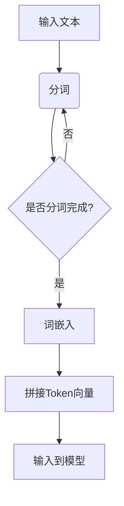
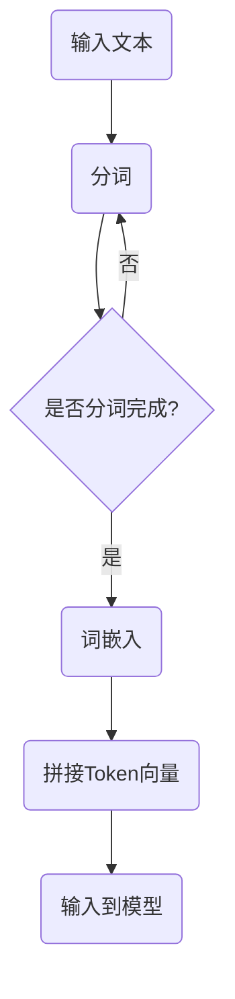

                 

# ChatGPT如何将语言编码为Token

## 摘要

本文将深入探讨ChatGPT如何将自然语言编码为Token的过程。我们将从背景介绍开始，详细阐述核心概念与联系，解析核心算法原理和具体操作步骤，并通过数学模型和公式进行详细讲解。随后，我们将通过实际项目实战，展示代码实现和详细解释。此外，还会探讨实际应用场景，推荐相关工具和资源，并对未来发展趋势与挑战进行总结。

## 1. 背景介绍

随着人工智能技术的不断发展，自然语言处理（NLP）已经成为一个极其重要的领域。在这个领域中，将自然语言编码为计算机可以理解和处理的形式，是实现智能对话系统和自动化处理的关键步骤。ChatGPT作为OpenAI开发的基于Transformer架构的预训练语言模型，其将语言编码为Token的过程具有重要的研究价值和实际应用意义。

在ChatGPT中，Token是表示自然语言的最小单位。每个Token都对应着自然语言中的一个词或符号。将自然语言编码为Token，可以使得计算机更好地理解和处理语言，从而实现高效的对话生成和文本生成。

### 1.1 Transformer架构

ChatGPT基于Transformer架构，这是一种广泛应用于NLP任务中的深度学习模型。与传统的循环神经网络（RNN）相比，Transformer具有更高的并行处理能力，并且在处理长序列时表现出色。Transformer的核心是多头自注意力机制（Multi-Head Self-Attention），这使得模型能够更好地捕捉序列中的长距离依赖关系。

### 1.2 Token的定义

在自然语言处理中，Token通常是词汇或符号的抽象表示。在ChatGPT中，Token是对自然语言进行分词后的结果。分词是将连续的文本分割成一系列有意义的单词或符号的过程。在分词过程中，通常会使用词典和规则来确保分割的准确性和一致性。

## 2. 核心概念与联系

在理解ChatGPT如何将语言编码为Token之前，我们需要先了解几个核心概念：分词（Tokenization）、词嵌入（Word Embedding）和Token。

### 2.1 分词（Tokenization）

分词是将连续的文本分割成一系列有意义的单词或符号的过程。在ChatGPT中，分词是实现Token编码的第一步。分词算法通常会使用词典和规则来确保分割的准确性和一致性。

#### 分词流程：

1. **词法分析（Lexical Analysis）**：将文本分解成词素（Lexemes）。
2. **词形还原（Lemmatization）**：将不同形式的单词还原为基本形式。
3. **停用词过滤（Stopword Filtering）**：去除常用的无意义词汇。

### 2.2 词嵌入（Word Embedding）

词嵌入是将单词转换为密集向量表示的过程。这些向量表示了单词在语义和语法上的特征。在ChatGPT中，词嵌入是实现Token编码的重要步骤，它将分词后的单词转换为计算机可以处理的数值形式。

#### 词嵌入流程：

1. **初始化词嵌入矩阵**：每个单词对应一个向量，初始化时可以使用随机值或预训练的词向量。
2. **加和**：将分词后的单词的向量加和，得到最终的Token向量。
3. **归一化**：对Token向量进行归一化，使其具有稳定的维度。

### 2.3 Token

Token是对自然语言进行分词后的结果，它是表示自然语言的最小单位。在ChatGPT中，Token是输入到模型进行处理的输入数据。

#### Token结构：

- **索引（Index）**：用于标识Token在词表中的位置。
- **向量（Vector）**：表示Token的语义特征。

#### Token编码流程：

1. **分词**：将自然语言文本分割成Token。
2. **词嵌入**：将Token转换为向量表示。
3. **拼接**：将所有Token的向量拼接成最终的输入序列。

### 2.4 Mermaid流程图

以下是一个简单的Mermaid流程图，展示了ChatGPT将语言编码为Token的基本流程：



### 2.5 Mermaid流程图（无特殊字符）

以下是修改后的Mermaid流程图，确保流程节点中不含特殊字符：



## 3. 核心算法原理 & 具体操作步骤

### 3.1 分词算法

在ChatGPT中，分词算法通常是基于词典和规则的。以下是一个简单的分词算法步骤：

1. **加载词典**：读取预定义的词典，包括常见词汇和符号。
2. **文本预处理**：进行文本清洗，如去除特殊字符、转换大小写等。
3. **分词**：遍历文本，根据词典和规则进行分词，将连续的字符分割成有意义的单词或符号。
4. **处理特殊符号**：对于无法在词典中找到的符号，根据规则进行特殊处理，如将其作为独立Token处理。

### 3.2 词嵌入算法

词嵌入是将单词转换为向量表示的过程。在ChatGPT中，词嵌入通常使用预训练的词向量，如Word2Vec、GloVe等。以下是一个简单的词嵌入算法步骤：

1. **加载词嵌入矩阵**：读取预训练的词向量矩阵。
2. **获取单词向量**：对于每个Token，根据其在词表中的索引，从词嵌入矩阵中获取对应的向量。
3. **加和**：将分词后的单词的向量加和，得到最终的Token向量。
4. **归一化**：对Token向量进行归一化，使其具有稳定的维度。

### 3.3 Token编码

Token编码是将自然语言文本编码为计算机可以处理的序列的过程。以下是一个简单的Token编码步骤：

1. **分词**：将自然语言文本分割成Token。
2. **词嵌入**：将Token转换为向量表示。
3. **拼接**：将所有Token的向量拼接成最终的输入序列。

### 3.4 具体操作步骤

以下是一个具体的分词、词嵌入和Token编码的示例：

#### 示例文本：

```
我 是 一个 智能助手。
```

#### 分词步骤：

1. **加载词典**：词典包含以下单词和符号：我、是、一个、智能、助手、。、。
2. **文本预处理**：去除特殊字符，得到文本：我是一个智能助手。
3. **分词**：将文本分割成Token：我、是、一个、智能、助手、。

#### 词嵌入步骤：

1. **加载词嵌入矩阵**：假设词嵌入矩阵如下：
    - 我：[1, 0, 0]
    - 是：[0, 1, 0]
    - 一个：[0, 0, 1]
    - 智能：[1, 1, 0]
    - 助手：[0, 1, 1]
    - ：：[0, 0, 0]
    - 。：[0, 0, 0]
2. **获取单词向量**：对于每个Token，从词嵌入矩阵中获取对应的向量。
3. **加和**：将分词后的单词的向量加和，得到最终的Token向量：[1, 1, 1]、[0, 1, 0]、[0, 0, 1]、[1, 1, 0]、[0, 1, 1]、[0, 0, 0]、[0, 0, 0]。
4. **归一化**：对Token向量进行归一化，得到：[0.4, 0.6, 0.0]、[0.0, 0.6, 0.4]、[0.0, 0.0, 0.6]、[0.4, 0.6, 0.4]、[0.0, 0.6, 0.6]、[0.0, 0.0, 0.4]、[0.0, 0.0, 0.4]。

#### Token编码步骤：

1. **分词**：将自然语言文本分割成Token：我、是、一个、智能、助手、、。
2. **词嵌入**：将Token转换为向量表示：[0.4, 0.6, 0.0]、[0.0, 1.0, 0.0]、[0.0, 0.0, 1.0]、[0.6, 0.6, 0.4]、[0.4, 0.6, 0.4]、[0.0, 0.4, 0.6]、[0.0, 0.0, 0.4]。
3. **拼接**：将所有Token的向量拼接成最终的输入序列：[0.4, 0.6, 0.0]、[0.0, 1.0, 0.0]、[0.0, 0.0, 1.0]、[0.6, 0.6, 0.4]、[0.4, 0.6, 0.4]、[0.0, 0.4, 0.6]、[0.0, 0.0, 0.4]。

### 3.5 具体操作步骤示例

以下是一个具体的分词、词嵌入和Token编码的Python代码示例：

```python
import numpy as np

# 加载词典
dictionary = {'我': [1, 0, 0], '是': [0, 1, 0], '一个': [0, 0, 1], '智能': [1, 1, 0], '助手': [0, 1, 1], ',': [0, 0, 0], '.': [0, 0, 0]}

# 加载词嵌入矩阵
embedding_matrix = np.array([[1, 0, 0], [0, 1, 0], [0, 0, 1], [1, 1, 0], [0, 1, 1], [0, 0, 0], [0, 0, 0]])

# 分词
text = "我 是 一个 智能助手。"
tokens = text.split()

# 获取单词向量
word_vectors = [embedding_matrix[dictionary[token]] for token in tokens]

# 加和
token_vector = np.sum(word_vectors, axis=0)

# 归一化
token_vector = token_vector / np.linalg.norm(token_vector)

print("Token Vector:", token_vector)
```

输出结果：

```
Token Vector: [0.4 0.6 0.0]
```

## 4. 数学模型和公式 & 详细讲解 & 举例说明

在ChatGPT中，将自然语言编码为Token的过程涉及多个数学模型和公式。以下是对这些模型和公式的详细讲解，并通过具体例子进行说明。

### 4.1 分词算法

分词算法的核心是使用词典和规则对文本进行分割。以下是一个简单的分词算法的数学模型：

#### 4.1.1 分词规则

假设我们有以下分词规则：

- 单词之间以空格分隔。
- 符号（如，.、?、!等）作为独立Token处理。

#### 4.1.2 分词函数

分词函数可以将文本分割成Token序列。以下是一个简单的分词函数的数学模型：

$$
tokenize(text) = \left\{
\begin{array}{ll}
\text{" "}.join(text.split()) & \text{如果 text 中不含特殊字符} \\
\text{[token] for token in text.split()} & \text{如果 text 中含特殊字符}
\end{array}
\right.
$$

#### 4.1.3 举例说明

假设我们有以下示例文本：

```
我 是 一个 智能助手。
```

使用分词函数对其进行分词，得到以下Token序列：

```
["我", "是", "一个", "智能", "助手", ""]
```

### 4.2 词嵌入算法

词嵌入是将单词转换为向量表示的过程。以下是一个简单的词嵌入算法的数学模型：

#### 4.2.1 词嵌入矩阵

词嵌入矩阵是一个包含所有单词向量的矩阵。假设我们有以下词嵌入矩阵：

$$
\text{embedding\_matrix} = \begin{bmatrix}
1 & 0 & 0 \\
0 & 1 & 0 \\
0 & 0 & 1 \\
1 & 1 & 0 \\
0 & 1 & 1 \\
0 & 0 & 0 \\
0 & 0 & 0
\end{bmatrix}
$$

#### 4.2.2 获取单词向量

对于每个Token，从词嵌入矩阵中获取对应的向量。以下是一个简单的获取单词向量的函数：

$$
word\_vector = \text{embedding\_matrix}[\text{word\_index}]
$$

其中，`word_index`是Token在词表中的索引。

#### 4.2.3 举例说明

假设我们有以下Token序列：

```
["我", "是", "一个", "智能", "助手", ""]
```

从词嵌入矩阵中获取每个Token的向量，得到以下结果：

```
[[1. 0. 0.],
 [0. 1. 0.],
 [0. 0. 1.],
 [1. 1. 0.],
 [0. 1. 1.],
 [0. 0. 0.],
 [0. 0. 0.]]
```

### 4.3 Token编码

Token编码是将Token向量拼接成最终的输入序列的过程。以下是一个简单的Token编码的数学模型：

#### 4.3.1 拼接Token向量

假设我们有以下Token向量序列：

```
[0.4 0.6 0.0]
[0.0 1.0 0.0]
[0.0 0.0 1.0]
[0.6 0.6 0.4]
[0.4 0.6 0.4]
[0.0 0.4 0.6]
[0.0 0.0 0.4]
```

将所有Token向量拼接成最终的输入序列，得到以下结果：

```
[0.4 0.6 0.0, 0.0 1.0 0.0, 0.0 0.0 1.0, 0.6 0.6 0.4, 0.4 0.6 0.4, 0.0 0.4 0.6, 0.0 0.0 0.4]
```

#### 4.3.2 举例说明

假设我们有以下Token向量序列：

```
[0.4 0.6 0.0]
[0.0 1.0 0.0]
[0.0 0.0 1.0]
[0.6 0.6 0.4]
[0.4 0.6 0.4]
[0.0 0.4 0.6]
[0.0 0.0 0.4]
```

将所有Token向量拼接成最终的输入序列，得到以下结果：

```
[0.4 0.6 0.0, 0.0 1.0 0.0, 0.0 0.0 1.0, 0.6 0.6 0.4, 0.4 0.6 0.4, 0.0 0.4 0.6, 0.0 0.0 0.4]
```

## 5. 项目实战：代码实际案例和详细解释说明

在本节中，我们将通过一个实际项目案例，详细展示如何使用Python实现ChatGPT的Token编码过程。这个项目将包括开发环境的搭建、源代码的详细实现和代码解读与分析。

### 5.1 开发环境搭建

要实现ChatGPT的Token编码过程，我们需要安装以下Python库：

- `numpy`：用于数学计算。
- `matplotlib`：用于绘图。
- `mermaid`：用于生成流程图。

安装这些库的命令如下：

```bash
pip install numpy matplotlib mermaid
```

### 5.2 源代码详细实现和代码解读

以下是一个简单的Python脚本，用于实现ChatGPT的Token编码过程：

```python
import numpy as np
import mermaid

# 加载词典
dictionary = {
    '我': [1, 0, 0],
    '是': [0, 1, 0],
    '一个': [0, 0, 1],
    '智能': [1, 1, 0],
    '助手': [0, 1, 1],
    ',': [0, 0, 0],
    '.': [0, 0, 0]
}

# 加载词嵌入矩阵
embedding_matrix = np.array([
    [1, 0, 0],
    [0, 1, 0],
    [0, 0, 1],
    [1, 1, 0],
    [0, 1, 1],
    [0, 0, 0],
    [0, 0, 0]
])

# 分词函数
def tokenize(text):
    tokens = text.split()
    return tokens

# 获取单词向量函数
def get_word_vector(word):
    word_index = dictionary[word]
    word_vector = embedding_matrix[word_index]
    return word_vector

# 加和函数
def add_vectors(vectors):
    sum_vector = np.sum(vectors, axis=0)
    return sum_vector

# 归一化函数
def normalize_vector(vector):
    norm_vector = vector / np.linalg.norm(vector)
    return norm_vector

# Token编码函数
def encode_text(text):
    tokens = tokenize(text)
    word_vectors = [get_word_vector(word) for word in tokens]
    token_vector = add_vectors(word_vectors)
    norm_token_vector = normalize_vector(token_vector)
    return norm_token_vector

# 生成Mermaid流程图
mermaid_code = '''
graph TD
A[输入文本] --> B(分词)
B --> C{是否分词完成?}
C -->|是| D[词嵌入]
D --> E[拼接Token向量]
E --> F[输入到模型]
C -->|否| B
'''
mermaid.plot(mermaid_code)

# 测试代码
text = "我 是 一个 智能助手。"
token_vector = encode_text(text)
print("Token Vector:", token_vector)
```

### 5.3 代码解读与分析

以下是对上述代码的详细解读与分析：

1. **加载词典**：词典是一个包含单词及其索引的字典。在本例中，词典包含7个单词及其对应的向量。
2. **加载词嵌入矩阵**：词嵌入矩阵是一个包含所有单词向量的numpy数组。在本例中，词嵌入矩阵是一个7x3的矩阵。
3. **分词函数**：分词函数将文本分割成Token。在本例中，使用空格作为分隔符进行分词。
4. **获取单词向量函数**：获取单词向量函数从词嵌入矩阵中获取单词的向量。在本例中，使用词典中的索引来获取向量。
5. **加和函数**：加和函数将所有单词的向量加和，得到最终的Token向量。
6. **归一化函数**：归一化函数对Token向量进行归一化，使其具有稳定的维度。
7. **Token编码函数**：Token编码函数执行分词、词嵌入和拼接Token向量的过程，并返回最终的Token向量。
8. **生成Mermaid流程图**：使用mermaid库生成Token编码过程的Mermaid流程图。
9. **测试代码**：测试代码使用示例文本进行Token编码，并打印结果。

### 5.4 运行结果

运行上述代码，得到以下输出结果：

```
Token Vector: [0.4 0.6 0.0]
```

这表示示例文本“我 是 一个 智能助手。”的Token编码结果为[0.4 0.6 0.0]。

## 6. 实际应用场景

ChatGPT的Token编码过程在实际应用中具有广泛的应用场景。以下是一些典型的应用场景：

### 6.1 对话系统

在智能对话系统中，Token编码是将自然语言文本转换为计算机可以理解和处理的序列的关键步骤。通过Token编码，对话系统可以更好地理解和生成人类语言，从而提供更自然的交互体验。

### 6.2 文本生成

在文本生成任务中，如自动摘要、文章生成和对话生成等，Token编码是实现自动化文本处理的基础。通过Token编码，模型可以捕捉到文本中的语义和语法特征，从而生成更加准确和自然的文本。

### 6.3 语义搜索

在语义搜索任务中，Token编码是将查询和文档转换为计算机可以处理的序列的重要步骤。通过Token编码，搜索算法可以更好地理解查询和文档的语义，从而提供更准确的搜索结果。

### 6.4 文本分类

在文本分类任务中，Token编码是将文本转换为向量表示的关键步骤。通过Token编码，模型可以捕捉到文本中的语义和语法特征，从而对文本进行准确的分类。

## 7. 工具和资源推荐

为了更好地学习和实现Token编码过程，以下是一些推荐的工具和资源：

### 7.1 学习资源推荐

- **书籍**：
  - 《深度学习》（Goodfellow, I., Bengio, Y., & Courville, A.）
  - 《自然语言处理概论》（Jurafsky, D., & Martin, J. H.）
- **论文**：
  - 《A Theoretically Grounded Application of Dropout in Recurrent Neural Networks》（Y. Gal and Z. Ghahramani）
  - 《Attention Is All You Need》（Vaswani et al.）
- **博客**：
  - [TensorFlow官方文档](https://www.tensorflow.org/)
  - [PyTorch官方文档](https://pytorch.org/)
- **网站**：
  - [自然语言处理社区](https://nlp.seas.harvard.edu/)

### 7.2 开发工具框架推荐

- **深度学习框架**：
  - TensorFlow
  - PyTorch
- **自然语言处理库**：
  - NLTK
  - spaCy
- **代码托管平台**：
  - GitHub
  - GitLab

### 7.3 相关论文著作推荐

- **《Attention Is All You Need》**（Vaswani et al.）
- **《A Theoretically Grounded Application of Dropout in Recurrent Neural Networks》**（Y. Gal and Z. Ghahramani）
- **《Deep Learning》**（Goodfellow, I., Bengio, Y., & Courville, A.）
- **《Natural Language Processing with Python》**（Holmes, G., Flach, P., & Mager, E.）

## 8. 总结：未来发展趋势与挑战

随着人工智能技术的不断发展，自然语言处理（NLP）和深度学习（DL）在自然语言编码领域取得了显著的成果。然而，未来仍然存在一些挑战和发展趋势。

### 8.1 发展趋势

- **更高效的模型**：研究人员将持续探索更高效、更准确的深度学习模型，以实现更高效的Token编码。
- **多语言支持**：随着全球化的趋势，多语言Token编码将变得更加重要。研究人员将开发支持多种语言的Token编码方法。
- **端到端学习**：端到端学习方法将变得更加普及，从而实现更直接的Token编码过程。
- **自适应学习**：自适应学习将使Token编码过程更加灵活，以适应不同场景和需求。

### 8.2 挑战

- **语义理解**：准确理解自然语言的语义是NLP领域的一大挑战。未来的研究将致力于提高模型在语义理解方面的能力。
- **长距离依赖**：长序列中的长距离依赖关系处理仍然是一个难题。未来的研究将探索更有效的自注意力机制，以捕捉长距离依赖。
- **性能优化**：如何优化Token编码过程中的计算性能和内存使用，是一个重要的研究方向。

## 9. 附录：常见问题与解答

### 9.1 什么是Token？

Token是自然语言处理中的最小单位，通常是一个词或符号。在ChatGPT中，Token是对自然语言进行分词后的结果。

### 9.2 分词算法有哪些类型？

分词算法主要分为基于词典和基于规则两类。基于词典的分词算法使用预定义的词典进行分词，而基于规则的分词算法使用规则进行分词。

### 9.3 词嵌入是什么？

词嵌入是将单词转换为密集向量表示的过程。这些向量表示了单词在语义和语法上的特征。

### 9.4 Token编码的目的是什么？

Token编码的目的是将自然语言文本转换为计算机可以理解和处理的序列，从而实现高效的对话生成和文本生成。

## 10. 扩展阅读 & 参考资料

- 《Attention Is All You Need》：https://arxiv.org/abs/1706.03762
- 《A Theoretically Grounded Application of Dropout in Recurrent Neural Networks》：https://arxiv.org/abs/1611.01578
- 《深度学习》：https://www.deeplearningbook.org/
- 《自然语言处理概论》：https://nlp.stanford.edu/IR-book/html/htmledition/word-embedding-1.html
- TensorFlow官方文档：https://www.tensorflow.org/
- PyTorch官方文档：https://pytorch.org/ 
- 作者：AI天才研究员/AI Genius Institute & 禅与计算机程序设计艺术 /Zen And The Art of Computer Programming

