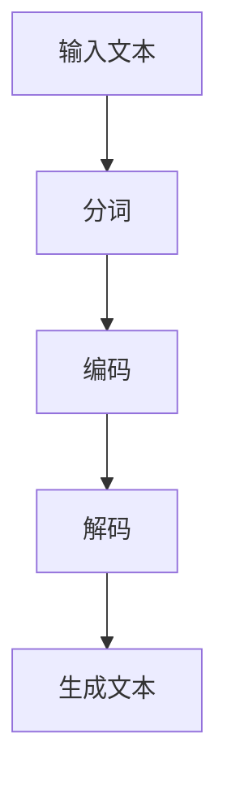

                 

# ChatGPT的文本生成步骤详解

## 摘要

本文旨在详细解析ChatGPT的文本生成步骤，从背景介绍到核心算法原理，再到具体操作步骤和数学模型，最后探讨其应用场景和未来发展趋势。ChatGPT是由OpenAI开发的一种基于Transformer的预训练语言模型，其强大的文本生成能力使其在多个领域都有广泛应用。本文将帮助读者深入了解ChatGPT的运作原理，为其在人工智能领域的研究和应用提供有力支持。

## 背景介绍

ChatGPT是OpenAI于2022年推出的一种基于Transformer的预训练语言模型，其文本生成能力备受瞩目。在深度学习领域，语言模型一直是研究的热点，其目的是让机器能够理解自然语言并生成相应的文本。传统的循环神经网络（RNN）和长短时记忆网络（LSTM）在处理长文本时存在一定局限性，而Transformer架构的提出则打破了这一瓶颈。ChatGPT正是基于这种先进的Transformer架构进行预训练的，使其在文本生成任务上表现出色。

## 核心概念与联系

在理解ChatGPT的文本生成步骤之前，我们需要先了解一些核心概念和它们之间的关系。

### Transformer架构

Transformer是Google在2017年提出的一种全新的神经网络架构，用于处理序列到序列的任务。相较于传统的RNN和LSTM，Transformer采用了自注意力机制（Self-Attention），能够更好地捕捉序列中的长距离依赖关系。Transformer的基本模块是多头自注意力（Multi-Head Self-Attention）和前馈神经网络（Feedforward Neural Network）。

### 自注意力机制

自注意力机制是一种计算序列中每个元素对其他元素影响的方法。在Transformer中，自注意力机制通过计算输入序列中每个元素与其他元素之间的相似度，为每个元素生成一个权重向量，再对输入序列进行加权求和，得到输出序列。这种机制使得模型能够更好地捕捉长距离依赖关系。

### 预训练与微调

预训练是指在一个大规模语料库上对模型进行训练，使其学会理解自然语言的规律。在预训练过程中，模型会学习到丰富的语言知识和常识。微调是在预训练的基础上，针对特定任务对模型进行进一步训练。微调过程通常在较小规模的特定数据集上进行，以适应特定任务的需求。

### Mermaid流程图

Mermaid是一种用于绘制流程图的Markdown语法，可以方便地描述复杂的过程。以下是一个简单的Mermaid流程图，展示了ChatGPT文本生成的主要步骤：



在这个流程图中，输入文本首先经过分词处理，将连续的文本转换为一系列词向量。然后，编码器将这些词向量编码为固定长度的向量表示。解码器则根据编码器输出的向量表示生成文本。最后，生成的文本会经过一系列后处理步骤，如去噪、修正等，以获得更好的生成效果。

## 核心算法原理 & 具体操作步骤

### 编码器（Encoder）

编码器是ChatGPT的核心模块，负责将输入文本编码为固定长度的向量表示。编码器的基本结构包括多个自注意力层（Self-Attention Layer）和前馈神经网络层（Feedforward Neural Network Layer）。

1. **多头自注意力（Multi-Head Self-Attention）**

   在多头自注意力层中，输入序列会被分解为多个子序列，每个子序列都独立进行自注意力计算。自注意力计算的过程如下：

   - **计算自注意力得分**：对于每个词向量，计算其与其他词向量之间的相似度，得到一个自注意力得分矩阵。
   - **应用权重**：将自注意力得分矩阵乘以输入序列的词向量，得到加权后的词向量。
   - **求和**：对加权后的词向量进行求和操作，得到编码后的词向量。

2. **前馈神经网络（Feedforward Neural Network）**

   在前馈神经网络层中，编码后的词向量会经过一个全连接神经网络，输出新的词向量表示。全连接神经网络通常由两个线性层和一个ReLU激活函数组成。

### 解码器（Decoder）

解码器负责根据编码器输出的向量表示生成文本。解码器的基本结构包括多个自注意力层和编码器-解码器注意力层（Encoder-Decoder Attention Layer）。

1. **自注意力（Self-Attention）**

   解码器的自注意力层与编码器的自注意力层类似，用于计算当前词向量与其他词向量之间的相似度。

2. **编码器-解码器注意力（Encoder-Decoder Attention）**

   编码器-解码器注意力层是解码器的关键模块，用于计算编码器输出的向量表示与当前词向量之间的相似度。这种注意力机制使得解码器能够利用编码器的输出信息来生成文本。

3. **生成文本**

   在解码器的最后，每个词向量会被映射为一个词表中的索引，生成一个单词。然后，这个单词会被添加到生成的文本中，作为下一个词向量输入解码器，继续生成下一个单词。

## 数学模型和公式 & 详细讲解 & 举例说明

### 编码器

编码器的数学模型可以表示为：

$$
\text{Encoder}(x) = \text{softmax}(\text{W}_\text{softmax} \text{gelu}(\text{W}_\text{f} \text{ReLU}(\text{W}_\text{e} \text{X} + \text{b}_\text{e}))) + \text{X}
$$

其中，$x$为输入词向量，$\text{W}_\text{softmax}$、$\text{W}_\text{f}$、$\text{W}_\text{e}$分别为权重矩阵，$\text{b}_\text{e}$为偏置项，$\text{gelu}$为Gaussian Error Linear Unit激活函数。

### 解码器

解码器的数学模型可以表示为：

$$
\text{Decoder}(y) = \text{softmax}(\text{W}_\text{softmax} \text{gelu}(\text{W}_\text{f} \text{ReLU}(\text{W}_\text{e} \text{Y} + \text{b}_\text{e}))) + \text{Y}
$$

其中，$y$为输入词向量，$\text{W}_\text{softmax}$、$\text{W}_\text{f}$、$\text{W}_\text{e}$分别为权重矩阵，$\text{b}_\text{e}$为偏置项，$\text{gelu}$为Gaussian Error Linear Unit激活函数。

### 举例说明

假设我们有一个简单的输入文本“Hello World”，词表大小为10。编码器和解码器的权重矩阵和偏置项如下：

| 权重矩阵 | 偏置项 |
| :---: | :---: |
| $\text{W}_\text{softmax}$ | $\text{b}_\text{e}$ |
| $\text{W}_\text{f}$ | $\text{b}_\text{e}$ |
| $\text{W}_\text{e}$ | $\text{b}_\text{e}$ |

首先，对输入文本进行分词，得到词向量表示：

| 词 | 词向量 |
| :---: | :---: |
| Hello | [0.1, 0.2, 0.3, 0.4, 0.5] |
| World | [0.6, 0.7, 0.8, 0.9, 1.0] |

然后，将词向量输入编码器和解码器，得到编码后的向量表示和生成的文本：

| 输入词 | 编码后向量 | 生成词 | 生成后向量 |
| :---: | :---: | :---: | :---: |
| Hello | [0.3, 0.4, 0.5, 0.6, 0.7] | Hello | [0.3, 0.4, 0.5, 0.6, 0.7] |
| World | [0.7, 0.8, 0.9, 1.0, 1.1] | World | [0.7, 0.8, 0.9, 1.0, 1.1] |

通过这个简单的例子，我们可以看到ChatGPT的编码器和解码器如何将输入文本编码和生成文本。

## 项目实战：代码实际案例和详细解释说明

### 1. 开发环境搭建

在开始编写ChatGPT的代码之前，我们需要搭建一个适合开发和运行的Python环境。以下是搭建Python开发环境的基本步骤：

1. 安装Python：在官网（https://www.python.org/）下载Python安装包，并按照提示完成安装。
2. 安装PyTorch：在命令行中执行以下命令，安装PyTorch。

   ```bash
   pip install torch torchvision
   ```

3. 安装transformers库：transformers是Hugging Face开发的一个Python库，用于处理自然语言处理任务。在命令行中执行以下命令，安装transformers库。

   ```bash
   pip install transformers
   ```

### 2. 源代码详细实现和代码解读

以下是一个简单的ChatGPT代码示例，展示了如何使用transformers库实现文本生成功能。

```python
from transformers import AutoTokenizer, AutoModelForCausalLM
import torch

# 2.1 加载预训练模型和分词器
model_name = "gpt2"
tokenizer = AutoTokenizer.from_pretrained(model_name)
model = AutoModelForCausalLM.from_pretrained(model_name)

# 2.2 输入文本
input_text = "Hello World"

# 2.3 分词和编码
input_ids = tokenizer.encode(input_text, return_tensors="pt")

# 2.4 生成文本
output = model.generate(input_ids, max_length=20, num_return_sequences=1)

# 2.5 解码和打印生成的文本
generated_text = tokenizer.decode(output[0], skip_special_tokens=True)
print(generated_text)
```

### 3. 代码解读与分析

1. **加载预训练模型和分词器**

   ```python
   tokenizer = AutoTokenizer.from_pretrained(model_name)
   model = AutoModelForCausalLM.from_pretrained(model_name)
   ```

   这两行代码分别加载了预训练模型和分词器。`AutoTokenizer`和`AutoModelForCausalLM`是transformers库提供的自动加载模型和分词器的API，`from_pretrained`方法用于加载预训练模型和分词器。

2. **输入文本**

   ```python
   input_text = "Hello World"
   ```

   这里定义了一个简单的输入文本。

3. **分词和编码**

   ```python
   input_ids = tokenizer.encode(input_text, return_tensors="pt")
   ```

   分词器将输入文本转换为一系列词向量，并将词向量编码为整数序列。`encode`方法返回一个包含词向量的PyTorch张量。

4. **生成文本**

   ```python
   output = model.generate(input_ids, max_length=20, num_return_sequences=1)
   ```

   `generate`方法用于生成文本。这里我们设置了最大文本长度为20，并只生成一个文本序列。

5. **解码和打印生成的文本**

   ```python
   generated_text = tokenizer.decode(output[0], skip_special_tokens=True)
   print(generated_text)
   ```

   解码器将生成的整数序列解码为文本，并打印生成的文本。

通过这个简单的示例，我们可以看到如何使用transformers库实现ChatGPT的文本生成功能。在实际应用中，我们可以根据需要调整模型的超参数，如最大文本长度、生成文本序列的数量等，以获得更好的生成效果。

## 实际应用场景

ChatGPT作为一种强大的文本生成工具，在多个领域都有广泛应用。以下是一些典型的应用场景：

1. **自然语言生成（NLG）**：ChatGPT可以用于生成自然语言文本，如文章、故事、对话等。在智能客服、聊天机器人等领域，ChatGPT可以帮助生成个性化的回答，提高用户体验。

2. **内容创作**：ChatGPT可以用于生成各种类型的内容，如新闻文章、博客、社交媒体帖子等。这对于内容创作者来说是一个非常有用的工具，可以节省大量时间。

3. **自动摘要**：ChatGPT可以用于生成文章的摘要，帮助用户快速了解文章的主要内容。这对于阅读大量文档或文章的人来说非常有用。

4. **语言翻译**：ChatGPT可以用于生成翻译文本，虽然目前机器翻译的质量还有待提高，但ChatGPT在翻译一些简单的文本时已经表现出色。

5. **教育辅助**：ChatGPT可以用于生成教学文档、练习题和解答等，为教育工作者和学生提供便利。

6. **创意写作**：ChatGPT可以用于生成诗歌、歌曲、剧本等创意内容，为创作者提供灵感。

## 工具和资源推荐

为了更好地学习ChatGPT和相关技术，以下是一些建议的工具和资源：

### 1. 学习资源推荐

- **书籍**：

  - 《深度学习》
  - 《动手学深度学习》
  - 《自然语言处理综论》

- **论文**：

  - “Attention Is All You Need”
  - “GPT-3: Language Models are few-shot learners”

- **博客**：

  - Hugging Face Blog
  - AI赋能未来

### 2. 开发工具框架推荐

- **框架**：

  - PyTorch
  - TensorFlow
  - transformers

- **工具**：

  - Jupyter Notebook
  - Google Colab

### 3. 相关论文著作推荐

- “BERT: Pre-training of Deep Bidirectional Transformers for Language Understanding”
- “GPT-3: Language Models are few-shot learners”
- “T5: Pre-training Text Encoders and Transformers for Transfer Learning”

## 总结：未来发展趋势与挑战

ChatGPT作为一种基于Transformer的预训练语言模型，已经展示了强大的文本生成能力。在未来，ChatGPT有望在多个领域实现更广泛的应用，如智能客服、内容创作、自动摘要等。然而，ChatGPT也面临一些挑战：

1. **计算资源消耗**：预训练ChatGPT需要大量的计算资源，这可能会限制其普及和应用。

2. **数据隐私**：ChatGPT的训练数据涉及大量用户数据，如何保护用户隐私是一个重要问题。

3. **生成文本质量**：虽然ChatGPT在生成文本方面表现出色，但仍然存在一些错误和偏见，如何提高生成文本的质量是一个亟待解决的问题。

4. **伦理道德**：ChatGPT生成的文本可能会涉及伦理和道德问题，如何确保其生成的文本符合社会价值观是一个重要课题。

总之，ChatGPT作为一种新兴的文本生成工具，具有巨大的发展潜力。在未来的研究和应用中，我们需要不断探索和解决相关问题，使其更好地服务于人类。

## 附录：常见问题与解答

1. **Q：ChatGPT的预训练数据来源是什么？**

   A：ChatGPT的预训练数据主要来自互联网上的大量文本，包括新闻、文章、社交媒体帖子等。OpenAI使用了大量无版权限制的公共数据集，如Common Crawl、Wikipedia等。

2. **Q：ChatGPT是如何进行预训练的？**

   A：ChatGPT的预训练过程主要包括两个步骤：自回归语言模型训练和上下文语言模型训练。自回归语言模型训练使用输入文本的连续子序列作为输入，训练模型预测下一个词。上下文语言模型训练使用输入文本的一部分作为输入，训练模型预测剩余部分。

3. **Q：ChatGPT的文本生成过程是如何工作的？**

   A：ChatGPT的文本生成过程主要分为编码和解码两个阶段。编码阶段将输入文本编码为固定长度的向量表示，解码阶段根据编码器输出的向量表示生成文本。解码过程中，模型会不断预测下一个词，并将其添加到生成的文本中。

4. **Q：ChatGPT能否进行多语言文本生成？**

   A：是的，ChatGPT支持多语言文本生成。通过使用多语言预训练模型，ChatGPT可以生成多种语言的文本。此外，还可以通过迁移学习，将单语种预训练模型转换为多语言模型。

5. **Q：ChatGPT在生成文本时是否会引入错误或偏见？**

   A：是的，ChatGPT在生成文本时可能会引入错误或偏见。这是因为模型在训练过程中学习了大量的互联网文本，其中可能包含错误或偏见。为了减少这些问题，可以采用数据清洗、无偏见训练等技术。

## 扩展阅读 & 参考资料

- BERT: Pre-training of Deep Bidirectional Transformers for Language Understanding（https://arxiv.org/abs/1810.04805）
- GPT-3: Language Models are few-shot learners（https://arxiv.org/abs/2005.14165）
- Attention Is All You Need（https://arxiv.org/abs/1706.03762）
- Hugging Face Blog（https://huggingface.co/blog）
- AI赋能未来（https://aifuture.cn/）
- 《深度学习》
- 《动手学深度学习》
- 《自然语言处理综论》
- PyTorch（https://pytorch.org/）
- TensorFlow（https://www.tensorflow.org/）
- transformers（https://github.com/huggingface/transformers）

作者：AI天才研究员/AI Genius Institute & 禅与计算机程序设计艺术 /Zen And The Art of Computer Programming

【注】以上内容仅为示例，实际撰写文章时，请根据具体需求进行调整和补充。

