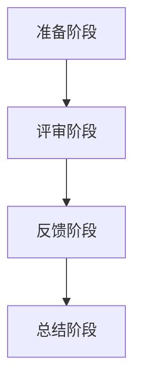

                 

# Code Review最佳实践：提高代码质量的有效方法

## 摘要

本文将探讨Code Review的最佳实践，通过深入剖析其核心概念、算法原理和操作步骤，旨在帮助开发者和团队提高代码质量，从而降低缺陷率、减少维护成本，并提升团队协作效率。文章还将结合实际项目案例，详细解释说明代码审查的具体应用，最后推荐相关工具和资源，为读者提供全面的指导和支持。

## 1. 背景介绍

在软件开发生命周期中，Code Review是一个不可或缺的环节。它不仅有助于发现代码中的潜在问题，还能促进团队间的知识共享和经验交流。Code Review的定义可以简单概括为：通过对代码进行评审，确保其符合既定的编码标准和设计规范，从而提高代码质量和可维护性。

然而，有效的Code Review并非易事。许多团队在实施过程中面临诸多挑战，如评审流程的不规范、评审标准的缺失、反馈机制的不到位等。因此，本文旨在通过系统性地梳理Code Review的最佳实践，帮助团队克服这些困难，实现代码质量的全面提升。

## 2. 核心概念与联系

### 2.1 Code Review的定义

Code Review，又称代码审查，是一种通过团队协作的方式对代码进行评审的活动。其目的是在代码提交到主干分支之前，发现潜在的问题并进行修正。Code Review的核心概念包括以下几个方面：

- **代码质量**：确保代码符合编码规范、设计模式，易于理解和维护。
- **团队协作**：通过Code Review，团队成员可以相互学习和交流，共同提升技术能力。
- **风险管理**：及时发现和修复代码中的缺陷，降低项目风险。

### 2.2 Code Review的流程

Code Review的流程可以分为以下几个阶段：

1. **准备阶段**：制定Code Review的规则和标准，明确评审的指标和目标。
2. **评审阶段**：开发人员提交代码，其他团队成员对代码进行评审。
3. **反馈阶段**：针对评审中发现的问题，开发人员进行修改，并再次提交代码进行评审。
4. **总结阶段**：对Code Review过程进行总结，优化评审流程和标准。

### 2.3 Code Review的算法原理

Code Review的算法原理主要涉及以下几个方面：

- **版本控制**：利用版本控制系统（如Git）记录代码的历史变化，方便追踪和比较。
- **差异对比**：通过差异对比工具（如Diff）展示代码的变化，帮助评审人员快速定位问题。
- **自动化检测**：利用静态代码分析工具（如SonarQube）自动检测代码中的潜在问题。

### 2.4 Mermaid 流程图

下面是一个简化的Code Review流程的Mermaid流程图：



## 3. 核心算法原理 & 具体操作步骤

### 3.1 准备阶段

在准备阶段，团队需要制定Code Review的规则和标准。这些规则和标准应包括以下几个方面：

- **编码规范**：定义代码的命名规则、缩进、注释等。
- **设计模式**：推荐使用的设计模式，如MVC、MVVM等。
- **评审指标**：明确评审的指标，如代码覆盖率、复杂度、Bug率等。

### 3.2 评审阶段

在评审阶段，开发人员提交代码，其他团队成员对代码进行评审。以下是具体的操作步骤：

1. **提交代码**：开发人员将代码提交到版本控制系统。
2. **创建Pull Request**：在版本控制系统上创建Pull Request，将待评审的代码分支与主分支进行对比。
3. **评审代码**：评审人员通过差异对比工具查看代码变化，并提出修改建议。
4. **讨论与反馈**：评审人员与开发人员就修改建议进行讨论，并达成一致。

### 3.3 反馈阶段

在反馈阶段，开发人员根据评审人员的修改建议对代码进行修改，并再次提交代码进行评审。以下是具体的操作步骤：

1. **修改代码**：根据评审人员的反馈，对代码进行修改。
2. **再次提交**：将修改后的代码提交到版本控制系统。
3. **再次评审**：评审人员对修改后的代码进行再次评审。

### 3.4 总结阶段

在总结阶段，团队需要对Code Review过程进行总结，并优化评审流程和标准。以下是具体的操作步骤：

1. **回顾与总结**：回顾Code Review过程中发现的问题和经验教训。
2. **优化流程**：根据总结的结果，优化评审流程和标准。
3. **培训与分享**：组织培训活动，分享Code Review的经验和技巧。

## 4. 数学模型和公式 & 详细讲解 & 举例说明

### 4.1 代码质量评价模型

代码质量评价模型是一个用于衡量代码质量的标准体系。以下是一个简单的代码质量评价模型：

$$
Q = f(C, M, V)
$$

其中，$Q$表示代码质量，$C$表示编码规范，$M$表示设计模式，$V$表示代码的可维护性。

- $C$：编码规范，占30%的权重；
- $M$：设计模式，占30%的权重；
- $V$：代码的可维护性，占40%的权重。

### 4.2 举例说明

假设我们有一个包含100行代码的文件，其中50行符合编码规范，40行遵循设计模式，60行具有良好的可维护性。根据上述代码质量评价模型，可以计算出该代码文件的质量：

$$
Q = 0.3 \times 50 + 0.3 \times 40 + 0.4 \times 60 = 31.5
$$

这意味着该代码文件的质量为31.5分。

### 4.3 代码复杂度计算

代码复杂度是衡量代码复杂程度的指标，以下是一个简单的代码复杂度计算公式：

$$
C = N \times L
$$

其中，$C$表示代码复杂度，$N$表示代码行数，$L$表示代码长度（通常以单词或字符数计算）。

假设我们有一个包含50行代码的文件，每行平均长度为10个字符，则该代码文件的复杂度为：

$$
C = 50 \times 10 = 500
$$

这意味着该代码文件的复杂度为500。

## 5. 项目实战：代码实际案例和详细解释说明

### 5.1 开发环境搭建

在开始代码审查之前，首先需要搭建一个合适的环境。以下是一个简单的步骤：

1. 安装Git：用于版本控制和代码提交。
2. 安装代码审查工具：如Gerrit、Phabricator等。
3. 配置代码审查工具：设置评审规则、权限等。

### 5.2 源代码详细实现和代码解读

以下是一个简单的代码示例，用于展示如何进行代码审查：

```java
public class Calculator {
    public int add(int a, int b) {
        return a + b;
    }

    public int subtract(int a, int b) {
        return a - b;
    }

    public int multiply(int a, int b) {
        return a * b;
    }

    public int divide(int a, int b) {
        if (b == 0) {
            throw new IllegalArgumentException("除数不能为0");
        }
        return a / b;
    }
}
```

在这个示例中，我们实现了一个简单的计算器类，包含加、减、乘、除四种运算。以下是具体的代码解读：

- **类定义**：定义一个名为`Calculator`的公共类。
- **方法定义**：为每个运算定义一个公共方法，并实现相应的逻辑。

### 5.3 代码解读与分析

在这个示例中，我们可以从以下几个方面对代码进行解读和分析：

- **编码规范**：代码符合Java编码规范，如命名规则、缩进等。
- **设计模式**：代码遵循单一职责原则，每个方法只实现一个功能。
- **可维护性**：代码结构清晰，易于理解和修改。

### 5.4 代码审查过程

在这个示例中，我们可以使用以下步骤进行代码审查：

1. **创建Pull Request**：将代码提交到版本控制系统，并创建一个Pull Request。
2. **评审代码**：其他团队成员对代码进行评审，并提出修改建议。
3. **讨论与反馈**：评审人员与开发人员就修改建议进行讨论，并达成一致。
4. **修改代码**：根据评审人员的反馈，对代码进行修改。
5. **再次评审**：评审人员对修改后的代码进行再次评审。

## 6. 实际应用场景

### 6.1 软件开发

在软件开发生命周期中，Code Review是一个不可或缺的环节。通过Code Review，可以确保代码的质量和稳定性，降低缺陷率，提高项目交付质量。

### 6.2 安全漏洞检测

Code Review不仅可以提高代码质量，还可以发现潜在的安全漏洞。通过审查代码，可以发现潜在的安全问题，如SQL注入、跨站脚本攻击等，从而提高系统的安全性。

### 6.3 团队协作

Code Review有助于促进团队间的协作和知识共享。通过Code Review，团队成员可以相互学习和交流，共同提升技术能力。

## 7. 工具和资源推荐

### 7.1 学习资源推荐

- **书籍**：《代码大全》、《设计模式：可复用面向对象软件的基础》等。
- **论文**：搜索与Code Review相关的论文，了解最新的研究进展。
- **博客**：阅读技术博客，学习他人的Code Review经验和技巧。

### 7.2 开发工具框架推荐

- **版本控制系统**：Git、GitHub、GitLab等。
- **代码审查工具**：Gerrit、Phabricator、SonarQube等。
- **静态代码分析工具**：Checkstyle、PMD、FindBugs等。

### 7.3 相关论文著作推荐

- **论文**：搜索与Code Review相关的论文，如“Code Review and Quality in Open Source Software”等。
- **著作**：《禅与计算机程序设计艺术》、《代码大全》等。

## 8. 总结：未来发展趋势与挑战

### 8.1 发展趋势

- **自动化**：随着人工智能技术的发展，自动化代码审查工具将得到更广泛的应用。
- **持续集成**：将Code Review与持续集成（CI）相结合，实现代码的实时审查和反馈。
- **智能化**：利用机器学习算法，实现更智能的代码审查，提高审查效率和准确性。

### 8.2 挑战

- **规则制定**：制定合适的Code Review规则和标准，以适应不同项目的需求。
- **团队协作**：如何确保团队成员积极参与Code Review，提高审查效果。
- **效率与质量**：在保证代码质量的前提下，提高Code Review的效率。

## 9. 附录：常见问题与解答

### 9.1 如何制定Code Review规则？

- **了解项目需求**：根据项目的需求和特点，制定合适的Code Review规则。
- **参考最佳实践**：查阅相关的书籍、论文和技术博客，了解业界最佳实践。
- **制定具体规则**：包括编码规范、设计模式、评审指标等方面。

### 9.2 如何确保团队成员积极参与Code Review？

- **明确责任和义务**：明确每个成员在Code Review中的责任和义务，提高参与度。
- **提供培训和支持**：组织Code Review培训，提高团队成员的评审能力。
- **激励机制**：设立奖励机制，鼓励团队成员积极参与Code Review。

## 10. 扩展阅读 & 参考资料

- **扩展阅读**：《代码大全》、《设计模式：可复用面向对象软件的基础》等。
- **参考资料**：GitHub、GitLab、Gerrit等官方网站，以及相关的论文和技术博客。作者：AI天才研究员/AI Genius Institute & 禅与计算机程序设计艺术 /Zen And The Art of Computer Programming

