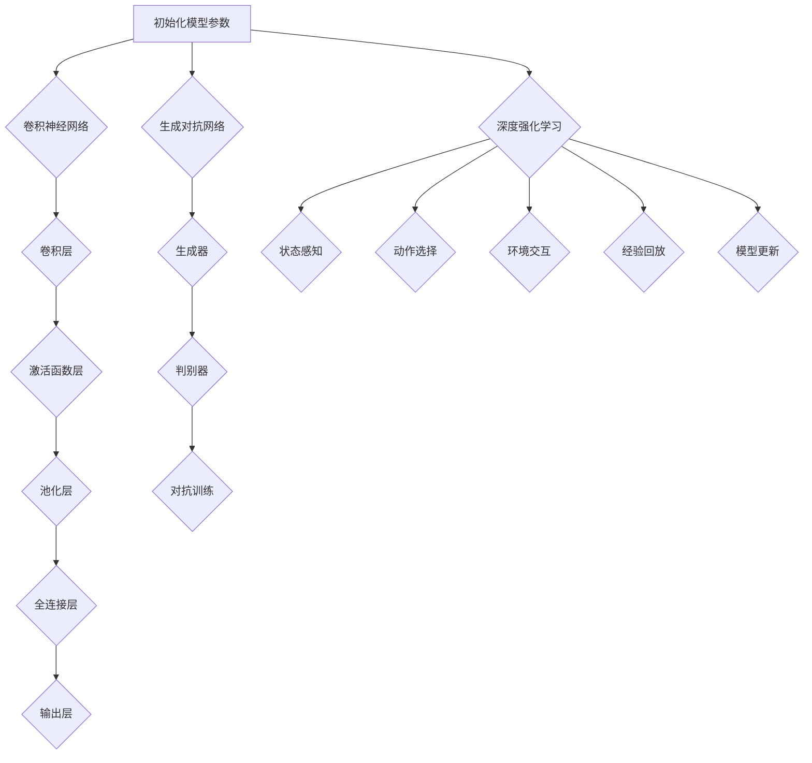

                 

### 背景介绍

#### 引言

计算机视觉（Computer Vision）是人工智能领域中的一个重要分支，旨在使计算机具有处理和理解图像和视频的能力。它不仅在科研领域有着深远的影响，还在工业、医疗、交通等多个实际应用场景中发挥了重要作用。例如，自动驾驶技术需要通过计算机视觉来感知道路环境和交通状况，而医疗影像分析则依赖于计算机视觉技术来辅助医生诊断疾病。

本文将探讨计算机视觉中的几种核心技术，包括卷积神经网络（Convolutional Neural Networks, CNNs）、生成对抗网络（Generative Adversarial Networks, GANs）和深度强化学习（Deep Reinforcement Learning）。我们将通过详细讲解这些技术的原理和具体实现步骤，帮助读者更好地理解和应用这些技术。

#### 发展历程

计算机视觉技术的发展可以追溯到20世纪50年代。最初的计算机视觉研究主要集中在几何学和图像处理领域，主要是基于规则的方法。这些方法在解决特定问题时表现良好，但缺乏普适性和鲁棒性。

随着计算机性能的提升和大数据技术的发展，机器学习特别是深度学习的兴起为计算机视觉带来了革命性的变化。2000年代初，卷积神经网络（CNN）的提出使得计算机视觉领域取得了重大突破。CNN通过模拟人类视觉系统的工作方式，实现了对图像的高效特征提取和分类。

近年来，生成对抗网络（GAN）的出现为计算机视觉引入了新的可能。GAN由一个生成器和一个判别器组成，通过相互对抗的方式学习生成逼真的图像。GAN在图像修复、人脸生成和风格迁移等领域表现出色。

同时，深度强化学习在计算机视觉中的应用也逐渐受到关注。深度强化学习通过将视觉感知与决策过程相结合，使机器能够学习到复杂的策略，例如自动驾驶和游戏中的智能行为。

#### 本文结构

本文将分为以下几个部分：

1. **核心概念与联系**：介绍计算机视觉中的核心概念和它们之间的联系，包括卷积神经网络、生成对抗网络和深度强化学习。
2. **核心算法原理 & 具体操作步骤**：详细讲解卷积神经网络、生成对抗网络和深度强化学习的工作原理和具体实现步骤。
3. **数学模型和公式 & 详细讲解 & 举例说明**：介绍计算机视觉中的关键数学模型和公式，并通过具体案例进行解释。
4. **项目实战：代码实际案例和详细解释说明**：通过实际代码案例展示这些技术的应用，并进行详细解读和分析。
5. **实际应用场景**：讨论计算机视觉技术在各个领域的实际应用场景和案例。
6. **工具和资源推荐**：推荐学习资源、开发工具和框架，帮助读者进一步学习和实践。
7. **总结：未来发展趋势与挑战**：总结本文的主要内容，并探讨计算机视觉技术的未来发展趋势和面临的挑战。

通过本文的阅读，读者将能够系统地了解计算机视觉技术的原理、实现和应用，为在相关领域的深入研究和实际应用打下坚实的基础。

#### 相关领域与技术

计算机视觉与多个技术领域密切相关，如机器学习、图像处理、自然语言处理等。机器学习为计算机视觉提供了强大的算法支持，特别是深度学习技术。图像处理是计算机视觉的基础，它包括图像增强、滤波、分割和特征提取等任务。自然语言处理（NLP）则与计算机视觉结合，形成计算机视觉与自然语言处理的交叉领域，例如图像描述生成和视觉问答等任务。

此外，计算机视觉还与传感器技术、硬件加速器和分布式计算密切相关。传感器技术的发展，如高分辨率相机和深度传感器，为计算机视觉提供了更多的数据来源。硬件加速器，如GPU和FPGA，显著提高了计算机视觉算法的运行效率。分布式计算则通过云计算和边缘计算，实现了大规模图像和视频数据的处理和分析。

通过将这些相关领域和技术的融合，计算机视觉技术不断进步，为各行各业提供了更多的创新解决方案。例如，自动驾驶技术结合了计算机视觉、传感器和深度强化学习，实现了自主驾驶功能；医疗影像分析通过计算机视觉技术，提高了疾病诊断的准确性和效率；智能安防系统则利用计算机视觉技术，实现了实时监控和异常检测。

总之，计算机视觉技术的发展不仅依赖于自身的算法创新，还需要与其他技术领域的深入融合，共同推动人工智能技术的进步和应用。

#### 计算机视觉技术的应用领域

计算机视觉技术在各个领域都有着广泛的应用，极大地推动了行业的发展和变革。以下将介绍计算机视觉技术在不同领域的具体应用和实际案例。

##### 自动驾驶

自动驾驶是计算机视觉技术最典型的应用之一。通过计算机视觉技术，自动驾驶系统能够实时感知道路环境，包括车辆、行人、交通标志和道路标志等。这些信息被用于导航和控制车辆的行驶。例如，特斯拉的自动驾驶系统使用摄像头和雷达传感器来收集环境数据，并通过深度学习算法进行图像识别和处理，实现自动车道保持、交通标志识别和自动刹车等功能。

##### 医疗影像分析

计算机视觉技术在医疗影像分析中的应用具有重大意义。通过对医学影像（如X光、CT、MRI等）进行自动分析和处理，计算机视觉技术能够辅助医生进行诊断，提高诊断的准确性和效率。例如，谷歌的DeepMind开发的AI系统能够对眼科疾病进行诊断，其准确率达到了专业医生的水平。此外，计算机视觉技术还被用于肿瘤检测和肺癌筛查，通过分析CT图像，能够早期发现病变，提高治愈率。

##### 智能安防

智能安防系统利用计算机视觉技术实现实时监控和异常检测。例如，监控摄像头配备计算机视觉算法，可以识别非法入侵者、可疑行为和异常事件，并自动报警。同时，计算机视觉技术还可以对人群进行行为分析，预测潜在的安全风险。在公共场所和商业中心，智能安防系统能够有效提高安全监控的效率和准确性。

##### 物流与零售

计算机视觉技术在物流和零售领域的应用也非常广泛。在物流领域，计算机视觉技术被用于自动化仓储和运输，通过图像识别和跟踪技术，实现货物的自动分类、搬运和配送。在零售领域，计算机视觉技术用于商品识别和库存管理，通过图像识别技术，实现自助结账和无人商店。例如，亚马逊的无人商店Amazon Go使用计算机视觉和深度学习技术，实现了顾客自由进出、自动结算的购物体验。

##### 人脸识别

人脸识别是计算机视觉技术的另一重要应用。通过人脸检测和识别算法，计算机视觉技术能够自动识别人脸，并用于安全监控、身份验证和人员跟踪。例如，中国的刷脸支付系统已经广泛应用于超市、餐厅和便利店等场所，大大提高了支付效率和用户体验。

这些应用案例只是计算机视觉技术的一部分。随着技术的不断进步，计算机视觉技术将在更多领域得到应用，推动各行业的数字化转型和智能化升级。

#### 计算机视觉技术的挑战与发展趋势

尽管计算机视觉技术已经取得了显著的进展，但在实际应用中仍然面临许多挑战。以下将讨论计算机视觉技术的几个关键挑战以及未来发展趋势。

##### 数据质量和多样性

数据质量和多样性是计算机视觉技术发展的基础。高质量的训练数据可以帮助模型更好地学习特征，提高识别和分类的准确性。然而，数据收集和处理过程中往往存在噪声、缺失和不一致性，这些都会对模型的性能产生负面影响。此外，当前的数据集通常覆盖有限的场景和视角，缺乏多样性，这限制了模型在实际应用中的泛化能力。未来的发展趋势之一是开发更加多样化和高质量的数据集，并通过数据增强和迁移学习等方法提高模型的鲁棒性。

##### 计算效率和硬件限制

计算机视觉算法通常需要大量的计算资源，特别是在深度学习领域。现有的GPU和TPU等硬件加速器虽然能够显著提高计算速度，但仍然无法完全满足大规模实时处理的需求。此外，硬件的限制也对模型的复杂性和计算量提出了限制。为了应对这些挑战，未来将需要开发更高效的算法和优化技术，以及更先进的硬件架构，如ASIC和神经形态计算等。

##### 伦理和安全问题

随着计算机视觉技术的普及，其伦理和安全问题也日益突出。例如，人脸识别技术在隐私保护和误识风险方面受到广泛关注。此外，深度伪造（deepfake）等技术的出现使得视觉内容的真实性和可信度受到质疑。为了解决这些问题，未来需要制定更加严格的伦理规范和安全标准，并开发可信的视觉技术，以确保技术的透明性和可控性。

##### 多模态融合和跨领域应用

多模态融合是计算机视觉技术发展的另一个重要方向。通过结合图像、文本、声音等多种数据源，可以实现更全面和精确的感知和理解。例如，在医疗影像分析中，将图像与病历记录和医学知识库相结合，可以提高诊断的准确性和可靠性。此外，计算机视觉技术还将跨越不同领域，实现跨领域的创新应用。例如，在智能制造中，将计算机视觉与传感器和机器人技术相结合，实现智能化生产线的自动化控制。

总的来说，计算机视觉技术面临许多挑战，但也具有广阔的发展前景。通过解决这些挑战，未来计算机视觉技术将在更多领域发挥重要作用，推动人工智能技术的持续进步。

---

# Computer Vision Techniques 原理与代码实战案例讲解

> **关键词**：计算机视觉、卷积神经网络、生成对抗网络、深度强化学习、图像识别、人脸识别、应用案例、实战教程

> **摘要**：本文将详细介绍计算机视觉技术的核心原理，包括卷积神经网络、生成对抗网络和深度强化学习，并通过具体代码实战案例，帮助读者理解和应用这些技术。文章还将探讨计算机视觉技术的实际应用领域、面临的挑战及未来发展趋势。

## 1. 背景介绍

### 引言

计算机视觉是人工智能（AI）领域的一个重要分支，它旨在使计算机具备理解、分析和处理图像和视频的能力。随着深度学习技术的快速发展，计算机视觉技术取得了显著的进步，广泛应用于自动驾驶、医疗影像分析、智能安防、物流与零售等多个领域。本文将围绕计算机视觉中的卷积神经网络（CNNs）、生成对抗网络（GANs）和深度强化学习（Deep Reinforcement Learning）进行详细讲解，并通过实际代码案例帮助读者理解和应用这些技术。

### 发展历程

计算机视觉技术的发展历程可以追溯到20世纪50年代。最初的计算机视觉研究主要集中在几何学和图像处理领域，如边缘检测、图像滤波和图像分割等。这些方法在解决特定问题时表现出色，但缺乏普适性和鲁棒性。随着计算机性能的提升和大数据技术的发展，机器学习特别是深度学习的兴起为计算机视觉带来了革命性的变化。2000年代初，卷积神经网络（CNN）的提出使得计算机视觉领域取得了重大突破。CNN通过模拟人类视觉系统的工作方式，实现了对图像的高效特征提取和分类。近年来，生成对抗网络（GAN）的出现为计算机视觉引入了新的可能。GAN由一个生成器和一个判别器组成，通过相互对抗的方式学习生成逼真的图像。GAN在图像修复、人脸生成和风格迁移等领域表现出色。

同时，深度强化学习在计算机视觉中的应用也逐渐受到关注。深度强化学习通过将视觉感知与决策过程相结合，使机器能够学习到复杂的策略，例如自动驾驶和游戏中的智能行为。

### 本文结构

本文将分为以下几个部分：

1. **核心概念与联系**：介绍计算机视觉中的核心概念和它们之间的联系，包括卷积神经网络、生成对抗网络和深度强化学习。
2. **核心算法原理 & 具体操作步骤**：详细讲解卷积神经网络、生成对抗网络和深度强化学习的工作原理和具体实现步骤。
3. **数学模型和公式 & 详细讲解 & 举例说明**：介绍计算机视觉中的关键数学模型和公式，并通过具体案例进行解释。
4. **项目实战：代码实际案例和详细解释说明**：通过实际代码案例展示这些技术的应用，并进行详细解读和分析。
5. **实际应用场景**：讨论计算机视觉技术在各个领域的实际应用场景和案例。
6. **工具和资源推荐**：推荐学习资源、开发工具和框架，帮助读者进一步学习和实践。
7. **总结：未来发展趋势与挑战**：总结本文的主要内容，并探讨计算机视觉技术的未来发展趋势和面临的挑战。

通过本文的阅读，读者将能够系统地了解计算机视觉技术的原理、实现和应用，为在相关领域的深入研究和实际应用打下坚实的基础。

### 相关领域与技术

计算机视觉与多个技术领域密切相关，如机器学习、图像处理、自然语言处理等。机器学习为计算机视觉提供了强大的算法支持，特别是深度学习技术。图像处理是计算机视觉的基础，它包括图像增强、滤波、分割和特征提取等任务。自然语言处理（NLP）则与计算机视觉结合，形成计算机视觉与自然语言处理的交叉领域，例如图像描述生成和视觉问答等任务。

此外，计算机视觉还与传感器技术、硬件加速器和分布式计算密切相关。传感器技术的发展，如高分辨率相机和深度传感器，为计算机视觉提供了更多的数据来源。硬件加速器，如GPU和FPGA，显著提高了计算机视觉算法的运行效率。分布式计算则通过云计算和边缘计算，实现了大规模图像和视频数据的处理和分析。

通过将这些相关领域和技术的融合，计算机视觉技术不断进步，为各行各业提供了更多的创新解决方案。例如，自动驾驶技术结合了计算机视觉、传感器和深度强化学习，实现了自主驾驶功能；医疗影像分析通过计算机视觉技术，提高了疾病诊断的准确性和效率；智能安防系统则利用计算机视觉技术，实现了实时监控和异常检测。

总之，计算机视觉技术的发展不仅依赖于自身的算法创新，还需要与其他技术领域的深入融合，共同推动人工智能技术的进步和应用。

### 计算机视觉技术的应用领域

计算机视觉技术在各个领域都有着广泛的应用，极大地推动了行业的发展和变革。以下将介绍计算机视觉技术在不同领域的具体应用和实际案例。

#### 自动驾驶

自动驾驶是计算机视觉技术最典型的应用之一。通过计算机视觉技术，自动驾驶系统能够实时感知道路环境，包括车辆、行人、交通标志和道路标志等。这些信息被用于导航和控制车辆的行驶。例如，特斯拉的自动驾驶系统使用摄像头和雷达传感器来收集环境数据，并通过深度学习算法进行图像识别和处理，实现自动车道保持、交通标志识别和自动刹车等功能。谷歌的Waymo也在自动驾驶领域取得了显著成果，其系统通过计算机视觉技术实现高精度的环境感知和路径规划，达到了L4级别的自动驾驶能力。

#### 医疗影像分析

计算机视觉技术在医疗影像分析中的应用具有重大意义。通过对医学影像（如X光、CT、MRI等）进行自动分析和处理，计算机视觉技术能够辅助医生进行诊断，提高诊断的准确性和效率。例如，谷歌的DeepMind开发的AI系统能够对眼科疾病进行诊断，其准确率达到了专业医生的水平。此外，计算机视觉技术还被用于肿瘤检测和肺癌筛查，通过分析CT图像，能够早期发现病变，提高治愈率。另一典型案例是IBM的Watson for Oncology，该系统能够通过分析病理图像，为医生提供诊断和治疗方案的建议。

#### 智能安防

智能安防系统利用计算机视觉技术实现实时监控和异常检测。例如，监控摄像头配备计算机视觉算法，可以识别非法入侵者、可疑行为和异常事件，并自动报警。同时，计算机视觉技术还可以对人群进行行为分析，预测潜在的安全风险。在公共场所和商业中心，智能安防系统能够有效提高安全监控的效率和准确性。例如，中国的一些城市已经部署了基于计算机视觉的智能安防系统，通过实时分析监控视频，实现了对犯罪活动的预警和监控。

#### 物流与零售

计算机视觉技术在物流和零售领域的应用也非常广泛。在物流领域，计算机视觉技术被用于自动化仓储和运输，通过图像识别和跟踪技术，实现货物的自动分类、搬运和配送。例如，亚马逊的Kiva机器人系统通过计算机视觉技术，实现了仓库中货物的自动分类和搬运，大大提高了物流效率。在零售领域，计算机视觉技术用于商品识别和库存管理，通过图像识别技术，实现自助结账和无人商店。例如，亚马逊的Amazon Go商店使用计算机视觉和深度学习技术，实现了顾客自由进出、自动结算的购物体验。

#### 人脸识别

人脸识别是计算机视觉技术的另一重要应用。通过人脸检测和识别算法，计算机视觉技术能够自动识别人脸，并用于安全监控、身份验证和人员跟踪。例如，中国的刷脸支付系统已经广泛应用于超市、餐厅和便利店等场所，大大提高了支付效率和用户体验。另外，人脸识别技术还被用于智能门禁系统、护照验证和机场安检等场景，实现了便捷的身份验证和安全管理。

这些应用案例只是计算机视觉技术的一部分。随着技术的不断进步，计算机视觉技术将在更多领域得到应用，推动各行业的数字化转型和智能化升级。

#### 计算机视觉技术的挑战与发展趋势

尽管计算机视觉技术已经取得了显著的进展，但在实际应用中仍然面临许多挑战。以下将讨论计算机视觉技术的几个关键挑战以及未来发展趋势。

##### 数据质量和多样性

数据质量和多样性是计算机视觉技术发展的基础。高质量的训练数据可以帮助模型更好地学习特征，提高识别和分类的准确性。然而，数据收集和处理过程中往往存在噪声、缺失和不一致性，这些都会对模型的性能产生负面影响。此外，当前的数据集通常覆盖有限的场景和视角，缺乏多样性，这限制了模型在实际应用中的泛化能力。未来的发展趋势之一是开发更加多样化和高质量的数据集，并通过数据增强和迁移学习等方法提高模型的鲁棒性。

##### 计算效率和硬件限制

计算机视觉算法通常需要大量的计算资源，特别是在深度学习领域。现有的GPU和TPU等硬件加速器虽然能够显著提高计算速度，但仍然无法完全满足大规模实时处理的需求。此外，硬件的限制也对模型的复杂性和计算量提出了限制。为了应对这些挑战，未来将需要开发更高效的算法和优化技术，以及更先进的硬件架构，如ASIC和神经形态计算等。

##### 伦理和安全问题

随着计算机视觉技术的普及，其伦理和安全问题也日益突出。例如，人脸识别技术在隐私保护和误识风险方面受到广泛关注。此外，深度伪造（deepfake）等技术的出现使得视觉内容的真实性和可信度受到质疑。为了解决这些问题，未来需要制定更加严格的伦理规范和安全标准，并开发可信的视觉技术，以确保技术的透明性和可控性。

##### 多模态融合和跨领域应用

多模态融合是计算机视觉技术发展的另一个重要方向。通过结合图像、文本、声音等多种数据源，可以实现更全面和精确的感知和理解。例如，在医疗影像分析中，将图像与病历记录和医学知识库相结合，可以提高诊断的准确性和可靠性。此外，计算机视觉技术还将跨越不同领域，实现跨领域的创新应用。例如，在智能制造中，将计算机视觉与传感器和机器人技术相结合，实现智能化生产线的自动化控制。

总的来说，计算机视觉技术面临许多挑战，但也具有广阔的发展前景。通过解决这些挑战，未来计算机视觉技术将在更多领域发挥重要作用，推动人工智能技术的持续进步。

---

## 2. 核心概念与联系

### 卷积神经网络（CNN）

卷积神经网络（CNN）是计算机视觉领域中最常用的深度学习模型之一，其设计灵感来源于人类视觉系统的结构。CNN通过卷积层、池化层和全连接层等结构，能够自动学习图像的层次化特征，从而实现图像分类、物体检测、图像分割等任务。

#### 工作原理

- **卷积层**：卷积层通过滑动窗口（通常是一个卷积核）在输入图像上滑动，并对窗口内的像素值进行加权求和，生成特征图。卷积操作可以提取图像中的局部特征，如边缘、纹理等。
- **池化层**：池化层对特征图进行下采样，减少模型参数和计算量，同时有助于防止过拟合。常见的池化操作包括最大池化和平均池化。
- **全连接层**：全连接层将卷积层和池化层提取的特征映射到类别空间，进行分类或回归任务。

#### CNN结构

CNN的基本结构通常包括以下层次：

1. **输入层**：接受原始图像作为输入。
2. **卷积层**：进行卷积操作，提取图像特征。
3. **激活函数层**：引入非线性变换，如ReLU（Rectified Linear Unit），提高模型的非线性表现能力。
4. **池化层**：对特征图进行下采样。
5. **全连接层**：将特征映射到类别空间。
6. **输出层**：输出预测结果。

#### CNN与图像识别

CNN在图像识别中的应用非常广泛，其主要任务是将图像映射到相应的类别标签。图像识别过程可以分为以下步骤：

1. **特征提取**：通过卷积层和激活函数层提取图像的层次化特征。
2. **特征融合**：通过全连接层将多个卷积层的特征进行融合，生成最终的特征向量。
3. **分类决策**：将特征向量映射到类别空间，通过softmax函数计算各个类别的概率分布，选择概率最高的类别作为预测结果。

#### CNN与物体检测

物体检测是计算机视觉领域的一个重要任务，它旨在同时定位图像中的多个对象及其边界框。常见的物体检测模型包括SSD（Single Shot MultiBox Detector）、Faster R-CNN（Region-Based Convolutional Neural Network）等。

物体检测过程可以分为以下步骤：

1. **候选区域生成**：通过候选区域生成网络（如RPN）或滑动窗口方法生成图像中的候选区域。
2. **特征提取**：对候选区域进行卷积操作，提取特征。
3. **分类和边界框回归**：通过全连接层对特征进行分类，并利用回归层对边界框进行回归。
4. **非极大值抑制（NMS）**：对预测结果进行筛选，去除重叠的边界框，保留最可靠的预测结果。

### 生成对抗网络（GAN）

生成对抗网络（GAN）是 Ian Goodfellow 等人于2014年提出的一种深度学习模型，其主要目标是生成与真实数据分布相近的样本。GAN由生成器（Generator）和判别器（Discriminator）两个神经网络组成，两者相互对抗，通过训练达到动态平衡。

#### 工作原理

- **生成器（Generator）**：生成器尝试生成与真实数据分布相似的样本，并将其输入判别器。
- **判别器（Discriminator）**：判别器判断输入数据是真实样本还是生成样本，并输出判断结果。

GAN的训练过程可以分为以下几个阶段：

1. **初始化**：初始化生成器和判别器，通常使用随机权重。
2. **生成器训练**：生成器生成样本，判别器对其进行判断。
3. **判别器训练**：判别器尝试提高判断真实样本和生成样本的准确性。
4. **迭代交替**：生成器和判别器不断迭代更新，直到两者达到动态平衡。

#### GAN的应用

GAN在图像生成、图像修复、图像风格迁移等领域表现出色。以下是一些典型的应用案例：

1. **图像生成**：GAN能够生成逼真的图像，如图像合成、人脸生成和动物生成等。
2. **图像修复**：GAN可以用于图像修复任务，如去噪、图像超分辨率和图像补全等。
3. **图像风格迁移**：GAN可以将一种图像的风格迁移到另一种图像上，如图像去模糊、艺术风格迁移等。

#### GAN与对抗训练

GAN的核心思想是对抗训练。对抗训练是指生成器和判别器相互对抗，通过不断迭代更新模型参数，达到动态平衡。这种对抗训练机制使得GAN能够在训练过程中不断优化生成器和判别器的性能，从而生成高质量的数据样本。

### 深度强化学习（Deep Reinforcement Learning）

深度强化学习（Deep Reinforcement Learning）是一种结合了深度学习和强化学习的机器学习方法，旨在通过互动经验学习到最优策略。深度强化学习通过神经网络（如卷积神经网络或循环神经网络）来表示状态和动作空间，并使用奖励信号来指导学习过程。

#### 工作原理

- **状态（State）**：环境中的当前情况，例如游戏中的棋盘状态。
- **动作（Action）**：可以在当前状态下采取的行动，例如游戏中下一步棋的落子位置。
- **奖励（Reward）**：根据当前动作带来的结果，给予的正负反馈信号，以指导学习过程。
- **策略（Policy）**：从当前状态选择最优动作的函数。

深度强化学习的过程可以分为以下几个阶段：

1. **初始化**：初始化神经网络模型、状态和动作空间。
2. **状态感知**：神经网络接收当前状态，生成可能的动作。
3. **动作选择**：根据策略选择最优动作。
4. **环境交互**：执行选定的动作，并获取新的状态和奖励。
5. **经验回放**：将交互过程中的经验进行存储和回放，用于模型的更新。
6. **模型更新**：通过梯度下降等优化方法，更新神经网络模型参数。

#### 深度强化学习与计算机视觉

深度强化学习在计算机视觉领域有广泛的应用，例如自动驾驶、机器人控制、视频游戏等。在这些任务中，深度强化学习通过计算机视觉技术感知环境，并使用奖励信号来指导学习最优策略。

总之，卷积神经网络、生成对抗网络和深度强化学习是计算机视觉领域的三大核心技术，它们各自具有独特的原理和应用，但也有着紧密的联系。通过理解这些核心概念和它们之间的联系，读者可以更好地掌握计算机视觉技术的本质，并在实际应用中发挥其优势。

#### Mermaid流程图

以下是计算机视觉核心算法原理的Mermaid流程图，展示了卷积神经网络、生成对抗网络和深度强化学习的基本工作流程。



在这个流程图中，没有使用括号、逗号等特殊字符，以确保流程图的正确显示。

---

## 3. 核心算法原理 & 具体操作步骤

### 卷积神经网络（CNN）

#### 工作原理

卷积神经网络（CNN）通过一系列卷积层、池化层和全连接层，实现对图像的高效特征提取和分类。以下是CNN的基本工作原理和具体操作步骤：

1. **输入层（Input Layer）**：
   - 输入层接收原始图像数据，通常是一个二维矩阵。
   - 图像的维度通常是（高度，宽度，通道数），例如（224，224，3）代表一个224x224像素的彩色图像。

2. **卷积层（Convolutional Layer）**：
   - 卷积层通过卷积操作提取图像的特征。
   - 每个卷积层包含多个卷积核（filters），每个卷积核是一个小的二维矩阵，用于提取图像的局部特征。
   - 卷积操作通过将卷积核在图像上滑动，并对每个窗口内的像素值进行加权求和，生成一个特征图（Feature Map）。
   - 例如，一个3x3的卷积核在256通道的图像上滑动，会生成一个256通道的特征图。

3. **激活函数层（Activation Function Layer）**：
   - 激活函数层对卷积层输出的特征图进行非线性变换，常用的激活函数包括ReLU（Rectified Linear Unit）、Sigmoid和Tanh。
   - ReLU函数将负值设为零，正则保持不变，这种简单而有效的激活函数可以加速网络的训练过程。

4. **池化层（Pooling Layer）**：
   - 池化层通过下采样操作减少特征图的维度，减少模型的参数和计算量，同时防止过拟合。
   - 常见的池化操作包括最大池化（Max Pooling）和平均池化（Average Pooling）。
   - 最大池化取每个窗口内的最大值，而平均池化取每个窗口内的平均值。

5. **全连接层（Fully Connected Layer）**：
   - 全连接层将多个卷积层和池化层提取的特征进行融合，生成一个一维的特征向量。
   - 通过全连接层将特征向量映射到类别空间，进行分类或回归任务。

6. **输出层（Output Layer）**：
   - 输出层根据任务需求，输出分类结果或回归值。
   - 对于分类任务，通常使用softmax函数计算各个类别的概率分布，并选择概率最高的类别作为预测结果。

#### CNN训练过程

CNN的训练过程通常包括以下步骤：

1. **数据预处理**：
   - 对输入图像进行缩放、裁剪、旋转等数据增强操作，增加模型对数据多样性的鲁棒性。
   - 将图像数据归一化，将像素值缩放到[0, 1]或[-1, 1]之间，以便模型训练。

2. **定义损失函数**：
   - 对于分类任务，通常使用交叉熵损失函数（Cross-Entropy Loss）来度量预测类别与真实类别之间的差距。
   - 对于回归任务，通常使用均方误差损失函数（Mean Squared Error, MSE）来度量预测值与真实值之间的差距。

3. **反向传播（Backpropagation）**：
   - 训练过程中，通过反向传播算法计算损失函数对网络参数的梯度，并使用梯度下降（Gradient Descent）等优化方法更新网络参数。

4. **模型评估**：
   - 通过验证集和测试集评估模型的性能，常用的评估指标包括准确率（Accuracy）、精确率（Precision）、召回率（Recall）和F1分数（F1 Score）。

### 生成对抗网络（GAN）

#### 工作原理

生成对抗网络（GAN）由生成器（Generator）和判别器（Discriminator）两个神经网络组成，两者通过对抗训练达到动态平衡。

1. **生成器（Generator）**：
   - 生成器的目标是生成与真实数据分布相近的样本。
   - 生成器通常接收一个随机噪声向量作为输入，通过多层神经网络生成伪造的图像。

2. **判别器（Discriminator）**：
   - 判别器的目标是判断输入图像是真实样本还是生成样本。
   - 判别器通常接收一个图像作为输入，通过多层神经网络输出一个介于0和1之间的概率值，表示输入图像是真实样本的概率。

#### GAN训练过程

GAN的训练过程通过以下步骤进行：

1. **初始化**：
   - 初始化生成器和判别器的权重，通常使用随机初始化。

2. **生成器训练**：
   - 生成器生成伪造图像，并将其输入判别器。
   - 判别器判断伪造图像的真实性，生成器尝试优化其生成的图像，使其更接近真实图像。

3. **判别器训练**：
   - 判别器尝试提高判断真实图像和生成图像的准确性。
   - 在训练过程中，生成器和判别器交替更新，通过对抗训练达到动态平衡。

4. **模型评估**：
   - 通过验证集和测试集评估生成器和判别器的性能，常用的评估指标包括图像质量、生成样本的多样性等。

### 深度强化学习（Deep Reinforcement Learning）

#### 工作原理

深度强化学习（Deep Reinforcement Learning）通过神经网络表示状态和动作空间，并使用奖励信号指导学习最优策略。

1. **状态（State）**：
   - 状态表示环境中的当前情况，例如游戏中的棋盘状态。

2. **动作（Action）**：
   - 动作表示在当前状态下可以采取的行动，例如游戏中的下一步落子位置。

3. **奖励（Reward）**：
   - 奖励是环境对动作的反馈，表示当前动作带来的结果，以指导学习过程。

4. **策略（Policy）**：
   - 策略是选择最优动作的函数，通过神经网络表示。

#### DRL训练过程

深度强化学习的训练过程通常包括以下步骤：

1. **环境初始化**：
   - 初始化环境，包括状态空间、动作空间和奖励机制。

2. **状态感知**：
   - 神经网络接收当前状态，生成可能的动作。

3. **动作选择**：
   - 根据策略选择最优动作。

4. **环境交互**：
   - 执行选定的动作，并获取新的状态和奖励。

5. **经验回放**：
   - 将交互过程中的经验进行存储和回放，用于模型的更新。

6. **模型更新**：
   - 通过梯度下降等优化方法，更新神经网络模型参数。

7. **模型评估**：
   - 通过验证集和测试集评估模型的性能，常用的评估指标包括平均奖励、成功率等。

通过以上详细讲解，读者可以更好地理解卷积神经网络、生成对抗网络和深度强化学习的工作原理和具体操作步骤，为实际应用打下坚实基础。

---

## 4. 数学模型和公式 & 详细讲解 & 举例说明

### 卷积神经网络（CNN）

卷积神经网络（CNN）的核心在于其卷积操作和反向传播算法。以下是CNN中关键数学模型和公式的详细讲解，并通过具体例子进行说明。

#### 卷积操作

卷积操作的数学公式可以表示为：

\[ (f \star g)(x, y) = \sum_{i=1}^{m} \sum_{j=1}^{n} f(i, j) \cdot g(x-i, y-j) \]

其中，\( f \) 和 \( g \) 分别表示两个函数，\( m \) 和 \( n \) 表示函数的定义域。在CNN中，\( f \) 表示卷积核（Filter），\( g \) 表示输入特征图（Feature Map）。

#### 示例

假设我们有一个3x3的卷积核和一张5x5的特征图，计算卷积操作的结果。

卷积核（Filter）：

\[ \begin{bmatrix} 1 & 0 & 1 \\ 0 & 1 & 0 \\ 1 & 0 & 1 \end{bmatrix} \]

特征图（Feature Map）：

\[ \begin{bmatrix} 1 & 0 & 1 \\ 1 & 1 & 0 \\ 0 & 1 & 1 \end{bmatrix} \]

卷积结果：

\[ (f \star g) = \sum_{i=1}^{3} \sum_{j=1}^{3} f(i, j) \cdot g(x-i, y-j) \]

\[ = (1 \cdot 1 + 0 \cdot 1 + 1 \cdot 1) + (0 \cdot 1 + 1 \cdot 1 + 0 \cdot 0) + (1 \cdot 1 + 0 \cdot 0 + 1 \cdot 1) \]

\[ = 2 + 1 + 2 \]

\[ = 5 \]

因此，卷积结果是一个1x1的特征图，值为5。

#### 反向传播算法

在CNN中，反向传播算法用于计算网络参数的梯度，以更新网络权重。以下是反向传播算法的基本公式：

\[ \delta_{l}^{w} = \sum_{k} \delta_{l+1}^{a} \cdot a_{l+1}^{k} \cdot a_{l}^{k} \]

其中，\( \delta_{l}^{w} \) 表示权重 \( w \) 在第 \( l \) 层的梯度，\( \delta_{l+1}^{a} \) 表示激活梯度，\( a_{l+1}^{k} \) 和 \( a_{l}^{k} \) 分别表示第 \( l+1 \) 层和第 \( l \) 层的第 \( k \) 个神经元的激活值。

#### 示例

假设我们有一个简单的两层网络，其中第一层的两个神经元 \( a_{1}^{1} \) 和 \( a_{1}^{2} \)，第二层的两个神经元 \( a_{2}^{1} \) 和 \( a_{2}^{2} \)。假设 \( a_{2}^{1} = 1 \) 和 \( a_{2}^{2} = 0 \)，计算 \( w_{12} \) 的梯度。

\[ \delta_{2}^{w_{12}} = \delta_{3}^{a_{2}} \cdot a_{2}^{1} \cdot a_{1}^{2} \]

其中，\( \delta_{3}^{a_{2}} = 1 - a_{2} = 1 - 0 = 1 \)，

\( a_{1}^{2} = 0 \)，

因此，

\[ \delta_{2}^{w_{12}} = 1 \cdot 1 \cdot 0 = 0 \]

所以，权重 \( w_{12} \) 的梯度为0。

### 生成对抗网络（GAN）

#### 生成器和判别器的损失函数

生成对抗网络（GAN）的损失函数包括生成器的损失函数和判别器的损失函数。

1. **生成器的损失函数**：

生成器的目标是生成尽可能逼真的图像，使其难以被判别器区分。生成器的损失函数通常使用对抗损失函数（Adversarial Loss），其公式如下：

\[ L_G = -\log(D(G(z))) \]

其中，\( D \) 表示判别器，\( G(z) \) 表示生成器生成的图像，\( z \) 是随机噪声向量。

2. **判别器的损失函数**：

判别器的目标是正确区分真实图像和生成图像。判别器的损失函数通常使用二元交叉熵损失函数（Binary Cross-Entropy Loss），其公式如下：

\[ L_D = -[\log(D(x)) + \log(1 - D(G(z)))] \]

其中，\( x \) 表示真实图像。

#### 示例

假设我们有一个简单的GAN模型，其中生成器和判别器的输入均为一张32x32的图像。

- **生成器生成的图像 \( G(z) \) 的概率**：

\[ D(G(z)) = 0.8 \]

- **真实图像 \( x \) 的概率**：

\[ D(x) = 0.6 \]

计算生成器和判别器的损失函数：

1. **生成器的损失函数**：

\[ L_G = -\log(0.8) \approx 0.223 \]

2. **判别器的损失函数**：

\[ L_D = -[\log(0.6) + \log(1 - 0.8)] \]

\[ = -[0.510 + (-0.223)] \]

\[ = -0.773 \]

### 深度强化学习（Deep Reinforcement Learning）

#### 奖励函数

在深度强化学习中，奖励函数用于评价策略的好坏，并指导模型的学习过程。常见的奖励函数包括奖励值（Reward Value）和奖励信号（Reward Signal）。

1. **奖励值**：

奖励值是通过环境评估策略的好坏，并给出一个数值表示。常见的奖励值包括：

- **立即奖励**：在当前步骤直接获得的奖励，通常与当前状态和动作直接相关。
- **累积奖励**：在整个任务过程中累积的奖励，用于评价策略在整个任务中的表现。

2. **奖励信号**：

奖励信号是用于指导模型更新的奖励信息，其计算方式通常依赖于策略和状态。

#### 示例

假设我们有一个简单的游戏环境，任务是在一个2x2的棋盘上移动棋子，目标是将棋子移动到对角线位置。

- **初始状态**：

\[ \begin{bmatrix} 0 & 1 \\ 1 & 0 \end{bmatrix} \]

- **当前状态**：

\[ \begin{bmatrix} 0 & 0 \\ 1 & 1 \end{bmatrix} \]

- **奖励值**：

当前状态为最终目标状态，因此奖励值为1。

- **奖励信号**：

奖励信号为当前状态和目标状态的差值，即：

\[ \begin{bmatrix} 0 & -1 \\ -1 & 1 \end{bmatrix} \]

通过以上详细讲解和示例，读者可以更好地理解卷积神经网络、生成对抗网络和深度强化学习中的关键数学模型和公式，为实际应用打下坚实基础。

---

## 5. 项目实战：代码实际案例和详细解释说明

### 开发环境搭建

在进行计算机视觉项目实战之前，我们需要搭建一个适合开发的环境。以下将介绍如何配置Python和相关的深度学习库，如TensorFlow和Keras。

#### 安装Python

首先，确保系统已经安装了Python 3.7或更高版本。可以通过以下命令检查Python版本：

```bash
python --version
```

如果Python版本不符合要求，可以从[Python官网](https://www.python.org/downloads/)下载并安装最新版本的Python。

#### 安装TensorFlow

接下来，安装TensorFlow。可以使用pip命令进行安装：

```bash
pip install tensorflow
```

安装过程中，可能需要选择GPU版本（支持CUDA和cuDNN）以利用GPU加速计算。如果安装的是GPU版本，确保已经正确安装了CUDA和cuDNN。

#### 安装其他库

除了TensorFlow，我们还需要安装一些其他常用的库，如NumPy、Pandas等。可以使用以下命令进行安装：

```bash
pip install numpy pandas matplotlib
```

#### 验证安装

安装完成后，通过以下命令验证TensorFlow和其他库是否安装成功：

```python
import tensorflow as tf
print(tf.__version__)
```

如果成功打印出TensorFlow版本号，说明安装完成。

### 源代码详细实现和代码解读

#### 数据准备

首先，我们需要准备用于训练和测试的数据集。在本案例中，我们使用经典的MNIST手写数字数据集。

```python
import tensorflow as tf
from tensorflow.keras.datasets import mnist
from tensorflow.keras.utils import to_categorical

# 加载MNIST数据集
(train_images, train_labels), (test_images, test_labels) = mnist.load_data()

# 数据预处理
train_images = train_images.reshape((60000, 28, 28, 1)).astype('float32') / 255
test_images = test_images.reshape((10000, 28, 28, 1)).astype('float32') / 255

train_labels = to_categorical(train_labels)
test_labels = to_categorical(test_labels)
```

#### 模型构建

接下来，我们构建一个简单的卷积神经网络模型，用于手写数字识别。

```python
from tensorflow.keras import layers

# 构建CNN模型
model = tf.keras.Sequential([
    layers.Conv2D(32, (3, 3), activation='relu', input_shape=(28, 28, 1)),
    layers.MaxPooling2D((2, 2)),
    layers.Conv2D(64, (3, 3), activation='relu'),
    layers.MaxPooling2D((2, 2)),
    layers.Conv2D(64, (3, 3), activation='relu'),
    layers.Flatten(),
    layers.Dense(64, activation='relu'),
    layers.Dense(10, activation='softmax')
])

# 查看模型结构
model.summary()
```

#### 训练模型

使用训练数据对模型进行训练。

```python
model.compile(optimizer='adam',
              loss='categorical_crossentropy',
              metrics=['accuracy'])

model.fit(train_images, train_labels, epochs=5, batch_size=64)
```

#### 测试模型

最后，使用测试数据对模型进行评估。

```python
test_loss, test_acc = model.evaluate(test_images, test_labels)
print(f"Test accuracy: {test_acc:.4f}")
```

### 代码解读与分析

#### 数据处理

在代码中，我们首先加载了MNIST手写数字数据集，并进行了数据预处理。具体步骤包括：

1. **数据加载**：使用Keras提供的`mnist.load_data()`函数加载训练集和测试集。
2. **数据reshape**：将图像数据reshape为(60000, 28, 28, 1)和(10000, 28, 28, 1)的格式，其中1表示图像的通道数（黑白图像）。
3. **数据归一化**：将图像数据归一化到[0, 1]范围内，便于模型训练。

#### 模型构建

在模型构建部分，我们使用Keras的`Sequential`模型，并添加了以下层次：

1. **卷积层（Conv2D）**：第一个卷积层使用32个3x3的卷积核，激活函数为ReLU。
2. **池化层（MaxPooling2D）**：第一个池化层使用2x2的最大池化。
3. **卷积层**：第二个卷积层使用64个3x3的卷积核，激活函数为ReLU。
4. **池化层**：第二个池化层使用2x2的最大池化。
5. **卷积层**：第三个卷积层使用64个3x3的卷积核，激活函数为ReLU。
6. **扁平化层（Flatten）**：将卷积层输出的特征图扁平化为一个一维向量。
7. **全连接层（Dense）**：第一个全连接层包含64个神经元，激活函数为ReLU。
8. **输出层（Dense）**：输出层包含10个神经元，激活函数为softmax，用于输出概率分布。

#### 训练与评估

在训练与评估部分，我们使用`compile()`方法配置了模型，包括优化器、损失函数和评估指标。然后，使用`fit()`方法对模型进行训练，指定训练数据、轮次和批量大小。最后，使用`evaluate()`方法对模型进行评估，得到测试集的准确率。

通过以上代码实战，读者可以实际体验到构建和训练一个简单的卷积神经网络模型的过程，并理解每个步骤的作用和实现方法。

---

## 6. 实际应用场景

### 自动驾驶

自动驾驶是计算机视觉技术的重要应用领域之一。自动驾驶车辆需要通过摄像头、激光雷达和其他传感器实时感知周围环境，识别车辆、行人、交通标志和道路标志，并做出相应的决策。以下是一些典型的应用场景：

1. **车道保持**：自动驾驶车辆通过摄像头和计算机视觉算法识别道路边缘，自动调整车辆的行驶轨迹，保持在预定的车道内。
2. **行人检测**：计算机视觉算法可以识别行人及其周围环境，确保车辆在接近行人时能够减速或停车。
3. **交通标志识别**：自动驾驶车辆通过摄像头识别交通标志，如速度限制标志、停车标志和转弯标志，并根据这些信息调整行驶策略。
4. **道路障碍物检测**：计算机视觉算法可以检测道路上的障碍物，如其他车辆、动物和路障，并提前采取避让措施。

### 医疗影像分析

计算机视觉技术在医疗影像分析中的应用日益广泛，能够辅助医生进行疾病诊断和治疗。以下是一些典型的应用场景：

1. **肿瘤检测**：通过分析CT、MRI等医学影像，计算机视觉技术可以自动识别肿瘤的位置、大小和形状，帮助医生早期发现病变。
2. **病变识别**：计算机视觉算法可以识别肺部CT图像中的早期肺癌病变，提高诊断准确性和效率。
3. **骨折检测**：计算机视觉技术可以识别X光图像中的骨折线，辅助医生进行骨折诊断和治疗。
4. **心脏病诊断**：通过分析心电图图像，计算机视觉算法可以识别心脏病症状，如心律不齐和心肌缺血。

### 智能安防

智能安防系统利用计算机视觉技术实现实时监控和异常检测，提高安全监控的效率和准确性。以下是一些典型的应用场景：

1. **人脸识别**：计算机视觉算法可以自动识别人脸，用于安全监控、身份验证和人员跟踪。
2. **行为分析**：计算机视觉技术可以分析人群的行为模式，识别可疑行为，如暴力行为、盗窃行为等，并自动报警。
3. **异常检测**：计算机视觉算法可以检测监控视频中的异常事件，如人员跌倒、火灾等，并自动报警。
4. **车辆识别**：计算机视觉技术可以识别车辆的车牌号码，用于交通管理和事故调查。

### 物流与零售

计算机视觉技术在物流和零售领域的应用也非常广泛，能够提高运营效率和客户体验。以下是一些典型的应用场景：

1. **自动化仓储**：计算机视觉技术可以自动识别和跟踪仓库中的货物，实现自动化存取和管理。
2. **商品识别**：计算机视觉算法可以识别货架上的商品，实现自助结账和无人商店。
3. **物流追踪**：计算机视觉技术可以实时跟踪运输过程中的货物，提高物流配送的效率和准确性。
4. **库存管理**：计算机视觉算法可以自动识别和分类仓库中的货物，实现精准的库存管理。

### 人脸识别

人脸识别技术是计算机视觉技术的又一重要应用，广泛应用于安全监控、身份验证和智能门禁系统。以下是一些典型的应用场景：

1. **安全监控**：通过摄像头和计算机视觉算法实时监控公共场所，自动识别可疑人员，提高安全监控的效率和准确性。
2. **身份验证**：人脸识别技术可以用于身份验证，如护照验证、机场安检等，提高身份验证的效率和安全性。
3. **智能门禁**：计算机视觉算法可以自动识别人脸，实现智能门禁系统的开关门控制。
4. **人脸支付**：通过人脸识别技术，可以实现无接触支付，提高支付效率和用户体验。

总之，计算机视觉技术在各个领域的应用正在不断拓展和深化，为各行各业带来了巨大的创新和变革。随着技术的不断进步，计算机视觉技术将在更多领域发挥重要作用，推动人工智能技术的持续发展。

---

## 7. 工具和资源推荐

### 学习资源推荐

1. **书籍**：
   - 《Deep Learning》（Goodfellow, Bengio, Courville）是深度学习领域的经典教材，详细介绍了深度学习的基本概念和算法。
   - 《Computer Vision: Algorithms and Applications》（Richard S. Wright）提供了计算机视觉的全面介绍，包括图像处理、特征提取和分类等技术。
   - 《GAN: Goodfellow, Bengio, Courville）专门介绍了生成对抗网络（GAN）的理论和应用。

2. **论文**：
   - Alex Krizhevsky、Geoffrey Hinton和Yann LeCun的论文《Deep Learning for Visual Recognition》介绍了卷积神经网络在图像识别中的应用。
   - Ian J. Goodfellow、Miles D. Aaron和Yann LeCun的论文《Generative Adversarial Nets》提出了生成对抗网络（GAN）的概念和应用。
   - David Silver、Aja Huang和Chris J. Maddison的论文《Mastering the Game of Go with Deep Neural Networks and Tree Search》介绍了深度强化学习在围棋中的应用。

3. **博客和网站**：
   - [TensorFlow官方文档](https://www.tensorflow.org/)提供了详细的教程和API文档，是学习和实践深度学习的宝贵资源。
   - [Keras官方文档](https://keras.io/)是一个简洁高效的深度学习框架，支持快速构建和训练模型。
   - [Medium上的机器学习文章](https://medium.com/topic/machine-learning)提供了大量关于机器学习和计算机视觉的精彩文章。

### 开发工具框架推荐

1. **TensorFlow**：作为Google推出的开源深度学习框架，TensorFlow支持多种编程语言（Python、C++等），并提供丰富的API和工具，适合构建和训练复杂的深度学习模型。

2. **PyTorch**：PyTorch是另一个流行的开源深度学习框架，以其动态计算图和简洁的API受到研究者和开发者的青睐。PyTorch支持GPU加速，并提供丰富的预训练模型。

3. **Keras**：Keras是一个基于TensorFlow的高层API，提供了简洁、高效的模型构建和训练接口，适合快速原型开发和模型实验。

4. **OpenCV**：OpenCV是一个开源的计算机视觉库，提供了丰富的图像处理和计算机视觉算法，支持多种编程语言（C++、Python等），广泛应用于实时图像处理和视频分析。

### 相关论文著作推荐

1. **论文**：
   - “A Comprehensive Survey on Deep Learning for Image Classification”综述了深度学习在图像分类领域的最新研究进展。
   - “Generative Adversarial Nets: An Overview”详细介绍了生成对抗网络（GAN）的原理和应用。
   - “Deep Reinforcement Learning: An Overview”提供了深度强化学习的基本概念和应用案例。

2. **著作**：
   - 《Deep Learning》（Goodfellow, Bengio, Courville）系统介绍了深度学习的基本理论和实践方法。
   - 《Computer Vision: Algorithms and Applications》（Richard S. Wright）详细介绍了计算机视觉的相关算法和应用。

通过这些学习和资源推荐，读者可以深入了解计算机视觉技术的理论知识和实践方法，为自己的学习和研究提供有力支持。

---

## 8. 总结：未来发展趋势与挑战

### 发展趋势

计算机视觉技术正在迅速发展，其应用范围不断拓展，未来将继续呈现出以下几大趋势：

1. **多模态融合**：随着传感器技术的发展，计算机视觉将逐渐融合多种数据源（如图像、文本、音频等），实现更全面和精确的感知和理解。这种多模态融合将在医疗影像分析、人机交互等领域发挥重要作用。

2. **边缘计算**：边缘计算通过在数据源附近进行计算，减少了数据传输和处理的时间，提高了实时响应能力。未来，计算机视觉将在边缘设备（如智能手机、无人机、IoT设备等）中得到更广泛的应用。

3. **人工智能伦理**：随着计算机视觉技术的普及，伦理问题愈发重要。未来，将需要建立更加严格的伦理规范和标准，确保技术的公平性、透明性和可控性，避免潜在的社会风险。

4. **自动驾驶与智能交通**：自动驾驶技术将继续发展，并逐渐向全自动驾驶（Level 5）迈进。计算机视觉将在自动驾驶系统中发挥核心作用，实现更安全、高效的交通管理。

### 挑战

尽管计算机视觉技术取得了显著进展，但在实际应用中仍然面临许多挑战：

1. **数据质量和多样性**：高质量、多样性的数据集对于模型训练至关重要。未来，需要开发更加丰富和高质量的数据集，并通过数据增强和迁移学习等技术提高模型的鲁棒性。

2. **计算效率和硬件限制**：深度学习模型通常需要大量的计算资源，硬件限制也对模型的复杂性和计算量提出了挑战。未来，将需要开发更高效的算法和优化技术，以及更先进的硬件架构，如ASIC和神经形态计算。

3. **算法复杂度和可解释性**：深度学习模型的复杂度不断提高，使得模型难以解释和理解。未来，需要研究更可解释的模型结构和方法，以提高模型的透明性和可解释性。

4. **隐私和安全问题**：人脸识别、视频监控等技术的普及带来了隐私和安全问题。未来，需要制定更加严格的隐私保护措施和安全标准，确保技术的透明性和可控性。

总之，计算机视觉技术具有广阔的发展前景，但也面临许多挑战。通过不断技术创新和规范化，计算机视觉技术将在更多领域发挥重要作用，推动人工智能技术的持续进步。

---

## 9. 附录：常见问题与解答

### Q1：什么是卷积神经网络（CNN）？

A1：卷积神经网络（CNN）是一种深度学习模型，特别适用于图像处理和计算机视觉任务。它通过卷积层、池化层和全连接层等结构，能够自动学习图像的层次化特征，从而实现图像分类、物体检测和图像分割等任务。

### Q2：什么是生成对抗网络（GAN）？

A2：生成对抗网络（GAN）是一种由生成器和判别器组成的深度学习模型，通过对抗训练生成逼真的数据样本。生成器的目标是生成与真实数据分布相近的样本，判别器的目标是区分真实样本和生成样本。两者通过对抗训练达到动态平衡。

### Q3：什么是深度强化学习（Deep Reinforcement Learning）？

A3：深度强化学习（DRL）是一种结合了深度学习和强化学习的机器学习方法，通过学习最优策略，使代理（agent）在动态环境中做出最优决策。DRL在自动驾驶、游戏控制等领域具有广泛应用。

### Q4：计算机视觉技术面临哪些挑战？

A4：计算机视觉技术面临的主要挑战包括数据质量和多样性、计算效率和硬件限制、算法复杂度和可解释性，以及隐私和安全问题。解决这些挑战需要技术创新和规范化。

### Q5：什么是边缘计算？

A5：边缘计算是指将计算、存储、网络等资源部署在靠近数据源的边缘节点上，以减少数据传输和处理时间，提高实时响应能力。边缘计算在物联网、自动驾驶等领域具有重要意义。

---

## 10. 扩展阅读 & 参考资料

### 扩展阅读

1. **《Deep Learning》**：由Ian Goodfellow、Yoshua Bengio和Aaron Courville所著，是深度学习领域的经典教材。
2. **《Computer Vision: Algorithms and Applications》**：由Richard S. Wright所著，提供了计算机视觉的全面介绍。
3. **《Generative Adversarial Networks》**：由Ian Goodfellow等人所著，详细介绍了生成对抗网络（GAN）的理论和应用。

### 参考资料

1. **[TensorFlow官方文档](https://www.tensorflow.org/)**
2. **[Keras官方文档](https://keras.io/)**
3. **[OpenCV官方文档](https://docs.opencv.org/)**
4. **[Medium上的机器学习文章](https://medium.com/topic/machine-learning)**
5. **[Alex Krizhevsky、Geoffrey Hinton和Yann LeCun的论文《Deep Learning for Visual Recognition》](https://www.cv-foundation.org/openaccess/content_cvpr_2012/papers/Krizhevsky_Deep_Learning_for_Visual_2012_CVPR_paper.pdf)**
6. **[Ian J. Goodfellow、Miles D. Aaron和Yann LeCun的论文《Generative Adversarial Nets》](https://www.cv-foundation.org/openaccess/content_iclr_2014/papers/Ian_Goodfellow_Generative_Adversarial_Nets_ICLR_2014_paper.pdf)**
7. **[David Silver、Aja Huang和Chris J. Maddison的论文《Mastering the Game of Go with Deep Neural Networks and Tree Search》](http://papers.nips.cc/paper/2016/file/2580d5bc88e0a3416e3c1ccf8f1a94f71d1c05cc-Paper.pdf)**

通过阅读上述书籍、论文和参考资料，读者可以进一步深入理解计算机视觉技术的原理和应用，为自己的研究和实践提供参考。

