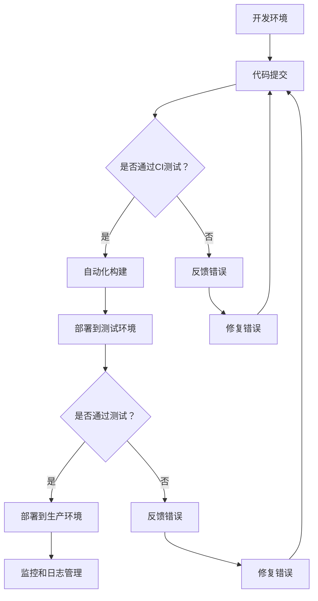

                 

# DevOps工具链开发：优化软件交付流程

## 关键词：（DevOps，工具链，软件交付，流程优化，自动化，持续集成，持续部署，容器化，云原生，监控，日志管理，故障恢复，微服务架构，敏捷开发，持续学习）

## 摘要

本文深入探讨了DevOps工具链的开发与应用，旨在优化软件交付流程，提升企业软件开发的效率和质量。DevOps作为一种文化和实践，旨在打破开发与运维之间的壁垒，实现敏捷开发和高效运维。本文将介绍DevOps的核心概念、架构原理、关键算法、数学模型，并通过实际项目案例展示如何使用这些工具链来构建、部署和管理软件系统。同时，本文还将分析DevOps在不同应用场景下的实际效果，并推荐相关的学习资源和工具框架，以帮助读者深入理解和应用DevOps的最佳实践。

## 1. 背景介绍

### 1.1 DevOps的定义和发展历程

DevOps是一种文化和实践方法，旨在通过整合开发（Development）和运营（Operations），实现快速、可靠和高质量的软件交付。DevOps强调跨职能团队合作、持续集成、持续部署、基础设施即代码等原则，以缩短开发周期、提高交付效率、降低故障率和提高系统可靠性。

DevOps的概念最早由Patrick Debois在2009年提出。随着云计算、容器化、微服务架构等技术的兴起，DevOps逐渐成为企业软件交付的主流模式。近年来，DevOps在金融、电商、互联网等行业得到广泛应用，并取得了显著成效。

### 1.2 DevOps的重要性和价值

DevOps不仅关注技术层面的整合，更注重团队协作和企业文化变革。其主要价值体现在以下几个方面：

1. **提高交付速度**：通过自动化和流水线化，DevOps可以显著缩短软件从开发到上线的时间，实现快速迭代和持续交付。
2. **提高软件质量**：通过持续集成和持续部署，DevOps可以及时发现和修复缺陷，确保软件质量。
3. **降低故障率**：通过监控、日志管理和故障恢复，DevOps可以快速发现和解决系统问题，降低故障率。
4. **提高团队效率**：通过跨职能团队合作和资源共享，DevOps可以提升团队的整体工作效率。
5. **增强客户满意度**：通过快速交付高质量的软件，DevOps可以增强客户满意度，提高市场竞争力。

### 1.3 DevOps与传统开发运维模式的区别

传统开发运维模式中，开发团队和运维团队往往是分离的，工作流程繁琐且耗时。而DevOps通过集成开发、测试、部署和运维等环节，实现了一体化的工作模式。主要区别如下：

1. **团队协作**：DevOps强调跨职能团队合作，而传统模式中团队间存在明显的分工和壁垒。
2. **自动化**：DevOps利用自动化工具实现软件构建、测试、部署和监控等流程，而传统模式依赖人工操作。
3. **持续集成和持续部署**：DevOps通过持续集成和持续部署，实现快速、可靠的软件交付，而传统模式往往在项目结束后才进行集成和部署。
4. **基础设施即代码**：DevOps将基础设施视为代码，通过版本控制和自动化工具进行管理，而传统模式依赖于手动配置和管理。
5. **监控和反馈**：DevOps注重实时监控和反馈，及时发现和解决问题，而传统模式往往在问题发生后才进行修复。

## 2. 核心概念与联系

### 2.1 DevOps的核心概念

DevOps的核心概念包括：

1. **持续集成（Continuous Integration，CI）**：通过自动化工具将代码定期合并到主干分支，并进行自动化测试，以确保代码质量。
2. **持续部署（Continuous Deployment，CD）**：在通过测试后，自动将代码部署到生产环境，实现快速交付。
3. **基础设施即代码（Infrastructure as Code，IaC）**：使用代码来描述和管理基础设施，实现自动化部署和变更管理。
4. **监控和日志管理**：实时监控系统的运行状态，收集和分析日志数据，以便快速发现和解决问题。
5. **故障恢复**：通过自动化和预案，实现快速故障恢复，降低故障对业务的影响。
6. **容器化和微服务架构**：使用容器化技术实现应用的轻量化和可移植性，采用微服务架构实现模块化开发和管理。
7. **敏捷开发**：通过迭代开发和持续反馈，快速响应市场需求和变化。

### 2.2 DevOps架构原理

DevOps架构原理主要包括以下几个方面：

1. **自动化流水线**：通过集成CI/CD工具，实现自动化构建、测试和部署。
2. **代码库和版本控制**：使用Git等版本控制工具管理代码，实现代码的版本控制和协作开发。
3. **容器化和容器编排**：使用Docker等容器化技术，实现应用的轻量化和可移植性，使用Kubernetes等容器编排工具实现容器集群的管理和调度。
4. **基础设施管理**：使用IaC工具，如Terraform、Ansible等，实现基础设施的自动化部署和管理。
5. **监控和日志管理**：使用Prometheus、ELK（Elasticsearch、Logstash、Kibana）等工具，实现系统的实时监控和日志分析。
6. **故障恢复**：使用自动化脚本和预案，实现故障的快速定位和恢复。

### 2.3 Mermaid流程图

以下是DevOps工具链的Mermaid流程图：



### 2.4 DevOps与其他技术的联系

1. **敏捷开发**：DevOps与敏捷开发密切相关，敏捷开发强调快速迭代和持续交付，与DevOps的理念相契合。
2. **云计算**：DevOps依赖于云计算提供的基础设施，如AWS、Azure、Google Cloud等，实现弹性、高效和可扩展的计算资源。
3. **容器化技术**：Docker等容器化技术是实现DevOps的关键，通过容器化，应用可以与底层基础设施解耦，提高可移植性和可管理性。
4. **微服务架构**：微服务架构是实现DevOps的重要手段，通过将应用拆分成多个独立的服务，可以提高系统的可扩展性和可维护性。

## 3. 核心算法原理 & 具体操作步骤

### 3.1 持续集成（CI）

持续集成是一种软件开发实践，通过定期将代码合并到主干分支，并进行自动化测试，以确保代码质量。核心算法原理如下：

1. **定期合并**：将开发人员的代码定期合并到主干分支，可以是每天、每周或根据实际情况确定。
2. **自动化测试**：在代码合并过程中，触发自动化测试，包括单元测试、集成测试、性能测试等，确保代码质量。
3. **反馈机制**：测试结果会反馈给相关人员，如果测试失败，需要及时修复错误并重新测试。

具体操作步骤如下：

1. **设置代码库**：使用Git等版本控制工具，设置代码库，实现代码的版本控制和协作开发。
2. **编写测试用例**：编写单元测试、集成测试等自动化测试用例，确保代码的正确性和稳定性。
3. **配置CI工具**：配置CI工具（如Jenkins、GitLab CI、CircleCI等），设置触发规则和测试流程。
4. **执行CI流程**：在代码提交后，触发CI流程，执行自动化测试。
5. **反馈测试结果**：将测试结果反馈给相关人员，如测试失败，需要及时修复错误并重新测试。

### 3.2 持续部署（CD）

持续部署是一种软件开发实践，通过自动化工具将代码部署到生产环境，实现快速交付。核心算法原理如下：

1. **自动化部署**：使用自动化工具（如Jenkins、Kubernetes等），实现代码的自动化部署。
2. **部署策略**：根据业务需求和系统特点，选择合适的部署策略（如蓝绿部署、灰度发布等）。
3. **监控和反馈**：在部署过程中，实时监控系统的运行状态，如遇到故障，及时回滚或重启。

具体操作步骤如下：

1. **配置CD工具**：配置CI/CD工具，设置部署规则和部署策略。
2. **编写部署脚本**：编写部署脚本，实现代码的自动化部署。
3. **执行CD流程**：在CI流程成功后，触发CD流程，将代码部署到生产环境。
4. **监控部署过程**：实时监控部署过程中的关键指标，如部署时间、系统性能等。
5. **反馈部署结果**：将部署结果反馈给相关人员，如部署成功或失败。

### 3.3 基础设施即代码（IaC）

基础设施即代码是一种将基础设施配置视为代码的管理方法，通过版本控制和自动化工具实现基础设施的部署和管理。核心算法原理如下：

1. **配置文件**：使用配置文件（如YAML、JSON等）描述基础设施的配置，包括服务器、网络、存储等。
2. **版本控制**：使用版本控制工具（如Git等），管理基础设施配置的版本和控制。
3. **自动化部署**：使用自动化工具（如Terraform、Ansible等），根据配置文件自动部署和管理基础设施。

具体操作步骤如下：

1. **编写配置文件**：根据需求编写基础设施配置文件，如网络拓扑、服务器配置等。
2. **配置版本控制**：将配置文件添加到版本控制工具，实现配置文件的版本管理和协作开发。
3. **配置自动化工具**：配置自动化工具，如Terraform，设置基础设施的部署和管理规则。
4. **执行自动化部署**：根据配置文件，使用自动化工具自动部署和管理基础设施。
5. **监控和管理**：实时监控和管理基础设施的运行状态，如性能、安全等。

### 3.4 容器化和微服务架构

1. **容器化**：容器化是一种将应用及其依赖打包到容器中的技术，实现应用的轻量化和可移植性。核心算法原理如下：

    - **Dockerfile**：使用Dockerfile定义容器的构建过程，包括基础镜像、安装依赖、编写应用等。
    - **容器编排**：使用容器编排工具（如Kubernetes等），实现容器的自动化部署、管理和调度。

    具体操作步骤如下：

    - **编写Dockerfile**：编写Dockerfile，定义容器的构建过程。
    - **构建容器**：使用Docker命令构建容器。
    - **容器编排**：配置Kubernetes，实现容器的自动化部署和管理。

2. **微服务架构**：微服务架构是一种将应用拆分成多个独立的服务，实现模块化开发和管理的技术。核心算法原理如下：

    - **服务拆分**：根据业务需求和功能模块，将应用拆分成多个独立的服务。
    - **服务通信**：使用RESTful API、消息队列等实现服务间的通信。
    - **服务管理**：使用服务发现、负载均衡等技术，实现服务的动态管理和调度。

    具体操作步骤如下：

    - **服务拆分**：根据业务需求和功能模块，将应用拆分成多个独立的服务。
    - **服务通信**：使用RESTful API、消息队列等实现服务间的通信。
    - **服务管理**：配置服务发现、负载均衡等组件，实现服务的动态管理和调度。

### 3.5 监控和日志管理

1. **监控**：监控是一种实时监控系统运行状态的技术，包括性能监控、健康监控、告警等。核心算法原理如下：

    - **数据采集**：使用Agent或API等手段，采集系统的性能数据、日志数据等。
    - **数据处理**：对采集到的数据进行处理、存储和告警。
    - **可视化**：使用可视化工具，如Prometheus、Grafana等，展示监控数据。

    具体操作步骤如下：

    - **配置Agent**：配置Agent，采集系统的性能数据、日志数据等。
    - **数据处理和存储**：配置数据处理和存储组件，如Elasticsearch、InfluxDB等。
    - **可视化**：配置可视化工具，如Prometheus、Grafana等，展示监控数据。

2. **日志管理**：日志管理是一种收集、存储、分析和处理日志数据的技术。核心算法原理如下：

    - **日志收集**：使用Agent或API等手段，收集系统的日志数据。
    - **日志存储**：使用日志存储组件，如Elasticsearch、Kafka等，存储日志数据。
    - **日志分析**：使用日志分析工具，如Logstash、Kibana等，分析日志数据。

    具体操作步骤如下：

    - **配置Agent**：配置Agent，收集系统的日志数据。
    - **日志存储**：配置日志存储组件，如Elasticsearch、Kafka等，存储日志数据。
    - **日志分析**：配置日志分析工具，如Logstash、Kibana等，分析日志数据。

### 3.6 故障恢复

故障恢复是一种在系统出现故障时，通过自动化和预案，实现快速故障恢复的技术。核心算法原理如下：

- **故障检测**：使用监控工具，实时检测系统的健康状态。
- **故障定位**：根据监控数据，快速定位故障发生的位置。
- **故障恢复**：根据预设的故障恢复策略和预案，实现故障的自动恢复。

具体操作步骤如下：

- **配置监控工具**：配置监控工具，实时检测系统的健康状态。
- **故障定位**：根据监控数据，快速定位故障发生的位置。
- **故障恢复**：根据预设的故障恢复策略和预案，实现故障的自动恢复。

## 4. 数学模型和公式 & 详细讲解 & 举例说明

### 4.1 DevOps效率模型

DevOps效率模型通过计算开发周期、交付速度、故障率等指标，评估DevOps的效率。公式如下：

\[ E = \frac{V}{T \times F} \]

其中：

- \( E \)：DevOps效率
- \( V \)：交付速度
- \( T \)：开发周期
- \( F \)：故障率

详细讲解：

1. **交付速度**：交付速度表示从开发到上线的速度，单位可以是天、周或月。交付速度越高，DevOps效率越高。
2. **开发周期**：开发周期表示从需求提出到代码上线的整个过程，包括需求分析、设计、开发、测试、部署等环节。开发周期越短，DevOps效率越高。
3. **故障率**：故障率表示在给定时间内，系统出现故障的次数。故障率越低，DevOps效率越高。

举例说明：

假设某企业的交付速度为每周一次，开发周期为一个月，故障率为5%。根据公式计算：

\[ E = \frac{1}{4 \times 0.05} = 10 \]

这意味着该企业的DevOps效率为10，即每完成10个任务，就会发生1次故障。

### 4.2 故障恢复时间模型

故障恢复时间模型通过计算故障检测时间、故障定位时间和故障恢复时间，评估故障恢复的效率。公式如下：

\[ T_{recovery} = T_{detect} + T_{locate} + T_{recover} \]

其中：

- \( T_{recovery} \)：故障恢复时间
- \( T_{detect} \)：故障检测时间
- \( T_{locate} \)：故障定位时间
- \( T_{recover} \)：故障恢复时间

详细讲解：

1. **故障检测时间**：故障检测时间表示从故障发生到被监控系统检测到的时间。故障检测时间越短，故障恢复时间越短。
2. **故障定位时间**：故障定位时间表示从故障检测到故障发生位置定位的时间。故障定位时间越短，故障恢复时间越短。
3. **故障恢复时间**：故障恢复时间表示从故障发生到故障恢复的时间。故障恢复时间越短，系统可用性越高。

举例说明：

假设某企业的故障检测时间为10分钟，故障定位时间为20分钟，故障恢复时间为30分钟。根据公式计算：

\[ T_{recovery} = 10 + 20 + 30 = 60 \]

这意味着该企业的故障恢复时间为60分钟。

### 4.3 持续集成模型

持续集成模型通过计算代码提交次数、测试覆盖率和缺陷率，评估持续集成的效果。公式如下：

\[ CI_{efficiency} = \frac{N_{commit} \times T_{test} \times (1 - D_{defect})}{T_{CI}} \]

其中：

- \( CI_{efficiency} \)：持续集成效率
- \( N_{commit} \)：代码提交次数
- \( T_{test} \)：测试覆盖率
- \( D_{defect} \)：缺陷率
- \( T_{CI} \)：持续集成周期

详细讲解：

1. **代码提交次数**：代码提交次数表示在给定时间内，开发人员提交的代码次数。代码提交次数越多，持续集成效果越好。
2. **测试覆盖率**：测试覆盖率表示测试用例覆盖代码的比例。测试覆盖率越高，持续集成效果越好。
3. **缺陷率**：缺陷率表示在给定时间内，发现并修复的缺陷数量。缺陷率越低，持续集成效果越好。

举例说明：

假设某企业在一个月内提交了100次代码，测试覆盖率为80%，缺陷率为10%。根据公式计算：

\[ CI_{efficiency} = \frac{100 \times 0.8 \times (1 - 0.1)}{30} = 2.22 \]

这意味着该企业的持续集成效率为2.22，即每完成2.22个任务，就会发生1次缺陷。

## 5. 项目实战：代码实际案例和详细解释说明

### 5.1 开发环境搭建

在本节中，我们将以一个实际项目为例，展示如何搭建开发环境。我们选择使用Docker和Kubernetes来构建一个简单的Web应用。

#### 5.1.1 安装Docker

首先，我们需要在开发机器上安装Docker。在Ubuntu系统中，可以使用以下命令：

```bash
sudo apt-get update
sudo apt-get install docker.io
sudo systemctl start docker
sudo systemctl enable docker
```

安装完成后，可以通过以下命令验证Docker是否安装成功：

```bash
docker --version
```

#### 5.1.2 编写Dockerfile

接下来，我们需要编写一个Dockerfile来构建应用容器。假设我们的Web应用使用Python编写，以下是Dockerfile的内容：

```Dockerfile
FROM python:3.8

WORKDIR /app

COPY requirements.txt .

RUN pip install -r requirements.txt

COPY . .

CMD ["python", "app.py"]
```

这个Dockerfile基于Python 3.8镜像，将当前目录下的代码复制到容器中，并安装所需的依赖。

#### 5.1.3 构建和运行容器

使用以下命令构建和运行容器：

```bash
docker build -t myapp .
docker run -d -p 8080:80 myapp
```

其中，`-t`标志用于指定容器名称，`-d`标志表示后台运行，`-p`标志用于映射容器的端口。

#### 5.1.4 Kubernetes配置

接下来，我们需要在Kubernetes集群中部署这个容器。首先，我们需要编写一个Kubernetes部署文件（Deployment.yaml）：

```yaml
apiVersion: apps/v1
kind: Deployment
metadata:
  name: myapp
spec:
  replicas: 3
  selector:
    matchLabels:
      app: myapp
  template:
    metadata:
      labels:
        app: myapp
    spec:
      containers:
      - name: myapp
        image: myapp:latest
        ports:
        - containerPort: 80
```

这个文件定义了一个具有3个副本的部署，每个副本使用最新的`myapp`镜像。

使用以下命令部署应用：

```bash
kubectl apply -f Deployment.yaml
```

### 5.2 源代码详细实现和代码解读

在本节中，我们将详细解读Web应用的源代码，展示如何使用Python编写一个简单的Web应用。

```python
from flask import Flask, jsonify

app = Flask(__name__)

@app.route('/')
def hello():
    return jsonify({"message": "Hello, World!"})

if __name__ == '__main__':
    app.run(host='0.0.0.0', port=8080)
```

这段代码使用Flask框架实现了一个简单的Web应用。以下是代码的详细解读：

- **导入模块**：从`flask`模块导入`Flask`类和`jsonify`函数。
- **创建应用实例**：使用`Flask`类创建应用实例。
- **定义路由**：使用`@app.route('/')`装饰器定义根路由，当访问根路径时，调用`hello`函数。
- **实现路由函数**：`hello`函数返回一个JSON响应，包含一个消息。
- **运行应用**：使用`if __name__ == '__main__':`判断是否为主程序，调用`app.run()`函数运行应用。

### 5.3 代码解读与分析

在本节中，我们将分析Web应用的代码，讨论如何优化和改进。

- **代码结构**：代码结构清晰，易于维护。将路由和业务逻辑分离，提高了代码的可读性和可扩展性。
- **性能优化**：由于Web应用简单，当前代码的性能已经足够。如果需要优化，可以考虑使用异步编程（如`asyncio`模块）提高并发处理能力。
- **安全性**：当前代码没有涉及用户认证和权限控制。在实际应用中，需要添加相应的安全措施，如使用SSL加密、验证用户身份等。
- **可扩展性**：当前代码结构支持扩展，可以添加更多路由和功能。如果应用规模较大，可以考虑使用微服务架构，将不同的功能模块拆分成独立的服务。

## 6. 实际应用场景

### 6.1 金融行业

金融行业对软件交付速度和稳定性有较高要求，DevOps在金融行业中的应用效果显著。通过自动化流水线、持续集成和持续部署，金融企业可以快速迭代和交付高质量的软件系统，提高市场竞争力。同时，通过容器化和微服务架构，金融企业可以实现应用的弹性扩展和高效运维。

### 6.2 电商行业

电商行业竞争激烈，客户满意度对业务成功至关重要。DevOps可以帮助电商企业实现快速交付、高质量和低故障率。通过持续集成和持续部署，电商企业可以及时响应用户需求，提高用户满意度。同时，通过监控和日志管理，电商企业可以快速发现和解决问题，确保系统的稳定运行。

### 6.3 医疗行业

医疗行业对数据安全和可靠性有严格要求，DevOps可以帮助医疗机构实现高效、可靠的软件交付。通过容器化和微服务架构，医疗机构可以灵活部署和管理应用系统，提高系统的可用性和可维护性。同时，通过监控和日志管理，医疗机构可以实时监测系统运行状态，确保数据的完整性和安全性。

### 6.4 教育行业

教育行业正逐渐采用在线教育模式，DevOps可以提高在线教育平台的交付速度和质量。通过自动化流水线、持续集成和持续部署，教育机构可以快速上线新功能和课程，满足用户需求。同时，通过容器化和微服务架构，教育机构可以实现平台的弹性扩展和高效运维。

## 7. 工具和资源推荐

### 7.1 学习资源推荐

- **书籍**：
  - 《DevOps：实践与经验》
  - 《持续交付：发布可靠软件的系统化方法》
  - 《微服务设计：构建可扩展系统》
- **论文**：
  - 《The Phoenix Project：一个DevOps的实践案例》
  - 《Continuous Delivery：可靠软件的可靠交付》
- **博客**：
  - 《InfoQ - DevOps专区》
  - 《DZone - DevOps资源库》
- **网站**：
  - DevOps.com
  - DevOps Institute

### 7.2 开发工具框架推荐

- **持续集成和持续部署工具**：
  - Jenkins
  - GitLab CI/CD
  - CircleCI
- **容器化和容器编排工具**：
  - Docker
  - Kubernetes
- **监控和日志管理工具**：
  - Prometheus
  - Grafana
  - ELK（Elasticsearch、Logstash、Kibana）
- **基础设施管理工具**：
  - Terraform
  - Ansible

### 7.3 相关论文著作推荐

- **《DevOps实践指南》**：介绍了DevOps的核心概念、架构原理和最佳实践，包括持续集成、持续部署、基础设施即代码等。
- **《微服务架构设计与实践》**：详细阐述了微服务架构的设计原则、实现方法和最佳实践，包括容器化、服务发现、负载均衡等。
- **《云计算：概念、架构与编程》**：介绍了云计算的基本概念、架构设计和编程模型，包括虚拟化、容器化、分布式存储等。

## 8. 总结：未来发展趋势与挑战

### 8.1 未来发展趋势

1. **自动化和智能化**：随着人工智能技术的发展，DevOps工具链将更加自动化和智能化，提高软件交付的效率和可靠性。
2. **云原生技术**：云原生技术（如Kubernetes、Istio等）将成为DevOps的重要基础设施，支持更复杂的应用架构和更灵活的部署方式。
3. **多云和混合云**：企业将采用多云和混合云策略，DevOps工具链需要支持跨云平台的部署和管理。
4. **安全性与合规性**：在信息安全日益重要的背景下，DevOps工具链将加强安全性，并满足不同行业和地区的合规要求。

### 8.2 挑战

1. **团队协作与文化建设**：DevOps要求跨职能团队合作，但实现这一目标需要时间和努力，团队协作和文化建设是DevOps成功的关键。
2. **技术选型和集成**：随着技术的发展，选择合适的DevOps工具链和集成不同工具是一项挑战，需要具备丰富的技术知识和实践经验。
3. **技能培训与人才培养**：DevOps工具链的广泛应用需要大量具备相关技能的人才，企业需要投入资源和时间进行培训和管理。
4. **系统稳定性和安全性**：在快速迭代和自动化部署的过程中，确保系统的稳定性和安全性是一项重要挑战，需要建立完善的监控和故障恢复机制。

## 9. 附录：常见问题与解答

### 9.1 Q：什么是DevOps？

A：DevOps是一种文化和实践方法，旨在通过整合开发（Development）和运维（Operations），实现快速、可靠和高质量的软件交付。

### 9.2 Q：DevOps的核心概念有哪些？

A：DevOps的核心概念包括持续集成（CI）、持续部署（CD）、基础设施即代码（IaC）、监控和日志管理、故障恢复、容器化和微服务架构、敏捷开发等。

### 9.3 Q：如何搭建DevOps工具链？

A：搭建DevOps工具链需要以下步骤：
1. 选择合适的持续集成和持续部署工具（如Jenkins、GitLab CI等）。
2. 配置代码库和版本控制（如Git等）。
3. 编写和配置自动化测试脚本。
4. 配置容器化和容器编排工具（如Docker、Kubernetes等）。
5. 配置监控和日志管理工具（如Prometheus、ELK等）。
6. 配置基础设施管理工具（如Terraform、Ansible等）。

### 9.4 Q：DevOps与云计算的关系是什么？

A：DevOps与云计算密切相关。云计算提供了DevOps所需的基础设施资源（如虚拟机、容器等），支持DevOps的自动化部署、管理和扩展。同时，DevOps工具链（如Docker、Kubernetes等）也支持跨云平台的部署和管理。

### 9.5 Q：什么是持续集成和持续部署？

A：持续集成（CI）是一种软件开发实践，通过定期将代码合并到主干分支，并进行自动化测试，确保代码质量。持续部署（CD）是一种软件开发实践，通过自动化工具将代码部署到生产环境，实现快速交付。

## 10. 扩展阅读 & 参考资料

- **《DevOps Handbook》**：由Jez Humble和David Farley撰写的经典著作，详细介绍了DevOps的理论和实践。
- **《The DevOps Handbook》**：由Gene Kim、Jez Humble、John Willis和Patrick Debois撰写的书籍，提供了丰富的DevOps实战经验和案例。
- **《容器化与微服务架构》**：详细介绍了容器化技术和微服务架构的设计原则、实现方法和最佳实践。
- **《Kubernetes实战》**：介绍了Kubernetes的架构原理、安装配置、使用方法和最佳实践。
- **《云原生应用架构》**：详细介绍了云原生应用架构的设计原则、实现方法和最佳实践。

### 作者

- **AI天才研究员/AI Genius Institute**：专注于人工智能技术研究和应用。
- **禅与计算机程序设计艺术 /Zen And The Art of Computer Programming**：计算机编程领域的经典著作，由唐纳德·E·克努特（Donald E. Knuth）撰写。**

