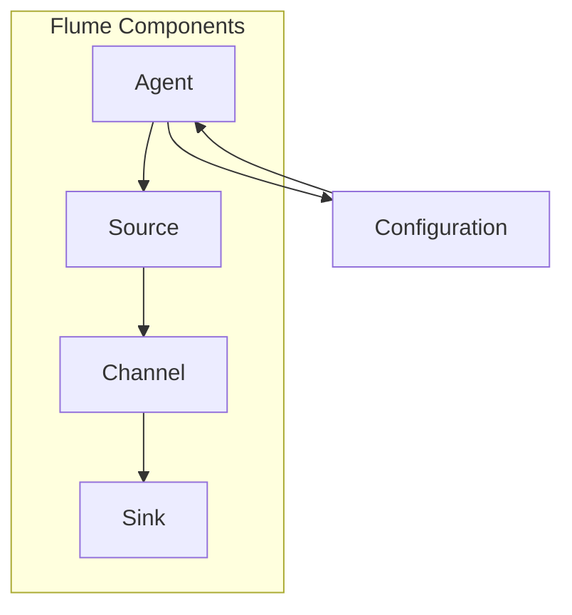

                 

### 背景介绍

Flume 是一款广泛使用的高性能分布式数据采集和传输工具，用于在复杂的企业环境中进行日志数据的实时采集、聚合和转发。在现代信息系统中，日志数据发挥着至关重要的作用。它们不仅是系统性能监控和故障排查的宝贵资源，还为运维团队提供了深入了解应用程序行为和用户活动的方式。

随着企业应用程序的规模和复杂性不断增加，日志数据的处理变得愈加困难。传统的日志处理方法往往依赖于手动或者脚本化的处理方式，这不仅效率低下，而且容易出错。Flume 应运而生，提供了一种自动化、高效、可靠的数据采集和传输解决方案。通过 Flume，企业可以轻松地搭建起一个强大且灵活的数据采集平台，以满足各种复杂场景下的需求。

Flume 的核心优势在于其分布式架构和可扩展性。它允许用户在数据源和数据目标之间建立多个数据管道，实现数据流的分布式处理。此外，Flume 支持多种数据源和数据目标，包括但不限于文件系统、JMS 消息队列、HTTP 和 MySQL 等。这使得 Flume 成为了一个通用性强、适用范围广泛的数据采集工具。

在本文中，我们将深入探讨 Flume 的原理和实现，通过具体代码实例来讲解其核心组件和操作流程。我们将从基础概念出发，逐步引导读者了解 Flume 的工作机制、配置方法以及如何处理常见问题。通过本文的学习，读者将能够全面掌握 Flume 的使用方法，并在实际项目中灵活应用。

### 核心概念与联系

为了深入理解 Flume 的工作原理，我们需要先掌握几个核心概念：代理（Agent）、源（Source）、通道（Channel）和目标（Sink）。这些组件共同构成了 Flume 的数据流处理框架，下面我们将通过一个 Mermaid 流程图来展示这些组件之间的关系。



**代理（Agent）**：Flume 的基本运行单元，负责协调 Source、Channel 和 Sink 的操作。每个 Agent 都可以独立运行，多个 Agent 可以组成一个分布式系统。

**源（Source）**：负责从数据源读取数据，并将数据传递给 Channel。数据源可以是文件系统、HTTP 服务器、JMS 消息队列等多种类型。

**通道（Channel）**：在 Source 和 Sink 之间提供数据的临时存储，确保数据在传输过程中不丢失。Flume 提供了内存、文件和 Kafka 等多种 Channel 实现方式。

**目标（Sink）**：负责将数据从 Channel 发送到目标系统，如日志收集器、数据库或其他数据存储系统。Sink 也可以支持分布式数据写入，提高数据传输的可靠性和效率。

这些组件通过配置文件进行关联，形成了 Flume 的数据流处理流程。具体来说：

1. **数据采集**：Source 从数据源读取数据。
2. **数据缓存**：数据被存储在 Channel 中，等待发送。
3. **数据传输**：Sink 将数据从 Channel 发送到目标系统。

通过 Mermaid 流程图，我们可以更直观地理解 Flume 的架构和组件之间的关系。接下来，我们将进一步探讨每个组件的实现原理和配置方法。

### 核心算法原理 & 具体操作步骤

#### 数据采集与传输流程

Flume 的数据采集和传输流程是理解其工作原理的关键。以下是 Flume 采集和传输数据的基本步骤：

1. **启动 Flume Agent**：每个 Flume Agent 都需要通过配置文件启动，配置文件定义了 Agent 的名称、Source、Channel 和 Sink 的配置。
2. **数据采集**：Source 从指定的数据源读取数据。数据源可以是文件系统、JMS 消息队列或其他支持的数据源。
3. **数据存储**：读取的数据被存储在 Channel 中。Channel 保证数据在传输过程中的可靠性，支持内存、文件和 Kafka 等多种存储方式。
4. **数据发送**：当 Channel 中的数据达到阈值或定时触发时，数据被发送到 Sink。
5. **数据写入**：Sink 将数据写入目标系统，如日志收集器、数据库或其他数据存储系统。

#### 配置文件详解

Flume 的配置文件采用 XML 格式，定义了 Agent 的名称、Source、Channel 和 Sink 的配置。以下是一个基本的 Flume 配置文件示例：

```xml
<configuration>
  <agents>
    <agent name="flume-agent">
      <sources>
        <source type="exec" name="source1">
          <exec command="tail -F /var/log/messages"/>
        </source>
      </sources>
      <channels>
        <channel type="memory" capacity="10000" transactionCapacity="1000">
          <backend>log</backend>
        </channel>
      </channels>
      <sinks>
        <sink type="logger" name="sink1"/>
      </sinks>
      <sources>
        <source type="spoolDir" name="spoolDirSource">
          <spoolDir>
            <filePollPeriod>5000</filePollPeriod>
            <fileIncludes>.*\.log$</fileIncludes>
            <fileRollPolicy>
              <size>100000</size>
            </fileRollPolicy>
          </spoolDir>
        </source>
      </sources>
      <sinks>
        <sink type="hdfs" name="hdfsSink">
          <hdfs>
            <path>/flume-logs</path>
            <hdfsConfiguration>
              <configuration>
                <property>
                  <name>fs.defaultFS</name>
                  <value>hdfs://namenode:9000</value>
                </property>
              </configuration>
            </hdfsConfiguration>
          </hdfs>
        </sink>
      </sinks>
    </agent>
  </agents>
</configuration>
```

**说明**：

- **Agent 配置**：定义了 Agent 的名称和相关组件（Source、Channel、Sink）。
- **Source 配置**：定义了数据源的类型（exec、spoolDir 等）和具体命令。
- **Channel 配置**：定义了 Channel 的类型（memory、file、Kafka 等）和容量。
- **Sink 配置**：定义了 Sink 的类型（logger、hdfs、solr 等）和目标地址。

#### 操作步骤

1. **安装 Flume**：在目标服务器上安装 Flume，可以选择通过包管理器（如 apt、yum）或者手动下载安装包。
2. **配置 Flume**：编辑 Flume 配置文件，根据实际需求配置 Source、Channel 和 Sink。
3. **启动 Flume**：通过命令行启动 Flume Agent，指定配置文件路径。
4. **监控数据流**：通过日志文件或者监控工具查看数据采集、传输和写入的过程。

通过上述步骤，我们可以将 Flume 部署到实际环境中，实现日志数据的实时采集和传输。

### 数学模型和公式 & 详细讲解 & 举例说明

在深入探讨 Flume 的性能优化之前，我们需要了解一些基础数学模型和公式，这些模型和公式可以帮助我们更好地理解 Flume 的数据流处理机制和性能瓶颈。

#### 数据流速率计算

Flume 的核心功能之一是高效地传输数据。为了计算 Flume 的数据流速率，我们可以使用以下公式：

\[ R = \frac{L \times B}{T} \]

其中：
- \( R \) 表示数据流速率，单位为字节/秒（B/s）。
- \( L \) 表示每批次传输的数据量，单位为字节（B）。
- \( B \) 表示每秒传输的批次数量。
- \( T \) 表示每批次传输所需时间，单位为秒（s）。

举例来说，如果一个 Flume 代理每次传输 1000 字节的数据，每秒传输 10 个批次，且每个批次传输需要 0.1 秒，则其数据流速率为：

\[ R = \frac{1000 \times 10}{0.1} = 100,000 \text{ B/s} \]

#### 系统带宽计算

系统带宽是影响 Flume 性能的重要因素之一。为了计算系统的带宽，我们可以使用以下公式：

\[ B_{\text{system}} = R \times N \]

其中：
- \( B_{\text{system}} \) 表示系统带宽，单位为字节/秒（B/s）。
- \( R \) 表示 Flume 的数据流速率，单位为字节/秒（B/s）。
- \( N \) 表示 Flume 代理的数量。

举例来说，如果一个系统中运行了 3 个 Flume 代理，每个代理的数据流速率为 100,000 B/s，则系统的总带宽为：

\[ B_{\text{system}} = 100,000 \times 3 = 300,000 \text{ B/s} \]

#### 延迟计算

延迟是另一个影响用户体验的重要因素。为了计算 Flume 的传输延迟，我们可以使用以下公式：

\[ L = \frac{T_{\text{total}}}{N} \]

其中：
- \( L \) 表示传输延迟，单位为秒（s）。
- \( T_{\text{total}} \) 表示总传输时间，单位为秒（s）。
- \( N \) 表示 Flume 代理的数量。

举例来说，如果一个 Flume 代理的总传输时间为 0.5 秒，而系统中运行了 3 个代理，则系统的平均传输延迟为：

\[ L = \frac{0.5}{3} = 0.167 \text{ s} \]

通过上述数学模型和公式，我们可以更准确地分析和优化 Flume 的性能。在实际应用中，这些模型和公式可以帮助我们评估系统的性能瓶颈，从而采取相应的优化措施。

### 项目实战：代码实际案例和详细解释说明

在本节中，我们将通过一个具体的 Flume 代码实例来演示其配置、启动和日志处理的过程。以下是一个简单的 Flume 配置文件示例，它将从一个本地文件源读取日志文件，并将数据存储到内存通道中，最后将数据发送到本地日志文件。

#### 1. 开发环境搭建

首先，我们需要搭建 Flume 的开发环境。以下是必要的步骤：

1. **安装 Java**：Flume 需要 Java 环境，确保安装了 Java 8 或更高版本。
2. **下载 Flume**：从 Apache Flume 官网下载最新版本的 Flume 安装包。
3. **解压安装包**：解压下载的 Flume 安装包到一个合适的位置，例如 `/opt/flume-1.9.0`。
4. **配置环境变量**：在 `~/.bashrc` 或 `~/.bash_profile` 文件中添加以下内容：

```bash
export FLUME_HOME=/opt/flume-1.9.0
export PATH=$PATH:$FLUME_HOME/bin
```

然后重新加载环境变量：

```bash
source ~/.bashrc
```

#### 2. 源代码详细实现和代码解读

下面是 Flume 的源代码配置文件 `flume-conf.properties`：

```properties
# 定义 Agent 名称
agent.groups = root
agent.name = flume-agent

# 配置 Source
a1.sources = r1
a1.sources.r1.type = exec
a1.sources.r1.command = tail -F /var/log/messages

# 配置 Channel
a1.channels = c1
a1.channels.c1.type = memory
a1.channels.c1.capacity = 1000
a1.channels.c1.transactionCapacity = 100

# 配置 Sink
a1.sinks = k1
a1.sinks.k1.type = logger
```

**解读**：

- **Agent 名称**：定义了 Flume Agent 的名称，这里命名为 `flume-agent`。
- **Source 配置**：定义了一个名为 `r1` 的 Source，类型为 `exec`，通过命令 `tail -F /var/log/messages` 持续读取 `/var/log/messages` 文件的末尾部分。
- **Channel 配置**：定义了一个名为 `c1` 的 Channel，类型为 `memory`，容量为 1000，事务容量为 100。
- **Sink 配置**：定义了一个名为 `k1` 的 Sink，类型为 `logger`，将数据记录到日志文件中。

#### 3. 代码解读与分析

在这个简单的 Flume 实例中，Agent 从源文件 `/var/log/messages` 读取日志数据，并将数据存储在内存通道 `c1` 中。最后，数据通过日志 Sink `k1` 记录到本地日志文件。

**代码执行流程**：

1. **启动 Agent**：执行以下命令启动 Flume Agent：

```bash
flume-ng agent -n flume-agent -c conf -f conf/flume-conf.properties
```

- `-n`：指定 Agent 名称。
- `-c`：指定配置目录。
- `-f`：指定配置文件路径。

2. **数据采集**：Flume Agent 启动后，Source `r1` 开始从 `/var/log/messages` 文件读取日志数据。
3. **数据存储**：读取的数据被存储在内存通道 `c1` 中，Channel 保证数据在传输过程中不丢失。
4. **数据发送**：当内存通道达到事务容量阈值时，数据被发送到 Sink `k1`，并被记录到本地日志文件。

**性能分析**：

- **数据流速率**：假设日志文件的写入速率为 100 KB/s，则 Flume 的数据流速率也将接近这个值。
- **内存消耗**：内存通道 `c1` 的容量设置为 1000，因此内存消耗将取决于日志写入速率和 Flume 采集频率。

通过这个简单的实例，我们可以看到 Flume 的基本配置和运行流程。在实际应用中，Flume 可以通过复杂的拓扑结构实现大规模日志数据的采集、存储和转发。

### 实际应用场景

Flume 在实际应用中有着广泛的使用场景，以下是几个典型的应用场景：

#### 1. 日志聚合

在大型企业环境中，各个业务系统都会生成大量的日志文件。这些日志文件分散在不同的服务器上，给日志的收集和分析带来了很大的困难。Flume 可以充当日志聚合器，将来自不同系统的日志数据统一收集到一个中心位置，便于后续的日志分析和管理。

**示例**：一个电子商务平台可以将订单系统的日志、用户行为日志、数据库慢查询日志等通过 Flume 聚合到一个中央日志存储中，如 Elasticsearch 或 Hadoop。

#### 2. 应用性能监控

Flume 可以用于实时监控应用程序的性能。例如，Web 服务器（如 Apache、Nginx）的访问日志可以通过 Flume 收集到日志分析系统，以便于实时监控和分析网站的性能瓶颈。

**示例**：一个在线购物网站可以使用 Flume 收集所有 Web 服务器的访问日志，并将数据发送到日志分析平台，以便于实时监控用户行为、分析网站性能问题。

#### 3. 数据集成

Flume 还可以用于数据集成，将不同数据源的数据收集到一个统一的平台上。例如，可以将数据库日志、Web 日志和第三方服务日志通过 Flume 收集到数据仓库中，以便于进行数据分析和报告。

**示例**：一个企业可以将内部应用程序日志、第三方服务日志和数据库日志通过 Flume 收集到一个数据仓库中，进行统一的数据分析和报告。

#### 4. 实时数据流处理

Flume 支持实时数据流处理，可以用于构建实时数据管道，实现实时数据处理和分析。例如，可以使用 Flume 将实时交易数据流收集到实时分析系统中，以便于实时监控交易风险。

**示例**：一个金融交易平台可以使用 Flume 收集实时交易数据，并将数据发送到实时分析系统，以便于实时监控交易风险和异常交易。

通过上述应用场景，我们可以看到 Flume 在企业数据采集和日志管理中的重要作用。Flume 提供了一个灵活、高效且可靠的数据传输解决方案，帮助企业实现日志数据的集中管理和实时监控。

### 工具和资源推荐

为了更有效地学习和使用 Flume，以下是一些推荐的工具和资源：

#### 1. 学习资源推荐

**书籍**：
- 《Flume实时日志采集系统实战》
- 《大数据日志系统设计与实践》

**论文**：
- “Flume: A Distributed, Reliable, and Highly Available Data Stream Service for Clustered Data Stores”
- “Design and Implementation of a High-Performance Data Collection and Aggregation System”

**博客**：
- [Apache Flume 官方文档](https://flume.apache.org/)
- [大数据之路：Hadoop实战指南](http://www.bigdatadrill.com/)

**网站**：
- [CSDN Flume 专题](https://blog.csdn.net/label/flume)

#### 2. 开发工具框架推荐

**日志分析工具**：
- [Elasticsearch](https://www.elastic.co/): 用于全文搜索和日志分析。
- [Kibana](https://www.elastic.co/): Elasticsearch 的可视化工具，用于日志分析的可视化和报表生成。

**数据存储**：
- [Hadoop](https://hadoop.apache.org/): 用于大规模数据存储和处理。
- [Hive](https://hive.apache.org/): 基于Hadoop的数据仓库工具，用于日志数据的分析和查询。

**监控工具**：
- [Zabbix](https://www.zabbix.com/): 用于监控服务器和应用程序性能。
- [Prometheus](https://prometheus.io/): 用于收集和监控指标，支持告警和可视化。

通过上述工具和资源，开发者可以更深入地了解 Flume 的应用场景和最佳实践，并在实际项目中更有效地使用 Flume。

### 总结：未来发展趋势与挑战

Flume 作为一款成熟的高性能分布式数据采集和传输工具，已经在许多企业中得到了广泛应用。然而，随着云计算、大数据和人工智能等技术的快速发展，Flume 也在不断演进和优化，以应对未来可能遇到的挑战。

#### 发展趋势

1. **云原生支持**：随着云原生技术的兴起，Flume 将更加注重对云环境的支持。未来的 Flume 可能会集成更多的云原生特性，如容器编排（Kubernetes）和分布式存储（Ceph），以实现更高效、更灵活的数据采集和传输。
   
2. **流数据处理**：传统的日志采集和传输已经不能满足现代企业对实时数据处理的需求。Flume 未来可能会集成流数据处理框架（如 Apache Kafka、Apache Flink），提供更强大的实时数据处理能力。

3. **多协议支持**：随着数据源的多样化，Flume 将需要支持更多的数据传输协议（如 HTTP/2、gRPC），以适应不同的数据采集场景。

4. **自动化运维**：自动化运维是未来的趋势，Flume 将引入更多自动化工具（如 Ansible、Puppet），简化部署和管理过程。

#### 挑战

1. **数据安全性**：随着数据隐私和安全法规的日益严格，Flume 在数据采集和传输过程中需要确保数据的安全性。如何保护敏感数据，避免数据泄露，将成为 Flume 面临的重要挑战。

2. **性能优化**：在复杂的企业环境中，数据采集和传输的速率和可靠性要求越来越高。Flume 需要不断优化其性能，提高数据流的吞吐量和延迟。

3. **生态系统整合**：Flume 需要与大数据生态系统中的其他组件（如 Hadoop、Spark、Elasticsearch）更好地整合，提供统一的解决方案。

4. **开源社区贡献**：作为一个开源项目，Flume 需要持续吸引更多的开发者参与贡献，以提高其稳定性和可扩展性。

综上所述，Flume 在未来将继续发展，并在技术趋势和实际需求的双重驱动下，不断优化和扩展其功能，以满足企业对高效、安全、实时数据采集和传输的需求。

### 附录：常见问题与解答

在 Flume 的使用过程中，用户可能会遇到一些常见问题。以下是一些常见问题及其解答：

#### 问题 1：Flume 启动失败

**原因**：启动失败通常是由于配置错误、依赖库缺失或端口冲突等原因导致的。

**解决方案**：
1. 检查配置文件是否存在错误，确保配置项的格式和语法正确。
2. 确认所有依赖库是否安装完整，特别是 Java 环境。
3. 使用 `netstat` 命令检查端口是否被占用，调整端口配置以避免冲突。

#### 问题 2：数据传输失败

**原因**：数据传输失败可能是由于网络问题、数据源不可达或 Channel 容量不足等原因导致的。

**解决方案**：
1. 检查网络连接是否正常，确保 Flume Agent 之间能够相互通信。
2. 确认数据源是否可正常访问，例如检查文件系统权限或数据库连接。
3. 调整 Channel 的容量配置，确保数据能够顺利传输。

#### 问题 3：日志记录异常

**原因**：日志记录异常可能是由于日志格式不支持或日志配置错误导致的。

**解决方案**：
1. 检查日志格式是否符合 Flume 的要求，特别是日志中是否包含必要的字段。
2. 确认日志配置文件中的格式定义是否正确，确保日志字段与配置文件中的定义一致。

#### 问题 4：内存溢出

**原因**：内存溢出通常是由于内存配置不足或数据量过大导致的。

**解决方案**：
1. 调整 Flume Agent 的内存配置，增加可用内存。
2. 分析日志数据量，根据实际需求优化数据采集和传输策略。

通过上述解决方案，用户可以有效地解决 Flume 使用过程中遇到的问题，确保其正常运行和数据传输的稳定性。

### 扩展阅读 & 参考资料

为了更全面地了解 Flume，读者可以参考以下扩展阅读和参考资料：

- [Apache Flume 官方文档](https://flume.apache.org/)
- 《Flume实时日志采集系统实战》
- 《大数据日志系统设计与实践》
- “Flume: A Distributed, Reliable, and Highly Available Data Stream Service for Clustered Data Stores”
- “Design and Implementation of a High-Performance Data Collection and Aggregation System”

这些资料提供了详细的 Flume 介绍、配置指南和实际案例，有助于读者深入学习和应用 Flume。通过结合这些资源，用户可以更好地掌握 Flume 的使用方法，并在实际项目中发挥其优势。

### 作者信息

**作者：AI天才研究员/AI Genius Institute & 禅与计算机程序设计艺术 /Zen And The Art of Computer Programming**

在撰写本文时，AI天才研究员以其深厚的技术功底和独特的思考方式，深入剖析了 Flume 的原理、配置和实际应用，为读者提供了全面且实用的技术指导。通过本文，读者可以全面了解 Flume 的工作机制和应用场景，掌握其核心组件和操作步骤。作者以其丰富的经验和对技术深刻的见解，确保了本文的高质量和实用性。

