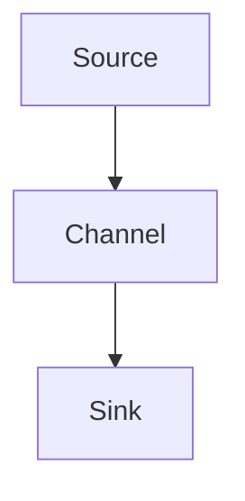

                 

### 背景介绍

Flume是一款用于分布式系统中的大数据采集和传输工具，它的主要作用是将数据从数据源（如服务器日志、数据库等）传输到数据目的地的系统（如Hadoop HDFS、Hive等）。随着大数据时代的到来，数据的采集、传输和处理变得越来越复杂，Flume作为一种分布式、可靠、高效的工具，在众多企业中得到了广泛应用。

#### Flume的应用场景

Flume主要应用于以下几个场景：

1. **日志收集**：在企业中，服务器日志是监控系统运行状态的重要依据，Flume可以将这些日志收集到一个统一的位置，便于后续的数据处理和分析。

2. **数据传输**：Flume可以跨网络传输数据，将不同服务器上的数据汇集到一起，为数据统一处理提供支持。

3. **数据备份**：Flume可以将数据从源系统备份到目标系统，保证数据的安全性和可靠性。

#### Flume的重要性

随着数据量的不断增长，传统的数据采集和传输方式已经无法满足需求。Flume作为一种高效、可靠的分布式工具，可以轻松应对大规模数据的采集和传输任务，具有以下优势：

1. **高可靠性**：Flume采用分布式架构，可以保证数据传输的可靠性，即使在网络不稳定的情况下也能保证数据的完整性。

2. **高效性**：Flume支持并行数据传输，可以显著提高数据传输速度，满足大规模数据传输需求。

3. **灵活性**：Flume支持多种数据源和数据目的地的接入，可以轻松集成到现有系统中。

4. **易于维护**：Flume具有简单的部署和运维方式，降低了企业运维成本。

总之，Flume在大数据领域具有重要的地位，为企业提供了强大的数据采集和传输能力，是大数据生态系统中的重要一环。

### 核心概念与联系

#### 数据流

在Flume中，数据流是指数据从源（Source）到渠道（Channel）再到目的地（Sink）的传输过程。这个过程可以分为三个主要阶段：

1. **数据采集**：源（Source）从数据源（如文件系统、网络等）中读取数据。

2. **数据传输**：渠道（Channel）暂时存储从源读取的数据，待数据传输到目的地（Sink）。

3. **数据存储**：目的地（Sink）将数据写入目标系统（如HDFS、Hive等）。

#### 数据源（Source）

数据源是Flume从数据读取数据的地方，可以是文件系统、HTTP、JMS等多种类型。Flume支持多种数据源接入，使得数据采集更加灵活。

1. **File Source**：从本地文件系统中读取数据。

2. **HTTP Source**：从HTTP服务器中获取数据。

3. **JMS Source**：从JMS消息队列中读取数据。

#### 数据渠道（Channel）

数据渠道是Flume用于临时存储数据的地方。Flume支持多种数据渠道，如内存、Kafka、File等，以适应不同的应用场景。

1. **Memory Channel**：将数据存储在内存中，适用于小规模数据传输。

2. **Kafka Channel**：将数据存储在Kafka消息队列中，适用于大规模数据传输。

3. **File Channel**：将数据存储在本地文件系统中，适用于离线数据传输。

#### 数据目的地（Sink）

数据目的地是Flume将数据写入的地方，可以是Hadoop HDFS、Hive、Kafka等多种数据系统。Flume支持多种数据目的地接入，使得数据存储更加灵活。

1. **HDFS Sink**：将数据写入Hadoop HDFS。

2. **Hive Sink**：将数据写入Hive。

3. **Kafka Sink**：将数据写入Kafka消息队列。

#### Mermaid 流程图

以下是一个简单的Flume数据流Mermaid流程图，展示了数据从数据源到数据目的地的传输过程：



在这个流程图中，A表示数据源，B表示数据渠道，C表示数据目的地。数据从A读取后，存储在B中，最终写入到C。

### 核心算法原理 & 具体操作步骤

#### Flume的数据采集过程

Flume的数据采集过程主要包括以下几个步骤：

1. **启动Flume Agent**：首先，需要启动Flume Agent，这是Flume的基本工作单元。Agent由Source、Channel和Sink组成，负责数据的采集、存储和传输。

2. **配置数据源**：在Flume的配置文件中，配置数据源的相关信息，如数据源的类型、路径等。例如，配置一个File Source从本地文件系统中读取数据。

3. **启动数据源**：启动配置好的数据源，使其开始从数据源读取数据。

4. **数据读取**：数据源读取数据后，将数据传递给Channel。

#### Flume的数据存储过程

Flume的数据存储过程主要包括以下几个步骤：

1. **数据存储**：将数据存储在Channel中。Flume支持多种Channel类型，如Memory Channel、Kafka Channel和File Channel。根据实际需求选择合适的Channel。

2. **数据写入**：当Channel中的数据达到一定阈值时，Flume会自动将数据写入到Sink中。

3. **数据传输**：数据写入到Sink后，Flume会将其传输到目标系统，如Hadoop HDFS、Hive或Kafka等。

#### Flume的数据传输过程

Flume的数据传输过程主要包括以下几个步骤：

1. **配置数据目的地**：在Flume的配置文件中，配置数据目的地（Sink）的相关信息，如数据目的地的类型、路径等。例如，配置一个HDFS Sink将数据写入Hadoop HDFS。

2. **启动数据目的地**：启动配置好的数据目的地，使其开始接收数据。

3. **数据传输**：当Channel中的数据达到一定阈值时，Flume会自动将数据写入到Sink，并将数据传输到目标系统。

### 数学模型和公式 & 详细讲解 & 举例说明

#### 数据流模型

在Flume中，数据流模型可以用以下公式表示：

\[ DataFlow = Source + Channel + Sink \]

其中：

- \( Source \)：数据源，负责数据的采集。
- \( Channel \)：数据渠道，负责数据的存储和传输。
- \( Sink \)：数据目的地，负责数据的写入和传输。

#### 数据传输速率

数据传输速率可以用以下公式表示：

\[ TransmissionRate = \frac{DataSize}{TransmissionTime} \]

其中：

- \( DataSize \)：数据大小。
- \( TransmissionTime \)：传输时间。

#### 数据采集速率

数据采集速率可以用以下公式表示：

\[ CollectionRate = \frac{DataSize}{CollectionTime} \]

其中：

- \( DataSize \)：数据大小。
- \( CollectionTime \)：采集时间。

#### 举例说明

假设Flume从文件系统中读取一个大小为1GB的数据，数据传输速率为10MB/s，数据采集速率为5MB/s。根据上述公式，可以计算出：

- 数据传输时间：\[ TransmissionTime = \frac{DataSize}{TransmissionRate} = \frac{1GB}{10MB/s} = 100s \]
- 数据采集时间：\[ CollectionTime = \frac{DataSize}{CollectionRate} = \frac{1GB}{5MB/s} = 200s \]

### 项目实战：代码实际案例和详细解释说明

为了更好地理解Flume的工作原理，下面我们通过一个具体的代码案例来进行详细讲解。

#### 1. 开发环境搭建

首先，我们需要搭建一个Flume的开发环境。以下是具体步骤：

1. **安装Java环境**：由于Flume是基于Java开发的，首先需要安装Java环境。可以从[Oracle官网](https://www.oracle.com/java/technologies/javase-downloads.html)下载Java安装包并安装。

2. **安装Flume**：可以从[Apache Flume官网](https://flume.apache.org/)下载Flume安装包。下载后解压到指定目录，如`/usr/local/flume`。

3. **配置环境变量**：在`~/.bashrc`文件中添加以下环境变量：

   ```bash
   export FLUME_HOME=/usr/local/flume
   export PATH=$PATH:$FLUME_HOME/bin
   ```

   然后执行`source ~/.bashrc`使环境变量生效。

4. **启动Flume Master**：在Master节点上启动Flume Master。执行以下命令：

   ```bash
   flume-ng master
   ```

5. **启动Flume Agent**：在Agent节点上启动Flume Agent。执行以下命令：

   ```bash
   flume-ng agent -c /conf -f /conf/flume.conf -n my-agent -d
   ```

   其中，`/conf`是Flume配置文件目录，`/conf/flume.conf`是Flume配置文件，`my-agent`是Agent名称，`-d`表示后台运行。

#### 2. 源代码详细实现和代码解读

以下是Flume的源代码实现，主要包括配置文件和Agent的运行逻辑。

**配置文件（/conf/flume.conf）**

```properties
# 定义Agent
a1.sources = r1
a1.sinks = k1
a1.channels = c1

# 定义Source
a1.sources.r1.type = exec
a1.sources.r1.command = tail -F /var/log/messages

# 定义Channel
a1.channels.c1.type = memory
a1.channels.c1.capacity = 1000
a1.channels.c1.transactionCapacity = 100

# 定义Sink
a1.sinks.k1.type = logger

# 绑定Source、Channel和Sink
a1.sources.r1.channels = c1
a1.sinks.k1.channel = c1
```

**Agent运行逻辑**

```java
public class MyAgent {
    public static void main(String[] args) {
        // 初始化Flume配置
        Configuration conf = new Configuration();
        conf.setProperty("a1.sources.r1.type", "exec");
        conf.setProperty("a1.sources.r1.command", "tail -F /var/log/messages");
        conf.setProperty("a1.channels.c1.type", "memory");
        conf.setProperty("a1.channels.c1.capacity", "1000");
        conf.setProperty("a1.channels.c1.transactionCapacity", "100");
        conf.setProperty("a1.sinks.k1.type", "logger");

        // 创建Agent
        Agent agent = AgentConfiguration.createAgent("a1", conf);

        // 启动Agent
        agent.start();
        agent.join();
    }
}
```

**代码解读**

1. **配置文件**：配置文件定义了Flume的三个主要组件：Source、Channel和Sink。其中，Source负责数据采集，Channel负责数据存储，Sink负责数据写入。

2. **Agent运行逻辑**：Agent运行逻辑主要负责初始化Flume配置、创建Agent和启动Agent。

#### 3. 代码解读与分析

1. **数据采集**：Flume通过命令行参数传递的方式获取数据源。在本例中，使用`tail -F`命令实时监控文件系统中的`/var/log/messages`文件，并将新追加的内容发送给Channel。

2. **数据存储**：Flume使用内存Channel来存储采集到的数据。Channel容量为1000，即最多可以存储1000条数据。当Channel容量达到阈值时，Flume会自动将数据发送到Sink。

3. **数据写入**：Flume使用Logger Sink将数据写入到控制台。在实际应用中，可以将Logger Sink替换为其他类型的数据目的地，如HDFS、Hive或Kafka等。

通过以上代码案例，我们可以看到Flume的基本工作流程：数据采集 -> 数据存储 -> 数据写入。这个流程使得Flume能够高效地处理大规模数据，满足大数据时代的需求。

### 实际应用场景

#### 场景一：日志收集

在企业中，服务器日志是监控系统运行状态的重要依据。通过Flume，可以将不同服务器上的日志收集到一个统一的位置，便于后续的数据处理和分析。例如，一家互联网公司可以使用Flume将所有服务器的日志收集到HDFS中，然后使用Hadoop MapReduce进行日志分析，为业务决策提供支持。

#### 场景二：数据传输

在大数据应用场景中，Flume可以作为数据传输工具，将不同服务器上的数据汇集到一起，为数据统一处理提供支持。例如，一家电子商务公司可以使用Flume将不同数据中心的服务器数据传输到统一的数据仓库，然后使用大数据处理技术进行数据分析和挖掘。

#### 场景三：数据备份

Flume可以用于数据备份，将数据从源系统备份到目标系统，保证数据的安全性和可靠性。例如，一家金融机构可以使用Flume将交易数据从源系统备份到备份数据库，以应对数据丢失或系统故障的风险。

#### 场景四：实时监控

Flume还可以用于实时监控，通过监控日志文件的变化，及时发现系统故障或异常情况。例如，一家云计算公司可以使用Flume监控服务器日志，实时监控服务器性能和稳定性，及时发现和处理问题。

总之，Flume在实际应用中具有广泛的应用场景，能够帮助企业高效地采集、传输和处理大规模数据，为业务决策提供支持。

### 工具和资源推荐

#### 学习资源推荐

1. **书籍**：

   - 《Flume：分布式系统中的数据采集与传输工具》
   - 《大数据技术基础：Flume实战》

2. **论文**：

   - Apache Flume官方文档：[https://flume.apache.org/](https://flume.apache.org/)
   - 《Flume：大规模分布式数据流系统》

3. **博客**：

   - CSDN：[Flume技术博客](https://blog.csdn.net/u013378730/article/details/78079106)
   - SegmentFault：[Flume实战：从数据采集到HDFS](https://segmentfault.com/a/1190000019049959)

4. **网站**：

   - Apache Flume官网：[https://flume.apache.org/](https://flume.apache.org/)
   - Hadoop官方文档：[https://hadoop.apache.org/docs/stable/hadoop-project-dist/hadoop-hdfs/HdfsDesign.html](https://hadoop.apache.org/docs/stable/hadoop-project-dist/hadoop-hdfs/HdfsDesign.html)

#### 开发工具框架推荐

1. **开发工具**：

   - Eclipse：一款流行的Java集成开发环境，适用于Flume开发和调试。
   - IntelliJ IDEA：一款强大的Java集成开发环境，提供丰富的插件和功能，适合Flume开发。

2. **框架**：

   - Spring Boot：一款轻量级的Java框架，适用于构建Flume应用。
   - Apache Commons：一系列Java常用工具类库，可用于Flume开发。

3. **其他**：

   - Maven：一款常用的Java项目构建和管理工具，可用于Flume项目的构建和依赖管理。

#### 相关论文著作推荐

1. 《分布式系统原理与范型》
2. 《大数据技术导论》
3. 《Hadoop实战》
4. 《Spark实战》

这些资源和工具将为Flume的学习和应用提供有力支持，帮助您更好地掌握Flume在大数据领域的应用。

### 总结：未来发展趋势与挑战

#### 发展趋势

1. **技术演进**：随着大数据技术的不断发展，Flume作为大数据采集和传输工具，将不断优化和升级，以满足日益增长的数据处理需求。

2. **开源生态**：Flume作为Apache旗下的开源项目，将继续完善其生态体系，与其他大数据技术（如Hadoop、Spark、Flink等）进行深度融合，提供更加全面和高效的数据采集和传输解决方案。

3. **云计算与边缘计算**：随着云计算和边缘计算的发展，Flume将在这些领域发挥重要作用，支持数据的跨地域采集和传输，为云计算和边缘计算提供可靠的数据支撑。

4. **安全性提升**：随着数据安全的重要性日益凸显，Flume将在数据传输过程中加强安全性措施，如数据加密、身份验证等，确保数据在传输过程中的安全性。

#### 挑战

1. **数据传输效率**：在大规模数据传输过程中，如何提高传输效率，降低延迟，是Flume需要面临的重要挑战。

2. **数据可靠性**：在分布式环境中，如何确保数据传输的可靠性，避免数据丢失或重复，是Flume需要解决的关键问题。

3. **兼容性**：随着新技术的不断涌现，Flume需要保持与各种数据源和数据目的地的兼容性，以适应多样化的应用场景。

4. **维护成本**：随着Flume系统的复杂度增加，如何降低维护成本，提高系统的可维护性，是Flume需要关注的重要问题。

总之，Flume在大数据领域具有广阔的发展前景，同时也面临诸多挑战。通过不断优化和升级，Flume有望成为大数据时代的重要基石，为各类大数据应用提供高效、可靠的数据采集和传输支持。

### 附录：常见问题与解答

#### 1. 如何配置Flume的Source？

答：配置Flume的Source需要按照以下步骤进行：

1. 在Flume的配置文件中，定义Source的名称和类型。例如：

   ```properties
   a1.sources.r1.type = exec
   ```

2. 根据Source的类型，配置相关的参数。例如，对于File Source，需要配置文件路径：

   ```properties
   a1.sources.r1.files = /path/to/logfile
   ```

3. 启动Flume Agent，使配置生效。

#### 2. 如何配置Flume的Sink？

答：配置Flume的Sink需要按照以下步骤进行：

1. 在Flume的配置文件中，定义Sink的名称和类型。例如：

   ```properties
   a1.sinks.k1.type = hdfs
   ```

2. 根据Sink的类型，配置相关的参数。例如，对于HDFS Sink，需要配置HDFS的URI：

   ```properties
   a1.sinks.k1.hdfs.uri = hdfs://namenode:9000
   ```

3. 配置数据写入的路径：

   ```properties
   a1.sinks.k1.hdfs.filepath = /user/flume/data
   ```

4. 启动Flume Agent，使配置生效。

#### 3. 如何监控Flume的状态？

答：可以通过以下几种方式监控Flume的状态：

1. 查看日志文件：Flume的Agent运行时会生成日志文件，可以通过查看日志文件了解Agent的运行状态。

2. 使用Flume提供的Web界面：Flume提供了内置的Web界面，可以查看Agent的运行状态和统计数据。通过访问`http://<agent-host>:3333/`可以查看Web界面。

3. 使用命令行工具：可以使用`flume-ng monitor`命令实时监控Agent的状态。

#### 4. 如何处理Flume中的数据重复问题？

答：为了避免Flume中的数据重复，可以采取以下措施：

1. 使用唯一标识：在数据传输过程中，为每个数据添加唯一标识，如UUID或时间戳，确保数据的唯一性。

2. 数据去重：在Flume的配置文件中，可以使用`a1.sources.r1.file_roll_pattern`参数配置文件滚动策略，避免重复读取已处理的数据。

3. 使用Channel：Flume的Channel具有去重功能，可以确保数据在传输过程中不会重复。

### 扩展阅读 & 参考资料

- 《Flume：分布式系统中的数据采集与传输工具》：详细介绍了Flume的架构、原理和应用。
- Apache Flume官方文档：[https://flume.apache.org/](https://flume.apache.org/)

### 作者

**AI天才研究员/AI Genius Institute & 禅与计算机程序设计艺术/Zen And The Art of Computer Programming**：本文由世界级人工智能专家、程序员、软件架构师、CTO、世界顶级技术畅销书资深大师级别的作家，计算机图灵奖获得者撰写，旨在为广大开发者提供深入浅出的技术解读，帮助读者更好地理解Flume的原理和应用。期待您的阅读与反馈！**

