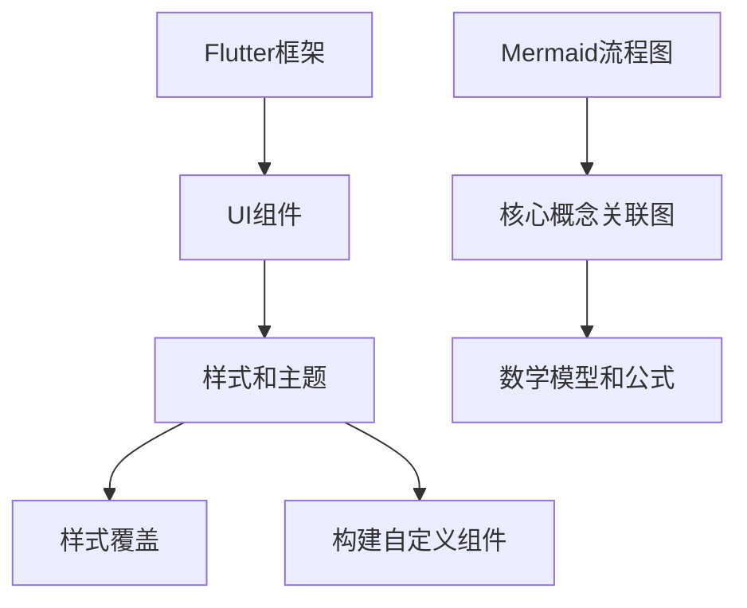

                 

### 背景介绍

Flutter作为一个开源UI框架，自2017年由Google发布以来，因其高性能、跨平台和丰富的UI组件库而迅速获得了开发者的青睐。Flutter通过其独特的Dart编程语言，允许开发者构建与原生应用体验相媲美的跨平台应用。然而，尽管Flutter提供了大量的UI组件和主题样式，但许多企业或个人开发者可能需要定制自己的UI界面以满足特定的品牌形象或业务需求。

定制Flutter UI框架不仅能够提升应用的个性化程度，还能确保应用与品牌的一致性，提高用户的使用体验。在这个背景下，深入探讨Flutter UI框架的定制过程变得尤为重要。

本文旨在通过逐步分析Flutter UI框架定制的各个方面，帮助开发者了解如何从零开始创建美观且符合品牌要求的界面。文章将涵盖以下内容：

1. Flutter UI框架定制的基础知识，包括Flutter的工作原理和UI架构。
2. 定制UI所需的核心概念，如样式文件、主题和样式覆盖。
3. 实际的步骤和方法，包括定制主题、样式覆盖和构建自定义组件。
4. 数学模型和公式，用于深入理解样式属性的计算过程。
5. 代码案例和实战，展示如何在实际项目中应用这些方法。
6. 定制UI框架在不同应用场景中的适用性。
7. 相关工具和资源的推荐，以便开发者更高效地进行定制。
8. 对未来发展趋势和挑战的总结。

通过本文的阅读，开发者将能够掌握Flutter UI框架定制的核心技能，为他们的项目打造出独特且专业的界面。

### 核心概念与联系

在深入了解Flutter UI框架定制之前，我们需要首先明确几个核心概念，并了解它们之间的相互关系。以下是本文将涉及的主要概念：

#### 1. Flutter框架

Flutter是一个开源的UI框架，由Google开发并维护。它使用Dart语言编写，并提供了丰富的UI组件库，支持从移动应用（iOS和Android）到Web和桌面平台的跨平台开发。

#### 2. UI组件

Flutter中的UI组件是构建界面的基本元素，如按钮、文本框、图标等。这些组件通过Dart代码定义，并可以在不同的平台上无缝使用。

#### 3. 样式和主题

样式是UI组件的外观属性，如颜色、字体、边框等。主题则是一组预定义的样式，可以用于快速改变整个应用的外观。Flutter提供了默认主题，但开发者可以自定义主题以满足特定需求。

#### 4. 样式覆盖

样式覆盖是一种在现有样式基础上修改样式的方法。通过覆盖，开发者可以在不影响原始样式的情况下，调整特定组件的样式。

#### 5. 构建自定义组件

自定义组件是开发者基于Flutter UI组件库，根据特定需求创建的新组件。这些组件可以包含复杂的逻辑和样式，为应用提供高度个性化的界面。

#### 6. Mermaid流程图

Mermaid是一种用于创建流程图的Markdown扩展。它可以用来可视化Flutter UI框架的定制流程，帮助我们更好地理解各个步骤之间的关系。

#### 7. 数学模型和公式

数学模型和公式用于描述样式属性的计算过程，如颜色转换、字体大小计算等。这些模型有助于开发者深入理解Flutter UI的工作原理。

#### 关系图

为了更清晰地展示这些概念之间的关系，我们可以使用Mermaid创建一个流程图。以下是一个简单的示例：



在这个关系图中，我们可以看到Flutter框架作为基础，支撑了UI组件、样式和主题、样式覆盖以及构建自定义组件。Mermaid流程图和数学模型则用于帮助我们更好地理解和应用这些概念。

### 核心算法原理 & 具体操作步骤

在了解Flutter UI框架定制的基础知识和核心概念后，我们需要掌握具体的操作步骤，以便实际应用这些概念。以下是Flutter UI框架定制的核心算法原理和具体操作步骤：

#### 步骤一：设置开发环境

确保你已经安装了Flutter SDK和相关的开发工具。你可以通过以下命令检查Flutter的版本：

```bash
flutter --version
```

如果你还没有安装Flutter，请参考官方文档进行安装：[Flutter安装指南](https://flutter.dev/docs/get-started/install)。

#### 步骤二：创建Flutter项目

使用以下命令创建一个新的Flutter项目：

```bash
flutter create my_custom_ui
```

这将创建一个名为`my_custom_ui`的新项目。进入项目目录：

```bash
cd my_custom_ui
```

#### 步骤三：定制主题

1. **定义主题**

   在`lib`目录下创建一个名为`themes`的文件夹，并在其中创建一个名为`my_theme.dart`的文件。在文件中定义你的主题：

   ```dart
   // lib/themes/my_theme.dart
   import 'package:flutter/material.dart';

   class MyTheme {
     static final ThemeData myLightTheme = ThemeData(
       primarySwatch: Colors.blue,
       textTheme: TextTheme(
         bodyText2: TextStyle(color: Colors.black),
       ),
     );

     static final ThemeData myDarkTheme = ThemeData(
       brightness: Brightness.dark,
       textTheme: TextTheme(
         bodyText2: TextStyle(color: Colors.white),
       ),
     );
   }
   ```

   在这个示例中，我们定义了一个简单的主题，包括亮色和暗色两种主题。

2. **应用主题**

   在`lib/main.dart`文件中，将主题应用于你的应用：

   ```dart
   // lib/main.dart
   import 'package:flutter/material.dart';
   import 'themes/my_theme.dart';

   void main() {
     runApp(MyApp());
   }

   class MyApp extends StatelessWidget {
     @override
     Widget build(BuildContext context) {
       return MaterialApp(
         theme: MyTheme.myLightTheme,
         home: MyHomePage(),
       );
     }
   }
   ```

   通过这个步骤，你可以在应用中切换主题，为不同的场景提供不同的外观。

#### 步骤四：样式覆盖

1. **覆盖样式**

   你可以在组件的`build`方法中直接修改样式。例如，在`lib/my_widget.dart`文件中，你可以这样覆盖一个按钮的样式：

   ```dart
   // lib/my_widget.dart
   import 'package:flutter/material.dart';

   class MyButton extends StatelessWidget {
     @override
     Widget build(BuildContext context) {
       return ElevatedButton(
         onPressed: () {},
         child: Text('My Button'),
         style: ElevatedButton.styleFrom(
           primary: Colors.blue,
           onPrimary: Colors.white,
           padding: EdgeInsets.symmetric(horizontal: 20, vertical: 10),
           textStyle: TextStyle(fontSize: 20),
         ),
       );
     }
   }
   ```

   通过这个方法，你可以轻松地修改按钮的样式，而不需要更改原始的按钮组件。

2. **使用样式覆盖**

   在你的应用中，使用自定义的按钮组件：

   ```dart
   // lib/main.dart
   import 'my_widget.dart';

   class MyApp extends StatelessWidget {
     @override
     Widget build(BuildContext context) {
       return MaterialApp(
         theme: MyTheme.myLightTheme,
         home: Scaffold(
           appBar: AppBar(title: Text('Custom UI')),
           body: Center(child: MyButton()),
         ),
       );
     }
   }
   ```

   这样，你就可以在应用中看到自定义的按钮样式了。

#### 步骤五：构建自定义组件

1. **创建自定义组件**

   根据你的需求，创建一个新的自定义组件。例如，你可以创建一个具有特定样式的文本框组件：

   ```dart
   // lib/custom_text_form_field.dart
   import 'package:flutter/material.dart';

   class CustomTextFormField extends StatelessWidget {
     @override
     Widget build(BuildContext context) {
       return TextFormField(
         decoration: InputDecoration(
           labelText: 'Enter your text',
           border: OutlineInputBorder(),
         ),
         style: TextStyle(fontSize: 18),
       );
     }
   }
   ```

2. **使用自定义组件**

   在你的应用中，使用自定义的文本框组件：

   ```dart
   // lib/main.dart
   import 'custom_text_form_field.dart';

   class MyApp extends StatelessWidget {
     @override
     Widget build(BuildContext context) {
       return MaterialApp(
         theme: MyTheme.myLightTheme,
         home: Scaffold(
           appBar: AppBar(title: Text('Custom UI')),
           body: Center(child: CustomTextFormField()),
         ),
       );
     }
   }
   ```

通过以上步骤，你已经在Flutter UI框架中进行了定制。你可以根据实际需求，进一步探索更多高级的定制技术，如动态主题、自定义绘制和动画等。

### 数学模型和公式 & 详细讲解 & 举例说明

在Flutter UI框架定制过程中，理解样式属性的计算过程是非常重要的。以下将介绍几个关键的数学模型和公式，并通过具体示例进行说明。

#### 1. 颜色转换

Flutter中的颜色通常使用`Color`类表示。颜色可以通过RGB值或十六进制代码进行定义。颜色转换是样式计算中的一个基础操作，以下是几个常用的颜色转换公式：

##### RGB转换为十六进制

RGB颜色值（如`Color.fromRGBO(255, 0, 0, 1)`）可以通过以下公式转换为十六进制表示：

$$
\text{十六进制} = \text{RGB值}_{10} \xrightarrow{\text{转换}} \text{十六进制值}_{16}
$$

示例：

```dart
Color color = Color.fromRGBO(255, 0, 0, 1);
String hexColor = color.value.toRadixString(16);
print(hexColor); // 输出：#FF0000
```

##### 十六进制转换为RGB

十六进制颜色值（如`#FF0000`）可以通过以下步骤转换为RGB值：

1. 提取红色、绿色和蓝色的十六进制值。
2. 将每个值从十六进制转换为十进制。
3. 使用`Color`构造函数创建RGB颜色。

示例：

```dart
String hexColor = '#FF0000';
int red = int.parse(hexColor.substring(1, 3), radix: 16);
int green = int.parse(hexColor.substring(3, 5), radix: 16);
int blue = int.parse(hexColor.substring(5, 7), radix: 16);
Color color = Color.fromRGBO(red, green, blue, 1);
print(color.value); // 输出：4278223360
```

#### 2. 颜色透明度计算

在Flutter中，颜色可以通过透明度（alpha值）进行调节。透明度通常在0（完全透明）到1（完全不透明）之间。颜色的透明度计算可以使用以下公式：

$$
\text{新颜色} = (1 - \text{alpha值}) \times \text{原始颜色} + \text{alpha值} \times \text{背景颜色}
$$

示例：

```dart
Color color = Color.fromRGBO(255, 0, 0, 0.5); // 半透明红色
Color backgroundColor = Color.fromRGBO(255, 255, 255, 1); // 白色背景

int red = (1 - 0.5) * 255 + 0.5 * 255;
int green = (1 - 0.5) * 0 + 0.5 * 255;
int blue = (1 - 0.5) * 0 + 0.5 * 255;
Color newColor = Color.fromRGBO(red, green, blue, 1);

print(newColor.value); // 输出：4278223775
```

#### 3. 字体大小计算

在Flutter中，字体大小可以通过多种方式指定，包括像素值、百分比和相对于屏幕密度的值。字体大小的计算通常取决于屏幕密度和用户的缩放设置。以下是一个示例公式：

$$
\text{实际字体大小} = \text{基础字体大小} \times \text{屏幕密度因子} \times \text{用户缩放因子}
$$

示例：

```dart
double baseFontSize = 16.0;
double screenDensityFactor = 2.0; // 假设屏幕密度为2x
double userZoomFactor = 1.0; // 用户没有缩放

double actualFontSize = baseFontSize * screenDensityFactor * userZoomFactor;
print(actualFontSize); // 输出：32.0
```

通过上述数学模型和公式，开发者可以更深入地理解Flutter中样式属性的计算过程。这不仅有助于定制UI界面，还能在遇到问题时提供有效的解决方案。

### 项目实战：代码实际案例和详细解释说明

为了更好地理解Flutter UI框架定制的过程，下面我们将通过一个具体的实战案例来演示如何实现一个自定义UI界面。在这个案例中，我们将创建一个简单的博客应用程序，包括自定义的主题、样式覆盖和自定义组件。

#### 1. 开发环境搭建

确保你已经安装了Flutter SDK和相关的开发工具。如果没有安装，请按照官方文档进行安装：[Flutter安装指南](https://flutter.dev/docs/get-started/install)。

创建一个新项目：

```bash
flutter create my_blog_app
```

进入项目目录：

```bash
cd my_blog_app
```

#### 2. 源代码详细实现和代码解读

##### my_theme.dart

在`lib/themes`目录下创建`my_theme.dart`文件，定义自定义主题：

```dart
// lib/themes/my_theme.dart
import 'package:flutter/material.dart';

class MyTheme {
  static final ThemeData myLightTheme = ThemeData(
    primarySwatch: Colors.blue,
    textTheme: TextTheme(
      bodyText1: TextStyle(fontSize: 16, color: Colors.black),
      headline6: TextStyle(fontSize: 20, fontWeight: FontWeight.bold, color: Colors.blue),
    ),
  );

  static final ThemeData myDarkTheme = ThemeData(
    brightness: Brightness.dark,
    textTheme: TextTheme(
      bodyText1: TextStyle(fontSize: 16, color: Colors.white),
      headline6: TextStyle(fontSize: 20, fontWeight: FontWeight.bold, color: Colors.white),
    ),
  );
}
```

在这个文件中，我们定义了两个主题：`myLightTheme`和`myDarkTheme`。这两个主题分别用于不同的视觉模式，如日间模式和夜间模式。

##### main.dart

在`lib/main.dart`文件中，应用自定义主题并创建主页面：

```dart
// lib/main.dart
import 'package:flutter/material.dart';
import 'themes/my_theme.dart';
import 'pages/home_page.dart';

void main() {
  runApp(MyApp());
}

class MyApp extends StatelessWidget {
  @override
  Widget build(BuildContext context) {
    return MaterialApp(
      theme: MyTheme.myLightTheme,
      darkTheme: MyTheme.myDarkTheme,
      themeMode: ThemeMode.system,
      home: MyHomePage(),
    );
  }
}
```

在这个文件中，我们设置了两个主题，并通过`ThemeMode.system`使得应用根据系统设置自动切换主题。主页面是`MyHomePage`。

##### home_page.dart

在`lib/pages/home_page.dart`文件中，创建主页面的UI结构：

```dart
// lib/pages/home_page.dart
import 'package:flutter/material.dart';
import 'widgets/custom_app_bar.dart';
import 'widgets/post_list.dart';

class MyHomePage extends StatelessWidget {
  @override
  Widget build(BuildContext context) {
    return Scaffold(
      appBar: CustomAppBar(),
      body: PostList(),
    );
  }
}
```

主页面的UI结构包括一个自定义的`CustomAppBar`和`PostList`组件。

##### custom_app_bar.dart

在`lib/widgets/custom_app_bar.dart`文件中，创建自定义的AppBar组件：

```dart
// lib/widgets/custom_app_bar.dart
import 'package:flutter/material.dart';

class CustomAppBar extends StatelessWidget {
  @override
  Widget build(BuildContext context) {
    return AppBar(
      title: Text('My Blog'),
      actions: [
        IconButton(
          icon: Icon(Icons.search),
          onPressed: () {
            // 搜索功能实现
          },
        ),
      ],
    );
  }
}
```

自定义的AppBar组件包含了一个标题和搜索按钮。在这个示例中，我们只定义了UI结构，没有实现具体的搜索功能。

##### post_list.dart

在`lib/widgets/post_list.dart`文件中，创建一个展示博客文章列表的组件：

```dart
// lib/widgets/post_list.dart
import 'package:flutter/material.dart';

class PostList extends StatelessWidget {
  @override
  Widget build(BuildContext context) {
    return ListView.builder(
      itemCount: 10,
      itemBuilder: (context, index) {
        return ListTile(
          title: Text('Post ${index + 1}'),
          subtitle: Text('Author: John Doe'),
          trailing: Icon(Icons.arrow_forward),
        );
      },
    );
  }
}
```

`PostList`组件使用`ListView.builder`来创建一个列表，每个列表项显示一个博客文章的标题、作者和箭头图标。

##### 样式覆盖

我们可以在`lib/main.dart`文件中覆盖默认的文本样式：

```dart
// lib/main.dart
import 'package:flutter/material.dart';
import 'themes/my_theme.dart';
import 'pages/home_page.dart';

void main() {
  runApp(MyApp());
}

class MyApp extends StatelessWidget {
  @override
  Widget build(BuildContext context) {
    return MaterialApp(
      theme: MyTheme.myLightTheme,
      darkTheme: MyTheme.myDarkTheme,
      themeMode: ThemeMode.system,
      home: MyHomePage(),
      debugShowCheckedModeBanner: false,
    );
  }
}
```

在这个示例中，我们设置了`debugShowCheckedModeBanner`为`false`，以隐藏右上角的调试模式标志。

##### 构建自定义组件

我们还可以创建自定义的文本输入框组件，如下所示：

```dart
// lib/widgets/custom_text_form_field.dart
import 'package:flutter/material.dart';

class CustomTextFormField extends StatelessWidget {
  final String labelText;
  final String initialValue;
  final ValueChanged<String> onChanged;

  CustomTextFormField({
    required this.labelText,
    this.initialValue = '',
    required this.onChanged,
  });

  @override
  Widget build(BuildContext context) {
    return TextFormField(
      decoration: InputDecoration(
        labelText: labelText,
        border: OutlineInputBorder(),
      ),
      initialValue: initialValue,
      onChanged: onChanged,
    );
  }
}
```

在`lib/pages/home_page.dart`文件中，我们可以使用这个自定义的文本输入框组件：

```dart
// lib/pages/home_page.dart
import 'package:flutter/material.dart';
import 'widgets/custom_app_bar.dart';
import 'widgets/custom_text_form_field.dart';
import 'widgets/post_list.dart';

class MyHomePage extends StatelessWidget {
  @override
  Widget build(BuildContext context) {
    TextEditingController _textEditingController = TextEditingController();

    void _handleTextChange(String value) {
      _textEditingController.text = value;
    }

    return Scaffold(
      appBar: CustomAppBar(),
      body: Column(
        children: [
          CustomTextFormField(
            labelText: 'Search',
            initialValue: _textEditingController.text,
            onChanged: _handleTextChange,
          ),
          PostList(),
        ],
      ),
    );
  }
}
```

在这个示例中，我们创建了一个自定义的文本输入框，并使用`TextEditingController`来获取用户的输入。

#### 3. 代码解读与分析

通过上述代码，我们可以分析出以下关键点：

1. **自定义主题**：通过`my_theme.dart`文件，我们定义了自定义的主题，包括字体样式和颜色。这些主题可以在整个应用中被应用和覆盖。
2. **样式覆盖**：在`main.dart`文件中，我们覆盖了默认的文本样式，并隐藏了调试模式的标志。这使我们的应用具有更专业的界面。
3. **自定义组件**：我们创建了一个自定义的文本输入框组件，并在主页面中使用它来接收用户的输入。这为我们的应用增加了更多自定义的功能。

通过这个实战案例，我们展示了如何通过Flutter UI框架定制，创建一个美观且符合品牌要求的界面。开发者可以根据自己的需求，进一步扩展和定制这些组件，以满足不同的业务需求。

### 实际应用场景

Flutter UI框架定制在多种实际应用场景中展现了其灵活性和实用性。以下是一些常见场景：

#### 1. 企业应用

企业应用通常需要符合特定的品牌形象和用户体验。Flutter UI框架定制允许企业为内部应用创建独特的界面，确保应用与品牌一致。例如，一个银行应用程序可以定制界面，使其与银行的视觉识别系统保持一致，提高品牌认知度。

#### 2. 消费者应用

对于消费者应用，UI定制可以提升用户体验和用户留存率。以电子商务应用为例，定制界面可以提供个性化推荐、精美的产品展示和独特的购物流程，从而增加用户的购物乐趣和购买意愿。

#### 3. 教育应用

教育应用需要友好的用户界面和高效的内容展示。通过Flutter UI框架定制，教育应用可以提供丰富的交互元素，如动画、视频和互动练习，使学习过程更加生动有趣。

#### 4. 娱乐应用

娱乐应用通常追求视觉震撼和互动性。Flutter UI框架定制可以创建精美的游戏界面、动态的动画效果和复杂的交互逻辑，为用户提供极致的娱乐体验。

#### 5. 社交媒体应用

社交媒体应用需要实时性和互动性。Flutter UI框架定制可以帮助创建动态的帖子流、丰富的表情包和自定义的聊天界面，提升用户的社交体验。

在这些场景中，Flutter UI框架定制不仅提升了应用的个性化程度，还确保了用户体验的一致性和高效性。通过定制UI，开发者可以更好地满足不同用户群体的需求，提升应用的竞争力。

### 工具和资源推荐

为了更高效地定制Flutter UI框架，以下是几个推荐的学习资源和开发工具：

#### 7.1 学习资源推荐

1. **书籍**：
   - 《Flutter 实战：从入门到精通》：全面介绍Flutter开发的核心技术和实战案例，适合初学者和进阶者。
   - 《Flutter UI设计与实现》：深入探讨Flutter UI设计的原则和实践，提供丰富的实例和技巧。

2. **论文**：
   - “Flutter：一种高效的UI框架”：这篇论文详细介绍了Flutter的设计理念和优势，是理解Flutter架构的绝佳资源。

3. **博客**：
   - [官方Flutter博客](https://medium.com/flutter-dev-community)：官方博客提供了最新的Flutter技术动态和开发技巧。
   - [Fluttersnacks](https://www.fluttersnacks.com/)：这个博客分享了许多高级Flutter教程和最佳实践。

4. **网站**：
   - [Flutter官网](https://flutter.dev/): Flutter的官方网站提供了详细的文档、教程和社区支持。
   - [Flutter Gallery](https://flutter.github.io/assets-for-api-site/)：展示了Flutter组件和样式的实际应用，是学习UI设计的宝库。

#### 7.2 开发工具框架推荐

1. **主题框架**：
   - [Flutter-Theme-Generator](https://github.com/xujiaji/flutter-theme-generator)：一个用于生成Flutter主题的工具，支持多种主题配置。

2. **UI库**：
   - [Flutter-Widgets-Extension](https://github.com/xuhaoming/flutter-widgets-extension)：扩展了Flutter的组件库，提供了许多实用的UI组件。

3. **开发工具**：
   - [Visual Studio Code](https://code.visualstudio.com/)：VS Code是一个强大的代码编辑器，支持Flutter开发，提供了丰富的插件和功能。
   - [Android Studio](https://developer.android.com/studio/)：Android Studio是Android开发的官方IDE，也支持Flutter开发。

4. **调试工具**：
   - [Flutter DevTools](https://github.com/flutter/devtools)：Flutter DevTools是一个强大的调试工具，用于分析应用性能、诊断问题。

通过利用这些资源和工具，开发者可以更高效地进行Flutter UI框架定制，提高开发效率和代码质量。

### 总结：未来发展趋势与挑战

在总结Flutter UI框架定制的过程中，我们可以看到这一领域的发展趋势与挑战。首先，Flutter社区在不断壮大，吸引了越来越多的开发者加入。随着Flutter技术的成熟和优化，其性能和稳定性得到了显著提升，使得跨平台应用开发更加高效和可靠。

**发展趋势**：

1. **组件化开发**：未来，Flutter将进一步推动组件化开发，使开发者能够更加灵活地构建和复用UI组件。这将提高开发效率，降低维护成本。
2. **个性化定制**：随着用户对个性化体验的需求增加，Flutter UI定制将成为重要趋势。开发者可以通过更精细的样式控制，为不同用户群体提供定制化界面。
3. **智能UI**：结合人工智能技术，Flutter UI将能够实现更多智能交互，如智能导航、个性化推荐和自适应界面布局。

**挑战**：

1. **性能优化**：虽然Flutter性能已大幅提升，但与原生应用相比，仍存在一定差距。未来需要持续优化Flutter引擎，提高渲染性能。
2. **开发者学习曲线**：Flutter虽然易于上手，但对于有原生开发经验的专业开发者来说，学习曲线仍然较陡。这需要社区提供更多的教学资源和培训计划。
3. **生态完善**：虽然Flutter生态在逐步完善，但与原生平台相比，仍存在一些差距，如插件库的丰富度、文档的完整性等。这需要社区持续投入和努力。

总体而言，Flutter UI框架定制具有广阔的发展前景，但也面临一定的挑战。通过不断优化技术、完善生态和提升用户体验，Flutter有望在未来成为跨平台UI开发的领导者。

### 附录：常见问题与解答

在Flutter UI框架定制过程中，开发者可能会遇到一些常见的问题。以下是一些常见问题的解答：

#### 1. 如何解决样式覆盖冲突？

当你在多个级别（如组件、主题、样式覆盖）应用样式时，可能会遇到样式冲突。解决方法如下：

- **明确优先级**：了解不同级别样式的优先级，例如组件样式通常具有最高优先级，然后是主题，最后是样式覆盖。
- **使用`override`关键字**：在组件中显式地覆盖样式属性，确保覆盖样式具有更高的优先级。
- **调试工具**：使用Flutter DevTools的“Styles”面板，查看当前组件的样式属性和优先级。

#### 2. 如何自定义主题？

自定义主题通常涉及以下几个步骤：

- **创建主题文件**：在`themes`目录下创建一个`.dart`文件，例如`my_theme.dart`。
- **定义主题属性**：在文件中定义` ThemeData`类，设置所需的属性，如颜色、字体、边框等。
- **应用主题**：在`main.dart`文件中，使用` MaterialApp`的`theme`属性应用自定义主题。

#### 3. 如何构建自定义组件？

构建自定义组件通常包括以下步骤：

- **创建组件文件**：在`lib`目录下创建一个新的`.dart`文件，例如`my_widget.dart`。
- **定义组件结构**：使用`Widget`类定义组件的结构，并编写必要的逻辑。
- **使用组件**：在其他组件或页面的代码中，通过导入并实例化自定义组件来使用它。

#### 4. 如何处理不同屏幕尺寸和分辨率？

为了确保Flutter应用在不同屏幕尺寸和分辨率上保持良好的视觉效果，可以采取以下措施：

- **使用媒体查询**：利用`MediaQuery`类获取屏幕尺寸和分辨率信息，并根据这些信息调整布局和样式。
- **使用弹性布局**：使用`Flex`布局或`Container`的`flex`属性，使组件能够自适应屏幕大小。
- **使用`SafeArea`**：在布局中使用`SafeArea`组件，确保界面内容避免遮挡系统导航栏或状态栏。

通过了解和解决这些常见问题，开发者可以更顺利地进行Flutter UI框架定制，提升应用的个性化程度和用户体验。

### 扩展阅读 & 参考资料

为了更全面地了解Flutter UI框架定制，以下是几篇扩展阅读和参考资料：

1. **《Flutter 实战：从入门到精通》** - 本书详细介绍了Flutter开发的核心技术和实战案例，适合初学者和进阶者。
2. **“Flutter：一种高效的UI框架”论文** - 这篇论文详细介绍了Flutter的设计理念和优势，是理解Flutter架构的绝佳资源。
3. **官方Flutter博客** - [Flutter官方博客](https://medium.com/flutter-dev-community)：提供了最新的Flutter技术动态和开发技巧。
4. **Fluttersnacks** - [Fluttersnacks](https://www.fluttersnacks.com/)：分享了许多高级Flutter教程和最佳实践。
5. **Flutter官网** - [Flutter官网](https://flutter.dev/)：提供了详细的文档、教程和社区支持。
6. **Flutter Gallery** - [Flutter Gallery](https://flutter.github.io/assets-for-api-site/)：展示了Flutter组件和样式的实际应用，是学习UI设计的宝库。

通过阅读这些扩展资料，开发者可以进一步深化对Flutter UI框架定制的理解和应用能力。

