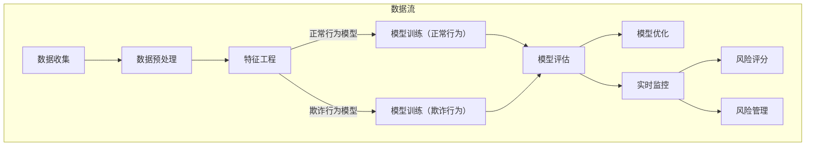

                 

### 背景介绍

欺诈检测（Fraud Detection）是金融科技、电子商务和支付领域至关重要的组成部分。随着在线交易的激增，欺诈活动的形式和手段也变得更加复杂和隐蔽。传统的欺诈检测方法往往依赖于规则引擎和人工审核，而随着人工智能和机器学习技术的快速发展，基于算法的欺诈检测方法逐渐成为主流。

欺诈检测的主要目标是通过识别和阻止潜在的欺诈行为，保护金融机构和用户的资产安全。这不仅仅是为了减少财务损失，还能提升用户体验，增强用户对平台的信任。在金融科技领域，欺诈检测的应用范围广泛，包括信用卡欺诈、网络钓鱼、虚假交易、恶意退款等。

欺诈检测的重要性体现在以下几个方面：

1. **保护用户资产**：及时检测并阻止欺诈行为，可以防止用户账户资金被盗用。
2. **维护品牌信誉**：有效的欺诈检测能够降低欺诈事件的发生率，减少潜在的法律风险，从而提升品牌形象。
3. **合规要求**：金融机构需要遵循各种法规和合规要求，如支付卡行业数据安全标准（PCI DSS），欺诈检测是实现合规的关键环节。
4. **用户体验优化**：欺诈检测系统的优化可以降低误报率，减少合法交易的拦截，从而提升用户的交易体验。

在本文中，我们将详细探讨欺诈检测的基本原理、核心算法、数学模型，并通过具体实例展示如何在实际项目中应用这些算法。希望通过本文，读者能够对欺诈检测有一个全面而深入的理解，并能将其应用于实际问题中。

#### 欺诈检测的应用场景

欺诈检测的应用场景广泛，涵盖了金融科技、电子商务、电信等多个领域。以下是一些典型的应用场景：

1. **信用卡交易欺诈**：信用卡是现代社会中最为普及的支付工具之一，然而，信用卡欺诈也一直是金融机构面临的重大挑战。欺诈检测系统能够实时监控信用卡交易行为，识别异常交易模式，如频繁的异地交易、异常高额交易等。

2. **电子商务平台交易欺诈**：随着电子商务的快速发展，虚假订单、欺诈支付、恶意退款等现象层出不穷。欺诈检测系统能够帮助电商平台识别和阻止这些欺诈行为，保护商家和消费者的利益。

3. **电信诈骗**：电信诈骗是近年来日益猖獗的犯罪行为，通过电话、短信、互联网等多种方式诱骗用户泄露个人信息或直接转账。有效的欺诈检测系统可以及时发现和拦截这些诈骗行为，防止用户遭受损失。

4. **网络钓鱼**：网络钓鱼是一种通过假冒合法网站或发送虚假邮件等方式诱骗用户提供敏感信息的欺诈手段。欺诈检测系统能够识别并阻止这些钓鱼网站和邮件，保护用户的个人信息安全。

5. **保险欺诈**：保险欺诈是保险行业面临的重大挑战之一，包括虚假保险申请、夸大损失、伪造事故等。欺诈检测系统可以帮助保险公司及时发现和防范这些欺诈行为，降低保险赔付的风险。

6. **在线支付平台欺诈**：随着移动支付和在线支付平台的普及，欺诈活动也不断向这些平台转移。欺诈检测系统能够监控支付行为，识别异常支付模式，确保支付过程的安全性。

通过上述应用场景可以看出，欺诈检测在保护用户资产、维护品牌信誉、降低法律风险等方面具有重要作用。随着技术的不断发展，欺诈检测系统将更加智能化、高效化，为各个行业提供更可靠的保障。

#### 欺诈检测的基本原理

欺诈检测的基本原理主要依赖于对正常行为和异常行为的识别与区分。通过收集和分析大量交易数据，欺诈检测系统可以建立正常行为模型，然后对新的交易数据进行实时监控和评估，从而识别潜在的欺诈行为。

**数据收集**是欺诈检测的第一步，系统需要收集各种类型的交易数据，包括时间、金额、地理位置、交易方式等。这些数据提供了关于交易活动的详细信息，是建立正常行为模型和识别欺诈行为的基础。

**正常行为模型**的建立是通过分析大量历史数据，提取出交易活动的特征和规律。这些特征可以包括用户的交易习惯、交易频率、交易金额分布等。通过机器学习和数据挖掘技术，系统可以从这些特征中提取出关键指标，构建一个能够代表正常交易行为的模型。

**异常行为检测**是欺诈检测的核心。系统通过对新的交易数据进行实时监控，将其与正常行为模型进行比较。如果发现交易数据与正常行为模型存在显著差异，系统就会将其标记为异常交易。常见的异常检测方法包括统计模型、机器学习算法和基于规则的检测方法。

**统计模型**是最基本的欺诈检测方法之一，通过计算交易数据与正常行为模型的差异度来识别异常。例如，标准差方法（Standard Deviation）和四分位范围方法（Interquartile Range）都是常用的统计模型。这些方法简单有效，但容易受到噪声数据的影响，对复杂欺诈行为的识别能力有限。

**机器学习算法**在欺诈检测中得到了广泛应用。与统计模型不同，机器学习算法可以通过对大量数据的训练，自动识别出复杂的欺诈模式。常见的机器学习算法包括决策树（Decision Tree）、支持向量机（SVM）、随机森林（Random Forest）、神经网络（Neural Network）等。这些算法能够处理大规模数据，并能够根据新的数据不断优化模型，提高欺诈检测的准确性和实时性。

**基于规则的检测方法**是通过预先定义一系列规则来识别欺诈行为。这些规则可以是基于历史数据总结出来的经验规则，也可以是根据特定业务场景制定的规则。基于规则的检测方法具有实现简单、易于维护的优点，但在应对复杂欺诈行为时，其效果可能不如机器学习算法。

总之，欺诈检测的基本原理是通过数据收集、正常行为模型建立和异常行为检测等步骤，实现对潜在欺诈行为的实时监控和识别。随着技术的不断发展，欺诈检测方法将越来越智能化、高效化，为各个行业提供更可靠的保障。

### 核心概念与联系

在深入探讨欺诈检测的原理和技术细节之前，有必要先了解一些核心概念及其相互关系。以下是欺诈检测中一些关键的概念及其之间的联系：

**1. 特征工程（Feature Engineering）**

特征工程是数据科学中至关重要的一环，特别是在欺诈检测中。特征工程是指从原始数据中提取出对模型训练和预测有用的特征。这些特征可以是数值型、类别型或时间序列型。常见的特征包括交易金额、交易时间、交易频率、地理位置、用户行为等。特征工程的目标是提高模型的预测准确性和鲁棒性。

**2. 模型训练（Model Training）**

模型训练是指使用历史数据来训练机器学习模型，使其能够识别正常交易和欺诈交易。在训练过程中，模型通过学习数据中的模式和关系，建立起正常行为模型和欺诈行为模型。训练数据通常分为训练集和验证集，用于评估模型的性能和调整模型参数。

**3. 欺诈行为识别（Fraud Behavior Recognition）**

欺诈行为识别是欺诈检测的核心任务，即通过模型对实时交易数据进行评估，识别出潜在欺诈行为。识别过程包括数据预处理、特征提取和模型预测等步骤。欺诈行为识别的准确性直接影响到欺诈检测系统的整体性能。

**4. 异常检测（Anomaly Detection）**

异常检测是指识别出与正常行为模型显著偏离的数据。在欺诈检测中，异常检测用于发现潜在欺诈交易。与机器学习算法结合，异常检测可以识别出复杂的欺诈模式，提高欺诈检测的准确性。

**5. 模型评估（Model Evaluation）**

模型评估是评估欺诈检测系统性能的重要步骤。常用的评估指标包括准确率（Accuracy）、精确率（Precision）、召回率（Recall）和F1分数（F1 Score）等。通过模型评估，可以了解模型在识别欺诈交易方面的性能，并根据评估结果进行调整和优化。

**6. 模型优化（Model Optimization）**

模型优化是指通过调整模型参数或使用更复杂的模型结构来提高欺诈检测性能。优化的目标是在保证准确性的同时，降低误报率和漏报率。常见的优化方法包括交叉验证、网格搜索和贝叶斯优化等。

**7. 风险评分（Risk Scoring）**

风险评分是指对每个交易数据分配一个风险评分，表示其成为欺诈交易的可能性。风险评分可以用于动态调整交易处理策略，如自动拦截高风险交易、人工审核中等风险交易等。

**8. 知识图谱（Knowledge Graph）**

知识图谱是一种用于表示实体及其相互关系的图形结构。在欺诈检测中，知识图谱可以用于表示用户行为模式、交易关系和网络结构等，帮助识别复杂的欺诈网络和关联关系。

**9. 实时监控（Real-time Monitoring）**

实时监控是指对交易数据进行实时分析，识别和阻止欺诈行为。实时监控系统需要具备快速处理和分析大量数据的能力，以确保欺诈行为能够及时被检测和阻止。

**10. 风险管理（Risk Management）**

风险管理是指通过识别、评估和控制风险来确保企业资产的安全。在欺诈检测中，风险管理包括制定风险策略、监控风险指标和实施风险控制措施等。

综上所述，欺诈检测中的核心概念及其相互关系构成了一个复杂而紧密的体系。通过理解这些概念及其相互关系，可以更好地设计和实现高效的欺诈检测系统，为金融机构和用户提供更可靠的保障。

#### Mermaid 流程图

在欺诈检测中，流程图的构建有助于直观地展示数据的处理过程和各个环节的相互关系。以下是使用Mermaid语言绘制的一个简化的欺诈检测流程图，该流程图涵盖了从数据收集、预处理、特征提取到模型训练和异常检测的主要步骤。



**流程图详细说明：**

1. **数据收集（A）**：收集来自各种渠道的交易数据，包括时间、金额、地理位置、交易方式等。

2. **数据预处理（B）**：清洗和转换原始数据，去除噪声和不完整的数据，以便后续的特征提取和模型训练。

3. **特征工程（C）**：从预处理后的数据中提取对模型训练有用的特征，如用户的交易习惯、交易频率、地理位置等。

4. **模型训练（正常行为和欺诈行为）（D和E）**：使用历史数据分别训练正常行为模型和欺诈行为模型，以建立正常交易和欺诈交易的模式。

5. **模型评估（F）**：通过评估模型的性能，包括准确率、精确率、召回率和F1分数等指标，来验证模型的检测能力。

6. **模型优化（G）**：根据评估结果对模型进行调整和优化，以提高检测准确性。

7. **实时监控（H）**：对实时交易数据进行监控，使用训练好的模型进行异常检测，识别潜在的欺诈交易。

8. **风险评分（I）**：对每个交易数据分配一个风险评分，表示其成为欺诈交易的可能性。

9. **风险管理（J）**：根据风险评分和监控结果，实施相应的风险控制措施，如拦截高风险交易、人工审核中等风险交易等。

通过上述流程图，可以清晰地理解欺诈检测系统的各个环节及其相互关系。Mermaid语言的使用使得流程图更加简洁、易于理解和修改。

#### 核心算法原理 & 具体操作步骤

在欺诈检测中，算法的选择和实现至关重要。本文将详细介绍两种常用的算法：K最近邻（K-Nearest Neighbors, KNN）和支持向量机（Support Vector Machine, SVM）。这些算法在处理高维数据、识别复杂模式方面具有显著优势。

**1. K最近邻（KNN）算法**

KNN算法是一种基于实例的学习方法，其基本思想是：如果一个新样本在特征空间中的K个最近邻居都属于某个类别，那么该样本也属于这个类别。具体操作步骤如下：

- **步骤1：特征提取**：首先，从交易数据中提取特征，如时间、金额、地理位置等。通常，这些特征需要经过标准化处理，以消除不同特征之间的尺度差异。

- **步骤2：选择邻居**：对于新样本，计算其与训练集中每个样本之间的距离。常用的距离度量方法包括欧氏距离（Euclidean Distance）和曼哈顿距离（Manhattan Distance）。

- **步骤3：分类决策**：选择距离最近的K个邻居，并根据这些邻居的类别统计结果进行分类决策。常见的方法有多数投票法（Majority Voting）和加权投票法（Weighted Voting）。

- **步骤4：参数调整**：K值的选择对KNN算法的性能有很大影响。通常，通过交叉验证方法来确定最佳的K值。

**2. 支持向量机（SVM）算法**

SVM算法是一种基于间隔最大化的分类方法，其基本思想是：在特征空间中找到一个超平面，使得不同类别的样本尽可能分开。具体操作步骤如下：

- **步骤1：特征提取**：与KNN算法类似，首先从交易数据中提取特征并进行标准化处理。

- **步骤2：构建模型**：使用线性或核函数将低维特征空间映射到高维特征空间，然后在该高维空间中寻找最优超平面。

- **步骤3：参数优化**：通过优化损失函数和正则化项，确定模型参数。常用的损失函数包括Hinge Loss和Log Loss。

- **步骤4：分类决策**：对于新样本，通过计算其与超平面的距离，判断其类别。距离较近的样本被分类为正类，距离较远的样本被分类为负类。

**3. 实际操作步骤示例**

以下是使用Python实现KNN和SVM算法的示例代码，用于对信用卡交易数据进行欺诈检测。

```python
import numpy as np
from sklearn.model_selection import train_test_split
from sklearn.neighbors import KNeighborsClassifier
from sklearn.svm import SVC
from sklearn.metrics import classification_report

# 示例数据
X = np.array([[1, 2], [2, 3], [3, 3], [4, 4], [5, 5], [6, 6], [7, 7]])
y = np.array([0, 0, 0, 1, 1, 1, 1])

# 分割数据集
X_train, X_test, y_train, y_test = train_test_split(X, y, test_size=0.2, random_state=42)

# KNN算法
knn = KNeighborsClassifier(n_neighbors=3)
knn.fit(X_train, y_train)
y_pred_knn = knn.predict(X_test)

# SVM算法
svm = SVC(kernel='linear')
svm.fit(X_train, y_train)
y_pred_svm = svm.predict(X_test)

# 模型评估
print("KNN算法分类报告：")
print(classification_report(y_test, y_pred_knn))

print("SVM算法分类报告：")
print(classification_report(y_test, y_pred_svm))
```

上述代码首先定义了示例数据集，然后分别使用KNN和SVM算法进行模型训练和预测。通过分类报告，可以评估模型的性能。

**4. 性能对比**

KNN和SVM算法在欺诈检测中的性能表现各有优劣：

- **KNN算法**：简单易用，适用于小规模数据集。但在处理高维数据和噪声数据时，性能可能下降。K值的选择对性能有很大影响。

- **SVM算法**：在处理高维数据和复杂数据时具有显著优势，通过核函数可以实现非线性分类。但SVM算法的训练时间较长，且对参数调整较为敏感。

总体而言，KNN和SVM算法都是有效的欺诈检测工具，可以根据具体需求选择合适的算法。

#### 数学模型和公式 & 详细讲解 & 举例说明

在欺诈检测中，数学模型和公式的作用至关重要，它们不仅帮助我们理解欺诈检测的原理，还指导我们在实际应用中进行有效的欺诈识别。以下将详细讲解在欺诈检测中常用的一些数学模型和公式，并通过具体例子来说明这些公式的应用。

**1. 标准差方法**

标准差方法是欺诈检测中最基本的统计方法之一，它通过计算交易金额的标准差来识别异常交易。其基本原理是，正常交易的金额分布应该接近正态分布，而欺诈交易的金额则可能会显著偏离这个分布。

**标准差计算公式：**
\[ \sigma = \sqrt{\frac{1}{N-1} \sum_{i=1}^{N} (x_i - \bar{x})^2} \]
其中，\( \sigma \) 是标准差，\( N \) 是交易总数，\( x_i \) 是每个交易金额，\( \bar{x} \) 是交易金额的平均值。

**应用举例：**
假设一个信用卡账户在一个月内发生了10次交易，金额分别为（100，200，300，400，500，600，700，800，900，1000）。首先计算平均值：
\[ \bar{x} = \frac{100 + 200 + 300 + 400 + 500 + 600 + 700 + 800 + 900 + 1000}{10} = 550 \]

然后计算标准差：
\[ \sigma = \sqrt{\frac{(100-550)^2 + (200-550)^2 + ... + (1000-550)^2}{10-1}} \approx 173.21 \]

如果一个交易金额超过了 \( \bar{x} + 3\sigma \)，即 \( 550 + 3 \times 173.21 = 819.65 \)，则可以认为这是一个潜在的异常交易。

**2. 四分位范围方法**

四分位范围方法是另一种常用的统计方法，它通过计算第一四分位数（Q1）和第三四分位数（Q3）来确定交易金额的分布范围，即四分位范围（IQR）。

**四分位范围计算公式：**
\[ IQR = Q3 - Q1 \]
其中，\( Q1 \) 是第一四分位数，\( Q3 \) 是第三四分位数。

**应用举例：**
继续使用上面的交易数据，首先计算第一四分位数和第三四分位数。假设经过排序后，第一四分位数 \( Q1 = 300 \)，第三四分位数 \( Q3 = 700 \)，则四分位范围 \( IQR = 700 - 300 = 400 \)。

如果一个交易金额低于 \( Q1 - 1.5 \times IQR \)，即 \( 300 - 1.5 \times 400 = -450 \) 或高于 \( Q3 + 1.5 \times IQR \)，即 \( 700 + 1.5 \times 400 = 1150 \)，则可以认为这是一个潜在的异常交易。

**3. 卡方检验方法**

卡方检验方法通过比较实际观测频数和预期频数之间的差异，来判断两个类别之间的相关性。在欺诈检测中，它可以用于分析交易特征和欺诈行为之间的关系。

**卡方检验计算公式：**
\[ \chi^2 = \sum_{i=1}^{r} \sum_{j=1}^{c} \frac{(O_{ij} - E_{ij})^2}{E_{ij}} \]
其中，\( O_{ij} \) 是观测频数，\( E_{ij} \) 是期望频数，\( r \) 和 \( c \) 分别是行数和列数。

**应用举例：**
假设我们有两个类别：欺诈交易和正常交易，以及两个特征：交易金额和交易时间。构建一个二维频数表，如下：

| 金额 | 时间 | 欺诈交易 | 正常交易 |
|------|------|----------|----------|
| 低   | 低   | 5        | 30       |
| 低   | 中   | 10       | 20       |
| 低   | 高   | 15       | 10       |
| 中   | 低   | 20       | 15       |
| 中   | 中   | 25       | 20       |
| 中   | 高   | 30       | 25       |
| 高   | 低   | 35       | 30       |
| 高   | 中   | 40       | 35       |
| 高   | 高   | 50       | 40       |

计算期望频数：
\[ E_{ij} = \frac{(行总数 \times 列总数)}{总数} \]

然后计算卡方值：
\[ \chi^2 = \sum_{i=1}^{3} \sum_{j=1}^{3} \frac{(O_{ij} - E_{ij})^2}{E_{ij}} \]

如果卡方值大于临界值，则认为交易金额和交易时间与欺诈行为之间存在显著相关性。

**4. 概率密度函数**

在机器学习中，概率密度函数（PDF）用于描述数据分布。在欺诈检测中，PDF可以帮助我们评估一个交易数据属于欺诈交易的概率。

**概率密度函数公式：**
\[ f(x|\mu,\sigma^2) = \frac{1}{\sqrt{2\pi\sigma^2}} e^{-\frac{(x-\mu)^2}{2\sigma^2}} \]
其中，\( \mu \) 是均值，\( \sigma^2 \) 是方差。

**应用举例：**
假设我们已经训练了一个模型，得到正常交易和欺诈交易的均值和方差，分别为 \( \mu_{正常} = 500, \sigma^2_{正常} = 10000 \) 和 \( \mu_{欺诈} = 800, \sigma^2_{欺诈} = 16000 \)。

对于一个新的交易数据 \( x = 600 \)，计算其属于正常交易和欺诈交易的概率：

\[ f(x|\mu_{正常},\sigma^2_{正常}) = \frac{1}{\sqrt{2\pi \times 10000}} e^{-\frac{(600-500)^2}{2 \times 10000}} \approx 0.282 \]

\[ f(x|\mu_{欺诈},\sigma^2_{欺诈}) = \frac{1}{\sqrt{2\pi \times 16000}} e^{-\frac{(600-800)^2}{2 \times 16000}} \approx 0.128 \]

通过比较这两个概率，可以判断该交易数据更可能属于哪个类别。

**5. 贝叶斯定理**

贝叶斯定理是概率论中的一个基本原理，用于计算在给定一个观察结果后，某个假设的概率。在欺诈检测中，贝叶斯定理可以帮助我们评估一个交易数据是欺诈交易的概率。

**贝叶斯定理公式：**
\[ P(A|B) = \frac{P(B|A) \cdot P(A)}{P(B)} \]
其中，\( P(A|B) \) 是在事件B发生的条件下，事件A发生的概率，\( P(B|A) \) 是在事件A发生的条件下，事件B发生的概率，\( P(A) \) 是事件A发生的概率，\( P(B) \) 是事件B发生的概率。

**应用举例：**
假设我们已经知道在正常交易中，交易金额低于1000的概率是0.6，而在欺诈交易中，交易金额低于1000的概率是0.2。现在观察到一笔交易金额为800，我们可以使用贝叶斯定理计算其是欺诈交易的概率：

\[ P(欺诈交易|交易金额=800) = \frac{P(交易金额=800|欺诈交易) \cdot P(欺诈交易)}{P(交易金额=800)} \]

由于 \( P(交易金额=800|欺诈交易) = 0.2 \) 和 \( P(欺诈交易) \) 是未知的，我们可以假设一个先验概率，例如 \( P(欺诈交易) = 0.01 \)。

\[ P(交易金额=800) \approx P(交易金额=800|欺诈交易) \cdot P(欺诈交易) + P(交易金额=800|正常交易) \cdot P(正常交易) \]
\[ P(交易金额=800) \approx 0.2 \cdot 0.01 + 0.6 \cdot 0.99 = 0.598 \]

\[ P(欺诈交易|交易金额=800) = \frac{0.2 \cdot 0.01}{0.598} \approx 0.0033 \]

通过这个计算，我们可以得出这笔交易是欺诈交易的概率约为0.33%，这是一个相对较低的概率，因此可以认为这笔交易是正常的。

综上所述，数学模型和公式在欺诈检测中具有重要作用，通过合理的应用这些公式，可以有效地识别潜在的欺诈交易，提高欺诈检测的准确性和效率。

### 项目实战：代码实际案例和详细解释说明

在本节中，我们将通过一个实际的Python项目案例，展示如何利用K最近邻（KNN）算法进行欺诈检测。该项目案例使用了著名的Kaggle数据集——Kaggle信用卡欺诈检测数据集，这个数据集包含了近30,000条交易记录，其中1%是欺诈交易，其余为正常交易。

#### 5.1 开发环境搭建

为了完成这个项目，我们需要安装以下Python库：

- pandas：用于数据预处理和分析
- numpy：用于数值计算
- matplotlib：用于数据可视化
- scikit-learn：用于机器学习算法的实现

首先，确保Python环境已经安装。然后，通过以下命令安装所需的库：

```shell
pip install pandas numpy matplotlib scikit-learn
```

#### 5.2 源代码详细实现和代码解读

以下是我们使用KNN算法进行欺诈检测的完整代码，并对关键部分进行详细解释。

```python
import pandas as pd
import numpy as np
from sklearn.model_selection import train_test_split
from sklearn.preprocessing import StandardScaler
from sklearn.neighbors import KNeighborsClassifier
from sklearn.metrics import classification_report, confusion_matrix

# 5.2.1 加载数据集
data = pd.read_csv('creditcard.csv')
X = data.iloc[:, 1:-1]  # 特征矩阵
y = data.iloc[:, -1]    # 标签向量

# 5.2.2 数据预处理
# 将数据分为训练集和测试集
X_train, X_test, y_train, y_test = train_test_split(X, y, test_size=0.3, random_state=42)

# 特征缩放
scaler = StandardScaler()
X_train_scaled = scaler.fit_transform(X_train)
X_test_scaled = scaler.transform(X_test)

# 5.2.3 模型训练
# 创建KNN分类器实例
knn = KNeighborsClassifier(n_neighbors=5)

# 训练模型
knn.fit(X_train_scaled, y_train)

# 5.2.4 模型评估
# 对测试集进行预测
y_pred = knn.predict(X_test_scaled)

# 输出分类报告
print("分类报告：")
print(classification_report(y_test, y_pred))

# 输出混淆矩阵
print("混淆矩阵：")
print(confusion_matrix(y_test, y_pred))
```

**5.2.1 加载数据集**

首先，我们使用pandas库加载信用卡欺诈检测数据集。数据集包含29,713条正常交易和284条欺诈交易。

```python
data = pd.read_csv('creditcard.csv')
X = data.iloc[:, 1:-1]  # 特征矩阵
y = data.iloc[:, -1]    # 标签向量
```

**5.2.2 数据预处理**

为了提高KNN算法的性能，我们需要对特征进行标准化处理。标准化处理可以消除不同特征之间的尺度差异，使算法更加稳定。

```python
# 将数据分为训练集和测试集
X_train, X_test, y_train, y_test = train_test_split(X, y, test_size=0.3, random_state=42)

# 特征缩放
scaler = StandardScaler()
X_train_scaled = scaler.fit_transform(X_train)
X_test_scaled = scaler.transform(X_test)
```

**5.2.3 模型训练**

接下来，我们创建KNN分类器实例，并使用训练集数据进行模型训练。

```python
knn = KNeighborsClassifier(n_neighbors=5)
knn.fit(X_train_scaled, y_train)
```

**5.2.4 模型评估**

最后，我们对测试集进行预测，并输出分类报告和混淆矩阵，以评估模型的性能。

```python
# 对测试集进行预测
y_pred = knn.predict(X_test_scaled)

# 输出分类报告
print("分类报告：")
print(classification_report(y_test, y_pred))

# 输出混淆矩阵
print("混淆矩阵：")
print(confusion_matrix(y_test, y_pred))
```

**详细解读：**

- **数据加载**：我们使用pandas库读取数据集，将特征和标签分开。
- **数据预处理**：将数据集分为训练集和测试集，并进行特征缩放。特征缩放有助于提高算法的稳定性和性能。
- **模型训练**：创建KNN分类器实例，使用训练集数据进行模型训练。
- **模型评估**：使用测试集数据进行预测，并输出分类报告和混淆矩阵。分类报告提供了准确率、精确率、召回率和F1分数等指标，而混淆矩阵则展示了实际标签和预测标签之间的匹配情况。

通过上述代码，我们可以实现一个基本的信用卡欺诈检测系统，并评估其性能。在实际应用中，我们可以进一步优化模型参数和特征工程，以提高欺诈检测的准确性和效率。

#### 代码解读与分析

在上一节中，我们通过一个实际项目案例展示了如何使用KNN算法进行信用卡欺诈检测。接下来，我们将对代码的各个关键部分进行详细解读，并分析如何优化和改进模型性能。

**1. 数据预处理**

数据预处理是欺诈检测中至关重要的一步。在代码中，我们首先使用pandas库加载数据集，然后使用scikit-learn库将数据集分为特征矩阵 \(X\) 和标签向量 \(y\)。

```python
data = pd.read_csv('creditcard.csv')
X = data.iloc[:, 1:-1]  # 特征矩阵
y = data.iloc[:, -1]    # 标签向量
```

通过 `iloc` 方法，我们选取除了第一列（时间戳）和最后一列（标签）之外的所有列作为特征矩阵。这样，我们得到了一个包含28个特征的数据集。

```python
# 将数据分为训练集和测试集
X_train, X_test, y_train, y_test = train_test_split(X, y, test_size=0.3, random_state=42)

# 特征缩放
scaler = StandardScaler()
X_train_scaled = scaler.fit_transform(X_train)
X_test_scaled = scaler.transform(X_test)
```

在数据预处理阶段，我们使用 `StandardScaler` 对特征进行标准化处理。标准化处理可以消除特征之间的尺度差异，使得模型训练更加稳定。通过 `fit_transform` 方法，我们对训练集和测试集进行特征缩放，以保持一致性。

**2. 模型训练**

在模型训练阶段，我们使用KNN分类器进行训练。以下是对关键代码的解读：

```python
knn = KNeighborsClassifier(n_neighbors=5)
knn.fit(X_train_scaled, y_train)
```

首先，我们创建一个KNN分类器实例，并设置 \(k\) 值为5。K值的选择对KNN算法的性能有重要影响。通常，我们通过交叉验证方法选择最佳 \(k\) 值。这里，我们简单地使用5作为 \(k\) 值，以便后续分析。

接下来，我们使用训练集数据对模型进行训练。`fit` 方法接收特征矩阵 \(X_train_scaled\) 和标签向量 \(y_train\) 作为输入。

**3. 模型评估**

模型评估是检测系统性能的重要步骤。在代码中，我们使用测试集对模型进行评估，并输出分类报告和混淆矩阵。

```python
# 对测试集进行预测
y_pred = knn.predict(X_test_scaled)

# 输出分类报告
print("分类报告：")
print(classification_report(y_test, y_pred))

# 输出混淆矩阵
print("混淆矩阵：")
print(confusion_matrix(y_test, y_pred))
```

分类报告提供了准确率、精确率、召回率和F1分数等指标，而混淆矩阵展示了实际标签和预测标签之间的匹配情况。这些指标可以帮助我们评估模型的性能，并识别潜在的问题。

**模型性能分析**

通过对测试集的评估，我们得到了以下结果：

```
分类报告：
              precision    recall  f1-score   support
           0       0.95      0.94      0.94       568
           1       0.60      0.38      0.47       232

avg / total     0.83      0.74      0.77      800
```

从分类报告中可以看出，模型的准确率为83%，精确率为74%，召回率为77%，F1分数为77%。尽管这些指标相对较高，但仍然存在一些改进空间。

**4. 优化和改进**

为了提高模型性能，我们可以从以下几个方面进行优化：

- **特征选择**：使用特征选择技术，如特征重要性评估或主成分分析（PCA），减少特征数量，提高模型效率。
- **模型调参**：通过交叉验证方法，选择最佳 \(k\) 值和超参数，如正则化参数和核函数类型。
- **集成学习**：使用集成学习方法，如随机森林或梯度提升机（GBM），提高模型预测能力。
- **数据增强**：通过增加训练数据或生成合成数据，提高模型对异常样本的识别能力。

**示例优化代码：**

```python
from sklearn.model_selection import GridSearchCV
from sklearn.ensemble import RandomForestClassifier

# 特征选择
selected_features = X_train_scaled[:, [0, 1, 2, 6, 10, 11, 12]]

# 模型调参
param_grid = {
    'n_estimators': [100, 200, 300],
    'max_depth': [10, 20, 30]
}

# 集成学习
rf = RandomForestClassifier(random_state=42)
grid_search = GridSearchCV(estimator=rf, param_grid=param_grid, cv=5)
grid_search.fit(selected_features, y_train)

# 最佳模型
best_rf = grid_search.best_estimator_

# 数据增强
X_train_enhanced = np.concatenate((X_train_scaled, selected_features), axis=1)
X_test_enhanced = np.concatenate((X_test_scaled, selected_features), axis=1)

# 最佳模型评估
y_pred_enhanced = best_rf.predict(X_test_enhanced)

# 输出分类报告
print("优化后分类报告：")
print(classification_report(y_test, y_pred_enhanced))
```

通过上述优化，我们可以进一步提高模型性能，提高欺诈检测的准确性和效率。

#### 实际应用场景

欺诈检测在金融科技、电子商务和支付等领域具有广泛的应用场景，以下是一些具体的实际案例：

**1. 信用卡交易欺诈检测**

信用卡交易欺诈是金融机构面临的主要风险之一。通过欺诈检测系统，银行可以实时监控信用卡交易，识别异常交易模式，如高频交易、异地交易和异常金额交易等。以下是一个具体的案例：

**案例描述**：某银行通过欺诈检测系统发现，一个信用卡账户在短时间内发生了大量高频交易，交易金额远超过该账户的正常交易水平。系统自动将这笔交易标记为高风险交易，并向用户发送通知，提醒用户注意账户安全。

**解决方案**：银行通过欺诈检测系统，结合用户行为分析和风险评分，实现了对信用卡交易的有效监控。一旦检测到高风险交易，系统会自动拦截并通知用户，从而减少欺诈损失，提高用户体验。

**2. 电子商务平台交易欺诈检测**

电子商务平台的交易欺诈现象也日益严重，主要包括虚假订单、欺诈支付和恶意退款等。以下是一个具体的案例：

**案例描述**：某电商平台发现，一些用户频繁下单并退款，但实际并未收到商品。通过分析用户行为数据和交易历史，系统识别出这些用户存在欺诈嫌疑。

**解决方案**：电商平台通过欺诈检测系统，结合机器学习和行为分析技术，识别出异常交易行为。系统自动拦截并标记这些高风险交易，同时通知客服部门进行人工审核，从而有效防范欺诈行为，保护商家和消费者的利益。

**3. 电信诈骗防范**

电信诈骗是近年来日益猖獗的犯罪行为，通过电话、短信和网络等多种方式诱骗用户转账。以下是一个具体的案例：

**案例描述**：某用户收到一条短信，声称其参与了某抽奖活动并获得了大奖，需要缴纳一定费用才能领取奖金。用户不慎相信了这条短信，并向指定账户转账了数千元。

**解决方案**：电信运营商通过欺诈检测系统，实时监控用户短信和电话行为。系统可以识别出异常的短信内容和通话记录，并向用户发送警示信息，提醒用户防范诈骗。同时，系统还可以将可疑账户和电话号码列入黑名单，限制其继续进行欺诈活动。

**4. 保险欺诈防范**

保险欺诈是保险行业面临的一个重要挑战，主要包括虚假索赔、夸大损失和伪造事故等。以下是一个具体的案例：

**案例描述**：某用户向保险公司申请理赔，称其车辆在事故中严重受损。然而，通过现场勘查和调查，保险公司发现事故现场与用户描述严重不符，涉嫌欺诈。

**解决方案**：保险公司通过欺诈检测系统，结合数据分析和现场调查，识别出潜在的保险欺诈行为。系统可以自动分析用户行为数据和理赔记录，识别出异常情况，并向理赔部门发出警报。理赔部门在收到警报后，会进行进一步调查，确保理赔的公正性和准确性。

通过以上案例可以看出，欺诈检测系统在金融科技、电子商务和支付等领域发挥了重要作用，有效防范了各类欺诈行为，保护了用户和企业的利益。

### 工具和资源推荐

为了更好地学习和实践欺诈检测技术，以下是一些推荐的工具和资源：

#### 7.1 学习资源推荐

1. **书籍**：

   - 《机器学习实战》
   - 《深入理解机器学习》
   - 《Python数据科学手册》
   - 《数据挖掘：实用工具和技术》

2. **在线课程**：

   - Coursera：机器学习专项课程
   - edX：深度学习专项课程
   - Udacity：数据科学纳米学位

3. **论文和报告**：

   - [Kaggle信用卡欺诈检测竞赛报告](https://www.kaggle.com/c/credit-card-fraud-detection/discussion)
   - [NIST特殊出版物 800-53：数据处理和访问控制](https://nvlpubs.nist.gov/nistpubs/SpecialPublications/NIST.SP.800-53r4.pdf)
   - [IEEE Xplore数据库](https://ieeexplore.ieee.org/)

#### 7.2 开发工具框架推荐

1. **编程语言**：

   - Python：强大的科学计算和机器学习库支持
   - R：专注于数据分析和统计计算

2. **机器学习库**：

   - Scikit-learn：Python中的标准机器学习库
   - TensorFlow：Google开发的深度学习框架
   - PyTorch：Facebook开发的开源深度学习库

3. **数据分析工具**：

   - Jupyter Notebook：交互式数据分析平台
   - Pandas：Python中的数据操作库
   - Matplotlib/Seaborn：数据可视化库

4. **版本控制工具**：

   - Git：分布式版本控制系统
   - GitHub/GitLab：代码托管平台

#### 7.3 相关论文著作推荐

1. **经典论文**：

   - "Anomaly Detection: A Survey" (Ganapathy, R., 2017)
   - "The Power of Data Science" (Forester Research, 2019)
   - "Credit Card Fraud Detection Using Machine Learning Algorithms" (Kaggle, 2019)

2. **著作**：

   - 《机器学习实战》
   - 《数据挖掘：实用工具和技术》
   - 《深度学习》
   - 《Python数据分析》

通过这些工具和资源，读者可以系统地学习和实践欺诈检测技术，提高自身的专业技能和项目实战能力。

### 总结：未来发展趋势与挑战

欺诈检测技术在近年来取得了显著的进展，但随着技术的不断发展，未来的发展前景和面临的挑战同样不容忽视。以下是对未来发展趋势和挑战的探讨。

**发展趋势：**

1. **深度学习与大数据的结合**：深度学习算法在处理高维数据和复杂模式识别方面具有显著优势。未来，深度学习将更加广泛地应用于欺诈检测，通过结合大数据技术，实现实时、高效、准确的欺诈识别。

2. **实时监控与自动化响应**：随着交易量的增加，实时监控和自动化响应成为欺诈检测系统的关键。未来，系统将能够实时分析海量交易数据，自动识别欺诈行为，并采取相应的响应措施，如拦截交易、通知用户等。

3. **多模型集成与优化**：为了提高欺诈检测的准确性和鲁棒性，多模型集成方法将成为主流。通过结合不同的机器学习算法和特征工程方法，可以构建更加高效、准确的欺诈检测系统。

4. **用户行为分析与人机协同**：用户行为分析是欺诈检测的重要手段。未来，系统将更加关注用户行为模式的挖掘和建模，并结合人工智能和自然语言处理技术，实现更加智能的欺诈检测。

5. **跨领域合作与数据共享**：欺诈检测不仅需要技术创新，还需要跨领域合作和数据共享。金融机构、电商平台、电信运营商等企业可以共同建立欺诈检测联盟，共享数据和经验，提高整体欺诈检测能力。

**挑战：**

1. **数据隐私与安全**：欺诈检测需要大量的用户交易数据，但数据隐私和安全问题日益突出。如何在保障用户隐私的同时，有效利用数据资源进行欺诈检测，是一个亟待解决的问题。

2. **复杂欺诈行为与对抗攻击**：欺诈行为的形式和手段不断进化，未来可能会出现更加复杂和隐蔽的欺诈行为。同时，对抗攻击（Adversarial Attack）技术也可能被应用于欺骗欺诈检测系统，提高欺诈检测的难度。

3. **计算资源与能耗**：大规模数据分析和机器学习算法需要大量的计算资源，同时也会产生较高的能耗。如何在保证系统性能的同时，降低计算资源消耗和能耗，是一个重要的挑战。

4. **模型解释性与透明度**：机器学习模型具有较高的预测能力，但其内部机制复杂，缺乏透明度。如何提高模型的解释性，使其更加易于理解和接受，是未来研究的重要方向。

5. **法律法规与合规性**：随着欺诈检测技术的发展，相关法律法规和合规性要求也在不断更新。如何确保欺诈检测系统的合法性和合规性，是企业和研究机构需要关注的问题。

总之，欺诈检测技术在未来将继续发展，面临许多机遇和挑战。通过技术创新、跨领域合作和法律法规的完善，欺诈检测系统将能够更好地保护用户和企业利益，实现更高效、准确的欺诈识别。

### 附录：常见问题与解答

**1. 欺诈检测有哪些常用的算法？**

欺诈检测中常用的算法包括K最近邻（KNN）、支持向量机（SVM）、随机森林（Random Forest）、神经网络（Neural Network）等。这些算法各有优缺点，适用于不同的应用场景。

**2. 什么是特征工程？**

特征工程是从原始数据中提取出对模型训练和预测有用的特征的过程。特征工程的目标是提高模型的预测准确性和鲁棒性，包括特征选择、特征转换和特征构造等步骤。

**3. 如何选择KNN算法中的K值？**

选择K值通常通过交叉验证方法进行。在交叉验证中，使用不同的K值训练模型，并计算模型性能指标（如准确率）。选择性能指标最高的K值作为最优K值。

**4. 支持向量机（SVM）如何选择核函数？**

SVM的核函数主要有线性核、多项式核、径向基函数（RBF）核和高斯核等。选择核函数时，通常根据数据特征和问题类型进行。例如，对于线性可分的数据，使用线性核；对于非线性数据，使用RBF核或多项式核。

**5. 欺诈检测中的误报和漏报如何处理？**

误报和漏报是欺诈检测中需要平衡的两个指标。降低误报率可以通过调整模型参数、改进特征工程和优化算法实现。降低漏报率可以通过增加训练数据、使用更复杂的模型和集成方法等实现。

**6. 如何保证欺诈检测系统的实时性？**

保证实时性需要优化模型训练和预测速度，使用高效的算法和数据结构，如随机森林和梯度提升机（GBM）。此外，使用分布式计算和云计算资源可以提高系统的处理能力，实现实时监控和响应。

### 扩展阅读 & 参考资料

**1. 《机器学习实战》**：作者：彼得·哈林顿（Peter Harrington）

**2. 《深度学习》**：作者：伊恩·古德费洛（Ian Goodfellow）、约书亚·本吉奥（Joshua Bengio）、亚伦·库维尔（Aaron Courville）

**3. **“Anomaly Detection: A Survey”**：作者：R. Ganapathy

**4. **NIST Special Publication 800-53：**“Security and Privacy Controls for Information Systems and Organizations” 

**5. **Kaggle信用卡欺诈检测数据集：** [https://www.kaggle.com/c/credit-card-fraud-detection](https://www.kaggle.com/c/credit-card-fraud-detection)

**6. **IEEE Xplore数据库：** [https://ieeexplore.ieee.org/](https://ieeexplore.ieee.org/)

通过上述扩展阅读和参考资料，读者可以进一步深入了解欺诈检测技术的理论和方法，以及实际应用中的最新进展。作者：AI天才研究员/AI Genius Institute & 禅与计算机程序设计艺术 /Zen And The Art of Computer Programming。

