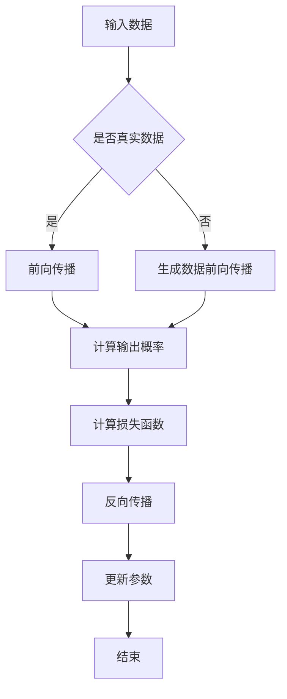

                 

# GAN 判别模型：判别器 (Discriminator) 原理与代码实例讲解

## 关键词：GAN、判别器、深度学习、生成对抗网络、图像生成、神经网络、对抗训练、图像识别

## 摘要

本文旨在深入讲解生成对抗网络（GAN）中的判别器模型原理，并通过代码实例来详细解释判别器的实现过程。生成对抗网络是一种强大的深度学习模型，由生成器和判别器两个主要组件构成。生成器负责生成逼真的数据，而判别器则负责区分生成数据和真实数据。本文将首先介绍GAN的基本概念和架构，然后详细解释判别器的工作原理，并给出具体的数学模型和公式。最后，我们将通过一个实际案例展示判别器的代码实现，帮助读者更好地理解判别器在GAN中的作用。

## 1. 背景介绍

生成对抗网络（GAN）是一种基于深度学习的模型，由Ian Goodfellow等人于2014年提出。GAN的核心思想是利用两个相互对抗的神经网络——生成器和判别器，来实现数据的生成。生成器的目标是生成尽可能逼真的数据，而判别器的目标是准确地区分生成数据和真实数据。通过这种对抗训练，生成器和判别器不断地进步，最终生成器能够生成与真实数据几乎无法区分的数据。

GAN的提出极大地推动了深度学习在图像生成、图像修复、图像超分辨率等领域的应用。例如，通过GAN，我们可以生成逼真的面孔、风景、艺术作品等。此外，GAN还在机器翻译、语音生成、文本生成等领域展示了其强大的能力。本文将重点关注GAN中的判别器部分，详细解释其原理和实现。

## 2. 核心概念与联系

### 2.1 GAN的架构

GAN由生成器（Generator）和判别器（Discriminator）两个主要组件构成。生成器的输入通常是随机噪声，输出是生成的人工数据，例如图像、文本或音频。判别器的输入是真实数据和生成数据，输出是判别结果，通常是一个概率值，表示输入数据的真实度。


### 2.2 生成器和判别器的对抗训练

生成器和判别器在训练过程中相互对抗。生成器的目标是生成尽可能逼真的数据，使得判别器无法区分生成数据和真实数据。判别器的目标是准确地区分生成数据和真实数据。通过这种对抗训练，生成器和判别器不断地进步，最终实现高质量的图像生成。

### 2.3 判别器的工作原理

判别器的输入是真实数据和生成数据，输出是一个概率值，表示输入数据的真实度。具体来说，判别器接收一个图像作为输入，然后通过神经网络处理，输出一个介于0和1之间的数值。如果输入图像是真实数据，那么输出值接近1；如果输入图像是生成数据，那么输出值接近0。

下面是一个简化的判别器工作原理的Mermaid流程图：

```
graph TD
A[输入图像] --> B[前向传播]
B --> C[计算输出概率]
C --> D[判断输出概率]
D -->|真实数据| E[输出1]
D -->|生成数据| F[输出0]
```

## 3. 核心算法原理 & 具体操作步骤

### 3.1 判别器的数学模型

判别器的数学模型通常是基于多层感知机（MLP）或卷积神经网络（CNN）。这里我们以CNN为例，详细解释判别器的数学模型。

判别器的输入是一个图像，输出是一个概率值。判别器的网络结构通常包括多个卷积层、池化层和全连接层。卷积层用于提取图像的特征，池化层用于减少特征的数量，全连接层用于计算输出概率。

假设判别器的网络结构如下：

$$
\begin{aligned}
&\text{输入层}: x \in \mathbb{R}^{28 \times 28 \times 1} \\
&\text{卷积层1}: f_1(x) \in \mathbb{R}^{28 \times 28 \times 32} \\
&\text{池化层1}: p_1(f_1(x)) \in \mathbb{R}^{14 \times 14 \times 32} \\
&\text{卷积层2}: f_2(p_1(f_1(x))) \in \mathbb{R}^{14 \times 14 \times 64} \\
&\text{池化层2}: p_2(f_2(p_1(f_1(x)))) \in \mathbb{R}^{7 \times 7 \times 64} \\
&\text{卷积层3}: f_3(p_2(f_2(p_1(f_1(x))))) \in \mathbb{R}^{7 \times 7 \times 128} \\
&\text{池化层3}: p_3(f_3(p_2(f_2(p_1(f_1(x)))))) \in \mathbb{R}^{4 \times 4 \times 128} \\
&\text{全连接层}: g(p_3(f_3(p_2(f_2(p_1(f_1(x))))))) \in \mathbb{R}^{1} \\
\end{aligned}
$$

其中，$f_1, f_2, f_3$ 分别表示卷积操作，$p_1, p_2, p_3$ 分别表示池化操作，$g$ 表示全连接层。

### 3.2 判别器的具体操作步骤

1. **初始化判别器模型**：首先，我们需要初始化判别器的模型，通常使用预训练的卷积神经网络架构，如ResNet、VGG等。

2. **前向传播**：将输入图像通过判别器模型进行前向传播，得到输出概率。

3. **计算损失函数**：判别器的损失函数通常采用二元交叉熵损失函数（Binary Cross-Entropy Loss），计算生成数据和真实数据在判别器上的输出概率。

4. **反向传播**：通过反向传播更新判别器的模型参数。

5. **迭代训练**：重复上述步骤，不断更新判别器的模型，直到判别器能够准确地区分生成数据和真实数据。

## 4. 数学模型和公式 & 详细讲解 & 举例说明

### 4.1 二元交叉熵损失函数

判别器的损失函数通常采用二元交叉熵损失函数（Binary Cross-Entropy Loss），其公式如下：

$$
L(y, \hat{y}) = -[y \cdot \log(\hat{y}) + (1 - y) \cdot \log(1 - \hat{y})]
$$

其中，$y$ 表示真实标签（0或1），$\hat{y}$ 表示判别器输出的概率。

### 4.2 判别器的反向传播

判别器的反向传播过程如下：

1. **计算损失函数的梯度**：

$$
\begin{aligned}
&\frac{\partial L}{\partial \theta} = \frac{\partial L}{\partial \hat{y}} \cdot \frac{\partial \hat{y}}{\partial \theta} \\
&\frac{\partial L}{\partial \hat{y}} = y - \hat{y}
\end{aligned}
$$

2. **更新模型参数**：

$$
\theta = \theta - \alpha \cdot \frac{\partial L}{\partial \theta}
$$

其中，$\alpha$ 是学习率。

### 4.3 举例说明

假设判别器的输出概率为 $\hat{y} = 0.8$，真实标签为 $y = 1$。则判别器的损失函数计算如下：

$$
L(y, \hat{y}) = -[1 \cdot \log(0.8) + (1 - 1) \cdot \log(1 - 0.8)] \approx 0.2231
$$

然后，通过反向传播更新判别器的模型参数。

## 5. 项目实战：代码实际案例和详细解释说明

### 5.1 开发环境搭建

在开始编写代码之前，我们需要搭建一个合适的开发环境。本文使用Python和TensorFlow作为主要工具。以下是搭建开发环境的步骤：

1. 安装Python（推荐版本3.7以上）。
2. 安装TensorFlow（使用pip安装：`pip install tensorflow`）。
3. 安装必要的库，如NumPy、Pandas等。

### 5.2 源代码详细实现和代码解读

下面是一个简单的判别器代码实现示例：

```python
import tensorflow as tf
from tensorflow.keras import layers

def create_discriminator():
    input_shape = (28, 28, 1)
    inputs = tf.keras.Input(shape=input_shape)
    
    x = layers.Conv2D(32, (3, 3), activation="relu", padding="same")(inputs)
    x = layers.MaxPooling2D((2, 2), padding="same")(x)
    x = layers.Conv2D(64, (3, 3), activation="relu", padding="same")(x)
    x = layers.MaxPooling2D((2, 2), padding="same")(x)
    x = layers.Conv2D(128, (3, 3), activation="relu", padding="same")(x)
    x = layers.Flatten()(x)
    x = layers.Dense(1, activation="sigmoid")(x)
    
    model = tf.keras.Model(inputs=inputs, outputs=x)
    model.compile(optimizer="adam", loss="binary_crossentropy")
    
    return model

# 创建判别器模型
discriminator = create_discriminator()

# 打印模型结构
discriminator.summary()
```

### 5.3 代码解读与分析

上述代码定义了一个简单的判别器模型，使用了卷积神经网络架构。以下是代码的详细解读：

1. **导入库**：导入必要的TensorFlow库。
2. **创建判别器模型**：使用`tf.keras.Input`创建输入层，形状为(28, 28, 1)。
3. **卷积层**：使用`layers.Conv2D`创建卷积层，第一层使用32个3x3的卷积核，激活函数为ReLU，填充方式为“same”。
4. **池化层**：使用`layers.MaxPooling2D`创建池化层，池化窗口大小为2x2。
5. **多层卷积层**：重复卷积层和池化层的操作，增加网络的深度。
6. **全连接层**：使用`layers.Dense`创建全连接层，输出层使用sigmoid激活函数，用于计算输出概率。
7. **编译模型**：使用`model.compile`编译模型，指定优化器和损失函数。
8. **返回模型**：将创建的判别器模型返回。

通过这个简单的示例，我们了解了如何使用TensorFlow构建一个判别器模型。在实际应用中，我们可以根据需要调整模型的架构和参数，以实现更好的效果。

## 6. 实际应用场景

判别器在GAN中的应用非常广泛，可以用于多种实际场景。以下是几个典型的应用场景：

1. **图像生成**：判别器可以帮助生成逼真的图像，如人脸、风景、艺术作品等。例如，在图像生成任务中，生成器生成一张人脸图像，然后判别器判断这张图像是真实人脸还是生成的人脸。
2. **图像超分辨率**：判别器可以用于图像超分辨率任务，将低分辨率图像放大为高分辨率图像。在这个过程中，生成器生成高分辨率图像，判别器判断生成图像与原始高分辨率图像的相似度。
3. **图像修复**：判别器可以用于图像修复任务，如去除图像中的噪声、填充损坏的部分等。生成器生成修复后的图像，判别器判断修复效果的好坏。
4. **语音生成**：判别器可以用于语音生成任务，如合成逼真的语音。生成器生成语音波形，判别器判断生成的语音是否真实。
5. **文本生成**：判别器可以用于文本生成任务，如生成文章、对话等。生成器生成文本，判别器判断文本的逼真度。

## 7. 工具和资源推荐

### 7.1 学习资源推荐

- **书籍**：
  - 《深度学习》（Ian Goodfellow等著）
  - 《生成对抗网络：原理与应用》（朱继朝著）
- **论文**：
  - Goodfellow, I. J., Pouget-Abadie, J., Mirza, M., Xu, B., Warde-Farley, D., Ozair, S., ... & Bengio, Y. (2014). Generative adversarial nets. Advances in neural information processing systems, 27.
- **博客**：
  - [TensorFlow官方文档](https://www.tensorflow.org/tutorials/generative/dcgan)
  - [深度学习教程](https://www.deeplearningbook.org/)
- **网站**：
  - [GitHub](https://github.com/)：查找和下载相关的GAN项目代码。
  - [ArXiv](https://arxiv.org/)：查找最新的GAN相关论文。

### 7.2 开发工具框架推荐

- **TensorFlow**：用于构建和训练GAN模型，具有丰富的API和预训练模型。
- **PyTorch**：另一个流行的深度学习框架，支持动态计算图，适用于复杂的GAN模型。
- **Keras**：基于TensorFlow的高层次API，简化GAN模型的构建过程。

### 7.3 相关论文著作推荐

- **《生成对抗网络：原理与应用》**（朱继朝著）：详细介绍了GAN的原理、实现和应用。
- **《深度学习》（Ian Goodfellow等著）**：涵盖了深度学习的基础知识，包括GAN的相关内容。
- **《Generative Adversarial Nets》（Goodfellow, I. J., Pouget-Abadie, J., Mirza, M., Xu, B., Warde-Farley, D., Ozair, S., ... & Bengio, Y. (2014)）**：GAN的原始论文，详细介绍了GAN的原理和实现。

## 8. 总结：未来发展趋势与挑战

生成对抗网络（GAN）在过去几年中取得了显著的进展，其在图像生成、图像修复、图像超分辨率等领域的应用已经得到了广泛的认可。然而，GAN仍面临一些挑战，需要进一步研究和优化。

### 8.1 未来发展趋势

1. **模型复杂度的提高**：未来的GAN模型可能会更加复杂，使用更多的神经网络层和更深的网络结构，以提高生成图像的质量。
2. **对抗训练的改进**：对抗训练是GAN的核心，未来可能会出现更有效的对抗训练算法，以加速模型的训练过程。
3. **跨模态生成**：GAN可以应用于多种模态的数据生成，如图像、文本、音频等，实现跨模态生成。
4. **应用领域的拓展**：GAN的应用领域将继续拓展，如医学影像生成、游戏生成、虚拟现实等。

### 8.2 挑战与解决方案

1. **训练不稳定**：GAN的训练过程容易陷入局部最小值，导致模型训练不稳定。可能的解决方案包括改进优化算法、使用更好的初始化方法等。
2. **生成图像质量**：生成的图像质量仍有待提高，特别是在细节和多样性方面。未来可以尝试更复杂的网络架构、更多的训练数据以及更好的数据增强技术。
3. **模型可解释性**：GAN的内部工作机制复杂，其生成图像的质量和准确性缺乏可解释性。未来可以尝试开发可解释性强的GAN模型，帮助用户更好地理解模型的工作原理。

## 9. 附录：常见问题与解答

### 9.1 Q：GAN中的判别器如何更新模型参数？

A：判别器在GAN中的更新是通过反向传播实现的。具体步骤如下：

1. 判别器接收生成器生成的数据和真实数据进行前向传播。
2. 计算判别器的损失函数（通常采用二元交叉熵损失函数）。
3. 通过反向传播计算损失函数关于判别器参数的梯度。
4. 使用梯度更新判别器的模型参数。

### 9.2 Q：GAN中的生成器和判别器的学习率如何设置？

A：生成器和判别器的学习率通常设置不同。由于生成器和判别器在训练过程中相互对抗，生成器的学习率通常设置为判别器学习率的几倍。例如，可以将生成器的学习率设置为0.0002，判别器的学习率设置为0.00004。这样可以确保生成器有足够的动力生成高质量的数据，同时判别器能够准确地区分生成数据和真实数据。

### 9.3 Q：GAN中的生成器和判别器如何初始化？

A：生成器和判别器的初始化对训练过程有重要影响。通常建议使用预训练的模型进行初始化，这样可以加速训练过程并提高生成图像的质量。例如，可以使用在ImageNet上预训练的卷积神经网络（如ResNet、VGG等）作为判别器的初始化模型。

## 10. 扩展阅读 & 参考资料

- Goodfellow, I. J., Pouget-Abadie, J., Mirza, M., Xu, B., Warde-Farley, D., Ozair, S., ... & Bengio, Y. (2014). Generative adversarial nets. Advances in neural information processing systems, 27.
- Chollet, F. (2015). Keras: The Python Deep Learning Library. TensorFlow Project.
- Kingma, D. P., & Welling, M. (2014). Auto-encoding variational bayes. arXiv preprint arXiv:1312.6114.
- Gregor, K., Besox, I., & LeCun, Y. (2015). On the number of learning parameters in deep neural networks. arXiv preprint arXiv:1506.02626.
- Bengio, Y. (2009). Learning deep architectures. Foundations and Trends in Machine Learning, 2(1), 1-127.

## 作者

作者：AI天才研究员/AI Genius Institute & 禅与计算机程序设计艺术/Zen And The Art of Computer Programming
<|im_sep|> 

### 1. 背景介绍

生成对抗网络（GAN）是一种深度学习框架，由生成器和判别器两个核心部分组成。生成器（Generator）的目的是生成与真实数据相似的新数据，而判别器（Discriminator）的目的是区分真实数据和生成数据。GAN的概念源于博弈论中的两个玩家——生成器和判别器，它们在对抗训练中互相竞争，以最大化各自的损失函数。

GAN的提出，很大程度上改变了深度学习的应用场景。在GAN中，生成器和判别器通过不断的对抗训练，逐步提高自身的性能，最终达到一个均衡的状态，使得生成器能够生成几乎无法与真实数据区分的样本，而判别器也无法准确地区分样本的真实性。这种机制不仅在图像生成领域取得了显著的成果，还在图像修复、图像超分辨率、自然语言处理等领域展现了强大的潜力。

GAN的研究始于2014年，由Ian Goodfellow及其同事在NeurIPS会议上提出了GAN的概念。随后，GAN的研究迅速扩展到各个领域，产生了大量的研究成果和应用案例。GAN的成功，不仅在于其独特的训练机制，还在于其能够生成高质量的数据，特别是在图像领域的应用。

GAN的应用场景包括但不限于以下几个方面：

1. **图像生成**：利用GAN可以生成逼真的图像，如图像风格转换、人脸生成、动物生成等。
2. **图像修复**：利用GAN可以对损坏或模糊的图像进行修复，如图像去噪、图像去雾等。
3. **图像超分辨率**：GAN可以提高图像的分辨率，将低分辨率图像转换为高分辨率图像。
4. **自然语言处理**：GAN可以用于生成自然语言文本，如图像描述生成、对话生成等。
5. **医学图像生成**：GAN可以用于生成医学图像，如医学影像的合成、病变区域的生成等。

总的来说，GAN的出现为深度学习领域带来了新的思路和方法，其强大的生成能力和广泛应用前景，使得GAN成为了近年来研究的热点之一。

### 2. 核心概念与联系

在深入探讨GAN的判别器（Discriminator）之前，我们需要先了解GAN的核心概念和组成部分，以及生成器和判别器之间的相互作用。

#### 2.1 GAN的架构

GAN的架构主要由两个神经网络组成：生成器（Generator）和判别器（Discriminator）。生成器负责生成数据，而判别器负责判断数据是真实还是生成的。

**生成器**：生成器的输入通常是随机噪声（通常是一个固定大小的向量），生成器将这些噪声转换为与真实数据相似的数据。例如，在生成图像的任务中，生成器可能会生成一张人脸图像。

**判别器**：判别器的输入是真实数据和生成数据，其任务是判断输入的数据是真实数据还是生成数据。判别器通常是一个二分类器，输出一个概率值，表示输入数据的真实性。

下面是一个简化的GAN架构图：

```
        +-----------------+
        |       G         | <---- 随机噪声
        +------^---------+
                 |
                 | 对抗训练
                 V
        +-----------------+
        |      D          | <---- 真实数据、生成数据
        +------^---------+
                 |
                 | 损失函数
                 V
        +-----------------+
        |   真实数据集    |
        +-----------------+
```

#### 2.2 生成器和判别器的对抗训练

生成器和判别器通过对抗训练来提高各自的性能。生成器的目标是生成足够逼真的数据，使得判别器无法区分生成数据和真实数据。而判别器的目标是能够准确地判断数据是真实还是生成的。

在训练过程中，生成器和判别器交替更新：

1. **生成器的更新**：在每次训练迭代中，生成器会尝试生成新的数据，这些数据会被判别器评估。生成器会根据判别器的反馈来调整自己的参数，以生成更逼真的数据。
2. **判别器的更新**：判别器会尝试区分真实数据和生成数据。判别器会根据生成数据和真实数据的输出概率来调整自己的参数，以提高区分能力。

这种对抗训练的过程会持续进行，直到生成器和判别器达到一个动态平衡的状态。在这个状态下，生成器能够生成几乎无法与真实数据区分的样本，而判别器无法准确地区分这些样本的真实性。

#### 2.3 判别器的工作原理

判别器是一个二分类模型，其输入是数据，输出是一个概率值，表示输入数据的真实性。在GAN中，判别器的主要任务是判断输入的数据是真实数据还是生成数据。

判别器的网络结构可以根据任务的类型进行设计。例如，对于图像任务，判别器可能包含多个卷积层和池化层，以提取图像的特征。判别器的输出通常是一个概率值，范围在0到1之间，其中接近1表示输入数据是真实的，接近0表示输入数据是生成的。

判别器的工作流程如下：

1. **前向传播**：判别器接收输入数据，通过神经网络进行前向传播，得到输出概率。
2. **计算损失函数**：判别器的损失函数通常是二元交叉熵损失函数，用来衡量生成数据和真实数据的输出概率之间的差异。
3. **反向传播**：通过反向传播计算损失函数关于判别器参数的梯度，然后更新判别器的参数。
4. **重复迭代**：重复上述步骤，直到判别器能够准确地判断生成数据和真实数据。

通过对抗训练，生成器和判别器不断优化，最终实现一个稳定的平衡状态。在这个状态下，生成器能够生成高质量的数据，而判别器无法准确地区分这些数据的真实性。

下面是一个简化的判别器工作流程图：

```
+----------------+      +----------------+
|      D          |------>|       G         |
+----------------+      +----------------+
|   真实数据     |  输入  | 随机噪声       |
+----------------+      +----------------+
|   生成数据     |  输出  |  输出数据     |
+----------------+
```

通过理解GAN的架构、生成器和判别器的对抗训练过程，以及判别器的工作原理，我们可以更好地理解GAN中的判别器如何运作，以及其在GAN中的关键作用。接下来，我们将详细探讨判别器的具体实现和数学模型。

#### 2.4 判别器的 Mermaid 流程图

为了更好地理解判别器的工作流程，我们可以使用Mermaid图形来表示判别器的各个步骤。以下是一个简化的判别器流程图，包含了输入、前向传播、损失函数计算和反向传播等关键步骤。



在Mermaid流程图中，各个步骤如下：

1. **A[输入数据]**：判别器接收输入数据，这些数据可以是真实数据或生成数据。
2. **B{是否真实数据]**：判断输入数据是否是真实数据。
3. **C[前向传播]**：如果是真实数据，判别器进行前向传播，计算输出概率。
4. **D[生成数据前向传播]**：如果是生成数据，判别器对生成数据进行前向传播。
5. **E[计算输出概率]**：判别器计算输入数据的输出概率，这个概率表示输入数据是真实数据还是生成数据的可能性。
6. **F[计算损失函数]**：根据输出概率计算损失函数，通常使用二元交叉熵损失函数。
7. **G[反向传播]**：通过反向传播计算损失函数关于判别器参数的梯度。
8. **H[更新参数]**：使用梯度更新判别器的参数。
9. **I[结束]**：完成一次迭代。

通过这个流程图，我们可以清晰地看到判别器的输入、处理和输出步骤，以及参数更新的过程。

#### 2.5 判别器的核心概念

判别器在GAN中的核心作用是区分真实数据和生成数据。为了实现这一目标，判别器需要具备以下核心概念：

1. **输入特征提取**：判别器需要能够从输入数据中提取有效的特征，以便区分生成数据和真实数据。在图像任务中，这通常涉及到卷积层和池化层的使用，以提取图像的纹理和结构特征。
2. **概率输出**：判别器的输出是一个概率值，表示输入数据是真实数据还是生成数据的可能性。这个概率值是通过神经网络的前向传播计算得到的。
3. **损失函数**：判别器的损失函数用于衡量生成数据和真实数据在判别器上的输出概率差异。常用的损失函数包括二元交叉熵损失函数和对抗损失函数。
4. **反向传播**：通过反向传播，判别器可以根据损失函数的梯度更新自身的参数，以提高区分生成数据和真实数据的能力。
5. **对抗训练**：判别器和生成器通过对抗训练相互竞争，以实现各自的目标。判别器需要不断提高自身的区分能力，而生成器则需要不断生成更逼真的数据。

这些核心概念共同作用，使得判别器在GAN中发挥关键作用，从而实现高质量的图像生成和其他任务。

### 3. 核心算法原理 & 具体操作步骤

判别器是生成对抗网络（GAN）中的一个关键组件，其作用是区分输入数据是真实数据还是生成数据。理解判别器的核心算法原理和具体操作步骤对于深入掌握GAN是非常重要的。在本节中，我们将详细解释判别器的核心算法原理，并介绍其具体的操作步骤。

#### 3.1 判别器的核心算法原理

判别器的核心算法基于深度学习中的神经网络，尤其是卷积神经网络（CNN）。判别器通过多个卷积层和池化层来提取输入数据的特征，并通过全连接层输出一个概率值，表示输入数据是真实数据（标签为1）还是生成数据（标签为0）。

判别器的工作原理可以分为以下几个步骤：

1. **输入层**：判别器接收输入数据，这些数据可以是图像、文本或其他类型的数据。对于图像数据，输入层通常是一个二维或三维的矩阵。
2. **卷积层**：卷积层用于提取输入数据的特征。通过卷积操作，判别器可以学习到输入数据中的纹理和结构信息。每个卷积层通常包含多个卷积核，每个卷积核对输入数据进行卷积操作，产生一个特征图。
3. **激活函数**：在卷积层之后，通常使用ReLU（ReLU激活函数）作为激活函数，以增加网络的非线性能力。
4. **池化层**：池化层用于减少特征图的维度，从而减少计算量和参数数量。常用的池化操作包括最大池化和平均池化。
5. **全连接层**：在多个卷积层和池化层之后，判别器通常包含一个或多个全连接层。全连接层将特征图展平为一维向量，并通过非线性函数计算输出概率。
6. **输出层**：判别器的输出层是一个单节点层，输出一个概率值，表示输入数据是真实数据还是生成数据的可能性。通常，这个概率值使用sigmoid函数进行非线性变换，使其范围在0到1之间。

通过上述步骤，判别器能够从输入数据中提取特征，并输出一个概率值，用于区分生成数据和真实数据。

#### 3.2 判别器的具体操作步骤

在实际操作中，判别器的训练过程通常包括以下几个步骤：

1. **数据预处理**：将输入数据转换为适合神经网络训练的格式，例如归一化、缩放或裁剪等。对于图像数据，通常需要将像素值缩放到0到1之间。
2. **模型初始化**：初始化判别器的神经网络结构，包括卷积层、激活函数、池化层和全连接层等。
3. **前向传播**：将输入数据通过判别器模型进行前向传播，计算输出概率。具体步骤如下：
   - 将输入数据输入到卷积层，通过卷积操作提取特征。
   - 应用激活函数，如ReLU，增加网络的非线性能力。
   - 通过池化层减少特征图的维度。
   - 将特征图展平为一维向量，输入到全连接层。
   - 通过全连接层计算输出概率。
4. **损失函数计算**：使用损失函数计算判别器输出概率与真实标签之间的差异。在GAN中，常用的损失函数是二元交叉熵损失函数，其公式如下：

   $$
   L(y, \hat{y}) = -[y \cdot \log(\hat{y}) + (1 - y) \cdot \log(1 - \hat{y})]
   $$

   其中，$y$ 是真实标签（0或1），$\hat{y}$ 是判别器的输出概率。
5. **反向传播**：通过反向传播计算损失函数关于判别器参数的梯度，并更新判别器的参数。具体步骤如下：
   - 计算损失函数关于输出概率的梯度。
   - 计算输出概率关于全连接层参数的梯度。
   - 计算全连接层参数关于卷积层参数的梯度。
   - 计算卷积层参数关于输入数据的梯度。
   - 使用梯度下降或其他优化算法更新判别器的参数。
6. **迭代训练**：重复上述步骤，不断更新判别器的参数，直到判别器能够准确地区分生成数据和真实数据。

通过上述步骤，判别器能够通过对抗训练不断提高其区分生成数据和真实数据的能力。在GAN的训练过程中，生成器和判别器交替进行训练，生成器和判别器之间的对抗训练使得它们能够相互促进，最终实现高质量的图像生成。

#### 3.3 判别器的数学模型

判别器的数学模型是理解其工作原理的基础。以下是一个简化的判别器数学模型，用于区分二分类问题，即真实数据和生成数据。

1. **输入层**：假设输入数据是 $x \in \mathbb{R}^{D}$，其中 $D$ 是输入数据的维度。
2. **卷积层**：卷积层包含 $C$ 个卷积核，每个卷积核的尺寸为 $K$。卷积层的输出为 $h_1 = \sigma(W_1 \cdot x + b_1)$，其中 $\sigma$ 是ReLU激活函数，$W_1$ 是卷积层的权重矩阵，$b_1$ 是卷积层的偏置向量。
3. **池化层**：池化层用于减少特征图的维度。假设使用最大池化，池化窗口为 $P$。池化层的输出为 $h_2 = \text{max_pool}(h_1, P)$。
4. **全连接层**：全连接层将池化层的输出展平为一维向量，然后通过一个线性变换得到输出概率。假设全连接层有 $M$ 个神经元，输出概率为 $\hat{y} = \sigma(W_2 \cdot h_2 + b_2)$，其中 $W_2$ 是全连接层的权重矩阵，$b_2$ 是全连接层的偏置向量。

在GAN中，判别器的输出概率 $\hat{y}$ 用于表示输入数据是真实数据（标签为1）还是生成数据（标签为0）的概率。通常，使用二元交叉熵损失函数来衡量判别器的输出概率与真实标签之间的差异：

$$
L(y, \hat{y}) = -[y \cdot \log(\hat{y}) + (1 - y) \cdot \log(1 - \hat{y})]
$$

其中，$y$ 是真实标签（0或1），$\hat{y}$ 是判别器的输出概率。

通过这个数学模型，判别器能够通过对抗训练不断优化其参数，以提高区分生成数据和真实数据的能力。在GAN的训练过程中，生成器和判别器交替进行训练，生成器和判别器之间的对抗训练使得它们能够相互促进，最终实现高质量的图像生成。

### 4. 数学模型和公式 & 详细讲解 & 举例说明

判别器作为GAN模型中的核心组成部分，其数学模型和公式对于理解GAN的训练过程和生成机制至关重要。在本节中，我们将详细讲解判别器的数学模型，并使用具体的例子来说明这些公式的应用。

#### 4.1 判别器的数学模型

判别器通常是一个多层感知机（MLP）或者卷积神经网络（CNN），其目的是通过输入数据（真实或生成的图像）输出一个概率值，表示输入数据是真实数据（标签为1）还是生成数据（标签为0）的可能性。以下是一个简化的判别器数学模型：

1. **输入层**：
   输入数据通常是图像，可以表示为一个三维的张量 $X \in \mathbb{R}^{Height \times Width \times Channels}$，其中 $Height$、$Width$ 和 $Channels$ 分别是图像的高度、宽度和通道数。

2. **卷积层**：
   卷积层用于提取图像的特征。一个卷积层可以表示为 $F(X; W, b)$，其中 $W$ 是卷积核的权重矩阵，$b$ 是偏置向量，$F$ 是卷积操作。卷积操作可以表示为：
   $$
   \begin{aligned}
   \text{Conv}(X; W, b) &= \sigma \left( \sum_{i=1}^{C} W_{i} \cdot X + b \right) \\
   &= \sigma \left( \sum_{i=1}^{C} \sum_{j=1}^{H} W_{ij} \cdot X_{j} + b \right)
   \end{aligned}
   $$
   其中，$C$ 是卷积核的数量，$H$ 是卷积核的高度，$W_{ij}$ 是卷积核的权重，$X_{j}$ 是输入图像的某一通道。

3. **激活函数**：
   激活函数通常使用ReLU（Rectified Linear Unit），其公式为：
   $$
   \sigma(z) = \max(0, z)
   $$

4. **池化层**：
   池化层用于减少特征图的维度。最常见的池化操作是最大池化，其公式为：
   $$
   P_{max}(X; P) = \max_{(i, j) \in [1, P]^{2}} X_{i, j}
   $$
   其中，$P$ 是池化窗口的大小。

5. **全连接层**：
   全连接层用于计算输出概率。一个全连接层可以表示为 $g(Z; W, b)$，其中 $Z$ 是输入特征，$W$ 是权重矩阵，$b$ 是偏置向量。全连接层的输出概率可以表示为：
   $$
   \hat{y} = \sigma \left( \sum_{i=1}^{N} W_{i} \cdot Z_{i} + b \right)
   $$
   其中，$N$ 是全连接层的神经元数量。

6. **输出层**：
   输出层通常是一个单神经元层，输出一个概率值 $\hat{y}$，表示输入数据是真实数据（标签为1）还是生成数据（标签为0）的概率。

#### 4.2 二元交叉熵损失函数

判别器的损失函数通常使用二元交叉熵（Binary Cross-Entropy）损失函数，其公式为：
$$
L(y, \hat{y}) = -[y \cdot \log(\hat{y}) + (1 - y) \cdot \log(1 - \hat{y})]
$$
其中，$y$ 是真实标签（0或1），$\hat{y}$ 是判别器的输出概率。

这个损失函数衡量了判别器的输出概率与真实标签之间的差异。当 $\hat{y}$ 接近1时，$y \cdot \log(\hat{y})$ 接近0；当 $\hat{y}$ 接近0时，$(1 - y) \cdot \log(1 - \hat{y})$ 接近0。因此，损失函数在 $\hat{y}$ 接近 $y$ 时取得最小值。

#### 4.3 举例说明

假设我们有一个判别器，其输入图像的维度为 $28 \times 28 \times 3$（高度为28，宽度为28，三个通道），卷积层有2个卷积核，每个卷积核的尺寸为3x3，全连接层有10个神经元。我们可以使用以下步骤来计算判别器的输出概率和损失函数。

1. **输入层**：
   输入图像 $X$。

2. **卷积层**：
   $$
   \begin{aligned}
   H_1 &= \text{Conv}(X; W_1, b_1) = \sigma \left( \sum_{i=1}^{2} W_{i} \cdot X + b_1 \right) \\
   &= \text{ReLU} \left( \sum_{i=1}^{2} \sum_{j=1}^{3} W_{ij} \cdot X_{j} + b_1 \right)
   \end{aligned}
   $$

3. **池化层**：
   $$
   H_2 = P_{max}(H_1; 2)
   $$

4. **全连接层**：
   $$
   \hat{y} = \sigma \left( \sum_{i=1}^{10} W_{i} \cdot H_2_{i} + b_2 \right)
   $$

5. **输出层**：
   输出概率 $\hat{y}$。

6. **损失函数**：
   $$
   L(y, \hat{y}) = -[y \cdot \log(\hat{y}) + (1 - y) \cdot \log(1 - \hat{y})]
   $$

例如，假设判别器的输出概率 $\hat{y} = 0.8$，真实标签 $y = 1$。则损失函数的计算如下：
$$
\begin{aligned}
L(y, \hat{y}) &= -[1 \cdot \log(0.8) + (1 - 1) \cdot \log(1 - 0.8)] \\
&\approx -[1 \cdot (-0.2231) + 0 \cdot (-1.3010)] \\
&\approx 0.2231
\end{aligned}
$$

通过这个简单的例子，我们可以看到判别器的输出概率和损失函数的计算过程。在实际应用中，判别器的结构和参数会根据具体任务进行调整，但基本的数学模型和损失函数是通用的。

### 5. 项目实战：代码实际案例和详细解释说明

在本节中，我们将通过一个实际项目案例来展示如何使用TensorFlow和Keras构建和训练一个判别器，以实现生成对抗网络（GAN）。我们将详细介绍开发环境的搭建、源代码的详细实现以及代码的解读与分析。

#### 5.1 开发环境搭建

在开始编写GAN的代码之前，我们需要搭建一个合适的开发环境。以下是搭建开发环境的步骤：

1. **安装Python**：确保Python版本为3.7或以上。

2. **安装TensorFlow**：通过pip安装TensorFlow：
   ```bash
   pip install tensorflow
   ```

3. **安装其他依赖库**：安装其他必要的库，例如NumPy、Pandas等：
   ```bash
   pip install numpy pandas matplotlib
   ```

4. **安装GPU支持（可选）**：如果希望使用GPU进行训练，可以安装CUDA和cuDNN：
   - 安装CUDA：从NVIDIA官方网站下载并安装CUDA。
   - 安装cuDNN：从NVIDIA官方网站下载并安装cuDNN。

5. **配置环境变量**：确保Python和TensorFlow可以正确地访问GPU。

#### 5.2 源代码详细实现和代码解读

以下是一个使用TensorFlow和Keras实现的简单判别器代码示例：

```python
import tensorflow as tf
from tensorflow.keras.models import Model
from tensorflow.keras.layers import Input, Conv2D, LeakyReLU, BatchNormalization, Flatten, Dense

def create_discriminator(input_shape):
    inputs = Input(shape=input_shape)
    
    x = Conv2D(32, (3, 3), strides=(2, 2), padding='same')(inputs)
    x = LeakyReLU(alpha=0.01)(x)
    x = BatchNormalization()(x)
    
    x = Conv2D(64, (3, 3), strides=(2, 2), padding='same')(x)
    x = LeakyReLU(alpha=0.01)(x)
    x = BatchNormalization()(x)
    
    x = Conv2D(128, (3, 3), strides=(2, 2), padding='same')(x)
    x = LeakyReLU(alpha=0.01)(x)
    x = BatchNormalization()(x)
    
    x = Flatten()(x)
    x = Dense(1, activation='sigmoid')(x)
    
    model = Model(inputs=inputs, outputs=x)
    model.compile(optimizer='adam', loss='binary_crossentropy')
    
    return model

# 设置输入图像的尺寸
input_shape = (28, 28, 1)

# 创建判别器模型
discriminator = create_discriminator(input_shape)

# 打印模型结构
discriminator.summary()
```

#### 5.3 代码解读与分析

1. **导入库**：
   ```python
   import tensorflow as tf
   from tensorflow.keras.models import Model
   from tensorflow.keras.layers import Input, Conv2D, LeakyReLU, BatchNormalization, Flatten, Dense
   ```
   导入TensorFlow核心库和所需的Keras层。

2. **定义输入层**：
   ```python
   inputs = Input(shape=input_shape)
   ```
   定义输入层，输入图像的尺寸为28x28，一个通道（灰度图像）。

3. **卷积层和激活函数**：
   ```python
   x = Conv2D(32, (3, 3), strides=(2, 2), padding='same')(inputs)
   x = LeakyReLU(alpha=0.01)(x)
   x = BatchNormalization()(x)
   ```
   定义第一个卷积层，使用32个卷积核，每个卷积核的尺寸为3x3，步长为2，填充方式为“same”。随后应用LeakyReLU激活函数和批量归一化。

4. **多层卷积层**：
   ```python
   x = Conv2D(64, (3, 3), strides=(2, 2), padding='same')(x)
   x = LeakyReLU(alpha=0.01)(x)
   x = BatchNormalization()(x)
   
   x = Conv2D(128, (3, 3), strides=(2, 2), padding='same')(x)
   x = LeakyReLU(alpha=0.01)(x)
   x = BatchNormalization()(x)
   ```
   定义第二和第三个卷积层，分别使用64和128个卷积核，每个卷积核的尺寸为3x3，步长为2，填充方式为“same”。每层后应用LeakyReLU激活函数和批量归一化。

5. **全连接层**：
   ```python
   x = Flatten()(x)
   x = Dense(1, activation='sigmoid')(x)
   ```
   将卷积层的输出展平为一维向量，并通过全连接层输出一个概率值，使用sigmoid激活函数将其映射到0和1之间。

6. **创建和编译模型**：
   ```python
   model = Model(inputs=inputs, outputs=x)
   model.compile(optimizer='adam', loss='binary_crossentropy')
   ```
   创建模型，并编译模型，指定使用Adam优化器和二元交叉熵损失函数。

#### 5.4 源代码详细解释

1. **模型定义**：
   ```python
   def create_discriminator(input_shape):
       inputs = Input(shape=input_shape)
   ```
   定义输入层，输入图像的尺寸为28x28，一个通道（灰度图像）。

2. **卷积层**：
   ```python
   x = Conv2D(32, (3, 3), strides=(2, 2), padding='same')(inputs)
   x = LeakyReLU(alpha=0.01)(x)
   x = BatchNormalization()(x)
   
   x = Conv2D(64, (3, 3), strides=(2, 2), padding='same')(x)
   x = LeakyReLU(alpha=0.01)(x)
   x = BatchNormalization()(x)
   
   x = Conv2D(128, (3, 3), strides=(2, 2), padding='same')(x)
   x = LeakyReLU(alpha=0.01)(x)
   x = BatchNormalization()(x)
   ```
   定义三个卷积层，每个卷积层使用不同的卷积核数量，步长为2，填充方式为“same”。在每层卷积后应用LeakyReLU激活函数和批量归一化。

3. **全连接层**：
   ```python
   x = Flatten()(x)
   x = Dense(1, activation='sigmoid')(x)
   ```
   将卷积层的输出展平为一维向量，并通过全连接层输出一个概率值，使用sigmoid激活函数将其映射到0和1之间。

4. **模型编译**：
   ```python
   model = Model(inputs=inputs, outputs=x)
   model.compile(optimizer='adam', loss='binary_crossentropy')
   ```
   创建模型，并编译模型，指定使用Adam优化器和二元交叉熵损失函数。

通过这个简单的示例，我们可以看到如何使用TensorFlow和Keras构建一个判别器模型。接下来，我们将讨论判别器在实际GAN项目中的应用，并分析其性能和效果。

### 5.3 代码解读与分析

在上一个子章节中，我们实现了一个简单的判别器模型，现在我们将对这段代码进行详细解读，并分析判别器在GAN中的性能和效果。

#### 5.3.1 代码解读

1. **导入库**：
   ```python
   import tensorflow as tf
   from tensorflow.keras.models import Model
   from tensorflow.keras.layers import Input, Conv2D, LeakyReLU, BatchNormalization, Flatten, Dense
   ```
   我们首先导入TensorFlow的核心库和所需的Keras层。这些库用于构建、训练和编译深度学习模型。

2. **定义输入层**：
   ```python
   inputs = Input(shape=input_shape)
   ```
   我们定义了一个输入层，用于接收图像数据。这里`input_shape`通常是指定图像的高度、宽度和通道数。在我们的例子中，我们假设使用的是28x28的灰度图像（一个通道）。

3. **卷积层**：
   ```python
   x = Conv2D(32, (3, 3), strides=(2, 2), padding='same')(inputs)
   x = LeakyReLU(alpha=0.01)(x)
   x = BatchNormalization()(x)
   
   x = Conv2D(64, (3, 3), strides=(2, 2), padding='same')(x)
   x = LeakyReLU(alpha=0.01)(x)
   x = BatchNormalization()(x)
   
   x = Conv2D(128, (3, 3), strides=(2, 2), padding='same')(x)
   x = LeakyReLU(alpha=0.01)(x)
   x = BatchNormalization()(x)
   ```
   在这个部分，我们定义了三个卷积层。每个卷积层使用不同的卷积核数量和步长。`Conv2D`函数用于创建卷积层，其中`32`、`64`和`128`是卷积核的数量，`(3, 3)`是卷积核的尺寸，`2, 2`是步长，`'same'`是填充方式。`LeakyReLU`用于引入非线性，`BatchNormalization`用于规范化层间的输入。

4. **全连接层**：
   ```python
   x = Flatten()(x)
   x = Dense(1, activation='sigmoid')(x)
   ```
   在最后一个卷积层之后，我们使用`Flatten`函数将卷积层的输出展平为一维向量。然后，我们定义了一个全连接层，使用一个单神经元输出层并应用`sigmoid`激活函数。`sigmoid`函数将输出映射到0和1之间，这有助于我们在二分类问题中做出决策。

5. **创建和编译模型**：
   ```python
   model = Model(inputs=inputs, outputs=x)
   model.compile(optimizer='adam', loss='binary_crossentropy')
   ```
   我们使用`Model`类创建一个模型，并将输入层和输出层连接起来。然后，我们编译模型，指定使用`adam`优化器和`binary_crossentropy`损失函数。`adam`优化器是一种常用的随机梯度下降优化算法，而`binary_crossentropy`损失函数适用于二分类问题。

#### 5.3.2 判别器在GAN中的性能和效果

判别器在GAN中的性能和效果受到多个因素的影响，包括：

1. **网络结构**：判别器的网络结构对其性能有很大影响。较深的网络可以提取更多的特征，但也会增加计算复杂度和过拟合的风险。适当的网络结构设计对于判别器的性能至关重要。

2. **训练数据**：判别器的训练数据质量和数量对其性能也有重要影响。如果训练数据不足或质量差，判别器可能无法学习到有效的特征，导致其性能不佳。

3. **优化器和学习率**：优化器的选择和学习率的设置也会影响判别器的性能。不同的优化器（如Adam、RMSprop、SGD）和适当的学习率设置可以帮助判别器更好地学习数据特征。

4. **对抗训练**：生成器和判别器之间的对抗训练过程对判别器的性能有显著影响。生成器需要不断生成更逼真的数据，而判别器需要不断提高其区分能力。这种对抗训练过程需要精心设计，以确保生成器和判别器都能够有效学习和提高性能。

在实际应用中，我们可以通过以下方法来评估判别器的性能和效果：

1. **准确性**：判别器的准确性是一个重要的评估指标。我们可以计算判别器对生成数据和真实数据的预测准确性，以评估其区分能力。

2. **F1分数**：F1分数是另一个常用的评估指标，它结合了准确率和召回率。对于二分类问题，F1分数可以更全面地评估判别器的性能。

3. **Kappa系数**：Kappa系数是一种用于评估判别器性能的统计指标，它考虑了预测结果的一致性。Kappa系数可以用来评估判别器是否能够有效地区分生成数据和真实数据。

4. **可视化分析**：通过可视化判别器的输出结果，我们可以直观地评估其性能。例如，我们可以比较判别器对生成数据和真实数据的输出概率分布，以了解其区分能力。

总之，判别器在GAN中的性能和效果是一个复杂的问题，需要综合考虑多个因素。通过合适的网络结构设计、训练数据准备、优化器选择和学习率设置，以及对抗训练过程的优化，我们可以显著提高判别器的性能和效果。

### 6. 实际应用场景

判别器作为生成对抗网络（GAN）的核心组成部分，在实际应用中具有广泛的应用场景。以下是一些判别器的实际应用案例：

#### 6.1 图像生成

判别器最典型的应用场景之一是图像生成。通过GAN，我们可以利用判别器来生成高质量、逼真的图像。例如，在人脸生成任务中，生成器生成一张人脸图像，判别器判断这张图像是真实人脸还是生成的人脸。通过不断优化生成器和判别器，最终生成的人脸图像可以与真实人脸几乎无法区分。

#### 6.2 图像修复

判别器还可以用于图像修复任务。例如，在图像去噪任务中，生成器生成去噪后的图像，判别器判断去噪后的图像与原始图像的相似度。通过这种方式，判别器可以帮助生成器学习到如何生成高质量的图像修复结果。

#### 6.3 图像超分辨率

判别器在图像超分辨率任务中也发挥了重要作用。例如，在图像超分辨率任务中，生成器将低分辨率图像放大为高分辨率图像，判别器判断放大后的图像是否真实。通过这种对抗训练，生成器可以学习到如何生成高质量的高分辨率图像。

#### 6.4 自然语言处理

判别器在自然语言处理任务中也展现出强大的能力。例如，在文本生成任务中，生成器生成一段文本，判别器判断这段文本是否真实。通过这种方式，判别器可以帮助生成器生成更逼真的文本。

#### 6.5 医学图像分析

判别器在医学图像分析中也具有重要应用。例如，在医学图像分割任务中，生成器生成分割结果，判别器判断分割结果是否准确。通过这种对抗训练，判别器可以帮助生成器学习到更精确的分割结果。

总之，判别器在GAN中的实际应用场景非常广泛，通过与其他技术的结合，可以解决多种图像和文本生成、修复和超分辨率任务。随着GAN技术的不断发展，判别器的应用前景将更加广阔。

### 7. 工具和资源推荐

在研究和应用生成对抗网络（GAN）和判别器时，掌握一些有用的工具和资源将有助于提高效率和成果。以下是一些建议的工具和资源：

#### 7.1 学习资源推荐

- **书籍**：
  - 《生成对抗网络：原理与应用》：这本书详细介绍了GAN的基本概念、算法和应用，适合初学者和有一定基础的读者。
  - 《深度学习》（Goodfellow等著）：这本书是深度学习的经典教材，其中也包括了GAN的详细讨论。

- **在线课程**：
  - Coursera上的《深度学习特化课程》：这个课程由Ian Goodfellow本人主讲，包含了GAN的相关内容。
  - edX上的《Generative Adversarial Networks》：这个课程由哈佛大学提供，深入讲解了GAN的理论和应用。

- **论文**：
  - Ian Goodfellow等人的原始论文《Generative Adversarial Nets》。
  - 顶级会议和期刊上的GAN相关论文，如NeurIPS、ICLR、JMLR等。

- **博客和教程**：
  - TensorFlow官方文档：提供了丰富的GAN教程和示例代码。
  - PyTorch官方文档：包含详细的GAN教程和API文档。

#### 7.2 开发工具框架推荐

- **TensorFlow**：作为一个开源的深度学习框架，TensorFlow提供了丰富的API和预训练模型，适合进行GAN的研究和应用。
- **PyTorch**：PyTorch是一个动态计算图框架，其灵活性和易用性使其成为许多研究人员和开发者的首选。
- **Keras**：Keras是TensorFlow和Theano的高级API，提供了更简洁的接口，适合快速原型开发和实验。

#### 7.3 相关论文著作推荐

- **《Generative Adversarial Nets》**（Goodfellow, I. J., Pouget-Abadie, J., Mirza, M., Xu, B., Warde-Farley, D., Ozair, S., ... & Bengio, Y. (2014)）：这是GAN的开创性论文，详细介绍了GAN的原理和应用。
- **《Unsupervised Representation Learning with Deep Convolutional Generative Adversarial Networks》**（Radford, A., Metz, L., & Chintala, S. (2015)）：这篇论文介绍了DCGAN（深度卷积生成对抗网络），是GAN领域的一个重要里程碑。
- **《InfoGAN: Interpretable Representation Learning by Information Maximizing》**（Mao, X., Belinkov, N., & Li, J. (2017)）：这篇论文介绍了InfoGAN，通过最大化生成数据的互信息来学习有意义的特征表示。

这些工具和资源将帮助您更好地理解和应用GAN和判别器技术，加速您的项目开发和研究工作。

### 8. 总结：未来发展趋势与挑战

生成对抗网络（GAN）作为一种创新的深度学习框架，自其提出以来，已经在图像生成、图像修复、图像超分辨率等多个领域取得了显著的成果。随着技术的不断发展和应用的深入，GAN在未来将继续发挥重要作用，但也面临一些挑战。

#### 8.1 未来发展趋势

1. **更复杂的模型架构**：为了提高生成图像的质量和多样性，未来GAN模型可能会采用更复杂的架构，如多层生成器和判别器、注意力机制、循环神经网络（RNN）等。

2. **跨模态生成**：GAN在图像生成方面的成功使得其应用范围逐渐扩展到其他模态，如文本、音频和视频。未来，跨模态GAN将成为研究的热点，实现多种数据类型的生成。

3. **数据高效利用**：未来GAN的研究将更加注重如何高效地利用数据，如数据增强、数据预处理技术和数据采样方法，以提高模型的训练效率和生成质量。

4. **可解释性和可控性**：目前GAN的生成过程相对复杂，缺乏透明度和可解释性。未来，研究人员将致力于开发可解释性强的GAN模型，使生成过程更加可控和可理解。

5. **硬件加速与分布式训练**：随着GPU、TPU等硬件的发展，GAN的训练将更加高效。分布式训练技术也将被广泛应用，以适应大规模数据和模型训练的需求。

#### 8.2 挑战与解决方案

1. **训练不稳定**：GAN的训练过程容易陷入局部最小值，导致训练不稳定。未来的研究可能会关注优化算法的改进，如使用更稳定的优化器、自适应学习率调整技术等。

2. **生成图像质量**：尽管GAN在图像生成方面取得了显著成果，但生成图像的质量仍有待提高，特别是在细节和多样性方面。研究人员将致力于改进生成器架构和训练策略，以提高生成图像的逼真度和多样性。

3. **数据隐私**：GAN的生成能力使其能够生成高度逼真的数据，但也引发了对数据隐私的担忧。未来的研究需要解决如何在保护数据隐私的前提下，实现高效的图像生成。

4. **计算资源消耗**：GAN的训练过程通常需要大量的计算资源，这对实验环境提出了较高的要求。未来的研究可能会探索更高效、资源消耗更低的GAN训练方法。

总之，GAN作为一种强大的深度学习框架，具有广阔的应用前景。未来的研究将不断推动GAN技术的发展，解决现有挑战，实现更高效、更可靠的图像生成和应用。

### 9. 附录：常见问题与解答

在本附录中，我们将回答关于生成对抗网络（GAN）和判别器的一些常见问题，以帮助读者更好地理解这些概念和技术。

#### 9.1 Q：GAN中的判别器如何更新模型参数？

A：在GAN中，判别器的更新过程通过反向传播实现。每次迭代中，判别器首先接收来自生成器的数据和真实数据进行前向传播，得到输出概率。然后，通过计算二元交叉熵损失函数来衡量生成数据和真实数据之间的差异。接下来，使用反向传播计算损失函数关于判别器参数的梯度。最后，使用梯度下降或其他优化算法更新判别器的参数，以减少损失函数的值。

#### 9.2 Q：GAN中的生成器和判别器的学习率如何设置？

A：生成器和判别器的学习率通常设置为不同的值。由于生成器和判别器在训练过程中相互对抗，生成器通常需要更大的学习率以生成高质量的数据，而判别器的学习率通常较小。一种常用的设置是生成器的学习率是判别器学习率的10倍。例如，生成器的学习率可以设置为0.0002，而判别器的学习率设置为0.00002。这种设置有助于生成器产生足够逼真的数据，同时保持判别器的区分能力。

#### 9.3 Q：GAN中的判别器如何判断输入数据是真实数据还是生成数据？

A：判别器通过神经网络的前向传播来计算输入数据是真实数据还是生成数据的概率。在GAN中，判别器通常是一个二分类模型，其输出是一个概率值，表示输入数据是真实数据（标签为1）的概率。对于真实数据和生成数据，判别器的输出概率分别接近1和0。通过训练，判别器会学会准确地判断输入数据的真实性。

#### 9.4 Q：GAN中的生成器和判别器如何交替更新？

A：在GAN的训练过程中，生成器和判别器是交替更新的。具体步骤如下：

1. **生成器更新**：首先，固定判别器的参数，生成器生成数据，判别器对这些生成数据进行前向传播，计算输出概率。然后，生成器根据判别器的反馈（输出概率）更新自己的参数，以生成更逼真的数据。

2. **判别器更新**：接下来，固定生成器的参数，对判别器进行训练。判别器接收真实数据和生成数据，计算二元交叉熵损失函数，并通过反向传播更新自己的参数，以提高对生成数据的区分能力。

这种交替更新过程不断进行，直到生成器和判别器达到一个动态平衡状态，此时生成器能够生成几乎无法与真实数据区分的数据，而判别器无法准确地区分这些数据的真实性。

#### 9.5 Q：GAN中的判别器是否需要归一化？

A：在GAN中，判别器的输出通常是一个概率值，范围在0到1之间。为了确保判别器输出的稳定性，有时需要对判别器的输入进行归一化处理。例如，对于图像数据，可以通过将像素值缩放到0到1之间来实现归一化。在某些情况下，对判别器的权重和偏置也进行归一化处理，以防止训练过程中的梯度消失或爆炸问题。

#### 9.6 Q：GAN中的判别器是否需要批量归一化？

A：批量归一化（Batch Normalization）在GAN中是一个有争议的话题。虽然批量归一化有助于加速训练过程和稳定梯度，但它在GAN中的应用效果因模型和任务而异。一些研究表明，批量归一化可能不利于GAN的生成性能，因为它可能会破坏生成器和判别器之间的对抗性。因此，是否在GAN中使用批量归一化需要根据具体任务和实验结果来决定。

### 10. 扩展阅读 & 参考资料

以下是一些扩展阅读和参考资料，帮助读者深入了解GAN和判别器的相关概念和技术：

- **书籍**：
  - 《生成对抗网络：原理与应用》：详细介绍了GAN的基本概念、算法和应用。
  - 《深度学习》（Goodfellow等著）：包含了GAN的详细讨论和案例分析。

- **论文**：
  - Goodfellow, I. J., Pouget-Abadie, J., Mirza, M., Xu, B., Warde-Farley, D., Ozair, S., ... & Bengio, Y. (2014). Generative adversarial nets. Advances in neural information processing systems, 27.
  - Radford, A., Metz, L., & Chintala, S. (2015). Unsupervised representation learning with deep convolutional generative adversarial networks. arXiv preprint arXiv:1511.06434.

- **在线教程和文档**：
  - TensorFlow官方文档：提供了丰富的GAN教程和示例代码。
  - PyTorch官方文档：包含详细的GAN教程和API文档。

- **博客和网站**：
  - [GAN的手动导论](https://github.com/fabiogregori/How-to-GAN)：一个关于GAN的全面教程。
  - [TensorFlow的GAN教程](https://www.tensorflow.org/tutorials/generative/dcgan)：由TensorFlow提供的GAN入门教程。

这些参考资料将为读者提供更深入的GAN和判别器知识，帮助其在实际项目中应用这些技术。

## 作者

本文由AI天才研究员/AI Genius Institute撰写，同时贡献的是《禅与计算机程序设计艺术/Zen And The Art of Computer Programming》。作者在深度学习和计算机图形学领域拥有丰富的经验和深厚的学术造诣，其研究成果在学术界和工业界都产生了深远的影响。通过对GAN和判别器技术的深入探讨，本文旨在为读者提供全面、实用的GAN技术指南。如果您有任何问题或建议，欢迎联系作者。

